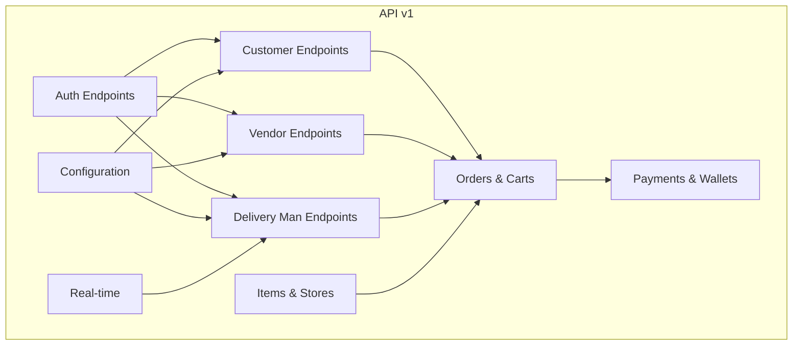
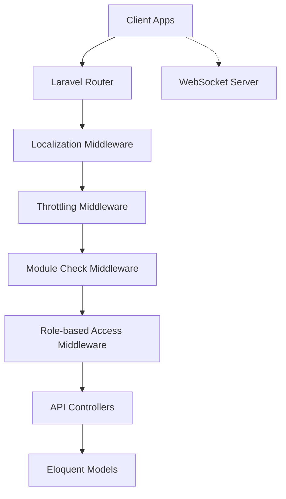
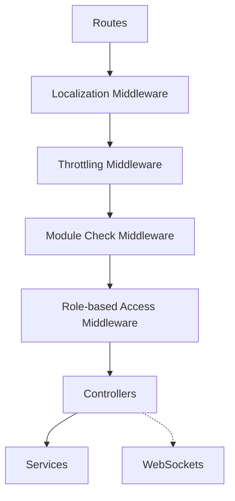
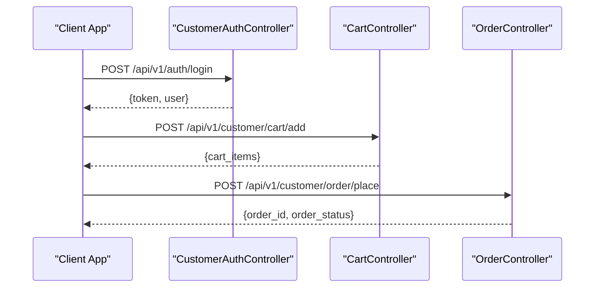
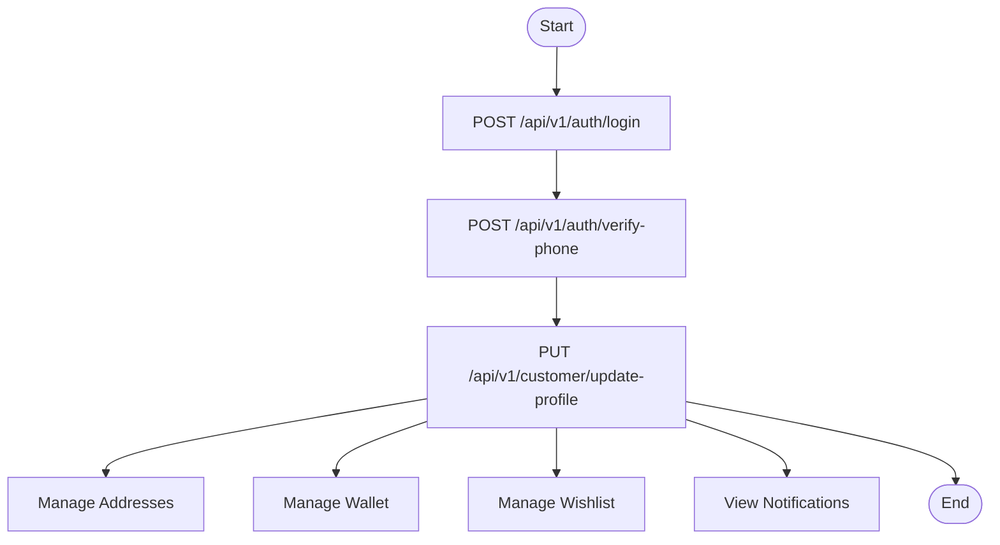
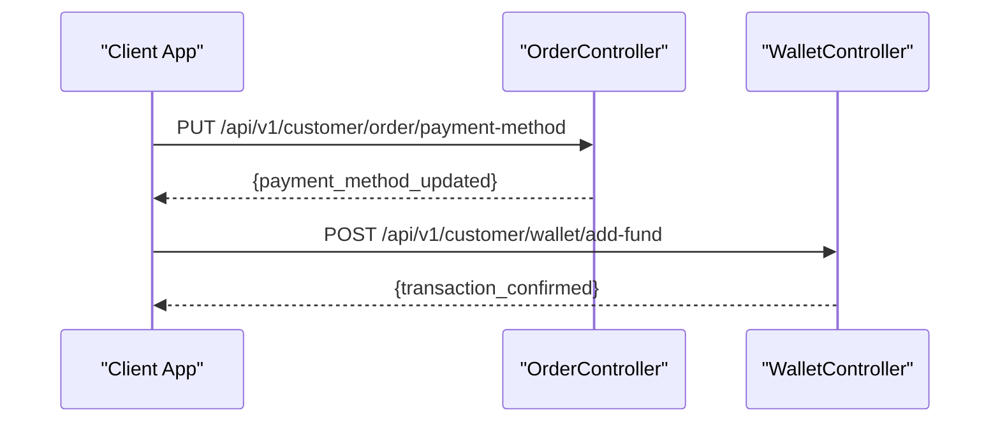
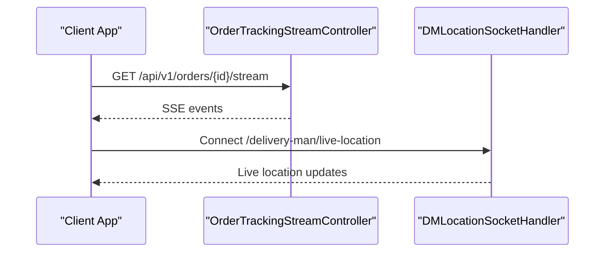

# API Documentation

<cite>
**Referenced Files in This Document**
- [routes/api/v1/api.php](file://routes/api/v1/api.php)
- [routes/web.php](file://routes/web.php)
- [routes/admin.php](file://routes/admin.php)
- [routes/vendor.php](file://routes/vendor.php)
- [app/Http/Controllers/Api/V1/Auth/CustomerAuthController.php](file://app/Http/Controllers/Api/V1/Auth/CustomerAuthController.php)
- [app/Http/Controllers/Api/V1/CustomerController.php](file://app/Http/Controllers/Api/V1/CustomerController.php)
- [app/Http/Controllers/Api/V1/OrderController.php](file://app/Http/Controllers/Api/V1/OrderController.php)
- [app/Http/Controllers/Api/V1/CartController.php](file://app/Http/Controllers/Api/V1/CartController.php)
- [app/Http/Controllers/Api/V1/DeliverymanController.php](file://app/Http/Controllers/Api/V1/DeliverymanController.php)
- [app/Http/Controllers/Api/V1/Vendor/VendorController.php](file://app/Http/Controllers/Api/V1/Vendor/VendorController.php)
- [app/Http/Controllers/Api/V1/ItemController.php](file://app/Http/Controllers/Api/V1/ItemController.php)
- [app/Http/Controllers/Api/V1/StoreController.php](file://app/Http/Controllers/Api/V1/StoreController.php)
- [app/Http/Controllers/Api/V1/CategoryController.php](file://app/Http/Controllers/Api/V1/CategoryController.php)
- [app/Http/Controllers/Api/V1/ConfigController.php](file://app/Http/Controllers/Api/V1/ConfigController.php)
- [app/Http/Controllers/Api/V1/ConversationController.php](file://app/Http/Controllers/Api/V1/ConversationController.php)
- [app/Http/Controllers/Api/V1/WishlistController.php](file://app/Http/Controllers/Api/V1/WishlistController.php)
- [app/Http/Controllers/Api/V1/WalletController.php](file://app/Http/Controllers/Api/V1/WalletController.php)
- [app/Http/Controllers/Api/V1/XpController.php](file://app/Http/Controllers/Api/V1/XpController.php)
- [app/Http/Controllers/Api/V1/LiveActivityController.php](file://app/Http/Controllers/Api/V1/LiveActivityController.php)
- [app/Http/Controllers/Api/V1/ExternalConfigurationController.php](file://app/Http/Controllers/Api/V1/ExternalConfigurationController.php)
- [app/Http/Controllers/Api/V1/ZoneController.php](file://app/Http/Controllers/Api/V1/ZoneController.php)
- [app/Http/Controllers/Api/V1/AddonCategoryController.php](file://app/Http/Controllers/Api/V1/AddonCategoryController.php)
- [app/Http/Controllers/Api/V1/TestimonialController.php](file://app/Http/Controllers/Api/V1/TestimonialController.php)
- [app/Http/Controllers/Api/V1/ModuleController.php](file://app/Http/Controllers/Api/V1/ModuleController.php)
- [app/Http/Controllers/Api/V1/NewsletterController.php](file://app/Http/Controllers/Api/V1/NewsletterController.php)
- [app/Http/Controllers/Api/V1/BrandController.php](file://app/Http/Controllers/Api/V1/BrandController.php)
- [app/Http/Controllers/Api/V1/CampaignController.php](file://app/Http/Controllers/Api/V1/CampaignController.php)
- [app/Http/Controllers/Api/V1/FlashSaleController.php](file://app/Http/Controllers/Api/V1/FlashSaleController.php)
- [app/Http/Controllers/Api/V1/CouponController.php](file://app/Http/Controllers/Api/V1/CouponController.php)
- [app/Http/Controllers/Api/V1/CashBackController.php](file://app/Http/Controllers/Api/V1/CashBackController.php)
- [app/Http/Controllers/Api/V1/ParcelCategoryController.php](file://app/Http/Controllers/Api/V1/ParcelCategoryController.php)
- [app/Http/Controllers/Api/V1/AdvertisementController.php](file://app/Http/Controllers/Api/V1/AdvertisementController.php)
- [app/Http/Controllers/Api/V1/ReportController.php](file://app/Http/Controllers/Api/V1/ReportController.php)
- [app/Http/Controllers/Api/V1/WithdrawMethodController.php](file://app/Http/Controllers/Api/V1/WithdrawMethodController.php)
- [app/Http/Controllers/Api/V1/SubscriptionController.php](file://app/Http/Controllers/Api/V1/SubscriptionController.php)
- [app/Http/Controllers/Api/V1/POSController.php](file://app/Http/Controllers/Api/V1/POSController.php)
- [app/Http/Controllers/Api/V1/UnitController.php](file://app/Http/Controllers/Api/V1/UnitController.php)
- [app/Http/Controllers/Api/V1/AttributeController.php](file://app/Http/Controllers/Api/V1/AttributeController.php)
- [app/Http/Controllers/Api/V1/AddOnController.php](file://app/Http/Controllers/Api/V1/AddOnController.php)
- [app/Http/Controllers/Api/V1/BannerController.php](file://app/Http/Controllers/Api/V1/BannerController.php)
- [app/Http/Controllers/Api/V1/DeliveryManController.php](file://app/Http/Controllers/Api/V1/DeliveryManController.php)
- [app/Http/Controllers/Api/V1/EmployeeController.php](file://app/Http/Controllers/Api/V1/EmployeeController.php)
- [app/Http/Controllers/Api/V1/CustomRoleController.php](file://app/Http/Controllers/Api/V1/CustomRoleController.php)
- [app/Http/Controllers/Api/V1/ItemController.php](file://app/Http/Controllers/Api/V1/ItemController.php)
- [app/Http/Controllers/Api/V1/CategoryController.php](file://app/Http/Controllers/Api/V1/CategoryController.php)
- [app/Http/Controllers/Api/V1/CommonConditionController.php](file://app/Http/Controllers/Api/V1/CommonConditionController.php)
- [app/Http/Controllers/Api/V1/SearchController.php](file://app/Http/Controllers/Api/V1/SearchController.php)
- [app/WebSockets/Handler/DMLocationSocketHandler.php](file://app/WebSockets/Handler/DMLocationSocketHandler.php)
</cite>

## Table of Contents
1. [Introduction](#introduction)
2. [Project Structure](#project-structure)
3. [Core Components](#core-components)
4. [Architecture Overview](#architecture-overview)
5. [Detailed Component Analysis](#detailed-component-analysis)
6. [Dependency Analysis](#dependency-analysis)
7. [Performance Considerations](#performance-considerations)
8. [Troubleshooting Guide](#troubleshooting-guide)
9. [Conclusion](#conclusion)
10. [Appendices](#appendices)

## Introduction
This document provides comprehensive API documentation for Waddy Back's RESTful API, covering customer, vendor, delivery man, and admin interfaces. It details HTTP methods, URL patterns, request/response schemas, authentication requirements, API versioning strategy, rate limiting, error handling patterns, and includes practical examples for order placement, user management, payment processing, and real-time features. It also outlines WebSocket endpoints for live tracking and streaming updates, along with client implementation guidelines and integration best practices.

## Project Structure
The API is organized under the `routes/api/v1/api.php` file, which groups endpoints by functional domains such as authentication, customer, vendor, delivery man, items, stores, orders, carts, payments, and configuration. Middleware stacks enforce localization, throttling, module checks, and role-based access control. Real-time features are exposed via Laravel WebSockets for delivery man location tracking.

**Diagram sources**
- [routes/api/v1/api.php:18-546](file://routes/api/v1/api.php#L18-L546)

**Section sources**
- [routes/api/v1/api.php:18-546](file://routes/api/v1/api.php#L18-L546)

## Core Components
- Authentication: Customer, vendor, and delivery man login/registration with OTP, phone/email verification, and social login support.
- Customer Management: Profile updates, addresses, wishlists, loyalty points, wallet transactions, XP leveling system, and live activity tokens.
- Vendor Management: Store profile, order management, campaigns, coupons, banners, items, schedules, and reports.
- Delivery Man Management: Profile, order acceptance, status updates, location recording, and payment reconciliation.
- Orders & Carts: Order placement, cancellation, refunds, tracking, cart management, and tax/surge calculations.
- Payments & Wallets: Cash on delivery, partial payments, collected cash payments, wallet adjustments, and withdrawal methods.
- Configuration & Discovery: Zones, categories, brands, campaigns, flash sales, coupons, cashback, and external configurations.
- Real-time Features: WebSocket for live delivery man location tracking.

**Section sources**
- [routes/api/v1/api.php:42-76](file://routes/api/v1/api.php#L42-L76)
- [routes/api/v1/api.php:334-440](file://routes/api/v1/api.php#L334-L440)
- [routes/api/v1/api.php:153-304](file://routes/api/v1/api.php#L153-L304)
- [routes/api/v1/api.php:95-151](file://routes/api/v1/api.php#L95-L151)
- [routes/api/v1/api.php:306-333](file://routes/api/v1/api.php#L306-L333)

## Architecture Overview
The API follows a layered architecture:
- Routing layer: Groups endpoints by domain and applies middleware for localization, throttling, module checks, and role-based access.
- Controller layer: Implements business logic for each domain (auth, customer, vendor, delivery man, orders, etc.).
- Model layer: Interacts with the database through Eloquent models and repositories.
- Real-time layer: Uses Laravel WebSockets for live delivery man location streaming.

**Diagram sources**
- [routes/api/v1/api.php:18-546](file://routes/api/v1/api.php#L18-L546)
- [app/WebSockets/Handler/DMLocationSocketHandler.php](file://app/WebSockets/Handler/DMLocationSocketHandler.php)

**Section sources**
- [routes/api/v1/api.php:18-546](file://routes/api/v1/api.php#L18-L546)

## Detailed Component Analysis

### Authentication Endpoints
- Customer Registration and Login
  - POST `/api/v1/auth/sign-up`: Register a new customer with name, phone, email, and password.
  - POST `/api/v1/auth/login`: Authenticate customer via phone/email and password with field type selection.
  - POST `/api/v1/auth/verify-phone`: Verify OTP for phone/email and finalize login.
  - POST `/api/v1/auth/forgot-password`: Request password reset with throttled OTP.
  - POST `/api/v1/auth/verify-token`: Verify reset token and submit new password.
  - POST `/api/v1/auth/guest/request`: Create guest session for non-authenticated users.
  - POST `/api/v1/auth/social-login`: Social login via Google, Facebook, Apple.
  - POST `/api/v1/auth/social-register`: Social registration flow.

- Delivery Man Authentication
  - POST `/api/v1/delivery-man/auth/login`: Delivery man login with device token.
  - POST `/api/v1/delivery-man/auth/register`: Delivery man registration.
  - POST `/api/v1/delivery-man/auth/forgot-password`: Delivery man password reset.

- Vendor Authentication
  - POST `/api/v1/vendor/auth/login`: Vendor login.
  - POST `/api/v1/vendor/auth/register`: Vendor registration.
  - POST `/api/v1/vendor/auth/forgot-password`: Vendor password reset.

Authentication uses Laravel Sanctum tokens for stateless APIs. OTP verification supports SMS and Firebase OTP verification depending on system settings.

**Section sources**
- [routes/api/v1/api.php:42-76](file://routes/api/v1/api.php#L42-L76)
- [routes/api/v1/api.php:57-72](file://routes/api/v1/api.php#L57-L72)
- [routes/api/v1/api.php:95-104](file://routes/api/v1/api.php#L95-L104)
- [routes/api/v1/api.php:153-171](file://routes/api/v1/api.php#L153-L171)
- [app/Http/Controllers/Api/V1/Auth/CustomerAuthController.php:389-565](file://app/Http/Controllers/Api/V1/Auth/CustomerAuthController.php#L389-L565)

### Customer Endpoints
- Profile Management
  - GET `/api/v1/customer/info`: Retrieve customer profile with membership metrics and interest data.
  - PUT `/api/v1/customer/update-profile`: Update personal info with optional OTP verification.
  - PUT `/api/v1/customer/update-interest`: Update customer interests.
  - PUT `/api/v1/customer/toggle-hide-phone`: Toggle visibility of phone number.
  - POST `/api/v1/customer/live-activity-token`: Store iOS Live Activity token.

- Address Management
  - GET `/api/v1/customer/address/list`: Paginated address list.
  - POST `/api/v1/customer/address/add`: Add new address with geolocation validation.
  - PUT `/api/v1/customer/address/update/{id}`: Update existing address.
  - DELETE `/api/v1/customer/address/delete`: Remove address.

- Messaging
  - GET `/api/v1/customer/message/list`: List conversations.
  - GET `/api/v1/customer/message/search-list`: Search conversations.
  - GET `/api/v1/customer/message/details`: Fetch messages for a conversation.
  - POST `/api/v1/customer/message/send`: Send a message.
  - POST `/api/v1/customer/message/mark-read`: Mark messages as read.

- Wallet and Loyalty
  - GET `/api/v1/customer/wallet/transactions`: Wallet transaction history.
  - GET `/api/v1/customer/wallet/bonuses`: Available wallet bonuses.
  - POST `/api/v1/customer/wallet/add-fund`: Add funds to wallet.
  - POST `/api/v1/customer/wallet/transfer-mart-to-drivemond`: Transfer between wallets.

- XP Leveling System
  - GET `/api/v1/customer/xp/level`: Current XP level.
  - GET `/api/v1/customer/xp/levels`: All XP levels.
  - GET `/api/v1/customer/xp/level-details`: Details for a specific level.
  - GET `/api/v1/customer/xp/history`: XP history.
  - GET `/api/v1/customer/xp/transactions`: XP transactions.
  - GET `/api/v1/customer/xp/challenges`: Available challenges.
  - POST `/api/v1/customer/xp/challenges/{id}/claim`: Claim challenge reward.
  - GET `/api/v1/customer/xp/prizes`: Available prizes.
  - POST `/api/v1/customer/xp/prizes/{id}/claim`: Claim prize.
  - GET `/api/v1/customer/xp/checkout-prizes`: Prizes available at checkout.
  - GET `/api/v1/customer/xp/reward-items`: Reward items.
  - GET `/api/v1/customer/xp/leaderboard`: XP leaderboard.

- Wishlists
  - GET `/api/v1/customer/wish-list/`: Get wishlist items.
  - POST `/api/v1/customer/wish-list/add`: Add item to wishlist.
  - DELETE `/api/v1/customer/wish-list/remove`: Remove item from wishlist.

- Notifications
  - GET `/api/v1/customer/notifications`: Customer notifications.

- Account Management
  - DELETE `/api/v1/customer/remove-account`: Deactivate customer account after completing orders.

**Section sources**
- [routes/api/v1/api.php:334-440](file://routes/api/v1/api.php#L334-L440)
- [app/Http/Controllers/Api/V1/CustomerController.php:176-475](file://app/Http/Controllers/Api/V1/CustomerController.php#L176-L475)

### Vendor Endpoints
- Profile and Store Management
  - GET `/api/v1/vendor/profile`: Vendor profile with earnings summary.
  - PUT `/api/v1/vendor/update-profile`: Update vendor profile.
  - PUT `/api/v1/vendor/update-active-status`: Toggle store open/closed status.
  - GET `/api/v1/vendor/earning-info`: Store earnings summary.
  - GET `/api/v1/vendor/current-orders`: Currently processing orders.
  - GET `/api/v1/vendor/completed-orders`: Completed orders with pagination.
  - GET `/api/v1/vendor/canceled-orders`: Canceled orders with pagination.
  - GET `/api/v1/vendor/all-orders`: Historical orders with pagination.
  - GET `/api/v1/vendor/order-details`: Order details for a specific order.
  - GET `/api/v1/vendor/order`: Specific order details.
  - PUT `/api/v1/vendor/update-order-status`: Update order status with validation.
  - PUT `/api/v1/vendor/update-order-amount`: Adjust order amount.
  - PUT `/api/v1/vendor/send-order-otp`: Send OTP to customer for delivery verification.
  - PUT `/api/v1/vendor/update-fcm-token`: Update FCM push token.
  - GET `/api/v1/vendor/get-withdraw-method-list`: List withdrawal methods.
  - GET `/api/v1/vendor/get-withdraw-list`: Withdrawal requests.
  - GET `/api/v1/vendor/get-items-list`: Items managed by vendor.
  - PUT `/api/v1/vendor/update-bank-info`: Update bank account details.
  - POST `/api/v1/vendor/request-withdraw`: Request withdrawal.

- Business Setup
  - GET `/api/v1/vendor/unit`: Units list.
  - PUT `/api/v1/vendor/update-basic-info`: Update store basic info.
  - PUT `/api/v1/vendor/update-business-setup`: Update store business setup.
  - POST `/api/v1/vendor/schedule/store`: Add store schedule.
  - DELETE `/api/v1/vendor/schedule/{store_schedule}`: Remove store schedule.

- Attributes and Addons
  - GET `/api/v1/vendor/attributes`: Attributes list.
  - Coupon Management:
    - GET `/api/v1/vendor/coupon/list`: List coupons.
    - GET `/api/v1/vendor/coupon/view`: View coupon details.
    - GET `/api/v1/vendor/coupon/view-without-translate`: View coupon without translations.
    - POST `/api/v1/vendor/coupon/store`: Create coupon.
    - POST `/api/v1/vendor/coupon/update`: Update coupon.
    - POST `/api/v1/vendor/coupon/status`: Toggle coupon status.
    - POST `/api/v1/vendor/coupon/delete`: Delete coupon.
    - POST `/api/v1/vendor/coupon/search`: Search coupons.
  - Advertisement Management:
    - GET `/api/v1/vendor/advertisement/`: List advertisements.
    - GET `/api/v1/vendor/advertisement/details/{id}`: View advertisement details.
    - DELETE `/api/v1/vendor/advertisement/delete/{id}`: Delete advertisement.
    - POST `/api/v1/vendor/advertisement/store`: Create advertisement.
    - POST `/api/v1/vendor/advertisement/update/{id}`: Update advertisement.
    - PUT `/api/v1/vendor/advertisement/status`: Toggle advertisement status.
    - POST `/api/v1/vendor/advertisement/copy-add-post`: Copy advertisement.
  - Addon Management:
    - GET `/api/v1/vendor/addon/`: List addons.
    - POST `/api/v1/vendor/addon/store`: Create addon.
    - PUT `/api/v1/vendor/addon/update`: Update addon.
    - GET `/api/v1/vendor/addon/status`: Toggle addon status.
    - DELETE `/api/v1/vendor/addon/delete`: Delete addon.
  - Banner Management:
    - GET `/api/v1/vendor/banner/`: List banners.
    - POST `/api/v1/vendor/banner/store`: Create banner.
    - PUT `/api/v1/vendor/banner/update`: Update banner.
    - GET `/api/v1/vendor/banner/status`: Toggle banner status.
    - DELETE `/api/v1/vendor/banner/delete`: Delete banner.
    - GET `/api/v1/vendor/banner/edit/{id}`: Edit banner details.

- Categories and Items
  - Category Management:
    - GET `/api/v1/vendor/categories/`: List categories.
    - GET `/api/v1/vendor/categories/childes/{category_id}`: Child categories.
    - GET `/api/v1/vendor/categories/category-wise-products/{id}`: Products in category.
  - Delivery Man Management:
    - POST `/api/v1/vendor/delivery-man/store`: Add delivery man.
    - GET `/api/v1/vendor/delivery-man/list`: List delivery men.
    - GET `/api/v1/vendor/delivery-man/preview`: Preview delivery man details.
    - GET `/api/v1/vendor/delivery-man/status`: Toggle delivery man status.
    - POST `/api/v1/vendor/delivery-man/update/{id}`: Update delivery man.
    - DELETE `/api/v1/vendor/delivery-man/delete`: Delete delivery man.
    - POST `/api/v1/vendor/delivery-man/search`: Search delivery men.
  - Item Management:
    - POST `/api/v1/vendor/item/store`: Create item.
    - PUT `/api/v1/vendor/item/update`: Update item.
    - DELETE `/api/v1/vendor/item/delete`: Delete item.
    - GET `/api/v1/vendor/item/status`: Toggle item status.
    - GET `/api/v1/vendor/item/details/{id}`: Item details.
    - POST `/api/v1/vendor/item/search`: Search items.
    - GET `/api/v1/vendor/item/reviews`: Item reviews.
    - PUT `/api/v1/vendor/item/reply-update`: Update reply to review.
    - GET `/api/v1/vendor/item/recommended`: Recommended items.
    - GET `/api/v1/vendor/item/organic`: Organic items.
    - GET `/api/v1/vendor/item/pending/item/list`: Pending items.
    - GET `/api/v1/vendor/item/requested/item/view/{id}`: View requested item.
    - PUT `/api/v1/vendor/item/stock-update`: Update item stock.
    - GET `/api/v1/vendor/item/stock-limit-list`: Stock limit list.

- POS
  - GET `/api/v1/vendor/pos/orders`: POS orders list.
  - POST `/api/v1/vendor/pos/place-order`: Place order via POS.
  - GET `/api/v1/vendor/pos/customers`: Customers list.

- Messaging
  - GET `/api/v1/vendor/message/list`: List conversations.
  - GET `/api/v1/vendor/message/search-list`: Search conversations.
  - GET `/api/v1/vendor/message/details`: Fetch messages for a conversation.
  - POST `/api/v1/vendor/message/send`: Send a message.

- Reports and Subscription
  - GET `/api/v1/vendor/get-expense`: Expense report.
  - GET `/api/v1/vendor/get-tax-report`: Vendor tax report.
  - GET `/api/v1/vendor/get-disbursement-report`: Disbursement report.
  - GET `/api/v1/vendor/subscription-transaction`: Subscription transactions.

- Account Management
  - DELETE `/api/v1/vendor/remove-account`: Deactivate vendor account.

**Section sources**
- [routes/api/v1/api.php:153-304](file://routes/api/v1/api.php#L153-L304)
- [app/Http/Controllers/Api/V1/Vendor/VendorController.php:47-184](file://app/Http/Controllers/Api/V1/Vendor/VendorController.php#L47-L184)

### Delivery Man Endpoints
- Profile and Location
  - GET `/api/v1/delivery-man/profile`: Delivery man profile with ratings and earnings.
  - PUT `/api/v1/delivery-man/update-profile`: Update profile.
  - PUT `/api/v1/delivery-man/update-active-status`: Toggle availability.
  - GET `/api/v1/delivery-man/last-location`: Last recorded location.
  - POST `/api/v1/delivery-man/record-location-data`: Record location data.

- Messaging
  - GET `/api/v1/delivery-man/message/list`: List conversations.
  - GET `/api/v1/delivery-man/message/search-list`: Search conversations.
  - GET `/api/v1/delivery-man/message/details`: Fetch messages for a conversation.
  - POST `/api/v1/delivery-man/message/send`: Send a message.

- Reviews
  - GET `/api/v1/delivery-man/reviews/{delivery_man_id}`: Reviews for delivery man.
  - GET `/api/v1/delivery-man/reviews/rating/{delivery_man_id}`: Average rating.
  - POST `/api/v1/delivery-man/reviews/submit`: Submit review.

- Orders
  - GET `/api/v1/delivery-man/current-orders`: Currently assigned orders.
  - GET `/api/v1/delivery-man/latest-orders`: Latest available orders with pagination.
  - GET `/api/v1/delivery-man/all-orders`: Historical orders.
  - GET `/api/v1/delivery-man/order-delivery-history`: Delivery history for an order.
  - PUT `/api/v1/delivery-man/accept-order`: Accept an order with validation.
  - PUT `/api/v1/delivery-man/update-order-status`: Update order status with OTP verification.
  - PUT `/api/v1/delivery-man/update-payment-status`: Mark order payment as paid.
  - GET `/api/v1/delivery-man/order-details`: Order details.
  - GET `/api/v1/delivery-man/order`: Specific order details.
  - PUT `/api/v1/delivery-man/send-order-otp`: Send OTP to customer.
  - PUT `/api/v1/delivery-man/update-fcm-token`: Update FCM push token.

- Earnings and Withdrawals
  - GET `/api/v1/delivery-man/earning-report`: Earnings report.
  - GET `/api/v1/delivery-man/get-withdraw-method-list`: Withdrawal methods.
  - GET `/api/v1/delivery-man/get-disbursement-report`: Disbursement report.
  - GET `/api/v1/delivery-man/withdraw-method/list`: List withdrawal methods.
  - POST `/api/v1/delivery-man/withdraw-method/store`: Store withdrawal method.
  - POST `/api/v1/delivery-man/withdraw-method/make-default`: Set default withdrawal method.
  - DELETE `/api/v1/delivery-man/withdraw-method/delete`: Delete withdrawal method.
  - POST `/api/v1/delivery-man/make-collected-cash-payment`: Make collected cash payment.
  - POST `/api/v1/delivery-man/make-wallet-adjustment`: Adjust wallet balance.
  - GET `/api/v1/delivery-man/wallet-payment-list`: Wallet payment list.
  - GET `/api/v1/delivery-man/wallet-provided-earning-list`: Provided earning list.

- Account Management
  - DELETE `/api/v1/delivery-man/remove-account`: Deactivate delivery man account.

**Section sources**
- [routes/api/v1/api.php:95-151](file://routes/api/v1/api.php#L95-L151)
- [app/Http/Controllers/Api/V1/DeliverymanController.php:41-112](file://app/Http/Controllers/Api/V1/DeliverymanController.php#L41-L112)

### Orders and Carts
- Order Placement and Management
  - GET `/api/v1/customer/order/list`: Customer order list.
  - GET `/api/v1/customer/order/running-orders`: Running orders with pagination.
  - GET `/api/v1/customer/order/details`: Order details.
  - POST `/api/v1/customer/order/place`: Place a new order.
  - POST `/api/v1/customer/order/get-Tax`: Calculate tax from cart.
  - POST `/api/v1/customer/order/prescription/place`: Place a prescription order.
  - PUT `/api/v1/customer/order/cancel`: Cancel an order with reason.
  - POST `/api/v1/customer/order/refund-request`: Request refund.
  - GET `/api/v1/customer/order/refund-reasons`: Available refund reasons.
  - GET `/api/v1/customer/order/track`: Track order by ID.
  - PUT `/api/v1/customer/order/payment-method`: Change payment method to cash on delivery.
  - PUT `/api/v1/customer/order/offline-payment`: Submit offline payment details.
  - PUT `/api/v1/customer/order/offline-payment-update`: Update offline payment info.
  - POST `/api/v1/customer/order/get-surge-price`: Get surge pricing amount.
  - GET `/api/v1/customer/order/visit-again`: Suggest stores for reordering.
  - POST `/api/v1/customer/order/reorder`: Reorder previous order items.

- Cart Management
  - GET `/api/v1/customer/cart/list`: Cart items with formatting.
  - POST `/api/v1/customer/cart/add`: Add item to cart with variations and addons.
  - POST `/api/v1/customer/cart/update`: Update cart item quantity/price.
  - DELETE `/api/v1/customer/cart/remove-item`: Remove specific cart item.
  - DELETE `/api/v1/customer/cart/remove`: Remove entire cart.

- Order Tracking and History
  - GET `/api/v1/orders/{id}/stream`: Server-Sent Events stream for order tracking (throttled).
  - GET `/api/v1/orders/{id}/tracking-history`: Order tracking history.

**Section sources**
- [routes/api/v1/api.php:411-440](file://routes/api/v1/api.php#L411-L440)
- [routes/api/v1/api.php:431-438](file://routes/api/v1/api.php#L431-L438)
- [routes/web.php:248-258](file://routes/web.php#L248-L258)
- [app/Http/Controllers/Api/V1/OrderController.php:81-149](file://app/Http/Controllers/Api/V1/OrderController.php#L81-L149)
- [app/Http/Controllers/Api/V1/CartController.php:15-232](file://app/Http/Controllers/Api/V1/CartController.php#L15-L232)

### Configuration and Discovery
- Configuration
  - GET `/api/v1/config/`: System configuration.
  - GET `/api/v1/config/get-zone-id`: Get zone ID.
  - GET `/api/v1/config/place-api-autocomplete`: Place autocomplete API settings.
  - GET `/api/v1/config/distance-api`: Distance API settings.
  - GET `/api/v1/config/direction-api`: Direction API settings.
  - GET `/api/v1/config/place-api-details`: Place details API settings.
  - GET `/api/v1/config/geocode-api`: Geocode API settings.
  - GET `/api/v1/config/get-PaymentMethods`: Available payment methods.

- Items and Stores
  - GET `/api/v1/items/latest`: Latest products.
  - GET `/api/v1/items/new-arrival`: New arrival products.
  - GET `/api/v1/items/popular`: Popular products.
  - GET `/api/v1/items/most-reviewed`: Most reviewed products.
  - GET `/api/v1/items/discounted`: Discounted products.
  - GET `/api/v1/items/set-menu`: Set menu items.
  - GET `/api/v1/items/search`: Search products.
  - GET `/api/v1/items/search-suggestion`: Search suggestions.
  - GET `/api/v1/items/details/{id}`: Product details.
  - GET `/api/v1/items/related-items/{item_id}`: Related items.
  - GET `/api/v1/items/related-store-items/{item_id}`: Related store items.
  - GET `/api/v1/items/reviews/{item_id}`: Product reviews.
  - GET `/api/v1/items/rating/{item_id}`: Product average rating.
  - GET `/api/v1/items/recommended`: Recommended items.
  - GET `/api/v1/items/ramadan-featured`: Ramadan featured items.
  - GET `/api/v1/items/basic`: Basic popular products.
  - GET `/api/v1/items/suggested`: Cart suggestion items.
  - GET `/api/v1/items/item-or-store-search`: Item or store search.
  - POST `/api/v1/items/reviews/submit`: Submit product review (authenticated).
  - GET `/api/v1/items/common-conditions`: Common conditions.
  - GET `/api/v1/items/get-products`: Get products.

  - Stores
    - GET `/api/v1/stores/get-stores/{filter_data}`: Filtered stores.
    - GET `/api/v1/stores/latest`: Latest stores.
    - GET `/api/v1/stores/popular`: Popular stores.
    - GET `/api/v1/stores/recommended`: Recommended stores.
    - GET `/api/v1/stores/discounted`: Discounted stores.
    - GET `/api/v1/stores/top-rated`: Top rated stores.
    - GET `/api/v1/stores/popular-items/{id}`: Popular items in store.
    - GET `/api/v1/stores/reviews`: Store reviews.
    - GET `/api/v1/stores/search`: Store search.
    - GET `/api/v1/stores/get-data`: Combined store data.
    - GET `/api/v1/stores/top-offer-near-me`: Top offers near user.
    - GET `/api/v1/stores/similar`: Similar stores.
    - GET `/api/v1/stores/{id}/bundles`: Store bundles.

  - Categories
    - GET `/api/v1/categories/`: Categories list.
    - GET `/api/v1/categories/childes/{category_id}`: Child categories.
    - GET `/api/v1/categories/items/list`: Items in categories.
    - GET `/api/v1/categories/stores/list`: Stores in categories.
    - GET `/api/v1/categories/items/{category_id}`: Items by category.
    - GET `/api/v1/categories/items/{category_id}/all`: All items in category.
    - GET `/api/v1/categories/stores/{category_id}`: Stores by category.
    - GET `/api/v1/categories/featured/items`: Featured category items.
    - GET `/api/v1/categories/popular`: Popular categories.

  - Common Conditions
    - GET `/api/v1/common-condition/`: Conditions list.
    - GET `/api/v1/common-condition/list`: Common condition list.
    - GET `/api/v1/common-condition/items/{condition_id}`: Items by condition.

  - Brands
    - GET `/api/v1/brand/`: Brands list.
    - GET `/api/v1/brand/items/{brand_id}`: Items by brand.

  - Campaigns and Flash Sales
    - GET `/api/v1/campaigns/basic`: Basic campaigns.
    - GET `/api/v1/campaigns/basic-campaign-details`: Basic campaign details.
    - GET `/api/v1/campaigns/item`: Item campaigns.
    - GET `/api/v1/flash-sales/`: Flash sales list.
    - GET `/api/v1/flash-sales/items`: Flash sale items.

  - Coupons and Cashback
    - GET `/api/v1/coupon/list/all`: All coupons.
    - GET `/api/v1/coupon/list`: Customer coupons (authenticated).
    - GET `/api/v1/coupon/apply`: Apply coupon (authenticated).
    - GET `/api/v1/cashback/list`: Cashback list (authenticated).
    - GET `/api/v1/cashback/getCashback`: Get cashback details (authenticated).

  - Parcel and Advertisement
    - GET `/api/v1/parcel-category`: Parcel categories.
    - GET `/api/v1/advertisement/list`: Advertisement list.

- Additional Configurations
  - GET `/api/v1/testimonial/`: Testimonials list.
  - GET `/api/v1/customer/order/cancellation-reasons`: Cancellation reasons.
  - GET `/api/v1/customer/automated-message`: Automated messages.
  - GET `/api/v1/item/get-generic-name-list`: Generic names list.
  - GET `/api/v1/item/get-allergy-name-list`: Allergy names list.
  - GET `/api/v1/item/get-nutrition-name-list`: Nutrition names list.
  - GET `/api/v1/customer/order/parcel-instructions`: Parcel delivery instructions.
  - GET `/api/v1/most-tips`: Most tips amount.
  - GET `/api/v1/stores/details/{id}`: Store details.

**Section sources**
- [routes/api/v1/api.php:306-541](file://routes/api/v1/api.php#L306-L541)
- [app/Http/Controllers/Api/V1/ItemController.php](file://app/Http/Controllers/Api/V1/ItemController.php)
- [app/Http/Controllers/Api/V1/StoreController.php](file://app/Http/Controllers/Api/V1/StoreController.php)
- [app/Http/Controllers/Api/V1/CategoryController.php](file://app/Http/Controllers/Api/V1/CategoryController.php)
- [app/Http/Controllers/Api/V1/ConfigController.php](file://app/Http/Controllers/Api/V1/ConfigController.php)

### Payments and Wallets
- Wallet Operations
  - GET `/api/v1/customer/wallet/transactions`: Customer wallet transactions.
  - GET `/api/v1/customer/wallet/bonuses`: Customer wallet bonuses.
  - POST `/api/v1/customer/wallet/add-fund`: Add funds to customer wallet.
  - POST `/api/v1/customer/wallet/transfer-mart-to-drivemond`: Transfer between wallets.
  - POST `/api/v1/customer/wallet/transfer-mart-from-drivemond`: Transfer from Drivemond wallet.

- Vendor Wallet Operations
  - POST `/api/v1/vendor/make-collected-cash-payment`: Make collected cash payment.
  - POST `/api/v1/vendor/make-wallet-adjustment`: Adjust vendor wallet.
  - GET `/api/v1/vendor/wallet-payment-list`: Vendor wallet payment list.

- Delivery Man Wallet Operations
  - POST `/api/v1/delivery-man/make-collected-cash-payment`: Make collected cash payment.
  - POST `/api/v1/delivery-man/make-wallet-adjustment`: Adjust delivery man wallet.
  - GET `/api/v1/delivery-man/wallet-payment-list`: Delivery man wallet payment list.
  - GET `/api/v1/delivery-man/wallet-provided-earning-list`: Provided earning list.

- Withdrawal Methods
  - GET `/api/v1/vendor/get-withdraw-method-list`: Vendor withdrawal methods.
  - GET `/api/v1/vendor/withdraw-method/list`: Vendor withdrawal methods list.
  - POST `/api/v1/vendor/withdraw-method/store`: Store vendor withdrawal method.
  - POST `/api/v1/vendor/withdraw-method/make-default`: Set default vendor withdrawal method.
  - DELETE `/api/v1/vendor/withdraw-method/delete`: Delete vendor withdrawal method.

  - Delivery Man Withdrawal Methods
    - GET `/api/v1/delivery-man/get-withdraw-method-list`: Delivery man withdrawal methods.
    - GET `/api/v1/delivery-man/withdraw-method/list`: Delivery man withdrawal methods list.
    - POST `/api/v1/delivery-man/withdraw-method/store`: Store delivery man withdrawal method.
    - POST `/api/v1/delivery-man/withdraw-method/make-default`: Set default delivery man withdrawal method.
    - DELETE `/api/v1/delivery-man/withdraw-method/delete`: Delete delivery man withdrawal method.

- Reports
  - GET `/api/v1/vendor/get-disbursement-report`: Vendor disbursement report.
  - GET `/api/v1/vendor/get-expense`: Vendor expense report.
  - GET `/api/v1/vendor/get-tax-report`: Vendor tax report.

**Section sources**
- [routes/api/v1/api.php:184-191](file://routes/api/v1/api.php#L184-L191)
- [routes/api/v1/api.php:129-141](file://routes/api/v1/api.php#L129-L141)
- [routes/api/v1/api.php:306-333](file://routes/api/v1/api.php#L306-L333)

### Real-time Features
- WebSocket Endpoint
  - WebSocket `/delivery-man/live-location`: Live delivery man location tracking using Laravel WebSockets.

- Server-Sent Events (SSE)
  - GET `/api/v1/orders/{id}/stream`: Stream order tracking updates for guests or authenticated users.

**Section sources**
- [routes/api/v1/api.php:545](file://routes/api/v1/api.php#L545)
- [routes/web.php:248-258](file://routes/web.php#L248-L258)

## Dependency Analysis
The API relies on several middleware and services:
- Localization middleware ensures locale-specific responses.
- Throttling middleware protects endpoints from abuse (e.g., auth, OTP).
- Module check middleware validates module permissions.
- Role-based access control ensures endpoints are accessible only by authorized roles (customer, vendor, delivery man).
- Real-time features depend on Laravel WebSockets for live location updates.

**Diagram sources**
- [routes/api/v1/api.php:18-546](file://routes/api/v1/api.php#L18-L546)

**Section sources**
- [routes/api/v1/api.php:18-546](file://routes/api/v1/api.php#L18-L546)

## Performance Considerations
- Use pagination for lists (orders, items, stores, etc.) to limit payload sizes.
- Apply throttling on sensitive endpoints (auth, OTP) to prevent abuse.
- Leverage caching for frequently accessed configuration data.
- Optimize image uploads and storage using appropriate disk settings.
- Use database indexing on frequently queried fields (e.g., order status, user ID).

## Troubleshooting Guide
- Authentication Failures
  - Ensure correct credentials and field types for login.
  - Verify OTP verification steps for phone/email.
  - Confirm social login provider credentials and scopes.

- Order Management Issues
  - Validate order status transitions according to system rules.
  - Check payment method availability and COD settings.
  - Ensure delivery man availability and cash-in-hand limits.

- Real-time Updates
  - Verify WebSocket connection and token validity.
  - Confirm SSE endpoint access for guest tracking.

- Error Handling Patterns
  - API responses include structured errors with codes and messages.
  - Validation errors return 403 with formatted error arrays.
  - Resource not found returns 404 with appropriate messages.

**Section sources**
- [app/Http/Controllers/Api/V1/Auth/CustomerAuthController.php:33-248](file://app/Http/Controllers/Api/V1/Auth/CustomerAuthController.php#L33-L248)
- [app/Http/Controllers/Api/V1/OrderController.php:34-79](file://app/Http/Controllers/Api/V1/OrderController.php#L34-L79)
- [app/Http/Controllers/Api/V1/DeliverymanController.php:257-373](file://app/Http/Controllers/Api/V1/DeliverymanController.php#L257-L373)

## Conclusion
Waddy Back's API provides a comprehensive, modular, and secure RESTful interface for customers, vendors, delivery men, and admins. It emphasizes robust authentication, real-time capabilities, and flexible order management. By following the documented endpoints, request/response schemas, and integration guidelines, clients can build reliable applications that leverage the platform's features effectively.

## Appendices

### API Versioning Strategy
- Base Path: `/api/v1`
- Future versions: `/api/v2` and beyond for breaking changes.

**Section sources**
- [routes/api/v1/api.php:18-546](file://routes/api/v1/api.php#L18-L546)

### Rate Limiting
- Authentication endpoints use throttling middleware for OTP and auth requests.
- Order tracking SSE endpoint is throttled to 60 requests per minute.

**Section sources**
- [routes/api/v1/api.php:42-76](file://routes/api/v1/api.php#L42-L76)
- [routes/web.php:248-258](file://routes/web.php#L248-L258)

### Error Handling Patterns
- Validation failures return 403 with an errors array containing code and message.
- Resource not found returns 404 with an errors array.
- Unauthorized access returns 401 with an errors array.

**Section sources**
- [app/Http/Controllers/Api/V1/CartController.php:17-23](file://app/Http/Controllers/Api/V1/CartController.php#L17-L23)
- [app/Http/Controllers/Api/V1/OrderController.php:36-78](file://app/Http/Controllers/Api/V1/OrderController.php#L36-L78)

### Examples

#### Order Placement Flow

**Diagram sources**
- [routes/api/v1/api.php:42-76](file://routes/api/v1/api.php#L42-L76)
- [routes/api/v1/api.php:431-438](file://routes/api/v1/api.php#L431-L438)
- [routes/api/v1/api.php:762-769](file://routes/api/v1/api.php#L762-L769)

#### User Management Flow

**Diagram sources**
- [routes/api/v1/api.php:42-76](file://routes/api/v1/api.php#L42-L76)
- [routes/api/v1/api.php:334-440](file://routes/api/v1/api.php#L334-L440)

#### Payment Processing Flow

**Diagram sources**
- [routes/api/v1/api.php:318-382](file://routes/api/v1/api.php#L318-L382)
- [routes/api/v1/api.php:377-384](file://routes/api/v1/api.php#L377-L384)

#### Real-time Tracking Flow

**Diagram sources**
- [routes/web.php:248-258](file://routes/web.php#L248-L258)
- [routes/api/v1/api.php:545](file://routes/api/v1/api.php#L545)

### Client Implementation Guidelines
- Use bearer tokens for authenticated endpoints.
- Implement retry logic with exponential backoff for rate-limited requests.
- Cache frequently accessed configuration data.
- Handle SSE gracefully with automatic reconnects.
- Validate all responses against documented schemas.

### SDK Usage Examples
- Authentication: Use login endpoints to obtain tokens; store securely.
- Orders: Use cart endpoints to manage items, then place orders.
- Payments: Use wallet endpoints for adding funds and transfers.
- Real-time: Subscribe to SSE streams and WebSocket channels for live updates.