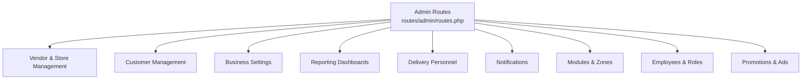
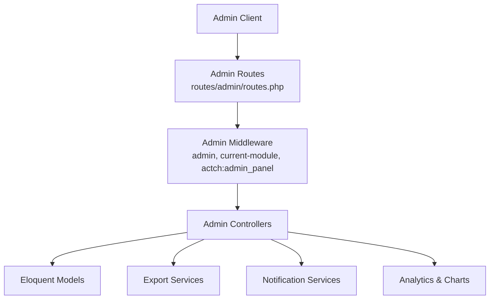
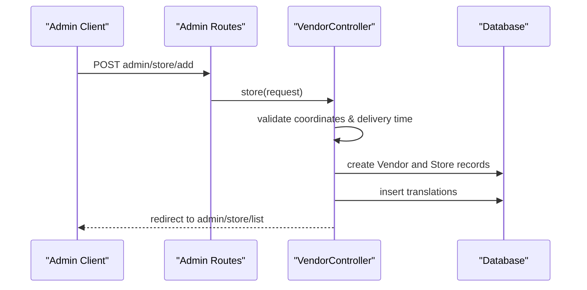
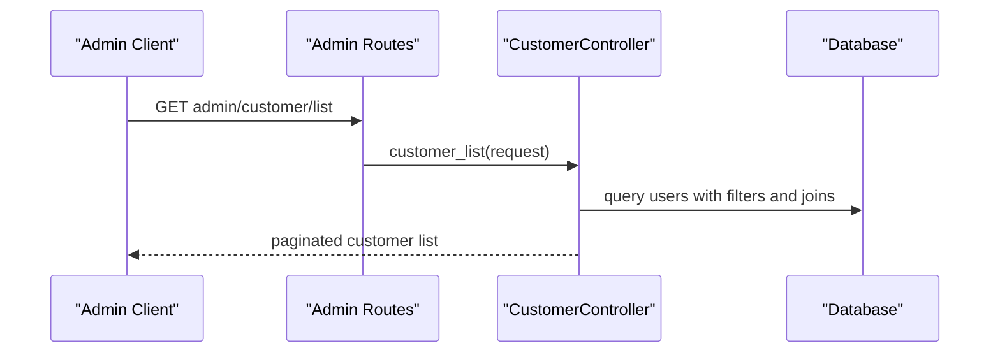
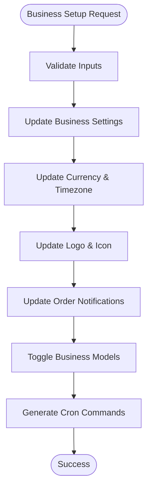
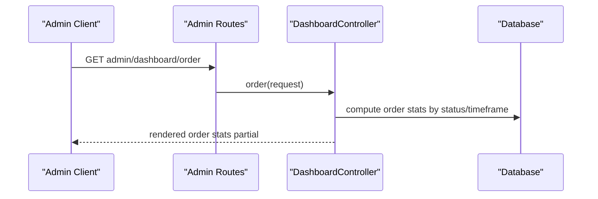
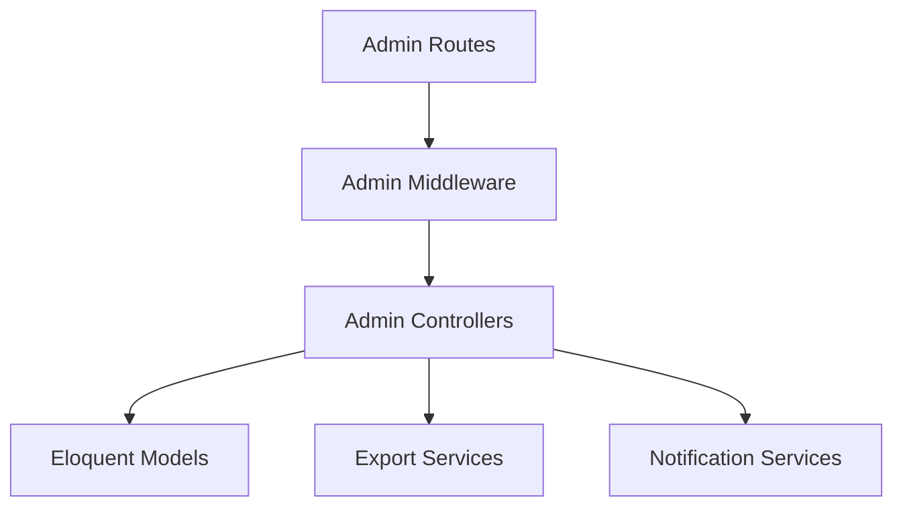

# Admin API

<cite>
**Referenced Files in This Document**
- [routes/admin/routes.php](file://routes/admin/routes.php)
- [public/admin_formatted_routes.json](file://public/admin_formatted_routes.json)
- [app/Http/Controllers/Admin/DashboardController.php](file://app/Http/Controllers/Admin/DashboardController.php)
- [app/Http/Controllers/Admin/VendorController.php](file://app/Http/Controllers/Admin/VendorController.php)
- [app/Http/Controllers/Admin/CustomerController.php](file://app/Http/Controllers/Admin/CustomerController.php)
- [app/Http/Controllers/Admin/BusinessSettingsController.php](file://app/Http/Controllers/Admin/BusinessSettingsController.php)
</cite>

## Table of Contents
1. [Introduction](#introduction)
2. [Project Structure](#project-structure)
3. [Core Components](#core-components)
4. [Architecture Overview](#architecture-overview)
5. [Detailed Component Analysis](#detailed-component-analysis)
6. [Dependency Analysis](#dependency-analysis)
7. [Performance Considerations](#performance-considerations)
8. [Troubleshooting Guide](#troubleshooting-guide)
9. [Conclusion](#conclusion)

## Introduction
This document provides comprehensive administrative API documentation for managing stores, vendors, delivery personnel, customers, business settings, and reporting. It consolidates administrative endpoints organized under the admin namespace, focusing on user management, order supervision, financial reporting, system configuration, and business oversight. The documentation includes endpoint categories, typical request/response patterns, and operational guidance derived from the route definitions and controller implementations.

## Project Structure
Administrative functionality is primarily exposed via the admin namespace with middleware-driven access control and module-specific routing. Key areas include:
- Vendor and store management (approval, listing, transactions)
- Customer management (lists, status updates, exports)
- Business settings (operational parameters, notifications, disbursement configuration)
- Reporting dashboards (order statistics, user overview, commission charts)
- Delivery personnel management (lists, earnings, reviews, vehicle management)

**Diagram sources**
- [routes/admin/routes.php:44-369](file://routes/admin/routes.php#L44-L369)

**Section sources**
- [routes/admin/routes.php:44-369](file://routes/admin/routes.php#L44-L369)

## Core Components
This section outlines the primary administrative domains and representative endpoints.

- Vendor and Store Management
  - Store creation, updates, deletion, and bulk operations
  - Pending/denied store requests and approvals
  - Store transactions, reviews, and disbursement history
  - Store metadata and subscription/business plan management

- Customer Management
  - Customer lists with filters and sorting
  - Customer status updates and notifications
  - Customer order and trip exports
  - Subscribed customer lists and exports

- Business Settings
  - Operational parameters (delivery charges, free delivery thresholds, additional charges)
  - Priority lists and landing page configurations
  - Disbursement scheduling for stores and delivery personnel
  - Order cancellation reasons and refund settings
  - Automated messages and websocket configurations

- Reporting Dashboards
  - Order statistics by status and timeframes
  - User overview charts and commission breakdowns
  - Zone-specific and module-specific analytics

- Delivery Personnel Management
  - Delivery men lists, status, earnings, and applications
  - Vehicle registration and status management
  - Reviews and messaging capabilities

- Notifications and Promotions
  - Notification creation, updates, and status toggles
  - Advertisement management (status, paid status, priority)
  - Promotional banners and why-choose sections

- Modules and Zones
  - Zone coordinate retrieval and filter operations
  - Module setup, type selection, and search
  - Surge pricing management per zone

- Employees and Roles
  - Custom roles creation, updates, and deletions
  - Employee listing, search, and exports

- Promotions and Cashback
  - Cashback program management
  - Wallet bonus promotions

**Section sources**
- [routes/admin/routes.php:49-369](file://routes/admin/routes.php#L49-L369)

## Architecture Overview
The admin interface leverages Laravel controllers to handle administrative tasks. Routes are grouped under the admin namespace with middleware enforcing admin access and module activation checks. Controllers orchestrate data retrieval, validation, and export operations.

**Diagram sources**
- [routes/admin/routes.php:44-369](file://routes/admin/routes.php#L44-L369)

## Detailed Component Analysis

### Vendor and Store Management
Endpoints support store lifecycle management, approval workflows, and transaction oversight.

Representative endpoints:
- GET admin/store/get-store-ratings
- GET admin/store/list
- GET admin/store/pending-requests
- GET admin/store/deny-requests
- GET admin/store/{id}/view
- POST admin/store/add
- PUT admin/store/update/{id}
- DELETE admin/store/delete/{id}
- GET admin/store/{id}/transactions
- GET admin/store/{id}/reviews
- GET admin/store/{id}/disbursements
- GET admin/store/{id}/business-plan

Processing logic:
- Store creation validates coordinates against zones and enforces minimum delivery time constraints.
- Updates handle optional password changes and image updates.
- Deletion ensures no active orders are present and cleans associated resources.
- Store view supports tabs for settings, orders, products, discounts, transactions, reviews, conversations, meta-data, disbursements, and business plans.

**Diagram sources**
- [routes/admin/routes.php:55-56](file://routes/admin/routes.php#L55-L56)
- [app/Http/Controllers/Admin/VendorController.php:64-208](file://app/Http/Controllers/Admin/VendorController.php#L64-L208)

**Section sources**
- [routes/admin/routes.php:55-56](file://routes/admin/routes.php#L55-L56)
- [app/Http/Controllers/Admin/VendorController.php:64-208](file://app/Http/Controllers/Admin/VendorController.php#L64-L208)

### Customer Management
Endpoints manage customer lists, status updates, and exports.

Representative endpoints:
- GET admin/customer/list
- GET admin/customer/{id}/view
- POST admin/customer/status/{id}
- GET admin/customer/subscribed
- GET admin/customer/export
- GET admin/customer/order-export
- GET admin/customer/trip-export

Processing logic:
- Customer list supports search, join date range, order date range, and sorting by counts or amounts.
- Status updates revoke tokens and send push notifications and emails when enabled.
- Exports support Excel and CSV formats for customer lists and orders/trips.

**Diagram sources**
- [routes/admin/routes.php:294-306](file://routes/admin/routes.php#L294-L306)
- [app/Http/Controllers/Admin/CustomerController.php:30-134](file://app/Http/Controllers/Admin/CustomerController.php#L30-L134)

**Section sources**
- [routes/admin/routes.php:294-306](file://routes/admin/routes.php#L294-L306)
- [app/Http/Controllers/Admin/CustomerController.php:30-134](file://app/Http/Controllers/Admin/CustomerController.php#L30-L134)

### Business Settings
Endpoints configure operational parameters, priorities, disbursement schedules, and notifications.

Representative endpoints:
- GET admin/business-settings/business-setup
- POST admin/business-settings/business-setup
- GET admin/business-settings/priority
- POST admin/business-settings/priority/update
- GET admin/business-settings/disbursement
- POST admin/business-settings/disbursement/update
- GET admin/business-settings/order
- GET admin/business-settings/refund-settings
- GET admin/business-settings/automated-message
- GET admin/business-settings/websocket
- POST admin/business-settings/websocket/update

Processing logic:
- Business setup updates currency, timezone, logo, icon, phone, email, address, footer, cookies text, order confirmation model, partial payment settings, admin commission, country, default location, order notifications, free delivery thresholds, additional charges, guest checkout, time format, and business model toggles.
- Priority settings update default statuses and sort-by options for various lists.
- Disbursement settings configure automated cron commands for store and delivery personnel disbursements.
- Order cancellation reasons and refund settings manage policy configurations.

**Diagram sources**
- [app/Http/Controllers/Admin/BusinessSettingsController.php:506-716](file://app/Http/Controllers/Admin/BusinessSettingsController.php#L506-L716)

**Section sources**
- [app/Http/Controllers/Admin/BusinessSettingsController.php:506-716](file://app/Http/Controllers/Admin/BusinessSettingsController.php#L506-L716)

### Reporting Dashboards
Endpoints render dashboard widgets and statistics.

Representative endpoints:
- GET admin/dashboard
- GET admin/dashboard/order
- GET admin/dashboard/zone
- GET admin/dashboard/user-overview
- GET admin/dashboard/commission-overview

Processing logic:
- Dashboard renders order statistics, user overview charts, monthly earnings, and zone-specific insights.
- Filters include zone, module, and statistics timeframe selections.

**Diagram sources**
- [routes/admin/routes.php:253-282](file://routes/admin/routes.php#L253-L282)
- [app/Http/Controllers/Admin/DashboardController.php:253-282](file://app/Http/Controllers/Admin/DashboardController.php#L253-L282)

**Section sources**
- [routes/admin/routes.php:253-282](file://routes/admin/routes.php#L253-L282)
- [app/Http/Controllers/Admin/DashboardController.php:253-282](file://app/Http/Controllers/Admin/DashboardController.php#L253-L282)

### Delivery Personnel Management
Endpoints manage delivery personnel profiles, status, earnings, applications, vehicles, reviews, and messaging.

Representative endpoints:
- GET admin/delivery-man/get-deliverymen
- GET admin/delivery-man/account-data/{id}
- GET admin/delivery-man/add
- POST admin/delivery-man/add
- GET admin/delivery-man/list
- GET admin/delivery-man/new
- GET admin/delivery-man/deny
- GET admin/delivery-man/{id}/preview
- GET admin/delivery-man/status/{id}/{status}
- GET admin/delivery-man/earning/{id}/{status}
- GET admin/delivery-man/application/{id}/{status}
- GET admin/delivery-man/edit/{id}
- POST admin/delivery-man/update/{id}
- DELETE admin/delivery-man/delete/{id}
- POST admin/delivery-man/search
- POST admin/delivery-man/active-search
- GET admin/delivery-man/export
- GET admin/delivery-man/earning-export
- GET admin/delivery-man/review-export
- GET admin/delivery-man/message-view/{conversation_id}/{user_id}
- GET admin/delivery-man/message-list-search
- Group: Vehicle Management
  - GET admin/delivery-man/vehicle/list
  - GET admin/delivery-man/vehicle/create
  - POST admin/delivery-man/vehicle/store
  - GET admin/delivery-man/vehicle/edit/{id}
  - POST admin/delivery-man/vehicle/update/{id}
  - DELETE admin/delivery-man/vehicle/delete/{id}
  - GET admin/delivery-man/vehicle/status/{id}/{status}
  - GET admin/delivery-man/vehicle/view/{id}

Processing logic:
- Delivery men lists support search and active search.
- Status updates toggle availability and application status.
- Vehicle management handles CRUD operations and status toggles.
- Reviews and messaging support listing, search, status updates, and conversation views.

**Section sources**
- [routes/admin/routes.php:319-365](file://routes/admin/routes.php#L319-L365)

### Notifications and Promotions
Endpoints manage notifications, advertisements, and promotional banners.

Representative endpoints:
- Notifications
  - GET admin/notification/add-new
  - POST admin/notification/store
  - GET admin/notification/edit/{id}
  - POST admin/notification/update/{id}
  - DELETE admin/notification/delete/{id}
  - GET admin/notification/status/{id}/{status}
  - GET admin/notification/export
- Advertisements
  - GET admin/advertisement/
  - GET admin/advertisement/create/
  - GET admin/advertisement/details/{advertisement}
  - GET admin/advertisement/{advertisement}/edit
  - POST admin/advertisement/store
  - PUT admin/advertisement/update/{advertisement}
  - DELETE admin/advertisement/delete/{id}
  - GET admin/advertisement/status
  - GET admin/advertisement/paidStatus
  - GET admin/advertisement/priority
  - GET admin/advertisement/requests
  - GET admin/advertisement/copy-advertisement/{advertisement}
  - GET admin/advertisement/updateDate/{advertisement}
  - POST admin/advertisement/copy-add-post/{advertisement}

Processing logic:
- Notifications support CRUD operations and status toggles.
- Advertisements manage creation, updates, status/paid status/priority, requests, copying, and date updates.

**Section sources**
- [routes/admin/routes.php:145-195](file://routes/admin/routes.php#L145-L195)

### Modules and Zones
Endpoints manage zone coordinates, filters, module setup, and surge pricing.

Representative endpoints:
- GET admin/zone/get-coordinates/{id}
- GET admin/zone/zoneCoordinates/{id?}
- GET admin/business-settings/zone/home
- POST admin/business-settings/zone/store
- GET admin/business-settings/zone/edit/{id}
- POST admin/business-settings/zone/update/{id}
- DELETE admin/business-settings/zone/delete/{id}
- GET admin/business-settings/zone/export/{type}
- GET admin/business-settings/zone/status/{id}/{status}
- GET admin/business-settings/zone/zone-filter/{id}
- GET admin/business-settings/zone/go-module-setup
- GET admin/business-settings/zone/module-setup/{id?}
- POST admin/business-settings/zone/module-update/{id}
- GET admin/business-settings/zone/instruction
- GET admin/business-settings/zone/digital-payment/{id}/{digital_payment}
- GET admin/business-settings/zone/cash-on-delivery/{id}/{cash_on_delivery}
- GET admin/business-settings/zone/offline-payment/{id}/{offline_payment}
- Group: Surge Pricing
  - GET admin/business-settings/zone/surge-price/{zone_id}
  - GET admin/business-settings/zone/surge-price/create/{zone_id}
  - POST admin/business-settings/zone/surge-price/store
  - GET admin/business-settings/zone/surge-price/status/{id}/{status}
  - GET admin/business-settings/zone/surge-price/edit/{id}
  - POST admin/business-settings/zone/surge-price/update/{id}
  - DELETE admin/business-settings/zone/surge-price/delete/{id}

Processing logic:
- Zone endpoints retrieve coordinates and manage zone configurations.
- Module setup supports enabling/disabling modules per zone.
- Surge pricing manages pricing rules per zone with status controls.

**Section sources**
- [routes/admin/routes.php:46-256](file://routes/admin/routes.php#L46-L256)

### Employees and Roles
Endpoints manage custom roles and employees.

Representative endpoints:
- Custom Role
  - GET admin/users/custom-role/add
  - POST admin/users/custom-role/store
  - GET admin/users/custom-role/edit/{id}
  - POST admin/users/custom-role/update/{id}
  - DELETE admin/users/custom-role/delete/{id}
  - POST admin/users/custom-role/search
- Employee
  - GET admin/users/employee/list
  - GET admin/users/employee/add-new
  - POST admin/users/employee/store
  - GET admin/users/employee/edit/{id}
  - POST admin/users/employee/update/{id}
  - DELETE admin/users/employee/delete/{id}
  - POST admin/users/employee/search
  - GET admin/users/employee/export

Processing logic:
- Custom roles support CRUD operations and search.
- Employees support listing, search, and exports.

**Section sources**
- [routes/admin/routes.php:272-291](file://routes/admin/routes.php#L272-L291)

### Promotions and Cashback
Endpoints manage cashback programs and wallet bonuses.

Representative endpoints:
- Cashback
  - GET admin/cashback/add-new
  - POST admin/cashback/store
  - GET admin/cashback/edit/{id}
  - POST admin/cashback/update/{id}
  - DELETE admin/cashback/delete/{id}
  - GET admin/cashback/status/{id}/{status}
- Wallet Bonus
  - GET admin/users/customer/wallet/bonus/add-new
  - POST admin/users/customer/wallet/bonus/store
  - GET admin/users/customer/wallet/bonus/edit/{id}
  - POST admin/users/customer/wallet/bonus/update/{id}
  - DELETE admin/users/customer/wallet/bonus/delete/{id}
  - GET admin/users/customer/wallet/bonus/status/{id}/{status}
  - POST admin/users/customer/wallet/bonus/search

Processing logic:
- Cashback and wallet bonus programs support CRUD operations, status toggles, and search.

**Section sources**
- [routes/admin/routes.php:308-316](file://routes/admin/routes.php#L308-L316)
- [routes/admin/routes.php:294-306](file://routes/admin/routes.php#L294-L306)

## Dependency Analysis
Administrative routes depend on middleware and controllers to enforce permissions and module contexts. Controllers interact with models, exports, and notification services.

**Diagram sources**
- [routes/admin/routes.php:49-369](file://routes/admin/routes.php#L49-L369)

**Section sources**
- [routes/admin/routes.php:49-369](file://routes/admin/routes.php#L49-L369)

## Performance Considerations
- Pagination: Many endpoints use configurable pagination defaults to limit payload sizes.
- Filtering: Controllers apply targeted filters to reduce database load.
- Export operations: Excel/CSV exports process large datasets; ensure server resources are adequate.
- Chart rendering: Dashboard endpoints compute aggregated data; consider caching for frequently accessed metrics.

## Troubleshooting Guide
- Coordinate Validation Failures
  - Symptom: Store creation fails due to coordinates outside the selected zone.
  - Resolution: Verify latitude/longitude fall within the zone polygon and re-submit.

- Delivery Time Constraints
  - Symptom: Store creation blocked for minimum delivery time below threshold.
  - Resolution: Adjust minimum delivery time to meet the required minimum.

- Active Orders Blocking Deletion
  - Symptom: Store deletion prevented while active or accepted orders exist.
  - Resolution: Complete ongoing orders before deleting the store.

- Notification and Email Status
  - Symptom: Customer status change notifications not sent.
  - Resolution: Confirm notification settings and mail configuration are enabled.

- Disbursement Cron Execution
  - Symptom: Automated disbursement not triggering.
  - Resolution: Verify cron command generation and server exec function availability; check manual execution if needed.

**Section sources**
- [app/Http/Controllers/Admin/VendorController.php:96-120](file://app/Http/Controllers/Admin/VendorController.php#L96-L120)
- [app/Http/Controllers/Admin/VendorController.php:246-265](file://app/Http/Controllers/Admin/VendorController.php#L246-L265)
- [app/Http/Controllers/Admin/VendorController.php:368-372](file://app/Http/Controllers/Admin/VendorController.php#L368-L372)
- [app/Http/Controllers/Admin/CustomerController.php:136-201](file://app/Http/Controllers/Admin/CustomerController.php#L136-L201)
- [app/Http/Controllers/Admin/BusinessSettingsController.php:331-409](file://app/Http/Controllers/Admin/BusinessSettingsController.php#L331-L409)

## Conclusion
The admin API provides comprehensive administrative capabilities across vendor/store management, customer oversight, business settings, reporting dashboards, delivery personnel management, notifications, promotions, modules, and zones. Endpoints are structured under the admin namespace with robust middleware protection and module-aware routing. Controllers implement validation, resource cleanup, exports, and integrations with notifications and analytics, ensuring a cohesive administrative experience.