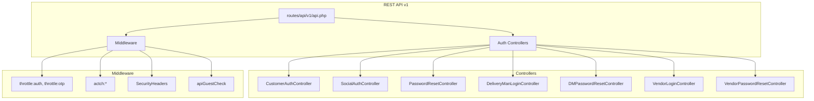
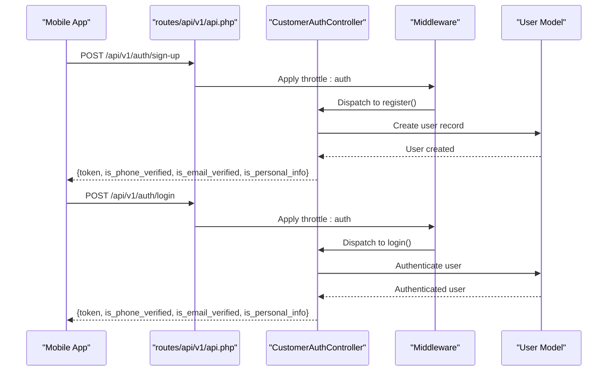
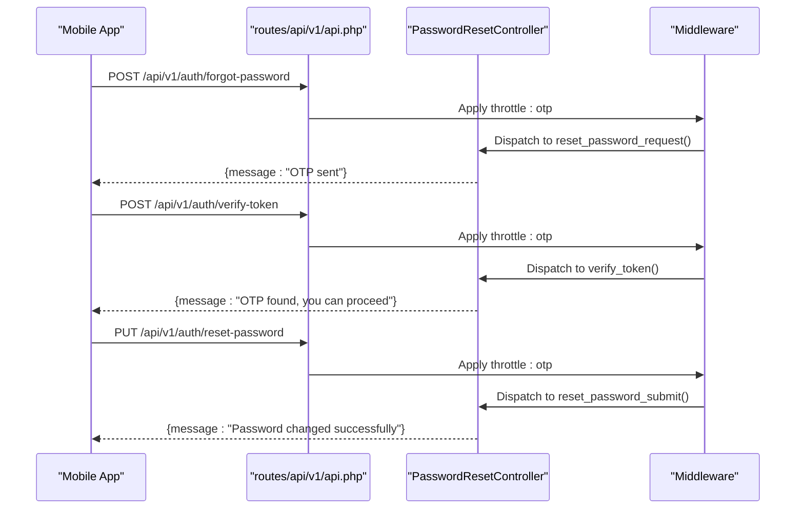
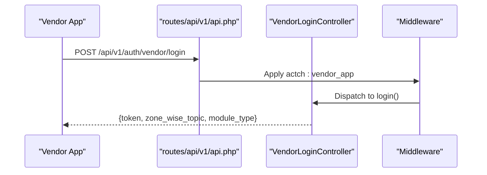
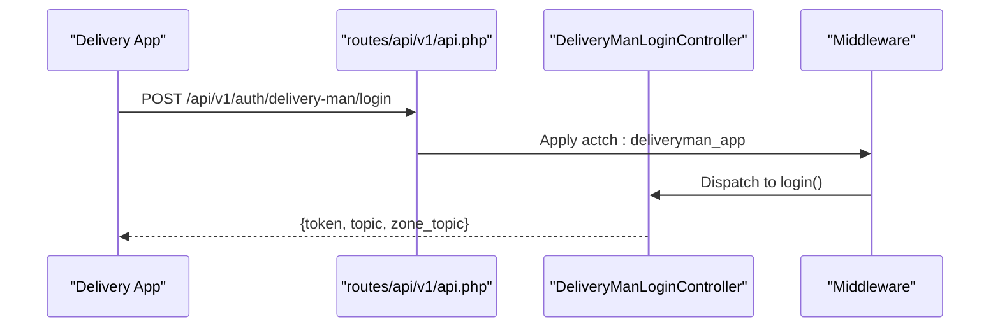
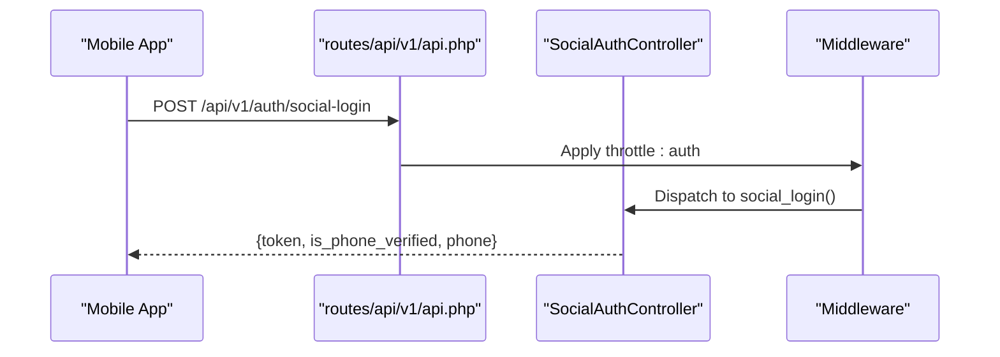
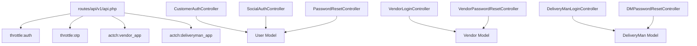

# Authentication API

<cite>
**Referenced Files in This Document**
- [routes/api/v1/api.php](file://routes/api/v1/api.php)
- [app/Http/Controllers/Api/V1/Auth/CustomerAuthController.php](file://app/Http/Controllers/Api/V1/Auth/CustomerAuthController.php)
- [app/Http/Controllers/Api/V1/Auth/SocialAuthController.php](file://app/Http/Controllers/Api/V1/Auth/SocialAuthController.php)
- [app/Http/Controllers/Api/V1/Auth/PasswordResetController.php](file://app/Http/Controllers/Api/V1/Auth/PasswordResetController.php)
- [app/Http/Controllers/Api/V1/Auth/DeliveryManLoginController.php](file://app/Http/Controllers/Api/V1/Auth/DeliveryManLoginController.php)
- [app/Http/Controllers/Api/V1/Auth/DMPasswordResetController.php](file://app/Http/Controllers/Api/V1/Auth/DMPasswordResetController.php)
- [app/Http/Controllers/Api/V1/Auth/VendorLoginController.php](file://app/Http/Controllers/Api/V1/Auth/VendorLoginController.php)
- [app/Http/Controllers/Api/V1/Auth/VendorPasswordResetController.php](file://app/Http/Controllers/Api/V1/Auth/VendorPasswordResetController.php)
- [app/Http/Kernel.php](file://app/Http/Kernel.php)
- [app/Http/Middleware/SecurityHeaders.php](file://app/Http/Middleware/SecurityHeaders.php)
- [app/Http/Middleware/APIGuestMiddleware.php](file://app/Http/Middleware/APIGuestMiddleware.php)
- [app/Http/Middleware/ActivationCheckMiddleware.php](file://app/Http/Middleware/ActivationCheckMiddleware.php)
- [app/Models/User.php](file://app/Models/User.php)
</cite>

## Table of Contents
1. [Introduction](#introduction)
2. [Project Structure](#project-structure)
3. [Core Components](#core-components)
4. [Architecture Overview](#architecture-overview)
5. [Detailed Component Analysis](#detailed-component-analysis)
6. [Dependency Analysis](#dependency-analysis)
7. [Performance Considerations](#performance-considerations)
8. [Troubleshooting Guide](#troubleshooting-guide)
9. [Conclusion](#conclusion)

## Introduction
This document provides comprehensive authentication API documentation for the Waddy backend. It covers customer registration and login, vendor authentication, delivery man authentication, and password reset functionality. The documentation details all authentication endpoints, request/response schemas, token handling, verification mechanisms, and security considerations. It also includes examples for mobile app integration, JWT token handling, and session management, along with rate limiting and throttling configurations.

## Project Structure
The authentication APIs are organized under the REST API v1 routes and grouped by entity:
- Customer authentication: registration, login, phone/email verification, forgot password, social login/register
- Vendor authentication: login and self-registration
- Delivery man authentication: login and self-registration
- Password reset: customer, vendor, and delivery man

**Diagram sources**
- [routes/api/v1/api.php:42-76](file://routes/api/v1/api.php#L42-L76)
- [app/Http/Kernel.php:61-87](file://app/Http/Kernel.php#L61-L87)

**Section sources**
- [routes/api/v1/api.php:42-76](file://routes/api/v1/api.php#L42-L76)
- [app/Http/Kernel.php:61-87](file://app/Http/Kernel.php#L61-L87)

## Core Components
- Customer authentication controller handles sign-up, login, phone/email verification, OTP via Firebase, guest requests, and social login/register.
- Social authentication controller validates external tokens and manages social registration and login.
- Password reset controllers manage OTP generation, verification, and password updates for customers, vendors, and delivery men.
- Vendor and delivery man controllers manage login and self-registration flows with token generation and validation.

Key token mechanisms:
- Customer JWT token creation via Passport Personal Access Tokens
- Vendor and delivery man use custom string tokens stored in respective models

Verification mechanisms:
- Phone/email verification via OTP (SMS or email)
- Firebase phone verification for OTP validation
- Apple/Facebook/Google OAuth token validation

**Section sources**
- [app/Http/Controllers/Api/V1/Auth/CustomerAuthController.php:389-565](file://app/Http/Controllers/Api/V1/Auth/CustomerAuthController.php#L389-L565)
- [app/Http/Controllers/Api/V1/Auth/SocialAuthController.php:25-446](file://app/Http/Controllers/Api/V1/Auth/SocialAuthController.php#L25-L446)
- [app/Http/Controllers/Api/V1/Auth/PasswordResetController.php:25-139](file://app/Http/Controllers/Api/V1/Auth/PasswordResetController.php#L25-L139)
- [app/Http/Controllers/Api/V1/Auth/DeliveryManLoginController.php:17-75](file://app/Http/Controllers/Api/V1/Auth/DeliveryManLoginController.php#L17-L75)
- [app/Http/Controllers/Api/V1/Auth/VendorLoginController.php:29-116](file://app/Http/Controllers/Api/V1/Auth/VendorLoginController.php#L29-L116)

## Architecture Overview
The authentication flow follows a layered architecture:
- Routes define endpoint groups with middleware for throttling, activation checks, and guest access
- Controllers validate inputs, orchestrate business logic, and return structured JSON responses
- Middleware applies security headers, throttling, and guest/session checks
- Models persist tokens and verification records

**Diagram sources**
- [routes/api/v1/api.php:42-55](file://routes/api/v1/api.php#L42-L55)
- [app/Http/Controllers/Api/V1/Auth/CustomerAuthController.php:389-565](file://app/Http/Controllers/Api/V1/Auth/CustomerAuthController.php#L389-L565)

**Section sources**
- [routes/api/v1/api.php:42-76](file://routes/api/v1/api.php#L42-L76)
- [app/Http/Controllers/Api/V1/Auth/CustomerAuthController.php:567-748](file://app/Http/Controllers/Api/V1/Auth/CustomerAuthController.php#L567-L748)

## Detailed Component Analysis

### Customer Authentication
Endpoints:
- POST /api/v1/auth/sign-up
- POST /api/v1/auth/login
- POST /api/v1/auth/verify-phone
- POST /api/v1/auth/forgot-password
- POST /api/v1/auth/verify-token
- PUT /api/v1/auth/reset-password
- POST /api/v1/auth/firebase-verify-token
- POST /api/v1/auth/social-login
- POST /api/v1/auth/social-register
- POST /api/v1/auth/guest/request

Request/response schemas:
- Sign-up: requires name, optional email, required phone, password (min length)
- Login: supports manual, OTP, and social login types
- Verify-phone: requires OTP, verification type (phone/email), login type
- Forgot-password: requires verification method (phone/email) and identifier
- Verify-token: requires reset token and verification method
- Reset-password: requires reset token, password, confirm password
- Firebase-verify-token: requires session info, phone, OTP
- Social-login/register: requires token, unique_id, medium (google, facebook, apple), optional email/phone

Token handling:
- Customer JWT token created via Passport Personal Access Tokens
- Token included in successful responses for login and verification flows

Verification mechanisms:
- Phone/email verification via OTP (SMS/email)
- Firebase phone verification for OTP validation
- Apple/Facebook/Google OAuth token validation

Rate limiting:
- Throttling configured per route group and individual endpoints

**Diagram sources**
- [routes/api/v1/api.php:50-53](file://routes/api/v1/api.php#L50-L53)
- [app/Http/Controllers/Api/V1/Auth/PasswordResetController.php:25-139](file://app/Http/Controllers/Api/V1/Auth/PasswordResetController.php#L25-L139)

**Section sources**
- [routes/api/v1/api.php:42-55](file://routes/api/v1/api.php#L42-L55)
- [app/Http/Controllers/Api/V1/Auth/CustomerAuthController.php:389-565](file://app/Http/Controllers/Api/V1/Auth/CustomerAuthController.php#L389-L565)
- [app/Http/Controllers/Api/V1/Auth/PasswordResetController.php:25-139](file://app/Http/Controllers/Api/V1/Auth/PasswordResetController.php#L25-L139)

### Vendor Authentication
Endpoints:
- POST /api/v1/auth/vendor/login
- POST /api/v1/auth/vendor/register
- POST /api/v1/auth/vendor/forgot-password
- POST /api/v1/auth/vendor/verify-token
- PUT /api/v1/auth/vendor/reset-password

Request/response schemas:
- Login: requires email, password, vendor type (owner/employee)
- Register: requires personal/store details, location, zone/module selection
- Forgot-password: requires email
- Verify-token: requires reset token and email
- Reset-password: requires reset token, password, confirm password

Token handling:
- Vendor uses custom string tokens stored in vendor model
- Token returned on successful login/register

**Diagram sources**
- [routes/api/v1/api.php:66-72](file://routes/api/v1/api.php#L66-L72)
- [app/Http/Controllers/Api/V1/Auth/VendorLoginController.php:29-116](file://app/Http/Controllers/Api/V1/Auth/VendorLoginController.php#L29-L116)

**Section sources**
- [routes/api/v1/api.php:66-72](file://routes/api/v1/api.php#L66-L72)
- [app/Http/Controllers/Api/V1/Auth/VendorLoginController.php:29-116](file://app/Http/Controllers/Api/V1/Auth/VendorLoginController.php#L29-L116)

### Delivery Man Authentication
Endpoints:
- POST /api/v1/auth/delivery-man/login
- POST /api/v1/auth/delivery-man/store
- POST /api/v1/auth/delivery-man/forgot-password
- POST /api/v1/auth/delivery-man/verify-token
- PUT /api/v1/auth/delivery-man/reset-password
- POST /api/v1/auth/delivery-man/firebase-verify-token

Request/response schemas:
- Login: requires phone, password
- Store: requires personal details, identity documents, vehicle selection, zone assignment
- Forgot-password: requires phone
- Verify-token: requires phone and reset token
- Reset-password: requires phone, reset token, password, confirm password

Token handling:
- Delivery man uses custom string tokens stored in delivery_men model
- Token returned on successful login

**Diagram sources**
- [routes/api/v1/api.php:57-65](file://routes/api/v1/api.php#L57-L65)
- [app/Http/Controllers/Api/V1/Auth/DeliveryManLoginController.php:17-75](file://app/Http/Controllers/Api/V1/Auth/DeliveryManLoginController.php#L17-L75)

**Section sources**
- [routes/api/v1/api.php:57-65](file://routes/api/v1/api.php#L57-L65)
- [app/Http/Controllers/Api/V1/Auth/DeliveryManLoginController.php:17-75](file://app/Http/Controllers/Api/V1/Auth/DeliveryManLoginController.php#L17-L75)

### Social Authentication
Endpoints:
- POST /api/v1/auth/social-login
- POST /api/v1/auth/social-register

Request/response schemas:
- Social-login: requires token, unique_id, medium (google, facebook, apple), optional email
- Social-register: requires token, unique_id, medium, email, phone

Token handling:
- JWT token created for successful social login/register
- Apple-specific token handling via Apple ID service

**Diagram sources**
- [routes/api/v1/api.php:74-75](file://routes/api/v1/api.php#L74-L75)
- [app/Http/Controllers/Api/V1/Auth/SocialAuthController.php:449-664](file://app/Http/Controllers/Api/V1/Auth/SocialAuthController.php#L449-L664)

**Section sources**
- [routes/api/v1/api.php:74-75](file://routes/api/v1/api.php#L74-L75)
- [app/Http/Controllers/Api/V1/Auth/SocialAuthController.php:25-446](file://app/Http/Controllers/Api/V1/Auth/SocialAuthController.php#L25-L446)

## Dependency Analysis
Authentication endpoints depend on:
- Route groups with middleware for throttling and activation checks
- Controllers that validate inputs and coordinate business logic
- Models that persist tokens and verification records
- External services for SMS/email notifications and Firebase verification

**Diagram sources**
- [routes/api/v1/api.php:42-76](file://routes/api/v1/api.php#L42-L76)
- [app/Models/User.php:19-78](file://app/Models/User.php#L19-L78)

**Section sources**
- [routes/api/v1/api.php:42-76](file://routes/api/v1/api.php#L42-L76)
- [app/Models/User.php:19-78](file://app/Models/User.php#L19-L78)

## Performance Considerations
- Throttling middleware limits request rates to prevent abuse during authentication flows
- OTP verification includes temporary blocking after excessive failed attempts
- Firebase OTP verification reduces SMS costs and improves reliability
- Token-based authentication minimizes database load compared to session-based approaches

## Troubleshooting Guide
Common issues and resolutions:
- Unauthorized errors: verify credentials and ensure account is active
- OTP verification failures: check attempt limits and temporary blocks
- Email/SMS delivery failures: verify notification settings and gateway configurations
- Social login failures: validate provider tokens and scopes
- Token invalid/expired: regenerate tokens via appropriate endpoints

Security headers applied:
- X-Frame-Options, X-Content-Type-Options, X-XSS-Protection, Referrer-Policy, Permissions-Policy
- Removal of server fingerprinting headers

**Section sources**
- [app/Http/Middleware/SecurityHeaders.php:10-23](file://app/Http/Middleware/SecurityHeaders.php#L10-L23)
- [app/Http/Controllers/Api/V1/Auth/CustomerAuthController.php:125-180](file://app/Http/Controllers/Api/V1/Auth/CustomerAuthController.php#L125-L180)
- [app/Http/Controllers/Api/V1/Auth/PasswordResetController.php:175-225](file://app/Http/Controllers/Api/V1/Auth/PasswordResetController.php#L175-L225)

## Conclusion
The Waddy authentication system provides robust, multi-entity support with comprehensive verification and security measures. The modular controller architecture, combined with middleware-based throttling and security headers, ensures scalable and secure authentication flows across customer, vendor, and delivery man use cases. The documented endpoints, schemas, and integration examples enable seamless mobile app development while maintaining strong security practices.