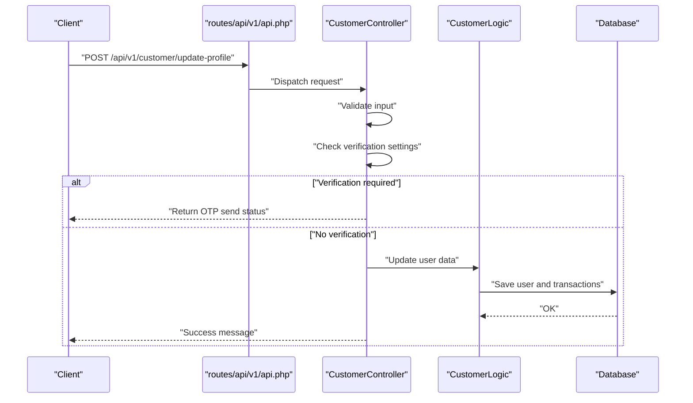
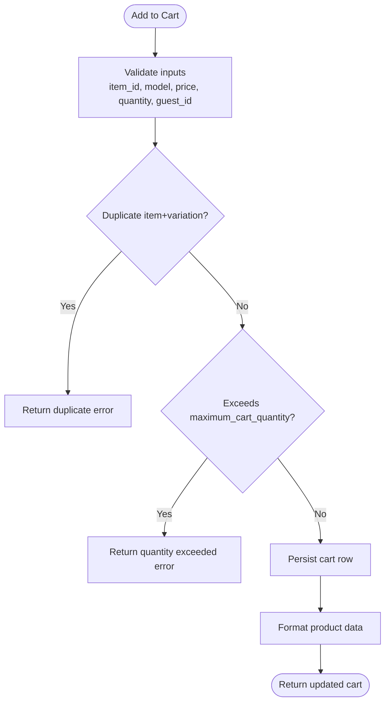
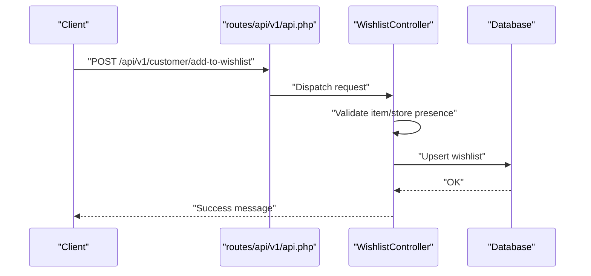
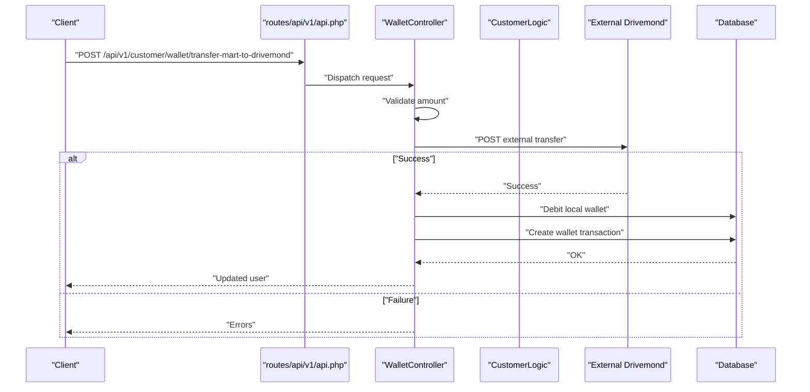
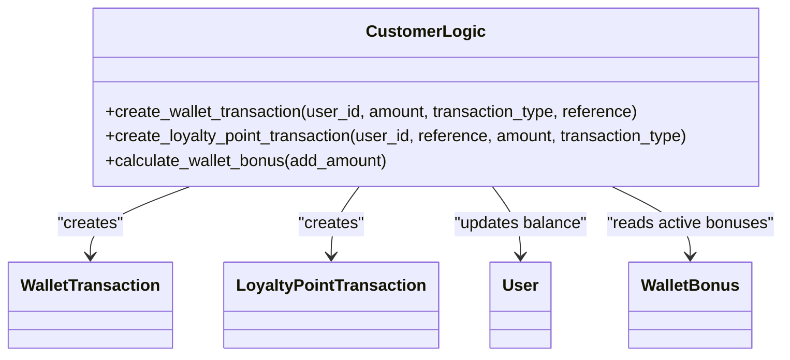
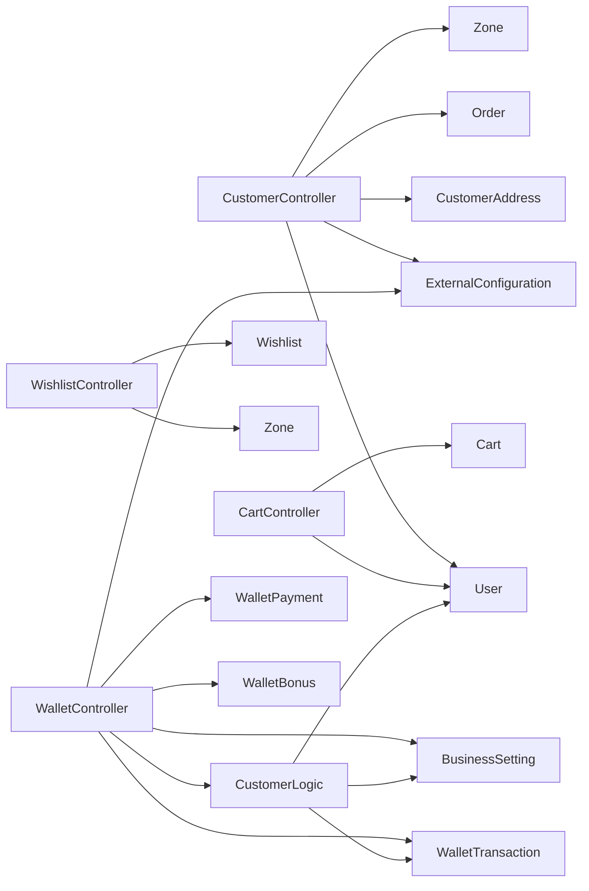

# Customer API

<cite>
**Referenced Files in This Document**
- [routes/api/v1/api.php](file://routes/api/v1/api.php)
- [routes/rest_api/v1/customer/routes.php](file://routes/rest_api/v1/customer/routes.php)
- [app/Http/Controllers/Api/V1/CustomerController.php](file://app/Http/Controllers/Api/V1/CustomerController.php)
- [app/Http/Controllers/Api/V1/CartController.php](file://app/Http/Controllers/Api/V1/CartController.php)
- [app/Http/Controllers/Api/V1/WishlistController.php](file://app/Http/Controllers/Api/V1/WishlistController.php)
- [app/Http/Controllers/Api/V1/WalletController.php](file://app/Http/Controllers/Api/V1/WalletController.php)
- [app/CentralLogics/customer.php](file://app/CentralLogics/customer.php)
- [app/Models/Cart.php](file://app/Models/Cart.php)
- [app/Models/Wishlist.php](file://app/Models/Wishlist.php)
- [app/Models/User.php](file://app/Models/User.php)
- [app/Models/CustomerAddress.php](file://app/Models/CustomerAddress.php)
- [app/Models/Order.php](file://app/Models/Order.php)
- [app/Models/OrderDetail.php](file://app/Models/OrderDetail.php)
- [app/Models/OrderReference.php](file://app/Models/OrderReference.php)
- [app/Models/Item.php](file://app/Models/Item.php)
- [app/Models/Store.php](file://app/Models/Store.php)
- [app/Models/WalletTransaction.php](file://app/Models/WalletTransaction.php)
- [app/Models/WalletPayment.php](file://app/Models/WalletPayment.php)
- [app/Models/WalletBonus.php](file://app/Models/WalletBonus.php)
- [app/Models/BusinessSetting.php](file://app/Models/BusinessSetting.php)
- [app/Models/PhoneVerification.php](file://app/Models/PhoneVerification.php)
- [app/Models/EmailVerifications.php](file://app/Models/EmailVerifications.php)
- [app/Models/Zone.php](file://app/Models/Zone.php)
- [app/Models/ExternalConfiguration.php](file://app/Models/ExternalConfiguration.php)
- [app/Models/AccountTransaction.php](file://app/Models/AccountTransaction.php)
- [app/Models/LoyaltyPointTransaction.php](file://app/Models/LoyaltyPointTransaction.php)
- [app/Models/Notification.php](file://app/Models/Notification.php)
- [app/Models/UserNotification.php](file://app/Models/UserNotification.php)
- [app/Models/UserInfo.php](file://app/Models/UserInfo.php)
- [app/Models/NotificationSetting.php](file://app/Models/NotificationSetting.php)
- [app/Models/StoreNotificationSetting.php](file://app/Models/StoreNotificationSetting.php)
- [app/Models/NotificationMessage.php](file://app/Models/NotificationMessage.php)
- [app/Models/NotificationSetting.php](file://app/Models/NotificationSetting.php)
- [app/Models/StoreNotificationSetting.php](file://app/Models/StoreNotificationSetting.php)
- [app/Models/NotificationMessage.php](file://app/Models/NotificationMessage.php)
</cite>

## Table of Contents
1. [Introduction](#introduction)
2. [Project Structure](#project-structure)
3. [Core Components](#core-components)
4. [Architecture Overview](#architecture-overview)
5. [Detailed Component Analysis](#detailed-component-analysis)
6. [Dependency Analysis](#dependency-analysis)
7. [Performance Considerations](#performance-considerations)
8. [Troubleshooting Guide](#troubleshooting-guide)
9. [Conclusion](#conclusion)
10. [Appendices](#appendices)

## Introduction
This document provides comprehensive API documentation for customer-facing operations, including profile management, address management, notifications, order lifecycle, cart operations, wishlist, and wallet transactions. It covers endpoint definitions, request/response examples, validation rules, error handling patterns, and integration points with central logics and models.

## Project Structure
The customer APIs are primarily exposed under the V1 REST API route group and mapped via Laravel route files. Controllers handle request validation, orchestrate business logic via central logics, and interact with models for persistence and retrieval.

```mermaid
graph TB
subgraph "Routes"
R1["routes/api/v1/api.php"]
R2["routes/rest_api/v1/customer/routes.php"]
end
subgraph "Controllers"
C1["Api/V1/CustomerController.php"]
C2["Api/V1/CartController.php"]
C3["Api/V1/WishlistController.php"]
C4["Api/V1/WalletController.php"]
end
subgraph "Central Logics"
L1["CentralLogics/customer.php"]
end
subgraph "Models"
M1["Models/User.php"]
M2["Models/CustomerAddress.php"]
M3["Models/Order.php"]
M4["Models/OrderDetail.php"]
M5["Models/Cart.php"]
M6["Models/Wishlist.php"]
M7["Models/WalletTransaction.php"]
M8["Models/WalletPayment.php"]
M9["Models/WalletBonus.php"]
M10["Models/BusinessSetting.php"]
M11["Models/PhoneVerification.php"]
M12["Models/EmailVerifications.php"]
M13["Models/Zone.php"]
M14["Models/ExternalConfiguration.php"]
end
R1 --> C1
R1 --> C2
R1 --> C3
R1 --> C4
R2 --> C1
C1 --> L1
C1 --> M1
C1 --> M2
C1 --> M3
C1 --> M4
C1 --> M11
C1 --> M14
C2 --> M5
C2 --> M1
C3 --> M6
C3 --> M1
C3 --> M13
C4 --> L1
C4 --> M7
C4 --> M8
C4 --> M9
C4 --> M10
C4 --> M14
```

**Diagram sources**
- [routes/api/v1/api.php:333-346](file://routes/api/v1/api.php#L333-L346)
- [routes/rest_api/v1/customer/routes.php:17-19](file://routes/rest_api/v1/customer/routes.php#L17-L19)
- [app/Http/Controllers/Api/V1/CustomerController.php:33](file://app/Http/Controllers/Api/V1/CustomerController.php#L33)
- [app/Http/Controllers/Api/V1/CartController.php:13](file://app/Http/Controllers/Api/V1/CartController.php#L13)
- [app/Http/Controllers/Api/V1/WishlistController.php:11](file://app/Http/Controllers/Api/V1/WishlistController.php#L11)
- [app/Http/Controllers/Api/V1/WalletController.php:23](file://app/Http/Controllers/Api/V1/WalletController.php#L23)
- [app/CentralLogics/customer.php:13](file://app/CentralLogics/customer.php#L13)
- [app/Models/User.php](file://app/Models/User.php)
- [app/Models/CustomerAddress.php](file://app/Models/CustomerAddress.php)
- [app/Models/Order.php](file://app/Models/Order.php)
- [app/Models/OrderDetail.php](file://app/Models/OrderDetail.php)
- [app/Models/Cart.php:8](file://app/Models/Cart.php#L8)
- [app/Models/Wishlist.php:7](file://app/Models/Wishlist.php#L7)
- [app/Models/WalletTransaction.php](file://app/Models/WalletTransaction.php)
- [app/Models/WalletPayment.php](file://app/Models/WalletPayment.php)
- [app/Models/WalletBonus.php](file://app/Models/WalletBonus.php)
- [app/Models/BusinessSetting.php](file://app/Models/BusinessSetting.php)
- [app/Models/PhoneVerification.php](file://app/Models/PhoneVerification.php)
- [app/Models/EmailVerifications.php](file://app/Models/EmailVerifications.php)
- [app/Models/Zone.php](file://app/Models/Zone.php)
- [app/Models/ExternalConfiguration.php](file://app/Models/ExternalConfiguration.php)

**Section sources**
- [routes/api/v1/api.php:333-346](file://routes/api/v1/api.php#L333-L346)
- [routes/rest_api/v1/customer/routes.php:17-19](file://routes/rest_api/v1/customer/routes.php#L17-L19)

## Core Components
- CustomerController: Handles profile updates, address CRUD, notifications, interest management, zone selection, account removal, and suggested items.
- CartController: Manages cart retrieval, adding items, updating quantities, removing items, and clearing the cart.
- WishlistController: Adds/removes items or stores to/from wishlist and lists favorites filtered by zone and location.
- WalletController: Lists wallet transactions, initiates add-fund payments, retrieves bonuses, and handles cross-system wallet transfers.
- CentralLogics\CustomerLogic: Encapsulates wallet and loyalty point transaction creation, bonus calculation, and balance updates.

**Section sources**
- [app/Http/Controllers/Api/V1/CustomerController.php:33](file://app/Http/Controllers/Api/V1/CustomerController.php#L33)
- [app/Http/Controllers/Api/V1/CartController.php:13](file://app/Http/Controllers/Api/V1/CartController.php#L13)
- [app/Http/Controllers/Api/V1/WishlistController.php:11](file://app/Http/Controllers/Api/V1/WishlistController.php#L11)
- [app/Http/Controllers/Api/V1/WalletController.php:23](file://app/Http/Controllers/Api/V1/WalletController.php#L23)
- [app/CentralLogics/customer.php:13](file://app/CentralLogics/customer.php#L13)

## Architecture Overview
The customer API follows a layered architecture:
- Routing: Customer endpoints are registered under the V1 REST API and authenticated via API tokens.
- Controllers: Validate requests, enforce authorization, and delegate to central logics and models.
- Central Logics: Encapsulate domain-specific operations (wallet/loyalty) with atomic transactions.
- Models: Define persistence and relationships for users, carts, wishlists, orders, and wallet transactions.

**Diagram sources**
- [routes/api/v1/api.php:333-346](file://routes/api/v1/api.php#L333-L346)
- [app/Http/Controllers/Api/V1/CustomerController.php:376-475](file://app/Http/Controllers/Api/V1/CustomerController.php#L376-L475)
- [app/CentralLogics/customer.php:16-80](file://app/CentralLogics/customer.php#L16-L80)

## Detailed Component Analysis

### Customer Profile Management
Endpoints:
- GET /api/v1/customer/info
- PUT /api/v1/customer/update-profile
- PUT /api/v1/customer/update-interest
- PUT /api/v1/customer/toggle-hide-phone
- PUT /api/v1/customer/cm-firebase-token
- DELETE /api/v1/customer/remove-account
- GET /api/v1/customer/suggested-items
- GET /api/v1/customer/update-zone

Validation and behavior:
- Info endpoint requires X-localization header and returns user metadata, order count, membership duration, and discount eligibility.
- Update-profile validates name, email uniqueness, phone uniqueness, optional image upload, and optional password length. Supports verification via SMS/Firebase/email and OTP checks. Returns appropriate messages per action.
- Update-interest merges and deduplicates interest arrays and records selected modules.
- Toggle-hide-phone flips the hide flag and returns updated state.
- Update cm_firebase_token updates device token for push notifications.
- Remove-account ensures no on-hold orders; revokes token and deletes user and userinfo.
- Suggested-items filters items by zone and user interests; falls back to popular items when no interests set.
- Update-zone sets current zone for the customer.

Example request/response (conceptual):
- Request: Authorization: Bearer {token}, Headers: X-localization: en
- Response: { "id": "...", "f_name": "...", "l_name": "...", "email": "...", "phone": "...", "wallet_balance": 0.0, "orders_count": 0, "member_since_days": 0, "is_valid_for_discount": false, "discount_amount": 0.0, "discount_amount_type": "", "validity": "" }

Error handling:
- Validation failures return structured errors array.
- Verification failures return medium-specific messages and codes.
- Account removal returns a 203 when orders are ongoing.

**Section sources**
- [routes/api/v1/api.php:333-346](file://routes/api/v1/api.php#L333-L346)
- [app/Http/Controllers/Api/V1/CustomerController.php:176-206](file://app/Http/Controllers/Api/V1/CustomerController.php#L176-L206)
- [app/Http/Controllers/Api/V1/CustomerController.php:209-232](file://app/Http/Controllers/Api/V1/CustomerController.php#L209-L232)
- [app/Http/Controllers/Api/V1/CustomerController.php:234-244](file://app/Http/Controllers/Api/V1/CustomerController.php#L234-L244)
- [app/Http/Controllers/Api/V1/CustomerController.php:246-261](file://app/Http/Controllers/Api/V1/CustomerController.php#L246-L261)
- [app/Http/Controllers/Api/V1/CustomerController.php:323-336](file://app/Http/Controllers/Api/V1/CustomerController.php#L323-L336)
- [app/Http/Controllers/Api/V1/CustomerController.php:263-305](file://app/Http/Controllers/Api/V1/CustomerController.php#L263-L305)
- [app/Http/Controllers/Api/V1/CustomerController.php:307-321](file://app/Http/Controllers/Api/V1/CustomerController.php#L307-L321)

### Address Management
Endpoints:
- GET /api/v1/customer/address-list
- POST /api/v1/customer/add-new-address
- PUT /api/v1/customer/update-address
- DELETE /api/v1/customer/delete-address

Validation and behavior:
- List addresses paginates with limit/offset and formats address data.
- Add address validates contact person name, address type, phone, address, longitude, latitude; determines zone by coordinates; rejects if outside service area.
- Update address mirrors add with coordinate zone validation.
- Delete address validates presence of address owned by the user.

Example request/response (conceptual):
- Add address request: { "contact_person_name": "...", "address_type": "...", "contact_person_number": "...", "address": "...", "longitude": 0.0, "latitude": 0.0 }
- Response: { "message": "successfully_added", "zone_ids": [...] }

Error handling:
- Coordinate outside service area returns service_not_available_in_this_area.
- Not found returns 404.

**Section sources**
- [app/Http/Controllers/Api/V1/CustomerController.php:35-49](file://app/Http/Controllers/Api/V1/CustomerController.php#L35-L49)
- [app/Http/Controllers/Api/V1/CustomerController.php:51-92](file://app/Http/Controllers/Api/V1/CustomerController.php#L51-L92)
- [app/Http/Controllers/Api/V1/CustomerController.php:94-133](file://app/Http/Controllers/Api/V1/CustomerController.php#L94-L133)
- [app/Http/Controllers/Api/V1/CustomerController.php:135-150](file://app/Http/Controllers/Api/V1/CustomerController.php#L135-L150)

### Notifications and Preferences
Endpoints:
- GET /api/v1/customer/notifications
- PUT /api/v1/customer/cm-firebase-token

Behavior:
- Notifications endpoint delegates to NotificationController for fetching customer notifications.
- Update cm_firebase_token validates token and persists it to the user record.

**Section sources**
- [routes/api/v1/api.php:333-346](file://routes/api/v1/api.php#L333-L346)
- [app/Http/Controllers/Api/V1/CustomerController.php:246-261](file://app/Http/Controllers/Api/V1/CustomerController.php#L246-L261)

### Order Lifecycle
Endpoints:
- GET /api/v1/customer/order-list
- GET /api/v1/customer/order-details

Behavior:
- Order list returns all non-guest orders for the authenticated user.
- Order details fetches line items for a given order, decoding product details JSON.

Example request/response (conceptual):
- Request: Authorization: Bearer {token}, Query: order_id=...
- Response: Array of order details with decoded product details.

**Section sources**
- [app/Http/Controllers/Api/V1/CustomerController.php:152-156](file://app/Http/Controllers/Api/V1/CustomerController.php#L152-L156)
- [app/Http/Controllers/Api/V1/CustomerController.php:158-174](file://app/Http/Controllers/Api/V1/CustomerController.php#L158-L174)

### Cart Operations
Endpoints:
- GET /api/v1/customer/cart-list
- POST /api/v1/customer/add-to-cart
- PUT /api/v1/customer/update-cart
- DELETE /api/v1/customer/remove-cart-item
- DELETE /api/v1/customer/remove-cart

Validation and behavior:
- Get cart validates guest_id when user is absent; filters out missing items and formats product data.
- Add to cart validates item_id, model type (Item/ItemCampaign), price, quantity; prevents duplicates by variation; enforces maximum_cart_quantity; persists addons, variations, and module_id.
- Update cart validates cart_id, price, quantity; enforces maximum_cart_quantity.
- Remove cart item validates cart_id; deletes and returns remaining items.
- Remove cart clears all items for the user/guest.

**Diagram sources**
- [app/Http/Controllers/Api/V1/CartController.php:42-110](file://app/Http/Controllers/Api/V1/CartController.php#L42-L110)
- [app/Models/Cart.php:8](file://app/Models/Cart.php#L8)

**Section sources**
- [app/Http/Controllers/Api/V1/CartController.php:15-40](file://app/Http/Controllers/Api/V1/CartController.php#L15-L40)
- [app/Http/Controllers/Api/V1/CartController.php:42-110](file://app/Http/Controllers/Api/V1/CartController.php#L42-L110)
- [app/Http/Controllers/Api/V1/CartController.php:112-161](file://app/Http/Controllers/Api/V1/CartController.php#L112-L161)
- [app/Http/Controllers/Api/V1/CartController.php:163-194](file://app/Http/Controllers/Api/V1/CartController.php#L163-L194)
- [app/Http/Controllers/Api/V1/CartController.php:196-230](file://app/Http/Controllers/Api/V1/CartController.php#L196-L230)
- [app/Models/Cart.php:8-41](file://app/Models/Cart.php#L8-L41)

### Wishlist Functionality
Endpoints:
- POST /api/v1/customer/add-to-wishlist
- DELETE /api/v1/customer/remove-from-wishlist
- GET /api/v1/customer/wishlist

Validation and behavior:
- Add to wishlist requires either item_id or store_id, not both; prevents duplicates.
- Remove from wishlist accepts either item_id or store_id; deletes first match.
- Wishlist lists favorites filtered by zone and optionally open status and coordinates.

**Diagram sources**
- [routes/api/v1/api.php:333-346](file://routes/api/v1/api.php#L333-L346)
- [app/Http/Controllers/Api/V1/WishlistController.php:13-43](file://app/Http/Controllers/Api/V1/WishlistController.php#L13-L43)

**Section sources**
- [app/Http/Controllers/Api/V1/WishlistController.php:13-43](file://app/Http/Controllers/Api/V1/WishlistController.php#L13-L43)
- [app/Http/Controllers/Api/V1/WishlistController.php:45-71](file://app/Http/Controllers/Api/V1/WishlistController.php#L45-L71)
- [app/Http/Controllers/Api/V1/WishlistController.php:73-106](file://app/Http/Controllers/Api/V1/WishlistController.php#L73-L106)
- [app/Models/Wishlist.php:7-24](file://app/Models/Wishlist.php#L7-L24)

### Wallet Transactions
Endpoints:
- GET /api/v1/customer/wallet/transactions
- POST /api/v1/customer/wallet/add-fund
- GET /api/v1/customer/wallet/bonus
- POST /api/v1/customer/wallet/transfer-mart-to-drivemond
- POST /api/v1/customer/wallet/transfer-mart-from-drivemond

Validation and behavior:
- Transactions: Paginates wallet transactions by type filter (order, loyalty, add_fund, referrer, CashBack).
- Add fund: Validates amount and payment method, creates WalletPayment, generates redirect link via Payment trait, and returns redirect_link.
- Bonus: Returns active, running wallet bonuses.
- Transfer Mart to Drivemond: Validates amount against wallet balance, posts to external Drivemond system, debits local wallet, and records transaction.
- Transfer Mart from Drivemond: Validates currency match, authenticates external request, credits wallet, records transaction, and sends push notification.

**Diagram sources**
- [routes/api/v1/api.php:333-346](file://routes/api/v1/api.php#L333-L346)
- [app/Http/Controllers/Api/V1/WalletController.php:63-139](file://app/Http/Controllers/Api/V1/WalletController.php#L63-L139)
- [app/Http/Controllers/Api/V1/WalletController.php:149-229](file://app/Http/Controllers/Api/V1/WalletController.php#L149-L229)
- [app/Http/Controllers/Api/V1/WalletController.php:231-317](file://app/Http/Controllers/Api/V1/WalletController.php#L231-L317)
- [app/CentralLogics/customer.php:16-80](file://app/CentralLogics/customer.php#L16-L80)

**Section sources**
- [app/Http/Controllers/Api/V1/WalletController.php:25-61](file://app/Http/Controllers/Api/V1/WalletController.php#L25-L61)
- [app/Http/Controllers/Api/V1/WalletController.php:63-139](file://app/Http/Controllers/Api/V1/WalletController.php#L63-L139)
- [app/Http/Controllers/Api/V1/WalletController.php:141-145](file://app/Http/Controllers/Api/V1/WalletController.php#L141-L145)
- [app/Http/Controllers/Api/V1/WalletController.php:149-229](file://app/Http/Controllers/Api/V1/WalletController.php#L149-L229)
- [app/Http/Controllers/Api/V1/WalletController.php:231-317](file://app/Http/Controllers/Api/V1/WalletController.php#L231-L317)
- [app/CentralLogics/customer.php:16-80](file://app/CentralLogics/customer.php#L16-L80)

### Central Logic: Wallet and Loyalty Transactions
Responsibilities:
- create_wallet_transaction: Creates wallet transactions, calculates credit/debit, applies admin bonus for add_fund, computes balances, and records loyalty point conversions.
- create_loyalty_point_transaction: Credits or debits loyalty points based on transaction type and updates user balance.
- calculate_wallet_bonus: Determines applicable percentage or amount bonus based on active, running promotions and minimum thresholds.

**Diagram sources**
- [app/CentralLogics/customer.php:16-151](file://app/CentralLogics/customer.php#L16-L151)
- [app/Models/WalletTransaction.php](file://app/Models/WalletTransaction.php)
- [app/Models/LoyaltyPointTransaction.php](file://app/Models/LoyaltyPointTransaction.php)
- [app/Models/User.php](file://app/Models/User.php)
- [app/Models/WalletBonus.php](file://app/Models/WalletBonus.php)

**Section sources**
- [app/CentralLogics/customer.php:16-151](file://app/CentralLogics/customer.php#L16-L151)

## Dependency Analysis
- Controllers depend on:
  - Models for persistence and relationships (User, CustomerAddress, Order, Cart, Wishlist, WalletTransaction, WalletPayment, WalletBonus, BusinessSetting, PhoneVerification, EmailVerifications, Zone, ExternalConfiguration).
  - CentralLogics for wallet and loyalty operations.
  - Helpers for formatting and business settings.
- Routes define authentication via API tokens and module checks.

**Diagram sources**
- [app/Http/Controllers/Api/V1/CustomerController.php:33](file://app/Http/Controllers/Api/V1/CustomerController.php#L33)
- [app/Http/Controllers/Api/V1/CartController.php:13](file://app/Http/Controllers/Api/V1/CartController.php#L13)
- [app/Http/Controllers/Api/V1/WishlistController.php:11](file://app/Http/Controllers/Api/V1/WishlistController.php#L11)
- [app/Http/Controllers/Api/V1/WalletController.php:23](file://app/Http/Controllers/Api/V1/WalletController.php#L23)
- [app/CentralLogics/customer.php:13](file://app/CentralLogics/customer.php#L13)
- [app/Models/User.php](file://app/Models/User.php)
- [app/Models/CustomerAddress.php](file://app/Models/CustomerAddress.php)
- [app/Models/Order.php](file://app/Models/Order.php)
- [app/Models/Cart.php:8](file://app/Models/Cart.php#L8)
- [app/Models/Wishlist.php:7](file://app/Models/Wishlist.php#L7)
- [app/Models/WalletTransaction.php](file://app/Models/WalletTransaction.php)
- [app/Models/WalletPayment.php](file://app/Models/WalletPayment.php)
- [app/Models/WalletBonus.php](file://app/Models/WalletBonus.php)
- [app/Models/BusinessSetting.php](file://app/Models/BusinessSetting.php)
- [app/Models/Zone.php](file://app/Models/Zone.php)
- [app/Models/ExternalConfiguration.php](file://app/Models/ExternalConfiguration.php)

**Section sources**
- [routes/api/v1/api.php:333-346](file://routes/api/v1/api.php#L333-L346)

## Performance Considerations
- Pagination: Use limit/offset parameters for address and wallet transactions to avoid large payloads.
- Filtering: Apply type filters for wallet transactions to reduce dataset size.
- Formatting: Centralized formatting helpers minimize repeated transformations.
- Validation early exit: Controllers validate inputs before heavy operations to reduce unnecessary work.

## Troubleshooting Guide
Common issues and resolutions:
- Validation errors: Ensure all required fields are present and formatted correctly; check headers like X-localization and zoneId where required.
- OTP verification failures: Respect rate limits and temporary blocks; verify medium-specific configurations (SMS/Firebase/email).
- Service area validation: Coordinates must fall within a valid zone; otherwise, service_not_available_in_this_area is returned.
- Insufficient funds: Wallet transfer endpoints validate balance before proceeding.
- External system errors: Cross-system transfers require valid tokens and matching currencies; handle error codes from external systems.

**Section sources**
- [app/Http/Controllers/Api/V1/CustomerController.php:53-73](file://app/Http/Controllers/Api/V1/CustomerController.php#L53-L73)
- [app/Http/Controllers/Api/V1/CustomerController.php:478-513](file://app/Http/Controllers/Api/V1/CustomerController.php#L478-L513)
- [app/Http/Controllers/Api/V1/CustomerController.php:599-646](file://app/Http/Controllers/Api/V1/CustomerController.php#L599-L646)
- [app/Http/Controllers/Api/V1/WalletController.php:149-229](file://app/Http/Controllers/Api/V1/WalletController.php#L149-L229)
- [app/Http/Controllers/Api/V1/WalletController.php:231-317](file://app/Http/Controllers/Api/V1/WalletController.php#L231-L317)

## Conclusion
The customer API provides a robust set of endpoints for managing profiles, addresses, orders, carts, wishlists, and wallets. Centralized business logic ensures consistent transaction handling, while strict validation and error responses improve reliability. Integrations with external systems enable cross-platform wallet transfers with proper checks and notifications.

## Appendices

### Endpoint Reference Summary
- Customer
  - GET /api/v1/customer/info
  - PUT /api/v1/customer/update-profile
  - PUT /api/v1/customer/update-interest
  - PUT /api/v1/customer/toggle-hide-phone
  - PUT /api/v1/customer/cm-firebase-token
  - DELETE /api/v1/customer/remove-account
  - GET /api/v1/customer/suggested-items
  - GET /api/v1/customer/update-zone
  - GET /api/v1/customer/address-list
  - POST /api/v1/customer/add-new-address
  - PUT /api/v1/customer/update-address
  - DELETE /api/v1/customer/delete-address
  - GET /api/v1/customer/order-list
  - GET /api/v1/customer/order-details
- Cart
  - GET /api/v1/customer/cart-list
  - POST /api/v1/customer/add-to-cart
  - PUT /api/v1/customer/update-cart
  - DELETE /api/v1/customer/remove-cart-item
  - DELETE /api/v1/customer/remove-cart
- Wishlist
  - POST /api/v1/customer/add-to-wishlist
  - DELETE /api/v1/customer/remove-from-wishlist
  - GET /api/v1/customer/wishlist
- Wallet
  - GET /api/v1/customer/wallet/transactions
  - POST /api/v1/customer/wallet/add-fund
  - GET /api/v1/customer/wallet/bonus
  - POST /api/v1/customer/wallet/transfer-mart-to-drivemond
  - POST /api/v1/customer/wallet/transfer-mart-from-drivemond