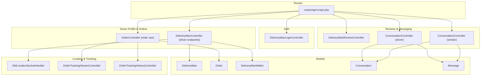
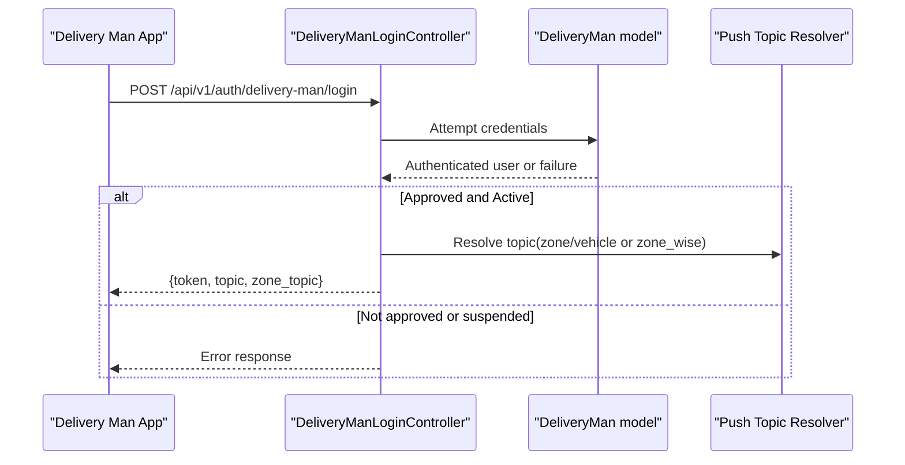
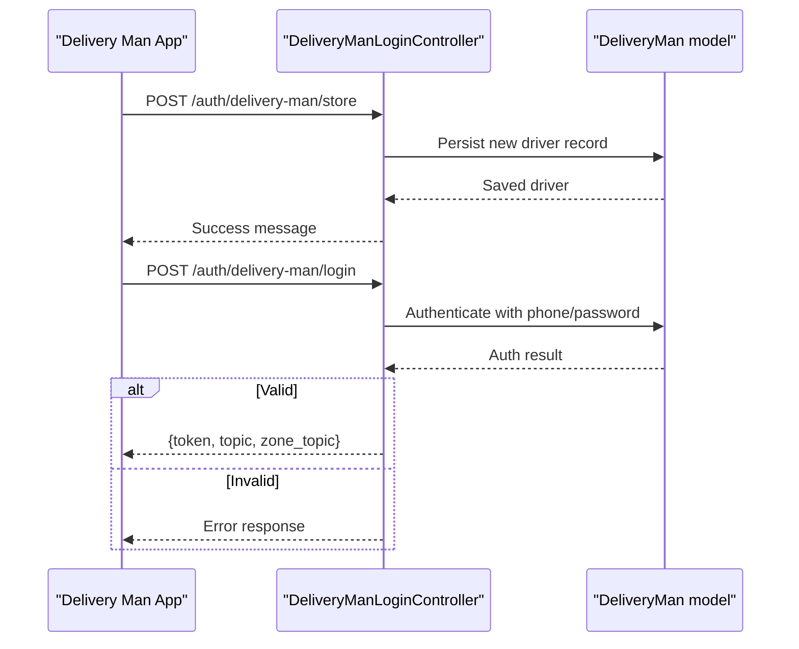
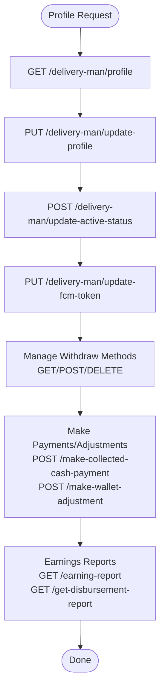
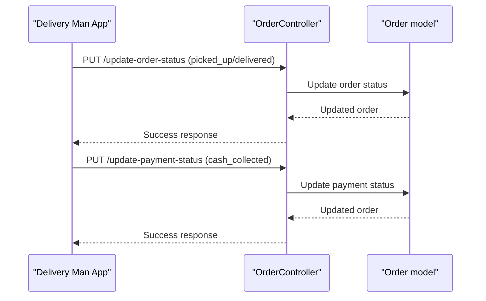
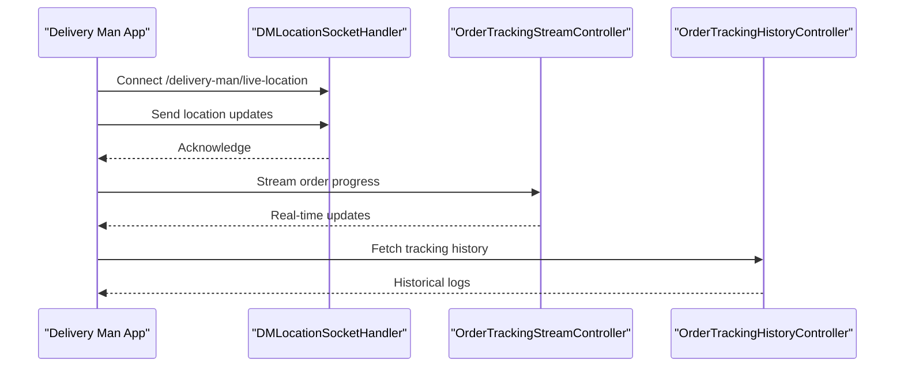
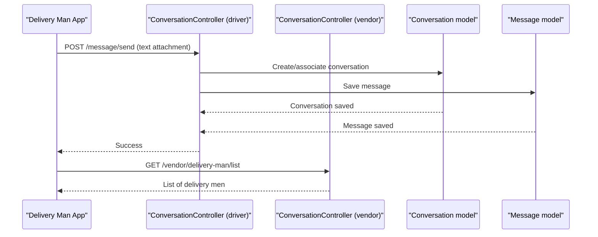
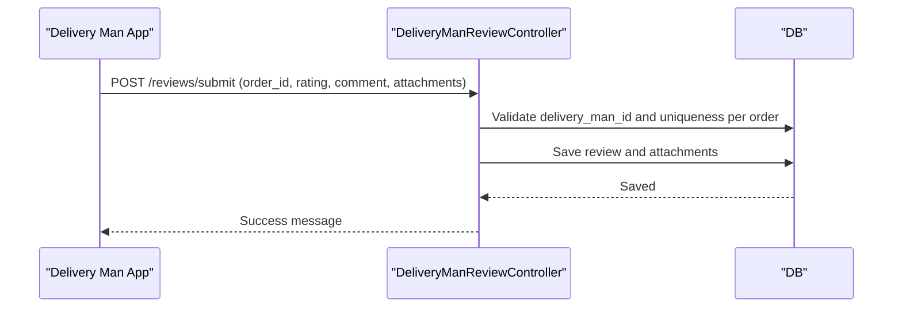
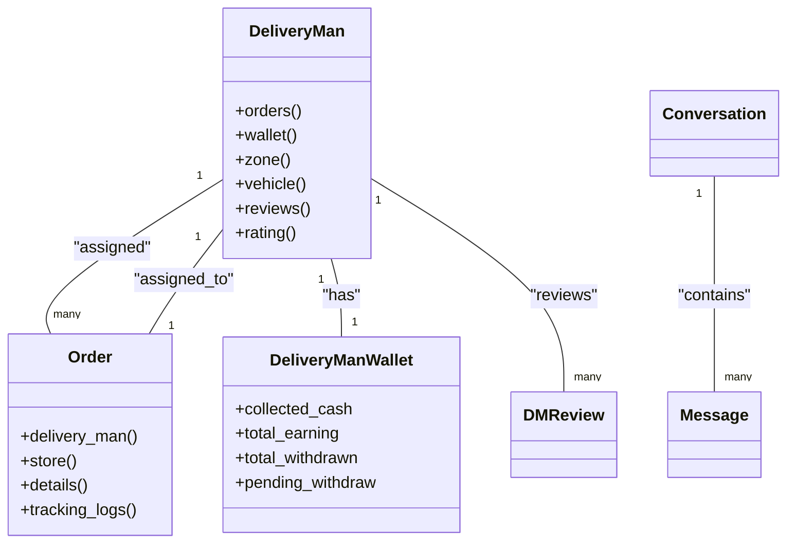

# Delivery Man API

<cite>
**Referenced Files in This Document**
- [routes/api/v1/api.php](file://routes/api/v1/api.php)
- [app/Http/Controllers/Api/V1/Auth/DeliveryManLoginController.php](file://app/Http/Controllers/Api/V1/Auth/DeliveryManLoginController.php)
- [app/Http/Controllers/Api/V1/DeliveryManReviewController.php](file://app/Http/Controllers/Api/V1/DeliveryManReviewController.php)
- [app/Http/Controllers/Api/V1/Vendor/DeliveryManController.php](file://app/Http/Controllers/Api/V1/Vendor/DeliveryManController.php)
- [app/Models/DeliveryMan.php](file://app/Models/DeliveryMan.php)
- [app/Models/DeliveryManWallet.php](file://app/Models/DeliveryManWallet.php)
- [app/Models/Order.php](file://app/Models/Order.php)
- [app/Http/Controllers/Api/V1/OrderController.php](file://app/Http/Controllers/Api/V1/OrderController.php)
- [routes/api/v1/api.php](file://routes/api/v1/api.php)
- [app/Http/Controllers/Api/V1/ConversationController.php](file://app/Http/Controllers/Api/V1/ConversationController.php)
- [app/Models/Conversation.php](file://app/Models/Conversation.php)
- [app/Models/Message.php](file://app/Models/Message.php)
- [app/Http/Controllers/Api/V1/Vendor/ConversationController.php](file://app/Http/Controllers/Api/V1/Vendor/ConversationController.php)
- [app/Models/OrderTrackingLog.php](file://app/Models/OrderTrackingLog.php)
- [app/Models/OrderStatusLog.php](file://app/Models/OrderStatusLog.php)
- [app/Models/LiveActivityToken.php](file://app/Models/LiveActivityToken.php)
- [app/Http/Controllers/Api/V1/OrderTrackingHistoryController.php](file://app/Http/Controllers/Api/V1/OrderTrackingHistoryController.php)
- [app/Http/Controllers/Api/V1/OrderTrackingStreamController.php](file://app/Http/Controllers/Api/V1/OrderTrackingStreamController.php)
- [app/WebSockets/Handler/DMLocationSocketHandler.php](file://app/WebSockets/Handler/DMLocationSocketHandler.php)
- [app/Http/Controllers/TrackDeliverymanController.php](file://app/Http/Controllers/TrackDeliverymanController.php)
- [app/Models/TrackDeliveryman.php](file://app/Models/TrackDeliveryman.php)
</cite>

## Table of Contents
1. [Introduction](#introduction)
2. [Project Structure](#project-structure)
3. [Core Components](#core-components)
4. [Architecture Overview](#architecture-overview)
5. [Detailed Component Analysis](#detailed-component-analysis)
6. [Dependency Analysis](#dependency-analysis)
7. [Performance Considerations](#performance-considerations)
8. [Troubleshooting Guide](#troubleshooting-guide)
9. [Conclusion](#conclusion)
10. [Appendices](#appendices)

## Introduction
This document describes the Delivery Man API, focusing on driver profile management, order assignment and status updates, real-time location tracking, and communication features. It consolidates endpoints under the v1 API namespace and highlights how delivery men authenticate, manage availability, receive and act on orders, report earnings, share locations, communicate with customers, submit reviews, and manage withdrawals. It also documents FCM token management and offline working capabilities via live activity tokens and WebSocket-based location streaming.

## Project Structure
The Delivery Man API is organized under the v1 routes group with dedicated controllers for authentication, profile/order operations, reviews, messaging, and vendor-facing delivery-man management. Key models represent drivers, orders, wallets, conversations, and tracking logs.

**Diagram sources**
- [routes/api/v1/api.php:95-151](file://routes/api/v1/api.php#L95-L151)
- [app/Http/Controllers/Api/V1/Auth/DeliveryManLoginController.php:1-160](file://app/Http/Controllers/Api/V1/Auth/DeliveryManLoginController.php#L1-L160)
- [app/Http/Controllers/Api/V1/DeliveryManReviewController.php:1-101](file://app/Http/Controllers/Api/V1/DeliveryManReviewController.php#L1-L101)
- [app/Http/Controllers/Api/V1/Vendor/DeliveryManController.php:1-315](file://app/Http/Controllers/Api/V1/Vendor/DeliveryManController.php#L1-L315)
- [app/Http/Controllers/Api/V1/OrderController.php:1-791](file://app/Http/Controllers/Api/V1/OrderController.php#L1-L791)
- [app/Http/Controllers/Api/V1/ConversationController.php](file://app/Http/Controllers/Api/V1/ConversationController.php)
- [app/Http/Controllers/Api/V1/Vendor/ConversationController.php](file://app/Http/Controllers/Api/V1/Vendor/ConversationController.php)
- [app/Models/DeliveryMan.php:1-234](file://app/Models/DeliveryMan.php#L1-L234)
- [app/Models/Order.php:1-358](file://app/Models/Order.php#L1-L358)
- [app/Models/DeliveryManWallet.php:1-27](file://app/Models/DeliveryManWallet.php#L1-L27)
- [app/Models/Conversation.php](file://app/Models/Conversation.php)
- [app/Models/Message.php](file://app/Models/Message.php)
- [app/WebSockets/Handler/DMLocationSocketHandler.php](file://app/WebSockets/Handler/DMLocationSocketHandler.php)
- [app/Http/Controllers/Api/V1/OrderTrackingStreamController.php](file://app/Http/Controllers/Api/V1/OrderTrackingStreamController.php)
- [app/Http/Controllers/Api/V1/OrderTrackingHistoryController.php](file://app/Http/Controllers/Api/V1/OrderTrackingHistoryController.php)

**Section sources**
- [routes/api/v1/api.php:95-151](file://routes/api/v1/api.php#L95-L151)

## Core Components
- Authentication and Registration: Self-registration and login for delivery men with token issuance and topic assignment for push notifications.
- Driver Profile Management: Retrieve/update profile, toggle availability, update FCM token, remove account, and view earnings reports.
- Order Management: Accept orders, update order status, update payment status, send order OTP, fetch current/latest orders, and order history.
- Location Sharing: Real-time location streaming via WebSocket and retrieval of last known location.
- Communication: Conversations and messages between delivery men and vendors/customers.
- Reviews: Fetch driver reviews and ratings, and submit a review for a delivered order.
- Withdrawals: List withdrawal methods, set default, store new method, delete, and make collected cash payments/wallet adjustments.

**Section sources**
- [routes/api/v1/api.php:95-151](file://routes/api/v1/api.php#L95-L151)
- [app/Http/Controllers/Api/V1/Auth/DeliveryManLoginController.php:17-75](file://app/Http/Controllers/Api/V1/Auth/DeliveryManLoginController.php#L17-L75)
- [app/Models/DeliveryMan.php:1-234](file://app/Models/DeliveryMan.php#L1-L234)
- [app/Models/DeliveryManWallet.php:1-27](file://app/Models/DeliveryManWallet.php#L1-L27)
- [app/Http/Controllers/Api/V1/OrderController.php:1-791](file://app/Http/Controllers/Api/V1/OrderController.php#L1-L791)
- [app/Http/Controllers/Api/V1/DeliveryManReviewController.php:15-47](file://app/Http/Controllers/Api/V1/DeliveryManReviewController.php#L15-L47)
- [app/Http/Controllers/Api/V1/ConversationController.php](file://app/Http/Controllers/Api/V1/ConversationController.php)
- [app/Http/Controllers/Api/V1/Vendor/ConversationController.php](file://app/Http/Controllers/Api/V1/Vendor/ConversationController.php)

## Architecture Overview
The Delivery Man API follows a layered structure:
- Routing groups define namespaces and middleware for authentication and driver-specific operations.
- Controllers handle requests, coordinate with repositories/services, and return standardized JSON responses.
- Models encapsulate relationships and scopes for drivers, orders, wallets, and conversations.
- Real-time features leverage WebSockets for live location and streaming order tracking.

**Diagram sources**
- [routes/api/v1/api.php:57-65](file://routes/api/v1/api.php#L57-L65)
- [app/Http/Controllers/Api/V1/Auth/DeliveryManLoginController.php:17-75](file://app/Http/Controllers/Api/V1/Auth/DeliveryManLoginController.php#L17-L75)
- [app/Models/DeliveryMan.php:114-122](file://app/Models/DeliveryMan.php#L114-L122)

**Section sources**
- [routes/api/v1/api.php:57-65](file://routes/api/v1/api.php#L57-L65)
- [app/Http/Controllers/Api/V1/Auth/DeliveryManLoginController.php:17-75](file://app/Http/Controllers/Api/V1/Auth/DeliveryManLoginController.php#L17-L75)

## Detailed Component Analysis

### Authentication and Registration
- Endpoint: POST /api/v1/auth/delivery-man/login
  - Validates phone and password, checks application status and account status, issues a random token, and resolves a push notification topic based on zone and vehicle.
- Endpoint: POST /api/v1/auth/delivery-man/store
  - Registers a new delivery man with identity details, images, and credentials; sets initial application status to pending.

**Diagram sources**
- [routes/api/v1/api.php:57-65](file://routes/api/v1/api.php#L57-L65)
- [app/Http/Controllers/Api/V1/Auth/DeliveryManLoginController.php:77-158](file://app/Http/Controllers/Api/V1/Auth/DeliveryManLoginController.php#L77-L158)
- [app/Http/Controllers/Api/V1/Auth/DeliveryManLoginController.php:17-75](file://app/Http/Controllers/Api/V1/Auth/DeliveryManLoginController.php#L17-L75)

**Section sources**
- [routes/api/v1/api.php:57-65](file://routes/api/v1/api.php#L57-L65)
- [app/Http/Controllers/Api/V1/Auth/DeliveryManLoginController.php:17-158](file://app/Http/Controllers/Api/V1/Auth/DeliveryManLoginController.php#L17-L158)

### Driver Profile Management
- GET /api/v1/delivery-man/profile
  - Retrieves driver profile details.
- PUT /api/v1/delivery-man/update-profile
  - Updates personal and identification details; supports updating images and identity documents.
- POST /api/v1/delivery-man/update-active-status
  - Toggles availability status.
- PUT /api/v1/delivery-man/update-fcm-token
  - Stores or updates FCM token for push notifications.
- DELETE /api/v1/delivery-man/remove-account
  - Removes the driver account.
- GET /api/v1/delivery-man/earning-report
  - Provides earnings summaries (daily/weekly/monthly).
- GET /api/v1/delivery-man/get-disbursement-report
  - Provides disbursement-related earnings report.
- Withdrawal management endpoints:
  - GET /api/v1/delivery-man/get-withdraw-method-list
  - GET /api/v1/delivery-man/withdraw-method/list
  - POST /api/v1/delivery-man/withdraw-method/store
  - POST /api/v1/delivery-man/withdraw-method/make-default
  - DELETE /api/v1/delivery-man/withdraw-method/delete
  - POST /api/v1/delivery-man/make-collected-cash-payment
  - POST /api/v1/delivery-man/make-wallet-adjustment
  - GET /api/v1/delivery-man/wallet-payment-list
  - GET /api/v1/delivery-man/wallet-provided-earning-list

**Diagram sources**
- [routes/api/v1/api.php:104-141](file://routes/api/v1/api.php#L104-L141)
- [app/Models/DeliveryMan.php:64-107](file://app/Models/DeliveryMan.php#L64-L107)
- [app/Models/DeliveryManWallet.php:18-23](file://app/Models/DeliveryManWallet.php#L18-L23)

**Section sources**
- [routes/api/v1/api.php:104-141](file://routes/api/v1/api.php#L104-L141)
- [app/Models/DeliveryMan.php:64-134](file://app/Models/DeliveryMan.php#L64-L134)
- [app/Models/DeliveryManWallet.php:18-23](file://app/Models/DeliveryManWallet.php#L18-L23)

### Order Management Operations
- GET /api/v1/delivery-man/current-orders
  - Lists currently ongoing orders assigned to the driver.
- GET /api/v1/delivery-man/latest-orders
  - Lists latest orders for the driver.
- GET /api/v1/delivery-man/all-orders
  - Lists all orders associated with the driver.
- GET /api/v1/delivery-man/order-delivery-history
  - Returns delivery history.
- PUT /api/v1/delivery-man/accept-order
  - Accepts an order assignment.
- PUT /api/v1/delivery-man/update-order-status
  - Updates order status (e.g., picked up, delivered).
- PUT /api/v1/delivery-man/update-payment-status
  - Updates payment collection status.
- GET /api/v1/delivery-man/order-details
  - Retrieves order details.
- GET /api/v1/delivery-man/order
  - Retrieves a single order by ID.
- PUT /api/v1/delivery-man/send-order-otp
  - Sends an OTP for order verification.

**Diagram sources**
- [routes/api/v1/api.php:114-118](file://routes/api/v1/api.php#L114-L118)
- [app/Http/Controllers/Api/V1/OrderController.php:1-791](file://app/Http/Controllers/Api/V1/OrderController.php#L1-L791)
- [app/Models/Order.php:17-51](file://app/Models/Order.php#L17-L51)

**Section sources**
- [routes/api/v1/api.php:109-122](file://routes/api/v1/api.php#L109-L122)
- [app/Http/Controllers/Api/V1/OrderController.php:1-791](file://app/Http/Controllers/Api/V1/OrderController.php#L1-L791)
- [app/Models/Order.php:17-51](file://app/Models/Order.php#L17-L51)

### Location Sharing and Tracking
- GET /api/v1/delivery-man/last-location
  - Retrieves the driver’s last recorded location.
- WebSocket endpoint:
  - GET /delivery-man/live-location
  - Handles live location streaming for real-time tracking.
- Order tracking:
  - Streaming and history endpoints support live updates and historical logs.

**Diagram sources**
- [routes/api/v1/api.php:545-546](file://routes/api/v1/api.php#L545-L546)
- [app/WebSockets/Handler/DMLocationSocketHandler.php](file://app/WebSockets/Handler/DMLocationSocketHandler.php)
- [app/Http/Controllers/Api/V1/OrderTrackingStreamController.php](file://app/Http/Controllers/Api/V1/OrderTrackingStreamController.php)
- [app/Http/Controllers/Api/V1/OrderTrackingHistoryController.php](file://app/Http/Controllers/Api/V1/OrderTrackingHistoryController.php)
- [app/Http/Controllers/TrackDeliverymanController.php](file://app/Http/Controllers/TrackDeliverymanController.php)
- [app/Models/TrackDeliveryman.php](file://app/Models/TrackDeliveryman.php)

**Section sources**
- [routes/api/v1/api.php:96-96](file://routes/api/v1/api.php#L96-L96)
- [routes/api/v1/api.php:545-546](file://routes/api/v1/api.php#L545-L546)
- [app/Http/Controllers/Api/V1/OrderTrackingStreamController.php](file://app/Http/Controllers/Api/V1/OrderTrackingStreamController.php)
- [app/Http/Controllers/Api/V1/OrderTrackingHistoryController.php](file://app/Http/Controllers/Api/V1/OrderTrackingHistoryController.php)
- [app/Http/Controllers/TrackDeliverymanController.php](file://app/Http/Controllers/TrackDeliverymanController.php)
- [app/Models/TrackDeliveryman.php](file://app/Models/TrackDeliveryman.php)

### Communication Features
- Messages and Conversations:
  - GET /api/v1/delivery-man/message/list
  - GET /api/v1/delivery-man/message/search-list
  - GET /api/v1/delivery-man/message/details
  - POST /api/v1/delivery-man/message/send
- Vendor-side delivery-man management messaging:
  - GET /api/v1/vendor/delivery-man/list
  - GET /api/v1/vendor/delivery-man/preview
  - POST /api/v1/vendor/delivery-man/store
  - PUT /api/v1/vendor/delivery-man/status
  - PUT /api/v1/vendor/delivery-man/update/{id}
  - DELETE /api/v1/vendor/delivery-man/delete
  - POST /api/v1/vendor/delivery-man/search

**Diagram sources**
- [routes/api/v1/api.php:144-149](file://routes/api/v1/api.php#L144-L149)
- [app/Http/Controllers/Api/V1/ConversationController.php](file://app/Http/Controllers/Api/V1/ConversationController.php)
- [app/Http/Controllers/Api/V1/Vendor/ConversationController.php](file://app/Http/Controllers/Api/V1/Vendor/ConversationController.php)
- [app/Models/Conversation.php](file://app/Models/Conversation.php)
- [app/Models/Message.php](file://app/Models/Message.php)

**Section sources**
- [routes/api/v1/api.php:144-149](file://routes/api/v1/api.php#L144-L149)
- [app/Http/Controllers/Api/V1/ConversationController.php](file://app/Http/Controllers/Api/V1/ConversationController.php)
- [app/Http/Controllers/Api/V1/Vendor/ConversationController.php](file://app/Http/Controllers/Api/V1/Vendor/ConversationController.php)

### Reviews Submission
- GET /api/v1/reviews/{delivery_man_id}
  - Retrieves active reviews for a driver.
- GET /api/v1/reviews/rating/{delivery_man_id}
  - Computes and returns the average rating.
- POST /api/v1/reviews/submit
  - Submits a review for a delivered order with optional attachments.

**Diagram sources**
- [routes/api/v1/api.php:99-103](file://routes/api/v1/api.php#L99-L103)
- [app/Http/Controllers/Api/V1/DeliveryManReviewController.php:49-99](file://app/Http/Controllers/Api/V1/DeliveryManReviewController.php#L49-L99)

**Section sources**
- [routes/api/v1/api.php:99-103](file://routes/api/v1/api.php#L99-L103)
- [app/Http/Controllers/Api/V1/DeliveryManReviewController.php:15-99](file://app/Http/Controllers/Api/V1/DeliveryManReviewController.php#L15-L99)

### Vendor-Facing Delivery-Man Management
- GET /api/v1/vendor/delivery-man/list
  - Lists delivery men for the vendor’s store with ratings and counts.
- POST /api/v1/vendor/delivery-man/store
  - Adds a delivery man to the vendor’s store (self-delivery).
- PUT /api/v1/vendor/delivery-man/status
  - Activates/deactivates a delivery man and sends push notifications if configured.
- PUT /api/v1/vendor/delivery-man/update/{id}
  - Updates driver details and images.
- DELETE /api/v1/vendor/delivery-man/delete
  - Deletes a delivery man.
- POST /api/v1/vendor/delivery-man/search
  - Searches delivery men by name/email/phone/identity.

**Section sources**
- [routes/api/v1/api.php:263-271](file://routes/api/v1/api.php#L263-L271)
- [app/Http/Controllers/Api/V1/Vendor/DeliveryManController.php:31-315](file://app/Http/Controllers/Api/V1/Vendor/DeliveryManController.php#L31-L315)

### Offline Working Capabilities
- iOS Live Activity token:
  - POST /api/v1/customer/live-activity-token
  - Stores the token for live activity updates.
- FCM token management:
  - PUT /api/v1/delivery-man/update-fcm-token
  - Stores or updates the device token for push notifications.

**Section sources**
- [routes/api/v1/api.php:402-403](file://routes/api/v1/api.php#L402-L403)
- [routes/api/v1/api.php:120-120](file://routes/api/v1/api.php#L120-L120)

## Dependency Analysis
- Controllers depend on models and central logics for formatting and notifications.
- DeliveryMan model encapsulates relationships to orders, wallet, zone, vehicle, and reviews.
- Order model encapsulates relationships to delivery man, store, and tracking/history logs.
- WebSocket handler integrates with the driver location stream.
- Conversation and Message models support chat between parties.

**Diagram sources**
- [app/Models/DeliveryMan.php:64-134](file://app/Models/DeliveryMan.php#L64-L134)
- [app/Models/Order.php:128-199](file://app/Models/Order.php#L128-L199)
- [app/Models/DeliveryManWallet.php:18-23](file://app/Models/DeliveryManWallet.php#L18-L23)
- [app/Models/Conversation.php](file://app/Models/Conversation.php)
- [app/Models/Message.php](file://app/Models/Message.php)

**Section sources**
- [app/Models/DeliveryMan.php:64-134](file://app/Models/DeliveryMan.php#L64-L134)
- [app/Models/Order.php:128-199](file://app/Models/Order.php#L128-L199)
- [app/Models/DeliveryManWallet.php:18-23](file://app/Models/DeliveryManWallet.php#L18-L23)

## Performance Considerations
- Use pagination for listing orders and conversations to avoid large payloads.
- Minimize image uploads; ensure compression and appropriate sizes for identity and profile images.
- Batch WebSocket location updates to reduce network overhead.
- Cache frequently accessed driver statistics (ratings, counts) to reduce DB load.
- Validate and sanitize inputs for OTP and payment updates to prevent unnecessary retries.

## Troubleshooting Guide
- Authentication failures:
  - Ensure the driver’s application status is approved and account is not suspended.
  - Confirm phone/password correctness and reCAPTCHA/token validation if enabled.
- Order status update errors:
  - Verify the order exists and is assigned to the driver.
  - Ensure the order is in an eligible state for the requested status change.
- Location streaming issues:
  - Confirm WebSocket connection to /delivery-man/live-location and proper token handling.
- Messaging problems:
  - Check conversation existence and message creation permissions.
- Review submission errors:
  - Ensure the driver exists and the review is unique per order.

**Section sources**
- [app/Http/Controllers/Api/V1/Auth/DeliveryManLoginController.php:33-51](file://app/Http/Controllers/Api/V1/Auth/DeliveryManLoginController.php#L33-L51)
- [app/Http/Controllers/Api/V1/OrderController.php:1-791](file://app/Http/Controllers/Api/V1/OrderController.php#L1-L791)
- [routes/api/v1/api.php:545-546](file://routes/api/v1/api.php#L545-L546)
- [app/Http/Controllers/Api/V1/DeliveryManReviewController.php:67-74](file://app/Http/Controllers/Api/V1/DeliveryManReviewController.php#L67-L74)

## Conclusion
The Delivery Man API provides a comprehensive set of endpoints for driver onboarding, profile management, order lifecycle handling, real-time location tracking, and communication. By leveraging structured routes, robust models, and real-time features, it enables efficient delivery operations with strong controls for availability, earnings, and offline-capable workflows.

## Appendices
- API route grouping and middleware:
  - Authentication routes under /api/v1/auth/delivery-man
  - Driver-centric routes under /api/v1/delivery-man
  - Vendor-facing delivery-man routes under /api/v1/vendor/delivery-man
  - Reviews and messaging routes under /api/v1/reviews and /api/v1/delivery-man/message

**Section sources**
- [routes/api/v1/api.php:57-151](file://routes/api/v1/api.php#L57-L151)