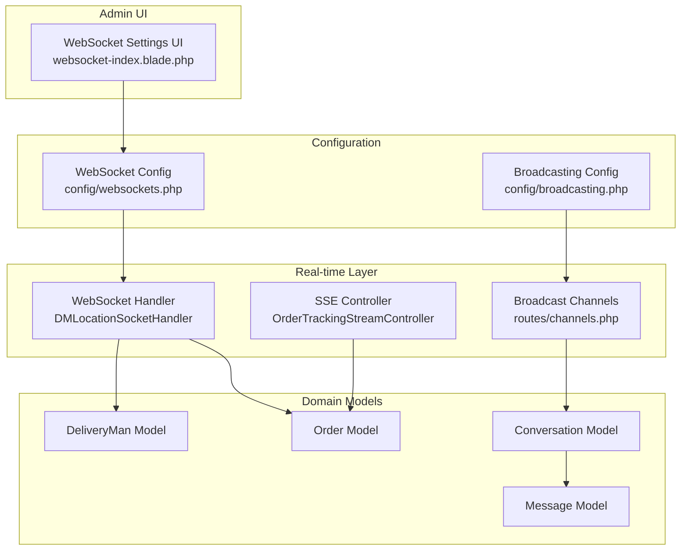
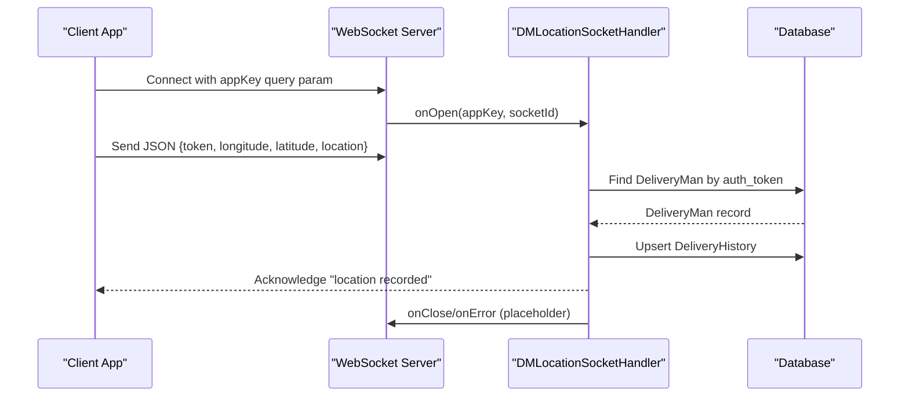
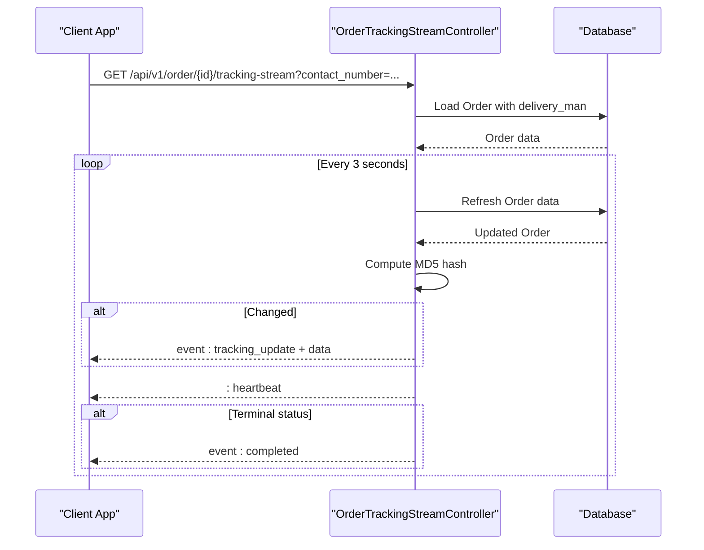
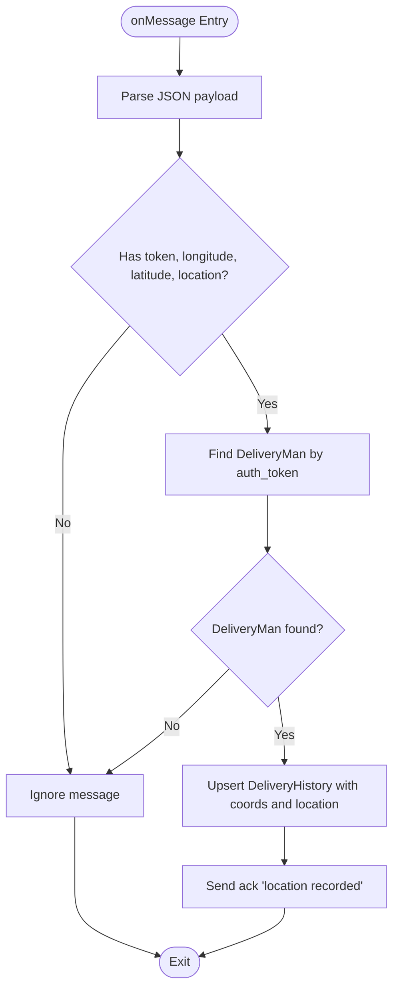
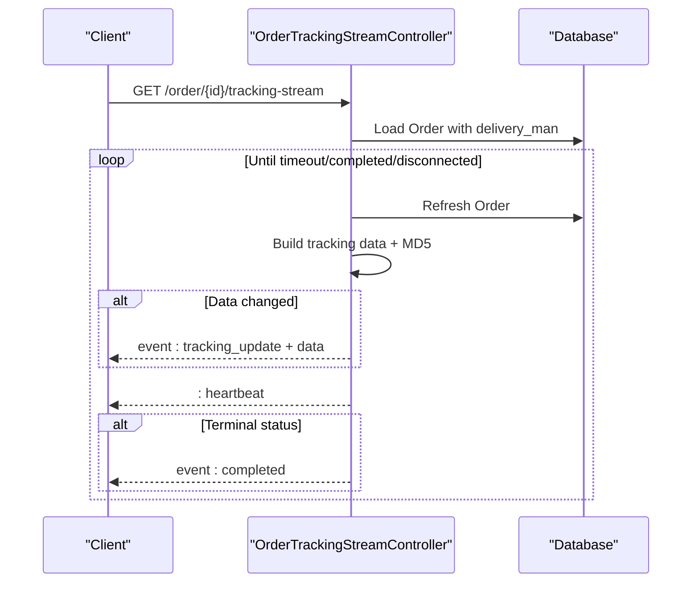
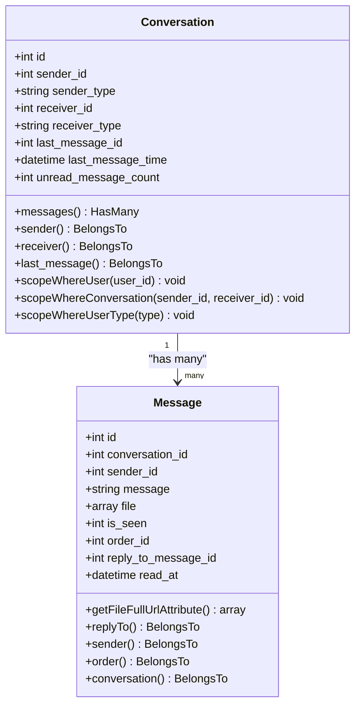
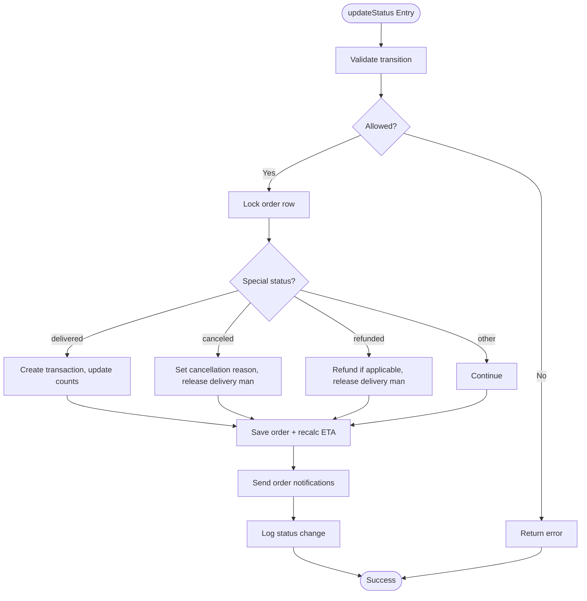
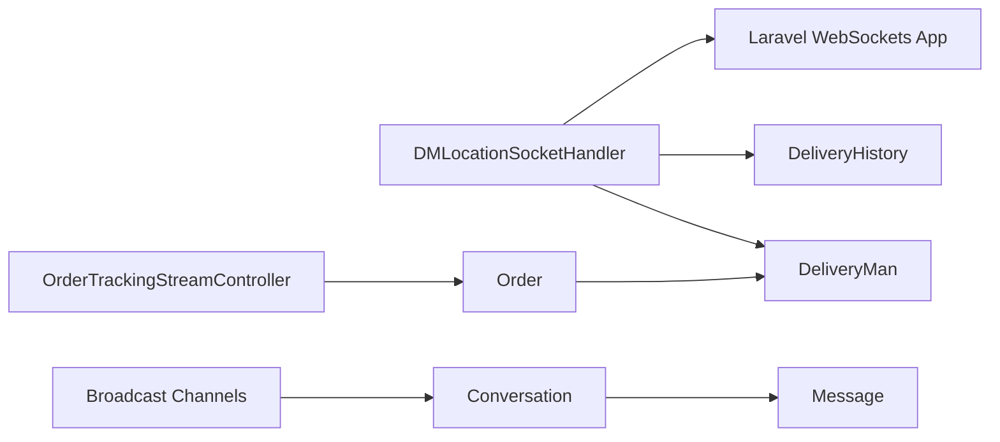

# Real-time WebSocket API

<cite>
**Referenced Files in This Document**
- [DMLocationSocketHandler.php](file://app/WebSockets/Handler/DMLocationSocketHandler.php)
- [websockets.php](file://config/websockets.php)
- [channels.php](file://routes/channels.php)
- [broadcasting.php](file://config/broadcasting.php)
- [OrderTrackingStreamController.php](file://app/Http/Controllers/Api/V1/OrderTrackingStreamController.php)
- [OrderStatusService.php](file://app/Services/OrderStatusService.php)
- [Conversation.php](file://app/Models/Conversation.php)
- [Message.php](file://app/Models/Message.php)
- [websocket-index.blade.php](file://resources/views/admin-views/business-settings/websocket-index.blade.php)
</cite>

## Table of Contents
1. [Introduction](#introduction)
2. [Project Structure](#project-structure)
3. [Core Components](#core-components)
4. [Architecture Overview](#architecture-overview)
5. [Detailed Component Analysis](#detailed-component-analysis)
6. [Dependency Analysis](#dependency-analysis)
7. [Performance Considerations](#performance-considerations)
8. [Troubleshooting Guide](#troubleshooting-guide)
9. [Conclusion](#conclusion)

## Introduction
This document describes the real-time communication capabilities implemented in the backend, focusing on:
- Live delivery person location sharing via WebSocket
- Real-time order status updates via Server-Sent Events (SSE)
- Instant messaging infrastructure for customer-vendor and delivery-man communications

It covers connection establishment, authentication, message protocols, event types, connection management, error handling, and provides client implementation guidance for mobile and web applications.

## Project Structure
The real-time features are implemented using:
- Laravel WebSockets (Ratchet-based) for WebSocket support
- Server-Sent Events (SSE) for order tracking streams
- Broadcasting channels for secure event subscriptions
- Models and services supporting conversations and order status management

**Diagram sources**
- [DMLocationSocketHandler.php:1-83](file://app/WebSockets/Handler/DMLocationSocketHandler.php#L1-L83)
- [OrderTrackingStreamController.php:1-174](file://app/Http/Controllers/Api/V1/OrderTrackingStreamController.php#L1-L174)
- [channels.php:1-19](file://routes/channels.php#L1-L19)
- [websockets.php:1-142](file://config/websockets.php#L1-L142)
- [broadcasting.php:1-65](file://config/broadcasting.php#L1-L65)
- [Conversation.php:1-129](file://app/Models/Conversation.php#L1-L129)
- [Message.php:1-75](file://app/Models/Message.php#L1-L75)
- [websocket-index.blade.php:1-95](file://resources/views/admin-views/business-settings/websocket-index.blade.php#L1-L95)

**Section sources**
- [DMLocationSocketHandler.php:1-83](file://app/WebSockets/Handler/DMLocationSocketHandler.php#L1-L83)
- [OrderTrackingStreamController.php:1-174](file://app/Http/Controllers/Api/V1/OrderTrackingStreamController.php#L1-L174)
- [channels.php:1-19](file://routes/channels.php#L1-L19)
- [websockets.php:1-142](file://config/websockets.php#L1-L142)
- [broadcasting.php:1-65](file://config/broadcasting.php#L1-L65)
- [websocket-index.blade.php:1-95](file://resources/views/admin-views/business-settings/websocket-index.blade.php#L1-L95)

## Core Components
- WebSocket Location Handler: Receives delivery person location updates, authenticates via token, persists to delivery history, and acknowledges receipt.
- SSE Order Tracking: Streams order status and delivery person details to authorized clients with change-detection and heartbeat.
- Messaging Infrastructure: Conversation and Message models enable customer-vendor and delivery-man chat with media support.
- Broadcasting Channels: Secure per-user channel authorization for event listening.
- Configuration: WebSocket server settings, SSL, statistics, and allowed origins.

**Section sources**
- [DMLocationSocketHandler.php:1-83](file://app/WebSockets/Handler/DMLocationSocketHandler.php#L1-L83)
- [OrderTrackingStreamController.php:1-174](file://app/Http/Controllers/Api/V1/OrderTrackingStreamController.php#L1-L174)
- [Conversation.php:1-129](file://app/Models/Conversation.php#L1-L129)
- [Message.php:1-75](file://app/Models/Message.php#L1-L75)
- [channels.php:1-19](file://routes/channels.php#L1-L19)
- [websockets.php:1-142](file://config/websockets.php#L1-L142)

## Architecture Overview
The system integrates three complementary real-time mechanisms:
- WebSocket for live location updates from delivery persons
- SSE for order tracking updates
- Broadcasting for secure per-user event channels

**Diagram sources**
- [DMLocationSocketHandler.php:19-80](file://app/WebSockets/Handler/DMLocationSocketHandler.php#L19-L80)
- [websockets.php:24-35](file://config/websockets.php#L24-L35)

**Diagram sources**
- [OrderTrackingStreamController.php:19-101](file://app/Http/Controllers/Api/V1/OrderTrackingStreamController.php#L19-L101)

## Detailed Component Analysis

### WebSocket: Live Delivery Person Location Sharing
- Connection Establishment
  - Clients connect to the WebSocket server path configured in the WebSocket config.
  - Authentication is performed via a query parameter appKey validated against registered apps.
  - A unique socketId is generated per connection.
- Message Protocol
  - Client sends a JSON payload containing:
    - token: DeliveryMan auth token
    - longitude: numeric
    - latitude: numeric
    - location: human-readable address string
  - On receipt, the handler:
    - Validates presence of required fields
    - Finds the delivery person by token
    - Upserts latest location into delivery history
    - Sends an acknowledgment message back to the client
- Error Handling
  - Unknown app key triggers an unknown app key exception.
  - onClose and onError are placeholders for future implementation.

**Diagram sources**
- [DMLocationSocketHandler.php:19-43](file://app/WebSockets/Handler/DMLocationSocketHandler.php#L19-L43)

**Section sources**
- [DMLocationSocketHandler.php:1-83](file://app/WebSockets/Handler/DMLocationSocketHandler.php#L1-L83)
- [websockets.php:24-35](file://config/websockets.php#L24-L35)

### Server-Sent Events: Order Tracking Stream
- Endpoint
  - GET /api/v1/order/{id}/tracking-stream
  - Supports both authenticated users and guest access via contact number or guest ID.
- Streaming Behavior
  - Responds with text/event-stream headers.
  - Emits events:
    - tracking_update: when order data changes (change-detected via MD5)
    - completed: when order reaches terminal status
    - timeout: after max duration (5 minutes)
    - : heartbeat: periodic keepalive
  - Flushes output and detects client disconnects.
- Data Payload
  - Includes order_id, status, sub_status, timestamp, and delivery_man details (if available).

**Diagram sources**
- [OrderTrackingStreamController.php:19-101](file://app/Http/Controllers/Api/V1/OrderTrackingStreamController.php#L19-L101)

**Section sources**
- [OrderTrackingStreamController.php:1-174](file://app/Http/Controllers/Api/V1/OrderTrackingStreamController.php#L1-L174)

### Instant Messaging: Customer-Vendor and Delivery-Man Communications
- Conversation Model
  - Represents a 1:1 conversation between two parties (sender/receiver).
  - Tracks last message and unread count.
- Message Model
  - Stores message content, sender, order association, reply-to relationship, and file attachments.
  - Provides computed file URLs for media.
- Access Control
  - Broadcasting channels restrict listening to authenticated users matching the channel pattern.
- Implementation Notes
  - The codebase defines models and relationships for messaging.
  - No dedicated WebSocket handler is present for chat; however, the SSE and broadcasting infrastructure can be leveraged for real-time chat updates.

**Diagram sources**
- [Conversation.php:25-129](file://app/Models/Conversation.php#L25-L129)
- [Message.php:12-75](file://app/Models/Message.php#L12-L75)

**Section sources**
- [Conversation.php:1-129](file://app/Models/Conversation.php#L1-L129)
- [Message.php:1-75](file://app/Models/Message.php#L1-L75)
- [channels.php:16-18](file://routes/channels.php#L16-L18)

### Order Status Management and Notifications
- Status Transitions
  - Centralized service validates allowed transitions and performs atomic updates.
  - Handles special cases for delivered, canceled, and refunded states.
- Notifications
  - Extended payload building for push notifications includes ETA calculations and status steps.
- Audit Trail
  - Logs status changes with metadata for compliance and debugging.

**Diagram sources**
- [OrderStatusService.php:89-156](file://app/Services/OrderStatusService.php#L89-L156)

**Section sources**
- [OrderStatusService.php:1-348](file://app/Services/OrderStatusService.php#L1-L348)

## Dependency Analysis
- WebSocket Handler depends on:
  - DeliveryMan and DeliveryHistory models for persistence
  - Laravel WebSockets app key validation and query parameter parsing
- SSE Controller depends on:
  - Order model with delivery_man relationship
  - Request authorization checks for user ownership, guest contact number, or guest ID
- Messaging depends on:
  - Conversation and Message models
  - Broadcasting channel authorization for per-user channels

**Diagram sources**
- [DMLocationSocketHandler.php:5-13](file://app/WebSockets/Handler/DMLocationSocketHandler.php#L5-L13)
- [OrderTrackingStreamController.php:5-8](file://app/Http/Controllers/Api/V1/OrderTrackingStreamController.php#L5-L8)
- [channels.php:16-18](file://routes/channels.php#L16-L18)
- [Conversation.php:61-88](file://app/Models/Conversation.php#L61-L88)
- [Message.php:38-49](file://app/Models/Message.php#L38-L49)

**Section sources**
- [DMLocationSocketHandler.php:1-83](file://app/WebSockets/Handler/DMLocationSocketHandler.php#L1-L83)
- [OrderTrackingStreamController.php:1-174](file://app/Http/Controllers/Api/V1/OrderTrackingStreamController.php#L1-L174)
- [channels.php:1-19](file://routes/channels.php#L1-L19)

## Performance Considerations
- WebSocket
  - Use app capacity limits and statistics logging to monitor load.
  - Keep message payloads minimal (only required location fields).
- SSE
  - Change detection via MD5 prevents unnecessary emissions.
  - Heartbeat keeps connections alive and helps detect disconnections.
  - Max connection duration (5 minutes) prevents resource exhaustion.
- Broadcasting
  - Restrict client-to-client messages if not needed to reduce traffic.
  - Use authorized channels to prevent unauthorized listeners.

[No sources needed since this section provides general guidance]

## Troubleshooting Guide
- WebSocket Connection Issues
  - Ensure appKey matches a configured app and path.
  - Verify allowed origins and SSL settings if applicable.
  - Check statistics and logs for connection drops.
- SSE Streaming Stops
  - Confirm client maintains connection and respects heartbeat.
  - Validate order access parameters (contact_number or guest_id).
  - Watch for timeout events after max duration.
- Messaging Access Denied
  - Confirm broadcasting channel authorization matches user ID.
  - Ensure conversation exists and user belongs to it.

**Section sources**
- [websockets.php:50-57](file://config/websockets.php#L50-L57)
- [OrderTrackingStreamController.php:27-30](file://app/Http/Controllers/Api/V1/OrderTrackingStreamController.php#L27-L30)
- [channels.php:16-18](file://routes/channels.php#L16-L18)

## Conclusion
The platform provides robust real-time capabilities:
- WebSocket for live delivery person location updates with token-based authentication
- SSE for efficient, change-detected order tracking streams
- Messaging models and broadcasting channels enabling secure customer-vendor and delivery-man communications

Clients should implement resilient reconnection strategies, respect heartbeat intervals, and handle terminal and timeout events gracefully. Administrators can tune WebSocket server settings and monitor statistics for optimal performance.