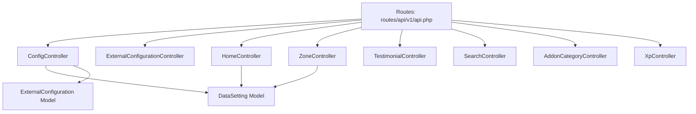
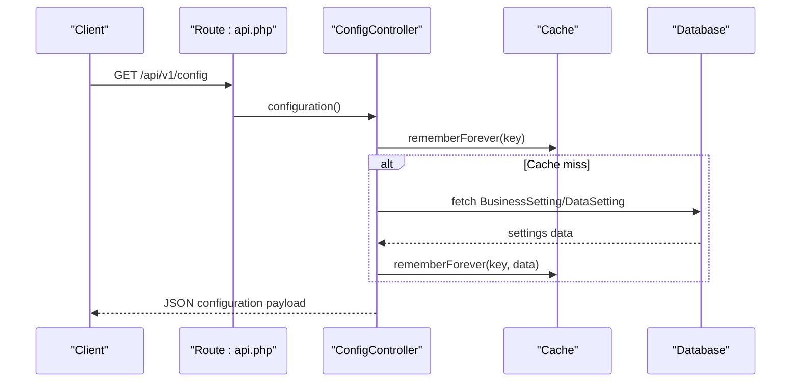
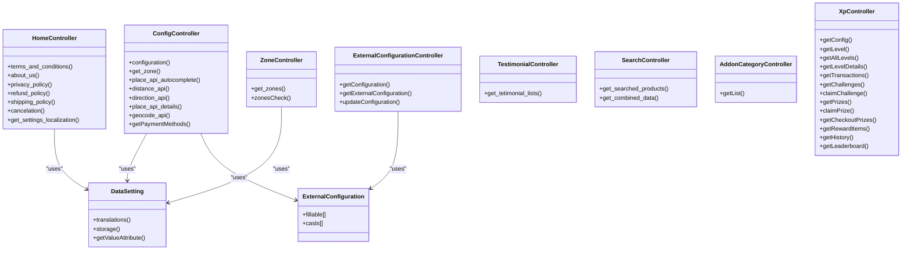

# Utility & Configuration Endpoints

<cite>
**Referenced Files in This Document**
- [routes/api/v1/api.php](file://routes/api/v1/api.php)
- [app/Http/Controllers/Api/V1/ExternalConfigurationController.php](file://app/Http/Controllers/Api/V1/ExternalConfigurationController.php)
- [app/Http/Controllers/Api/V1/HomeController.php](file://app/Http/Controllers/Api/V1/HomeController.php)
- [app/Http/Controllers/Api/V1/ZoneController.php](file://app/Http/Controllers/Api/V1/ZoneController.php)
- [app/Http/Controllers/Api/V1/TestimonialController.php](file://app/Http/Controllers/Api/V1/TestimonialController.php)
- [app/Http/Controllers/Api/V1/SearchController.php](file://app/Http/Controllers/Api/V1/SearchController.php)
- [app/Http/Controllers/Api/V1/ConfigController.php](file://app/Http/Controllers/Api/V1/ConfigController.php)
- [app/Http/Controllers/Api/V1/AddonCategoryController.php](file://app/Http/Controllers/Api/V1/AddonCategoryController.php)
- [app/Http/Controllers/Api/V1/XpController.php](file://app/Http/Controllers/Api/V1/XpController.php)
- [app/Models/DataSetting.php](file://app/Models/DataSetting.php)
- [app/Models/ExternalConfiguration.php](file://app/Models/ExternalConfiguration.php)
- [config/cache.php](file://config/cache.php)
</cite>

## Table of Contents
1. [Introduction](#introduction)
2. [Project Structure](#project-structure)
3. [Core Components](#core-components)
4. [Architecture Overview](#architecture-overview)
5. [Detailed Component Analysis](#detailed-component-analysis)
6. [Dependency Analysis](#dependency-analysis)
7. [Performance Considerations](#performance-considerations)
8. [Troubleshooting Guide](#troubleshooting-guide)
9. [Conclusion](#conclusion)

## Introduction
This document provides comprehensive utility API documentation covering system configuration, static content, and helper endpoints. It focuses on:
- System configuration endpoints for business settings, payment methods, zone management, and external API configurations
- Static content endpoints for terms and conditions, privacy policy, refund policy, and about us pages
- Zone-related endpoints for geographic segmentation and delivery area management
- Testimonial display endpoints, search functionality, and miscellaneous utility endpoints
- Request/response formats, caching strategies, and performance considerations

## Project Structure
The utility endpoints are primarily defined under the API v1 routing namespace and implemented in dedicated controllers. Key routes include:
- Configuration endpoints under `/api/v1/configurations`, `/api/v1/config`, and `/api/v1/offline_payment_method_list`
- Static content endpoints under `/api/v1/terms-and-conditions`, `/api/v1/about-us`, `/api/v1/privacy-policy`, `/api/v1/refund-policy`, `/api/v1/shipping-policy`, and `/api/v1/cancelation`
- Zone endpoints under `/api/v1/zone/list` and `/api/v1/zone/check`
- Testimonial endpoint under `/api/v1/testimonial`
- Search endpoints under `/api/v1/items/search`, `/api/v1/get-combined-data`, and `/api/v1/item/get-generic-name-list`, `/api/v1/item/get-allergy-name-list`, `/api/v1/item/get-nutrition-name-list`
- Miscellaneous utilities including XP configuration under `/api/v1/xp/config`

**Diagram sources**
- [routes/api/v1/api.php:18-546](file://routes/api/v1/api.php#L18-L546)
- [app/Http/Controllers/Api/V1/ConfigController.php:27-316](file://app/Http/Controllers/Api/V1/ConfigController.php#L27-L316)
- [app/Http/Controllers/Api/V1/ExternalConfigurationController.php:13-85](file://app/Http/Controllers/Api/V1/ExternalConfigurationController.php#L13-L85)
- [app/Http/Controllers/Api/V1/HomeController.php:9-67](file://app/Http/Controllers/Api/V1/HomeController.php#L9-L67)
- [app/Http/Controllers/Api/V1/ZoneController.php:11-40](file://app/Http/Controllers/Api/V1/ZoneController.php#L11-L40)
- [app/Http/Controllers/Api/V1/TestimonialController.php:9-18](file://app/Http/Controllers/Api/V1/TestimonialController.php#L9-L18)
- [app/Http/Controllers/Api/V1/SearchController.php:15-283](file://app/Http/Controllers/Api/V1/SearchController.php#L15-L283)
- [app/Http/Controllers/Api/V1/AddonCategoryController.php:11-30](file://app/Http/Controllers/Api/V1/AddonCategoryController.php#L11-L30)
- [app/Http/Controllers/Api/V1/XpController.php:20-49](file://app/Http/Controllers/Api/V1/XpController.php#L20-L49)
- [app/Models/DataSetting.php:12-80](file://app/Models/DataSetting.php#L12-L80)
- [app/Models/ExternalConfiguration.php:8-21](file://app/Models/ExternalConfiguration.php#L8-L21)

**Section sources**
- [routes/api/v1/api.php:18-546](file://routes/api/v1/api.php#L18-L546)

## Core Components
This section outlines the primary utility endpoints grouped by functionality.

- Configuration Endpoints
  - GET `/api/v1/configurations`: Retrieves business configuration including app metadata, payment settings, and system flags
  - GET `/api/v1/configurations/get-external`: Validates external system credentials for Drivemond integration
  - POST `/api/v1/configurations/store`: Updates external configuration settings
  - GET `/api/v1/config`: Returns comprehensive business settings, languages, payment methods, and operational flags
  - GET `/api/v1/config/get-zone-id`: Determines zone ID based on coordinates
  - GET `/api/v1/config/place-api-autocomplete`: Google Places autocomplete via Places API
  - GET `/api/v1/config/distance-api`: Distance matrix via Google Maps API
  - GET `/api/v1/config/direction-api`: Directions via Google Maps API
  - GET `/api/v1/config/place-api-details`: Place details via Google Places API
  - GET `/api/v1/config/geocode-api`: Geocoding via Google Maps API
  - GET `/api/v1/config/get-PaymentMethods`: Retrieves active payment methods
  - GET `/api/v1/offline_payment_method_list`: Lists offline payment methods

- Static Content Endpoints
  - GET `/api/v1/terms-and-conditions`: Returns localized terms and conditions content
  - GET `/api/v1/about-us`: Returns localized about us content
  - GET `/api/v1/privacy-policy`: Returns localized privacy policy content
  - GET `/api/v1/refund-policy`: Returns localized refund policy content
  - GET `/api/v1/shipping-policy`: Returns localized shipping policy content
  - GET `/api/v1/cancelation`: Returns localized cancellation policy content

- Zone Management Endpoints
  - GET `/api/v1/zone/list`: Returns active zones with formatted coordinates
  - GET `/api/v1/zone/check`: Validates if a coordinate falls within a specified zone

- Testimonial and Search Endpoints
  - GET `/api/v1/testimonial`: Returns testimonials list
  - GET `/api/v1/items/search`: Searches items with filters and pagination
  - GET `/api/v1/get-combined-data`: Unified search for items and stores with filters
  - GET `/api/v1/item/get-generic-name-list`: Retrieves generic names
  - GET `/api/v1/item/get-allergy-name-list`: Retrieves allergies
  - GET `/api/v1/item/get-nutrition-name-list`: Retrieves nutrition names

- Miscellaneous Utilities
  - GET `/api/v1/addon-category/list`: Lists addon categories by module
  - GET `/api/v1/xp/config`: Public XP configuration for client-side calculations

**Section sources**
- [routes/api/v1/api.php:18-546](file://routes/api/v1/api.php#L18-L546)
- [app/Http/Controllers/Api/V1/ConfigController.php:27-316](file://app/Http/Controllers/Api/V1/ConfigController.php#L27-L316)
- [app/Http/Controllers/Api/V1/ExternalConfigurationController.php:13-85](file://app/Http/Controllers/Api/V1/ExternalConfigurationController.php#L13-L85)
- [app/Http/Controllers/Api/V1/HomeController.php:9-67](file://app/Http/Controllers/Api/V1/HomeController.php#L9-L67)
- [app/Http/Controllers/Api/V1/ZoneController.php:11-40](file://app/Http/Controllers/Api/V1/ZoneController.php#L11-L40)
- [app/Http/Controllers/Api/V1/TestimonialController.php:9-18](file://app/Http/Controllers/Api/V1/TestimonialController.php#L9-L18)
- [app/Http/Controllers/Api/V1/SearchController.php:15-283](file://app/Http/Controllers/Api/V1/SearchController.php#L15-L283)
- [app/Http/Controllers/Api/V1/AddonCategoryController.php:11-30](file://app/Http/Controllers/Api/V1/AddonCategoryController.php#L11-L30)
- [app/Http/Controllers/Api/V1/XpController.php:20-49](file://app/Http/Controllers/Api/V1/XpController.php#L20-L49)

## Architecture Overview
The utility endpoints follow a layered architecture:
- Routes define endpoint contracts and middleware
- Controllers handle request validation, orchestration, and response formatting
- Models encapsulate data access and relationships
- Caching strategies improve performance for frequently accessed settings
- External APIs integrate with Google Places and Maps services

**Diagram sources**
- [routes/api/v1/api.php:306-315](file://routes/api/v1/api.php#L306-L315)
- [app/Http/Controllers/Api/V1/ConfigController.php:40-316](file://app/Http/Controllers/Api/V1/ConfigController.php#L40-L316)
- [config/cache.php:1-107](file://config/cache.php#L1-L107)

## Detailed Component Analysis

### Configuration Endpoints
Configuration endpoints provide system-wide settings and operational flags.

- GET `/api/v1/configurations`
  - Purpose: Retrieve business configuration including app metadata, payment settings, and system flags
  - Request: None
  - Response: JSON object containing business_name, logo, address, phone, email, country, default_location, currency_symbol, app versions, verification flags, scheduling options, payment enablement flags, languages, social login configs, veg/non-veg toggle, dm/store registration toggles, refund/cancellation/shipping policy flags, home delivery/takeaway status, additional charge settings, partial payment settings, dm picture upload status, add fund status, offline payment status, websocket settings, guest checkout status, disbursement settings, minimum amounts, new customer discount settings, store review reply, admin commission, subscription settings, country picker status, centralize login flags, vehicle pricing minima, admin free delivery settings, SMS/mail status, and system tax type/include status
  - Validation: None
  - Caching: Uses Cache::rememberForever for business settings keys, image storage keys, data settings for flutter landing page, and currency symbol
  - Notes: Includes external system flags and Drivemond app URLs when external system is enabled

- GET `/api/v1/configurations/get-external`
  - Purpose: Validate external system credentials for Drivemond integration
  - Request: Query parameters drivemond_base_url, drivemond_token, mart_token
  - Response: JSON object with status field indicating validation result
  - Validation: Validates presence of required parameters
  - Caching: None
  - Notes: Compares request parameters against stored external configuration values

- POST `/api/v1/configurations/store`
  - Purpose: Update external configuration settings
  - Request: Form fields for drivemond_app_url_android, drivemond_app_url_ios
  - Response: JSON object with message field
  - Validation: None
  - Caching: None
  - Notes: Updates external configuration records in database

- GET `/api/v1/config`
  - Purpose: Comprehensive business settings endpoint
  - Request: None
  - Response: Same as GET `/api/v1/configurations` plus additional operational flags and settings
  - Validation: None
  - Caching: Extensive use of Cache::rememberForever for various settings
  - Notes: Includes payment method lists, language configurations, and operational flags

- GET `/api/v1/config/get-zone-id`
  - Purpose: Determine zone ID based on latitude and longitude coordinates
  - Request: Headers lat, lng
  - Response: JSON object with zone_id and zone_data arrays
  - Validation: Validates presence of lat/lng headers
  - Caching: None
  - Notes: Returns nearest active zone with payment method flags

- GET `/api/v1/config/place-api-autocomplete`
  - Purpose: Google Places autocomplete
  - Request: Query parameter search_text
  - Response: JSON response from Google Places API
  - Validation: Validates presence of search_text
  - Caching: None
  - Notes: Uses configured Google Places API key

- GET `/api/v1/config/distance-api`
  - Purpose: Google Maps distance matrix
  - Request: Query parameters for origin/destination
  - Response: JSON response from Google Maps API
  - Validation: Validates required parameters
  - Caching: None
  - Notes: Uses configured Google Maps API key

- GET `/api/v1/config/direction-api`
  - Purpose: Google Maps directions
  - Request: Query parameters for origin/destination
  - Response: JSON response from Google Maps API
  - Validation: Validates required parameters
  - Caching: None
  - Notes: Uses configured Google Maps API key

- GET `/api/v1/config/place-api-details`
  - Purpose: Google Places details
  - Request: Query parameters for place ID
  - Response: JSON response from Google Places API
  - Validation: Validates required parameters
  - Caching: None
  - Notes: Uses configured Google Places API key

- GET `/api/v1/config/geocode-api`
  - Purpose: Google Maps geocoding
  - Request: Query parameters for address or coordinates
  - Response: JSON response from Google Maps API
  - Validation: Validates required parameters
  - Caching: None
  - Notes: Uses configured Google Maps API key

- GET `/api/v1/config/get-PaymentMethods`
  - Purpose: Retrieve active payment methods
  - Request: None
  - Response: JSON array of payment methods
  - Validation: None
  - Caching: None
  - Notes: Uses addon helper to determine published vs default payment methods

- GET `/api/v1/offline_payment_method_list`
  - Purpose: List offline payment methods
  - Request: None
  - Response: JSON array of offline payment methods
  - Validation: None
  - Caching: None
  - Notes: Returns available offline payment methods

**Section sources**
- [routes/api/v1/api.php:18-546](file://routes/api/v1/api.php#L18-L546)
- [app/Http/Controllers/Api/V1/ConfigController.php:27-316](file://app/Http/Controllers/Api/V1/ConfigController.php#L27-L316)
- [app/Http/Controllers/Api/V1/ExternalConfigurationController.php:13-85](file://app/Http/Controllers/Api/V1/ExternalConfigurationController.php#L13-L85)

### Static Content Endpoints
Static content endpoints serve localized content for legal and informational pages.

- GET `/api/v1/terms-and-conditions`
  - Purpose: Retrieve localized terms and conditions content
  - Request: Header X-localization (optional, defaults to 'en')
  - Response: JSON string containing content
  - Validation: None
  - Caching: None
  - Notes: Uses DataSetting model with localization support

- GET `/api/v1/about-us`
  - Purpose: Retrieve localized about us content
  - Request: Header X-localization (optional, defaults to 'en')
  - Response: JSON string containing content
  - Validation: None
  - Caching: None
  - Notes: Uses DataSetting model with localization support

- GET `/api/v1/privacy-policy`
  - Purpose: Retrieve localized privacy policy content
  - Request: Header X-localization (optional, defaults to 'en')
  - Response: JSON string containing content
  - Validation: None
  - Caching: None
  - Notes: Uses DataSetting model with localization support

- GET `/api/v1/refund-policy`
  - Purpose: Retrieve localized refund policy content
  - Request: Header X-localization (optional, defaults to 'en')
  - Response: JSON string containing content
  - Validation: None
  - Caching: None
  - Notes: Uses DataSetting model with localization support

- GET `/api/v1/shipping-policy`
  - Purpose: Retrieve localized shipping policy content
  - Request: Header X-localization (optional, defaults to 'en')
  - Response: JSON string containing content
  - Validation: None
  - Caching: None
  - Notes: Uses DataSetting model with localization support

- GET `/api/v1/cancelation`
  - Purpose: Retrieve localized cancellation policy content
  - Request: Header X-localization (optional, defaults to 'en')
  - Response: JSON string containing content
  - Validation: None
  - Caching: None
  - Notes: Uses DataSetting model with localization support

**Section sources**
- [routes/api/v1/api.php:25-31](file://routes/api/v1/api.php#L25-L31)
- [app/Http/Controllers/Api/V1/HomeController.php:9-67](file://app/Http/Controllers/Api/V1/HomeController.php#L9-L67)
- [app/Models/DataSetting.php:12-80](file://app/Models/DataSetting.php#L12-L80)

### Zone Management Endpoints
Zone endpoints handle geographic segmentation and delivery area management.

- GET `/api/v1/zone/list`
  - Purpose: Retrieve active zones with formatted coordinates
  - Request: None
  - Response: JSON array of zones with formated_coordinates
  - Validation: None
  - Caching: None
  - Notes: Formats polygon coordinates for client consumption

- GET `/api/v1/zone/check`
  - Purpose: Validate if a coordinate falls within a specified zone
  - Request: Query parameters lat, lng, zone_id
  - Response: JSON boolean indicating inclusion
  - Validation: Validates presence of required parameters
  - Caching: None
  - Notes: Uses spatial queries to check point-in-polygon

**Section sources**
- [routes/api/v1/api.php:33-35](file://routes/api/v1/api.php#L33-L35)
- [app/Http/Controllers/Api/V1/ZoneController.php:11-40](file://app/Http/Controllers/Api/V1/ZoneController.php#L11-L40)

### Testimonial and Search Endpoints
These endpoints provide dynamic content and search capabilities.

- GET `/api/v1/testimonial`
  - Purpose: Retrieve testimonials list
  - Request: None
  - Response: JSON array of testimonials
  - Validation: None
  - Caching: None
  - Notes: Returns stored testimonials from business settings

- GET `/api/v1/items/search`
  - Purpose: Search items with filters and pagination
  - Request: Headers zoneId (required), Query parameters name (required), limit, offset, category_ids, brand_ids, filter, type, min_price, max_price, rating_count, store_id, category_id
  - Response: JSON object with total_size, limit, offset, products array, categories array
  - Validation: Validates presence of zoneId header and name parameter
  - Caching: None
  - Notes: Supports advanced filtering including price range, ratings, availability, and coupons

- GET `/api/v1/get-combined-data`
  - Purpose: Unified search for items and stores
  - Request: Headers zoneId (required), Query parameters list_type (required: item|store), data_type (required), limit, offset, longitude, latitude, filter, rating_count, category_ids, brand_ids, product_id, type, min_price, max_price
  - Response: JSON object with appropriate structure based on list_type
  - Validation: Validates presence of zoneId header and list_type parameter
  - Caching: None
  - Notes: Supports multiple data types (searched, discounted, brand, new, category)

- GET `/api/v1/item/get-generic-name-list`
  - Purpose: Retrieve generic names
  - Request: None
  - Response: JSON array of generic names
  - Validation: None
  - Caching: None
  - Notes: Returns available generic names for items

- GET `/api/v1/item/get-allergy-name-list`
  - Purpose: Retrieve allergies
  - Request: None
  - Response: JSON array of allergies
  - Validation: None
  - Caching: None
  - Notes: Returns available allergies for items

- GET `/api/v1/item/get-nutrition-name-list`
  - Purpose: Retrieve nutrition names
  - Request: None
  - Response: JSON array of nutrition names
  - Validation: None
  - Caching: None
  - Notes: Returns available nutrition names for items

**Section sources**
- [routes/api/v1/api.php:317-331](file://routes/api/v1/api.php#L317-L331)
- [app/Http/Controllers/Api/V1/TestimonialController.php:9-18](file://app/Http/Controllers/Api/V1/TestimonialController.php#L9-L18)
- [app/Http/Controllers/Api/V1/SearchController.php:15-283](file://app/Http/Controllers/Api/V1/SearchController.php#L15-L283)

### Miscellaneous Utilities
Additional utility endpoints for addon categories and XP configuration.

- GET `/api/v1/addon-category/list`
  - Purpose: List addon categories by module
  - Request: Query parameters limit, offset, module_id (required)
  - Response: JSON array of addon categories
  - Validation: Validates presence of module_id and numeric limit/offset
  - Caching: None
  - Notes: Returns active addon categories filtered by module

- GET `/api/v1/xp/config`
  - Purpose: Public XP configuration for client-side calculations
  - Request: None
  - Response: JSON object with XP settings including enabled flag, per-order/review amounts, signup bonus, max level, multipliers by category, multiplier event details, and streak bonus
  - Validation: None
  - Caching: None
  - Notes: No authentication required; designed for client-side caching

**Section sources**
- [routes/api/v1/api.php:33-40](file://routes/api/v1/api.php#L33-L40)
- [app/Http/Controllers/Api/V1/AddonCategoryController.php:11-30](file://app/Http/Controllers/Api/V1/AddonCategoryController.php#L11-L30)
- [app/Http/Controllers/Api/V1/XpController.php:20-49](file://app/Http/Controllers/Api/V1/XpController.php#L20-L49)

## Dependency Analysis
The utility endpoints depend on several key components:

**Diagram sources**
- [app/Http/Controllers/Api/V1/ConfigController.php:27-316](file://app/Http/Controllers/Api/V1/ConfigController.php#L27-L316)
- [app/Http/Controllers/Api/V1/ExternalConfigurationController.php:13-85](file://app/Http/Controllers/Api/V1/ExternalConfigurationController.php#L13-L85)
- [app/Http/Controllers/Api/V1/HomeController.php:9-67](file://app/Http/Controllers/Api/V1/HomeController.php#L9-L67)
- [app/Http/Controllers/Api/V1/ZoneController.php:11-40](file://app/Http/Controllers/Api/V1/ZoneController.php#L11-L40)
- [app/Http/Controllers/Api/V1/TestimonialController.php:9-18](file://app/Http/Controllers/Api/V1/TestimonialController.php#L9-L18)
- [app/Http/Controllers/Api/V1/SearchController.php:15-283](file://app/Http/Controllers/Api/V1/SearchController.php#L15-L283)
- [app/Http/Controllers/Api/V1/AddonCategoryController.php:11-30](file://app/Http/Controllers/Api/V1/AddonCategoryController.php#L11-L30)
- [app/Http/Controllers/Api/V1/XpController.php:20-574](file://app/Http/Controllers/Api/V1/XpController.php#L20-L574)
- [app/Models/DataSetting.php:12-80](file://app/Models/DataSetting.php#L12-L80)
- [app/Models/ExternalConfiguration.php:8-21](file://app/Models/ExternalConfiguration.php#L8-L21)

**Section sources**
- [app/Http/Controllers/Api/V1/ConfigController.php:27-316](file://app/Http/Controllers/Api/V1/ConfigController.php#L27-L316)
- [app/Http/Controllers/Api/V1/ExternalConfigurationController.php:13-85](file://app/Http/Controllers/Api/V1/ExternalConfigurationController.php#L13-L85)
- [app/Http/Controllers/Api/V1/HomeController.php:9-67](file://app/Http/Controllers/Api/V1/HomeController.php#L9-L67)
- [app/Http/Controllers/Api/V1/ZoneController.php:11-40](file://app/Http/Controllers/Api/V1/ZoneController.php#L11-L40)
- [app/Http/Controllers/Api/V1/TestimonialController.php:9-18](file://app/Http/Controllers/Api/V1/TestimonialController.php#L9-L18)
- [app/Http/Controllers/Api/V1/SearchController.php:15-283](file://app/Http/Controllers/Api/V1/SearchController.php#L15-L283)
- [app/Http/Controllers/Api/V1/AddonCategoryController.php:11-30](file://app/Http/Controllers/Api/V1/AddonCategoryController.php#L11-L30)
- [app/Http/Controllers/Api/V1/XpController.php:20-574](file://app/Http/Controllers/Api/V1/XpController.php#L20-L574)
- [app/Models/DataSetting.php:12-80](file://app/Models/DataSetting.php#L12-L80)
- [app/Models/ExternalConfiguration.php:8-21](file://app/Models/ExternalConfiguration.php#L8-L21)

## Performance Considerations
- Caching Strategy
  - Business settings are cached using Cache::rememberForever for improved performance
  - Image storage locations and currency symbols are cached separately
  - Data settings for flutter landing page are cached
  - Module configuration is cached
  - Currency symbol is cached
  - Settings status values are cached
- External API Calls
  - Google Places and Maps API calls are made directly from the controller
  - Consider implementing retry logic and timeout handling for external API calls
- Pagination
  - Search endpoints support pagination via limit and offset parameters
  - Recommended to set reasonable limits to prevent excessive resource usage
- Spatial Queries
  - Zone validation uses spatial queries; ensure proper indexing on geometry columns
- Response Formatting
  - Product and store data are formatted using centralized helper functions
  - Consider lazy loading relationships to reduce memory usage

**Section sources**
- [app/Http/Controllers/Api/V1/ConfigController.php:53-81](file://app/Http/Controllers/Api/V1/ConfigController.php#L53-L81)
- [app/Http/Controllers/Api/V1/ConfigController.php:318-325](file://app/Http/Controllers/Api/V1/ConfigController.php#L318-L325)
- [config/cache.php:1-107](file://config/cache.php#L1-L107)

## Troubleshooting Guide
- Validation Errors
  - Many endpoints return structured error responses with code and message fields
  - Common validation errors include missing required headers (zoneId) and invalid parameters
- Authentication Issues
  - Some endpoints require authentication; ensure proper tokens are included
  - XP endpoints include both public and authenticated variants
- External API Failures
  - Google Places and Maps API calls may fail due to rate limits or invalid keys
  - Check API key configuration and quota limits
- Caching Problems
  - If settings appear stale, clear application cache
  - Verify cache configuration in config/cache.php
- Geographic Issues
  - Zone validation requires proper coordinate formatting
  - Ensure coordinates are in WGS84 format (lat/lng)

**Section sources**
- [app/Http/Controllers/Api/V1/SearchController.php:17-32](file://app/Http/Controllers/Api/V1/SearchController.php#L17-L32)
- [app/Http/Controllers/Api/V1/ConfigController.php:327-361](file://app/Http/Controllers/Api/V1/ConfigController.php#L327-L361)
- [config/cache.php:1-107](file://config/cache.php#L1-L107)

## Conclusion
The utility and configuration endpoints provide a comprehensive foundation for system configuration, static content management, and geographic segmentation. The implementation leverages caching for performance, supports localization for content endpoints, and integrates with external APIs for enhanced functionality. Proper validation, error handling, and caching strategies ensure reliable operation across different deployment environments.