# Vendor API

<cite>
**Referenced Files in This Document**
- [routes/vendor.php](file://routes/vendor.php)
- [routes/api/v1/api.php](file://routes/api/v1/api.php)
- [VendorController.php](file://app/Http/Controllers/Api/V1/Vendor/VendorController.php)
- [ItemController.php](file://app/Http/Controllers/Api/V1/Vendor/ItemController.php)
- [ReportController.php](file://app/Http/Controllers/Api/V1/Vendor/ReportController.php)
- [WithdrawMethodController.php](file://app/Http/Controllers/Api/V1/Vendor/WithdrawMethodController.php)
- [BusinessSettingsController.php](file://app/Http/Controllers/Vendor/BusinessSettingsController.php)
- [POSController.php](file://app/Http/Controllers/Vendor/POSController.php)
- [ProfileController.php](file://app/Http/Controllers/Vendor/ProfileController.php)
</cite>

## Table of Contents
1. [Introduction](#introduction)
2. [Project Structure](#project-structure)
3. [Core Components](#core-components)
4. [Architecture Overview](#architecture-overview)
5. [Detailed Component Analysis](#detailed-component-analysis)
6. [Dependency Analysis](#dependency-analysis)
7. [Performance Considerations](#performance-considerations)
8. [Troubleshooting Guide](#troubleshooting-guide)
9. [Conclusion](#conclusion)

## Introduction
This document provides comprehensive vendor API documentation for vendor profile management, order management, inventory operations, and business reporting. It covers vendor profile endpoints (updates, business setup, schedule management, announcements), order management operations (acceptance, preparation, status updates, payment handling), inventory management endpoints (items, categories, addons, coupons, banners), and business reporting endpoints (expenses, tax reports, disbursement reports). It also documents POS system integration, withdrawal management, and subscription handling.

## Project Structure
The vendor API is organized around two primary routing layers:
- Web routes for vendor panel operations under the vendor namespace.
- API routes for vendor mobile/web app operations under the vendor API namespace.

Key controller groups include:
- Vendor profile and business settings
- Order management
- Inventory (items, categories, addons, coupons, banners)
- Reporting (expenses, tax, disbursement)
- POS integration
- Withdrawal and payment methods
- Subscription management

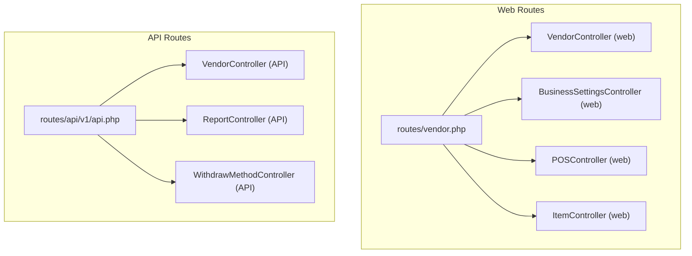

**Diagram sources**
- [routes/vendor.php:1-307](file://routes/vendor.php#L1-L307)
- [routes/api/v1/api.php:153-202](file://routes/api/v1/api.php#L153-L202)

**Section sources**
- [routes/vendor.php:1-307](file://routes/vendor.php#L1-L307)
- [routes/api/v1/api.php:153-202](file://routes/api/v1/api.php#L153-L202)

## Core Components
- Vendor profile and business settings: Retrieve/update vendor/store profile, manage schedules, toggle settings, and handle announcements.
- Order management: List orders, update statuses, add payment reference, adjust amounts/discounts, and send OTP verification.
- Inventory management: CRUD for items, categories, addons, coupons, and banners; stock updates and bulk import/export.
- Reporting: Expense report, VAT/Tax report, and disbursement report with pagination and filtering.
- POS integration: Variant pricing, cart operations, customer lookup, order placement, and delivery info.
- Withdrawal and payments: Withdraw requests, payment methods, collected cash payments, and wallet adjustments.
- Subscription handling: Package details, invoices, cancellation, switching plans, transactions, and refunds.

**Section sources**
- [VendorController.php:45-184](file://app/Http/Controllers/Api/V1/Vendor/VendorController.php#L45-L184)
- [BusinessSettingsController.php:18-313](file://app/Http/Controllers/Vendor/BusinessSettingsController.php#L18-L313)
- [POSController.php:25-743](file://app/Http/Controllers/Vendor/POSController.php#L25-L743)
- [ItemController.php:27-800](file://app/Http/Controllers/Api/V1/Vendor/ItemController.php#L27-L800)
- [ReportController.php:17-208](file://app/Http/Controllers/Api/V1/Vendor/ReportController.php#L17-L208)
- [WithdrawMethodController.php:13-144](file://app/Http/Controllers/Api/V1/Vendor/WithdrawMethodController.php#L13-L144)

## Architecture Overview
The vendor API follows a layered architecture:
- Routing layer defines endpoints grouped by domain (profile, orders, inventory, reports, POS, withdrawals, subscriptions).
- Controller layer handles request validation, business logic orchestration, and response formatting.
- Data access layer interacts with models and repositories for persistence.
- Integration points include payment gateways, notifications, and tax calculation modules.

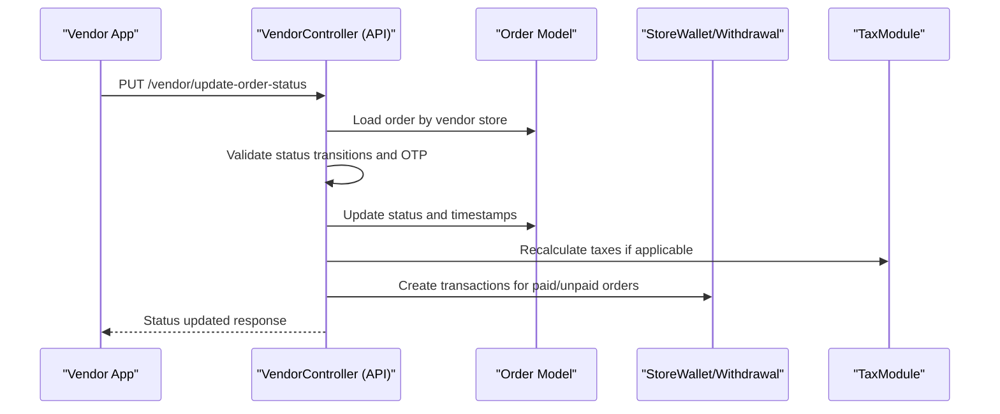

**Diagram sources**
- [routes/api/v1/api.php:153-202](file://routes/api/v1/api.php#L153-L202)
- [VendorController.php:347-504](file://app/Http/Controllers/Api/V1/Vendor/VendorController.php#L347-L504)

**Section sources**
- [routes/api/v1/api.php:153-202](file://routes/api/v1/api.php#L153-L202)
- [VendorController.php:347-504](file://app/Http/Controllers/Api/V1/Vendor/VendorController.php#L347-L504)

## Detailed Component Analysis

### Vendor Profile Management
Endpoints:
- GET /vendor/profile: Retrieve vendor/store profile, schedules, module info, and earnings metrics.
- PUT /vendor/update-profile: Update personal details and avatar.
- PUT /vendor/update-announcment: Toggle and set announcement message.
- GET /vendor/earning-info: Get earnings summary.
- PUT /vendor/update-fcm-token: Update FCM token for push notifications.
- DELETE /vendor/remove-account: Soft-delete vendor account with constraints.

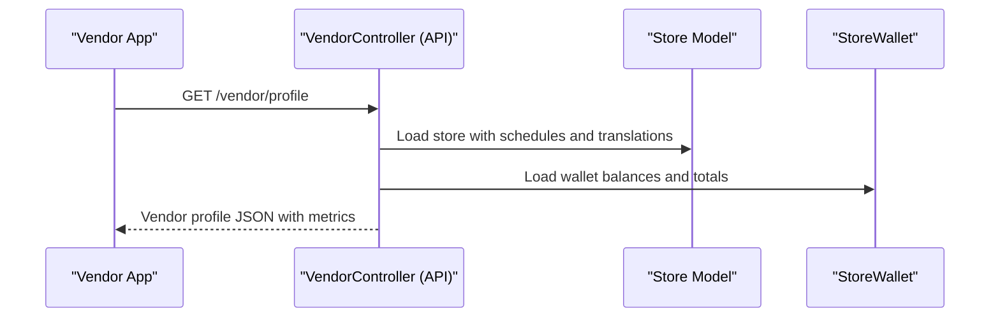

**Diagram sources**
- [routes/api/v1/api.php:153-202](file://routes/api/v1/api.php#L153-L202)
- [VendorController.php:45-184](file://app/Http/Controllers/Api/V1/Vendor/VendorController.php#L45-L184)

**Section sources**
- [routes/api/v1/api.php:153-202](file://routes/api/v1/api.php#L153-L202)
- [VendorController.php:45-184](file://app/Http/Controllers/Api/V1/Vendor/VendorController.php#L45-L184)

### Business Settings and Schedule Management
Endpoints:
- GET /vendor/business-settings/store-setup: Load store setup page.
- POST /vendor/business-settings/add-schedule: Add daily schedule slots with overlap validation.
- GET /vendor/business-settings/remove-schedule/{id}: Remove schedule slot.
- POST /vendor/business-settings/update-setup/{store}: Update store metadata and delivery settings.
- GET /vendor/business-settings/toggle-settings-status/{store}/{status}/{menu}: Toggle store features.
- GET /vendor/business-settings/notification-setup: Load notification settings.
- GET /vendor/business-settings/notification-status-change/{key}/{type}: Toggle mail/push/SMS notifications.

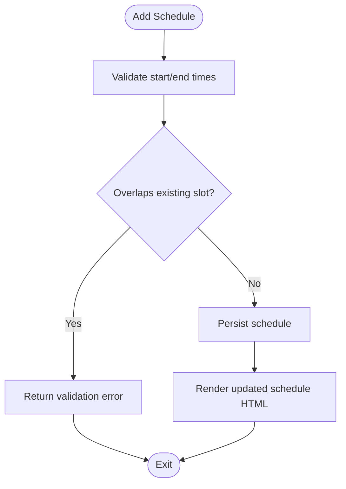

**Diagram sources**
- [BusinessSettingsController.php:225-273](file://app/Http/Controllers/Vendor/BusinessSettingsController.php#L225-L273)

**Section sources**
- [BusinessSettingsController.php:225-273](file://app/Http/Controllers/Vendor/BusinessSettingsController.php#L225-L273)

### Order Management
Endpoints:
- GET /vendor/current-orders: List current orders filtered by confirmation model.
- GET /vendor/completed-orders: Paginated completed orders with status filter.
- GET /vendor/canceled-orders: Paginated canceled orders.
- GET /vendor/all-orders: List all orders.
- GET /vendor/order-details: Retrieve order details.
- GET /vendor/order: Retrieve formatted order data.
- PUT /vendor/update-order-status: Update order status with validations and OTP verification.
- PUT /vendor/update-order-amount: Adjust order amount and recalculate taxes/discounts.
- POST /vendor/add-payment-ref-code/{id}: Add payment reference code.
- POST /vendor/add-order-proof/{id}: Upload order proof images.
- POST /vendor/send-order-otp: Send OTP via push notification to customer.

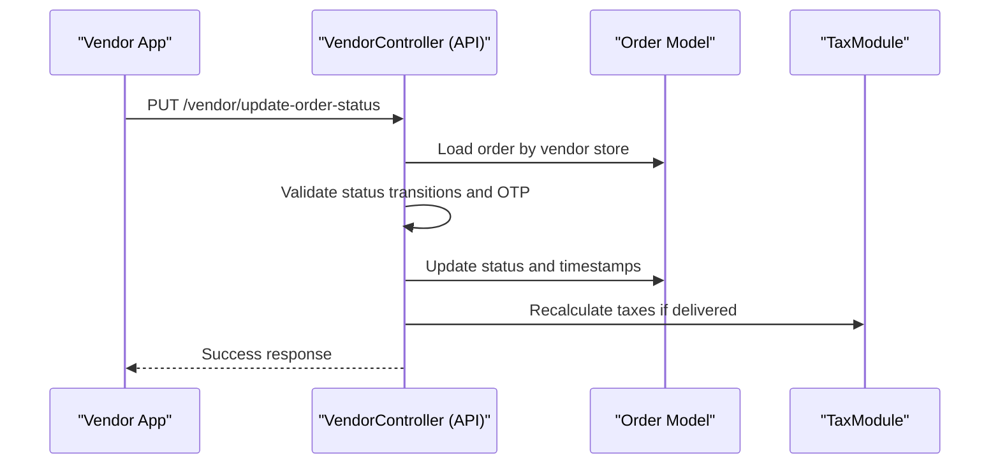

**Diagram sources**
- [routes/api/v1/api.php:153-202](file://routes/api/v1/api.php#L153-L202)
- [VendorController.php:347-504](file://app/Http/Controllers/Api/V1/Vendor/VendorController.php#L347-L504)

**Section sources**
- [routes/api/v1/api.php:153-202](file://routes/api/v1/api.php#L153-L202)
- [VendorController.php:242-504](file://app/Http/Controllers/Api/V1/Vendor/VendorController.php#L242-L504)

### Inventory Management
Endpoints:
- Items:
  - POST /vendor/item/store: Create item with variations, addons, tags, nutrition, allergies, and generic names.
  - PUT /vendor/item/update/{id}: Update item with approval workflow.
  - GET /vendor/item/status/{id}/{status}: Toggle item status.
  - GET /vendor/item/list: List items with filters and pagination.
  - GET /vendor/get-items-list: List items for vendor app with category and search filters.
  - POST /vendor/item/stock-update: Bulk stock update.
  - GET /vendor/item/stock-limit-list: Stock limit list.
  - GET /vendor/item/get-stock: Get item stock.
  - POST /vendor/item/bulk-import and POST /vendor/item/bulk-export: Import/export items.
- Categories, Addons, Coupons, Banners: CRUD endpoints under respective prefixes with status toggles and exports.

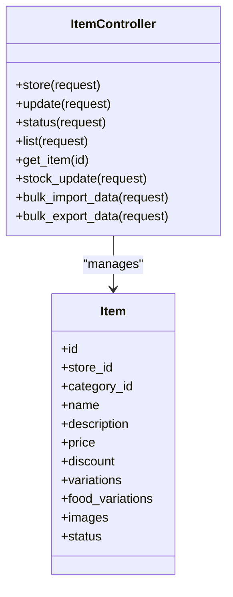

**Diagram sources**
- [ItemController.php:27-800](file://app/Http/Controllers/Api/V1/Vendor/ItemController.php#L27-L800)

**Section sources**
- [ItemController.php:27-800](file://app/Http/Controllers/Api/V1/Vendor/ItemController.php#L27-L800)

### Business Reporting
Endpoints:
- GET /vendor/get-expense: Expense report with date range and search.
- GET /vendor/get-tax-report: Vendor tax report with date range and search.
- GET /vendor/get-disbursement-report: Disbursement report with pagination and status summaries.

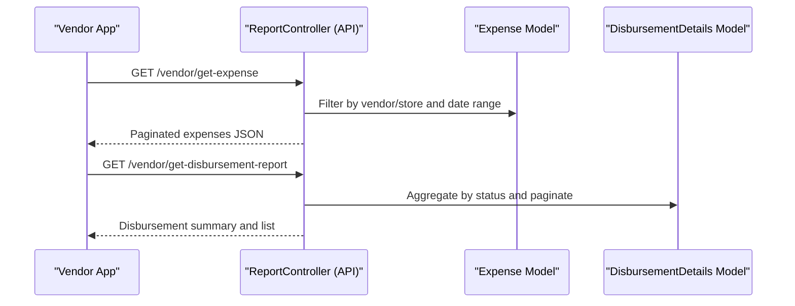

**Diagram sources**
- [routes/api/v1/api.php:153-202](file://routes/api/v1/api.php#L153-L202)
- [ReportController.php:17-208](file://app/Http/Controllers/Api/V1/Vendor/ReportController.php#L17-L208)

**Section sources**
- [routes/api/v1/api.php:153-202](file://routes/api/v1/api.php#L153-L202)
- [ReportController.php:17-208](file://app/Http/Controllers/Api/V1/Vendor/ReportController.php#L17-L208)

### POS System Integration
Endpoints:
- POST /vendor/pos/variant_price: Calculate variant price with addons.
- POST /vendor/pos/add-to-cart: Add items to cart with variations and addons.
- POST /vendor/pos/remove-from-cart: Remove item from cart.
- POST /vendor/pos/update-quantity: Update cart item quantity.
- POST /vendor/pos/empty-cart: Clear cart.
- POST /vendor/pos/add-delivery-info: Save delivery address info.
- POST /vendor/pos/order: Place order with tax calculation and stock updates.
- GET /vendor/pos/customers: Customer search for walk-in sales.
- GET /vendor/pos/data: Extra charges based on distance and vehicle coverage.

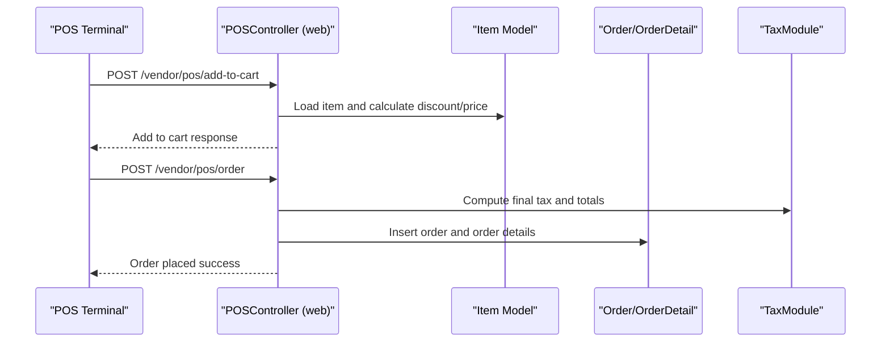

**Diagram sources**
- [routes/vendor.php:28-48](file://routes/vendor.php#L28-L48)
- [POSController.php:171-692](file://app/Http/Controllers/Vendor/POSController.php#L171-L692)

**Section sources**
- [routes/vendor.php:28-48](file://routes/vendor.php#L28-L48)
- [POSController.php:171-692](file://app/Http/Controllers/Vendor/POSController.php#L171-L692)

### Withdrawal Management and Payments
Endpoints:
- GET /vendor/get-withdraw-list: List withdrawal requests with status mapping.
- POST /vendor/request-withdraw: Submit withdrawal request with method fields.
- POST /vendor/make-collected-cash-payment: Initiate collected cash payment via gateway.
- POST /vendor/make-wallet-adjustment: Auto-adjust wallet discrepancies.
- GET /vendor/wallet-payment-list: List wallet payment transactions.
- GET /vendor/get-withdraw-method-list: List active withdrawal methods.
- Grouped endpoints for managing disbursement withdrawal methods (list, store, make-default, delete).

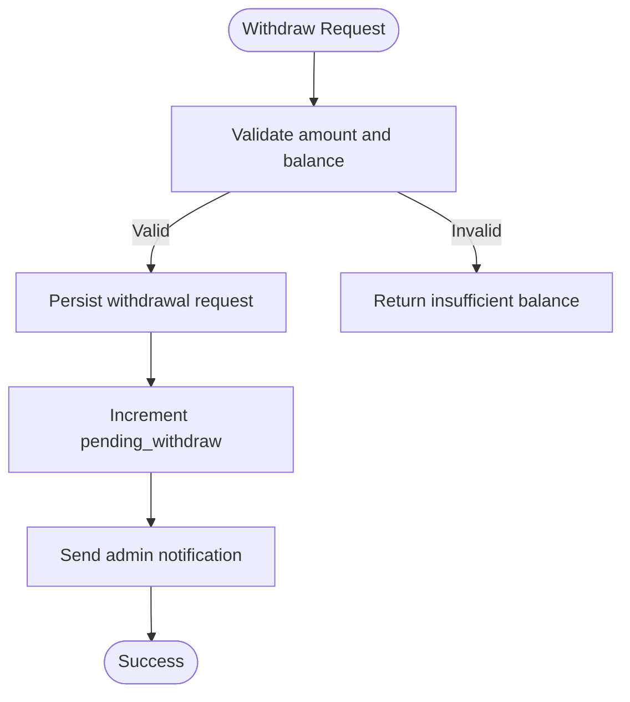

**Diagram sources**
- [routes/api/v1/api.php:153-202](file://routes/api/v1/api.php#L153-L202)
- [VendorController.php:832-891](file://app/Http/Controllers/Api/V1/Vendor/VendorController.php#L832-L891)

**Section sources**
- [routes/api/v1/api.php:153-202](file://routes/api/v1/api.php#L153-L202)
- [VendorController.php:800-891](file://app/Http/Controllers/Api/V1/Vendor/VendorController.php#L800-L891)
- [WithdrawMethodController.php:13-144](file://app/Http/Controllers/Api/V1/Vendor/WithdrawMethodController.php#L13-L144)

### Subscription Handling
Endpoints:
- GET /vendor/subscription/subscriber-detail: View subscriber details.
- GET /vendor/subscription/invoice/{id}: Download invoice.
- POST /vendor/subscription/cancel-subscription/{id}: Cancel subscription.
- POST /vendor/subscription/switch-to-commission/{id}: Switch plan.
- GET /vendor/subscription/package-view/{id}/{store_id}: View package details.
- GET /vendor/subscription/subscriber-transactions/{id}: List transactions.
- GET /vendor/subscription/subscriber-transaction-export: Export transactions.
- GET /vendor/subscription/subscriber-wallet-transactions: View wallet transactions for refunds.

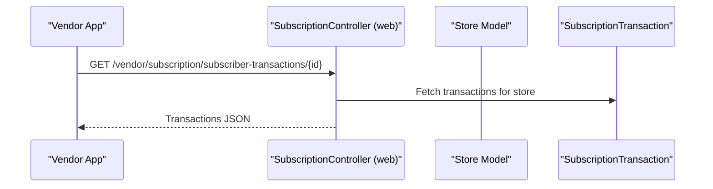

**Diagram sources**
- [routes/vendor.php:51-63](file://routes/vendor.php#L51-L63)

**Section sources**
- [routes/vendor.php:51-63](file://routes/vendor.php#L51-L63)

## Dependency Analysis
- Controllers depend on models (Order, Item, Store, WithdrawRequest, DisbursementDetails, Expense) and services (tax calculation, order logic).
- Routes define middleware layers for vendor authentication and subscription/module gating.
- Tax module integration is invoked for order tax calculations during order updates and POS order placement.
- Payment gateway integration is used for collected cash payments.

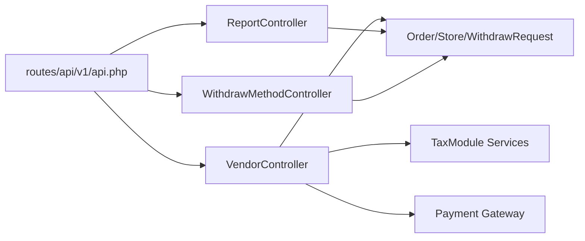

**Diagram sources**
- [routes/api/v1/api.php:153-202](file://routes/api/v1/api.php#L153-L202)
- [VendorController.php:1320-1371](file://app/Http/Controllers/Api/V1/Vendor/VendorController.php#L1320-L1371)

**Section sources**
- [routes/api/v1/api.php:153-202](file://routes/api/v1/api.php#L153-L202)
- [VendorController.php:1320-1371](file://app/Http/Controllers/Api/V1/Vendor/VendorController.php#L1320-L1371)

## Performance Considerations
- Pagination is used across reporting and inventory endpoints to limit payload sizes.
- Validation occurs early to avoid unnecessary processing.
- Batch operations (bulk import/export) reduce repeated API calls for inventory management.
- Tax recalculations are performed only when order amounts or discounts change.

## Troubleshooting Guide
Common issues and resolutions:
- Insufficient balance for withdrawal: Ensure wallet balance meets requested amount.
- Order status transition blocked: Verify order is not picked up and confirm model allows the transition.
- Schedule overlapping: Ensure new schedule does not overlap existing slots.
- Product approval workflow: Updates may require admin approval depending on settings.
- POS order placement failures: Validate cart contents, customer selection, and subscription limits.

**Section sources**
- [VendorController.php:832-891](file://app/Http/Controllers/Api/V1/Vendor/VendorController.php#L832-L891)
- [POSController.php:457-692](file://app/Http/Controllers/Vendor/POSController.php#L457-L692)
- [BusinessSettingsController.php:225-273](file://app/Http/Controllers/Vendor/BusinessSettingsController.php#L225-L273)

## Conclusion
The vendor API provides a comprehensive set of endpoints for managing profiles, stores, orders, inventory, reporting, POS operations, withdrawals, and subscriptions. The modular routing and controller-based design enable clear separation of concerns, while middleware ensures proper access control and feature gating. Integrations with tax calculation and payment systems support real-world business needs.