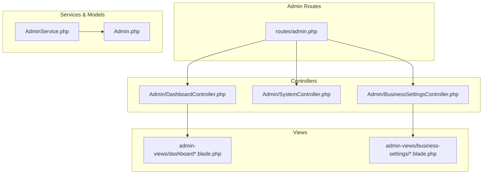
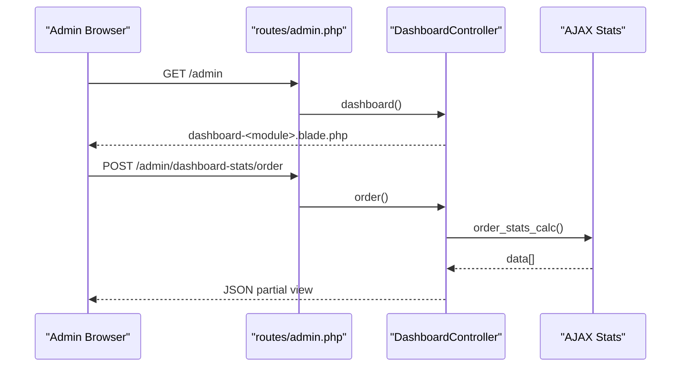
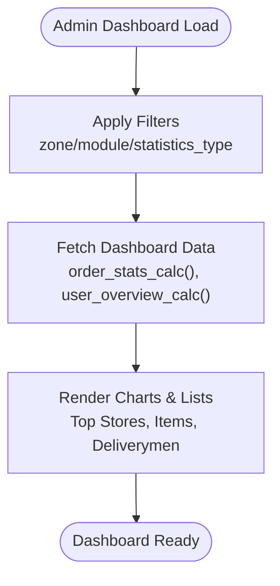
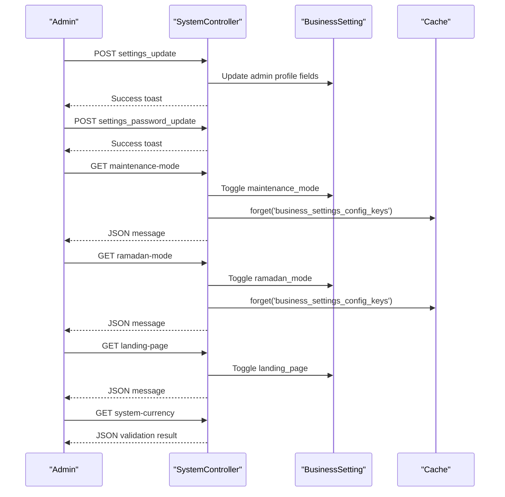
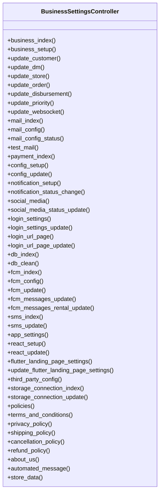
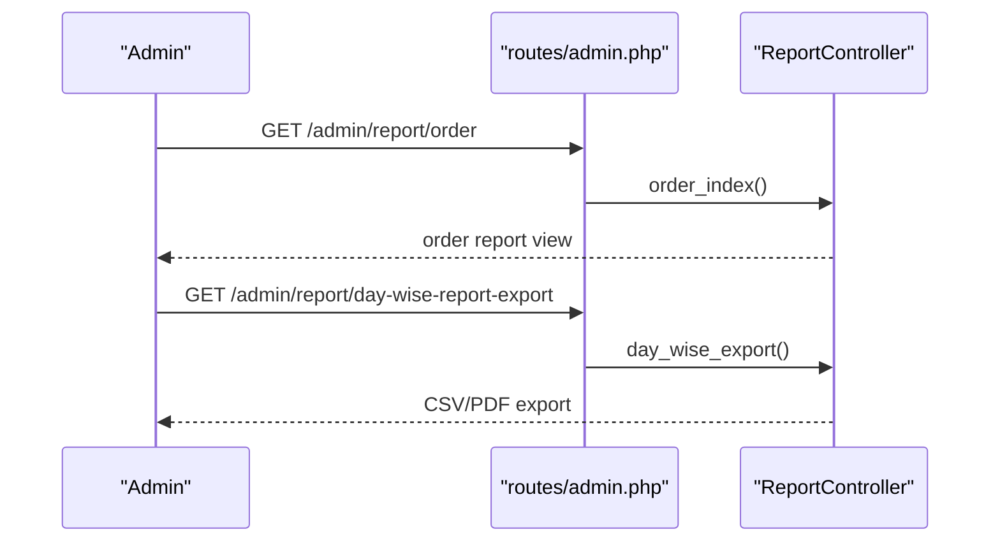
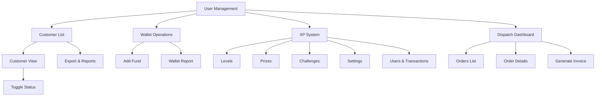
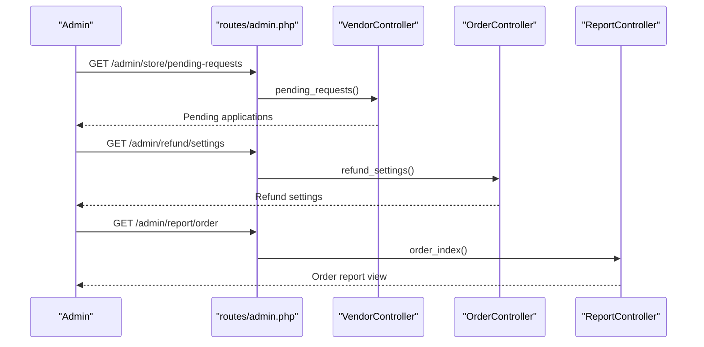
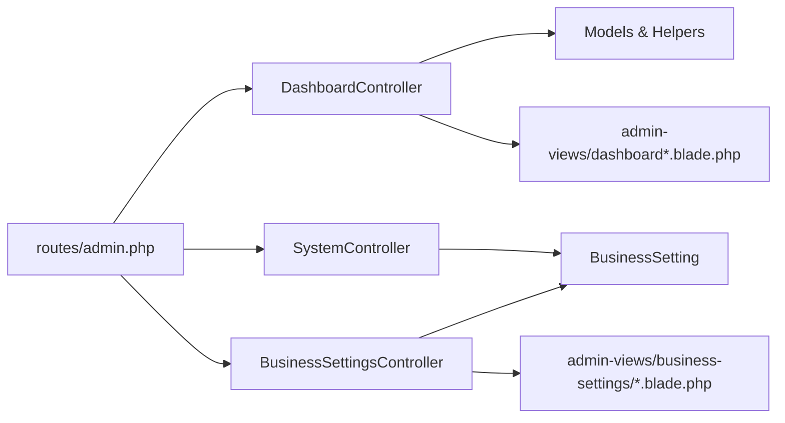

# Admin Panel

<cite>
**Referenced Files in This Document**
- [routes/admin.php](file://routes/admin.php)
- [app/Http/Controllers/Admin/DashboardController.php](file://app/Http/Controllers/Admin/DashboardController.php)
- [app/Http/Controllers/Admin/SystemController.php](file://app/Http/Controllers/Admin/SystemController.php)
- [app/Http/Controllers/Admin/BusinessSettingsController.php](file://app/Http/Controllers/Admin/BusinessSettingsController.php)
- [app/Services/AdminService.php](file://app/Services/AdminService.php)
- [app/Models/Admin.php](file://app/Models/Admin.php)
- [resources/views/admin-views/dashboard.blade.php](file://resources/views/admin-views/dashboard.blade.php)
- [resources/views/admin-views/dashboard-food.blade.php](file://resources/views/admin-views/dashboard-food.blade.php)
- [resources/views/admin-views/dashboard-parcel.blade.php](file://resources/views/admin-views/dashboard-parcel.blade.php)
- [resources/views/admin-views/dashboard-pharmacy.blade.php](file://resources/views/admin-views/dashboard-pharmacy.blade.php)
- [resources/views/admin-views/dashboard-grocery.blade.php](file://resources/views/admin-views/dashboard-grocery.blade.php)
- [resources/views/admin-views/business-settings/business-index.blade.php](file://resources/views/admin-views/business-settings/business-index.blade.php)
- [resources/views/admin-views/business-settings/customer-index.blade.php](file://resources/views/admin-views/business-settings/customer-index.blade.php)
- [resources/views/admin-views/business-settings/order-index.blade.php](file://resources/views/admin-views/business-settings/order-index.blade.php)
- [resources/views/admin-views/business-settings/store-index.blade.php](file://resources/views/admin-views/business-settings/store-index.blade.php)
- [resources/views/admin-views/business-settings/disbursement-index.blade.php](file://resources/views/admin-views/business-settings/disbursement-index.blade.php)
- [resources/views/admin-views/business-settings/priority-index.blade.php](file://resources/views/admin-views/business-settings/priority-index.blade.php)
- [resources/views/admin-views/business-settings/automated_message.blade.php](file://resources/views/admin-views/business-settings/automated_message.blade.php)
- [resources/views/admin-views/business-settings/websocket-index.blade.php](file://resources/views/admin-views/business-settings/websocket-index.blade.php)
- [resources/views/admin-views/business-settings/landing-index.blade.php](file://resources/views/admin-views/business-settings/landing-index.blade.php)
- [resources/views/admin-views/business-settings/mail-index.blade.php](file://resources/views/admin-views/business-settings/mail-index.blade.php)
- [resources/views/admin-views/business-settings/send-mail-index.blade.php](file://resources/views/admin-views/business-settings/send-mail-index.blade.php)
- [resources/views/admin-views/business-settings/notification_setup.blade.php](file://resources/views/admin-views/business-settings/notification_setup.blade.php)
- [resources/views/admin-views/business-settings/payment-index.blade.php](file://resources/views/admin-views/business-settings/payment-index.blade.php)
- [resources/views/admin-views/business-settings/config.blade.php](file://resources/views/admin-views/business-settings/config.blade.php)
- [resources/views/admin-views/business-settings/recaptcha-index.blade.php](file://resources/views/admin-views/business-settings/recaptcha-index.blade.php)
- [resources/views/admin-views/business-settings/firebase-otp-index.blade.php](file://resources/views/admin-views/business-settings/firebase-otp-index.blade.php)
- [resources/views/admin-views/business-settings/storage-connection-index.blade.php](file://resources/views/admin-views/business-settings/storage-connection-index.blade.php)
- [resources/views/admin-views/business-settings/terms-and-conditions.blade.php](file://resources/views/admin-views/business-settings/terms-and-conditions.blade.php)
- [resources/views/admin-views/business-settings/privacy-policy.blade.php](file://resources/views/admin-views/business-settings/privacy-policy.blade.php)
- [resources/views/admin-views/business-settings/shipping-policy.blade.php](file://resources/views/admin-views/business-settings/shipping-policy.blade.php)
- [resources/views/admin-views/business-settings/cancelation_policy.blade.php](file://resources/views/admin-views/business-settings/cancelation_policy.blade.php)
- [resources/views/admin-views/business-settings/refund_policy.blade.php](file://resources/views/admin-views/business-settings/refund_policy.blade.php)
- [resources/views/admin-views/business-settings/about-us.blade.php](file://resources/views/admin-views/business-settings/about-us.blade.php)
- [resources/views/admin-views/business-settings/social-media.blade.php](file://resources/views/admin-views/business-settings/social-media.blade.php)
- [resources/views/admin-views/business-settings/login-setup/login_page.blade.php](file://resources/views/admin-views/business-settings/login-setup/login_page.blade.php)
- [resources/views/admin-views/business-settings/login-setup/login_setup.blade.php](file://resources/views/admin-views/business-settings/login-setup/login_setup.blade.php)
- [resources/views/admin-views/business-settings/email-format-setting/](file://resources/views/admin-views/business-settings/email-format-setting/)
- [resources/views/admin-views/business-settings/landing-page-settings/](file://resources/views/admin-views/business-settings/landing-page-settings/)
- [resources/views/admin-views/business-settings/language/](file://resources/views/admin-views/business-settings/language/)
- [resources/views/admin-views/business-settings/offline-payment/](file://resources/views/admin-views/business-settings/offline-payment/)
- [resources/views/admin-views/business-settings/partials/](file://resources/views/admin-views/business-settings/partials/)
- [resources/views/admin-views/business-settings/social-login/](file://resources/views/admin-views/business-settings/social-login/)
- [resources/views/admin-views/business-settings/db-index.blade.php](file://resources/views/admin-views/business-settings/db-index.blade.php)
- [resources/views/admin-views/business-settings/fcm-config.blade.php](file://resources/views/admin-views/business-settings/fcm-config.blade.php)
- [resources/views/admin-views/business-settings/fcm-index.blade.php](file://resources/views/admin-views/business-settings/fcm-index.blade.php)
- [resources/views/admin-views/business-settings/fcm-index-rental.blade.php](file://resources/views/admin-views/business-settings/fcm-index-rental.blade.php)
- [resources/views/admin-views/business-settings/sms-index.blade.php](file://resources/views/admin-views/business-settings/sms-index.blade.php)
- [resources/views/admin-views/business-settings/app-settings.blade.php](file://resources/views/admin-views/business-settings/app-settings.blade.php)
- [resources/views/admin-views/business-settings/react-setup.blade.php](file://resources/views/admin-views/business-settings/react-setup.blade.php)
- [resources/views/admin-views/business-settings/login-url-setup.blade.php](file://resources/views/admin-views/business-settings/login-url-setup.blade.php)
- [resources/views/admin-views/business-settings/third-party/](file://resources/views/admin-views/business-settings/third-party/)
- [resources/views/admin-views/business-settings/external-system/](file://resources/views/admin-views/business-settings/external-system/)
- [resources/views/admin-views/business-settings/third-party/sms-module/](file://resources/views/admin-views/business-settings/third-party/sms-module/)
- [resources/views/admin-views/business-settings/third-party/payment-method/](file://resources/views/admin-views/business-settings/third-party/payment-method/)
- [resources/views/admin-views/business-settings/third-party/config-setup/](file://resources/views/admin-views/business-settings/third-party/config-setup/)
- [resources/views/admin-views/business-settings/third-party/mail-config/](file://resources/views/admin-views/business-settings/third-party/mail-config/)
- [resources/views/admin-views/business-settings/third-party/social-login/](file://resources/views/admin-views/business-settings/third-party/social-login/)
- [resources/views/admin-views/business-settings/third-party/recaptcha/](file://resources/views/admin-views/business-settings/third-party/recaptcha/)
- [resources/views/admin-views/business-settings/third-party/firebase-otp/](file://resources/views/admin-views/business-settings/third-party/firebase-otp/)
- [resources/views/admin-views/business-settings/third-party/storage-connection/](file://resources/views/admin-views/business-settings/third-party/storage-connection/)
- [resources/views/admin-views/business-settings/third-party/external-system/](file://resources/views/admin-views/business-settings/third-party/external-system/)
- [resources/views/admin-views/business-settings/third-party/external-system/drivemond-configuration.blade.php](file://resources/views/admin-views/business-settings/third-party/external-system/drivemond-configuration.blade.php)
- [resources/views/admin-views/business-settings/third-party/external-system/drivemond-configuration.blade.php](file://resources/views/admin-views/business-settings/third-party/external-system/drivemond-configuration.blade.php)
- [resources/views/admin-views/business-settings/third-party/external-system/drivemond-configuration.blade.php](file://resources/views/admin-views/business-settings/third-party/external-system/drivemond-configuration.blade.php)
- [resources/views/admin-views/business-settings/third-party/external-system/drivemond-configuration.blade.php](file://resources/views/admin-views/business-settings/third-party/external-system/drivemond-configuration.blade.php)
- [resources/views/admin-views/business-settings/third-party/external-system/drivemond-configuration.blade.php](file://resources/views/admin-views/business-settings/third-party/external-system/drivemond-configuration.blade.php)
- [resources/views/admin-views/business-settings/third-party/external-system/drivemond-configuration.blade.php](file://resources/views/admin-views/business-settings/third-party/external-system/drivemond-configuration.blade.php)
- [resources/views/admin-views/business-settings/third-party/external-system/drivemond-configuration.blade.php](file://resources/views/admin-views/business-settings/third-party/external-system/drivemond-configuration.blade.php)
- [resources/views/admin-views/business-settings/third-party/external-system/drivemond-configuration.blade.php](file://resources/views/admin-views/business-settings/third-party/external-system/drivemond-configuration.blade.php)
- [resources/views/admin-views/business-settings/third-party/external-system/drivemond-configuration.blade.php](file://resources/views/admin-views/business-settings/third-party/external-system/drivemond-configuration.blade.php)
- [resources/views/admin-views/business-settings/third-party/external-system/drivemond-configuration.blade.php](file://resources/views/admin-views/business-settings/third-party/external-system/drivemond-configuration.blade.php)
-......
</cite>

## Table of Contents
1. [Introduction](#introduction)
2. [Project Structure](#project-structure)
3. [Core Components](#core-components)
4. [Architecture Overview](#architecture-overview)
5. [Detailed Component Analysis](#detailed-component-analysis)
6. [Dependency Analysis](#dependency-analysis)
7. [Performance Considerations](#performance-considerations)
8. [Troubleshooting Guide](#troubleshooting-guide)
9. [Conclusion](#conclusion)
10. [Appendices](#appendices)

## Introduction
This document describes the Admin Panel interface for business configuration, user management, system settings, and operational oversight. It explains the administrative dashboard, business module management, and reporting interfaces. It also covers user role management, permission configuration, and business rule administration, along with system configuration options, business settings management, and operational monitoring tools. Administrative workflows for business onboarding, issue resolution, and system maintenance procedures are included.

## Project Structure
The Admin Panel is organized around Laravel routes grouped under the Admin namespace, controllers implementing CRUD and analytics, Blade views for UI, and supporting services/models for authentication and data access.

- Routing: Admin routes are defined centrally and grouped by functional areas (business settings, orders, stores, customers, reports, etc.), with middleware for authentication, module activation, and permissions.
- Controllers: Each major domain (Dashboard, System, BusinessSettings, Orders, Stores, Customers, Reports, etc.) has dedicated controllers handling requests and rendering views.
- Views: Blade templates under resources/views/admin-views provide modular UI for dashboards, settings pages, lists, forms, and reports.
- Services/Models: AdminService encapsulates admin login/logout logic; Admin model defines admin entity, roles, zones, and storage integration.

**Diagram sources**
- [routes/admin.php:1-827](file://routes/admin.php#L1-L827)
- [app/Http/Controllers/Admin/DashboardController.php:1-936](file://app/Http/Controllers/Admin/DashboardController.php#L1-L936)
- [app/Http/Controllers/Admin/SystemController.php:1-177](file://app/Http/Controllers/Admin/SystemController.php#L1-L177)
- [app/Http/Controllers/Admin/BusinessSettingsController.php:1-7655](file://app/Http/Controllers/Admin/BusinessSettingsController.php#L1-L7655)
- [app/Services/AdminService.php:1-23](file://app/Services/AdminService.php#L1-L23)
- [app/Models/Admin.php:1-149](file://app/Models/Admin.php#L1-L149)

**Section sources**
- [routes/admin.php:1-827](file://routes/admin.php#L1-L827)
- [app/Http/Controllers/Admin/DashboardController.php:1-936](file://app/Http/Controllers/Admin/DashboardController.php#L1-L936)
- [app/Http/Controllers/Admin/SystemController.php:1-177](file://app/Http/Controllers/Admin/SystemController.php#L1-L177)
- [app/Http/Controllers/Admin/BusinessSettingsController.php:1-7655](file://app/Http/Controllers/Admin/BusinessSettingsController.php#L1-L7655)
- [app/Services/AdminService.php:1-23](file://app/Services/AdminService.php#L1-L23)
- [app/Models/Admin.php:1-149](file://app/Models/Admin.php#L1-L149)

## Core Components
- Administrative Dashboard: Provides module-aware dashboards and dynamic statistics via AJAX endpoints for orders, zones, users, and commissions.
- System Settings: Manages admin profile, password, maintenance mode, Ramadan mode, landing page toggle, and currency validation.
- Business Settings: Centralized configuration for business rules, landing pages, notifications, payments, emails, third-party integrations, policies, and operational modes.
- Reporting: Comprehensive reporting interfaces for orders, transactions, items, stock, expenses, disbursements, taxes, and XP systems.
- User Management: Customer lists, subscriptions, wallet operations, loyalty points, XP leveling, and contact management.
- Operational Monitoring: Order dispatch dashboard, real-time order status updates, and operational stats.

**Section sources**
- [app/Http/Controllers/Admin/DashboardController.php:220-324](file://app/Http/Controllers/Admin/DashboardController.php#L220-L324)
- [app/Http/Controllers/Admin/SystemController.php:48-177](file://app/Http/Controllers/Admin/SystemController.php#L48-L177)
- [app/Http/Controllers/Admin/BusinessSettingsController.php:48-107](file://app/Http/Controllers/Admin/BusinessSettingsController.php#L48-L107)
- [routes/admin.php:555-584](file://routes/admin.php#L555-L584)
- [routes/admin.php:589-713](file://routes/admin.php#L589-L713)

## Architecture Overview
The Admin Panel follows a layered MVC pattern:
- Routes define endpoints grouped by functional domains.
- Controllers orchestrate requests, apply middleware, and render views or JSON responses.
- Views render UI with partials for reusable components.
- Services encapsulate cross-cutting concerns (authentication).
- Models represent entities and relationships.

**Diagram sources**
- [routes/admin.php:24-51](file://routes/admin.php#L24-L51)
- [app/Http/Controllers/Admin/DashboardController.php:220-324](file://app/Http/Controllers/Admin/DashboardController.php#L220-L324)

**Section sources**
- [routes/admin.php:1-827](file://routes/admin.php#L1-L827)
- [app/Http/Controllers/Admin/DashboardController.php:1-936](file://app/Http/Controllers/Admin/DashboardController.php#L1-L936)

## Detailed Component Analysis

### Administrative Dashboard
- Purpose: Provide an overview of business metrics, user activity, top performers, and module-specific stats.
- Features:
  - Module-aware dashboards (food, parcel, pharmacy, grocery, ecommerce).
  - Dynamic filters: zone, statistics type, user overview, commission overview.
  - AJAX endpoints for order stats, zone change, user overview, and commission overview.
- Views: dashboard.blade.php and module-specific variants.

**Diagram sources**
- [app/Http/Controllers/Admin/DashboardController.php:220-324](file://app/Http/Controllers/Admin/DashboardController.php#L220-L324)
- [app/Http/Controllers/Admin/DashboardController.php:366-588](file://app/Http/Controllers/Admin/DashboardController.php#L366-L588)
- [app/Http/Controllers/Admin/DashboardController.php:590-633](file://app/Http/Controllers/Admin/DashboardController.php#L590-L633)

**Section sources**
- [app/Http/Controllers/Admin/DashboardController.php:220-324](file://app/Http/Controllers/Admin/DashboardController.php#L220-L324)
- [app/Http/Controllers/Admin/DashboardController.php:366-588](file://app/Http/Controllers/Admin/DashboardController.php#L366-L588)
- [app/Http/Controllers/Admin/DashboardController.php:590-633](file://app/Http/Controllers/Admin/DashboardController.php#L590-L633)
- [resources/views/admin-views/dashboard.blade.php](file://resources/views/admin-views/dashboard.blade.php)
- [resources/views/admin-views/dashboard-food.blade.php](file://resources/views/admin-views/dashboard-food.blade.php)
- [resources/views/admin-views/dashboard-parcel.blade.php](file://resources/views/admin-views/dashboard-parcel.blade.php)
- [resources/views/admin-views/dashboard-pharmacy.blade.php](file://resources/views/admin-views/dashboard-pharmacy.blade.php)
- [resources/views/admin-views/dashboard-grocery.blade.php](file://resources/views/admin-views/dashboard-grocery.blade.php)

### System Settings
- Purpose: Manage admin profile, password, and global system toggles.
- Features:
  - Admin profile update (name, email, phone, image).
  - Password update with validation.
  - Maintenance mode toggle.
  - Ramadan mode toggle.
  - Landing page toggle.
  - Currency validation endpoint.
- Views: settings.blade.php.

**Diagram sources**
- [app/Http/Controllers/Admin/SystemController.php:48-177](file://app/Http/Controllers/Admin/SystemController.php#L48-L177)
- [app/Http/Controllers/Admin/BusinessSettingsController.php:506-716](file://app/Http/Controllers/Admin/BusinessSettingsController.php#L506-L716)

**Section sources**
- [app/Http/Controllers/Admin/SystemController.php:48-177](file://app/Http/Controllers/Admin/SystemController.php#L48-L177)
- [app/Http/Controllers/Admin/BusinessSettingsController.php:506-716](file://app/Http/Controllers/Admin/BusinessSettingsController.php#L506-L716)

### Business Settings
- Purpose: Configure business rules, landing pages, notifications, payments, emails, third-party integrations, policies, and operational modes.
- Categories:
  - Business setup (name, currency, timezone, logo, icon, footer, cookies, order confirmation, free delivery, additional charge, guest checkout, time format, NVP toggle, decimal precision, delivery commission, business models).
  - Customer settings (wallet, loyalty, referrals, add fund).
  - Deliveryman settings (minimum amount, cash limits, tips, max orders, cancellations, visibility).
  - Store settings (cash overflow, min amount, review reply, cancellations, self registration, product approval criteria, gallery).
  - Order settings (home delivery/takeaway, schedule slots, prescription orders, cancellation rate limits).
  - Disbursement settings (store/deliveryman periods, start day, waiting time, creation time, min amounts, cron commands).
  - Priority settings (default status and sorting rules for various lists).
  - Automated messages (list, search, status).
  - Websocket configuration.
  - Landing page configuration (integration type, sections, keys).
  - Email configuration (SMTP, status toggle, test mail).
  - Notification setup.
  - Payment configuration.
  - Third-party integrations (SMS, payment methods, mail, social login, reCAPTCHA, Firebase OTP, storage connection).
  - Policies (terms, privacy, shipping, cancellation, refund, about us).
  - Social media links.
  - Login setup (page and centralized login).
  - Database cleanup.
  - FCM configuration.
  - SMS configuration.
  - App settings.
  - React and Flutter landing page settings.
  - Login URL setup.

**Diagram sources**
- [app/Http/Controllers/Admin/BusinessSettingsController.php:48-107](file://app/Http/Controllers/Admin/BusinessSettingsController.php#L48-L107)
- [app/Http/Controllers/Admin/BusinessSettingsController.php:506-716](file://app/Http/Controllers/Admin/BusinessSettingsController.php#L506-L716)

**Section sources**
- [app/Http/Controllers/Admin/BusinessSettingsController.php:48-107](file://app/Http/Controllers/Admin/BusinessSettingsController.php#L48-L107)
- [app/Http/Controllers/Admin/BusinessSettingsController.php:109-149](file://app/Http/Controllers/Admin/BusinessSettingsController.php#L109-L149)
- [app/Http/Controllers/Admin/BusinessSettingsController.php:151-194](file://app/Http/Controllers/Admin/BusinessSettingsController.php#L151-L194)
- [app/Http/Controllers/Admin/BusinessSettingsController.php:217-279](file://app/Http/Controllers/Admin/BusinessSettingsController.php#L217-L279)
- [app/Http/Controllers/Admin/BusinessSettingsController.php:281-328](file://app/Http/Controllers/Admin/BusinessSettingsController.php#L281-L328)
- [app/Http/Controllers/Admin/BusinessSettingsController.php:331-409](file://app/Http/Controllers/Admin/BusinessSettingsController.php#L331-L409)
- [app/Http/Controllers/Admin/BusinessSettingsController.php:411-475](file://app/Http/Controllers/Admin/BusinessSettingsController.php#L411-L475)
- [app/Http/Controllers/Admin/BusinessSettingsController.php:477-504](file://app/Http/Controllers/Admin/BusinessSettingsController.php#L477-L504)
- [app/Http/Controllers/Admin/BusinessSettingsController.php:506-716](file://app/Http/Controllers/Admin/BusinessSettingsController.php#L506-L716)
- [app/Http/Controllers/Admin/BusinessSettingsController.php:718-784](file://app/Http/Controllers/Admin/BusinessSettingsController.php#L718-L784)
- [app/Http/Controllers/Admin/BusinessSettingsController.php:786-800](file://app/Http/Controllers/Admin/BusinessSettingsController.php#L786-L800)
- [resources/views/admin-views/business-settings/business-index.blade.php](file://resources/views/admin-views/business-settings/business-index.blade.php)
- [resources/views/admin-views/business-settings/customer-index.blade.php](file://resources/views/admin-views/business-settings/customer-index.blade.php)
- [resources/views/admin-views/business-settings/order-index.blade.php](file://resources/views/admin-views/business-settings/order-index.blade.php)
- [resources/views/admin-views/business-settings/store-index.blade.php](file://resources/views/admin-views/business-settings/store-index.blade.php)
- [resources/views/admin-views/business-settings/disbursement-index.blade.php](file://resources/views/admin-views/business-settings/disbursement-index.blade.php)
- [resources/views/admin-views/business-settings/priority-index.blade.php](file://resources/views/admin-views/business-settings/priority-index.blade.php)
- [resources/views/admin-views/business-settings/automated_message.blade.php](file://resources/views/admin-views/business-settings/automated_message.blade.php)
- [resources/views/admin-views/business-settings/websocket-index.blade.php](file://resources/views/admin-views/business-settings/websocket-index.blade.php)
- [resources/views/admin-views/business-settings/landing-index.blade.php](file://resources/views/admin-views/business-settings/landing-index.blade.php)
- [resources/views/admin-views/business-settings/mail-index.blade.php](file://resources/views/admin-views/business-settings/mail-index.blade.php)
- [resources/views/admin-views/business-settings/send-mail-index.blade.php](file://resources/views/admin-views/business-settings/send-mail-index.blade.php)
- [resources/views/admin-views/business-settings/notification_setup.blade.php](file://resources/views/admin-views/business-settings/notification_setup.blade.php)
- [resources/views/admin-views/business-settings/payment-index.blade.php](file://resources/views/admin-views/business-settings/payment-index.blade.php)
- [resources/views/admin-views/business-settings/config.blade.php](file://resources/views/admin-views/business-settings/config.blade.php)
- [resources/views/admin-views/business-settings/recaptcha-index.blade.php](file://resources/views/admin-views/business-settings/recaptcha-index.blade.php)
- [resources/views/admin-views/business-settings/firebase-otp-index.blade.php](file://resources/views/admin-views/business-settings/firebase-otp-index.blade.php)
- [resources/views/admin-views/business-settings/storage-connection-index.blade.php](file://resources/views/admin-views/business-settings/storage-connection-index.blade.php)
- [resources/views/admin-views/business-settings/terms-and-conditions.blade.php](file://resources/views/admin-views/business-settings/terms-and-conditions.blade.php)
- [resources/views/admin-views/business-settings/privacy-policy.blade.php](file://resources/views/admin-views/business-settings/privacy-policy.blade.php)
- [resources/views/admin-views/business-settings/shipping-policy.blade.php](file://resources/views/admin-views/business-settings/shipping-policy.blade.php)
- [resources/views/admin-views/business-settings/cancelation_policy.blade.php](file://resources/views/admin-views/business-settings/cancelation_policy.blade.php)
- [resources/views/admin-views/business-settings/refund_policy.blade.php](file://resources/views/admin-views/business-settings/refund_policy.blade.php)
- [resources/views/admin-views/business-settings/about-us.blade.php](file://resources/views/admin-views/business-settings/about-us.blade.php)
- [resources/views/admin-views/business-settings/social-media.blade.php](file://resources/views/admin-views/business-settings/social-media.blade.php)
- [resources/views/admin-views/business-settings/login-setup/login_page.blade.php](file://resources/views/admin-views/business-settings/login-setup/login_page.blade.php)
- [resources/views/admin-views/business-settings/login-setup/login_setup.blade.php](file://resources/views/admin-views/business-settings/login-setup/login_setup.blade.php)

### Reporting Interfaces
- Purpose: Provide comprehensive analytics and exports across orders, transactions, items, stock, expenses, disbursements, taxes, and XP systems.
- Features:
  - Order reports (daily, item-wise, store summary, store sales, store orders).
  - Transaction reports (day-wise, order transactions).
  - Stock reports (stock-wise, low stock).
  - Expense reports.
  - Disbursement reports.
  - Tax reports (vendor-wise, admin, parcel-wise).
  - XP reports (levels, prizes, challenges, users, transactions).
- Endpoints: Defined under the report group with search and export capabilities.

**Diagram sources**
- [routes/admin.php:555-584](file://routes/admin.php#L555-L584)

**Section sources**
- [routes/admin.php:555-584](file://routes/admin.php#L555-L584)

### User Management and Operational Oversight
- Purpose: Manage customers, subscriptions, wallets, loyalty points, XP, and operational dispatch.
- Features:
  - Customer list, view, status toggle, export, order export, trip export.
  - Subscribed customer export.
  - Wallet operations (add fund, report, export).
  - Loyalty points (report, export, set date).
  - XP system (levels, prizes, challenges, settings, users, transactions).
  - Dispatch dashboard (list, order details, invoice generation).
  - Transactions dashboard (order details, parcel order details, customer view, item view, reports, account transactions, deliveryman earnings).
  - Contacts (list, export, view, update, send mail, search).

**Diagram sources**
- [routes/admin.php:589-713](file://routes/admin.php#L589-L713)
- [routes/admin.php:616-624](file://routes/admin.php#L616-L624)
- [routes/admin.php:714-796](file://routes/admin.php#L714-L796)

**Section sources**
- [routes/admin.php:589-713](file://routes/admin.php#L589-L713)
- [routes/admin.php:616-624](file://routes/admin.php#L616-L624)
- [routes/admin.php:714-796](file://routes/admin.php#L714-L796)

### Administrative Workflows
- Business Onboarding:
  - Store application review and status updates.
  - Pending/denied requests management.
  - Recommended stores management.
  - Bulk import/export for stores.
- Issue Resolution:
  - Refund reasons and settings management.
  - Order cancel reasons management.
  - Automated messages management.
  - Contact management with email support.
- System Maintenance:
  - Database cleanup.
  - Cron job configuration for disbursements.
  - Maintenance and Ramadan mode toggles.
  - Landing page toggle.

**Diagram sources**
- [routes/admin.php:188-208](file://routes/admin.php#L188-L208)
- [routes/admin.php:279-288](file://routes/admin.php#L279-L288)
- [routes/admin.php:555-562](file://routes/admin.php#L555-L562)

**Section sources**
- [routes/admin.php:188-208](file://routes/admin.php#L188-L208)
- [routes/admin.php:279-288](file://routes/admin.php#L279-L288)
- [routes/admin.php:555-562](file://routes/admin.php#L555-L562)

## Dependency Analysis
- Route dependencies: Admin routes depend on controllers and middleware for admin authentication, module checks, and feature permissions.
- Controller dependencies: DashboardController depends on models and helpers for statistics; SystemController and BusinessSettingsController depend on BusinessSetting and Helpers for configuration persistence.
- View dependencies: Dashboard views depend on controller-provided data and partials; Business settings views depend on configuration keys and third-party integrations.

**Diagram sources**
- [routes/admin.php:1-827](file://routes/admin.php#L1-L827)
- [app/Http/Controllers/Admin/DashboardController.php:1-936](file://app/Http/Controllers/Admin/DashboardController.php#L1-L936)
- [app/Http/Controllers/Admin/SystemController.php:1-177](file://app/Http/Controllers/Admin/SystemController.php#L1-L177)
- [app/Http/Controllers/Admin/BusinessSettingsController.php:1-7655](file://app/Http/Controllers/Admin/BusinessSettingsController.php#L1-L7655)

**Section sources**
- [routes/admin.php:1-827](file://routes/admin.php#L1-L827)
- [app/Http/Controllers/Admin/DashboardController.php:1-936](file://app/Http/Controllers/Admin/DashboardController.php#L1-L936)
- [app/Http/Controllers/Admin/SystemController.php:1-177](file://app/Http/Controllers/Admin/SystemController.php#L1-L177)
- [app/Http/Controllers/Admin/BusinessSettingsController.php:1-7655](file://app/Http/Controllers/Admin/BusinessSettingsController.php#L1-L7655)

## Performance Considerations
- Use AJAX endpoints for dynamic dashboard updates to minimize full page reloads.
- Apply appropriate pagination for large lists (customers, orders, reports).
- Cache frequently accessed business settings to reduce database queries.
- Optimize queries with scopes and eager loading to avoid N+1 problems.
- Minimize heavy computations in controllers; leverage services for complex logic.

## Troubleshooting Guide
- Authentication failures: Verify admin credentials and remember token handling.
- Settings not updating: Confirm business setting keys exist and caches are cleared after toggles.
- Disbursement cron issues: Check PHP exec availability and cron command generation.
- Email configuration: Validate SMTP settings and test mail functionality.
- Module toggles: Ensure module activation middleware allows access to specific sections.

**Section sources**
- [app/Services/AdminService.php:9-21](file://app/Services/AdminService.php#L9-L21)
- [app/Http/Controllers/Admin/SystemController.php:101-145](file://app/Http/Controllers/Admin/SystemController.php#L101-L145)
- [app/Http/Controllers/Admin/BusinessSettingsController.php:331-409](file://app/Http/Controllers/Admin/BusinessSettingsController.php#L331-L409)
- [app/Http/Controllers/Admin/BusinessSettingsController.php:718-784](file://app/Http/Controllers/Admin/BusinessSettingsController.php#L718-L784)

## Conclusion
The Admin Panel provides a comprehensive interface for managing business configuration, user management, system settings, and operational oversight. Its modular design, robust routing, and extensive reporting capabilities enable efficient administration across multiple business modules and operational contexts.

## Appendices
- Additional views and partials exist under resources/views/admin-views for banners, categories, campaigns, coupons, custom roles, employees, flash sales, messages, notifications, orders, promotions, reports, stores, subscriptions, units, wallets, withdrawals, XP, zones, and more.
- Third-party integrations include SMS, payment methods, mail, social login, reCAPTCHA, Firebase OTP, and storage connections.