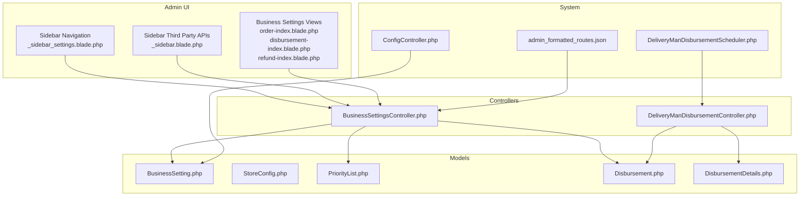
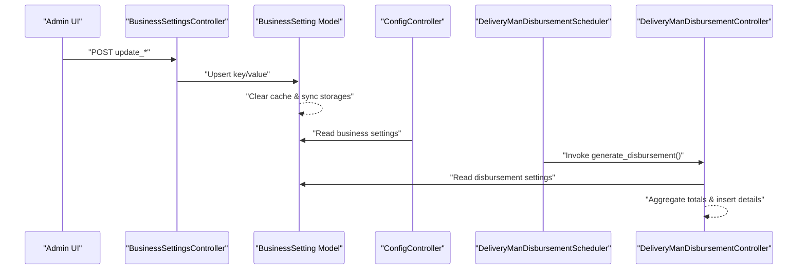
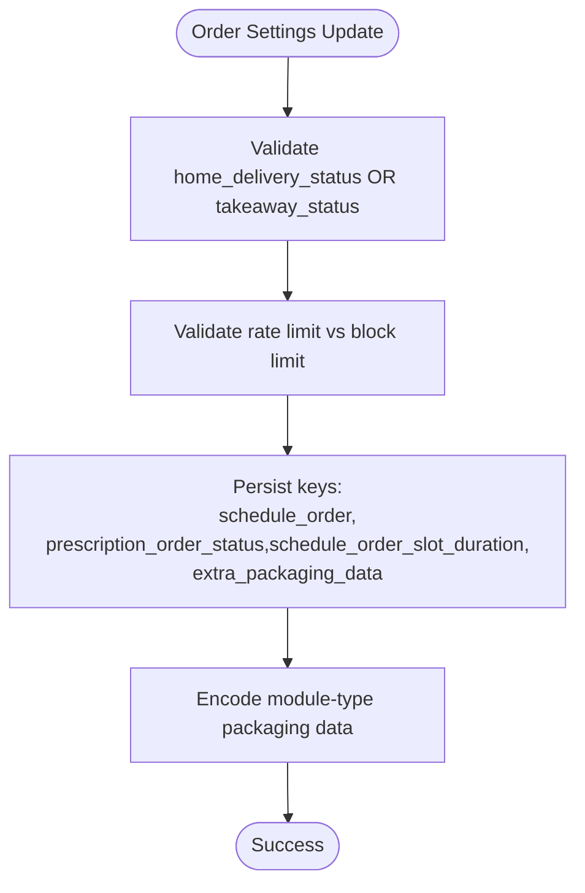
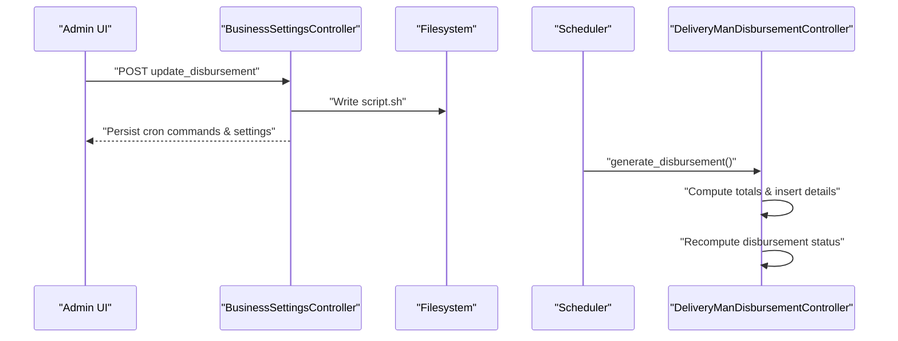
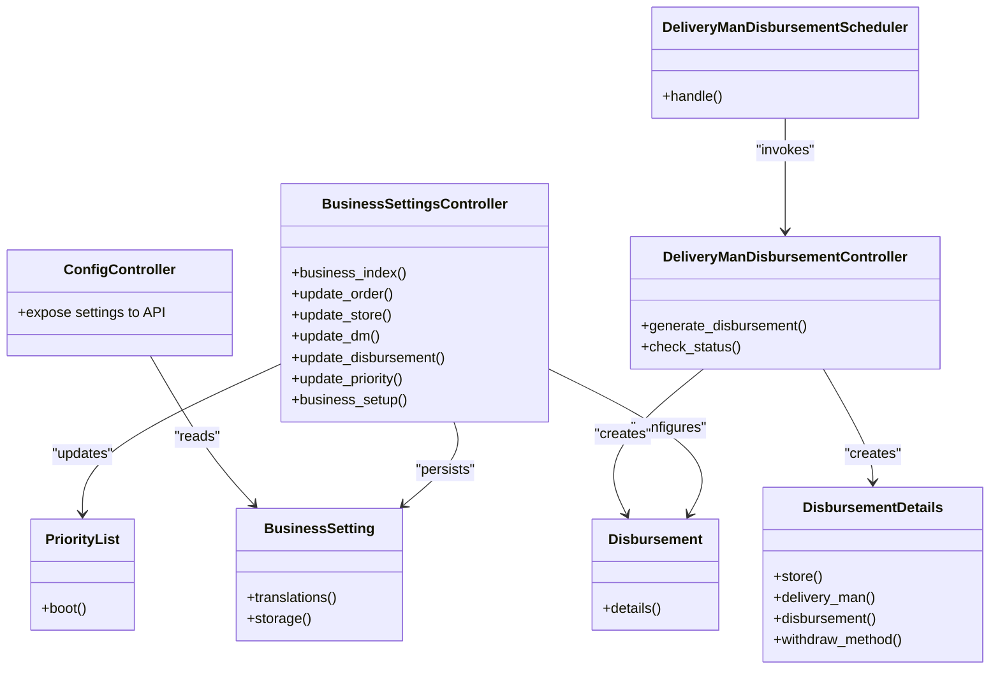

# Business Configuration

<cite>
**Referenced Files in This Document**
- [BusinessSettingsController.php](file://app/Http/Controllers/Admin/BusinessSettingsController.php)
- [BusinessSetting.php](file://app/Models/BusinessSetting.php)
- [StoreConfig.php](file://app/Models/StoreConfig.php)
- [PriorityList.php](file://app/Models/PriorityList.php)
- [Disbursement.php](file://app/Models/Disbursement.php)
- [DisbursementDetails.php](file://app/Models/DisbursementDetails.php)
- [DeliveryManDisbursementController.php](file://app/Http/Controllers/Admin/DeliveryManDisbursementController.php)
- [DeliveryManDisbursementScheduler.php](file://app/Console/Commands/DeliveryManDisbursementScheduler.php)
- [ConfigController.php](file://app/Http/Controllers/Api/V1/ConfigController.php)
- [admin_formatted_routes.json](file://public/admin_formatted_routes.json)
- [_sidebar_settings.blade.php](file://resources/views/layouts/admin/partials/_sidebar_settings.blade.php)
- [_sidebar.blade.php](file://resources/views/layouts/admin/partials/_sidebar.blade.php)
- [order-index.blade.php](file://resources/views/admin-views/business-settings/order-index.blade.php)
- [disbursement-index.blade.php](file://resources/views/admin-views/business-settings/disbursement-index.blade.php)
- [refund-index.blade.php](file://resources/views/admin-views/business-settings/refund-index.blade.php)
- [create_store_config_migration.php](file://database/migrations/2023_09_20_122921_create_store_configs_table.php)
</cite>

## Table of Contents
1. [Introduction](#introduction)
2. [Project Structure](#project-structure)
3. [Core Components](#core-components)
4. [Architecture Overview](#architecture-overview)
5. [Detailed Component Analysis](#detailed-component-analysis)
6. [Dependency Analysis](#dependency-analysis)
7. [Performance Considerations](#performance-considerations)
8. [Troubleshooting Guide](#troubleshooting-guide)
9. [Conclusion](#conclusion)

## Introduction
This document describes the business configuration management system that controls system-wide settings, business rules, and operational parameters. It covers order processing, payment method configurations, customer management, delivery parameters, store configuration, module settings, business rule administration, disbursement settings, priority management, and operational workflow configurations. It also documents refund policies, cancellation rules, and service terms management.

## Project Structure
Business configuration is primarily managed via:
- Admin controllers that expose configuration screens and persist settings
- Models representing configuration entities (business settings, store-specific configs, priority lists, disbursements)
- Blade templates for admin UI
- Public route metadata for admin navigation
- Artisan commands for scheduled tasks (e.g., disbursement generation)

**Diagram sources**
- [BusinessSettingsController.php:44-107](file://app/Http/Controllers/Admin/BusinessSettingsController.php#L44-L107)
- [BusinessSetting.php:10-66](file://app/Models/BusinessSetting.php#L10-L66)
- [StoreConfig.php:9-37](file://app/Models/StoreConfig.php#L9-L37)
- [PriorityList.php:9-28](file://app/Models/PriorityList.php#L9-L28)
- [Disbursement.php:8-17](file://app/Models/Disbursement.php#L8-L17)
- [DisbursementDetails.php:9-41](file://app/Models/DisbursementDetails.php#L9-L41)
- [DeliveryManDisbursementController.php:296-329](file://app/Http/Controllers/Admin/DeliveryManDisbursementController.php#L296-L329)
- [DeliveryManDisbursementScheduler.php:1-24](file://app/Console/Commands/DeliveryManDisbursementScheduler.php#L1-L24)
- [ConfigController.php:256-267](file://app/Http/Controllers/Api/V1/ConfigController.php#L256-L267)
- [_sidebar_settings.blade.php:73-88](file://resources/views/layouts/admin/partials/_sidebar_settings.blade.php#L73-L88)
- [_sidebar.blade.php:967-975](file://resources/views/layouts/admin/partials/_sidebar.blade.php#L967-L975)
- [admin_formatted_routes.json:300-1310](file://public/admin_formatted_routes.json#L300-L1310)

**Section sources**
- [_sidebar_settings.blade.php:73-88](file://resources/views/layouts/admin/partials/_sidebar_settings.blade.php#L73-L88)
- [_sidebar.blade.php:967-975](file://resources/views/layouts/admin/partials/_sidebar.blade.php#L967-L975)
- [admin_formatted_routes.json:300-1310](file://public/admin_formatted_routes.json#L300-L1310)

## Core Components
- BusinessSetting: Stores key-value configuration entries with caching and storage hooks.
- StoreConfig: Per-store configuration (recommendations, halal tag, extra packaging).
- PriorityList: Dynamic ranking and sorting preferences for discovery features.
- Disbursement and DisbursementDetails: Administrative disbursement scheduling and per-entity amounts/methods.
- BusinessSettingsController: Central admin endpoint for updating settings across domains (business, customer, order, store, refund, disbursement, priority, etc.).
- DeliveryManDisbursementController and Scheduler: Automated disbursement generation and cron orchestration.

**Section sources**
- [BusinessSetting.php:10-66](file://app/Models/BusinessSetting.php#L10-L66)
- [StoreConfig.php:9-37](file://app/Models/StoreConfig.php#L9-L37)
- [PriorityList.php:9-28](file://app/Models/PriorityList.php#L9-L28)
- [Disbursement.php:8-17](file://app/Models/Disbursement.php#L8-L17)
- [DisbursementDetails.php:9-41](file://app/Models/DisbursementDetails.php#L9-L41)
- [BusinessSettingsController.php:44-107](file://app/Http/Controllers/Admin/BusinessSettingsController.php#L44-L107)
- [DeliveryManDisbursementController.php:296-329](file://app/Http/Controllers/Admin/DeliveryManDisbursementController.php#L296-L329)
- [DeliveryManDisbursementScheduler.php:1-24](file://app/Console/Commands/DeliveryManDisbursementScheduler.php#L1-L24)

## Architecture Overview
The system exposes admin screens grouped under “Business Settings,” persists values to BusinessSetting, and reads them at runtime (including API exposure). Disbursement automation is handled by a scheduler that invokes a controller to generate disbursement records.

**Diagram sources**
- [BusinessSettingsController.php:281-328](file://app/Http/Controllers/Admin/BusinessSettingsController.php#L281-L328)
- [BusinessSetting.php:35-63](file://app/Models/BusinessSetting.php#L35-L63)
- [ConfigController.php:256-267](file://app/Http/Controllers/Api/V1/ConfigController.php#L256-L267)
- [DeliveryManDisbursementScheduler.php:19-23](file://app/Console/Commands/DeliveryManDisbursementScheduler.php#L19-L23)
- [DeliveryManDisbursementController.php:296-329](file://app/Http/Controllers/Admin/DeliveryManDisbursementController.php#L296-L329)

## Detailed Component Analysis

### Business Settings Domains
- Business setup: currency, timezone, logo/icon, country, address, footer, cookies, order confirmation model, partial payment, admin commission, free delivery thresholds, additional charge, guest checkout, time format, NVT toggle, decimal precision, delivery commission, business model selection (commission/subscription).
- Customer management: wallet, loyalty, referral earning, add fund status, customer-related toggles.
- Order processing: home delivery/takeaway status, scheduled orders, prescription order, delivery verification, cancellation rate limits and warnings, schedule slot duration/time format, extra packaging data per module type.
- Store settings: product approval criteria, cash-in-hand thresholds, minimum payout, review reply, self-registration, access to products, product gallery.
- Delivery personnel: minimum amount to pay, cash-in-hand overflow, max cash-in-hand, tips status, max orders, canceled-by-deliveryman, show earnings, self-registration, picture upload.
- Refund settings: global active status, reason list management.
- Disbursement: type (manual/automated), time period (daily/weekly/monthly), week start day, waiting time, creation time, minimum amount, cron command persistence, PHP path.
- Priority: default status and sort-by rules for categories, stores, items, campaigns, brands, and search features.
- Landing page, websocket, automated messages, and third-party API integrations are exposed via admin routes and sidebar.

**Section sources**
- [BusinessSettingsController.php:48-107](file://app/Http/Controllers/Admin/BusinessSettingsController.php#L48-L107)
- [BusinessSettingsController.php:281-328](file://app/Http/Controllers/Admin/BusinessSettingsController.php#L281-L328)
- [BusinessSettingsController.php:331-409](file://app/Http/Controllers/Admin/BusinessSettingsController.php#L331-L409)
- [BusinessSettingsController.php:109-149](file://app/Http/Controllers/Admin/BusinessSettingsController.php#L109-L149)
- [BusinessSettingsController.php:506-716](file://app/Http/Controllers/Admin/BusinessSettingsController.php#L506-L716)
- [admin_formatted_routes.json:300-1310](file://public/admin_formatted_routes.json#L300-L1310)
- [_sidebar.blade.php:967-975](file://resources/views/layouts/admin/partials/_sidebar.blade.php#L967-L975)

### Order Processing Settings
- Home delivery and takeaway toggles are validated as required together.
- Scheduled order support with configurable slot duration and time format.
- Prescription order status toggle.
- Delivery verification requirement.
- Cancellation rate limit configuration with warning/block thresholds.
- Extra packaging data encoded per module type.

**Diagram sources**
- [BusinessSettingsController.php:281-328](file://app/Http/Controllers/Admin/BusinessSettingsController.php#L281-L328)

**Section sources**
- [BusinessSettingsController.php:281-328](file://app/Http/Controllers/Admin/BusinessSettingsController.php#L281-L328)
- [order-index.blade.php:190-201](file://resources/views/admin-views/business-settings/order-index.blade.php#L190-L201)

### Payment Method and Partial Payment Configuration
- Partial payment status and method are persisted and returned via API.
- Additional charge status, name, and amount are exposed to clients.

**Section sources**
- [BusinessSettingsController.php:584-633](file://app/Http/Controllers/Admin/BusinessSettingsController.php#L584-L633)
- [ConfigController.php:256-267](file://app/Http/Controllers/Api/V1/ConfigController.php#L256-L267)

### Customer Management Settings
- Wallet, loyalty, referral earning, add fund status, and customer-related toggles are grouped and updated centrally.

**Section sources**
- [BusinessSettingsController.php:57-66](file://app/Http/Controllers/Admin/BusinessSettingsController.php#L57-L66)

### Store Configuration
- StoreConfig supports per-store recommendation flags, halal tag status, extra packaging status/amount, and minimum stock warning threshold.
- Migration defines the underlying table structure.

**Section sources**
- [StoreConfig.php:9-37](file://app/Models/StoreConfig.php#L9-L37)
- [create_store_config_migration.php:15-21](file://database/migrations/2023_09_20_122921_create_store_configs_table.php#L15-L21)

### Module Settings
- Module setup is navigable from the admin sidebar and supports adding business modules.

**Section sources**
- [_sidebar_settings.blade.php:73-88](file://resources/views/layouts/admin/partials/_sidebar_settings.blade.php#L73-L88)

### Business Rule Administration
- Priority management updates default statuses and per-type sort-by rules, backed by PriorityList entries.
- Order cancellation reasons are maintained and paginated.

**Section sources**
- [BusinessSettingsController.php:109-149](file://app/Http/Controllers/Admin/BusinessSettingsController.php#L109-L149)
- [PriorityList.php:9-28](file://app/Models/PriorityList.php#L9-L28)

### Disbursement Settings and Workflow
- Disbursement type, scheduling cadence, week start day, waiting time, creation time, and minimum amount are configurable.
- Cron commands are generated and stored; a shell script is written to update crontab.
- Automated disbursement generation aggregates totals and inserts DisbursementDetails rows; status is reconciled across details.

**Diagram sources**
- [BusinessSettingsController.php:331-409](file://app/Http/Controllers/Admin/BusinessSettingsController.php#L331-L409)
- [DeliveryManDisbursementScheduler.php:19-23](file://app/Console/Commands/DeliveryManDisbursementScheduler.php#L19-L23)
- [DeliveryManDisbursementController.php:296-329](file://app/Http/Controllers/Admin/DeliveryManDisbursementController.php#L296-L329)

**Section sources**
- [BusinessSettingsController.php:331-409](file://app/Http/Controllers/Admin/BusinessSettingsController.php#L331-L409)
- [disbursement-index.blade.php:28-302](file://resources/views/admin-views/business-settings/disbursement-index.blade.php#L28-L302)
- [DeliveryManDisbursementController.php:296-329](file://app/Http/Controllers/Admin/DeliveryManDisbursementController.php#L296-L329)

### Operational Workflow Configurations
- Websocket status and connection parameters are configurable.
- App settings (user/store/deliveryman app versions, download URLs) are exposed.
- Landing page settings and third-party API integrations are reachable via sidebar.

**Section sources**
- [BusinessSettingsController.php:196-215](file://app/Http/Controllers/Admin/BusinessSettingsController.php#L196-L215)
- [admin_formatted_routes.json:300-1310](file://public/admin_formatted_routes.json#L300-L1310)
- [_sidebar.blade.php:967-975](file://resources/views/layouts/admin/partials/_sidebar.blade.php#L967-L975)

### Refund Policies and Cancellation Rules
- Global refund active status and reason list management are supported.
- Order cancellation rate limits and warnings are enforced during updates.

**Section sources**
- [BusinessSettingsController.php:76-80](file://app/Http/Controllers/Admin/BusinessSettingsController.php#L76-L80)
- [BusinessSettingsController.php:281-303](file://app/Http/Controllers/Admin/BusinessSettingsController.php#L281-L303)
- [refund-index.blade.php:32-42](file://resources/views/admin-views/business-settings/refund-index.blade.php#L32-L42)

### Service Terms Management
- Terms and conditions, privacy policy, shipping policy, and cancellation pages are part of the frontend views and can be managed via admin content workflows.

[No sources needed since this section provides general guidance]

## Dependency Analysis
- BusinessSettingsController depends on BusinessSetting for persistence and on Helpers for cache invalidation and storage sync.
- PriorityList updates trigger cache invalidation for priority settings.
- Disbursement generation depends on BusinessSetting values and writes to Disbursement and DisbursementDetails.
- ConfigController reads BusinessSetting for client exposure.

**Diagram sources**
- [BusinessSettingsController.php:44-107](file://app/Http/Controllers/Admin/BusinessSettingsController.php#L44-L107)
- [BusinessSetting.php:10-66](file://app/Models/BusinessSetting.php#L10-L66)
- [PriorityList.php:9-28](file://app/Models/PriorityList.php#L9-L28)
- [Disbursement.php:8-17](file://app/Models/Disbursement.php#L8-L17)
- [DisbursementDetails.php:9-41](file://app/Models/DisbursementDetails.php#L9-L41)
- [DeliveryManDisbursementController.php:296-329](file://app/Http/Controllers/Admin/DeliveryManDisbursementController.php#L296-L329)
- [DeliveryManDisbursementScheduler.php:1-24](file://app/Console/Commands/DeliveryManDisbursementScheduler.php#L1-L24)
- [ConfigController.php:256-267](file://app/Http/Controllers/Api/V1/ConfigController.php#L256-L267)

**Section sources**
- [BusinessSetting.php:35-63](file://app/Models/BusinessSetting.php#L35-L63)
- [PriorityList.php:14-26](file://app/Models/PriorityList.php#L14-L26)

## Performance Considerations
- Cache invalidation: BusinessSetting and PriorityList clear cached data on saved/deleted events to avoid stale reads.
- Bulk updates: Priority bulk update validates presence of sort-by options when disabling defaults to prevent misconfiguration.
- Cron generation: Disbursement settings write a shell script to update crontab; ensure exec availability and correct PHP path to avoid manual intervention.

[No sources needed since this section provides general guidance]

## Troubleshooting Guide
- Disbursement automation disabled: If the server’s exec function is disabled, the system warns and suggests manual cron steps; verify cron commands were written and run the script.
- Priority configuration errors: When disabling default status for a list, ensure at least one sort-by option is selected; otherwise, an error is raised.
- Order cancellation rate limits: Warning limit must be less than block limit; otherwise, an error is raised.
- Cache not reflecting changes: BusinessSetting and PriorityList automatically invalidate caches; restart app or clear cache if stale values appear.

**Section sources**
- [BusinessSettingsController.php:117-122](file://app/Http/Controllers/Admin/BusinessSettingsController.php#L117-L122)
- [BusinessSettingsController.php:300-303](file://app/Http/Controllers/Admin/BusinessSettingsController.php#L300-L303)
- [BusinessSetting.php:38-61](file://app/Models/BusinessSetting.php#L38-L61)
- [PriorityList.php:18-24](file://app/Models/PriorityList.php#L18-L24)

## Conclusion
The business configuration subsystem centralizes system-wide settings, operational rules, and workflows. It provides granular controls for order processing, payments, customer management, store and delivery operations, disbursement automation, priorities, and policy management. Admin screens and controllers persist values efficiently, while models and observers maintain cache coherency and storage synchronization. Disbursement automation integrates with cron scheduling for reliable, periodic payouts.