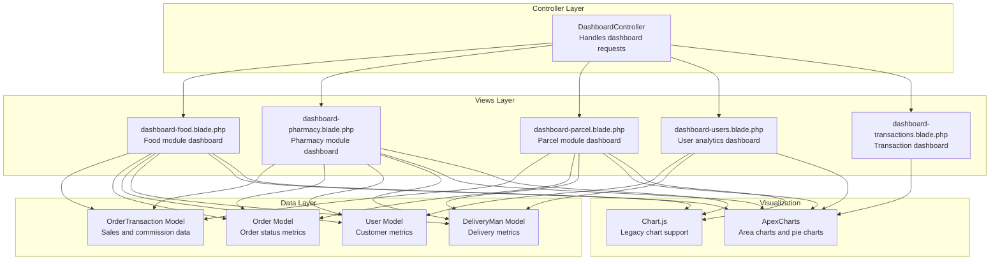
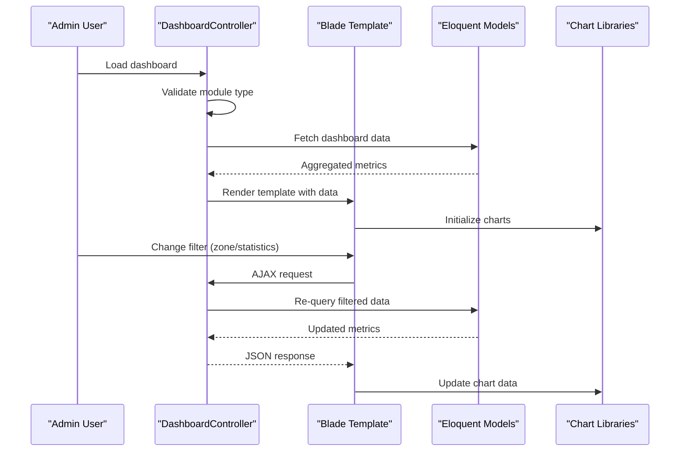
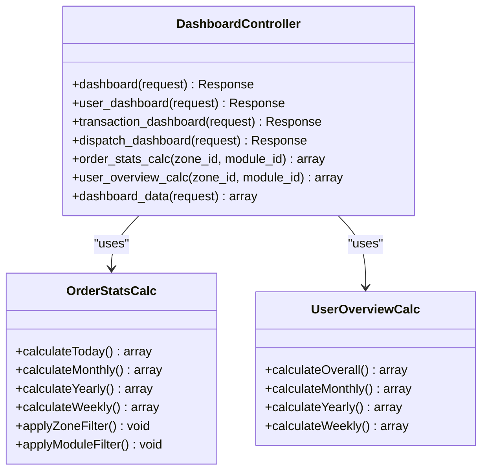
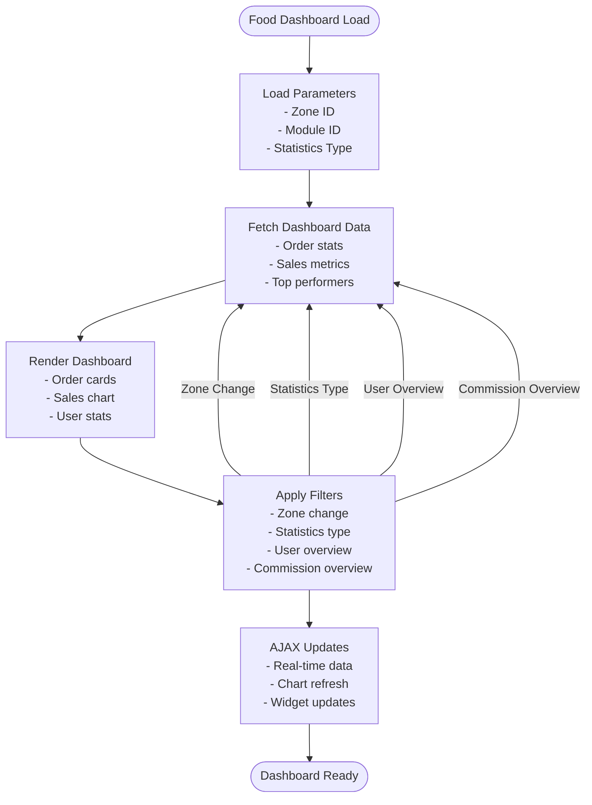
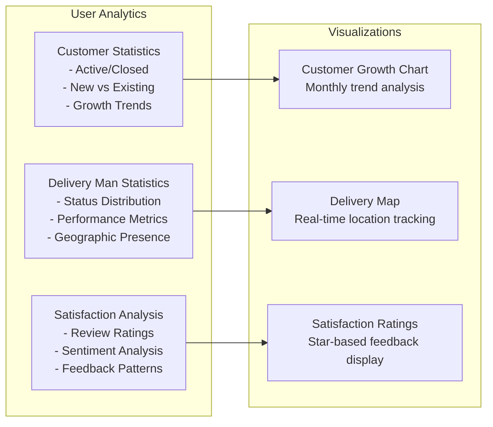
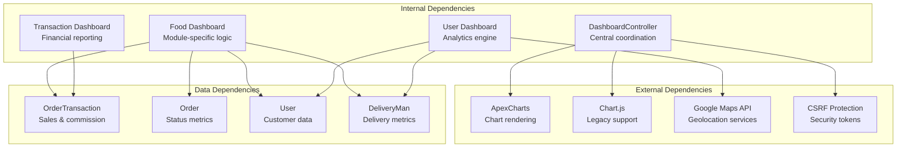

# Dashboard Overview

<cite>
**Referenced Files in This Document**
- [DashboardController.php](file://app/Http/Controllers/Admin/DashboardController.php)
- [dashboard-food.blade.php](file://resources/views/admin-views/dashboard-food.blade.php)
- [dashboard-pharmacy.blade.php](file://resources/views/admin-views/dashboard-pharmacy.blade.php)
- [dashboard-parcel.blade.php](file://resources/views/admin-views/dashboard-parcel.blade.php)
- [dashboard-users.blade.php](file://resources/views/admin-views/dashboard-users.blade.php)
- [dashboard-transactions.blade.php](file://resources/views/admin-views/dashboard-transactions.blade.php)
- [admin_formatted_routes.json](file://public/admin_formatted_routes.json)
- [style.css](file://public/assets/admin/css/style.css)
</cite>

## Table of Contents
1. [Introduction](#introduction)
2. [Project Structure](#project-structure)
3. [Core Components](#core-components)
4. [Architecture Overview](#architecture-overview)
5. [Detailed Component Analysis](#detailed-component-analysis)
6. [Dependency Analysis](#dependency-analysis)
7. [Performance Considerations](#performance-considerations)
8. [Troubleshooting Guide](#troubleshooting-guide)
9. [Conclusion](#conclusion)

## Introduction
This document provides a comprehensive overview of the admin dashboard system, covering the main dashboard interface, module-specific dashboards for food, grocery, pharmacy, and parcel services, and key performance indicators. It explains dashboard widgets, data visualization components, and business intelligence displays. It also details the transaction dashboard, user analytics dashboard, and dispatch management dashboard, along with configuration options for dashboard customization, metric filtering, and data export capabilities.

## Project Structure
The dashboard system is organized around a central controller that orchestrates data retrieval and rendering, with separate Blade templates for each module and specialized dashboards for users and transactions. The system supports dynamic filtering via AJAX endpoints and integrates with charting libraries for visualizations.

**Diagram sources**
- [DashboardController.php:220-250](file://app/Http/Controllers/Admin/DashboardController.php#L220-L250)
- [dashboard-food.blade.php:1-645](file://resources/views/admin-views/dashboard-food.blade.php#L1-L645)
- [dashboard-pharmacy.blade.php:1-643](file://resources/views/admin-views/dashboard-pharmacy.blade.php#L1-L643)
- [dashboard-parcel.blade.php:1-525](file://resources/views/admin-views/dashboard-parcel.blade.php#L1-L525)
- [dashboard-users.blade.php:1-635](file://resources/views/admin-views/dashboard-users.blade.php#L1-L635)
- [dashboard-transactions.blade.php:1-16](file://resources/views/admin-views/dashboard-transactions.blade.php#L1-L16)

**Section sources**
- [DashboardController.php:220-250](file://app/Http/Controllers/Admin/DashboardController.php#L220-L250)
- [dashboard-food.blade.php:1-645](file://resources/views/admin-views/dashboard-food.blade.php#L1-L645)
- [dashboard-pharmacy.blade.php:1-643](file://resources/views/admin-views/dashboard-pharmacy.blade.php#L1-L643)
- [dashboard-parcel.blade.php:1-525](file://resources/views/admin-views/dashboard-parcel.blade.php#L1-L525)
- [dashboard-users.blade.php:1-635](file://resources/views/admin-views/dashboard-users.blade.php#L1-L635)
- [dashboard-transactions.blade.php:1-16](file://resources/views/admin-views/dashboard-transactions.blade.php#L1-L16)

## Core Components
The dashboard system consists of:
- Central controller managing dashboard requests and data aggregation
- Module-specific dashboard views for food, pharmacy, and parcel services
- User analytics dashboard with customer and delivery man metrics
- Transaction dashboard placeholder for financial reporting
- Dynamic filtering via AJAX endpoints for zone, statistics type, user overview, and commission overview
- Charting integrations for visualizing sales, commissions, and user growth

Key responsibilities:
- Parameter management for zone, module, and statistics type
- Real-time data updates through AJAX endpoints
- Modular dashboard rendering based on current module type
- Metric calculations for sales, orders, users, and delivery performance

**Section sources**
- [DashboardController.php:220-250](file://app/Http/Controllers/Admin/DashboardController.php#L220-L250)
- [DashboardController.php:149-153](file://app/Http/Controllers/Admin/DashboardController.php#L149-L153)
- [DashboardController.php:326-347](file://app/Http/Controllers/Admin/DashboardController.php#L326-L347)
- [DashboardController.php:348-364](file://app/Http/Controllers/Admin/DashboardController.php#L348-L364)

## Architecture Overview
The dashboard architecture follows a layered approach with clear separation of concerns:
- Controller layer handles request routing and data preparation
- View layer renders module-specific dashboards with embedded charts
- Data layer provides metrics through model queries and aggregations
- Visualization layer manages chart rendering and updates

**Diagram sources**
- [DashboardController.php:220-250](file://app/Http/Controllers/Admin/DashboardController.php#L220-L250)
- [dashboard-food.blade.php:500-642](file://resources/views/admin-views/dashboard-food.blade.php#L500-L642)
- [dashboard-pharmacy.blade.php:500-641](file://resources/views/admin-views/dashboard-pharmacy.blade.php#L500-L641)
- [dashboard-parcel.blade.php:373-523](file://resources/views/admin-views/dashboard-parcel.blade.php#L373-L523)

## Detailed Component Analysis

### Main Dashboard Interface
The main dashboard controller provides unified access to all dashboard types through a single entry point. It manages parameter persistence, module type detection, and data aggregation for all dashboard components.

**Diagram sources**
- [DashboardController.php:220-250](file://app/Http/Controllers/Admin/DashboardController.php#L220-L250)
- [DashboardController.php:366-587](file://app/Http/Controllers/Admin/DashboardController.php#L366-L587)
- [DashboardController.php:590-633](file://app/Http/Controllers/Admin/DashboardController.php#L590-L633)

**Section sources**
- [DashboardController.php:220-250](file://app/Http/Controllers/Admin/DashboardController.php#L220-L250)
- [DashboardController.php:366-587](file://app/Http/Controllers/Admin/DashboardController.php#L366-L587)
- [DashboardController.php:590-633](file://app/Http/Controllers/Admin/DashboardController.php#L590-L633)

### Module-Specific Dashboards

#### Food Dashboard
The food dashboard provides comprehensive metrics for food delivery operations including order statistics, sales visualization, and performance indicators.

**Diagram sources**
- [dashboard-food.blade.php:500-642](file://resources/views/admin-views/dashboard-food.blade.php#L500-L642)

**Section sources**
- [dashboard-food.blade.php:1-645](file://resources/views/admin-views/dashboard-food.blade.php#L1-L645)

#### Pharmacy Dashboard
The pharmacy dashboard mirrors the food dashboard structure with module-specific metrics and visualizations tailored to pharmaceutical services.

**Section sources**
- [dashboard-pharmacy.blade.php:1-643](file://resources/views/admin-views/dashboard-pharmacy.blade.php#L1-L643)

#### Parcel Dashboard
The parcel dashboard focuses on package delivery metrics with simplified statistics compared to food and pharmacy modules.

**Section sources**
- [dashboard-parcel.blade.php:1-525](file://resources/views/admin-views/dashboard-parcel.blade.php#L1-L525)

### User Analytics Dashboard
The user analytics dashboard provides deep insights into customer and delivery man engagement, satisfaction metrics, and geographic distribution.

**Diagram sources**
- [dashboard-users.blade.php:102-402](file://resources/views/admin-views/dashboard-users.blade.php#L102-L402)

**Section sources**
- [dashboard-users.blade.php:1-635](file://resources/views/admin-views/dashboard-users.blade.php#L1-L635)

### Transaction Dashboard
The transaction dashboard serves as a centralized hub for financial reporting and revenue analysis across all modules.

**Section sources**
- [dashboard-transactions.blade.php:1-16](file://resources/views/admin-views/dashboard-transactions.blade.php#L1-L16)

## Dependency Analysis
The dashboard system exhibits clear dependency relationships between components:

**Diagram sources**
- [DashboardController.php:388-398](file://app/Http/Controllers/Admin/DashboardController.php#L388-L398)
- [dashboard-users.blade.php:423-423](file://resources/views/admin-views/dashboard-users.blade.php#L423-L423)
- [dashboard-food.blade.php:394-394](file://resources/views/admin-views/dashboard-food.blade.php#L394-L394)

**Section sources**
- [DashboardController.php:388-398](file://app/Http/Controllers/Admin/DashboardController.php#L388-L398)
- [dashboard-users.blade.php:423-423](file://resources/views/admin-views/dashboard-users.blade.php#L423-L423)
- [dashboard-food.blade.php:394-394](file://resources/views/admin-views/dashboard-food.blade.php#L394-L394)

## Performance Considerations
The dashboard system implements several performance optimization strategies:
- Efficient database queries with proper indexing and filtering
- Lazy loading of chart components to reduce initial load time
- AJAX-based partial updates to minimize full page reloads
- Caching mechanisms for frequently accessed metrics
- Optimized chart rendering with selective updates

## Troubleshooting Guide
Common dashboard issues and resolutions:
- Chart rendering failures: Verify chart library initialization and data format compatibility
- Filter not applying: Check AJAX endpoint responses and parameter passing
- Performance degradation: Monitor query execution times and optimize database indexes
- Module type detection errors: Validate module configuration and current module settings

**Section sources**
- [DashboardController.php:220-250](file://app/Http/Controllers/Admin/DashboardController.php#L220-L250)

## Conclusion
The admin dashboard system provides a comprehensive, modular, and highly customizable solution for monitoring business performance across multiple service types. Its architecture supports real-time data visualization, flexible filtering, and scalable performance optimization. The system's modular design enables easy extension to new modules while maintaining consistent user experience and analytical capabilities.