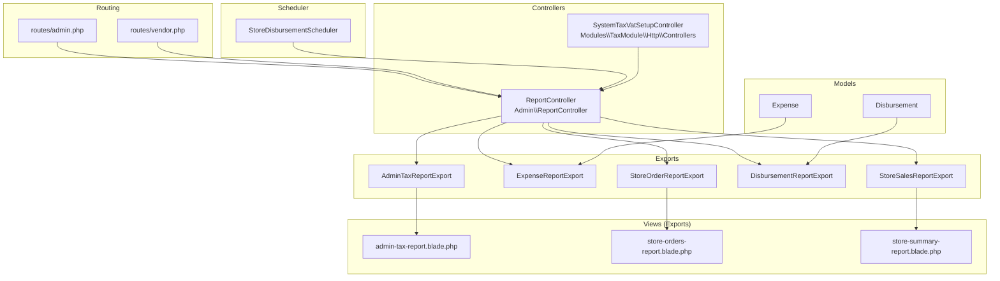
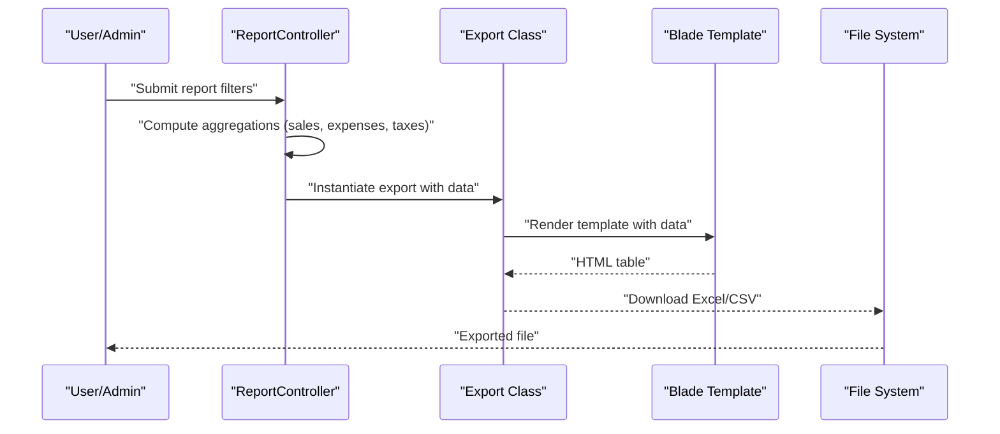
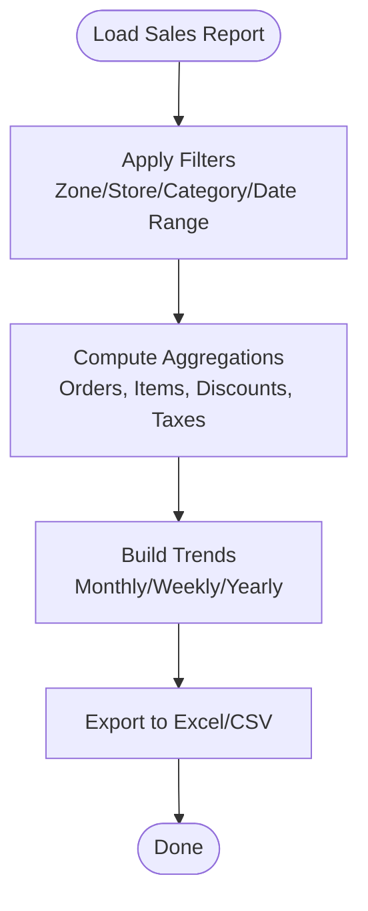
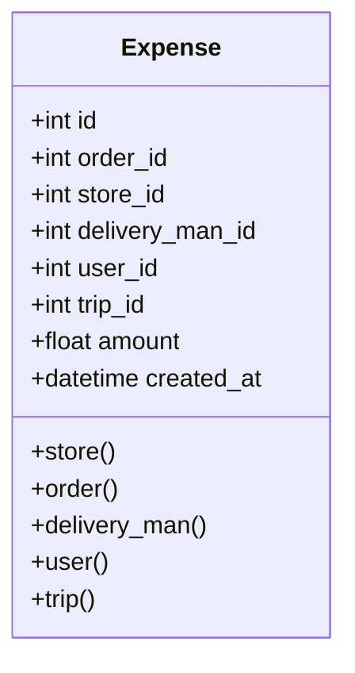
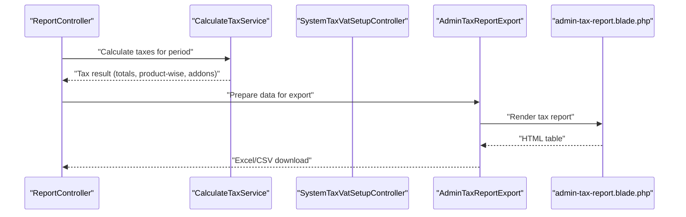
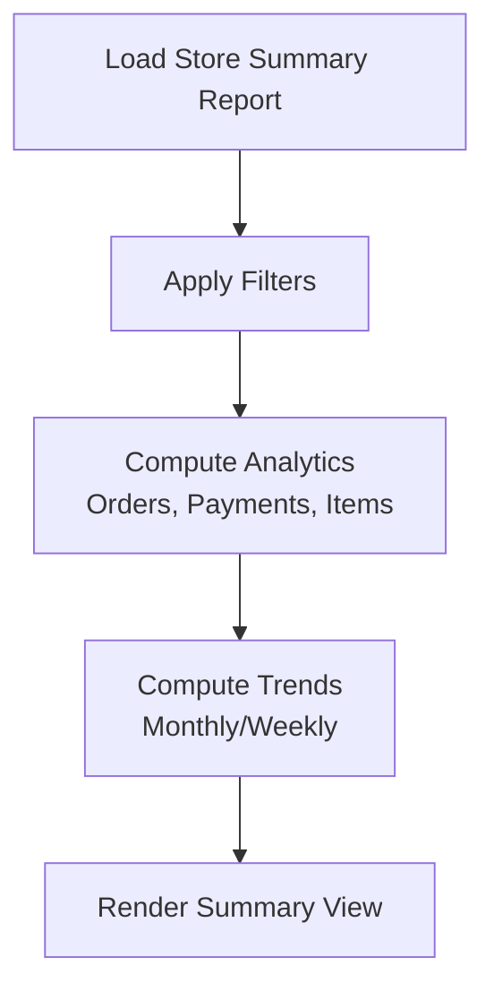
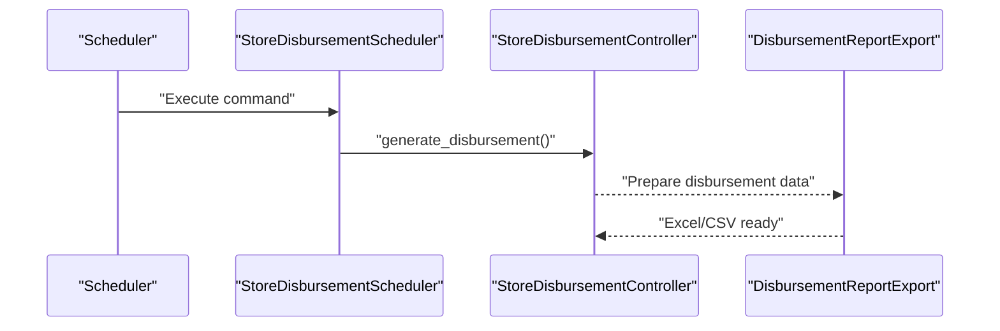
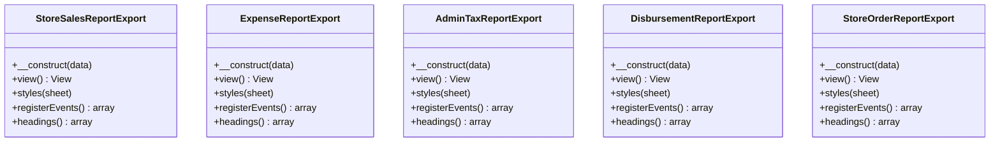
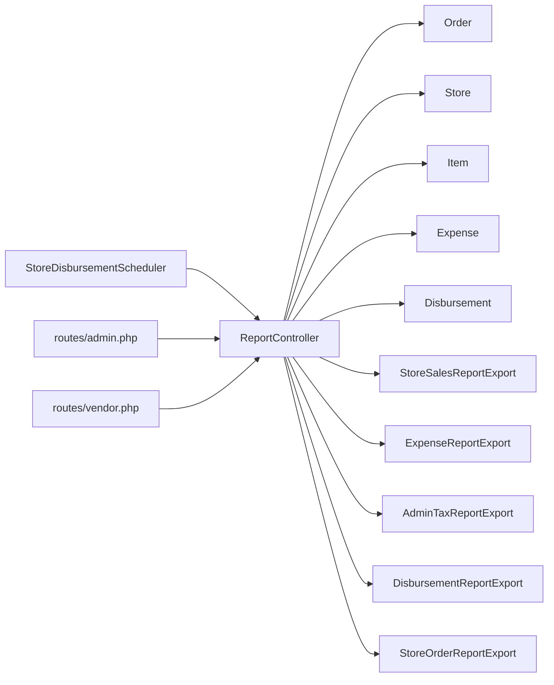

# Financial & Reports

<cite>
**Referenced Files in This Document**
- [ReportController.php](file://app/Http/Controllers/Admin/ReportController.php)
- [StoreSalesReportExport.php](file://app/Exports/StoreSalesReportExport.php)
- [ExpenseReportExport.php](file://app/Exports/ExpenseReportExport.php)
- [AdminTaxReportExport.php](file://app/Exports/AdminTaxReportExport.php)
- [DisbursementReportExport.php](file://app/Exports/DisbursementReportExport.php)
- [StoreOrderReportExport.php](file://app/Exports/StoreOrderReportExport.php)
- [Expense.php](file://app/Models/Expense.php)
- [Disbursement.php](file://app/Models/Disbursement.php)
- [admin.php](file://routes/admin.php)
- [vendor.php](file://routes/vendor.php)
- [helpers.php](file://app/CentralLogics/helpers.php)
- [admin-tax-report.blade.php](file://resources/views/file-exports/admin-tax-report.blade.php)
- [store-orders-report.blade.php](file://resources/views/file-exports/store-orders-report.blade.php)
- [store-summary-report.blade.php](file://resources/views/file-exports/store-summary-report.blade.php)
- [StoreDisbursementScheduler.php](file://app/Console/Commands/StoreDisbursementScheduler.php)
- [SystemTaxVatSetupController.php](file://Modules/TaxModule/Http/Controllers/SystemTaxVatSetupController.php)
- [CalculateTaxService.php](file://Modules/TaxModule/Services/CalculateTaxService.php)
- [admin-tax-report.blade.php](file://resources/views/admin-views/report/tax-report/admin-tax-report.blade.php)
- [disbursement-index.blade.php](file://resources/views/admin-views/business-settings/disbursement-index.blade.php)
- [DashboardController.php](file://app/Http/Controllers/Admin/DashboardController.php)
</cite>

## Table of Contents
1. [Introduction](#introduction)
2. [Project Structure](#project-structure)
3. [Core Components](#core-components)
4. [Architecture Overview](#architecture-overview)
5. [Detailed Component Analysis](#detailed-component-analysis)
6. [Dependency Analysis](#dependency-analysis)
7. [Performance Considerations](#performance-considerations)
8. [Troubleshooting Guide](#troubleshooting-guide)
9. [Conclusion](#conclusion)
10. [Appendices](#appendices)

## Introduction
This document describes the financial reporting and business analytics capabilities of the platform, focusing on sales reports, expense tracking, tax reporting, and performance metrics. It covers daily sales reports, order analytics, revenue tracking, store performance reports, item-wise sales analysis, customer purchase patterns, expense reporting and disbursement tracking, financial statement generation, tax report generation, VAT calculations, and regulatory compliance reporting. It also documents report customization, export functionality, and automated report scheduling.

## Project Structure
The financial reporting system is primarily implemented in:
- Controllers under Admin namespace that orchestrate report generation and filtering
- Export classes implementing Excel/CSV exports for various report types
- Blade templates that render report data for export
- Models representing financial entities such as Expenses and Disbursements
- Routing entries for admin and vendor report endpoints
- Scheduler command for automated disbursement generation

**Diagram sources**
- [ReportController.php:40-800](file://app/Http/Controllers/Admin/ReportController.php#L40-L800)
- [StoreSalesReportExport.php:21-151](file://app/Exports/StoreSalesReportExport.php#L21-L151)
- [ExpenseReportExport.php:20-127](file://app/Exports/ExpenseReportExport.php#L20-L127)
- [AdminTaxReportExport.php:20-130](file://app/Exports/AdminTaxReportExport.php#L20-L130)
- [DisbursementReportExport.php:17-107](file://app/Exports/DisbursementReportExport.php#L17-L107)
- [StoreOrderReportExport.php:20-134](file://app/Exports/StoreOrderReportExport.php#L20-L134)
- [Expense.php:9-49](file://app/Models/Expense.php#L9-L49)
- [Disbursement.php:8-17](file://app/Models/Disbursement.php#L8-L17)
- [admin-tax-report.blade.php:1-99](file://resources/views/file-exports/admin-tax-report.blade.php#L1-L99)
- [store-orders-report.blade.php:1-28](file://resources/views/file-exports/store-orders-report.blade.php#L1-L28)
- [store-summary-report.blade.php:18-50](file://resources/views/file-exports/store-summary-report.blade.php#L18-L50)
- [admin.php:748-753](file://routes/admin.php#L748-L753)
- [vendor.php:290-306](file://routes/vendor.php#L290-L306)
- [StoreDisbursementScheduler.php:1-24](file://app/Console/Commands/StoreDisbursementScheduler.php#L1-L24)

**Section sources**
- [ReportController.php:40-800](file://app/Http/Controllers/Admin/ReportController.php#L40-L800)
- [admin.php:748-753](file://routes/admin.php#L748-L753)
- [vendor.php:290-306](file://routes/vendor.php#L290-L306)

## Core Components
- Sales Reports
  - Daily sales reports and transaction analytics
  - Store sales report with item-wise and order analytics
  - Revenue tracking across zones, stores, and timeframes
- Expense Tracking
  - Expense report generation and export
  - Expense model linking to orders, stores, delivery men, and users
- Tax Reporting
  - Admin tax report export with income sources and tax breakdown
  - VAT calculation service supporting product/category-wise and order-wise tax
- Performance Metrics
  - Store summary report with analytics, payment statistics, and trend charts
  - Item-wise sales analysis and customer purchase pattern insights
- Disbursement Tracking
  - Disbursement report export
  - Disbursement model with details relationship
  - Automated disbursement scheduling via console command
- Export Functionality
  - Excel and CSV exports for multiple report types
  - Customized styling and alignment for exported sheets
- Regulatory Compliance
  - Tax report generation and export
  - VAT configuration and calculation logic

**Section sources**
- [ReportController.php:42-261](file://app/Http/Controllers/Admin/ReportController.php#L42-L261)
- [ReportController.php:1226-1484](file://app/Http/Controllers/Admin/ReportController.php#L1226-L1484)
- [ReportController.php:947-1169](file://app/Http/Controllers/Admin/ReportController.php#L947-L1169)
- [Expense.php:9-49](file://app/Models/Expense.php#L9-L49)
- [Disbursement.php:8-17](file://app/Models/Disbursement.php#L8-L17)
- [AdminTaxReportExport.php:20-130](file://app/Exports/AdminTaxReportExport.php#L20-L130)
- [CalculateTaxService.php:41-127](file://Modules/TaxModule/Services/CalculateTaxService.php#L41-L127)
- [StoreDisbursementScheduler.php:1-24](file://app/Console/Commands/StoreDisbursementScheduler.php#L1-L24)

## Architecture Overview
The reporting architecture follows a controller-driven pattern:
- Controllers receive filters (zones, stores, categories, date ranges) and compute aggregated metrics
- Export classes transform computed data into Excel/CSV using Blade templates
- Models encapsulate financial relationships (expenses, disbursements)
- Routing exposes endpoints for admin and vendor report generation
- Scheduler automates periodic tasks (e.g., disbursement generation)

**Diagram sources**
- [ReportController.php:263-584](file://app/Http/Controllers/Admin/ReportController.php#L263-L584)
- [StoreSalesReportExport.php:31-36](file://app/Exports/StoreSalesReportExport.php#L31-L36)
- [admin-tax-report.blade.php:1-99](file://resources/views/file-exports/admin-tax-report.blade.php#L1-L99)

## Detailed Component Analysis

### Sales Reports
- Daily Sales Reports
  - Filters: zone, store, module, custom date range, predefined periods (this year, previous year, this month, this week)
  - Aggregations: admin earnings, store earnings, delivery commission, delivery man earnings, delivered/canceled amounts
  - Export: Excel/CSV via TransactionReportExport
- Store Sales Reports
  - Filters: zone, store, custom date range, predefined periods
  - Analytics: item counts, quantities sold, discounts, revenue, and trend charts (monthly, weekly, yearly)
  - Export: StoreSalesReportExport to Excel/CSV
- Order Analytics
  - Item-wise report with counts, sums, and discounts
  - Search and pagination support
- Revenue Tracking
  - Revenue grouped by payment methods and order statuses
  - Trend computations across time windows

**Diagram sources**
- [ReportController.php:51-261](file://app/Http/Controllers/Admin/ReportController.php#L51-L261)
- [ReportController.php:1226-1484](file://app/Http/Controllers/Admin/ReportController.php#L1226-L1484)

**Section sources**
- [ReportController.php:51-261](file://app/Http/Controllers/Admin/ReportController.php#L51-L261)
- [ReportController.php:586-742](file://app/Http/Controllers/Admin/ReportController.php#L586-L742)
- [ReportController.php:1226-1484](file://app/Http/Controllers/Admin/ReportController.php#L1226-L1484)
- [StoreSalesReportExport.php:21-151](file://app/Exports/StoreSalesReportExport.php#L21-L151)

### Expense Tracking
- Expense Report Generation
  - Filters: date range, store, module
  - Data: expense records with store, order, delivery man, user, and trip associations
  - Export: ExpenseReportExport to Excel/CSV
- Expense Model
  - Relationships: belongs to Store, Order, DeliveryMan, User, Trip
  - Casts: numeric and datetime fields

**Diagram sources**
- [Expense.php:9-49](file://app/Models/Expense.php#L9-L49)

**Section sources**
- [ReportController.php:744-748](file://app/Http/Controllers/Admin/ReportController.php#L744-L748)
- [ExpenseReportExport.php:20-127](file://app/Exports/ExpenseReportExport.php#L20-L127)
- [Expense.php:9-49](file://app/Models/Expense.php#L9-L49)

### Tax Reporting and VAT Calculations
- Admin Tax Report
  - Filters: date range, module
  - Data: income sources, total income, total tax, tax breakdown by tax names and rates
  - Export: AdminTaxReportExport to Excel/CSV
  - Template: admin-tax-report.blade.php renders totals and tax details
- VAT Calculation Service
  - Supports product/category-wise and order-wise tax types
  - Processes additional charges and addon taxes
  - Returns total tax percent and amount, product-wise data, and tax IDs

**Diagram sources**
- [CalculateTaxService.php:41-127](file://Modules/TaxModule/Services/CalculateTaxService.php#L41-L127)
- [SystemTaxVatSetupController.php:15-33](file://Modules/TaxModule/Http/Controllers/SystemTaxVatSetupController.php#L15-L33)
- [AdminTaxReportExport.php:20-130](file://app/Exports/AdminTaxReportExport.php#L20-L130)
- [admin-tax-report.blade.php:1-99](file://resources/views/file-exports/admin-tax-report.blade.php#L1-L99)

**Section sources**
- [ReportController.php:42-80](file://app/Http/Controllers/Admin/ReportController.php#L42-L80)
- [AdminTaxReportExport.php:20-130](file://app/Exports/AdminTaxReportExport.php#L20-L130)
- [admin-tax-report.blade.php:1-99](file://resources/views/file-exports/admin-tax-report.blade.php#L1-L99)
- [CalculateTaxService.php:41-127](file://Modules/TaxModule/Services/CalculateTaxService.php#L41-L127)

### Performance Metrics
- Store Summary Report
  - Analytics: new stores, total orders, total order amount, completed/incomplete/canceled orders
  - Payment statistics: cash-on-delivery, wallet, digital payments
  - Trend charts: monthly/yearly/weekly/daily order amounts
- Item-wise Sales Analysis
  - Orders count, quantity sum, discount sums, price sums
  - Filters: zone, store, category, date range, module
- Customer Purchase Patterns
  - Derived from order transactions and item analytics

**Diagram sources**
- [ReportController.php:947-1169](file://app/Http/Controllers/Admin/ReportController.php#L947-L1169)
- [store-summary-report.blade.php:18-50](file://resources/views/file-exports/store-summary-report.blade.php#L18-L50)

**Section sources**
- [ReportController.php:947-1169](file://app/Http/Controllers/Admin/ReportController.php#L947-L1169)
- [store-summary-report.blade.php:18-50](file://resources/views/file-exports/store-summary-report.blade.php#L18-L50)

### Disbursement Tracking
- Disbursement Report Export
  - Data: disbursement records with details
  - Export: DisbursementReportExport to Excel/CSV
- Disbursement Model
  - HasMany details relationship
- Automated Disbursement Scheduling
  - Console command triggers disbursement generation based on business settings
  - Cron command guidance provided in business settings view

**Diagram sources**
- [StoreDisbursementScheduler.php:1-24](file://app/Console/Commands/StoreDisbursementScheduler.php#L1-L24)
- [DisbursementReportExport.php:17-107](file://app/Exports/DisbursementReportExport.php#L17-L107)
- [Disbursement.php:8-17](file://app/Models/Disbursement.php#L8-L17)
- [disbursement-index.blade.php:58-336](file://resources/views/admin-views/business-settings/disbursement-index.blade.php#L58-L336)

**Section sources**
- [ReportController.php:752-753](file://app/Http/Controllers/Admin/ReportController.php#L752-L753)
- [DisbursementReportExport.php:17-107](file://app/Exports/DisbursementReportExport.php#L17-L107)
- [Disbursement.php:8-17](file://app/Models/Disbursement.php#L8-L17)
- [StoreDisbursementScheduler.php:1-24](file://app/Console/Commands/StoreDisbursementScheduler.php#L1-L24)
- [disbursement-index.blade.php:58-336](file://resources/views/admin-views/business-settings/disbursement-index.blade.php#L58-L336)

### Export Functionality
- Export Classes
  - Implement FromView, ShouldAutoSize, WithStyles, WithHeadings, WithEvents
  - Register events for alignment, borders, row heights, and image insertion (for sales report)
- Supported Formats
  - Excel (.xlsx), CSV
- Templates
  - admin-tax-report.blade.php, store-orders-report.blade.php, store-summary-report.blade.php

**Diagram sources**
- [StoreSalesReportExport.php:21-151](file://app/Exports/StoreSalesReportExport.php#L21-L151)
- [ExpenseReportExport.php:20-127](file://app/Exports/ExpenseReportExport.php#L20-L127)
- [AdminTaxReportExport.php:20-130](file://app/Exports/AdminTaxReportExport.php#L20-L130)
- [DisbursementReportExport.php:17-107](file://app/Exports/DisbursementReportExport.php#L17-L107)
- [StoreOrderReportExport.php:20-134](file://app/Exports/StoreOrderReportExport.php#L20-L134)

**Section sources**
- [StoreSalesReportExport.php:21-151](file://app/Exports/StoreSalesReportExport.php#L21-L151)
- [ExpenseReportExport.php:20-127](file://app/Exports/ExpenseReportExport.php#L20-L127)
- [AdminTaxReportExport.php:20-130](file://app/Exports/AdminTaxReportExport.php#L20-L130)
- [DisbursementReportExport.php:17-107](file://app/Exports/DisbursementReportExport.php#L17-L107)
- [StoreOrderReportExport.php:20-134](file://app/Exports/StoreOrderReportExport.php#L20-L134)

### Report Customization and Filtering
- Filters Supported
  - Zones, stores, categories, modules
  - Date ranges: all-time, this-year, previous-year, this-month, this-week, custom
- Search Capabilities
  - Order/item search with pagination
- Dashboard Integration
  - Dashboard aggregates order and store metrics for quick insights

**Section sources**
- [ReportController.php:51-261](file://app/Http/Controllers/Admin/ReportController.php#L51-L261)
- [ReportController.php:887-945](file://app/Http/Controllers/Admin/ReportController.php#L887-L945)
- [DashboardController.php:550-577](file://app/Http/Controllers/Admin/DashboardController.php#L550-L577)

## Dependency Analysis
- Controllers depend on:
  - Models (Order, Store, Item, Expense, Disbursement)
  - Export classes for file generation
  - Blade templates for rendering
- Routing connects:
  - Admin routes for report endpoints
  - Vendor routes for vendor-specific reports (expense, disbursement, VAT)
- Scheduler depends on:
  - StoreDisbursementController for disbursement generation

**Diagram sources**
- [ReportController.php:1-80](file://app/Http/Controllers/Admin/ReportController.php#L1-L80)
- [admin.php:748-753](file://routes/admin.php#L748-L753)
- [vendor.php:290-306](file://routes/vendor.php#L290-L306)
- [StoreDisbursementScheduler.php:1-24](file://app/Console/Commands/StoreDisbursementScheduler.php#L1-L24)

**Section sources**
- [ReportController.php:1-80](file://app/Http/Controllers/Admin/ReportController.php#L1-L80)
- [admin.php:748-753](file://routes/admin.php#L748-L753)
- [vendor.php:290-306](file://routes/vendor.php#L290-L306)

## Performance Considerations
- Use predefined date filters to avoid heavy custom date range queries
- Prefer aggregated queries with grouping and summing to reduce memory usage
- Limit result sets with pagination for large datasets
- Cache frequently accessed configuration data (e.g., business settings for disbursement)
- Minimize joins and subqueries where possible; leverage precomputed aggregates

## Troubleshooting Guide
- No Tax Report Generated
  - Ensure date range and filters are selected before generating the report
  - Verify tax configuration and system tax setup
- Disbursement Automation Not Running
  - Confirm cron job is configured or use manual command execution
  - Check business settings for disbursement type and minimum thresholds
- Export Issues
  - Validate export type (Excel/CSV) and ensure required data exists
  - Confirm export classes are properly instantiated with data arrays
- Incorrect Totals
  - Re-check filter selections and date ranges
  - Verify refunded orders are excluded from earnings calculations

**Section sources**
- [admin-tax-report.blade.php:322-369](file://resources/views/admin-views/report/tax-report/admin-tax-report.blade.php#L322-L369)
- [disbursement-index.blade.php:58-336](file://resources/views/admin-views/business-settings/disbursement-index.blade.php#L58-L336)
- [helpers.php:2820-2832](file://app/CentralLogics/helpers.php#L2820-L2832)

## Conclusion
The platform provides a robust financial reporting and business analytics suite with strong support for sales analytics, expense tracking, tax reporting, and performance metrics. It offers flexible filtering, export capabilities, and automation for disbursements, enabling informed decision-making and regulatory compliance.

## Appendices
- Endpoint Reference
  - Admin Reports
    - GET admin/transactions/report/order-report
    - GET admin/transactions/report/getTaxReport
    - GET admin/transactions/report/vendorWiseTaxes
    - GET admin/report/store-summary-report
    - GET admin/report/store-sales-report
    - GET admin/report/store-sales-report-export
    - GET admin/report/day-wise-report
    - GET admin/report/day-wise-report-export
    - GET admin/report/item-wise-report
    - GET admin/report/item-wise-report-export
    - GET admin/report/low-stock-report
    - GET admin/report/low-stock-wise-report-export
    - GET admin/report/disbursement-report/{tab?}
    - GET admin/report/disbursement-report-export/{type}/{tab?}
  - Vendor Reports
    - GET vendor/report/expense-report
    - GET vendor/report/expense-export
    - GET vendor/report/disbursement-report
    - GET vendor/report/disbursement-report-export/{type}
    - GET vendor/report/vendor-tax-report
    - GET vendor/report/vendor-tax-export

**Section sources**
- [admin.php:748-753](file://routes/admin.php#L748-L753)
- [vendor.php:290-306](file://routes/vendor.php#L290-L306)