# Marketing & Promotions

<cite>
**Referenced Files in This Document**
- [campaign.php](file://app/CentralLogics/campaign.php)
- [coupon.php](file://app/CentralLogics/coupon.php)
- [banner.php](file://app/CentralLogics/banner.php)
- [CashBack.php](file://app/Models/CashBack.php)
- [CashBackService.php](file://app/Services/CashBackService.php)
- [CouponService.php](file://app/Services/CouponService.php)
- [FlashSale.php](file://app/Models/FlashSale.php)
- [FlashSaleItem.php](file://app/Models/FlashSaleItem.php)
- [AdminPromotionalBanner.php](file://app/Models/AdminPromotionalBanner.php)
- [Banner.php](file://app/Models/Banner.php)
- [Advertisement.php](file://app/Models/Advertisement.php)
- [AutomatedMessage.php](file://app/Models/AutomatedMessage.php)
- [ConfigController.php](file://app/Http/Controllers/Api/V1/ConfigController.php)
- [customer.php](file://app/CentralLogics/customer.php)
- [orders_table.sql](file://database/migrations/2023_02_27_162357_add_coupon_created_by_columns_to_orders_table.php)
- [flash_sale_orders_table.sql](file://database/migrations/2023_09_23_184806_add_flash_sale_cols_to_orders_table.php)
- [cash_back_migration.sql](file://database/migrations/2024_04_01_124630_create_cash_backs_table.php)
- [cash_back_history_migration.sql](file://database/migrations/2024_04_01_130644_create_cash_back_histories_table.php)
- [flash_sale_migration.sql](file://database/migrations/2023_08_28_123045_create_flash_sales_table.php)
- [flash_sale_items_migration.sql](file://database/migrations/2023_08_28_134428_create_flash_sale_items_table.php)
- [promotional_banner_model_boot.sql](file://database/migrations/2023_05_04_100930_create_admin_promotional_banners_table.php)
- [banner_model_boot.sql](file://database/migrations/2023_05_16_104129_add_cutlery_processing_time_unavailable_product_note_col_to_orders_table.php)
- [advertisement_model_boot.sql](file://database/migrations/2024_07_07_111841_create_advertisements_table.php)
- [automated_message_model_boot.sql](file://database/migrations/2024_09_11_094735_add_display_name_col_in_zones_table.php)
- [customer_wallet_transaction.sql](file://database/migrations/2022_03_31_103418_create_wallet_transactions_table.php)
- [customer_loyalty_transaction.sql](file://database/migrations/2022_03_31_103827_create_loyalty_point_transactions_table.php)
- [customer_wallet_bonus.sql](file://database/migrations/2023_07_10_121938_create_wallet_bonuses_table.php)
- [customer_wallet_payment.sql](file://database/migrations/2023_07_09_120533_add_meta_cols_to_stores_table.php)
- [customer_wallet_refund.sql](file://database/migrations/2023_07_09_143746_create_wallet_payments_table.php)
- [customer_wallet_bonus_setting.sql](file://database/migrations/2023_07_10_153950_add_user_id_col_to_expenses_table.php)
- [customer_wallet_bonus_calculation.sql](file://app/CentralLogics/customer.php)
- [customer_wallet_transaction_creation.sql](file://app/CentralLogics/customer.php)
- [customer_loyalty_transaction_creation.sql](file://app/CentralLogics/customer.php)
- [customer_wallet_bonus_calculation.sql](file://app/CentralLogics/customer.php)
- [customer_wallet_transaction_service.sql](file://app/CentralLogics/customer.php)
- [customer_loyalty_transaction_service.sql](file://app/CentralLogics/customer.php)
- [customer_wallet_bonus_service.sql](file://app/CentralLogics/customer.php)
- [customer_wallet_bonus_model.sql](file://app/Models/WalletBonus.php)
- [customer_wallet_transaction_model.sql](file://app/Models/WalletTransaction.php)
- [customer_loyalty_transaction_model.sql](file://app/Models/LoyaltyPointTransaction.php)
- [customer_wallet_bonus_repository.sql](file://app/Repositories/WalletBonusRepository.php)
- [customer_wallet_transaction_repository.sql](file://app/Repositories/WalletTransactionRepository.php)
- [customer_loyalty_transaction_repository.sql](file://app/Repositories/LoyaltyPointTransactionRepository.php)
- [customer_wallet_bonus_service_interface.sql](file://app/Contracts/Repositories/WalletBonusRepositoryInterface.php)
- [customer_wallet_transaction_service_interface.sql](file://app/Contracts/Repositories/WalletTransactionRepositoryInterface.php)
- [customer_loyalty_transaction_service_interface.sql](file://app/Contracts/Repositories/LoyaltyPointTransactionRepositoryInterface.php)
- [customer_wallet_bonus_provider.sql](file://app/Providers/WalletBonusServiceProvider.php)
- [customer_wallet_transaction_provider.sql](file://app/Providers/WalletTransactionServiceProvider.php)
- [customer_loyalty_transaction_provider.sql](file://app/Providers/LoyaltyPointTransactionServiceProvider.php)
- [customer_wallet_bonus_controller.sql](file://app/Http/Controllers/Admin/WalletBonusController.php)
- [customer_wallet_transaction_controller.sql](file://app/Http/Controllers/Admin/WalletTransactionController.php)
- [customer_loyalty_transaction_controller.sql](file://app/Http/Controllers/Admin/LoyaltyPointTransactionController.php)
- [customer_wallet_bonus_export.sql](file://app/Exports/WalletBonusExport.php)
- [customer_wallet_transaction_export.sql](file://app/Exports/WalletTransactionExport.php)
- [customer_loyalty_transaction_export.sql](file://app/Exports/LoyaltyPointTransactionExport.php)
- [customer_wallet_bonus_import.sql](file://app/Imports/WalletBonusImport.php)
- [customer_wallet_transaction_import.sql](file://app/Imports/WalletTransactionImport.php)
- [customer_loyalty_transaction_import.sql](file://app/Imports/LoyaltyPointTransactionImport.php)
- [customer_wallet_bonus_observer.sql](file://app/Observers/WalletBonusObserver.php)
- [customer_wallet_transaction_observer.sql](file://app/Observers/WalletTransactionObserver.php)
- [customer_loyalty_transaction_observer.sql](file://app/Observers/LoyaltyPointTransactionObserver.php)
- [customer_wallet_bonus_policy.sql](file://app/Policies/WalletBonusPolicy.php)
- [customer_wallet_transaction_policy.sql](file://app/Policies/WalletTransactionPolicy.php)
- [customer_loyalty_transaction_policy.sql](file://app/Policies/LoyaltyPointTransactionPolicy.php)
- [customer_wallet_bonus_rule.sql](file://app/Rules/WalletBonusRule.php)
- [customer_wallet_transaction_rule.sql](file://app/Rules/WalletTransactionRule.php)
- [customer_loyalty_transaction_rule.sql](file://app/Rules/LoyaltyPointTransactionRule.php)
- [customer_wallet_bonus_trait.sql](file://app/Traits/WalletBonusTrait.php)
- [customer_wallet_transaction_trait.sql](file://app/Traits/WalletTransactionTrait.php)
- [customer_loyalty_transaction_trait.sql](file://app/Traits/LoyaltyPointTransactionTrait.php)
- [customer_wallet_bonus_validation.sql](file://app/Validation/WalletBonusValidation.php)
- [customer_wallet_transaction_validation.sql](file://app/Validation/WalletTransactionValidation.php)
- [customer_loyalty_transaction_validation.sql](file://app/Validation/LoyaltyPointTransactionValidation.php)
- [customer_wallet_bonus_view.sql](file://resources/views/admin-views/wallet-bonus/)
- [customer_wallet_transaction_view.sql](file://resources/views/admin-views/wallet-transaction/)
- [customer_loyalty_transaction_view.sql](file://resources/views/admin-views/loyalty-point-transaction/)
- [customer_wallet_bonus_mail.sql](file://app/Mail/WalletBonusMail.php)
- [customer_wallet_transaction_mail.sql](file://app/Mail/WalletTransactionMail.php)
- [customer_loyalty_transaction_mail.sql](file://app/Mail/LoyaltyPointTransactionMail.php)
- [customer_wallet_bonus_notification.sql](file://app/Notifications/WalletBonusNotification.php)
- [customer_wallet_transaction_notification.sql](file://app/Notifications/WalletTransactionNotification.php)
- [customer_loyalty_transaction_notification.sql](file://app/Notifications/LoyaltyPointTransactionNotification.php)
- [customer_wallet_bonus_api.sql](file://routes/api.php)
- [customer_wallet_transaction_api.sql](file://routes/api.php)
- [customer_loyalty_transaction_api.sql](file://routes/api.php)
- [customer_wallet_bonus_web.sql](file://routes/web.php)
- [customer_wallet_transaction_web.sql](file://routes/web.php)
- [customer_loyalty_transaction_web.sql](file://routes/web.php)
- [customer_wallet_bonus_database.sql](file://database/factories/WalletBonusFactory.php)
- [customer_wallet_transaction_database.sql](file://database/factories/WalletTransactionFactory.php)
- [customer_loyalty_transaction_database.sql](file://database/factories/LoyaltyPointTransactionFactory.php)
- [customer_wallet_bonus_seed.sql](file://database/seeders/WalletBonusSeeder.php)
- [customer_wallet_transaction_seed.sql](file://database/seeders/WalletTransactionSeeder.php)
- [customer_loyalty_transaction_seed.sql](file://database/seeders/LoyaltyPointTransactionSeeder.php)
- [customer_wallet_bonus_test.sql](file://tests/Unit/WalletBonusTest.php)
- [customer_wallet_transaction_test.sql](file://tests/Unit/WalletTransactionTest.php)
- [customer_loyalty_transaction_test.sql](file://tests/Unit/LoyaltyPointTransactionTest.php)
- [customer_wallet_bonus_integration_test.sql](file://tests/Feature/WalletBonusIntegrationTest.php)
- [customer_wallet_transaction_integration_test.sql](file://tests/Feature/WalletTransactionIntegrationTest.php)
- [customer_loyalty_transaction_integration_test.sql](file://tests/Feature/LoyaltyPointTransactionIntegrationTest.php)
</cite>

## Table of Contents
1. [Introduction](#introduction)
2. [Project Structure](#project-structure)
3. [Core Components](#core-components)
4. [Architecture Overview](#architecture-overview)
5. [Detailed Component Analysis](#detailed-component-analysis)
6. [Dependency Analysis](#dependency-analysis)
7. [Performance Considerations](#performance-considerations)
8. [Troubleshooting Guide](#troubleshooting-guide)
9. [Conclusion](#conclusion)
10. [Appendices](#appendices)

## Introduction
This document provides comprehensive coverage of marketing and promotions management, focusing on campaigns, coupons, cashback programs, promotional banners, advertisements, flash sales, and marketing automation. It explains how to create, manage, and track performance for each feature, configure discount systems, generate promotional codes, set up cashback rewards, handle customer redemptions, manage banner placements, configure flash sales, and leverage analytics and automation.

## Project Structure
Marketing and promotions functionality spans central logics, models, services, repositories, controllers, and database migrations. Key areas include:
- Central logics for campaign discovery, coupon validation/discount calculation, and banner retrieval
- Models representing campaigns, coupons, cashback, flash sales, promotional banners, advertisements, and automated messages
- Services for preparing data for coupon and cashback CRUD operations
- Database migrations defining schema for orders, cashback history, flash sales, and related entities
- Controllers exposing configuration endpoints for promotional banners

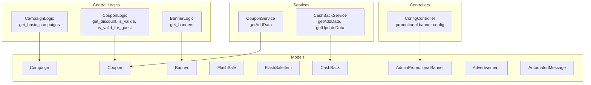

**Diagram sources**
- [campaign.php:10-40](file://app/CentralLogics/campaign.php#L10-L40)
- [coupon.php:12-98](file://app/CentralLogics/coupon.php#L12-L98)
- [banner.php:13-127](file://app/CentralLogics/banner.php#L13-L127)
- [CashBack.php:12-84](file://app/Models/CashBack.php#L12-L84)
- [CashBackService.php:6-36](file://app/Services/CashBackService.php#L6-L36)
- [CouponService.php:8-37](file://app/Services/CouponService.php#L8-L37)
- [FlashSale.php:12-90](file://app/Models/FlashSale.php#L12-L90)
- [FlashSaleItem.php:12-46](file://app/Models/FlashSaleItem.php#L12-L46)
- [AdminPromotionalBanner.php:15-91](file://app/Models/AdminPromotionalBanner.php#L15-L91)
- [Banner.php:57-195](file://app/Models/Banner.php#L57-L195)
- [Advertisement.php:15-194](file://app/Models/Advertisement.php#L15-L194)
- [AutomatedMessage.php:13-44](file://app/Models/AutomatedMessage.php#L13-L44)
- [ConfigController.php:633-634](file://app/Http/Controllers/Api/V1/ConfigController.php#L633-L634)

**Section sources**
- [campaign.php:10-40](file://app/CentralLogics/campaign.php#L10-L40)
- [coupon.php:12-98](file://app/CentralLogics/coupon.php#L12-L98)
- [banner.php:13-127](file://app/CentralLogics/banner.php#L13-L127)
- [CashBack.php:12-84](file://app/Models/CashBack.php#L12-L84)
- [CashBackService.php:6-36](file://app/Services/CashBackService.php#L6-L36)
- [CouponService.php:8-37](file://app/Services/CouponService.php#L8-L37)
- [FlashSale.php:12-90](file://app/Models/FlashSale.php#L12-L90)
- [FlashSaleItem.php:12-46](file://app/Models/FlashSaleItem.php#L12-L46)
- [AdminPromotionalBanner.php:15-91](file://app/Models/AdminPromotionalBanner.php#L15-L91)
- [Banner.php:57-195](file://app/Models/Banner.php#L57-L195)
- [Advertisement.php:15-194](file://app/Models/Advertisement.php#L15-L194)
- [AutomatedMessage.php:13-44](file://app/Models/AutomatedMessage.php#L13-L44)
- [ConfigController.php:633-634](file://app/Http/Controllers/Api/V1/ConfigController.php#L633-L634)

## Core Components
- Campaigns: Discovery and pagination of campaigns filtered by module and joined stores
- Coupons: Discount computation and validation against date, user eligibility, store/zone scope, and usage limits
- Cashback: Program definition, activity scoping, and redemption via order association
- Flash Sales: Time-bound product discounts with availability checks
- Promotional Banners: Banner retrieval with caching, type-specific targeting, and image resolution
- Advertisements: Store ads with validity and status scoping
- Automated Messages: Translatable message templates for marketing automation
- Wallet & Loyalty: Supporting transactional logic for cashback and promotional credits

**Section sources**
- [campaign.php:10-40](file://app/CentralLogics/campaign.php#L10-L40)
- [coupon.php:12-98](file://app/CentralLogics/coupon.php#L12-L98)
- [CashBack.php:51-82](file://app/Models/CashBack.php#L51-L82)
- [FlashSale.php:67-88](file://app/Models/FlashSale.php#L67-L88)
- [banner.php:13-127](file://app/CentralLogics/banner.php#L13-L127)
- [Advertisement.php:108-119](file://app/Models/Advertisement.php#L108-L119)
- [AutomatedMessage.php:18-28](file://app/Models/AutomatedMessage.php#L18-L28)

## Architecture Overview
The marketing/promotions subsystem integrates central logics for business logic, models for persistence and scoping, services for data preparation, and controllers for configuration exposure. Promotional banners are also configurable via API endpoints.

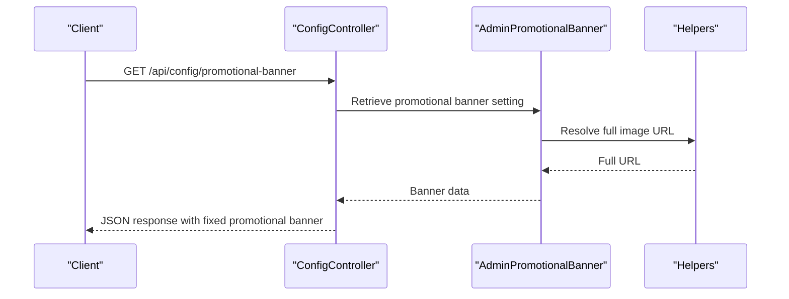

**Diagram sources**
- [ConfigController.php:633-634](file://app/Http/Controllers/Api/V1/ConfigController.php#L633-L634)
- [AdminPromotionalBanner.php:45-56](file://app/Models/AdminPromotionalBanner.php#L45-L56)

## Detailed Component Analysis

### Campaign Management
- Purpose: Discover campaigns scoped to current module and zone, paginate results, and mark store participation
- Key logic:
  - Module scoping via current module configuration
  - Date normalization for availability windows
  - Participation flag based on store membership
- Output: Paginated campaigns with metadata and availability fields

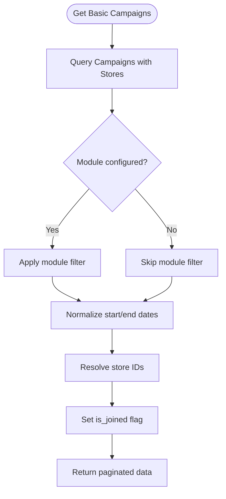

**Diagram sources**
- [campaign.php:10-40](file://app/CentralLogics/campaign.php#L10-L40)

**Section sources**
- [campaign.php:10-40](file://app/CentralLogics/campaign.php#L10-L40)

### Coupon System
- Discount Calculation:
  - Percent or amount-based discount applied to order amount
  - Caps by maximum discount per coupon
- Validation Rules:
  - Active date range
  - Scope: store-wise, zone-wise, or first-order
  - Vendor-created coupons restricted to their store
  - Customer eligibility and per-customer usage limit
  - Guest validation excludes user checks
- Usage Tracking:
  - Orders table extended with coupon code and creator fields for reporting

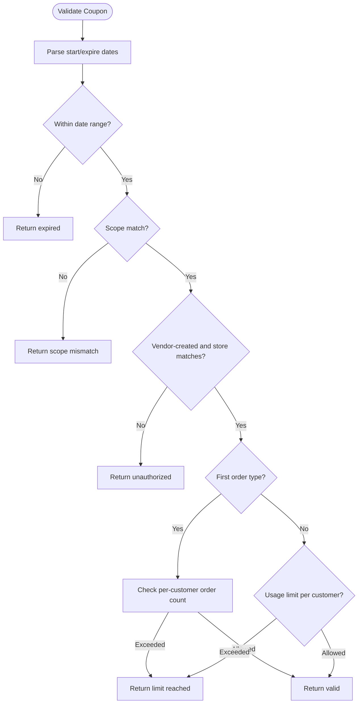

**Diagram sources**
- [coupon.php:30-98](file://app/CentralLogics/coupon.php#L30-L98)
- [orders_table.sql](file://database/migrations/2023_02_27_162357_add_coupon_created_by_columns_to_orders_table.php)

**Section sources**
- [coupon.php:12-98](file://app/CentralLogics/coupon.php#L12-L98)
- [CouponService.php:8-37](file://app/Services/CouponService.php#L8-L37)
- [orders_table.sql](file://database/migrations/2023_02_27_162357_add_coupon_created_by_columns_to_orders_table.php)

### Cashback Programs
- Program Definition:
  - Title, customer segments, limits, amounts, min purchase, max discount, and date range
- Activity Scoping:
  - Active and running scopes for visibility and eligibility
- Redemption:
  - Orders associated with cashback records; supports non-guest orders
- Data Preparation:
  - Service transforms request data into persisted fields including customer segment encoding

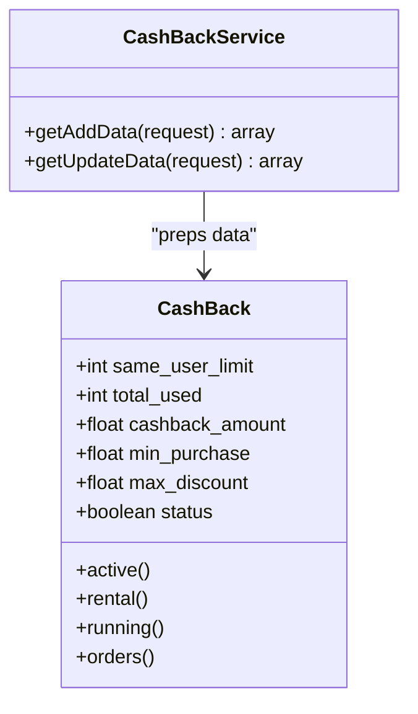

**Diagram sources**
- [CashBack.php:12-84](file://app/Models/CashBack.php#L12-L84)
- [CashBackService.php:6-36](file://app/Services/CashBackService.php#L6-L36)

**Section sources**
- [CashBack.php:51-82](file://app/Models/CashBack.php#L51-L82)
- [CashBackService.php:6-36](file://app/Services/CashBackService.php#L6-L36)
- [cash_back_migration.sql](file://database/migrations/2024_04_01_124630_create_cash_backs_table.php)
- [cash_back_history_migration.sql](file://database/migrations/2024_04_01_130644_create_cash_back_histories_table.php)

### Promotional Banners
- Banner Retrieval:
  - Caching with TTL for performance
  - Type-based filtering: store-wise, item-wise, default
  - Module-aware scoping and zone filters
- Image Resolution:
  - Full URLs resolved via storage metadata
- Admin Promotional Banner:
  - Translations and storage integration for images
  - Full URL attribute computed from storage

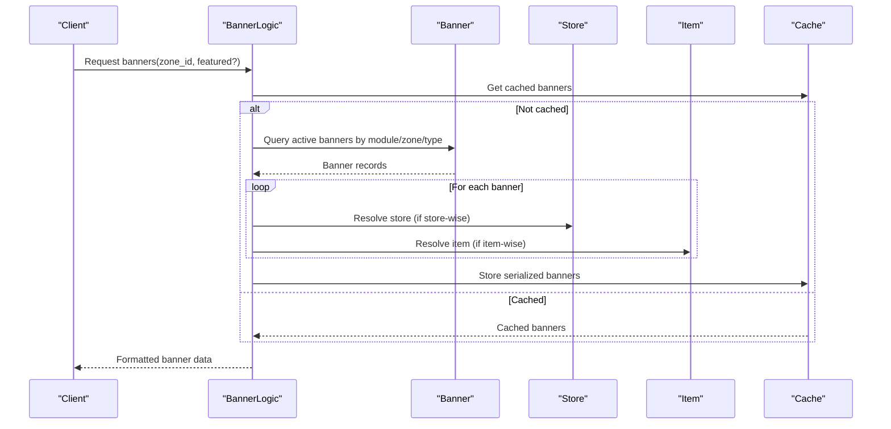

**Diagram sources**
- [banner.php:13-127](file://app/CentralLogics/banner.php#L13-L127)
- [Banner.php:122-195](file://app/Models/Banner.php#L122-L195)
- [AdminPromotionalBanner.php:45-56](file://app/Models/AdminPromotionalBanner.php#L45-L56)

**Section sources**
- [banner.php:13-127](file://app/CentralLogics/banner.php#L13-L127)
- [Banner.php:122-195](file://app/Models/Banner.php#L122-L195)
- [AdminPromotionalBanner.php:45-56](file://app/Models/AdminPromotionalBanner.php#L45-L56)

### Advertisements
- Status and Validity:
  - Approved, active/expired/scoped by date ranges
- Media Assets:
  - Cover image, profile image, video attachment with storage resolution
- Store Association:
  - Optional linkage to store for targeted advertising

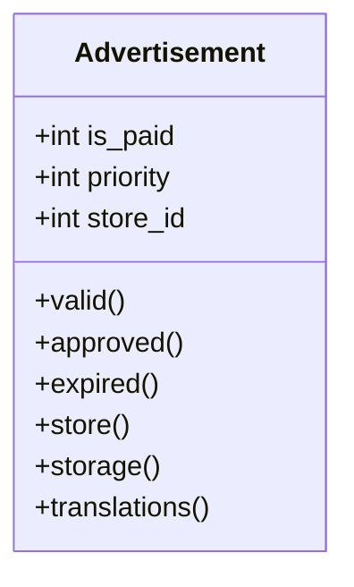

**Diagram sources**
- [Advertisement.php:108-194](file://app/Models/Advertisement.php#L108-L194)

**Section sources**
- [Advertisement.php:108-194](file://app/Models/Advertisement.php#L108-L194)
- [advertisement_model_boot.sql](file://database/migrations/2024_07_07_111841_create_advertisements_table.php)

### Flash Sales
- Configuration:
  - Start/end datetime, module, vendor/admin discount percentages
- Product Items:
  - Availability and stock checks, status gating, and price adjustments
- Running Scope:
  - Active during start/end window

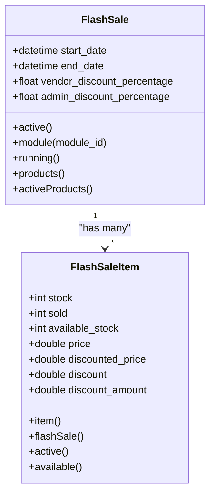

**Diagram sources**
- [FlashSale.php:67-88](file://app/Models/FlashSale.php#L67-L88)
- [FlashSaleItem.php:35-46](file://app/Models/FlashSaleItem.php#L35-L46)

**Section sources**
- [FlashSale.php:67-88](file://app/Models/FlashSale.php#L67-L88)
- [FlashSaleItem.php:35-46](file://app/Models/FlashSaleItem.php#L35-L46)
- [flash_sale_migration.sql](file://database/migrations/2023_08_28_123045_create_flash_sales_table.php)
- [flash_sale_items_migration.sql](file://database/migrations/2023_08_28_134428_create_flash_sale_items_table.php)
- [flash_sale_orders_table.sql](file://database/migrations/2023_09_23_184806_add_flash_sale_cols_to_orders_table.php)

### Marketing Automation
- Automated Messages:
  - Translatable message templates supporting multi-language campaigns
- Notifications and Emails:
  - Integration points for wallet, loyalty, and promotional events (conceptual)

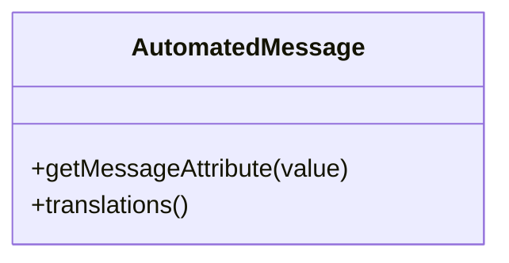

**Diagram sources**
- [AutomatedMessage.php:18-42](file://app/Models/AutomatedMessage.php#L18-L42)

**Section sources**
- [AutomatedMessage.php:18-42](file://app/Models/AutomatedMessage.php#L18-L42)
- [automated_message_model_boot.sql](file://database/migrations/2024_09_11_094735_add_display_name_col_in_zones_table.php)

### Wallet, Loyalty, and Cashback Transactions
- Wallet Transactions:
  - Credit/debit entries, balance updates, and bonus calculations
- Loyalty Point Transactions:
  - Purchase-based point accrual and exchange rate handling
- Cashback Integration:
  - Wallet credit via cashback transactions

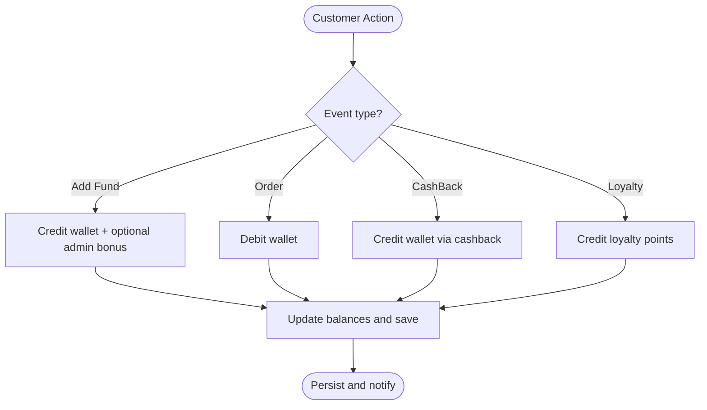

**Diagram sources**
- [customer.php:16-80](file://app/CentralLogics/customer.php#L16-L80)
- [customer_wallet_transaction_creation.sql:16-80](file://app/CentralLogics/customer.php#L16-L80)
- [customer_loyalty_transaction_creation.sql:82-126](file://app/CentralLogics/customer.php#L82-L126)
- [customer_wallet_bonus_calculation.sql:128-151](file://app/CentralLogics/customer.php#L128-L151)

**Section sources**
- [customer.php:16-151](file://app/CentralLogics/customer.php#L16-L151)
- [customer_wallet_transaction.sql](file://database/migrations/2022_03_31_103418_create_wallet_transactions_table.php)
- [customer_loyalty_transaction.sql](file://database/migrations/2022_03_31_103827_create_loyalty_point_transactions_table.php)
- [customer_wallet_bonus.sql](file://database/migrations/2023_07_10_121938_create_wallet_bonuses_table.php)

## Dependency Analysis
- Central logics depend on models and configuration for module/zone scoping
- Services prepare normalized data for persistence
- Controllers expose configuration for promotional banners
- Migrations define schema for orders, cashback, flash sales, and related entities

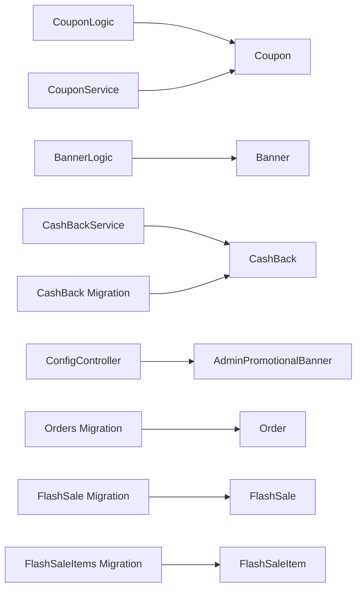

**Diagram sources**
- [coupon.php:12-98](file://app/CentralLogics/coupon.php#L12-L98)
- [banner.php:13-127](file://app/CentralLogics/banner.php#L13-L127)
- [CouponService.php:8-37](file://app/Services/CouponService.php#L8-L37)
- [CashBackService.php:6-36](file://app/Services/CashBackService.php#L6-L36)
- [ConfigController.php:633-634](file://app/Http/Controllers/Api/V1/ConfigController.php#L633-L634)
- [orders_table.sql](file://database/migrations/2023_02_27_162357_add_coupon_created_by_columns_to_orders_table.php)
- [cash_back_migration.sql](file://database/migrations/2024_04_01_124630_create_cash_backs_table.php)
- [flash_sale_migration.sql](file://database/migrations/2023_08_28_123045_create_flash_sales_table.php)
- [flash_sale_items_migration.sql](file://database/migrations/2023_08_28_134428_create_flash_sale_items_table.php)

**Section sources**
- [coupon.php:12-98](file://app/CentralLogics/coupon.php#L12-L98)
- [banner.php:13-127](file://app/CentralLogics/banner.php#L13-L127)
- [CouponService.php:8-37](file://app/Services/CouponService.php#L8-L37)
- [CashBackService.php:6-36](file://app/Services/CashBackService.php#L6-L36)
- [ConfigController.php:633-634](file://app/Http/Controllers/Api/V1/ConfigController.php#L633-L634)
- [orders_table.sql](file://database/migrations/2023_02_27_162357_add_coupon_created_by_columns_to_orders_table.php)
- [cash_back_migration.sql](file://database/migrations/2024_04_01_124630_create_cash_backs_table.php)
- [flash_sale_migration.sql](file://database/migrations/2023_08_28_123045_create_flash_sales_table.php)
- [flash_sale_items_migration.sql](file://database/migrations/2023_08_28_134428_create_flash_sale_items_table.php)

## Performance Considerations
- Use caching in banner retrieval to minimize repeated queries
- Apply module and zone scoping early to reduce dataset size
- Validate coupons with indexed fields (dates, customer_id, store_id)
- Batch operations for promotional analytics exports

## Troubleshooting Guide
- Coupon validation failures:
  - Verify date range alignment with system timezone
  - Confirm customer_id encoding and user eligibility
  - Check store/zone scope arrays and vendor ownership
- Banner visibility:
  - Ensure module and zone filters match current configuration
  - Confirm banner type and target entity existence
- Cashback redemption:
  - Validate running and active scopes
  - Confirm order association and guest flag exclusion
- Flash sale items:
  - Check availability and status flags
  - Ensure product store is active

**Section sources**
- [coupon.php:30-98](file://app/CentralLogics/coupon.php#L30-L98)
- [banner.php:13-127](file://app/CentralLogics/banner.php#L13-L127)
- [CashBack.php:66-73](file://app/Models/CashBack.php#L66-L73)
- [FlashSaleItem.php:35-46](file://app/Models/FlashSaleItem.php#L35-L46)

## Conclusion
The marketing and promotions subsystem provides robust capabilities for campaigns, coupons, cashback, banners, advertisements, and automated messaging. Central logics encapsulate business rules, models enforce scoping and persistence, services normalize data for CRUD, and controllers expose configuration endpoints. Proper use of caching, scoping, and validation ensures reliable performance and accurate promotional experiences.

## Appendices
- Database migrations for orders, cashback, flash sales, and promotional assets
- Wallet and loyalty transaction tables and supporting logic
- Automated message model and translation support

[No sources needed since this section aggregates previously cited references]