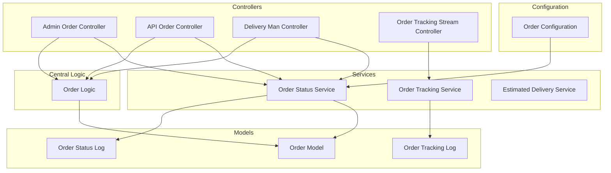
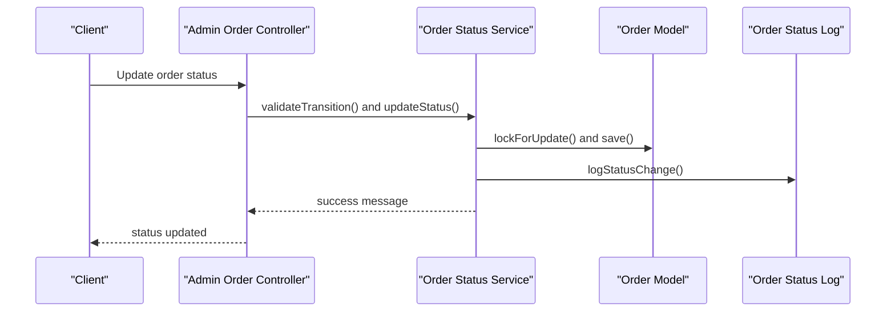
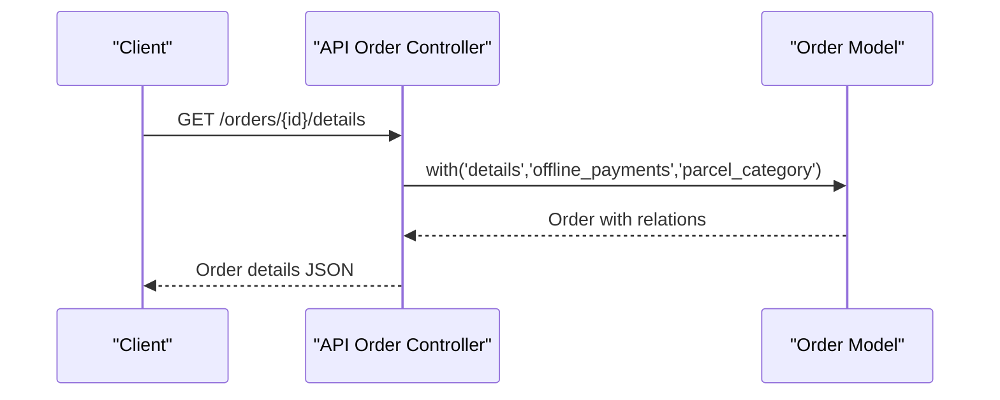
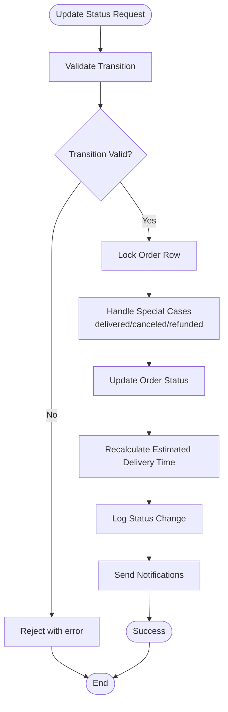
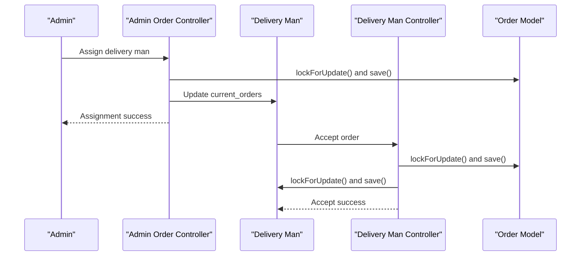
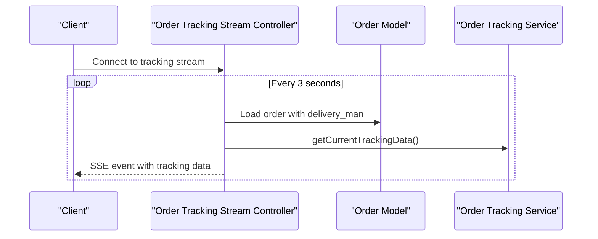
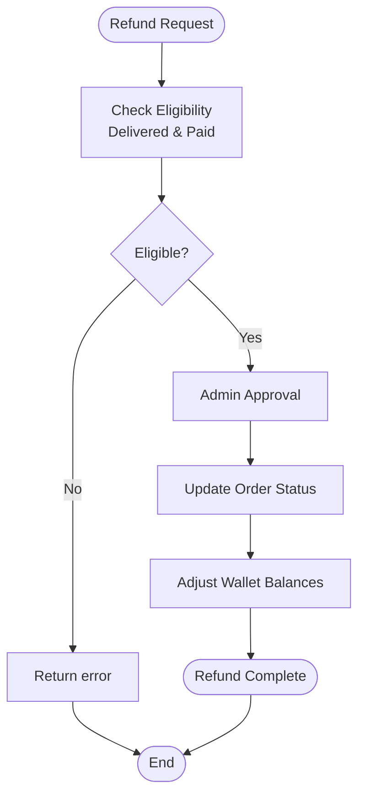
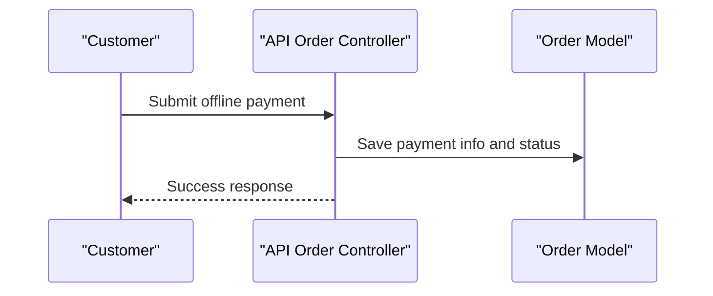
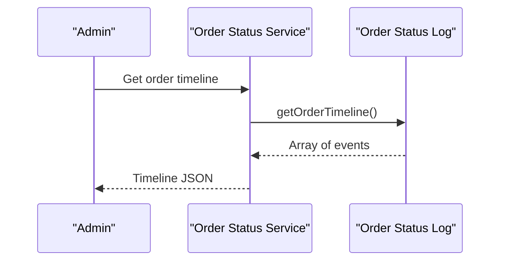
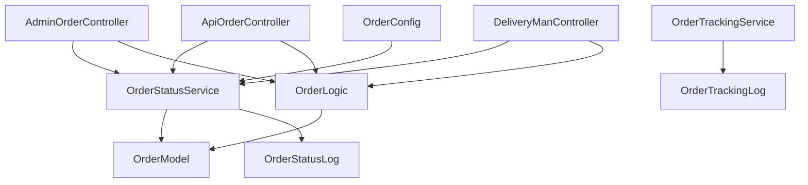

# Order Management

<cite>
**Referenced Files in This Document**
- [Order.php](file://app/Models/Order.php)
- [OrderLogic.php](file://app/CentralLogics/order.php)
- [OrderStatusService.php](file://app/Services/OrderStatusService.php)
- [OrderTrackingService.php](file://app/Services/OrderTrackingService.php)
- [OrderTrackingLog.php](file://app/Models/OrderTrackingLog.php)
- [OrderStatusLog.php](file://app/Models/OrderStatusLog.php)
- [OrderController.php](file://app/Http/Controllers/Admin/OrderController.php)
- [OrderController.php](file://app/Http/Controllers/Api/V1/OrderController.php)
- [OrderTrackingStreamController.php](file://app/Http/Controllers/Api/V1/OrderTrackingStreamController.php)
- [DeliveryManController.php](file://app/Http/Controllers/Api/V1/DeliveryManController.php)
- [EstimatedDeliveryService.php](file://app/Services/EstimatedDeliveryService.php)
- [order.php](file://config/order.php)
- [OrderReportExport.php](file://app/Exports/OrderReportExport.php)
- [OrderFlowTest.php](file://tests/Feature/OrderFlowTest.php)
</cite>

## Table of Contents
1. [Introduction](#introduction)
2. [Project Structure](#project-structure)
3. [Core Components](#core-components)
4. [Architecture Overview](#architecture-overview)
5. [Detailed Component Analysis](#detailed-component-analysis)
6. [Dependency Analysis](#dependency-analysis)
7. [Performance Considerations](#performance-considerations)
8. [Troubleshooting Guide](#troubleshooting-guide)
9. [Conclusion](#conclusion)

## Introduction
This document provides comprehensive coverage of the order management system, focusing on order processing, tracking, and fulfillment workflows. It documents order listing, order details viewing, and order status management. It explains order dispatch processes, delivery tracking, and order fulfillment workflows. It also details invoice generation, order cancellation procedures, and refund processing. Additional topics include offline payment verification, order history tracking, order analytics, order status updates, delivery man assignment, and customer communication integration.

## Project Structure
The order management system spans several layers:
- Models define the domain entities and relationships (Order, OrderTrackingLog, OrderStatusLog).
- Central logic encapsulates business rules for transactions, refunds, and calculations.
- Services coordinate complex workflows such as status transitions, tracking, and estimated delivery time.
- Controllers expose administrative and API endpoints for order operations.
- Configuration centralizes order-related settings.
- Exports support reporting and analytics.

**Diagram sources**
- [OrderController.php:46-154](file://app/Http/Controllers/Admin/OrderController.php#L46-L154)
- [OrderController.php:31-791](file://app/Http/Controllers/Api/V1/OrderController.php#L31-L791)
- [DeliveryManController.php:38-645](file://app/Http/Controllers/Api/V1/DeliveryManController.php#L38-L645)
- [OrderTrackingStreamController.php:47-119](file://app/Http/Controllers/Api/V1/OrderTrackingStreamController.php#L47-L119)
- [OrderStatusService.php:21-156](file://app/Services/OrderStatusService.php#L21-L156)
- [OrderTrackingService.php:12-124](file://app/Services/OrderTrackingService.php#L12-L124)
- [EstimatedDeliveryService.php:45-113](file://app/Services/EstimatedDeliveryService.php#L45-L113)
- [OrderLogic.php:24-674](file://app/CentralLogics/order.php#L24-L674)
- [Order.php:13-358](file://app/Models/Order.php#L13-L358)
- [OrderTrackingLog.php:8-56](file://app/Models/OrderTrackingLog.php#L8-L56)
- [OrderStatusLog.php:8-112](file://app/Models/OrderStatusLog.php#L8-L112)
- [order.php:1-33](file://config/order.php#L1-L33)

**Section sources**
- [Order.php:13-358](file://app/Models/Order.php#L13-L358)
- [OrderLogic.php:24-674](file://app/CentralLogics/order.php#L24-L674)
- [OrderStatusService.php:21-156](file://app/Services/OrderStatusService.php#L21-L156)
- [OrderTrackingService.php:12-124](file://app/Services/OrderTrackingService.php#L12-L124)
- [OrderTrackingLog.php:8-56](file://app/Models/OrderTrackingLog.php#L8-L56)
- [OrderStatusLog.php:8-112](file://app/Models/OrderStatusLog.php#L8-L112)
- [OrderController.php:46-154](file://app/Http/Controllers/Admin/OrderController.php#L46-L154)
- [OrderController.php:31-791](file://app/Http/Controllers/Api/V1/OrderController.php#L31-L791)
- [OrderTrackingStreamController.php:47-119](file://app/Http/Controllers/Api/V1/OrderTrackingStreamController.php#L47-L119)
- [DeliveryManController.php:38-645](file://app/Http/Controllers/Api/V1/DeliveryManController.php#L38-L645)
- [EstimatedDeliveryService.php:45-113](file://app/Services/EstimatedDeliveryService.php#L45-L113)
- [order.php:1-33](file://config/order.php#L1-L33)

## Core Components
This section outlines the primary components involved in order management:

- Order Model: Defines order attributes, relationships, scopes, and computed properties. It includes relationships to stores, customers, delivery men, transactions, coupons, and tracking logs.
- Order Logic: Centralizes business logic for order calculations, transaction creation, refunds, and payment updates.
- Order Status Service: Validates and executes status transitions, manages audit trails, and coordinates notifications.
- Order Tracking Service: Handles location updates, proximity notifications, and sub-status updates.
- Order Tracking Log: Stores historical tracking data for orders.
- Order Status Log: Maintains an audit trail of status changes with metadata.
- Controllers: Expose administrative and API endpoints for order listing, details, cancellation, refund requests, offline payments, and tracking streams.
- Configuration: Centralizes order settings such as delivery man limits and scheduling windows.

**Section sources**
- [Order.php:13-358](file://app/Models/Order.php#L13-L358)
- [OrderLogic.php:24-674](file://app/CentralLogics/order.php#L24-L674)
- [OrderStatusService.php:21-156](file://app/Services/OrderStatusService.php#L21-L156)
- [OrderTrackingService.php:12-124](file://app/Services/OrderTrackingService.php#L12-L124)
- [OrderTrackingLog.php:8-56](file://app/Models/OrderTrackingLog.php#L8-L56)
- [OrderStatusLog.php:8-112](file://app/Models/OrderStatusLog.php#L8-L112)
- [OrderController.php:46-154](file://app/Http/Controllers/Admin/OrderController.php#L46-L154)
- [OrderController.php:31-791](file://app/Http/Controllers/Api/V1/OrderController.php#L31-L791)
- [OrderTrackingStreamController.php:47-119](file://app/Http/Controllers/Api/V1/OrderTrackingStreamController.php#L47-L119)
- [DeliveryManController.php:38-645](file://app/Http/Controllers/Api/V1/DeliveryManController.php#L38-L645)
- [order.php:1-33](file://config/order.php#L1-L33)

## Architecture Overview
The order management system follows a layered architecture:
- Presentation Layer: Controllers expose endpoints for admin and API consumers.
- Application Layer: Services orchestrate workflows and enforce business rules.
- Domain Layer: Models represent entities and encapsulate relationships.
- Infrastructure Layer: Configuration and exports support operational needs.

**Diagram sources**
- [OrderController.php:369-574](file://app/Http/Controllers/Admin/OrderController.php#L369-L574)
- [OrderStatusService.php:89-156](file://app/Services/OrderStatusService.php#L89-L156)
- [OrderStatusLog.php:71-90](file://app/Models/OrderStatusLog.php#L71-L90)

**Section sources**
- [OrderController.php:369-574](file://app/Http/Controllers/Admin/OrderController.php#L369-L574)
- [OrderStatusService.php:89-156](file://app/Services/OrderStatusService.php#L89-L156)
- [OrderStatusLog.php:71-90](file://app/Models/OrderStatusLog.php#L71-L90)

## Detailed Component Analysis

### Order Listing and Details
Order listing and details are handled through dedicated controllers:
- Admin Order List: Filters orders by status, module, zone, vendor, date range, and search terms. Supports pagination and scheduled order filtering.
- API Order List: Returns paginated order lists for customers, including order counts and delivery address details.
- Running Orders: Retrieves currently active orders for customers.
- Order Details: Provides detailed information for a specific order, including items and parcel details.

**Diagram sources**
- [OrderController.php:151-188](file://app/Http/Controllers/Api/V1/OrderController.php#L151-L188)
- [Order.php:118-191](file://app/Models/Order.php#L118-L191)

**Section sources**
- [OrderController.php:49-154](file://app/Http/Controllers/Admin/OrderController.php#L49-L154)
- [OrderController.php:81-188](file://app/Http/Controllers/Api/V1/OrderController.php#L81-L188)
- [Order.php:118-191](file://app/Models/Order.php#L118-L191)

### Order Status Management
Order status management ensures controlled transitions and auditability:
- Valid Transitions: Defined centrally and validated before updates.
- Atomic Updates: Uses database transactions and row-level locks to prevent race conditions.
- Audit Trail: Logs all status changes with metadata and IP address.
- Notifications: Sends push notifications upon status updates.

**Diagram sources**
- [OrderStatusService.php:89-156](file://app/Services/OrderStatusService.php#L89-L156)
- [OrderStatusLog.php:71-90](file://app/Models/OrderStatusLog.php#L71-L90)
- [EstimatedDeliveryService.php:60-113](file://app/Services/EstimatedDeliveryService.php#L60-L113)

**Section sources**
- [OrderStatusService.php:26-156](file://app/Services/OrderStatusService.php#L26-L156)
- [OrderStatusLog.php:71-110](file://app/Models/OrderStatusLog.php#L71-L110)
- [EstimatedDeliveryService.php:60-113](file://app/Services/EstimatedDeliveryService.php#L60-L113)

### Dispatch and Delivery Assignment
Dispatch and delivery assignment involve coordination between administrators and delivery men:
- Admin Assignment: Assigns delivery men to orders with availability checks and cash-in-hand validations.
- Delivery Man Acceptance: Delivery men can accept orders with pre-checks for activity status, order limits, and cash-in-hand capacity.
- Location Recording: Delivery men can record location data for order tracking.

**Diagram sources**
- [OrderController.php:576-718](file://app/Http/Controllers/Admin/OrderController.php#L576-L718)
- [DeliveryManController.php:257-373](file://app/Http/Controllers/Api/V1/DeliveryManController.php#L257-L373)

**Section sources**
- [OrderController.php:576-718](file://app/Http/Controllers/Admin/OrderController.php#L576-L718)
- [DeliveryManController.php:257-373](file://app/Http/Controllers/Api/V1/DeliveryManController.php#L257-L373)

### Delivery Tracking and Real-time Updates
Real-time delivery tracking is supported via Server-Sent Events (SSE):
- Tracking Stream: Streams order status and delivery man location updates to clients.
- Tracking History: Stores and retrieves tracking logs with timestamps and coordinates.
- Proximity Notifications: Checks proximity thresholds to trigger notifications.

**Diagram sources**
- [OrderTrackingStreamController.php:47-119](file://app/Http/Controllers/Api/V1/OrderTrackingStreamController.php#L47-L119)
- [OrderTrackingService.php:73-100](file://app/Services/OrderTrackingService.php#L73-L100)

**Section sources**
- [OrderTrackingStreamController.php:47-119](file://app/Http/Controllers/Api/V1/OrderTrackingStreamController.php#L47-L119)
- [OrderTrackingService.php:28-100](file://app/Services/OrderTrackingService.php#L28-L100)
- [OrderTrackingLog.php:43-54](file://app/Models/OrderTrackingLog.php#L43-L54)

### Invoice Generation and Refund Processing
Invoice generation and refund processing are integrated into the order lifecycle:
- Invoice Generation: Admin can generate invoices for orders with detailed line items.
- Refund Requests: Customers can submit refund requests for delivered orders under specific conditions.
- Refund Processing: Admin approves or rejects refunds, updating wallets and order statuses accordingly.

**Diagram sources**
- [OrderController.php:241-316](file://app/Http/Controllers/Api/V1/OrderController.php#L241-L316)
- [OrderController.php:456-493](file://app/Http/Controllers/Admin/OrderController.php#L456-L493)
- [OrderLogic.php:398-478](file://app/CentralLogics/order.php#L398-L478)

**Section sources**
- [OrderController.php:241-316](file://app/Http/Controllers/Api/V1/OrderController.php#L241-L316)
- [OrderController.php:456-493](file://app/Http/Controllers/Admin/OrderController.php#L456-L493)
- [OrderLogic.php:398-478](file://app/CentralLogics/order.php#L398-L478)

### Offline Payment Verification
Offline payment verification supports cash-on-delivery and manual payment methods:
- Offline Payment Submission: Customers submit payment information for offline methods.
- Payment Information Updates: Allows updating submitted payment details.
- Admin Notifications: Triggers admin notifications for new offline payment submissions.

**Diagram sources**
- [OrderController.php:435-502](file://app/Http/Controllers/Api/V1/OrderController.php#L435-L502)
- [OrderController.php:505-542](file://app/Http/Controllers/Api/V1/OrderController.php#L505-L542)

**Section sources**
- [OrderController.php:435-542](file://app/Http/Controllers/Api/V1/OrderController.php#L435-L542)

### Order History Tracking and Analytics
Order history tracking and analytics support operational insights:
- Order Timeline: Retrieves chronological status change events for audit and analysis.
- Order Reports: Exports order data for reporting and analytics.
- Dashboard Widgets: Provide statistics for overall, daily, weekly, and monthly order metrics.

**Diagram sources**
- [OrderStatusService.php:343-346](file://app/Services/OrderStatusService.php#L343-L346)
- [OrderStatusLog.php:95-110](file://app/Models/OrderStatusLog.php#L95-L110)
- [OrderFlowTest.php:158-174](file://tests/Feature/OrderFlowTest.php#L158-L174)

**Section sources**
- [OrderStatusService.php:343-346](file://app/Services/OrderStatusService.php#L343-L346)
- [OrderStatusLog.php:95-110](file://app/Models/OrderStatusLog.php#L95-L110)
- [OrderReportExport.php:18-116](file://app/Exports/OrderReportExport.php#L18-L116)
- [OrderFlowTest.php:158-174](file://tests/Feature/OrderFlowTest.php#L158-L174)

## Dependency Analysis
The order management system exhibits clear separation of concerns:
- Controllers depend on Services for complex workflows.
- Services depend on Models for persistence and relationships.
- Central Logic provides shared business rules used by Controllers and Services.
- Configuration influences Service behavior and validation rules.

**Diagram sources**
- [OrderController.php:46-154](file://app/Http/Controllers/Admin/OrderController.php#L46-L154)
- [OrderController.php:31-791](file://app/Http/Controllers/Api/V1/OrderController.php#L31-L791)
- [DeliveryManController.php:38-645](file://app/Http/Controllers/Api/V1/DeliveryManController.php#L38-L645)
- [OrderStatusService.php:21-156](file://app/Services/OrderStatusService.php#L21-L156)
- [OrderTrackingService.php:12-124](file://app/Services/OrderTrackingService.php#L12-L124)
- [OrderLogic.php:24-674](file://app/CentralLogics/order.php#L24-L674)
- [Order.php:13-358](file://app/Models/Order.php#L13-L358)
- [OrderStatusLog.php:8-112](file://app/Models/OrderStatusLog.php#L8-L112)
- [OrderTrackingLog.php:8-56](file://app/Models/OrderTrackingLog.php#L8-L56)
- [order.php:1-33](file://config/order.php#L1-L33)

**Section sources**
- [OrderController.php:46-154](file://app/Http/Controllers/Admin/OrderController.php#L46-L154)
- [OrderController.php:31-791](file://app/Http/Controllers/Api/V1/OrderController.php#L31-L791)
- [DeliveryManController.php:38-645](file://app/Http/Controllers/Api/V1/DeliveryManController.php#L38-L645)
- [OrderStatusService.php:21-156](file://app/Services/OrderStatusService.php#L21-L156)
- [OrderTrackingService.php:12-124](file://app/Services/OrderTrackingService.php#L12-L124)
- [OrderLogic.php:24-674](file://app/CentralLogics/order.php#L24-L674)
- [Order.php:13-358](file://app/Models/Order.php#L13-L358)
- [OrderStatusLog.php:8-112](file://app/Models/OrderStatusLog.php#L8-L112)
- [OrderTrackingLog.php:8-56](file://app/Models/OrderTrackingLog.php#L8-L56)
- [order.php:1-33](file://config/order.php#L1-L33)

## Performance Considerations
- Use database transactions and row-level locks to prevent race conditions during status updates and assignments.
- Implement caching for frequently accessed configurations (e.g., order transitions, delivery limits).
- Optimize queries with eager loading of relationships to reduce N+1 issues.
- Use pagination for order listings and reports to manage memory usage.
- Consider background jobs for heavy operations like notifications and exports.

## Troubleshooting Guide
Common issues and resolutions:
- Order Status Update Failures: Validate transitions and ensure the order is not locked by another process. Check audit logs for detailed error messages.
- Delivery Man Assignment Errors: Verify availability, order limits, and cash-in-hand constraints. Confirm the delivery man's current_orders and collected_cash balances.
- Refund Processing Issues: Ensure the order is eligible for refund and payment_status is paid. Verify wallet adjustments and admin approvals.
- Tracking Stream Disconnections: Confirm SSE headers and heartbeat mechanisms. Validate client-side connection handling.
- Offline Payment Submission Failures: Check required fields and method configuration. Ensure payment info JSON is properly encoded.

**Section sources**
- [OrderStatusService.php:149-155](file://app/Services/OrderStatusService.php#L149-L155)
- [OrderController.php:576-718](file://app/Http/Controllers/Admin/OrderController.php#L576-L718)
- [OrderController.php:241-316](file://app/Http/Controllers/Api/V1/OrderController.php#L241-L316)
- [OrderTrackingStreamController.php:47-119](file://app/Http/Controllers/Api/V1/OrderTrackingStreamController.php#L47-L119)
- [OrderController.php:435-502](file://app/Http/Controllers/Api/V1/OrderController.php#L435-L502)

## Conclusion
The order management system provides a robust foundation for processing, tracking, and fulfilling orders across multiple channels. Its modular design, centralized configuration, and comprehensive audit capabilities support scalability and maintainability. By leveraging services for complex workflows, models for domain representation, and controllers for presentation, the system ensures reliable order lifecycle management from placement to completion.