# System Settings

<cite>
**Referenced Files in This Document**
- [config/app.php](file://config/app.php)
- [config/mail.php](file://config/mail.php)
- [config/firebase.php](file://config/firebase.php)
- [config/websockets.php](file://config/websockets.php)
- [config/filesystems.php](file://config/filesystems.php)
- [app/Models/EmailTemplate.php](file://app/Models/EmailTemplate.php)
- [app/Models/Notification.php](file://app/Models/Notification.php)
- [app/Models/NotificationSetting.php](file://app/Models/NotificationSetting.php)
- [app/Models/StoreNotificationSetting.php](file://app/Models/StoreNotificationSetting.php)
- [app/Models/MailConfig.php](file://app/Models/MailConfig.php)
- [app/Models/ExternalConfiguration.php](file://app/Models/ExternalConfiguration.php)
- [app/Services/NotificationService.php](file://app/Services/NotificationService.php)
- [app/Services/OrderNotificationService.php](file://app/Services/OrderNotificationService.php)
- [app/Traits/SmsGateway.php](file://app/Traits/SmsGateway.php)
- [app/Utils/language.php](file://app/Utils/language.php)
</cite>

## Table of Contents
1. [Introduction](#introduction)
2. [Project Structure](#project-structure)
3. [Core Components](#core-components)
4. [Architecture Overview](#architecture-overview)
5. [Detailed Component Analysis](#detailed-component-analysis)
6. [Dependency Analysis](#dependency-analysis)
7. [Performance Considerations](#performance-considerations)
8. [Troubleshooting Guide](#troubleshooting-guide)
9. [Conclusion](#conclusion)

## Introduction
This document explains system configuration and technical settings for email templates, language management, notification systems, and integration settings. It covers:
- Email template management and SMTP configuration
- Multi-language setup and localization
- SMS gateway configuration and notification channels
- Push notification integration via Firebase Cloud Messaging (FCM)
- Storage configuration and cloud storage setup
- WebSocket settings for real-time features
- Third-party service integrations

## Project Structure
The system settings are primarily defined in configuration files under config/, with supporting models and services that manage templates, notifications, storage, and integrations.

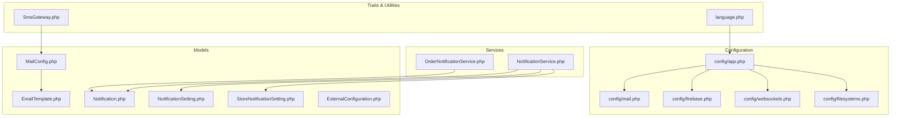

**Diagram sources**
- [config/app.php:1-243](file://config/app.php#L1-L243)
- [config/mail.php:1-111](file://config/mail.php#L1-L111)
- [config/firebase.php:1-183](file://config/firebase.php#L1-L183)
- [config/websockets.php:1-142](file://config/websockets.php#L1-L142)
- [config/filesystems.php:1-74](file://config/filesystems.php#L1-L74)
- [app/Models/EmailTemplate.php:1-183](file://app/Models/EmailTemplate.php#L1-L183)
- [app/Models/Notification.php:1-142](file://app/Models/Notification.php#L1-L142)
- [app/Models/NotificationSetting.php:1-15](file://app/Models/NotificationSetting.php#L1-L15)
- [app/Models/StoreNotificationSetting.php:1-19](file://app/Models/StoreNotificationSetting.php#L1-L19)
- [app/Models/MailConfig.php:1-23](file://app/Models/MailConfig.php#L1-L23)
- [app/Models/ExternalConfiguration.php:1-21](file://app/Models/ExternalConfiguration.php#L1-L21)
- [app/Services/NotificationService.php:1-64](file://app/Services/NotificationService.php#L1-L64)
- [app/Services/OrderNotificationService.php:1-312](file://app/Services/OrderNotificationService.php#L1-L312)
- [app/Traits/SmsGateway.php:1-714](file://app/Traits/SmsGateway.php#L1-L714)
- [app/Utils/language.php:1-67](file://app/Utils/language.php#L1-L67)

**Section sources**
- [config/app.php:1-243](file://config/app.php#L1-L243)
- [config/mail.php:1-111](file://config/mail.php#L1-L111)
- [config/firebase.php:1-183](file://config/firebase.php#L1-L183)
- [config/websockets.php:1-142](file://config/websockets.php#L1-L142)
- [config/filesystems.php:1-74](file://config/filesystems.php#L1-L74)

## Core Components
- Email Template Management: Models and storage mapping for email templates with localized translations and image handling.
- SMTP Configuration: Default mailer and transport settings for sending emails.
- Notification Systems: Push notifications via FCM, with topic-based targeting and order-specific updates.
- SMS Gateway Configuration: Multiple providers abstraction with provider selection and OTP sending.
- Language Management: Localization utilities and default language resolution.
- Storage Configuration: Local and cloud storage disks, including S3-compatible endpoints.
- WebSocket Settings: Real-time messaging server configuration for push notifications.
- Third-party Integrations: Firebase Admin SDK, external configuration storage, and provider-specific APIs.

**Section sources**
- [app/Models/EmailTemplate.php:1-183](file://app/Models/EmailTemplate.php#L1-L183)
- [app/Models/Notification.php:1-142](file://app/Models/Notification.php#L1-L142)
- [app/Services/NotificationService.php:1-64](file://app/Services/NotificationService.php#L1-L64)
- [app/Services/OrderNotificationService.php:1-312](file://app/Services/OrderNotificationService.php#L1-L312)
- [app/Traits/SmsGateway.php:1-714](file://app/Traits/SmsGateway.php#L1-L714)
- [app/Utils/language.php:1-67](file://app/Utils/language.php#L1-L67)
- [config/mail.php:1-111](file://config/mail.php#L1-L111)
- [config/filesystems.php:1-74](file://config/filesystems.php#L1-L74)
- [config/websockets.php:1-142](file://config/websockets.php#L1-L142)
- [config/firebase.php:1-183](file://config/firebase.php#L1-L183)
- [app/Models/MailConfig.php:1-23](file://app/Models/MailConfig.php#L1-L23)
- [app/Models/ExternalConfiguration.php:1-21](file://app/Models/ExternalConfiguration.php#L1-L21)

## Architecture Overview
The system integrates configuration-driven components for email, notifications, storage, and third-party services. Models encapsulate data and relationships, services orchestrate workflows, traits provide reusable integrations, and configuration files define runtime behavior.

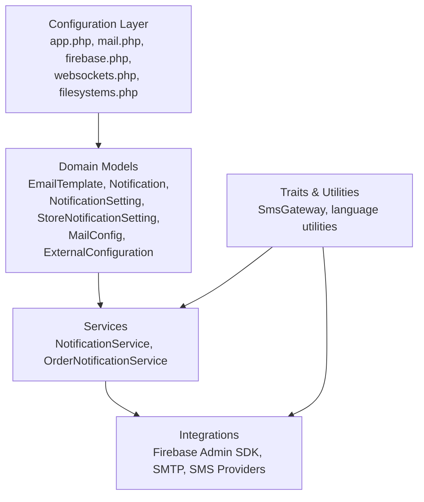

**Diagram sources**
- [config/app.php:1-243](file://config/app.php#L1-L243)
- [config/mail.php:1-111](file://config/mail.php#L1-L111)
- [config/firebase.php:1-183](file://config/firebase.php#L1-L183)
- [config/websockets.php:1-142](file://config/websockets.php#L1-L142)
- [config/filesystems.php:1-74](file://config/filesystems.php#L1-L74)
- [app/Models/EmailTemplate.php:1-183](file://app/Models/EmailTemplate.php#L1-L183)
- [app/Models/Notification.php:1-142](file://app/Models/Notification.php#L1-L142)
- [app/Models/NotificationSetting.php:1-15](file://app/Models/NotificationSetting.php#L1-L15)
- [app/Models/StoreNotificationSetting.php:1-19](file://app/Models/StoreNotificationSetting.php#L1-L19)
- [app/Models/MailConfig.php:1-23](file://app/Models/MailConfig.php#L1-L23)
- [app/Models/ExternalConfiguration.php:1-21](file://app/Models/ExternalConfiguration.php#L1-L21)
- [app/Services/NotificationService.php:1-64](file://app/Services/NotificationService.php#L1-L64)
- [app/Services/OrderNotificationService.php:1-312](file://app/Services/OrderNotificationService.php#L1-L312)
- [app/Traits/SmsGateway.php:1-714](file://app/Traits/SmsGateway.php#L1-L714)
- [app/Utils/language.php:1-67](file://app/Utils/language.php#L1-L67)

## Detailed Component Analysis

### Email Template Management
Email templates support localization and dynamic image handling. They maintain translations keyed by locale and associate images with storage disks.

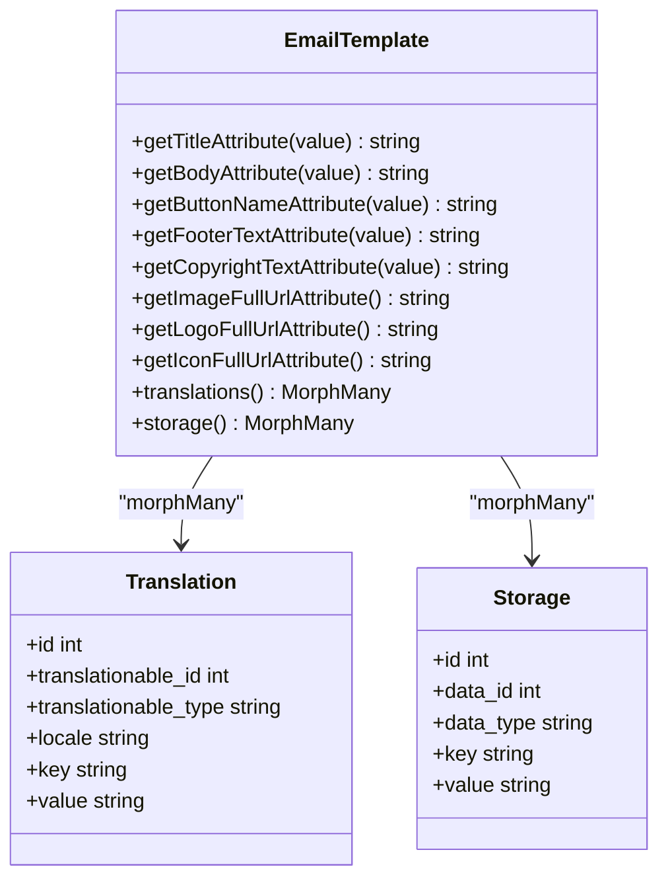

**Diagram sources**
- [app/Models/EmailTemplate.php:55-134](file://app/Models/EmailTemplate.php#L55-L134)
- [app/Models/EmailTemplate.php:120-134](file://app/Models/EmailTemplate.php#L120-L134)

Key behaviors:
- Translations are resolved per locale using a global scope.
- Image URLs are constructed using a helper and storage mapping.
- On save, storage records are updated or inserted for image/logo/icon keys.

**Section sources**
- [app/Models/EmailTemplate.php:1-183](file://app/Models/EmailTemplate.php#L1-L183)

### SMTP Configuration
SMTP is the default mailer with host, port, encryption, and credentials managed via environment variables. Global “From” address is configurable.

```mermaid
flowchart TD
Start(["Load mail.php"]) --> DefaultMailer["Resolve default mailer"]
DefaultMailer --> Transport{"Transport type?"}
Transport --> |smtp| SmtpCfg["Read host, port, encryption, username, password"]
Transport --> |ses| SesCfg["Configure SES transport"]
Transport --> |mailgun| MailgunCfg["Configure Mailgun transport"]
Transport --> |postmark| PostmarkCfg["Configure Postmark transport"]
Transport --> |sendmail| SendmailCfg["Configure sendmail path"]
Transport --> |log|array| LogCfg["Configure log/array transports"]
SmtpCfg --> FromAddr["Set global From address/name"]
FromAddr --> End(["Ready"])
```

**Diagram sources**
- [config/mail.php:16-89](file://config/mail.php#L16-L89)

Operational notes:
- Use environment variables for sensitive settings.
- Choose transport based on provider availability and compliance.

**Section sources**
- [config/mail.php:1-111](file://config/mail.php#L1-L111)

### Multi-Language Setup and Localization
Localization is driven by a translation utility that sets the locale and resolves keys from language files. Default language is determined from configuration and persisted in session.

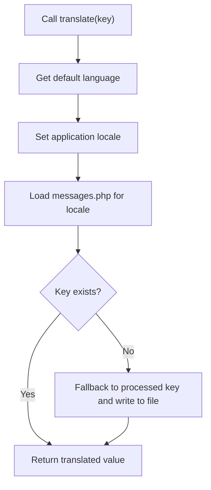

**Diagram sources**
- [app/Utils/language.php:6-29](file://app/Utils/language.php#L6-L29)
- [app/Utils/language.php:41-66](file://app/Utils/language.php#L41-L66)

Additional configuration:
- Application locale and fallback locale are defined in app configuration.

**Section sources**
- [app/Utils/language.php:1-67](file://app/Utils/language.php#L1-L67)
- [config/app.php:85-98](file://config/app.php#L85-L98)

### SMS Gateway Configuration
The SMS gateway trait selects a provider dynamically and sends OTPs via the chosen provider’s API. Providers include Twilio, Nexmo, 2Factor, MSG91, Releans, Hubtel, Paradox, SignalWire, 019 SMS, Viatech, Global SMS, Akandit SMS, SMS.to, Alphanet SMS, Akedly, and Akedly.

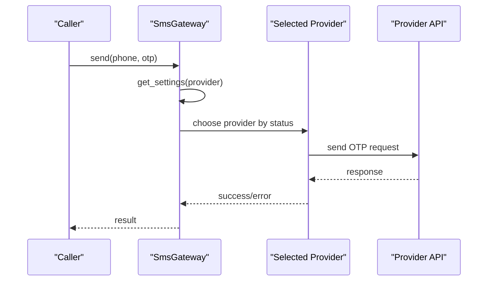

**Diagram sources**
- [app/Traits/SmsGateway.php:13-91](file://app/Traits/SmsGateway.php#L13-L91)
- [app/Traits/SmsGateway.php:93-712](file://app/Traits/SmsGateway.php#L93-L712)

Provider selection logic:
- Iterates through providers in order and uses the first enabled one.
- Each provider method constructs the message and invokes the provider’s API.

**Section sources**
- [app/Traits/SmsGateway.php:1-714](file://app/Traits/SmsGateway.php#L1-L714)

### Notification Systems
Notifications support image uploads, zone scoping, and topic-based targeting for push channels. Order-specific notifications include progress steps and ETA calculations.

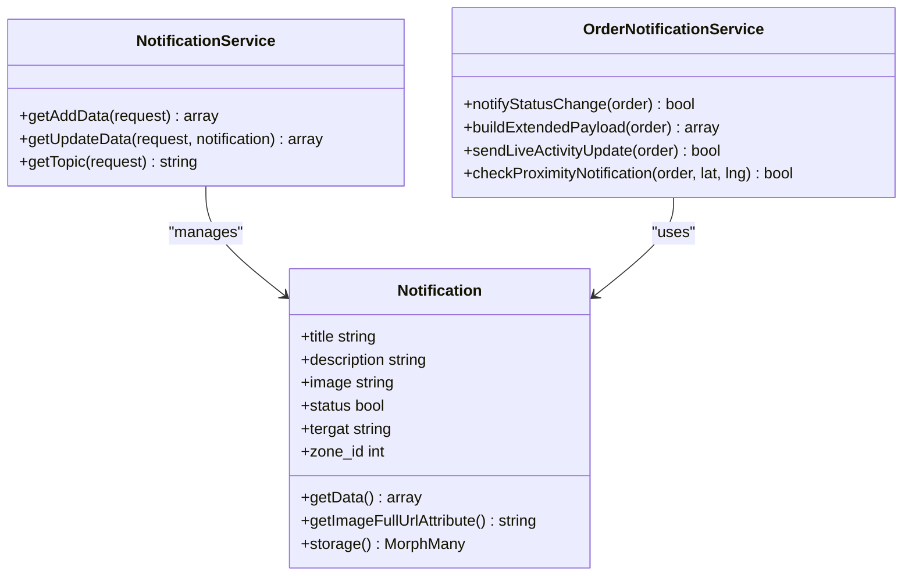

**Diagram sources**
- [app/Models/Notification.php:56-120](file://app/Models/Notification.php#L56-L120)
- [app/Services/NotificationService.php:11-63](file://app/Services/NotificationService.php#L11-L63)
- [app/Services/OrderNotificationService.php:86-122](file://app/Services/OrderNotificationService.php#L86-L122)

Key capabilities:
- Topic construction for customer/delivery-man/store channels, both all-zone and zone-specific.
- Extended payload fields for order status, ETA, store/driver info, and progress.
- Proximity detection to trigger “nearby” notifications.
- Live Activity updates for iOS via APNs.

**Section sources**
- [app/Models/Notification.php:1-142](file://app/Models/Notification.php#L1-L142)
- [app/Services/NotificationService.php:1-64](file://app/Services/NotificationService.php#L1-L64)
- [app/Services/OrderNotificationService.php:1-312](file://app/Services/OrderNotificationService.php#L1-L312)

### Storage Configuration and Cloud Storage
Local and cloud storage disks are configured, including S3-compatible endpoints. Public and private visibility settings are supported.

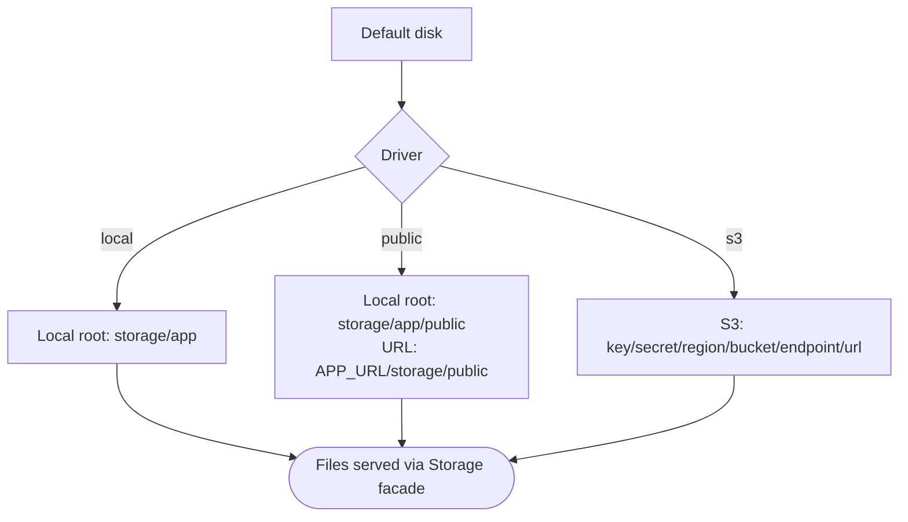

**Diagram sources**
- [config/filesystems.php:16-54](file://config/filesystems.php#L16-L54)

Notes:
- Public disk exposes files via web-accessible URLs.
- S3 configuration supports custom endpoints for compatibility with S3-like services.

**Section sources**
- [config/filesystems.php:1-74](file://config/filesystems.php#L1-L74)

### WebSocket Settings
WebSocket server configuration defines dashboard port, app credentials, SSL options, statistics logging, and allowed origins.

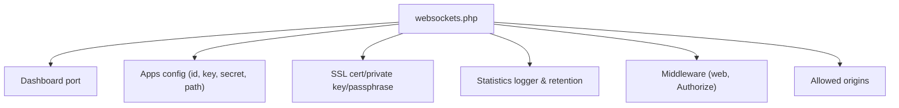

**Diagram sources**
- [config/websockets.php:10-141](file://config/websockets.php#L10-L141)

Typical usage:
- Serve real-time features alongside push notifications.
- Configure SSL for secure connections.

**Section sources**
- [config/websockets.php:1-142](file://config/websockets.php#L1-L142)

### Firebase Cloud Messaging (FCM) Configuration
Firebase Admin SDK configuration supports credentials, database URL, dynamic links, storage bucket, caching, logging, HTTP client options, and debug settings.

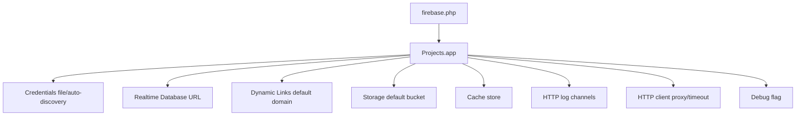

**Diagram sources**
- [config/firebase.php:16-181](file://config/firebase.php#L16-L181)

Integration notes:
- Use credentials for server-to-server access.
- Configure logging channels for diagnostics.

**Section sources**
- [config/firebase.php:1-183](file://config/firebase.php#L1-L183)

### Third-Party Service Integrations
External configuration storage supports arbitrary key-value pairs for integrations. Mail configuration models support store-scoped settings.

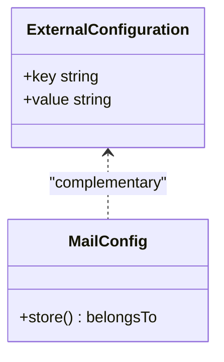

**Diagram sources**
- [app/Models/ExternalConfiguration.php:12-19](file://app/Models/ExternalConfiguration.php#L12-L19)
- [app/Models/MailConfig.php:10-21](file://app/Models/MailConfig.php#L10-L21)

**Section sources**
- [app/Models/ExternalConfiguration.php:1-21](file://app/Models/ExternalConfiguration.php#L1-L21)
- [app/Models/MailConfig.php:1-23](file://app/Models/MailConfig.php#L1-L23)

## Dependency Analysis
The following diagram highlights key dependencies among configuration, models, services, and traits.

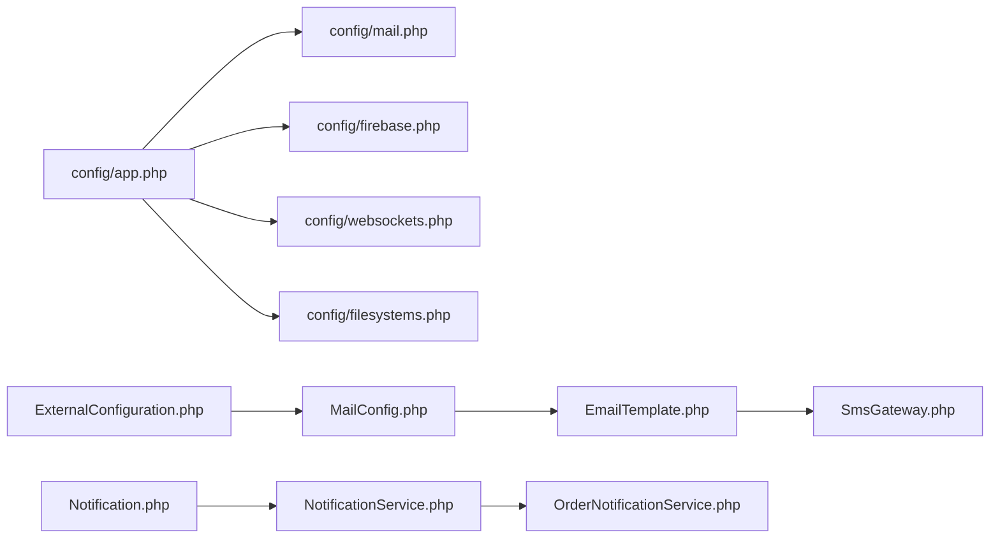

**Diagram sources**
- [config/app.php:139-186](file://config/app.php#L139-L186)
- [config/mail.php:16-89](file://config/mail.php#L16-L89)
- [config/firebase.php:9-181](file://config/firebase.php#L9-L181)
- [config/websockets.php:24-141](file://config/websockets.php#L24-L141)
- [config/filesystems.php:16-54](file://config/filesystems.php#L16-L54)
- [app/Models/EmailTemplate.php:120-134](file://app/Models/EmailTemplate.php#L120-L134)
- [app/Models/Notification.php:106-120](file://app/Models/Notification.php#L106-L120)
- [app/Services/NotificationService.php:11-63](file://app/Services/NotificationService.php#L11-L63)
- [app/Services/OrderNotificationService.php:86-122](file://app/Services/OrderNotificationService.php#L86-L122)
- [app/Traits/SmsGateway.php:13-91](file://app/Traits/SmsGateway.php#L13-L91)
- [app/Models/MailConfig.php:10-21](file://app/Models/MailConfig.php#L10-L21)
- [app/Models/ExternalConfiguration.php:12-19](file://app/Models/ExternalConfiguration.php#L12-L19)

**Section sources**
- [config/app.php:1-243](file://config/app.php#L1-L243)
- [app/Models/EmailTemplate.php:1-183](file://app/Models/EmailTemplate.php#L1-L183)
- [app/Models/Notification.php:1-142](file://app/Models/Notification.php#L1-L142)
- [app/Services/NotificationService.php:1-64](file://app/Services/NotificationService.php#L1-L64)
- [app/Services/OrderNotificationService.php:1-312](file://app/Services/OrderNotificationService.php#L1-L312)
- [app/Traits/SmsGateway.php:1-714](file://app/Traits/SmsGateway.php#L1-L714)
- [app/Models/MailConfig.php:1-23](file://app/Models/MailConfig.php#L1-L23)
- [app/Models/ExternalConfiguration.php:1-21](file://app/Models/ExternalConfiguration.php#L1-L21)

## Performance Considerations
- Email templates: Prefer caching translated values and avoid repeated file I/O by leveraging model scopes and storage mappings.
- Notifications: Batch statistics logging and tune retention intervals to reduce database overhead.
- SMS: Implement retry/backoff and rate limiting per provider to avoid throttling.
- Storage: Use CDN-backed public disks and optimize S3 endpoint settings for latency.
- WebSockets: Monitor statistics and adjust capacity and allowed origins for production traffic.

## Troubleshooting Guide
Common issues and resolutions:
- Email not sending:
  - Verify default mailer and transport settings in mail.php.
  - Confirm credentials and encryption values.
  - Check global “From” address configuration.
- Incorrect language display:
  - Ensure the language file exists for the selected locale.
  - Confirm default language retrieval logic and session storage.
- SMS delivery failures:
  - Validate provider status and API keys.
  - Inspect provider-specific error responses and logs.
- Notification delivery problems:
  - Confirm device tokens and topic subscriptions.
  - Check extended payload fields and FCM data requirements.
- Storage access denied:
  - Verify disk driver and visibility settings.
  - For S3, confirm endpoint, region, and credentials.
- WebSocket connectivity:
  - Check SSL certificates and allowed origins.
  - Review statistics logging for connection issues.

**Section sources**
- [config/mail.php:16-89](file://config/mail.php#L16-L89)
- [app/Utils/language.php:6-29](file://app/Utils/language.php#L6-L29)
- [app/Traits/SmsGateway.php:93-712](file://app/Traits/SmsGateway.php#L93-L712)
- [app/Services/OrderNotificationService.php:113-122](file://app/Services/OrderNotificationService.php#L113-L122)
- [config/filesystems.php:33-54](file://config/filesystems.php#L33-L54)
- [config/websockets.php:112-131](file://config/websockets.php#L112-L131)

## Conclusion
This document outlined the configuration and technical settings governing email templates, language management, notifications, SMS, storage, WebSockets, and third-party integrations. By aligning configuration files with model and service behaviors, teams can reliably manage multi-language experiences, robust email workflows, scalable storage, and integrated push notifications across platforms.