# User Management

<cite>
**Referenced Files in This Document**
- [User.php](file://app/Models/User.php)
- [DeliveryMan.php](file://app/Models/DeliveryMan.php)
- [AdminRole.php](file://app/Models/AdminRole.php)
- [EmployeeRole.php](file://app/Models/EmployeeRole.php)
- [DeliveryManService.php](file://app/Services/DeliveryManService.php)
- [EmployeeService.php](file://app/Services/EmployeeService.php)
- [CustomRoleService.php](file://app/Services/CustomRoleService.php)
- [DeliveryManRepository.php](file://app/Repositories/DeliveryManRepository.php)
- [EmployeeRepository.php](file://app/Repositories/EmployeeRepository.php)
- [CustomRoleRepository.php](file://app/Repositories/CustomRoleRepository.php)
- [customer-index.blade.php](file://resources/views/admin-views/business-settings/customer-index.blade.php)
- [settings.blade.php](file://resources/views/admin-views/customer/settings.blade.php)
- [login_page.blade.php](file://resources/views/admin-views/login-setup/login_page.blade.php)
- [info.blade.php](file://resources/views/admin-views/delivery-man/view/info.blade.php)
- [index.blade.php](file://resources/views/admin-views/delivery-man/index.blade.php)
- [edit.blade.php](file://resources/views/admin-views/employee/edit.blade.php)
- [add-new.blade.php](file://resources/views/vendor-views/employee/add-new.blade.php)
- [create.blade.php](file://resources/views/vendor-views/custom-role/create.blade.php)
- [edit.blade.php](file://resources/views/vendor-views/custom-role/edit.blade.php)
- [approve-format.blade.php](file://resources/views/admin-views/business-settings/email-format-setting/dm-email-formats/approve-format.blade.php)
- [NotificationDataSetUpTrait.php](file://app/Traits/NotificationDataSetUpTrait.php)
- [GenerateAdminRoute.php](file://app/Console/Commands/GenerateAdminRoute.php)
</cite>

## Table of Contents
1. [Introduction](#introduction)
2. [Project Structure](#project-structure)
3. [Core Components](#core-components)
4. [Architecture Overview](#architecture-overview)
5. [Detailed Component Analysis](#detailed-component-analysis)
6. [Dependency Analysis](#dependency-analysis)
7. [Performance Considerations](#performance-considerations)
8. [Troubleshooting Guide](#troubleshooting-guide)
9. [Conclusion](#conclusion)
10. [Appendices](#appendices)

## Introduction
This document describes the user management system covering:
- Customer administration: listing, profile management, and customer settings configuration
- Delivery man management: registration, approval processes, and performance tracking
- Employee management: onboarding, role assignment, and permission management
- Role-based access control: custom role creation, permission configuration, and access control implementation
- User status management, account verification, and user activity monitoring

The system integrates models, services, repositories, and views to support admin and vendor workflows for managing users across three primary roles: customers, delivery men, and employees.

## Project Structure
The user management system spans models, services, repositories, traits, and Blade views. Key areas:
- Models define entities and relationships for users, delivery men, admins, and roles
- Services encapsulate business logic for data preparation and updates
- Repositories handle data access, filtering, pagination, and search
- Views provide admin and vendor interfaces for CRUD, approvals, and settings
- Traits centralize reusable notification setup logic

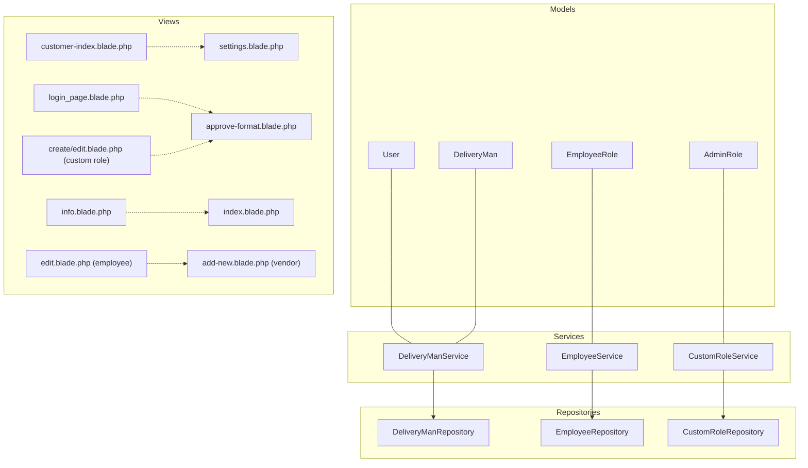

**Diagram sources**
- [User.php:19-279](file://app/Models/User.php#L19-L279)
- [DeliveryMan.php:13-234](file://app/Models/DeliveryMan.php#L13-L234)
- [AdminRole.php:21-82](file://app/Models/AdminRole.php#L21-L82)
- [EmployeeRole.php:9-39](file://app/Models/EmployeeRole.php#L9-L39)
- [DeliveryManService.php:9-92](file://app/Services/DeliveryManService.php#L9-L92)
- [EmployeeService.php:7-61](file://app/Services/EmployeeService.php#L7-L61)
- [CustomRoleService.php:10-32](file://app/Services/CustomRoleService.php#L10-L32)
- [DeliveryManRepository.php:15-208](file://app/Repositories/DeliveryManRepository.php#L15-L208)
- [EmployeeRepository.php:12-132](file://app/Repositories/EmployeeRepository.php#L12-L132)
- [CustomRoleRepository.php:12-87](file://app/Repositories/CustomRoleRepository.php#L12-L87)
- [customer-index.blade.php:1-32](file://resources/views/admin-views/business-settings/customer-index.blade.php#L1-L32)
- [settings.blade.php:1-41](file://resources/views/admin-views/customer/settings.blade.php#L1-L41)
- [login_page.blade.php:126-159](file://resources/views/admin-views/login-setup/login_page.blade.php#L126-L159)
- [info.blade.php:502-513](file://resources/views/admin-views/delivery-man/view/info.blade.php#L502-L513)
- [index.blade.php:1-36](file://resources/views/admin-views/delivery-man/index.blade.php#L1-L36)
- [edit.blade.php:63-81](file://resources/views/admin-views/employee/edit.blade.php#L63-L81)
- [add-new.blade.php:1-21](file://resources/views/vendor-views/employee/add-new.blade.php#L1-L21)
- [create.blade.php:323-353](file://resources/views/vendor-views/custom-role/create.blade.php#L323-L353)
- [edit.blade.php:354-366](file://resources/views/vendor-views/custom-role/edit.blade.php#L354-L366)
- [approve-format.blade.php:46-61](file://resources/views/admin-views/business-settings/email-format-setting/dm-email-formats/approve-format.blade.php#L46-L61)

**Section sources**
- [User.php:19-279](file://app/Models/User.php#L19-L279)
- [DeliveryMan.php:13-234](file://app/Models/DeliveryMan.php#L13-L234)
- [AdminRole.php:21-82](file://app/Models/AdminRole.php#L21-L82)
- [EmployeeRole.php:9-39](file://app/Models/EmployeeRole.php#L9-L39)
- [DeliveryManService.php:9-92](file://app/Services/DeliveryManService.php#L9-L92)
- [EmployeeService.php:7-61](file://app/Services/EmployeeService.php#L7-L61)
- [CustomRoleService.php:10-32](file://app/Services/CustomRoleService.php#L10-L32)
- [DeliveryManRepository.php:15-208](file://app/Repositories/DeliveryManRepository.php#L15-L208)
- [EmployeeRepository.php:12-132](file://app/Repositories/EmployeeRepository.php#L12-L132)
- [CustomRoleRepository.php:12-87](file://app/Repositories/CustomRoleRepository.php#L12-L87)
- [customer-index.blade.php:1-32](file://resources/views/admin-views/business-settings/customer-index.blade.php#L1-L32)
- [settings.blade.php:1-41](file://resources/views/admin-views/customer/settings.blade.php#L1-L41)
- [login_page.blade.php:126-159](file://resources/views/admin-views/login-setup/login_page.blade.php#L126-L159)
- [info.blade.php:502-513](file://resources/views/admin-views/delivery-man/view/info.blade.php#L502-L513)
- [index.blade.php:1-36](file://resources/views/admin-views/delivery-man/index.blade.php#L1-L36)
- [edit.blade.php:63-81](file://resources/views/admin-views/employee/edit.blade.php#L63-L81)
- [add-new.blade.php:1-21](file://resources/views/vendor-views/employee/add-new.blade.php#L1-L21)
- [create.blade.php:323-353](file://resources/views/vendor-views/custom-role/create.blade.php#L323-L353)
- [edit.blade.php:354-366](file://resources/views/vendor-views/custom-role/edit.blade.php#L354-L366)
- [approve-format.blade.php:46-61](file://resources/views/admin-views/business-settings/email-format-setting/dm-email-formats/approve-format.blade.php#L46-L61)

## Core Components
- User model: core customer entity with profile, status, verification flags, and XP-related relations
- DeliveryMan model: delivery personnel entity with availability, earnings, ratings, and performance metrics
- AdminRole and EmployeeRole models: role definitions with module permissions and localization
- Services:
  - DeliveryManService: prepares data for creation/update and manages identity/image uploads
  - EmployeeService: handles employee onboarding, image management, and password updates
  - CustomRoleService: builds role records and guards against modifying reserved roles
- Repositories:
  - DeliveryManRepository: search, filter, paginate, and fetch dropdown lists for delivery men
  - EmployeeRepository: search, filter, paginate, and export employee lists
  - CustomRoleRepository: CRUD for custom admin roles excluding reserved IDs
- Views:
  - Customer settings and business setup pages
  - Delivery man registration and info pages
  - Employee edit and vendor add-new pages
  - Custom role creation and editing pages
  - Email templates for delivery man approvals

**Section sources**
- [User.php:19-279](file://app/Models/User.php#L19-L279)
- [DeliveryMan.php:13-234](file://app/Models/DeliveryMan.php#L13-L234)
- [AdminRole.php:21-82](file://app/Models/AdminRole.php#L21-L82)
- [EmployeeRole.php:9-39](file://app/Models/EmployeeRole.php#L9-L39)
- [DeliveryManService.php:9-92](file://app/Services/DeliveryManService.php#L9-L92)
- [EmployeeService.php:7-61](file://app/Services/EmployeeService.php#L7-L61)
- [CustomRoleService.php:10-32](file://app/Services/CustomRoleService.php#L10-L32)
- [DeliveryManRepository.php:15-208](file://app/Repositories/DeliveryManRepository.php#L15-L208)
- [EmployeeRepository.php:12-132](file://app/Repositories/EmployeeRepository.php#L12-L132)
- [CustomRoleRepository.php:12-87](file://app/Repositories/CustomRoleRepository.php#L12-L87)
- [customer-index.blade.php:1-32](file://resources/views/admin-views/business-settings/customer-index.blade.php#L1-L32)
- [settings.blade.php:1-41](file://resources/views/admin-views/customer/settings.blade.php#L1-L41)
- [index.blade.php:1-36](file://resources/views/admin-views/delivery-man/index.blade.php#L1-L36)
- [info.blade.php:502-513](file://resources/views/admin-views/delivery-man/view/info.blade.php#L502-L513)
- [edit.blade.php:63-81](file://resources/views/admin-views/employee/edit.blade.php#L63-L81)
- [add-new.blade.php:1-21](file://resources/views/vendor-views/employee/add-new.blade.php#L1-L21)
- [create.blade.php:323-353](file://resources/views/vendor-views/custom-role/create.blade.php#L323-L353)
- [edit.blade.php:354-366](file://resources/views/vendor-views/custom-role/edit.blade.php#L354-L366)
- [approve-format.blade.php:46-61](file://resources/views/admin-views/business-settings/email-format-setting/dm-email-formats/approve-format.blade.php#L46-L61)

## Architecture Overview
The system follows a layered architecture:
- Presentation: Blade views for admin and vendor interfaces
- Application: Services orchestrate data preparation and updates
- Domain: Models define entities, scopes, and relationships
- Infrastructure: Repositories encapsulate persistence and queries

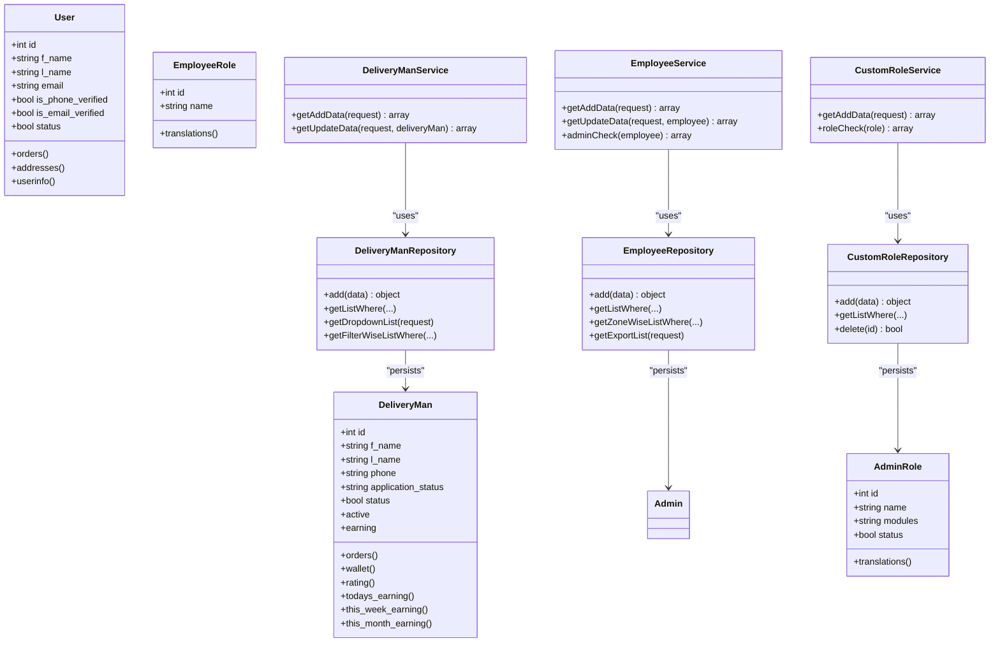

**Diagram sources**
- [User.php:19-279](file://app/Models/User.php#L19-L279)
- [DeliveryMan.php:13-234](file://app/Models/DeliveryMan.php#L13-L234)
- [AdminRole.php:21-82](file://app/Models/AdminRole.php#L21-L82)
- [EmployeeRole.php:9-39](file://app/Models/EmployeeRole.php#L9-L39)
- [DeliveryManService.php:9-92](file://app/Services/DeliveryManService.php#L9-L92)
- [EmployeeService.php:7-61](file://app/Services/EmployeeService.php#L7-L61)
- [CustomRoleService.php:10-32](file://app/Services/CustomRoleService.php#L10-L32)
- [DeliveryManRepository.php:15-208](file://app/Repositories/DeliveryManRepository.php#L15-L208)
- [EmployeeRepository.php:12-132](file://app/Repositories/EmployeeRepository.php#L12-L132)
- [CustomRoleRepository.php:12-87](file://app/Repositories/CustomRoleRepository.php#L12-L87)

## Detailed Component Analysis

### Customer Administration
Customer administration covers:
- Listing: filtered and paginated customer lists via repositories
- Profile management: customer profile relations and attributes
- Settings configuration: enabling/disabling features like wallet, verification, and preferences

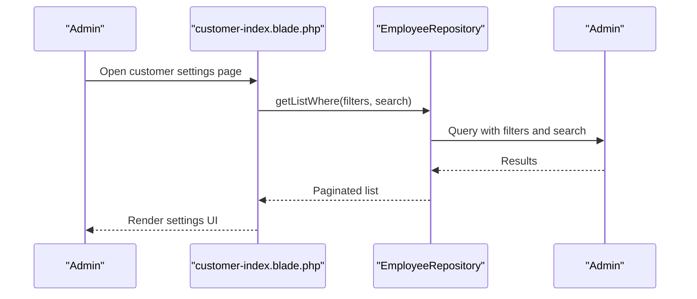

**Diagram sources**
- [customer-index.blade.php:1-32](file://resources/views/admin-views/business-settings/customer-index.blade.php#L1-L32)
- [EmployeeRepository.php:38-74](file://app/Repositories/EmployeeRepository.php#L38-L74)

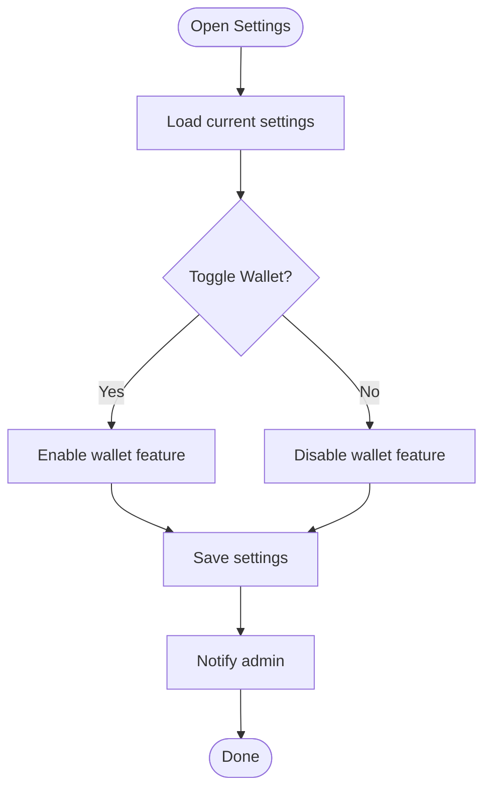

**Diagram sources**
- [settings.blade.php:24-41](file://resources/views/admin-views/customer/settings.blade.php#L24-L41)

**Section sources**
- [User.php:103-120](file://app/Models/User.php#L103-L120)
- [EmployeeRepository.php:38-74](file://app/Repositories/EmployeeRepository.php#L38-L74)
- [customer-index.blade.php:1-32](file://resources/views/admin-views/business-settings/customer-index.blade.php#L1-L32)
- [settings.blade.php:1-41](file://resources/views/admin-views/customer/settings.blade.php#L1-L41)
- [login_page.blade.php:126-159](file://resources/views/admin-views/login-setup/login_page.blade.php#L126-L159)

### Delivery Man Management
Delivery man management includes:
- Registration: form submission handled by views and service/repository
- Approval processes: application status transitions and notifications
- Performance tracking: earnings and order statistics

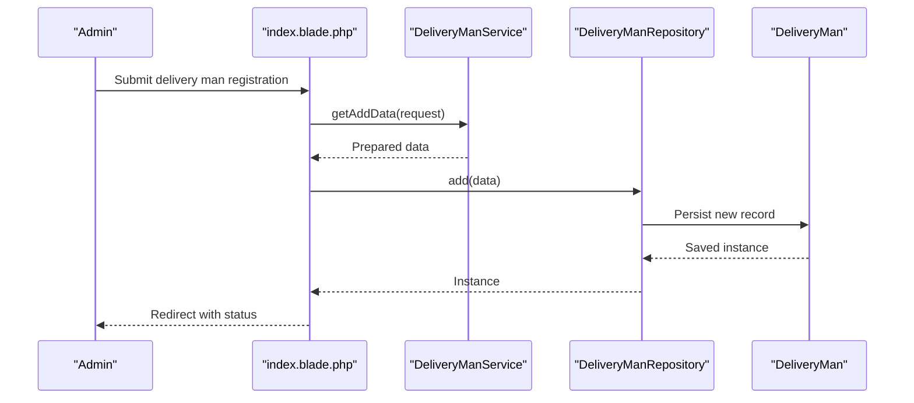

**Diagram sources**
- [index.blade.php:18-36](file://resources/views/admin-views/delivery-man/index.blade.php#L18-L36)
- [DeliveryManService.php:13-47](file://app/Services/DeliveryManService.php#L13-L47)
- [DeliveryManRepository.php:21-29](file://app/Repositories/DeliveryManRepository.php#L21-L29)

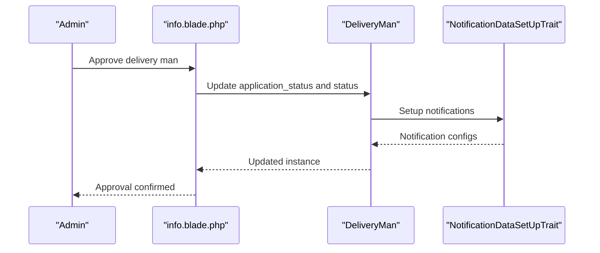

**Diagram sources**
- [info.blade.php:511-513](file://resources/views/admin-views/delivery-man/view/info.blade.php#L511-L513)
- [DeliveryMan.php:136-158](file://app/Models/DeliveryMan.php#L136-L158)
- [NotificationDataSetUpTrait.php:88-120](file://app/Traits/NotificationDataSetUpTrait.php#L88-L120)

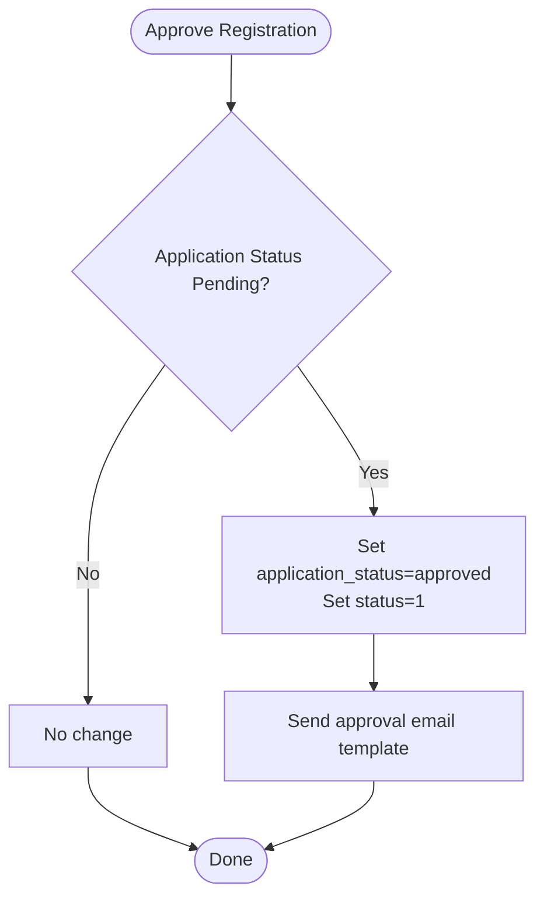

**Diagram sources**
- [DeliveryManService.php:49-89](file://app/Services/DeliveryManService.php#L49-L89)
- [approve-format.blade.php:46-61](file://resources/views/admin-views/business-settings/email-format-setting/dm-email-formats/approve-format.blade.php#L46-L61)

**Section sources**
- [DeliveryManService.php:13-89](file://app/Services/DeliveryManService.php#L13-L89)
- [DeliveryManRepository.php:41-204](file://app/Repositories/DeliveryManRepository.php#L41-L204)
- [DeliveryMan.php:136-158](file://app/Models/DeliveryMan.php#L136-L158)
- [index.blade.php:18-36](file://resources/views/admin-views/delivery-man/index.blade.php#L18-L36)
- [info.blade.php:511-513](file://resources/views/admin-views/delivery-man/view/info.blade.php#L511-L513)
- [approve-format.blade.php:46-61](file://resources/views/admin-views/business-settings/email-format-setting/dm-email-formats/approve-format.blade.php#L46-L61)
- [NotificationDataSetUpTrait.php:88-120](file://app/Traits/NotificationDataSetUpTrait.php#L88-L120)

### Employee Management
Employee management includes:
- Onboarding: vendor adds new employees with role assignment
- Role assignment: dropdown selection of roles
- Permission management: role modules define capabilities

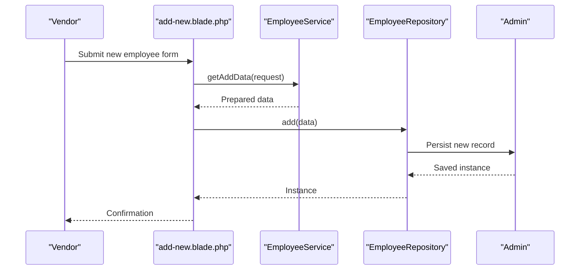

**Diagram sources**
- [add-new.blade.php:1-21](file://resources/views/vendor-views/employee/add-new.blade.php#L1-L21)
- [EmployeeService.php:11-25](file://app/Services/EmployeeService.php#L11-L25)
- [EmployeeRepository.php:18-26](file://app/Repositories/EmployeeRepository.php#L18-L26)

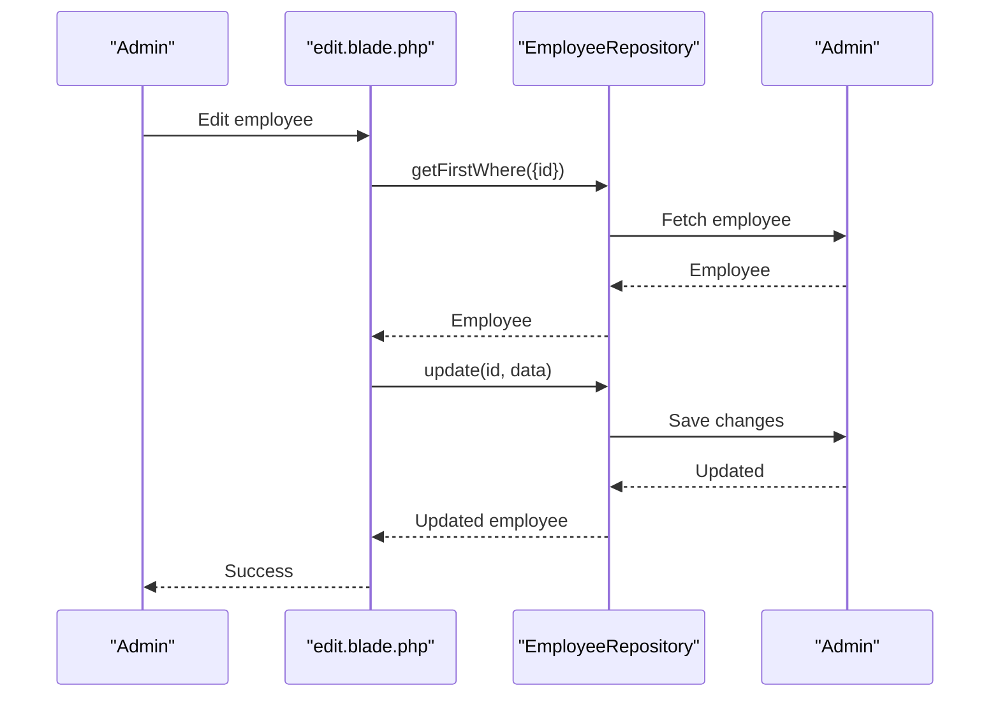

**Diagram sources**
- [edit.blade.php:63-81](file://resources/views/admin-views/employee/edit.blade.php#L63-L81)
- [EmployeeRepository.php:28-84](file://app/Repositories/EmployeeRepository.php#L28-L84)

**Section sources**
- [EmployeeService.php:11-61](file://app/Services/EmployeeService.php#L11-L61)
- [EmployeeRepository.php:18-132](file://app/Repositories/EmployeeRepository.php#L18-L132)
- [add-new.blade.php:1-21](file://resources/views/vendor-views/employee/add-new.blade.php#L1-L21)
- [edit.blade.php:63-81](file://resources/views/admin-views/employee/edit.blade.php#L63-L81)

### Role-Based Access Control
Role-based access control supports:
- Custom role creation: vendor-side creation and admin-side editing
- Permission configuration: module-based permissions stored in roles
- Access control implementation: route generation and role checks

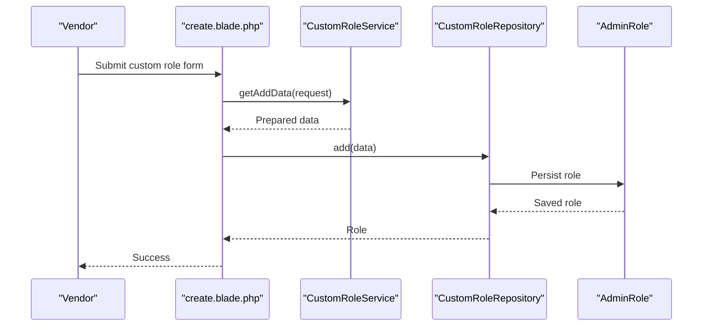

**Diagram sources**
- [create.blade.php:323-353](file://resources/views/vendor-views/custom-role/create.blade.php#L323-L353)
- [CustomRoleService.php:13-20](file://app/Services/CustomRoleService.php#L13-L20)
- [CustomRoleRepository.php:18-26](file://app/Repositories/CustomRoleRepository.php#L18-L26)

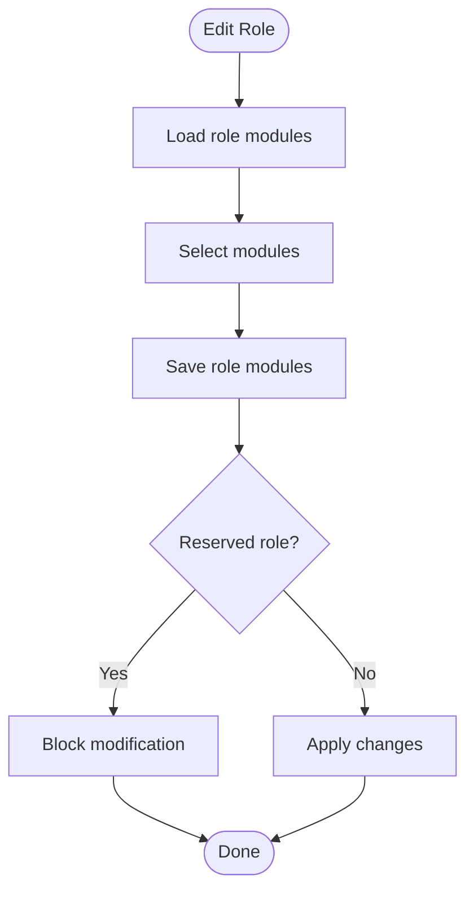

**Diagram sources**
- [edit.blade.php:159-174](file://resources/views/admin-views/custom-role/edit.blade.php#L159-L174)
- [edit.blade.php:354-366](file://resources/views/vendor-views/custom-role/edit.blade.php#L354-L366)
- [CustomRoleService.php:22-29](file://app/Services/CustomRoleService.php#L22-L29)

**Section sources**
- [CustomRoleService.php:13-32](file://app/Services/CustomRoleService.php#L13-L32)
- [CustomRoleRepository.php:18-86](file://app/Repositories/CustomRoleRepository.php#L18-L86)
- [create.blade.php:323-353](file://resources/views/vendor-views/custom-role/create.blade.php#L323-L353)
- [edit.blade.php:159-174](file://resources/views/admin-views/custom-role/edit.blade.php#L159-L174)
- [edit.blade.php:354-366](file://resources/views/vendor-views/custom-role/edit.blade.php#L354-L366)
- [GenerateAdminRoute.php:312-326](file://app/Console/Commands/GenerateAdminRoute.php#L312-L326)

## Dependency Analysis
- Models depend on scopes and relationships for filtering and reporting
- Services depend on traits for file management and prepare data for repositories
- Repositories encapsulate query logic and pagination
- Views depend on services for prepared data and repositories for persisted entities
- Traits centralize notification configurations for consistent behavior

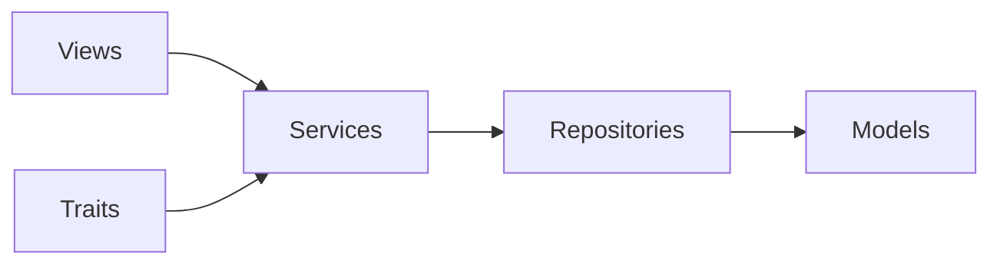

**Diagram sources**
- [DeliveryManService.php:9-92](file://app/Services/DeliveryManService.php#L9-L92)
- [EmployeeService.php:7-61](file://app/Services/EmployeeService.php#L7-L61)
- [CustomRoleService.php:10-32](file://app/Services/CustomRoleService.php#L10-L32)
- [DeliveryManRepository.php:15-208](file://app/Repositories/DeliveryManRepository.php#L15-L208)
- [EmployeeRepository.php:12-132](file://app/Repositories/EmployeeRepository.php#L12-L132)
- [CustomRoleRepository.php:12-87](file://app/Repositories/CustomRoleRepository.php#L12-L87)
- [NotificationDataSetUpTrait.php:88-120](file://app/Traits/NotificationDataSetUpTrait.php#L88-L120)

**Section sources**
- [DeliveryManRepository.php:15-208](file://app/Repositories/DeliveryManRepository.php#L15-L208)
- [EmployeeRepository.php:12-132](file://app/Repositories/EmployeeRepository.php#L12-L132)
- [CustomRoleRepository.php:12-87](file://app/Repositories/CustomRoleRepository.php#L12-L87)
- [NotificationDataSetUpTrait.php:88-120](file://app/Traits/NotificationDataSetUpTrait.php#L88-L120)

## Performance Considerations
- Use pagination for large lists (delivery men, employees) to reduce memory usage
- Apply scopes and indexed filters to limit query result sets
- Minimize N+1 queries by eager-loading relations in repositories
- Cache frequently accessed role/module configurations where appropriate

## Troubleshooting Guide
Common issues and resolutions:
- Delivery man image upload failures: verify file manager trait and disk configuration
- Role deletion blocked: reserved roles cannot be deleted; ensure ID checks pass
- Employee update resets tokens: password updates clear remember tokens; confirm intended behavior
- Approval notifications not sent: verify email template statuses and notification setup

**Section sources**
- [DeliveryManService.php:13-47](file://app/Services/DeliveryManService.php#L13-L47)
- [CustomRoleService.php:22-29](file://app/Services/CustomRoleService.php#L22-L29)
- [EmployeeService.php:28-34](file://app/Services/EmployeeService.php#L28-L34)
- [NotificationDataSetUpTrait.php:88-120](file://app/Traits/NotificationDataSetUpTrait.php#L88-L120)

## Conclusion
The user management system provides robust capabilities for customer administration, delivery man management, employee management, and role-based access control. It leverages services and repositories to separate concerns, models for data definitions, and views for intuitive admin and vendor experiences. Proper use of scopes, pagination, and notification setups ensures scalability and maintainability.

## Appendices
- Route generation for user management actions is centralized in command utilities
- Email templates support delivery man approval and related notifications

**Section sources**
- [GenerateAdminRoute.php:312-326](file://app/Console/Commands/GenerateAdminRoute.php#L312-L326)
- [approve-format.blade.php:46-61](file://resources/views/admin-views/business-settings/email-format-setting/dm-email-formats/approve-format.blade.php#L46-L61)