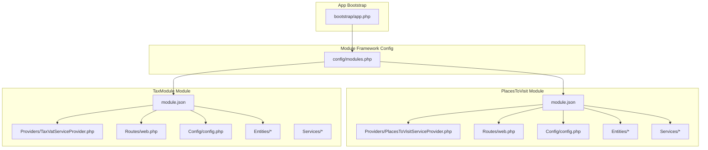
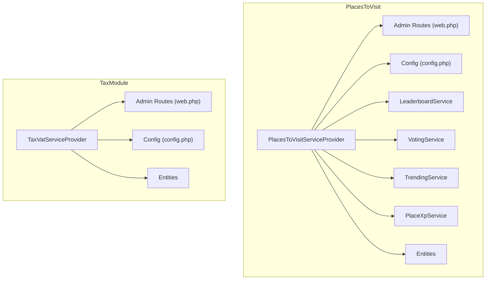
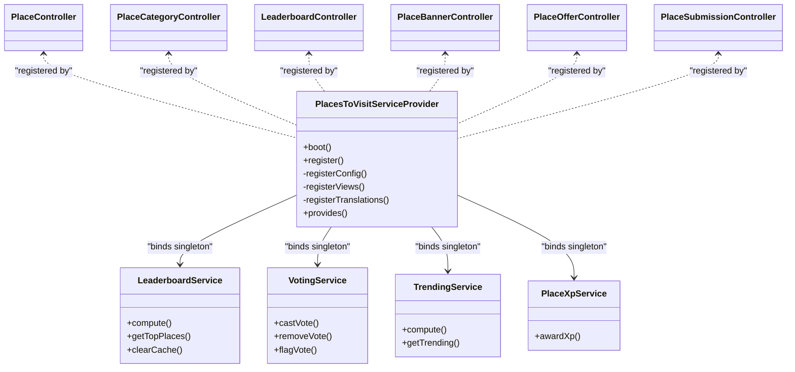
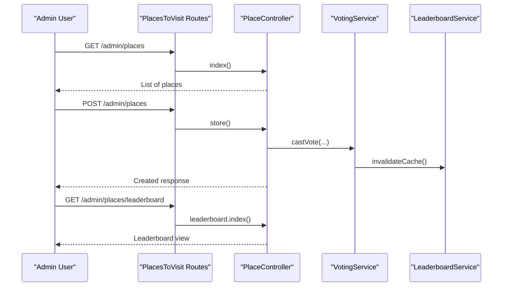
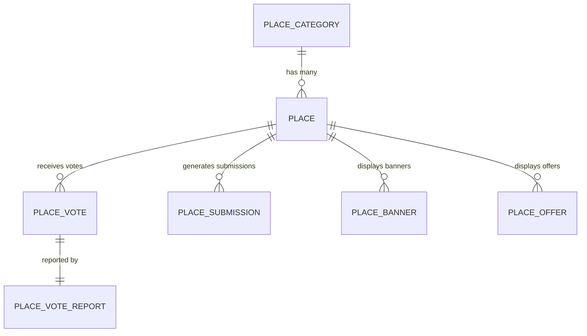
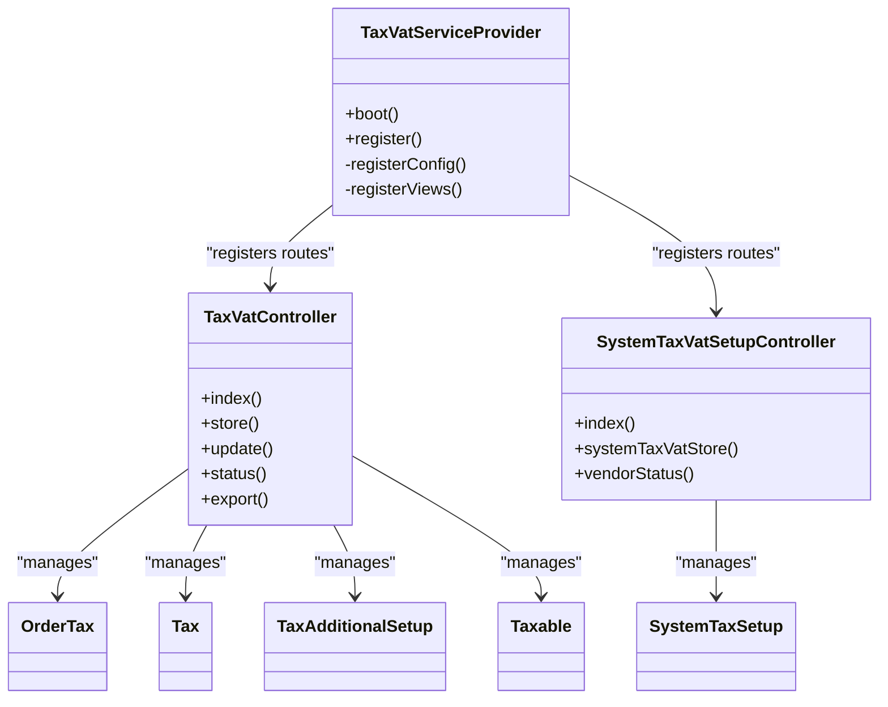
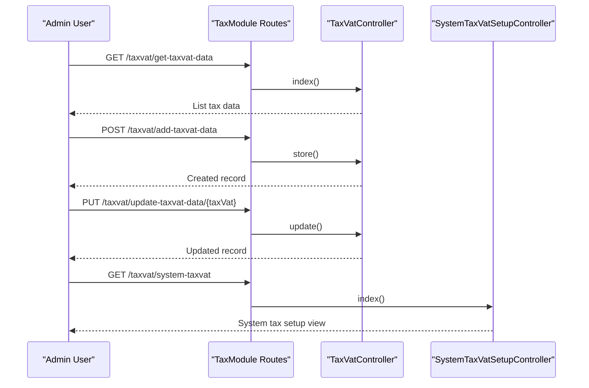
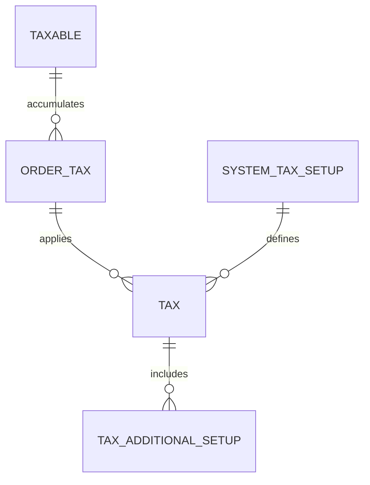
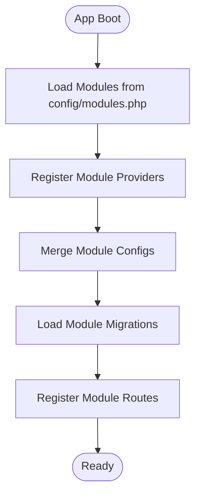
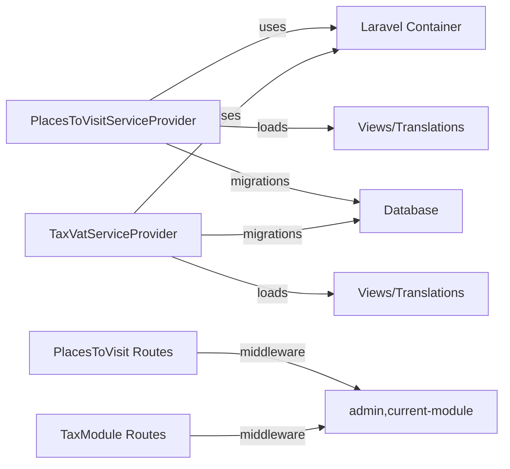

# Business Modules

<cite>
**Referenced Files in This Document**
- [module.json](file://Modules/PlacesToVisit/module.json)
- [module.json](file://Modules/TaxModule/module.json)
- [config.php](file://Modules/PlacesToVisit/Config/config.php)
- [config.php](file://Modules/TaxModule/Config/config.php)
- [web.php](file://Modules/PlacesToVisit/Routes/web.php)
- [web.php](file://Modules/TaxModule/Routes/web.php)
- [PlacesToVisitServiceProvider.php](file://Modules/PlacesToVisit/Providers/PlacesToVisitServiceProvider.php)
- [TaxVatServiceProvider.php](file://Modules/TaxModule/Providers/TaxVatServiceProvider.php)
- [modules.php](file://config/modules.php)
- [app.php](file://bootstrap/app.php)
- [Place.php](file://Modules/PlacesToVisit/Entities/Place.php)
- [PlaceCategory.php](file://Modules/PlacesToVisit/Entities/PlaceCategory.php)
- [PlaceVote.php](file://Modules/PlacesToVisit/Entities/PlaceVote.php)
- [PlaceVoteReport.php](file://Modules/PlacesToVisit/Entities/PlaceVoteReport.php)
- [PlaceSubmission.php](file://Modules/PlacesToVisit/Entities/PlaceSubmission.php)
- [PlaceBanner.php](file://Modules/PlacesToVisit/Entities/PlaceBanner.php)
- [PlaceOffer.php](file://Modules/PlacesToVisit/Entities/PlaceOffer.php)
- [OrderTax.php](file://Modules/TaxModule/Entities/OrderTax.php)
- [SystemTaxSetup.php](file://Modules/TaxModule/Entities/SystemTaxSetup.php)
- [Tax.php](file://Modules/TaxModule/Entities/Tax.php)
- [TaxAdditionalSetup.php](file://Modules/TaxModule/Entities/TaxAdditionalSetup.php)
- [Taxable.php](file://Modules/TaxModule/Entities/Taxable.php)
- [LeaderboardService.php](file://Modules/PlacesToVisit/Services/LeaderboardService.php)
- [TrendingService.php](file://Modules/PlacesToVisit/Services/TrendingService.php)
- [VotingService.php](file://Modules/PlacesToVisit/Services/VotingService.php)
- [PlaceXpService.php](file://Modules/PlacesToVisit/Services/PlaceXpService.php)
- [PlaceCategoryController.php](file://Modules/PlacesToVisit/Http/Controllers/Admin/PlaceCategoryController.php)
- [PlaceController.php](file://Modules/PlacesToVisit/Http/Controllers/Admin/PlaceController.php)
- [LeaderboardController.php](file://Modules/PlacesToVisit/Http/Controllers/Admin/LeaderboardController.php)
- [PlaceBannerController.php](file://Modules/PlacesToVisit/Http/Controllers/Admin/PlaceBannerController.php)
- [PlaceOfferController.php](file://Modules/PlacesToVisit/Http/Controllers/Admin/PlaceOfferController.php)
- [PlaceSubmissionController.php](file://Modules/PlacesToVisit/Http/Controllers/Admin/PlaceSubmissionController.php)
- [TaxVatController.php](file://Modules/TaxModule/Http/Controllers/TaxVatController.php)
- [SystemTaxVatSetupController.php](file://Modules/TaxModule/Http/Controllers/SystemTaxVatSetupController.php)
</cite>

## Table of Contents
1. [Introduction](#introduction)
2. [Project Structure](#project-structure)
3. [Core Components](#core-components)
4. [Architecture Overview](#architecture-overview)
5. [Detailed Component Analysis](#detailed-component-analysis)
6. [Dependency Analysis](#dependency-analysis)
7. [Performance Considerations](#performance-considerations)
8. [Troubleshooting Guide](#troubleshooting-guide)
9. [Conclusion](#conclusion)

## Introduction
This document describes the business module system powering Waddy Back, focusing on independent operational domains. Two primary modules are documented:
- PlacesToVisit: Location discovery, voting, leaderboard, banners, offers, and moderation
- TaxModule: VAT and tax calculation setup and management

The module system leverages Laravel’s ecosystem with a dedicated module framework. Each module encapsulates its own configuration, entities, services, routes, and providers, enabling independent activation, configuration, and extension while maintaining clear boundaries and data isolation.

## Project Structure
The module system is organized under the Modules directory, with each module containing:
- Config: Module-specific configuration files
- Database/Migrations: Schema and migration files
- Entities: Eloquent models representing domain data
- Http/Controllers: Controllers for module-specific routes
- Providers: Service providers registering routes, bindings, and resources
- Resources/views: Blade templates for views
- Routes: Route definitions scoped to the module
- Services: Business logic services
- composer.json and module.json: Composer metadata and module manifest

**Diagram sources**
- [app.php:1-62](file://bootstrap/app.php#L1-L62)
- [modules.php:1-278](file://config/modules.php#L1-L278)
- [module.json:1-17](file://Modules/PlacesToVisit/module.json#L1-L17)
- [module.json:1-14](file://Modules/TaxModule/module.json#L1-L14)
- [PlacesToVisitServiceProvider.php:1-88](file://Modules/PlacesToVisit/Providers/PlacesToVisitServiceProvider.php#L1-L88)
- [TaxVatServiceProvider.php:1-113](file://Modules/TaxModule/Providers/TaxVatServiceProvider.php#L1-L113)
- [web.php:1-81](file://Modules/PlacesToVisit/Routes/web.php#L1-L81)
- [web.php:1-27](file://Modules/TaxModule/Routes/web.php#L1-L27)

**Section sources**
- [modules.php:63-132](file://config/modules.php#L63-L132)
- [module.json:1-17](file://Modules/PlacesToVisit/module.json#L1-L17)
- [module.json:1-14](file://Modules/TaxModule/module.json#L1-L14)

## Core Components
This section outlines the essential building blocks of the module system and the two business modules.

- Module Manifests: Each module declares its identity, alias, providers, and dependencies via module.json.
- Service Providers: Modules register routes, views, translations, and database migrations through their providers.
- Configuration: Modules expose configuration arrays merged into the application’s config during boot.
- Routing: Modules define their own route groups with prefixes and middleware for admin and internal use.
- Entities: Domain models encapsulate data structures and relationships for each module.
- Services: Business logic is centralized in services, often registered as singletons for DI.

Examples of core files:
- PlacesToVisit module manifest and provider
- TaxModule module manifest and provider
- Module configuration files
- Module routes

**Section sources**
- [module.json:1-17](file://Modules/PlacesToVisit/module.json#L1-L17)
- [module.json:1-14](file://Modules/TaxModule/module.json#L1-L14)
- [PlacesToVisitServiceProvider.php:10-31](file://Modules/PlacesToVisit/Providers/PlacesToVisitServiceProvider.php#L10-L31)
- [TaxVatServiceProvider.php:8-41](file://Modules/TaxModule/Providers/TaxVatServiceProvider.php#L8-L41)
- [config.php:1-53](file://Modules/PlacesToVisit/Config/config.php#L1-L53)
- [config.php:1-11](file://Modules/TaxModule/Config/config.php#L1-L11)
- [web.php:1-81](file://Modules/PlacesToVisit/Routes/web.php#L1-L81)
- [web.php:1-27](file://Modules/TaxModule/Routes/web.php#L1-L27)

## Architecture Overview
The module architecture follows a layered pattern:
- Presentation Layer: Controllers handle HTTP requests and delegate to services
- Business Logic Layer: Services encapsulate domain-specific operations
- Data Access Layer: Entities (models) represent persisted data
- Infrastructure Layer: Providers manage registration, migrations, and view publishing

**Diagram sources**
- [PlacesToVisitServiceProvider.php:10-31](file://Modules/PlacesToVisit/Providers/PlacesToVisitServiceProvider.php#L10-L31)
- [TaxVatServiceProvider.php:8-41](file://Modules/TaxModule/Providers/TaxVatServiceProvider.php#L8-L41)
- [web.php:1-81](file://Modules/PlacesToVisit/Routes/web.php#L1-L81)
- [web.php:1-27](file://Modules/TaxModule/Routes/web.php#L1-L27)
- [config.php:1-53](file://Modules/PlacesToVisit/Config/config.php#L1-L53)
- [config.php:1-11](file://Modules/TaxModule/Config/config.php#L1-L11)

## Detailed Component Analysis

### PlacesToVisit Module
The PlacesToVisit module manages local place discovery with categories, places, voting, leaderboard, banners, offers, and submissions. It exposes administrative routes grouped under an admin prefix and integrates with middleware for access control.

Key characteristics:
- Module manifest defines the module name, alias, and provider
- Service provider registers routes, views, translations, and migrations
- Configuration defines leaderboard thresholds, trending windows, XP rewards, and submission limits
- Controllers handle CRUD operations for categories, places, leaderboard, banners, offers, and submissions
- Services encapsulate leaderboard computation, trending analytics, voting logic, and XP awarding

**Diagram sources**
- [PlacesToVisitServiceProvider.php:10-31](file://Modules/PlacesToVisit/Providers/PlacesToVisitServiceProvider.php#L10-L31)
- [LeaderboardService.php](file://Modules/PlacesToVisit/Services/LeaderboardService.php)
- [VotingService.php](file://Modules/PlacesToVisit/Services/VotingService.php)
- [TrendingService.php](file://Modules/PlacesToVisit/Services/TrendingService.php)
- [PlaceXpService.php](file://Modules/PlacesToVisit/Services/PlaceXpService.php)
- [PlaceController.php](file://Modules/PlacesToVisit/Http/Controllers/Admin/PlaceController.php)
- [PlaceCategoryController.php](file://Modules/PlacesToVisit/Http/Controllers/Admin/PlaceCategoryController.php)
- [LeaderboardController.php](file://Modules/PlacesToVisit/Http/Controllers/Admin/LeaderboardController.php)
- [PlaceBannerController.php](file://Modules/PlacesToVisit/Http/Controllers/Admin/PlaceBannerController.php)
- [PlaceOfferController.php](file://Modules/PlacesToVisit/Http/Controllers/Admin/PlaceOfferController.php)
- [PlaceSubmissionController.php](file://Modules/PlacesToVisit/Http/Controllers/Admin/PlaceSubmissionController.php)

Module configuration highlights:
- Leaderboard minimum votes, limit, and cache duration
- Trending window and limits
- Banners max featured count and allowed types
- XP reward tiers for activities
- Submission limits and image constraints

**Section sources**
- [module.json:1-17](file://Modules/PlacesToVisit/module.json#L1-L17)
- [PlacesToVisitServiceProvider.php:15-43](file://Modules/PlacesToVisit/Providers/PlacesToVisitServiceProvider.php#L15-L43)
- [config.php:6-52](file://Modules/PlacesToVisit/Config/config.php#L6-L52)
- [web.php:11-80](file://Modules/PlacesToVisit/Routes/web.php#L11-L80)

#### PlacesToVisit Routing and Middleware
Administrative routes are grouped with:
- Prefix: admin/places
- Aliases: admin.places.*
- Middleware: admin and current-module
- Namespaces: Admin controllers

**Diagram sources**
- [web.php:11-47](file://Modules/PlacesToVisit/Routes/web.php#L11-L47)
- [PlaceController.php](file://Modules/PlacesToVisit/Http/Controllers/Admin/PlaceController.php)
- [LeaderboardController.php](file://Modules/PlacesToVisit/Http/Controllers/Admin/LeaderboardController.php)
- [VotingService.php](file://Modules/PlacesToVisit/Services/VotingService.php)
- [LeaderboardService.php](file://Modules/PlacesToVisit/Services/LeaderboardService.php)

**Section sources**
- [web.php:11-80](file://Modules/PlacesToVisit/Routes/web.php#L11-L80)

#### PlacesToVisit Entities
Representative entities include:
- Place: core location entity
- PlaceCategory: categorization of places
- PlaceVote and PlaceVoteReport: voting and reporting
- PlaceSubmission: moderation queue
- PlaceBanner and PlaceOffer: promotional assets

**Diagram sources**
- [Place.php](file://Modules/PlacesToVisit/Entities/Place.php)
- [PlaceCategory.php](file://Modules/PlacesToVisit/Entities/PlaceCategory.php)
- [PlaceVote.php](file://Modules/PlacesToVisit/Entities/PlaceVote.php)
- [PlaceVoteReport.php](file://Modules/PlacesToVisit/Entities/PlaceVoteReport.php)
- [PlaceSubmission.php](file://Modules/PlacesToVisit/Entities/PlaceSubmission.php)
- [PlaceBanner.php](file://Modules/PlacesToVisit/Entities/PlaceBanner.php)
- [PlaceOffer.php](file://Modules/PlacesToVisit/Entities/PlaceOffer.php)

**Section sources**
- [Place.php](file://Modules/PlacesToVisit/Entities/Place.php)
- [PlaceCategory.php](file://Modules/PlacesToVisit/Entities/PlaceCategory.php)
- [PlaceVote.php](file://Modules/PlacesToVisit/Entities/PlaceVote.php)
- [PlaceVoteReport.php](file://Modules/PlacesToVisit/Entities/PlaceVoteReport.php)
- [PlaceSubmission.php](file://Modules/PlacesToVisit/Entities/PlaceSubmission.php)
- [PlaceBanner.php](file://Modules/PlacesToVisit/Entities/PlaceBanner.php)
- [PlaceOffer.php](file://Modules/PlacesToVisit/Entities/PlaceOffer.php)

### TaxModule
The TaxModule manages tax and VAT configuration, including system-wide tax setup and order-level tax records. It provides administrative endpoints for viewing, creating, updating, exporting, and toggling statuses.

Key characteristics:
- Module manifest defines provider and metadata
- Service provider registers routes, views, and migrations
- Configuration includes pagination, country type, and project/version metadata
- Controllers handle listing, creation, updates, exports, and status toggles
- Entities model tax configurations and order tax records

**Diagram sources**
- [TaxVatServiceProvider.php:8-41](file://Modules/TaxModule/Providers/TaxVatServiceProvider.php#L8-L41)
- [TaxVatController.php](file://Modules/TaxModule/Http/Controllers/TaxVatController.php)
- [SystemTaxVatSetupController.php](file://Modules/TaxModule/Http/Controllers/SystemTaxVatSetupController.php)
- [OrderTax.php](file://Modules/TaxModule/Entities/OrderTax.php)
- [SystemTaxSetup.php](file://Modules/TaxModule/Entities/SystemTaxSetup.php)
- [Tax.php](file://Modules/TaxModule/Entities/Tax.php)
- [TaxAdditionalSetup.php](file://Modules/TaxModule/Entities/TaxAdditionalSetup.php)
- [Taxable.php](file://Modules/TaxModule/Entities/Taxable.php)

Module configuration highlights:
- Pagination limit
- Country type configuration
- Project and version metadata

**Section sources**
- [module.json:1-14](file://Modules/TaxModule/module.json#L1-L14)
- [TaxVatServiceProvider.php:25-74](file://Modules/TaxModule/Providers/TaxVatServiceProvider.php#L25-L74)
- [config.php:3-10](file://Modules/TaxModule/Config/config.php#L3-L10)
- [web.php:16-26](file://Modules/TaxModule/Routes/web.php#L16-L26)

#### TaxModule Routing and Middleware
Administrative routes are grouped with:
- Prefix: taxvat
- Aliases: taxvat.*
- Middleware: admin and current-module

**Diagram sources**
- [web.php:16-26](file://Modules/TaxModule/Routes/web.php#L16-L26)
- [TaxVatController.php](file://Modules/TaxModule/Http/Controllers/TaxVatController.php)
- [SystemTaxVatSetupController.php](file://Modules/TaxModule/Http/Controllers/SystemTaxVatSetupController.php)

**Section sources**
- [web.php:16-26](file://Modules/TaxModule/Routes/web.php#L16-L26)

#### TaxModule Entities
Representative entities include:
- OrderTax: tax applied to orders
- SystemTaxSetup: global tax configuration
- Tax: tax definitions
- TaxAdditionalSetup: additional tax parameters
- Taxable: items or entities subject to tax

**Diagram sources**
- [OrderTax.php](file://Modules/TaxModule/Entities/OrderTax.php)
- [SystemTaxSetup.php](file://Modules/TaxModule/Entities/SystemTaxSetup.php)
- [Tax.php](file://Modules/TaxModule/Entities/Tax.php)
- [TaxAdditionalSetup.php](file://Modules/TaxModule/Entities/TaxAdditionalSetup.php)
- [Taxable.php](file://Modules/TaxModule/Entities/Taxable.php)

**Section sources**
- [OrderTax.php](file://Modules/TaxModule/Entities/OrderTax.php)
- [SystemTaxSetup.php](file://Modules/TaxModule/Entities/SystemTaxSetup.php)
- [Tax.php](file://Modules/TaxModule/Entities/Tax.php)
- [TaxAdditionalSetup.php](file://Modules/TaxModule/Entities/TaxAdditionalSetup.php)
- [Taxable.php](file://Modules/TaxModule/Entities/Taxable.php)

### Conceptual Overview
The module system enables independent business capabilities with clear separation of concerns:
- Each module defines its own routes, controllers, services, and entities
- Providers handle registration and lifecycle tasks
- Configuration is isolated per module and merged into the application
- Middleware ensures access control and contextual awareness

[No sources needed since this diagram shows conceptual workflow, not actual code structure]

## Dependency Analysis
Inter-module dependencies are minimal by design. Both modules rely on shared infrastructure:
- Laravel service container for dependency injection
- Shared middleware stack (admin, current-module)
- Common configuration and view publishing mechanisms

**Diagram sources**
- [PlacesToVisitServiceProvider.php:25-30](file://Modules/PlacesToVisit/Providers/PlacesToVisitServiceProvider.php#L25-L30)
- [TaxVatServiceProvider.php:40-41](file://Modules/TaxModule/Providers/TaxVatServiceProvider.php#L40-L41)
- [web.php](file://Modules/PlacesToVisit/Routes/web.php#L14)
- [web.php](file://Modules/TaxModule/Routes/web.php#L16)

**Section sources**
- [modules.php:267-277](file://config/modules.php#L267-L277)
- [web.php](file://Modules/PlacesToVisit/Routes/web.php#L14)
- [web.php](file://Modules/TaxModule/Routes/web.php#L16)

## Performance Considerations
- Caching: PlacesToVisit exposes leaderboard cache configuration; leverage it to reduce compute overhead for leaderboard queries.
- Pagination: TaxModule configuration includes a pagination limit; apply it consistently across listing endpoints.
- Migration and seed isolation: Keep module-specific migrations and seeders contained to avoid cross-module contention.
- Middleware overhead: Admin and current-module middleware add security but introduce processing; ensure middleware logic remains efficient.

[No sources needed since this section provides general guidance]

## Troubleshooting Guide
Common issues and resolutions:
- Module not loading: Verify module.json entries and provider namespaces; confirm module path and activation status.
- Routes inaccessible: Ensure routes are registered via providers and middleware stacks are correctly applied.
- Configuration not merging: Confirm publish and merge steps in providers; check config keys and aliases.
- View publishing: Use the provider’s view publishing mechanism to ensure views are discoverable.

**Section sources**
- [module.json:11-12](file://Modules/PlacesToVisit/module.json#L11-L12)
- [module.json:7-8](file://Modules/TaxModule/module.json#L7-L8)
- [PlacesToVisitServiceProvider.php:33-43](file://Modules/PlacesToVisit/Providers/PlacesToVisitServiceProvider.php#L33-L43)
- [TaxVatServiceProvider.php:48-56](file://Modules/TaxModule/Providers/TaxVatServiceProvider.php#L48-L56)
- [web.php](file://Modules/PlacesToVisit/Routes/web.php#L14)
- [web.php](file://Modules/TaxModule/Routes/web.php#L16)

## Conclusion
Waddy Back’s module system cleanly separates business domains into cohesive units. PlacesToVisit and TaxModule demonstrate independent functionality, clear routing, and robust configuration. By following the established patterns—manifests, providers, routes, services, and entities—you can extend existing modules or build new ones with predictable behavior, maintainable code, and strong data isolation.