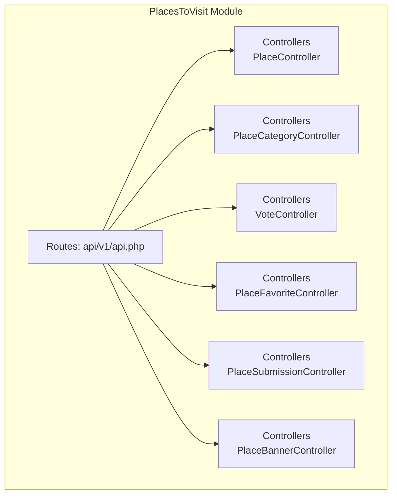
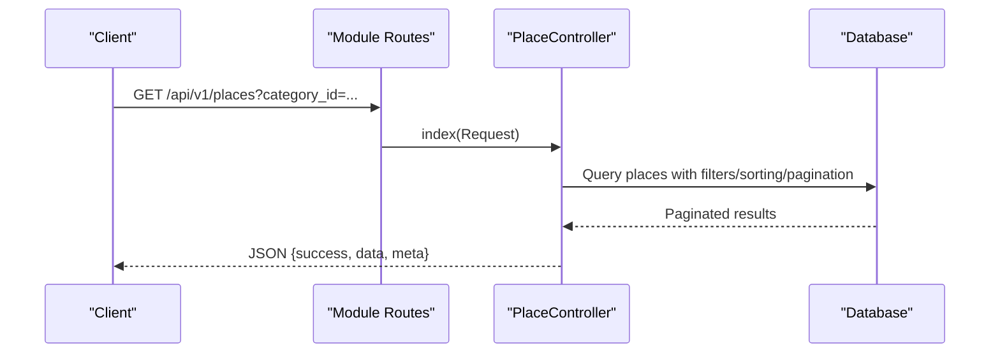
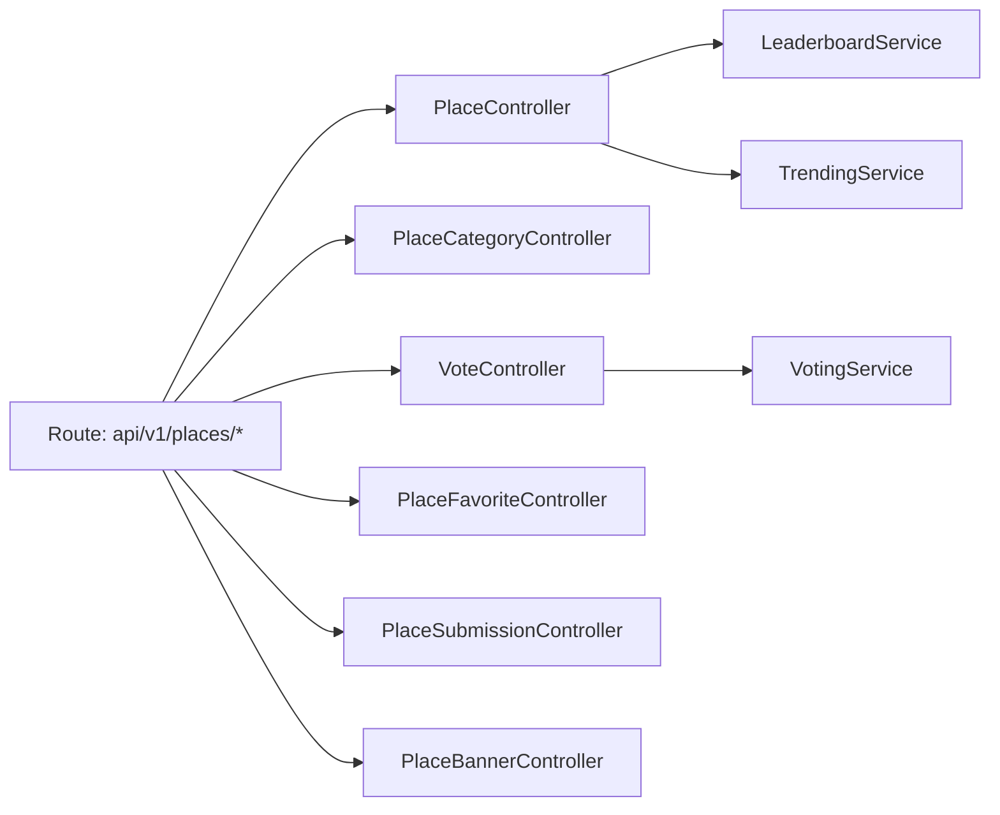

# API Endpoints and Integration

<cite>
**Referenced Files in This Document**
- [api.php](file://Modules/PlacesToVisit/Routes/api/v1/api.php)
- [PlaceController.php](file://Modules/PlacesToVisit/Http/Controllers/Api/PlaceController.php)
- [PlaceCategoryController.php](file://Modules/PlacesToVisit/Http/Controllers/Api/PlaceCategoryController.php)
- [VoteController.php](file://Modules/PlacesToVisit/Http/Controllers/Api/VoteController.php)
- [PlaceFavoriteController.php](file://Modules/PlacesToVisit/Http/Controllers/Api/PlaceFavoriteController.php)
- [PlaceSubmissionController.php](file://Modules/PlacesToVisit/Http/Controllers/Api/PlaceSubmissionController.php)
- [PlaceBannerController.php](file://Modules/PlacesToVisit/Http/Controllers/Api/PlaceBannerController.php)
- [config.php](file://Modules/PlacesToVisit/Config/config.php)
- [Authenticate.php](file://app/Http/Middleware/Authenticate.php)
- [web.php](file://routes/web.php)
</cite>

## Table of Contents
1. [Introduction](#introduction)
2. [Project Structure](#project-structure)
3. [Core Components](#core-components)
4. [Architecture Overview](#architecture-overview)
5. [Detailed Component Analysis](#detailed-component-analysis)
6. [Dependency Analysis](#dependency-analysis)
7. [Performance Considerations](#performance-considerations)
8. [Troubleshooting Guide](#troubleshooting-guide)
9. [Conclusion](#conclusion)
10. [Appendices](#appendices)

## Introduction
This document provides comprehensive API documentation for the PlacesToVisit module. It covers all RESTful endpoints for places, categories, votes, banners, favorites, and submissions, including request/response schemas, authentication requirements, error handling patterns, pagination, filtering, and search capabilities. Practical examples are included for mobile applications, web clients, and third-party integrations. Security considerations, rate limiting, and API versioning strategies are also addressed.

## Project Structure
The PlacesToVisit module exposes a dedicated API namespace under the module’s routes. The routes are grouped under the prefix /api/v1/places and further segmented into public and protected endpoints gated by an API authentication middleware.

**Diagram sources**
- [api.php:11-50](file://Modules/PlacesToVisit/Routes/api/v1/api.php#L11-L50)
- [PlaceController.php:12-237](file://Modules/PlacesToVisit/Http/Controllers/Api/PlaceController.php#L12-L237)
- [PlaceCategoryController.php:10-85](file://Modules/PlacesToVisit/Http/Controllers/Api/PlaceCategoryController.php#L10-L85)
- [VoteController.php:13-148](file://Modules/PlacesToVisit/Http/Controllers/Api/VoteController.php#L13-L148)
- [PlaceFavoriteController.php:11-157](file://Modules/PlacesToVisit/Http/Controllers/Api/PlaceFavoriteController.php#L11-L157)
- [PlaceSubmissionController.php:12-141](file://Modules/PlacesToVisit/Http/Controllers/Api/PlaceSubmissionController.php#L12-L141)
- [PlaceBannerController.php:10-80](file://Modules/PlacesToVisit/Http/Controllers/Api/PlaceBannerController.php#L10-L80)

**Section sources**
- [api.php:11-50](file://Modules/PlacesToVisit/Routes/api/v1/api.php#L11-L50)

## Core Components
- Authentication: Protected endpoints require API authentication via the auth:api middleware. Unauthenticated API requests receive a JSON error response.
- Pagination: All paginated endpoints return items plus meta fields for current_page, last_page, per_page, and total.
- Filtering and Search: Places support category, zone, tag, proximity (latitude/longitude/radius), and text search across translations.
- Sorting: Places support sorting by newest, votes, rating, featured, and distance (when proximity filtering is applied).
- Zones: Banners endpoint supports zone scoping via a zoneId header or query parameter.

**Section sources**
- [Authenticate.php:15-19](file://app/Http/Middleware/Authenticate.php#L15-L19)
- [web.php:61-67](file://routes/web.php#L61-L67)
- [PlaceController.php:23-91](file://Modules/PlacesToVisit/Http/Controllers/Api/PlaceController.php#L23-L91)
- [PlaceBannerController.php:16-44](file://Modules/PlacesToVisit/Http/Controllers/Api/PlaceBannerController.php#L16-L44)

## Architecture Overview
The API follows a layered architecture:
- Routes define endpoint groups and apply middleware.
- Controllers handle request parsing, validation, and orchestrate service/domain logic.
- Entities encapsulate domain data and relationships.
- Configuration defines limits, thresholds, and feature toggles.

**Diagram sources**
- [api.php:18-21](file://Modules/PlacesToVisit/Routes/api/v1/api.php#L18-L21)
- [PlaceController.php:23-91](file://Modules/PlacesToVisit/Http/Controllers/Api/PlaceController.php#L23-L91)

## Detailed Component Analysis

### Authentication and Error Handling
- Protected endpoints: Apply auth:api middleware. Unauthenticated requests return a JSON error with a 401 HTTP status.
- Authentication failure route: Named route returns a structured error payload.

**Section sources**
- [api.php:32-49](file://Modules/PlacesToVisit/Routes/api/v1/api.php#L32-L49)
- [Authenticate.php:15-19](file://app/Http/Middleware/Authenticate.php#L15-L19)
- [web.php:61-67](file://routes/web.php#L61-L67)

### Places Endpoints

#### GET /api/v1/places
- Purpose: List places with filters, sorting, and pagination.
- Query parameters:
  - category_id: integer
  - zone_id: integer
  - featured: boolean-like
  - tag_ids: comma-separated integers or array
  - latitude: float, longitude: float, radius: float (optional, default 10)
  - search: string (title/description)
  - sort_by: "newest" | "votes" | "rating" | "featured" | "distance"
  - per_page: integer (default 15)
- Response:
  - success: boolean
  - data: array of places with appended fields:
    - is_favorited: boolean
    - is_open_now: boolean
  - meta: pagination metadata
- Notes:
  - Distance sorting is implicit when latitude/longitude are provided.
  - Tag filtering accepts either a comma-separated string or an array.

**Section sources**
- [api.php](file://Modules/PlacesToVisit/Routes/api/v1/api.php#L18)
- [PlaceController.php:23-91](file://Modules/PlacesToVisit/Http/Controllers/Api/PlaceController.php#L23-L91)

#### GET /api/v1/places/{id}
- Purpose: Retrieve place details with related data, stats, recent reviews, and user-specific flags.
- Path parameter: place (resolved model)
- Response:
  - success: boolean
  - data: object containing:
    - id, title, description, image, images, coordinates, address, phone, website, instagram, opening_hours
    - is_open_now, is_featured
    - is_favorited (only if authenticated)
    - favorites_count
    - category, zone, tags, offers
    - stats: votes_count, avg_rating, period
    - reviews: up to 10 latest non-flagged reviews with user info
    - user_vote: current user’s vote for the period (if exists)
- Error:
  - 404 if place is inactive/not found.

**Section sources**
- [api.php](file://Modules/PlacesToVisit/Routes/api/v1/api.php#L27)
- [PlaceController.php:97-179](file://Modules/PlacesToVisit/Http/Controllers/Api/PlaceController.php#L97-L179)

#### GET /api/v1/places/leaderboard
- Purpose: Top places by votes for a given period.
- Query parameters:
  - period: string "YYYY-MM" (default current month)
  - category_id: integer (optional)
  - zone_id: integer (optional)
  - limit: integer (optional)
- Response:
  - success: boolean
  - period: string
  - current_period: string
  - data: array of top places

**Section sources**
- [api.php](file://Modules/PlacesToVisit/Routes/api/v1/api.php#L19)
- [PlaceController.php:185-200](file://Modules/PlacesToVisit/Http/Controllers/Api/PlaceController.php#L185-L200)

#### GET /api/v1/places/top-voters
- Purpose: Top voters (chillers) for a given period.
- Query parameters:
  - period: string "YYYY-MM" (default current month)
  - zone_id: integer (optional)
  - limit: integer (default 3)
- Response:
  - success: boolean
  - period: string
  - data: array of top voters

**Section sources**
- [api.php](file://Modules/PlacesToVisit/Routes/api/v1/api.php#L20)
- [PlaceController.php:206-219](file://Modules/PlacesToVisit/Http/Controllers/Api/PlaceController.php#L206-L219)

#### GET /api/v1/places/trending
- Purpose: Trending or rising places based on recent activity.
- Query parameters:
  - category_id: integer (optional)
- Response:
  - success: boolean
  - data: array of trending items

**Section sources**
- [api.php](file://Modules/PlacesToVisit/Routes/api/v1/api.php#L21)
- [PlaceController.php:225-235](file://Modules/PlacesToVisit/Http/Controllers/Api/PlaceController.php#L225-L235)

### Categories Endpoints

#### GET /api/v1/places/categories
- Purpose: List all active categories with place counts.
- Response:
  - success: boolean
  - data: array of categories with id, localized name, image, priority, places_count

**Section sources**
- [api.php](file://Modules/PlacesToVisit/Routes/api/v1/api.php#L15)
- [PlaceCategoryController.php:16-35](file://Modules/PlacesToVisit/Http/Controllers/Api/PlaceCategoryController.php#L16-L35)

#### GET /api/v1/places/categories/{id}
- Purpose: Retrieve a single category and its active places.
- Path parameter: category (resolved model)
- Response:
  - success: boolean
  - data: object with id, localized name, image, and places array
- Error:
  - 404 if category is inactive/not found.

**Section sources**
- [api.php](file://Modules/PlacesToVisit/Routes/api/v1/api.php#L16)
- [PlaceCategoryController.php:41-63](file://Modules/PlacesToVisit/Http/Controllers/Api/PlaceCategoryController.php#L41-L63)

#### GET /api/v1/places/tags
- Purpose: List all active tags with icons.
- Response:
  - success: boolean
  - data: array of tags with id, localized name, icon

**Section sources**
- [api.php](file://Modules/PlacesToVisit/Routes/api/v1/api.php#L17)
- [PlaceCategoryController.php:69-83](file://Modules/PlacesToVisit/Http/Controllers/Api/PlaceCategoryController.php#L69-L83)

### Banners Endpoints

#### GET /api/v1/places/banners
- Purpose: List active, valid banners optionally filtered by zone and featured flag.
- Query parameters:
  - zone_id: integer (optional)
  - featured: boolean-like (optional)
- Headers:
  - zoneId: integer (alternative to query param)
- Response:
  - success: boolean
  - data: array of banners with id, localized title/description, image, type, data, external_link, is_featured

**Section sources**
- [api.php](file://Modules/PlacesToVisit/Routes/api/v1/api.php#L24)
- [PlaceBannerController.php:16-44](file://Modules/PlacesToVisit/Http/Controllers/Api/PlaceBannerController.php#L16-L44)

#### GET /api/v1/places/banners/featured
- Purpose: Get a small set of featured banners scoped by zone.
- Query parameters:
  - zone_id: integer (optional)
- Headers:
  - zoneId: integer (alternative to query param)
- Response:
  - success: boolean
  - data: array of featured banners

**Section sources**
- [api.php](file://Modules/PlacesToVisit/Routes/api/v1/api.php#L25)
- [PlaceBannerController.php:50-78](file://Modules/PlacesToVisit/Http/Controllers/Api/PlaceBannerController.php#L50-L78)

### Votes and Reviews Endpoints

#### POST /api/v1/places/{id}/vote
- Purpose: Submit or update a vote with optional rating, review text, and photo.
- Path parameter: place (resolved model)
- Form fields:
  - rating: integer 1–5 (optional)
  - review: string up to 1000 chars (optional)
  - image: file jpeg/png/jpg up to configured max size (optional)
- Response:
  - success: boolean
  - message: string
  - action: string (contextual, e.g., created/updated)
- Validation:
  - Returns 422 on validation failure.
- Errors:
  - 404 if place is inactive/not found.

**Section sources**
- [api.php](file://Modules/PlacesToVisit/Routes/api/v1/api.php#L34)
- [VoteController.php:23-56](file://Modules/PlacesToVisit/Http/Controllers/Api/VoteController.php#L23-L56)

#### DELETE /api/v1/places/{id}/vote
- Purpose: Remove a user’s vote.
- Path parameter: place (resolved model)
- Response:
  - success: boolean
  - message: string
- Errors:
  - 404 if no vote exists to delete.

**Section sources**
- [api.php](file://Modules/PlacesToVisit/Routes/api/v1/api.php#L35)
- [VoteController.php:62-73](file://Modules/PlacesToVisit/Http/Controllers/Api/VoteController.php#L62-L73)

#### GET /api/v1/places/{id}/vote-status
- Purpose: Check whether the current user has voted and fetch the vote details for the period.
- Path parameter: place (resolved model)
- Response:
  - success: boolean
  - has_voted: boolean
  - vote: object with rating, review, image URL, created_at (if exists)
  - period: string

**Section sources**
- [api.php](file://Modules/PlacesToVisit/Routes/api/v1/api.php#L36)
- [VoteController.php:79-95](file://Modules/PlacesToVisit/Http/Controllers/Api/VoteController.php#L79-L95)

#### POST /api/v1/places/votes/{vote}/report
- Purpose: Report/flag a review for moderation.
- Path parameter: voteId (integer)
- Form fields:
  - reason: string up to 500 chars (optional)
- Response:
  - success: boolean
  - message: string
- Errors:
  - 404 if review not found
  - 422 for validation errors

**Section sources**
- [api.php](file://Modules/PlacesToVisit/Routes/api/v1/api.php#L37)
- [VoteController.php:101-117](file://Modules/PlacesToVisit/Http/Controllers/Api/VoteController.php#L101-L117)

#### GET /api/v1/places/{id}/reviews
- Purpose: List reviews for a place with pagination.
- Path parameter: place (resolved model)
- Query parameters:
  - period: string "YYYY-MM" (default current month)
  - per_page: integer (default 15)
- Response:
  - success: boolean
  - period: string
  - data: array of reviews with user info
  - meta: pagination metadata

**Section sources**
- [api.php](file://Modules/PlacesToVisit/Routes/api/v1/api.php#L28)
- [VoteController.php:123-146](file://Modules/PlacesToVisit/Http/Controllers/Api/VoteController.php#L123-L146)

### Favorites Endpoints

#### GET /api/v1/places/favorites/my
- Purpose: List authenticated user’s favorite places with stats.
- Query parameters:
  - per_page: integer (default 15)
- Response:
  - success: boolean
  - data: array of favorites with place summary and stats
  - meta: pagination metadata

**Section sources**
- [api.php](file://Modules/PlacesToVisit/Routes/api/v1/api.php#L40)
- [PlaceFavoriteController.php:17-59](file://Modules/PlacesToVisit/Http/Controllers/Api/PlaceFavoriteController.php#L17-L59)

#### POST /api/v1/places/{id}/favorite
- Purpose: Add a place to favorites.
- Path parameter: place (resolved model)
- Response:
  - success: boolean
  - message: string
- Errors:
  - 404 if place is inactive/not found
  - 422 if already favorited

**Section sources**
- [api.php](file://Modules/PlacesToVisit/Routes/api/v1/api.php#L41)
- [PlaceFavoriteController.php:65-97](file://Modules/PlacesToVisit/Http/Controllers/Api/PlaceFavoriteController.php#L65-L97)

#### DELETE /api/v1/places/{id}/favorite
- Purpose: Remove a place from favorites.
- Path parameter: place (resolved model)
- Response:
  - success: boolean
  - message: string
- Errors:
  - 404 if not found in favorites

**Section sources**
- [api.php](file://Modules/PlacesToVisit/Routes/api/v1/api.php#L42)
- [PlaceFavoriteController.php:103-115](file://Modules/PlacesToVisit/Http/Controllers/Api/PlaceFavoriteController.php#L103-L115)

#### POST /api/v1/places/{id}/toggle-favorite
- Purpose: Toggle favorite status.
- Path parameter: place (resolved model)
- Response:
  - success: boolean
  - is_favorited: boolean
  - message: string
- Errors:
  - 404 if place is inactive/not found

**Section sources**
- [api.php](file://Modules/PlacesToVisit/Routes/api/v1/api.php#L43)
- [PlaceFavoriteController.php:121-155](file://Modules/PlacesToVisit/Http/Controllers/Api/PlaceFavoriteController.php#L121-L155)

### Submissions Endpoints

#### GET /api/v1/places/submissions/my
- Purpose: List authenticated user’s place submissions.
- Query parameters:
  - per_page: integer (default 15)
- Response:
  - success: boolean
  - data: array of submissions with category name, location, status, timestamps
  - meta: pagination metadata

**Section sources**
- [api.php](file://Modules/PlacesToVisit/Routes/api/v1/api.php#L46)
- [PlaceSubmissionController.php:18-47](file://Modules/PlacesToVisit/Http/Controllers/Api/PlaceSubmissionController.php#L18-L47)

#### POST /api/v1/places/submissions
- Purpose: Submit a new place suggestion.
- Form fields:
  - title: string up to 200 chars (required)
  - description: string up to 2000 chars (optional)
  - category_id: integer (optional, must exist)
  - latitude: numeric between -90 and 90 (required)
  - longitude: numeric between -180 and 180 (required)
  - address: string up to 500 chars (optional)
  - phone: string up to 30 chars (optional)
  - image: file jpeg/png/jpg up to configured max size (optional)
- Limits:
  - Enforced by configuration: maximum pending submissions per user.
- Response:
  - success: boolean
  - message: string
  - data: object with id and status
- Errors:
  - 422 if validation fails or pending limit reached

**Section sources**
- [api.php](file://Modules/PlacesToVisit/Routes/api/v1/api.php#L47)
- [PlaceSubmissionController.php:53-105](file://Modules/PlacesToVisit/Http/Controllers/Api/PlaceSubmissionController.php#L53-L105)

#### GET /api/v1/places/submissions/{id}
- Purpose: Retrieve a submission detail (own submissions only).
- Path parameter: submission (resolved model)
- Response:
  - success: boolean
  - data: object with submission details including admin note and approved place id
- Errors:
  - 403 if not owned by the user

**Section sources**
- [api.php](file://Modules/PlacesToVisit/Routes/api/v1/api.php#L48)
- [PlaceSubmissionController.php:111-139](file://Modules/PlacesToVisit/Http/Controllers/Api/PlaceSubmissionController.php#L111-L139)

### Request/Response Schemas

- Base response envelope:
  - success: boolean
  - data: object or array (varies by endpoint)
  - meta: object (pagination fields; present on paginated endpoints)
- Authentication failure:
  - errors: array of error objects with code and message
  - status: 401

**Section sources**
- [PlaceController.php:81-90](file://Modules/PlacesToVisit/Http/Controllers/Api/PlaceController.php#L81-L90)
- [PlaceFavoriteController.php:49-58](file://Modules/PlacesToVisit/Http/Controllers/Api/PlaceFavoriteController.php#L49-L58)
- [web.php:61-67](file://routes/web.php#L61-L67)

### Filtering, Pagination, and Search

- Places filtering and sorting:
  - Filters: category_id, zone_id, featured, tag_ids, latitude/longitude/radius, search text.
  - Sorting: newest, votes, rating, featured, distance.
- Pagination:
  - per_page controls page size; defaults vary by endpoint.
- Search:
  - Text search across localized title and description.
- Proximity:
  - When latitude/longitude are provided, results are ordered by distance.

**Section sources**
- [PlaceController.php:40-69](file://Modules/PlacesToVisit/Http/Controllers/Api/PlaceController.php#L40-L69)

### Rate Limiting and Security Considerations
- Rate limiting:
  - Other API routes in the application demonstrate throttle middleware usage (example: orders streaming endpoint). Apply similar patterns to high-volume endpoints as needed.
- Security:
  - Use HTTPS in production.
  - Validate and sanitize all inputs.
  - Respect user permissions (e.g., submission visibility).
  - Respect rate limits and implement client-side retry/backoff.

[No sources needed since this section provides general guidance]

### API Versioning Strategy
- The module’s routes are prefixed with /api/v1/places, indicating a versioned API surface.
- Maintain backward compatibility by introducing new endpoints under new versions rather than modifying existing ones.

**Section sources**
- [api.php](file://Modules/PlacesToVisit/Routes/api/v1/api.php#L11)

### Integration Guides

- Mobile Applications:
  - Authentication: Include the API authentication token in the Authorization header for protected endpoints.
  - Favorites: Use toggle endpoint to simplify UI state management.
  - Banners: Use zoneId header or query parameter to scope banners to the user’s zone.
  - Submissions: Enforce client-side pending limit checks before allowing new submissions.
- Web Clients:
  - Use the same base URL and headers. Implement pagination UI with meta fields.
  - For reviews, paginate with per_page and period parameters to align with monthly periods.
- Third-Party Integrations:
  - Use the categories/tags endpoints to pre-load taxonomy data.
  - Implement robust error handling for 401 (unauthenticated), 404 (not found), and 422 (validation) responses.

[No sources needed since this section provides general guidance]

## Dependency Analysis

**Diagram sources**
- [api.php:11-50](file://Modules/PlacesToVisit/Routes/api/v1/api.php#L11-L50)
- [PlaceController.php:14-17](file://Modules/PlacesToVisit/Http/Controllers/Api/PlaceController.php#L14-L17)
- [VoteController.php:15-17](file://Modules/PlacesToVisit/Http/Controllers/Api/VoteController.php#L15-L17)

**Section sources**
- [PlaceController.php:14-17](file://Modules/PlacesToVisit/Http/Controllers/Api/PlaceController.php#L14-L17)
- [VoteController.php:15-17](file://Modules/PlacesToVisit/Http/Controllers/Api/VoteController.php#L15-L17)

## Performance Considerations
- Pagination: Always use per_page to avoid large payloads.
- Selective loading: Controllers already eager-load related data; avoid additional N+1 queries by reusing these relations.
- Proximity queries: Limit radius and consider indexing spatial data if extending to raw SQL.
- Caching: Configuration includes caching durations for leaderboard and trending; leverage cache keys and invalidation strategies.

[No sources needed since this section provides general guidance]

## Troubleshooting Guide
- Authentication failures:
  - Symptom: 401 with structured errors.
  - Resolution: Ensure a valid API token is provided and the user is authenticated.
- Not found errors:
  - Symptom: 404 for places, categories, or reviews.
  - Resolution: Verify resource existence and active status.
- Validation errors:
  - Symptom: 422 with field-specific issues.
  - Resolution: Correct input according to endpoint constraints (e.g., image sizes, numeric ranges).
- Submission limits:
  - Symptom: 422 when submitting new suggestions.
  - Resolution: Respect the configured maximum pending submissions per user.

**Section sources**
- [web.php:61-67](file://routes/web.php#L61-L67)
- [PlaceController.php:99-104](file://Modules/PlacesToVisit/Http/Controllers/Api/PlaceController.php#L99-L104)
- [PlaceCategoryController.php:43-48](file://Modules/PlacesToVisit/Http/Controllers/Api/PlaceCategoryController.php#L43-L48)
- [PlaceSubmissionController.php:72-77](file://Modules/PlacesToVisit/Http/Controllers/Api/PlaceSubmissionController.php#L72-L77)

## Conclusion
The PlacesToVisit module exposes a well-structured, versioned API with clear separation between public and protected endpoints. It supports robust filtering, pagination, and user-centric features such as favorites, voting, and submissions. By following the documented schemas, authentication, and error-handling patterns, developers can integrate the module effectively across mobile, web, and third-party platforms.

[No sources needed since this section summarizes without analyzing specific files]

## Appendices

### Endpoint Reference Summary
- Places
  - GET /api/v1/places
  - GET /api/v1/places/{id}
  - GET /api/v1/places/leaderboard
  - GET /api/v1/places/top-voters
  - GET /api/v1/places/trending
- Categories
  - GET /api/v1/places/categories
  - GET /api/v1/places/categories/{id}
  - GET /api/v1/places/tags
- Banners
  - GET /api/v1/places/banners
  - GET /api/v1/places/banners/featured
- Votes and Reviews
  - POST /api/v1/places/{id}/vote
  - DELETE /api/v1/places/{id}/vote
  - GET /api/v1/places/{id}/vote-status
  - POST /api/v1/places/votes/{vote}/report
  - GET /api/v1/places/{id}/reviews
- Favorites
  - GET /api/v1/places/favorites/my
  - POST /api/v1/places/{id}/favorite
  - DELETE /api/v1/places/{id}/favorite
  - POST /api/v1/places/{id}/toggle-favorite
- Submissions
  - GET /api/v1/places/submissions/my
  - POST /api/v1/places/submissions
  - GET /api/v1/places/submissions/{id}

**Section sources**
- [api.php:11-50](file://Modules/PlacesToVisit/Routes/api/v1/api.php#L11-L50)

### Configuration Highlights
- Leaderboard:
  - min_votes_for_leaderboard, leaderboard_limit, leaderboard_cache_minutes
- Trending:
  - limit, cache_minutes, window_days
- Banners:
  - max_featured_banners, default_image_size, allowed_types
- XP rewards:
  - vote, review, photo_review, submission_approved
- Moderation:
  - report_auto_flag_threshold
- Submissions:
  - max_pending_per_user, image_max_size

**Section sources**
- [config.php:8-51](file://Modules/PlacesToVisit/Config/config.php#L8-L51)