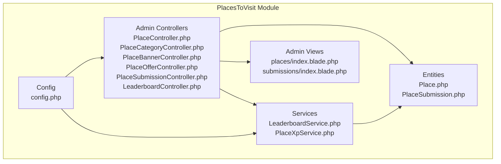
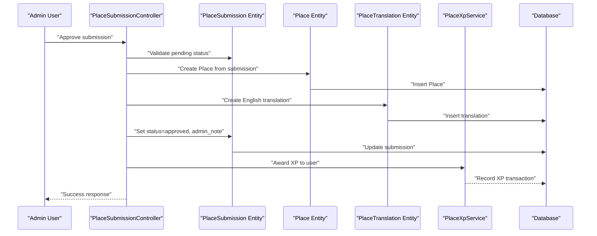
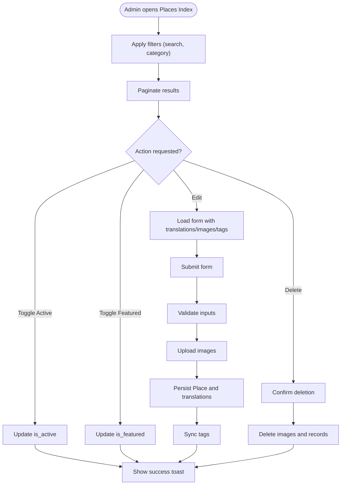
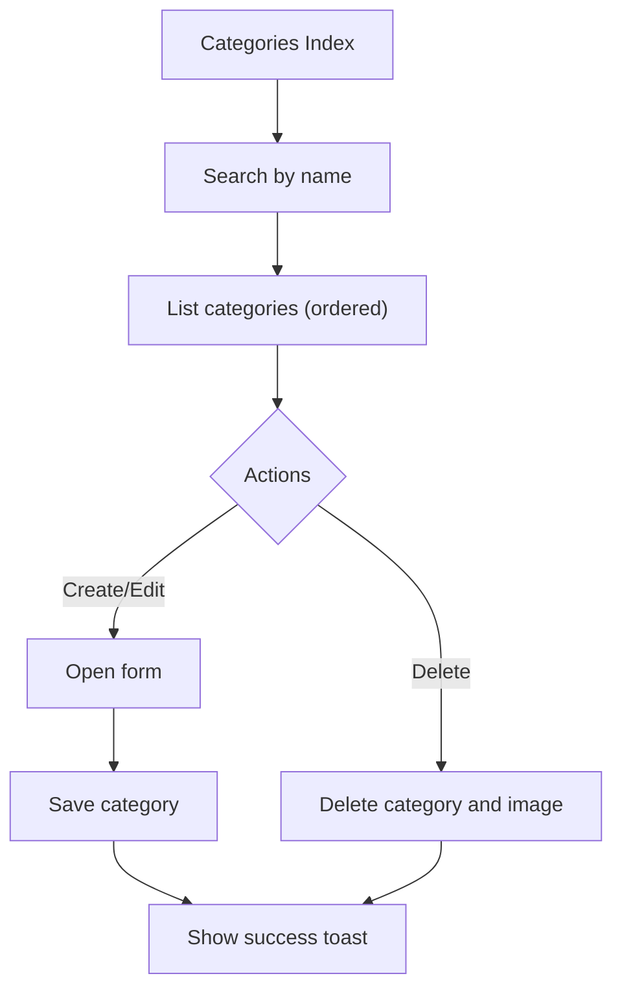
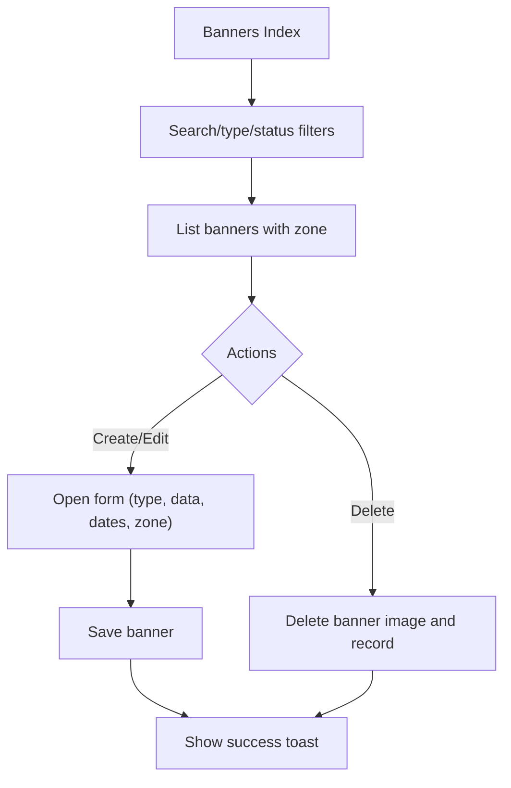
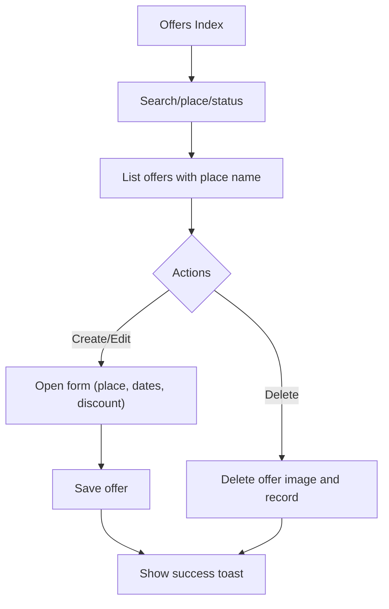
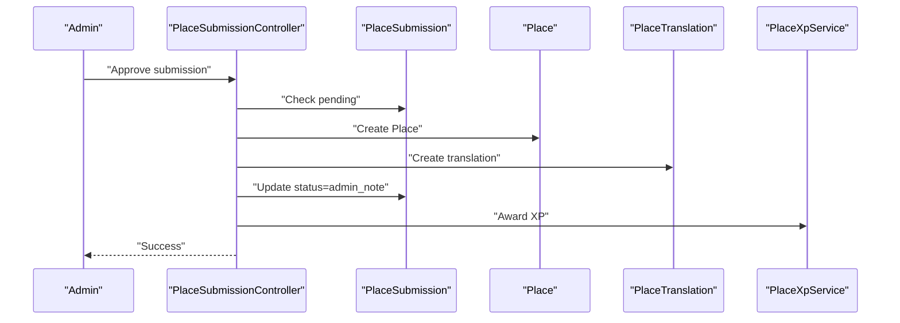
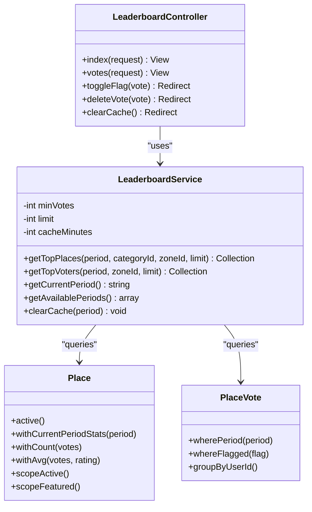
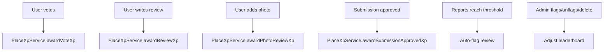
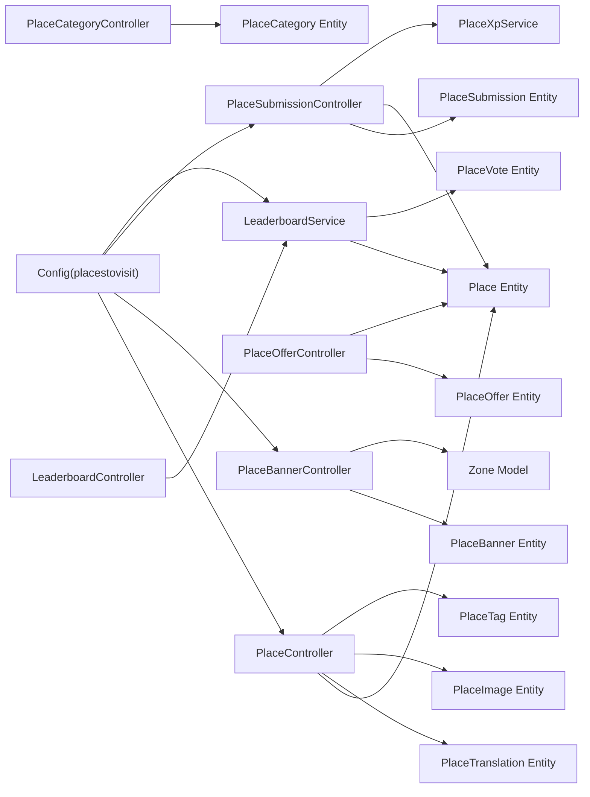

# Administrative Interface

<cite>
**Referenced Files in This Document**
- [module.json](file://Modules/PlacesToVisit/module.json)
- [config.php](file://Modules/PlacesToVisit/Config/config.php)
- [PlaceController.php](file://Modules/PlacesToVisit/Http/Controllers/Admin/PlaceController.php)
- [PlaceCategoryController.php](file://Modules/PlacesToVisit/Http/Controllers/Admin/PlaceCategoryController.php)
- [PlaceBannerController.php](file://Modules/PlacesToVisit/Http/Controllers/Admin/PlaceBannerController.php)
- [PlaceOfferController.php](file://Modules/PlacesToVisit/Http/Controllers/Admin/PlaceOfferController.php)
- [PlaceSubmissionController.php](file://Modules/PlacesToVisit/Http/Controllers/Admin/PlaceSubmissionController.php)
- [LeaderboardController.php](file://Modules/PlacesToVisit/Http/Controllers/Admin/LeaderboardController.php)
- [LeaderboardService.php](file://Modules/PlacesToVisit/Services/LeaderboardService.php)
- [PlaceXpService.php](file://Modules/PlacesToVisit/Services/PlaceXpService.php)
- [PlaceSubmission.php](file://Modules/PlacesToVisit/Entities/PlaceSubmission.php)
- [Place.php](file://Modules/PlacesToVisit/Entities/Place.php)
- [index.blade.php](file://Modules/PlacesToVisit/Resources/views/admin/places/index.blade.php)
- [index.blade.php](file://Modules/PlacesToVisit/Resources/views/admin/submissions/index.blade.php)
</cite>

## Table of Contents
1. [Introduction](#introduction)
2. [Project Structure](#project-structure)
3. [Core Components](#core-components)
4. [Architecture Overview](#architecture-overview)
5. [Detailed Component Analysis](#detailed-component-analysis)
6. [Dependency Analysis](#dependency-analysis)
7. [Performance Considerations](#performance-considerations)
8. [Troubleshooting Guide](#troubleshooting-guide)
9. [Conclusion](#conclusion)

## Introduction
This document describes the administrative interface for the PlacesToVisit module. It covers admin views for managing places, categories, banners, offers, and leaderboards, as well as the submission review system for user-generated content. It also explains moderation workflows, permissions, role-based access controls, audit trails, practical examples of content moderation and bulk operations, reporting features, leaderboard management, analytics dashboards, performance monitoring, and administrative workflows for content approval and system maintenance.

## Project Structure
The administrative interface is organized around dedicated controllers, Blade views, services, and entities within the PlacesToVisit module. Configuration constants define operational parameters such as leaderboard thresholds, XP rewards, and moderation thresholds.

**Diagram sources**
- [PlaceController.php:16-257](file://Modules/PlacesToVisit/Http/Controllers/Admin/PlaceController.php#L16-L257)
- [PlaceCategoryController.php:12-107](file://Modules/PlacesToVisit/Http/Controllers/Admin/PlaceCategoryController.php#L12-L107)
- [PlaceBannerController.php:15-167](file://Modules/PlacesToVisit/Http/Controllers/Admin/PlaceBannerController.php#L15-L167)
- [PlaceOfferController.php:13-132](file://Modules/PlacesToVisit/Http/Controllers/Admin/PlaceOfferController.php#L13-L132)
- [PlaceSubmissionController.php:16-135](file://Modules/PlacesToVisit/Http/Controllers/Admin/PlaceSubmissionController.php#L16-L135)
- [LeaderboardController.php:13-94](file://Modules/PlacesToVisit/Http/Controllers/Admin/LeaderboardController.php#L13-L94)
- [LeaderboardService.php:12-141](file://Modules/PlacesToVisit/Services/LeaderboardService.php#L12-L141)
- [PlaceXpService.php:8-82](file://Modules/PlacesToVisit/Services/PlaceXpService.php#L8-L82)
- [Place.php:12-218](file://Modules/PlacesToVisit/Entities/Place.php#L12-L218)
- [PlaceSubmission.php:9-86](file://Modules/PlacesToVisit/Entities/PlaceSubmission.php#L9-L86)
- [config.php:1-53](file://Modules/PlacesToVisit/Config/config.php#L1-L53)

**Section sources**
- [module.json:1-17](file://Modules/PlacesToVisit/module.json#L1-L17)
- [config.php:1-53](file://Modules/PlacesToVisit/Config/config.php#L1-L53)

## Core Components
- Place management: CRUD operations, status toggles, featured toggles, multilingual content, image galleries, and tags.
- Category administration: create, update, delete, activation/deactivation, and ordering.
- Banner control: manage promotional banners with targeting by zone, category, place, or external links.
- Offer management: create, update, delete, and activate/deactivate offers linked to places.
- Submission review: approve/reject user-submitted places, award XP, and maintain audit trail via status and admin notes.
- Leaderboard configuration: period selection, top places computation, top voters, and cache management.
- Moderation workflows: flagging and deleting votes, auto-flag threshold for reports, and moderation actions.
- Permissions and roles: controlled via middleware and admin roles; see AdminMiddleware and AdminRole model.
- Audit trails: submission status changes, admin notes, and leaderboard cache invalidation.

**Section sources**
- [PlaceController.php:18-257](file://Modules/PlacesToVisit/Http/Controllers/Admin/PlaceController.php#L18-L257)
- [PlaceCategoryController.php:14-107](file://Modules/PlacesToVisit/Http/Controllers/Admin/PlaceCategoryController.php#L14-L107)
- [PlaceBannerController.php:17-167](file://Modules/PlacesToVisit/Http/Controllers/Admin/PlaceBannerController.php#L17-L167)
- [PlaceOfferController.php:15-132](file://Modules/PlacesToVisit/Http/Controllers/Admin/PlaceOfferController.php#L15-L132)
- [PlaceSubmissionController.php:18-135](file://Modules/PlacesToVisit/Http/Controllers/Admin/PlaceSubmissionController.php#L18-L135)
- [LeaderboardController.php:19-94](file://Modules/PlacesToVisit/Http/Controllers/Admin/LeaderboardController.php#L19-L94)
- [LeaderboardService.php:28-141](file://Modules/PlacesToVisit/Services/LeaderboardService.php#L28-L141)
- [PlaceXpService.php:13-82](file://Modules/PlacesToVisit/Services/PlaceXpService.php#L13-L82)

## Architecture Overview
The admin interface follows a layered MVC pattern:
- Controllers handle HTTP requests and orchestrate domain logic.
- Services encapsulate business logic (leaderboard computation, XP awarding).
- Entities represent domain models with relationships and scopes.
- Views render admin UI with filters, pagination, and actions.
- Configuration centralizes feature flags and thresholds.

**Diagram sources**
- [PlaceSubmissionController.php:47-98](file://Modules/PlacesToVisit/Http/Controllers/Admin/PlaceSubmissionController.php#L47-L98)
- [PlaceSubmission.php:9-86](file://Modules/PlacesToVisit/Entities/PlaceSubmission.php#L9-L86)
- [Place.php:12-218](file://Modules/PlacesToVisit/Entities/Place.php#L12-L218)
- [PlaceXpService.php:49-62](file://Modules/PlacesToVisit/Services/PlaceXpService.php#L49-L62)

## Detailed Component Analysis

### Place Management
- Index view supports filtering by search term and category, pagination, and displays votes, ratings, favorites, featured status, and active status.
- Create/Edit forms support multilingual titles/descriptions, coordinates, address, phone, website, Instagram, opening hours, primary image, gallery images, tags, and activation/feature toggles.
- Bulk operations: toggle active/featured status via controller actions; delete cascades images and updates notifications.
- Data flow: validation → upload handling → persistence → localization creation/update → tag sync.

**Diagram sources**
- [PlaceController.php:18-257](file://Modules/PlacesToVisit/Http/Controllers/Admin/PlaceController.php#L18-L257)
- [index.blade.php:24-143](file://Modules/PlacesToVisit/Resources/views/admin/places/index.blade.php#L24-L143)

**Section sources**
- [PlaceController.php:18-257](file://Modules/PlacesToVisit/Http/Controllers/Admin/PlaceController.php#L18-L257)
- [index.blade.php:1-146](file://Modules/PlacesToVisit/Resources/views/admin/places/index.blade.php#L1-L146)

### Category Administration
- Index lists categories with search, ordered by priority, and paginated.
- Create/Edit supports name, image upload, priority, and activation toggle.
- Delete removes associated image and category record.

**Diagram sources**
- [PlaceCategoryController.php:14-107](file://Modules/PlacesToVisit/Http/Controllers/Admin/PlaceCategoryController.php#L14-L107)

**Section sources**
- [PlaceCategoryController.php:14-107](file://Modules/PlacesToVisit/Http/Controllers/Admin/PlaceCategoryController.php#L14-L107)

### Banner Control
- Index supports search, type filter, status filter, and ordering; displays zone association.
- Create/Edit validates banner type, optional external link, zone association, date range, priority, and activation/feature toggles.
- Delete removes banner image and record.

**Diagram sources**
- [PlaceBannerController.php:17-167](file://Modules/PlacesToVisit/Http/Controllers/Admin/PlaceBannerController.php#L17-L167)

**Section sources**
- [PlaceBannerController.php:17-167](file://Modules/PlacesToVisit/Http/Controllers/Admin/PlaceBannerController.php#L17-L167)

### Offer Management
- Index supports search by offer title or place title, place filter, and status filter.
- Create/Edit validates discount percent, date range, and optional image; associates with a place.
- Delete removes offer image and record.

**Diagram sources**
- [PlaceOfferController.php:15-132](file://Modules/PlacesToVisit/Http/Controllers/Admin/PlaceOfferController.php#L15-L132)

**Section sources**
- [PlaceOfferController.php:15-132](file://Modules/PlacesToVisit/Http/Controllers/Admin/PlaceOfferController.php#L15-L132)

### Submission Review System
- Index lists submissions with status tabs (all/pending/approved/rejected), search by title or user, and action buttons.
- Show view displays submission details and user info.
- Approve: transforms submission into a new Place, creates translation, sets approved status, optionally assigns category, awards XP, and records admin note.
- Reject: sets rejected status and admin note.
- Delete: removes submission image and record.

**Diagram sources**
- [PlaceSubmissionController.php:47-98](file://Modules/PlacesToVisit/Http/Controllers/Admin/PlaceSubmissionController.php#L47-L98)
- [PlaceSubmission.php:9-86](file://Modules/PlacesToVisit/Entities/PlaceSubmission.php#L9-L86)
- [PlaceXpService.php:49-62](file://Modules/PlacesToVisit/Services/PlaceXpService.php#L49-L62)

**Section sources**
- [PlaceSubmissionController.php:18-135](file://Modules/PlacesToVisit/Http/Controllers/Admin/PlaceSubmissionController.php#L18-L135)
- [index.blade.php:1-159](file://Modules/PlacesToVisit/Resources/views/admin/submissions/index.blade.php#L1-L159)

### Leaderboard Configuration and Analytics
- Leaderboard index shows top places by votes and average rating, with period selector and stats (total votes, participating places, average rating).
- Votes view lists votes for a selected period, supports filtering by flagged and place, with flag toggle and delete vote actions.
- Cache management clears leaderboard and top voters caches for the selected period or current period.
- LeaderboardService computes top places and top voters with configurable thresholds and caching.

**Diagram sources**
- [LeaderboardController.php:13-94](file://Modules/PlacesToVisit/Http/Controllers/Admin/LeaderboardController.php#L13-L94)
- [LeaderboardService.php:12-141](file://Modules/PlacesToVisit/Services/LeaderboardService.php#L12-L141)
- [Place.php:12-218](file://Modules/PlacesToVisit/Entities/Place.php#L12-L218)

**Section sources**
- [LeaderboardController.php:19-94](file://Modules/PlacesToVisit/Http/Controllers/Admin/LeaderboardController.php#L19-L94)
- [LeaderboardService.php:28-141](file://Modules/PlacesToVisit/Services/LeaderboardService.php#L28-L141)

### XP Rewards and Moderation Workflows
- XP awarding for voting, reviews, photo reviews, and approved submissions is handled by PlaceXpService, which delegates to the global XpService.
- Moderation thresholds: report auto-flag threshold is configurable; admin can flag/unflag votes and delete votes to adjust leaderboard fairness.

**Diagram sources**
- [PlaceXpService.php:13-82](file://Modules/PlacesToVisit/Services/PlaceXpService.php#L13-L82)
- [config.php:42-51](file://Modules/PlacesToVisit/Config/config.php#L42-L51)
- [LeaderboardController.php:69-84](file://Modules/PlacesToVisit/Http/Controllers/Admin/LeaderboardController.php#L69-L84)

**Section sources**
- [PlaceXpService.php:13-82](file://Modules/PlacesToVisit/Services/PlaceXpService.php#L13-L82)
- [config.php:42-51](file://Modules/PlacesToVisit/Config/config.php#L42-L51)

## Dependency Analysis
- Controllers depend on entities for data access and on services for business logic.
- Services depend on configuration for thresholds and limits.
- Views depend on controllers for data rendering and on configuration for labels and options.
- Entities encapsulate relationships, scopes, and computed attributes.

**Diagram sources**
- [PlaceController.php:9-14](file://Modules/PlacesToVisit/Http/Controllers/Admin/PlaceController.php#L9-L14)
- [PlaceCategoryController.php:9-10](file://Modules/PlacesToVisit/Http/Controllers/Admin/PlaceCategoryController.php#L9-L10)
- [PlaceBannerController.php:6-13](file://Modules/PlacesToVisit/Http/Controllers/Admin/PlaceBannerController.php#L6-L13)
- [PlaceOfferController.php:10-11](file://Modules/PlacesToVisit/Http/Controllers/Admin/PlaceOfferController.php#L10-L11)
- [PlaceSubmissionController.php:10-14](file://Modules/PlacesToVisit/Http/Controllers/Admin/PlaceSubmissionController.php#L10-L14)
- [LeaderboardController.php:11-16](file://Modules/PlacesToVisit/Http/Controllers/Admin/LeaderboardController.php#L11-L16)
- [LeaderboardService.php:12-23](file://Modules/PlacesToVisit/Services/LeaderboardService.php#L12-L23)
- [config.php:1-53](file://Modules/PlacesToVisit/Config/config.php#L1-L53)

**Section sources**
- [PlaceController.php:16-257](file://Modules/PlacesToVisit/Http/Controllers/Admin/PlaceController.php#L16-L257)
- [PlaceCategoryController.php:12-107](file://Modules/PlacesToVisit/Http/Controllers/Admin/PlaceCategoryController.php#L12-L107)
- [PlaceBannerController.php:15-167](file://Modules/PlacesToVisit/Http/Controllers/Admin/PlaceBannerController.php#L15-L167)
- [PlaceOfferController.php:13-132](file://Modules/PlacesToVisit/Http/Controllers/Admin/PlaceOfferController.php#L13-L132)
- [PlaceSubmissionController.php:16-135](file://Modules/PlacesToVisit/Http/Controllers/Admin/PlaceSubmissionController.php#L16-L135)
- [LeaderboardController.php:13-94](file://Modules/PlacesToVisit/Http/Controllers/Admin/LeaderboardController.php#L13-L94)
- [LeaderboardService.php:12-141](file://Modules/PlacesToVisit/Services/LeaderboardService.php#L12-L141)
- [config.php:1-53](file://Modules/PlacesToVisit/Config/config.php#L1-L53)

## Performance Considerations
- Caching: LeaderboardService caches top places and top voters; cache keys include period, category, and zone to avoid stale data.
- Pagination: All list views use pagination to limit payload sizes.
- Efficient queries: Controllers use eager loading (translations, category, zone, votes, favorites) and aggregated counts/averages.
- Image handling: Uploads and deletions are performed via centralized helpers to prevent orphaned files.
- Recommendations: Monitor cache hit rates, consider background jobs for heavy computations, and periodically clear caches after bulk edits.

[No sources needed since this section provides general guidance]

## Troubleshooting Guide
Common issues and resolutions:
- Submission already processed: Approve/reject checks pending status and returns warning if not pending.
- Validation failures: Ensure required fields match entity validations (coordinates ranges, image sizes, date ranges).
- Cache not updating: Use clear cache action in leaderboard to invalidate cached entries.
- Missing translations: Ensure English translation is created during place creation; Arabic translation is optional.
- File cleanup: Deletion handlers remove uploaded images; verify storage permissions if files remain.

**Section sources**
- [PlaceSubmissionController.php:49-52](file://Modules/PlacesToVisit/Http/Controllers/Admin/PlaceSubmissionController.php#L49-L52)
- [PlaceController.php:48-67](file://Modules/PlacesToVisit/Http/Controllers/Admin/PlaceController.php#L48-L67)
- [LeaderboardController.php:86-92](file://Modules/PlacesToVisit/Http/Controllers/Admin/LeaderboardController.php#L86-L92)

## Conclusion
The PlacesToVisit administrative interface provides comprehensive tools for managing local places, categories, banners, offers, and leaderboards. It integrates moderation workflows, XP rewards, and robust analytics with caching and pagination for performance. Administrators can efficiently review user-generated content, configure promotional materials, monitor engagement, and maintain system integrity through clear permissions, audit trails, and cache controls.