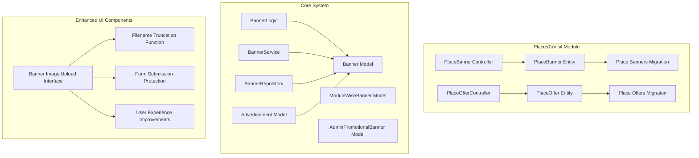
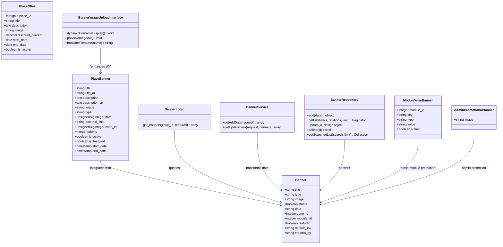
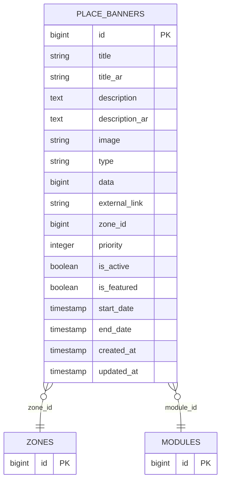
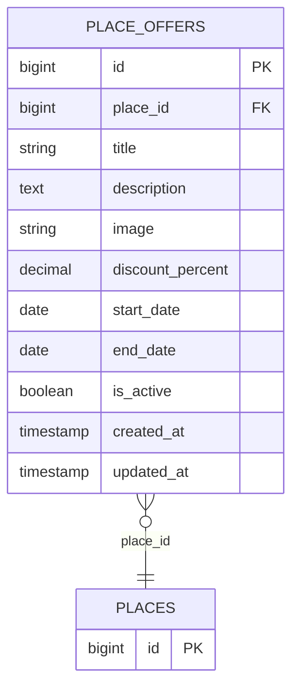
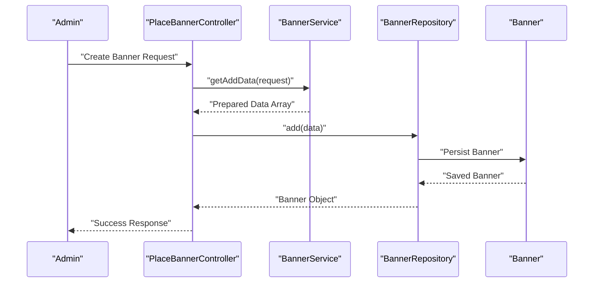
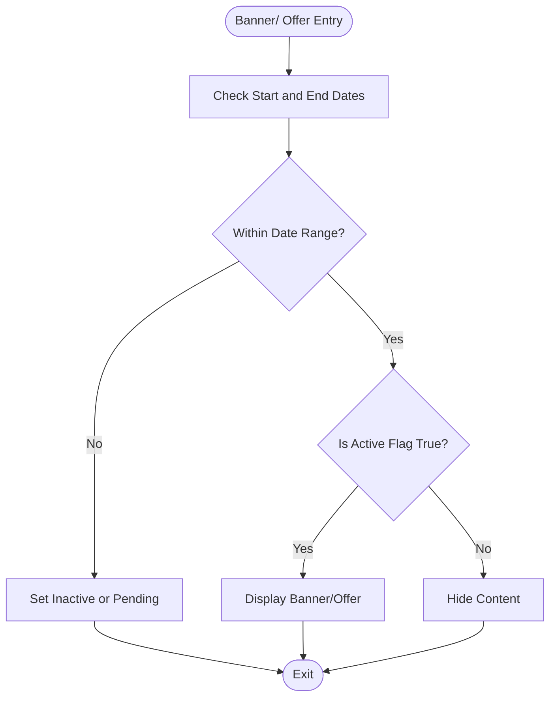
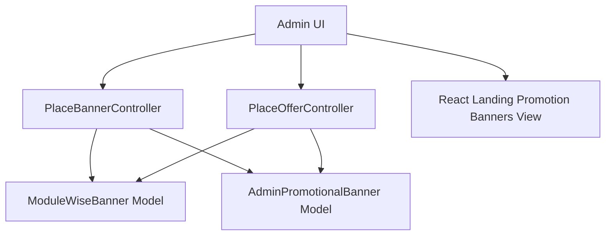
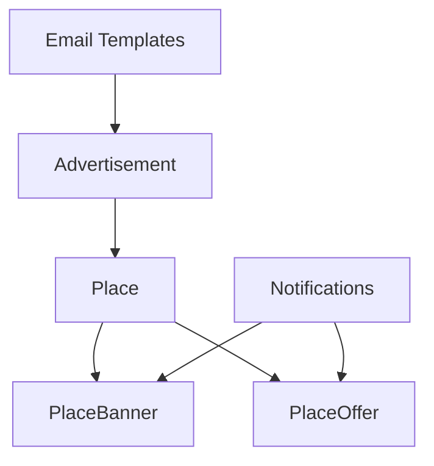
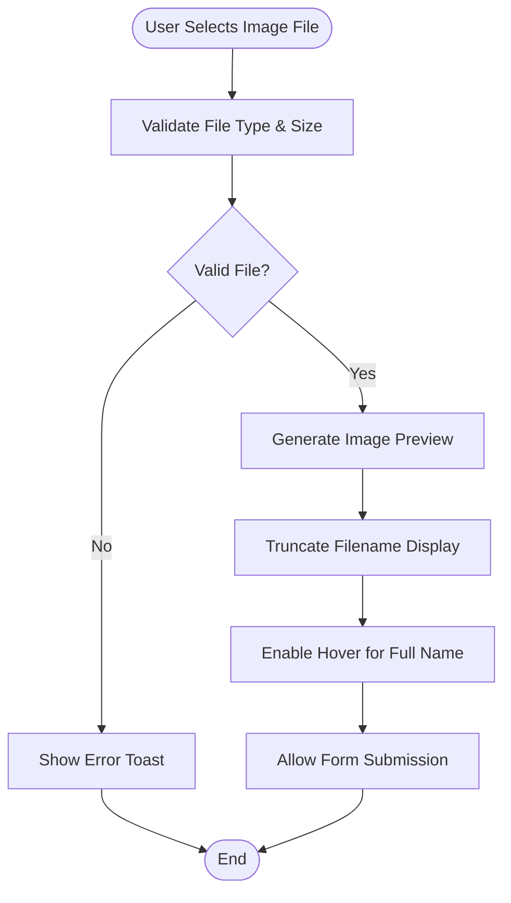
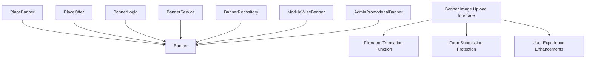

# Banners and Offers Management

<cite>
**Referenced Files in This Document**
- [PlaceBanner.php](file://Modules/PlacesToVisit/Entities/PlaceBanner.php)
- [PlaceOffer.php](file://Modules/PlacesToVisit/Entities/PlaceOffer.php)
- [create_place_banners_table.php](file://Modules/PlacesToVisit/Database/Migrations/2026_01_04_000006_create_place_banners_table.php)
- [create_place_offers_table.php](file://Modules/PlacesToVisit/Database/Migrations/2026_01_04_000005_create_place_offers_table.php)
- [PlaceBannerController.php](file://Modules/PlacesToVisit/Http/Controllers/Admin/PlaceBannerController.php)
- [PlaceOfferController.php](file://Modules/PlacesToVisit/Http/Controllers/Admin/PlaceOfferController.php)
- [Banner.php](file://app/Models/Banner.php)
- [ModuleWiseBanner.php](file://app/Models/ModuleWiseBanner.php)
- [AdminPromotionalBanner.php](file://app/Models/AdminPromotionalBanner.php)
- [banner.php](file://app/CentralLogics/banner.php)
- [BannerService.php](file://app/Services/BannerService.php)
- [BannerRepository.php](file://app/Repositories/BannerRepository.php)
- [Advertisement.php](file://app/Models/Advertisement.php)
- [react-landing-promotion-banners.blade.php](file://resources/views/admin-views/business-settings/landing-page-settings/react-landing-promotion-banners.blade.php)
- [index.blade.php](file://resources/views/admin-views/banner/index.blade.php)
- [edit.blade.php](file://resources/views/admin-views/banner/edit.blade.php)
- [banner-index.js](file://public/assets/admin/js/view-pages/banner-index.js)
- [banner-edit.js](file://public/assets/admin/js/view-pages/banner-edit.js)
- [common.js](file://public/assets/admin/js/view-pages/common.js)
</cite>

## Update Summary
**Changes Made**
- Enhanced banner image upload interface with dynamic filename display functionality
- Improved error handling and user experience for both create and edit forms
- Added filename truncation and preview capabilities for better user feedback
- Implemented form submission protection with automatic button re-enablement

## Table of Contents
1. [Introduction](#introduction)
2. [Project Structure](#project-structure)
3. [Core Components](#core-components)
4. [Architecture Overview](#architecture-overview)
5. [Detailed Component Analysis](#detailed-component-analysis)
6. [Enhanced Image Upload Interface](#enhanced-image-upload-interface)
7. [Dependency Analysis](#dependency-analysis)
8. [Performance Considerations](#performance-considerations)
9. [Troubleshooting Guide](#troubleshooting-guide)
10. [Conclusion](#conclusion)

## Introduction
This document provides comprehensive documentation for the PlaceBanner and PlaceOffer management systems within the PlacesToVisit module. It explains the PlaceBanner entity for promotional displays, advertising campaigns, and featured content, and details the PlaceOffer system for special deals, discounts, and promotional activities. The documentation covers banner creation workflows, approval processes, scheduling systems, offer targeting, expiration handling, performance tracking, administrative interfaces, and integrations with place listings, user notifications, and marketing automation systems.

**Updated** Enhanced with improved banner image upload interface featuring dynamic filename display, better error handling, and streamlined user experience across create and edit forms.

## Project Structure
The PlaceBanner and PlaceOffer systems are organized across entities, migrations, controllers, models, central logics, services, repositories, and administrative views. PlaceBanner and PlaceOffer are implemented as dedicated entities within the PlacesToVisit module, while the broader banner ecosystem integrates with the core Banner model and related promotional models.

**Diagram sources**
- [PlaceBanner.php](file://Modules/PlacesToVisit/Entities/PlaceBanner.php)
- [PlaceOffer.php](file://Modules/PlacesToVisit/Entities/PlaceOffer.php)
- [PlaceBannerController.php](file://Modules/PlacesToVisit/Http/Controllers/Admin/PlaceBannerController.php)
- [PlaceOfferController.php](file://Modules/PlacesToVisit/Http/Controllers/Admin/PlaceOfferController.php)
- [create_place_banners_table.php](file://Modules/PlacesToVisit/Database/Migrations/2026_01_04_000006_create_place_banners_table.php)
- [create_place_offers_table.php](file://Modules/PlacesToVisit/Database/Migrations/2026_01_04_000005_create_place_offers_table.php)
- [Banner.php](file://app/Models/Banner.php)
- [ModuleWiseBanner.php](file://app/Models/ModuleWiseBanner.php)
- [AdminPromotionalBanner.php](file://app/Models/AdminPromotionalBanner.php)
- [banner.php](file://app/CentralLogics/banner.php)
- [BannerService.php](file://app/Services/BannerService.php)
- [BannerRepository.php](file://app/Repositories/BannerRepository.php)
- [Advertisement.php](file://app/Models/Advertisement.php)
- [index.blade.php](file://resources/views/admin-views/banner/index.blade.php)
- [edit.blade.php](file://resources/views/admin-views/banner/edit.blade.php)
- [banner-index.js](file://public/assets/admin/js/view-pages/banner-index.js)
- [banner-edit.js](file://public/assets/admin/js/view-pages/banner-edit.js)
- [common.js](file://public/assets/admin/js/view-pages/common.js)

**Section sources**
- [PlaceBanner.php](file://Modules/PlacesToVisit/Entities/PlaceBanner.php)
- [PlaceOffer.php](file://Modules/PlacesToVisit/Entities/PlaceOffer.php)
- [create_place_banners_table.php](file://Modules/PlacesToVisit/Database/Migrations/2026_01_04_000006_create_place_banners_table.php)
- [create_place_offers_table.php](file://Modules/PlacesToVisit/Database/Migrations/2026_01_04_000005_create_place_offers_table.php)

## Core Components
- PlaceBanner: Promotional banners associated with places, supporting types such as default, category, place, and external links, with scheduling and activation controls.
- PlaceOffer: Special deals and discounts tied to specific places with discount percentages, validity periods, and activation flags.
- Core Banner ecosystem: Integrates with the global Banner model, ModuleWiseBanner, and AdminPromotionalBanner for cross-module promotional content.
- Administrative interfaces: Controllers manage CRUD operations, approval workflows, and analytics reporting for promotional content.
- Central logic and services: BannerLogic retrieves banners considering zones, modules, and feature flags; BannerService and BannerRepository handle data preparation and persistence.
- **Enhanced UI Components**: Dynamic filename display, form validation improvements, and user experience enhancements for banner management.

**Section sources**
- [PlaceBanner.php](file://Modules/PlacesToVisit/Entities/PlaceBanner.php)
- [PlaceOffer.php](file://Modules/PlacesToVisit/Entities/PlaceOffer.php)
- [Banner.php](file://app/Models/Banner.php)
- [ModuleWiseBanner.php](file://app/Models/ModuleWiseBanner.php)
- [AdminPromotionalBanner.php](file://app/Models/AdminPromotionalBanner.php)
- [banner.php](file://app/CentralLogics/banner.php)
- [BannerService.php](file://app/Services/BannerService.php)
- [BannerRepository.php](file://app/Repositories/BannerRepository.php)

## Architecture Overview
The PlaceBanner and PlaceOffer systems follow a layered architecture:
- Entities define domain-specific attributes and relationships.
- Controllers orchestrate administrative actions and integrate with services.
- Services encapsulate business logic for data transformation and persistence.
- Repositories abstract data access and support search, filtering, and pagination.
- Central logics coordinate cross-module banner retrieval and formatting.
- Models represent persistent entities and provide scopes and relationships.
- **Enhanced UI Layer**: Frontend components provide improved user interaction with dynamic filename display and form validation.

**Diagram sources**
- [PlaceBanner.php](file://Modules/PlacesToVisit/Entities/PlaceBanner.php)
- [PlaceOffer.php](file://Modules/PlacesToVisit/Entities/PlaceOffer.php)
- [Banner.php](file://app/Models/Banner.php)
- [ModuleWiseBanner.php](file://app/Models/ModuleWiseBanner.php)
- [AdminPromotionalBanner.php](file://app/Models/AdminPromotionalBanner.php)
- [banner.php](file://app/CentralLogics/banner.php)
- [BannerService.php](file://app/Services/BannerService.php)
- [BannerRepository.php](file://app/Repositories/BannerRepository.php)
- [index.blade.php](file://resources/views/admin-views/banner/index.blade.php)
- [edit.blade.php](file://resources/views/admin-views/banner/edit.blade.php)

## Detailed Component Analysis

### PlaceBanner Entity
PlaceBanner manages promotional banners for places with multilingual support, scheduling, and targeting capabilities:
- Attributes include localized titles and descriptions, image storage, type classification (default, category, place, external), target data linkage, zone association, priority, activation flags, and date ranges.
- Type classification determines the destination of the banner click action.
- Scheduling ensures banners are visible only during specified periods.
- Integration with the global Banner model enables cross-module promotional content and admin-level promotions.

**Diagram sources**
- [create_place_banners_table.php](file://Modules/PlacesToVisit/Database/Migrations/2026_01_04_000006_create_place_banners_table.php)

**Section sources**
- [PlaceBanner.php](file://Modules/PlacesToVisit/Entities/PlaceBanner.php)
- [create_place_banners_table.php](file://Modules/PlacesToVisit/Database/Migrations/2026_01_04_000006_create_place_banners_table.php)

### PlaceOffer Entity
PlaceOffer defines promotional offers for places with discount percentages and validity windows:
- Associates offers with specific places via foreign key constraints.
- Supports localized titles and descriptions, optional images, discount percentages, and date-based activation.
- Enables targeted promotional campaigns aligned with place availability and seasonal events.

**Diagram sources**
- [create_place_offers_table.php](file://Modules/PlacesToVisit/Database/Migrations/2026_01_04_000005_create_place_offers_table.php)

**Section sources**
- [PlaceOffer.php](file://Modules/PlacesToVisit/Entities/PlaceOffer.php)
- [create_place_offers_table.php](file://Modules/PlacesToVisit/Database/Migrations/2026_01_04_000005_create_place_offers_table.php)

### Banner Creation Workflows and Approval Processes
The system supports structured workflows for banner creation and approval:
- Data preparation: BannerService transforms request data into standardized arrays for creation and updates, handling image uploads and module associations.
- Persistence: BannerRepository adds, updates, and deletes banner records, ensuring translation cleanup and storage cleanup upon deletion.
- Retrieval and formatting: BannerLogic fetches active banners filtered by zone, module, and feature flags, formatting results for frontend consumption.
- Approval and scheduling: While explicit approval flags are not present in the PlaceBanner migration, the system leverages status flags and scheduling fields to control visibility and activation.

**Diagram sources**
- [PlaceBannerController.php](file://Modules/PlacesToVisit/Http/Controllers/Admin/PlaceBannerController.php)
- [BannerService.php](file://app/Services/BannerService.php)
- [BannerRepository.php](file://app/Repositories/BannerRepository.php)
- [Banner.php](file://app/Models/Banner.php)

**Section sources**
- [BannerService.php](file://app/Services/BannerService.php)
- [BannerRepository.php](file://app/Repositories/BannerRepository.php)
- [banner.php](file://app/CentralLogics/banner.php)

### Scheduling Systems and Expiration Handling
- PlaceBanner scheduling: Uses start_date and end_date to control banner visibility; combined with is_active flag for manual control.
- PlaceOffer scheduling: Applies similar mechanisms for discount campaigns and promotional periods.
- Global Banner model: Provides scopes for active and featured banners, enabling efficient queries for frontend rendering.
- Advertisement model: Includes start_date and end_date with computed active attribute to categorize ads as active, upcoming, or expired.

**Diagram sources**
- [create_place_banners_table.php](file://Modules/PlacesToVisit/Database/Migrations/2026_01_04_000006_create_place_banners_table.php)
- [create_place_offers_table.php](file://Modules/PlacesToVisit/Database/Migrations/2026_01_04_000005_create_place_offers_table.php)
- [Banner.php](file://app/Models/Banner.php)
- [Advertisement.php](file://app/Models/Advertisement.php)

**Section sources**
- [create_place_banners_table.php](file://Modules/PlacesToVisit/Database/Migrations/2026_01_04_000006_create_place_banners_table.php)
- [create_place_offers_table.php](file://Modules/PlacesToVisit/Database/Migrations/2026_01_04_000005_create_place_offers_table.php)
- [Banner.php](file://app/Models/Banner.php)
- [Advertisement.php](file://app/Models/Advertisement.php)

### Administrative Interfaces and Analytics Reporting
Administrative interfaces enable management of promotional content:
- Controllers: PlaceBannerController and PlaceOfferController handle CRUD operations, search, and filtering for banners and offers.
- Views: Administrative views support landing page settings and promotional banner configurations.
- Integration: Cross-module promotional banners leverage ModuleWiseBanner and AdminPromotionalBanner models for centralized management.

**Diagram sources**
- [PlaceBannerController.php](file://Modules/PlacesToVisit/Http/Controllers/Admin/PlaceBannerController.php)
- [PlaceOfferController.php](file://Modules/PlacesToVisit/Http/Controllers/Admin/PlaceOfferController.php)
- [ModuleWiseBanner.php](file://app/Models/ModuleWiseBanner.php)
- [AdminPromotionalBanner.php](file://app/Models/AdminPromotionalBanner.php)
- [react-landing-promotion-banners.blade.php](file://resources/views/admin-views/business-settings/landing-page-settings/react-landing-promotion-banners.blade.php)

**Section sources**
- [PlaceBannerController.php](file://Modules/PlacesToVisit/Http/Controllers/Admin/PlaceBannerController.php)
- [PlaceOfferController.php](file://Modules/PlacesToVisit/Http/Controllers/Admin/PlaceOfferController.php)
- [react-landing-promotion-banners.blade.php](file://resources/views/admin-views/business-settings/landing-page-settings/react-landing-promotion-banners.blade.php)

### Integration with Place Listings, User Notifications, and Marketing Automation
- Place listings: PlaceBanner and PlaceOffer are associated with places, enabling targeted promotional content aligned with place categories and offerings.
- User notifications: The system includes notification-related models and services that can be extended to deliver promotional updates to users.
- Marketing automation: Integration with Advertisement model and email templates supports automated promotional campaigns and status notifications.

**Diagram sources**
- [PlaceBanner.php](file://Modules/PlacesToVisit/Entities/PlaceBanner.php)
- [PlaceOffer.php](file://Modules/PlacesToVisit/Entities/PlaceOffer.php)
- [Advertisement.php](file://app/Models/Advertisement.php)

**Section sources**
- [PlaceBanner.php](file://Modules/PlacesToVisit/Entities/PlaceBanner.php)
- [PlaceOffer.php](file://Modules/PlacesToVisit/Entities/PlaceOffer.php)
- [Advertisement.php](file://app/Models/Advertisement.php)

## Enhanced Image Upload Interface

**Updated** The banner management system now features an enhanced image upload interface with dynamic filename display functionality, improved error handling, and better user experience for both create and edit forms.

### Dynamic Filename Display Functionality
The system implements intelligent filename truncation and display for uploaded banner images:

- **Filename Truncation**: The `truncateImageName()` function dynamically shortens long filenames while preserving file extensions, displaying up to 15 characters plus the extension.
- **Hover Effects**: Users can hover over truncated filenames to see the full original filename.
- **Real-time Preview**: Image previews update immediately when new files are selected, providing instant visual feedback.

### Form Enhancement Features
The enhanced interface includes several user experience improvements:

- **Form Submission Protection**: Automatic button disabling for 2 seconds after submission prevents duplicate submissions and provides visual feedback.
- **Reset Functionality**: Enhanced reset buttons restore form state and image previews to default values.
- **Error Handling**: Improved AJAX error handling with user-friendly toast notifications for upload failures and validation errors.
- **File Type Validation**: Accepts modern image formats including WEBP, JPG, PNG, JPEG, GIF, BMP, TIFF, and TIF.

### Implementation Details

**Diagram sources**
- [common.js](file://public/assets/admin/js/view-pages/common.js)
- [banner-index.js](file://public/assets/admin/js/view-pages/banner-index.js)
- [banner-edit.js](file://public/assets/admin/js/view-pages/banner-edit.js)
- [index.blade.php](file://resources/views/admin-views/banner/index.blade.php)
- [edit.blade.php](file://resources/views/admin-views/banner/edit.blade.php)

**Section sources**
- [common.js](file://public/assets/admin/js/view-pages/common.js)
- [banner-index.js](file://public/assets/admin/js/view-pages/banner-index.js)
- [banner-edit.js](file://public/assets/admin/js/view-pages/banner-edit.js)
- [index.blade.php](file://resources/views/admin-views/banner/index.blade.php)
- [edit.blade.php](file://resources/views/admin-views/banner/edit.blade.php)

## Dependency Analysis
The PlaceBanner and PlaceOffer systems depend on core models and services:
- PlaceBanner depends on zone and module associations for targeting and scheduling.
- PlaceOffer depends on place foreign keys for association and discount calculations.
- BannerLogic coordinates banner retrieval across modules and zones.
- BannerService and BannerRepository encapsulate data transformation and persistence concerns.
- **Enhanced UI Dependencies**: Frontend JavaScript libraries provide dynamic filename display, image preview, and form validation.

**Diagram sources**
- [PlaceBanner.php](file://Modules/PlacesToVisit/Entities/PlaceBanner.php)
- [PlaceOffer.php](file://Modules/PlacesToVisit/Entities/PlaceOffer.php)
- [Banner.php](file://app/Models/Banner.php)
- [ModuleWiseBanner.php](file://app/Models/ModuleWiseBanner.php)
- [AdminPromotionalBanner.php](file://app/Models/AdminPromotionalBanner.php)
- [banner.php](file://app/CentralLogics/banner.php)
- [BannerService.php](file://app/Services/BannerService.php)
- [BannerRepository.php](file://app/Repositories/BannerRepository.php)
- [common.js](file://public/assets/admin/js/view-pages/common.js)
- [banner-index.js](file://public/assets/admin/js/view-pages/banner-index.js)
- [banner-edit.js](file://public/assets/admin/js/view-pages/banner-edit.js)

**Section sources**
- [banner.php](file://app/CentralLogics/banner.php)
- [BannerService.php](file://app/Services/BannerService.php)
- [BannerRepository.php](file://app/Repositories/BannerRepository.php)
- [common.js](file://public/assets/admin/js/view-pages/common.js)

## Performance Considerations
- Caching: BannerLogic caches banner queries for a fixed duration to reduce database load and improve response times.
- Indexing: PlaceBanner migration includes composite indexes on is_active and priority, and on start_date and end_date to optimize filtering and sorting.
- Pagination: BannerRepository.getListWhere and BannerRepository.getSearchedList support pagination and search to handle large datasets efficiently.
- Global scopes: Models apply global scopes for storage and translations to ensure consistent data retrieval and formatting.
- **Enhanced UI Performance**: Client-side JavaScript minimizes DOM manipulation and uses efficient event handling for real-time filename display and preview updates.

## Troubleshooting Guide
- Banner visibility issues: Verify is_active flag, scheduling dates, and module/zone associations. Use BannerRepository getListWhere to filter and inspect banners.
- Image upload failures: Confirm FileManagerTrait usage in BannerService and proper storage disk configuration.
- Translation inconsistencies: Ensure translation keys match expected keys and that global translate scope is applied consistently.
- Deletion cleanup: BannerRepository.delete removes translations and associated storage entries; confirm cleanup logic executes properly.
- **Enhanced UI Issues**: 
  - If filename truncation doesn't work, verify the `truncateImageName()` function is properly loaded in `common.js`.
  - If image preview fails, check that FileReader API is supported and the `readURL()` functions are correctly bound to file inputs.
  - If form submission protection isn't working, ensure the form submit event handler is properly initialized.

**Section sources**
- [BannerRepository.php](file://app/Repositories/BannerRepository.php)
- [BannerService.php](file://app/Services/BannerService.php)
- [Banner.php](file://app/Models/Banner.php)
- [common.js](file://public/assets/admin/js/view-pages/common.js)
- [banner-index.js](file://public/assets/admin/js/view-pages/banner-index.js)
- [banner-edit.js](file://public/assets/admin/js/view-pages/banner-edit.js)

## Conclusion
The PlaceBanner and PlaceOffer management systems provide robust mechanisms for promoting places and offers through targeted, scheduled, and modular promotional content. By leveraging core models, services, repositories, and central logics, the system supports scalable administration, efficient retrieval, and seamless integration with place listings and marketing automation. 

**Updated** The enhanced image upload interface significantly improves user experience with dynamic filename display, real-time preview capabilities, and better error handling. The system now provides a more intuitive and responsive interface for both creating and editing promotional content, with features like automatic filename truncation, hover effects for full filenames, and form submission protection to prevent duplicate submissions. These enhancements make the banner management process more efficient and user-friendly while maintaining the system's robust backend architecture and comprehensive administrative capabilities.