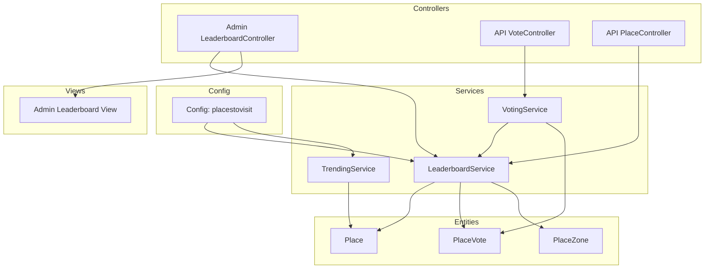
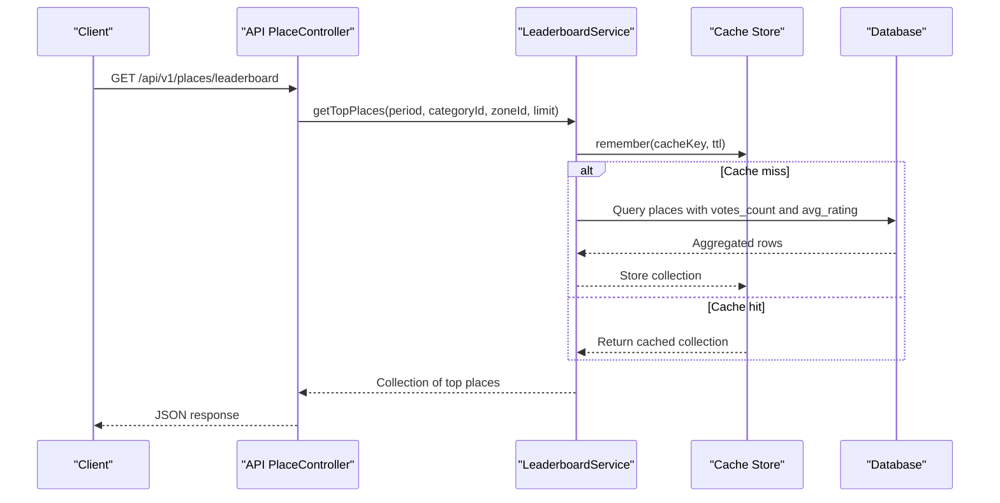
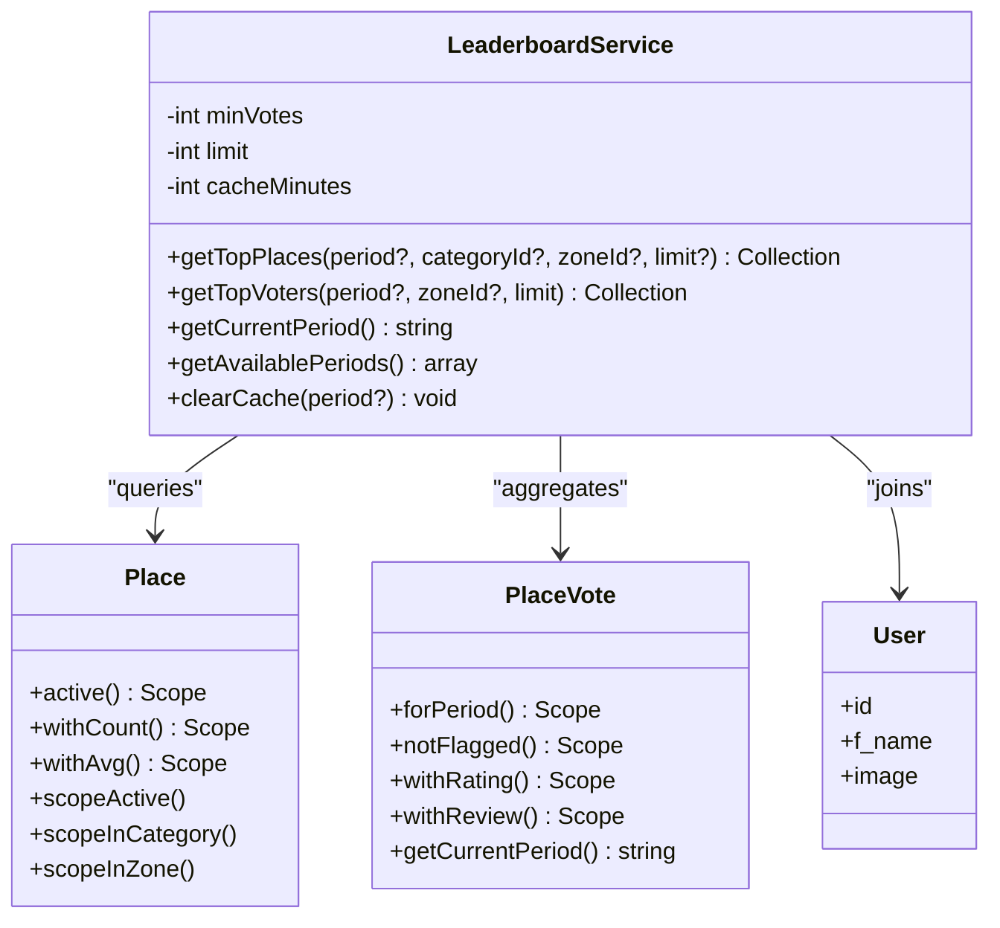
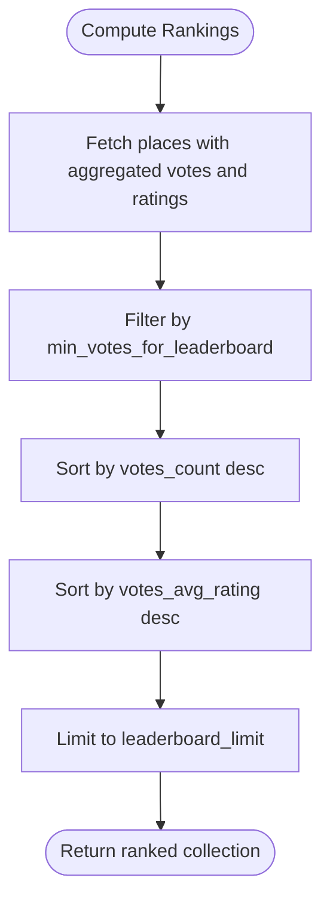
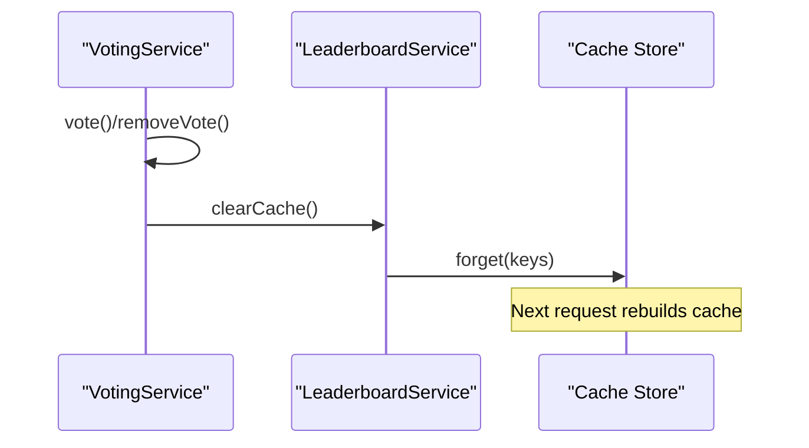
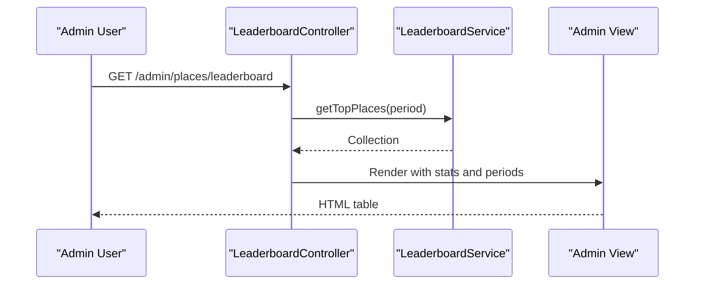
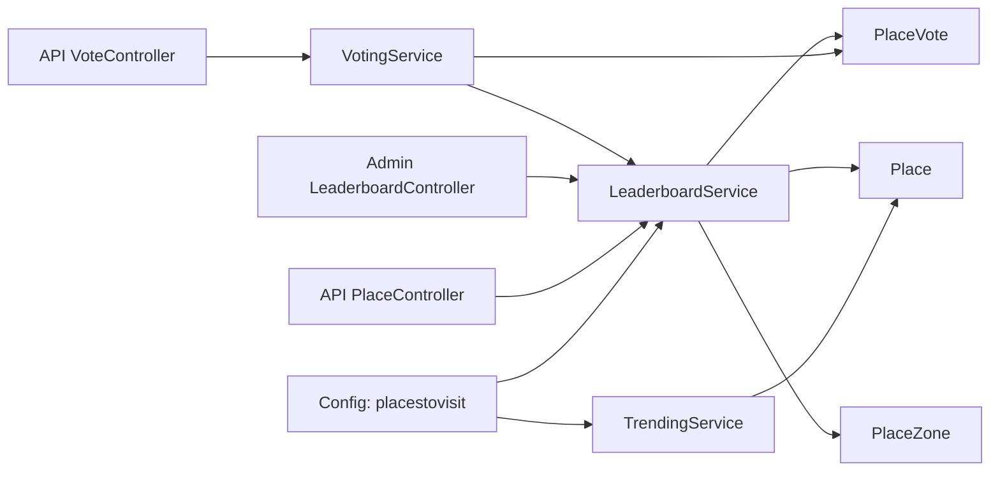

# Leaderboard and Ranking System

<cite>
**Referenced Files in This Document**
- [LeaderboardService.php](file://Modules/PlacesToVisit/Services/LeaderboardService.php)
- [VotingService.php](file://Modules/PlacesToVisit/Services/VotingService.php)
- [TrendingService.php](file://Modules/PlacesToVisit/Services/TrendingService.php)
- [LeaderboardController.php](file://Modules/PlacesToVisit/Http/Controllers/Admin/LeaderboardController.php)
- [VoteController.php](file://Modules/PlacesToVisit/Http/Controllers/Api/VoteController.php)
- [PlaceController.php](file://Modules/PlacesToVisit/Http/Controllers/Api/PlaceController.php)
- [Place.php](file://Modules/PlacesToVisit/Entities/Place.php)
- [PlaceVote.php](file://Modules/PlacesToVisit/Entities/PlaceVote.php)
- [create_place_votes_table.php](file://Modules/PlacesToVisit/Database/Migrations/2026_01_04_000004_create_place_votes_table.php)
- [create_place_zones_table.php](file://Modules/PlacesToVisit/Database/Migrations/2026_04_02_000002_create_place_zones_table.php)
- [config.php](file://Modules/PlacesToVisit/Config/config.php)
- [index.blade.php](file://Modules/PlacesToVisit/Resources/views/admin/leaderboard/index.blade.php)
</cite>

## Table of Contents
1. [Introduction](#introduction)
2. [Project Structure](#project-structure)
3. [Core Components](#core-components)
4. [Architecture Overview](#architecture-overview)
5. [Detailed Component Analysis](#detailed-component-analysis)
6. [Dependency Analysis](#dependency-analysis)
7. [Performance Considerations](#performance-considerations)
8. [Troubleshooting Guide](#troubleshooting-guide)
9. [Conclusion](#conclusion)
10. [Appendices](#appendices)

## Introduction
This document describes the leaderboard and ranking system for the PlacesToVisit module. It covers the LeaderboardService implementation, ranking algorithms, score calculation methods, periodic updates, and integration with the voting system and place management components. It also documents leaderboard generation workflows, caching strategies, performance optimization techniques, display formats, pagination, filtering options, administrative controls, manual adjustments, and maintenance procedures.

## Project Structure
The leaderboard system spans several layers:
- Services: LeaderboardService, VotingService, TrendingService
- Entities: Place, PlaceVote, PlaceZone
- Controllers: Admin LeaderboardController, API VoteController, API PlaceController
- Configuration: Module config.php
- Views: Admin leaderboard index view
- Database: Migrations for place_votes and place_zones

**Diagram sources**
- [LeaderboardController.php:1-94](file://Modules/PlacesToVisit/Http/Controllers/Admin/LeaderboardController.php#L1-L94)
- [VoteController.php:1-148](file://Modules/PlacesToVisit/Http/Controllers/Api/VoteController.php#L1-L148)
- [PlaceController.php:181-219](file://Modules/PlacesToVisit/Http/Controllers/Api/PlaceController.php#L181-L219)
- [LeaderboardService.php:1-141](file://Modules/PlacesToVisit/Services/LeaderboardService.php#L1-L141)
- [VotingService.php:1-216](file://Modules/PlacesToVisit/Services/VotingService.php#L1-L216)
- [TrendingService.php:1-87](file://Modules/PlacesToVisit/Services/TrendingService.php#L1-L87)
- [Place.php:1-218](file://Modules/PlacesToVisit/Entities/Place.php#L1-L218)
- [PlaceVote.php:1-78](file://Modules/PlacesToVisit/Entities/PlaceVote.php#L1-L78)
- [config.php:1-53](file://Modules/PlacesToVisit/Config/config.php#L1-L53)
- [index.blade.php:1-135](file://Modules/PlacesToVisit/Resources/views/admin/leaderboard/index.blade.php#L1-L135)

**Section sources**
- [LeaderboardService.php:1-141](file://Modules/PlacesToVisit/Services/LeaderboardService.php#L1-L141)
- [VotingService.php:1-216](file://Modules/PlacesToVisit/Services/VotingService.php#L1-L216)
- [TrendingService.php:1-87](file://Modules/PlacesToVisit/Services/TrendingService.php#L1-L87)
- [LeaderboardController.php:1-94](file://Modules/PlacesToVisit/Http/Controllers/Admin/LeaderboardController.php#L1-L94)
- [VoteController.php:1-148](file://Modules/PlacesToVisit/Http/Controllers/Api/VoteController.php#L1-L148)
- [PlaceController.php:181-219](file://Modules/PlacesToVisit/Http/Controllers/Api/PlaceController.php#L181-L219)
- [Place.php:1-218](file://Modules/PlacesToVisit/Entities/Place.php#L1-L218)
- [PlaceVote.php:1-78](file://Modules/PlacesToVisit/Entities/PlaceVote.php#L1-L78)
- [create_place_votes_table.php:1-31](file://Modules/PlacesToVisit/Database/Migrations/2026_01_04_000004_create_place_votes_table.php#L1-L31)
- [create_place_zones_table.php:1-27](file://Modules/PlacesToVisit/Database/Migrations/2026_04_02_000002_create_place_zones_table.php#L1-L27)
- [config.php:1-53](file://Modules/PlacesToVisit/Config/config.php#L1-L53)
- [index.blade.php:1-135](file://Modules/PlacesToVisit/Resources/views/admin/leaderboard/index.blade.php#L1-L135)

## Core Components
- LeaderboardService: Computes monthly leaderboard rankings by total votes and average rating, with caching and filtering by category and zone.
- VotingService: Handles vote creation/update/removal, integrates with XP rewards, and triggers cache invalidation.
- TrendingService: Computes trending places using a recency-weighted scoring algorithm.
- Place and PlaceVote entities: Define data model, scopes, and computed attributes for localization and URLs.
- Admin LeaderboardController: Provides admin UI for viewing leaderboards, managing votes, and clearing cache.
- API endpoints: Expose leaderboard and voter queries to clients.

**Section sources**
- [LeaderboardService.php:25-88](file://Modules/PlacesToVisit/Services/LeaderboardService.php#L25-L88)
- [VotingService.php:14-86](file://Modules/PlacesToVisit/Services/VotingService.php#L14-L86)
- [TrendingService.php:23-73](file://Modules/PlacesToVisit/Services/TrendingService.php#L23-L73)
- [Place.php:49-90](file://Modules/PlacesToVisit/Entities/Place.php#L49-L90)
- [PlaceVote.php:10-36](file://Modules/PlacesToVisit/Entities/PlaceVote.php#L10-L36)
- [LeaderboardController.php:19-92](file://Modules/PlacesToVisit/Http/Controllers/Admin/LeaderboardController.php#L19-L92)
- [PlaceController.php:181-219](file://Modules/PlacesToVisit/Http/Controllers/Api/PlaceController.php#L181-L219)

## Architecture Overview
The system follows a service-layer architecture:
- Controllers receive requests and delegate to services.
- Services encapsulate ranking logic, caching, and data aggregation.
- Entities define relationships and scopes for efficient queries.
- Configuration drives thresholds, limits, and cache durations.

**Diagram sources**
- [PlaceController.php:181-219](file://Modules/PlacesToVisit/Http/Controllers/Api/PlaceController.php#L181-L219)
- [LeaderboardService.php:28-59](file://Modules/PlacesToVisit/Services/LeaderboardService.php#L28-L59)

## Detailed Component Analysis

### LeaderboardService
Implements the core ranking algorithm:
- Primary sort: votes_count (total votes per month).
- Secondary sort: votes_avg_rating (quality).
- Filters: minimum votes threshold, category, zone, and period.
- Caching: per-period, per-category, per-zone keys with configurable TTL.
- Top voters: aggregates user vote counts per period and zone.

**Diagram sources**
- [LeaderboardService.php:12-141](file://Modules/PlacesToVisit/Services/LeaderboardService.php#L12-L141)
- [Place.php:173-217](file://Modules/PlacesToVisit/Entities/Place.php#L173-L217)
- [PlaceVote.php:50-77](file://Modules/PlacesToVisit/Entities/PlaceVote.php#L50-L77)

**Section sources**
- [LeaderboardService.php:25-88](file://Modules/PlacesToVisit/Services/LeaderboardService.php#L25-L88)
- [LeaderboardService.php:110-139](file://Modules/PlacesToVisit/Services/LeaderboardService.php#L110-L139)
- [config.php:8-15](file://Modules/PlacesToVisit/Config/config.php#L8-L15)

### Ranking Criteria and Score Calculation
- Total votes per month: primary popularity metric.
- Average rating per month: secondary quality metric.
- Minimum votes threshold: prevents trivial rankings.
- Geographic proximity: not part of the leaderboard algorithm; nearby search is available via Place::scopeNearby.
- Quality metrics: average rating derived from non-null ratings.

**Diagram sources**
- [LeaderboardService.php:28-59](file://Modules/PlacesToVisit/Services/LeaderboardService.php#L28-L59)
- [config.php:8-12](file://Modules/PlacesToVisit/Config/config.php#L8-L12)

**Section sources**
- [LeaderboardService.php:42-44](file://Modules/PlacesToVisit/Services/LeaderboardService.php#L42-L44)
- [Place.php:142-155](file://Modules/PlacesToVisit/Entities/Place.php#L142-L155)

### Periodic Updates and Caching
- Period: monthly granularity stored as YYYY-MM.
- Cache keys include period, category, and zone to isolate caches.
- Cache TTL configured via module config.
- Cache invalidation triggered on vote creation/update/delete and admin actions.

**Diagram sources**
- [VotingService.php:22-86](file://Modules/PlacesToVisit/Services/VotingService.php#L22-L86)
- [VotingService.php:210-214](file://Modules/PlacesToVisit/Services/VotingService.php#L210-L214)
- [LeaderboardService.php:113-139](file://Modules/PlacesToVisit/Services/LeaderboardService.php#L113-L139)

**Section sources**
- [VotingService.php:210-214](file://Modules/PlacesToVisit/Services/VotingService.php#L210-L214)
- [LeaderboardService.php:31-58](file://Modules/PlacesToVisit/Services/LeaderboardService.php#L31-L58)
- [config.php:14](file://Modules/PlacesToVisit/Config/config.php#L14)

### Leaderboard Generation Workflows
- Admin dashboard: renders top places for a selected period, with stats and filters.
- API endpoint: returns top places with metadata and current period.
- Top voters: returns top contributors by vote count.

**Diagram sources**
- [LeaderboardController.php:19-44](file://Modules/PlacesToVisit/Http/Controllers/Admin/LeaderboardController.php#L19-L44)
- [index.blade.php:109-135](file://Modules/PlacesToVisit/Resources/views/admin/leaderboard/index.blade.php#L109-L135)

**Section sources**
- [LeaderboardController.php:19-44](file://Modules/PlacesToVisit/Http/Controllers/Admin/LeaderboardController.php#L19-L44)
- [PlaceController.php:181-200](file://Modules/PlacesToVisit/Http/Controllers/Api/PlaceController.php#L181-L200)

### Caching Strategies and Performance Optimization
- Query-level caching: Cache::remember with composite keys.
- Aggregation optimization: Eloquent withCount and withAvg reduce N+1 queries.
- Indexing: Unique constraint on (place_id, user_id, period) ensures single vote per user per period.
- Pagination: API endpoints support pagination for reviews and admin vote listings.
- Windowed trending: Separate trending algorithm uses recency weighting.

**Section sources**
- [LeaderboardService.php:33-58](file://Modules/PlacesToVisit/Services/LeaderboardService.php#L33-L58)
- [create_place_votes_table.php:21-22](file://Modules/PlacesToVisit/Database/Migrations/2026_01_04_000004_create_place_votes_table.php#L21-L22)
- [VoteController.php:123-146](file://Modules/PlacesToVisit/Http/Controllers/Api/VoteController.php#L123-L146)
- [TrendingService.php:28-73](file://Modules/PlacesToVisit/Services/TrendingService.php#L28-L73)

### Display Formats, Pagination, and Filtering
- Admin leaderboard view: Rank badges, place name, category, votes, and rating.
- API leaderboard: Includes current period and requested period for context.
- Pagination: Reviews endpoint supports per_page and returns meta.
- Filtering: Category and zone filters supported in leaderboard queries.

**Section sources**
- [index.blade.php:119-135](file://Modules/PlacesToVisit/Resources/views/admin/leaderboard/index.blade.php#L119-L135)
- [PlaceController.php:181-200](file://Modules/PlacesToVisit/Http/Controllers/Api/PlaceController.php#L181-L200)
- [VoteController.php:123-146](file://Modules/PlacesToVisit/Http/Controllers/Api/VoteController.php#L123-L146)
- [LeaderboardService.php:37-44](file://Modules/PlacesToVisit/Services/LeaderboardService.php#L37-L44)

### Administrative Controls and Maintenance
- Toggle flagged votes and delete votes via admin controller.
- Clear leaderboard cache from admin UI.
- Manage available periods and view all votes with filtering.

**Section sources**
- [LeaderboardController.php:69-92](file://Modules/PlacesToVisit/Http/Controllers/Admin/LeaderboardController.php#L69-L92)
- [index.blade.php:16-25](file://Modules/PlacesToVisit/Resources/views/admin/leaderboard/index.blade.php#L16-L25)

### Integration with Voting System and Place Management
- VotingService persists votes, validates uniqueness per period, and triggers cache invalidation.
- Place entity exposes localized titles/descriptions, images, and voting statistics.
- PlaceVote entity stores monthly period, rating, review, and moderation flags.

**Section sources**
- [VotingService.php:16-86](file://Modules/PlacesToVisit/Services/VotingService.php#L16-L86)
- [Place.php:93-108](file://Modules/PlacesToVisit/Entities/Place.php#L93-L108)
- [PlaceVote.php:16-36](file://Modules/PlacesToVisit/Entities/PlaceVote.php#L16-L36)

## Dependency Analysis

**Diagram sources**
- [LeaderboardService.php:12-23](file://Modules/PlacesToVisit/Services/LeaderboardService.php#L12-L23)
- [VotingService.php:11-12](file://Modules/PlacesToVisit/Services/VotingService.php#L11-L12)
- [TrendingService.php:10-21](file://Modules/PlacesToVisit/Services/TrendingService.php#L10-L21)
- [LeaderboardController.php:15-17](file://Modules/PlacesToVisit/Http/Controllers/Admin/LeaderboardController.php#L15-L17)
- [PlaceController.php:181-192](file://Modules/PlacesToVisit/Http/Controllers/Api/PlaceController.php#L181-L192)
- [VoteController.php:23-49](file://Modules/PlacesToVisit/Http/Controllers/Api/VoteController.php#L23-L49)
- [config.php:3-52](file://Modules/PlacesToVisit/Config/config.php#L3-L52)

**Section sources**
- [LeaderboardService.php:12-23](file://Modules/PlacesToVisit/Services/LeaderboardService.php#L12-L23)
- [VotingService.php:11-12](file://Modules/PlacesToVisit/Services/VotingService.php#L11-L12)
- [TrendingService.php:10-21](file://Modules/PlacesToVisit/Services/TrendingService.php#L10-L21)
- [LeaderboardController.php:15-17](file://Modules/PlacesToVisit/Http/Controllers/Admin/LeaderboardController.php#L15-L17)
- [PlaceController.php:181-192](file://Modules/PlacesToVisit/Http/Controllers/Api/PlaceController.php#L181-L192)
- [VoteController.php:23-49](file://Modules/PlacesToVisit/Http/Controllers/Api/VoteController.php#L23-L49)
- [config.php:3-52](file://Modules/PlacesToVisit/Config/config.php#L3-L52)

## Performance Considerations
- Use composite cache keys to avoid cross-period contamination.
- Keep leaderboard_limit and trending limit reasonable to bound query results.
- Ensure proper indexing on place_votes (place_id, user_id, period) and places (is_active, category_id, zone_id).
- Prefer Eloquent aggregations (withCount, withAvg) to minimize round trips.
- Consider precomputing monthly aggregates if real-time aggregation becomes a bottleneck.

## Troubleshooting Guide
- Votes not appearing on leaderboard: verify minimum votes threshold and that votes belong to the current period.
- Incorrect rankings: confirm sort order and presence of ratings; ensure cache is cleared after administrative changes.
- Cache misses frequently: adjust cache_ttl and monitor cache backend health.
- Admin actions not reflected: ensure cache invalidation is invoked on vote deletion and admin toggles.

**Section sources**
- [LeaderboardService.php:42-44](file://Modules/PlacesToVisit/Services/LeaderboardService.php#L42-L44)
- [LeaderboardService.php:113-139](file://Modules/PlacesToVisit/Services/LeaderboardService.php#L113-L139)
- [LeaderboardController.php:77-84](file://Modules/PlacesToVisit/Http/Controllers/Admin/LeaderboardController.php#L77-L84)

## Conclusion
The leaderboard system combines monthly period-based voting with configurable thresholds, robust caching, and flexible filtering to deliver responsive and accurate rankings. Its modular design enables easy maintenance, extension, and integration with broader place management and XP systems.

## Appendices

### API Definitions
- GET /api/v1/places/leaderboard
  - Query params: period (YYYY-MM), category_id (int), zone_id (int), limit (int)
  - Response: success (bool), period (string), current_period (string), data (array)
- GET /api/v1/places/top-voters
  - Query params: period (YYYY-MM), zone_id (int), limit (int)
  - Response: success (bool), period (string), data (array)
- GET /api/v1/places/{place}/reviews
  - Query params: period (YYYY-MM), per_page (int)
  - Response: success (bool), period (string), data (array), meta (pagination)

**Section sources**
- [PlaceController.php:181-219](file://Modules/PlacesToVisit/Http/Controllers/Api/PlaceController.php#L181-L219)
- [VoteController.php:123-146](file://Modules/PlacesToVisit/Http/Controllers/Api/VoteController.php#L123-L146)

### Database Schema Notes
- place_votes: unique constraint (place_id, user_id, period), monthly period string, optional rating, review, and moderation flag.
- place_zones: internal and display names with activation flag.

**Section sources**
- [create_place_votes_table.php:11-23](file://Modules/PlacesToVisit/Database/Migrations/2026_01_04_000004_create_place_votes_table.php#L11-L23)
- [create_place_zones_table.php:11-19](file://Modules/PlacesToVisit/Database/Migrations/2026_04_02_000002_create_place_zones_table.php#L11-L19)