# Place Categories and Organization

<cite>
**Referenced Files in This Document**
- [PlaceCategory.php](file://Modules/PlacesToVisit/Entities/PlaceCategory.php)
- [PlaceCategoryController.php](file://Modules/PlacesToVisit/Http/Controllers/Admin/PlaceCategoryController.php)
- [PlaceCategoryController.php](file://Modules/PlacesToVisit/Http/Controllers/Api/PlaceCategoryController.php)
- [Category.php](file://app/Models/Category.php)
- [CategoryRepository.php](file://app/Repositories/CategoryRepository.php)
- [CategoryService.php](file://app/Services/CategoryService.php)
- [CategoryController.php](file://app/Http/Controllers/Admin/Item/CategoryController.php)
- [CategoryController.php](file://app/Http/Controllers/Api/V1/CategoryController.php)
- [Translation.php](file://app/Models/Translation.php)
- [2026_01_04_000001_create_place_categories_table.php](file://Modules/PlacesToVisit/Database/Migrations/2026_01_04_000001_create_place_categories_table.php)
- [2026_02_10_000007_add_name_ar_to_place_categories_table.php](file://Modules/PlacesToVisit/Database/Migrations/2026_02_10_000007_add_name_ar_to_place_categories_table.php)
- [2026_01_04_000002_create_places_table.php](file://Modules/PlacesToVisit/Database/Migrations/2026_01_04_000002_create_places_table.php)
- [2025_07_27_152011_add_index_to_categories_table.php](file://database/migrations/2025_07_27_152011_add_index_to_categories_table.php)
</cite>

## Table of Contents
1. [Introduction](#introduction)
2. [Project Structure](#project-structure)
3. [Core Components](#core-components)
4. [Architecture Overview](#architecture-overview)
5. [Detailed Component Analysis](#detailed-component-analysis)
6. [Dependency Analysis](#dependency-analysis)
7. [Performance Considerations](#performance-considerations)
8. [Troubleshooting Guide](#troubleshooting-guide)
9. [Conclusion](#conclusion)

## Introduction
This document describes the PlaceCategory system used to organize places of interest in the PlacesToVisit module. It covers the category hierarchy, classification structure, and mapping to places. It documents category creation and management via both the Admin interface and the API, multilingual support for category names, filtering and search patterns, user navigation, moderation and approval workflows, and the hierarchical organization capabilities.

## Project Structure
The PlaceCategory system spans three primary areas:
- Database schema for categories and places
- Domain entity for categories and relationships
- Admin and API controllers for management and consumption

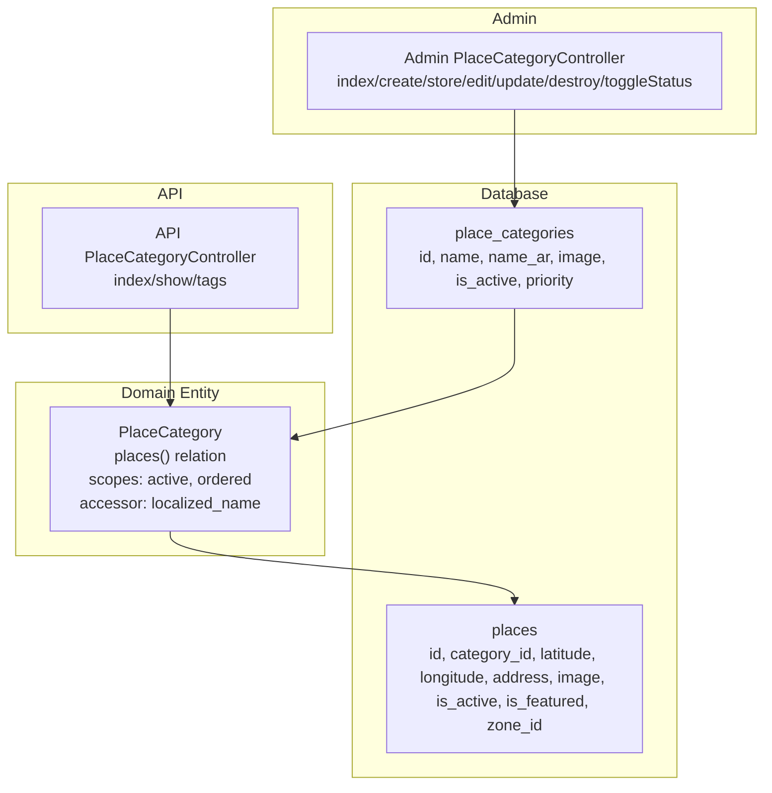

**Diagram sources**
- [2026_01_04_000001_create_place_categories_table.php:11-18](file://Modules/PlacesToVisit/Database/Migrations/2026_01_04_000001_create_place_categories_table.php#L11-L18)
- [2026_01_04_000002_create_places_table.php:11-21](file://Modules/PlacesToVisit/Database/Migrations/2026_01_04_000002_create_places_table.php#L11-L21)
- [PlaceCategory.php:8-45](file://Modules/PlacesToVisit/Entities/PlaceCategory.php#L8-L45)
- [PlaceCategoryController.php:12-106](file://Modules/PlacesToVisit/Http/Controllers/Admin/PlaceCategoryController.php#L12-L106)
- [PlaceCategoryController.php:10-84](file://Modules/PlacesToVisit/Http/Controllers/Api/PlaceCategoryController.php#L10-L84)

**Section sources**
- [2026_01_04_000001_create_place_categories_table.php:11-18](file://Modules/PlacesToVisit/Database/Migrations/2026_01_04_000001_create_place_categories_table.php#L11-L18)
- [2026_01_04_000002_create_places_table.php:11-21](file://Modules/PlacesToVisit/Database/Migrations/2026_01_04_000002_create_places_table.php#L11-L21)
- [PlaceCategory.php:8-45](file://Modules/PlacesToVisit/Entities/PlaceCategory.php#L8-L45)
- [PlaceCategoryController.php:12-106](file://Modules/PlacesToVisit/Http/Controllers/Admin/PlaceCategoryController.php#L12-L106)
- [PlaceCategoryController.php:10-84](file://Modules/PlacesToVisit/Http/Controllers/Api/PlaceCategoryController.php#L10-L84)

## Core Components
- PlaceCategory entity encapsulates category metadata, localization, ordering, and relationship to places.
- Admin controller handles CRUD operations, status toggling, and image management.
- API controller exposes category listings and details with localized names and counts of active places.
- Category model (non-PlacesToVisit) supports multilingual names via Translation morph relations and hierarchical relations for main/sub categories.
- Category repository and service provide list/search, bulk import/export, and slug generation.

**Section sources**
- [PlaceCategory.php:8-45](file://Modules/PlacesToVisit/Entities/PlaceCategory.php#L8-L45)
- [PlaceCategoryController.php:12-106](file://Modules/PlacesToVisit/Http/Controllers/Admin/PlaceCategoryController.php#L12-L106)
- [PlaceCategoryController.php:10-84](file://Modules/PlacesToVisit/Http/Controllers/Api/PlaceCategoryController.php#L10-L84)
- [Category.php:32-191](file://app/Models/Category.php#L32-L191)
- [CategoryRepository.php:18-174](file://app/Repositories/CategoryRepository.php#L18-L174)
- [CategoryService.php:14-100](file://app/Services/CategoryService.php#L14-L100)

## Architecture Overview
The PlaceCategory system follows a layered architecture:
- Data layer: migrations define place_categories and places tables.
- Domain layer: PlaceCategory entity defines relationships and scopes.
- Presentation layer: Admin controller for management, API controller for client consumption.
- Supporting services: CategoryService and CategoryRepository handle data operations and multilingual updates.

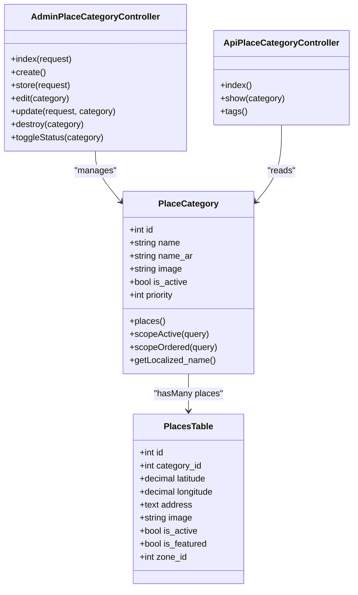

**Diagram sources**
- [PlaceCategory.php:8-45](file://Modules/PlacesToVisit/Entities/PlaceCategory.php#L8-L45)
- [2026_01_04_000002_create_places_table.php:11-21](file://Modules/PlacesToVisit/Database/Migrations/2026_01_04_000002_create_places_table.php#L11-L21)
- [PlaceCategoryController.php:12-106](file://Modules/PlacesToVisit/Http/Controllers/Admin/PlaceCategoryController.php#L12-L106)
- [PlaceCategoryController.php:10-84](file://Modules/PlacesToVisit/Http/Controllers/Api/PlaceCategoryController.php#L10-L84)

## Detailed Component Analysis

### PlaceCategory Entity and Hierarchy
- Hierarchical structure: PlaceCategory belongs to a category-like hierarchy via category_id foreign key on places.
- Localization: localized_name accessor returns Arabic variant when locale is Arabic; otherwise falls back to English name.
- Ordering: scopeOrdered sorts by priority descending for consistent presentation.
- Filtering: scopeActive restricts to active categories only.
- Relationship: places() returns associated places with optional eager loading in API.

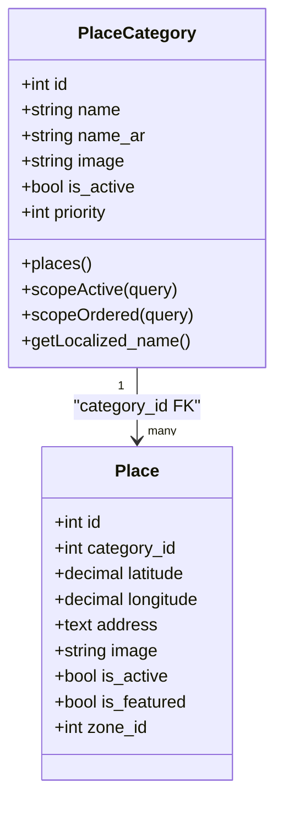

**Diagram sources**
- [PlaceCategory.php:8-45](file://Modules/PlacesToVisit/Entities/PlaceCategory.php#L8-L45)
- [2026_01_04_000002_create_places_table.php:11-21](file://Modules/PlacesToVisit/Database/Migrations/2026_01_04_000002_create_places_table.php#L11-L21)

**Section sources**
- [PlaceCategory.php:8-45](file://Modules/PlacesToVisit/Entities/PlaceCategory.php#L8-L45)
- [2026_01_04_000002_create_places_table.php:11-21](file://Modules/PlacesToVisit/Database/Migrations/2026_01_04_000002_create_places_table.php#L11-L21)

### Admin Management Workflow
- Listing and search: Admin lists categories with pagination and optional search term.
- Creation: Validates name, optional image, and priority; persists category with activation flag.
- Editing: Updates name, optional image replacement, priority, and activation status.
- Deletion: Removes category after deleting associated image; prevents deletion if children exist.
- Status toggle: Switches is_active flag with feedback.

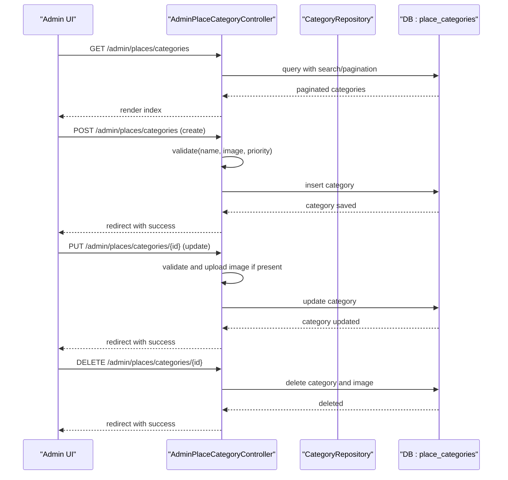

**Diagram sources**
- [PlaceCategoryController.php:12-106](file://Modules/PlacesToVisit/Http/Controllers/Admin/PlaceCategoryController.php#L12-L106)

**Section sources**
- [PlaceCategoryController.php:12-106](file://Modules/PlacesToVisit/Http/Controllers/Admin/PlaceCategoryController.php#L12-L106)

### API Consumption Workflow
- List categories: Returns active categories ordered by priority with localized names and counts of active places.
- Show category: Loads category with active places and their translations/images/tags; returns 404 if inactive.
- Tags: Lists active tags (used alongside categories).

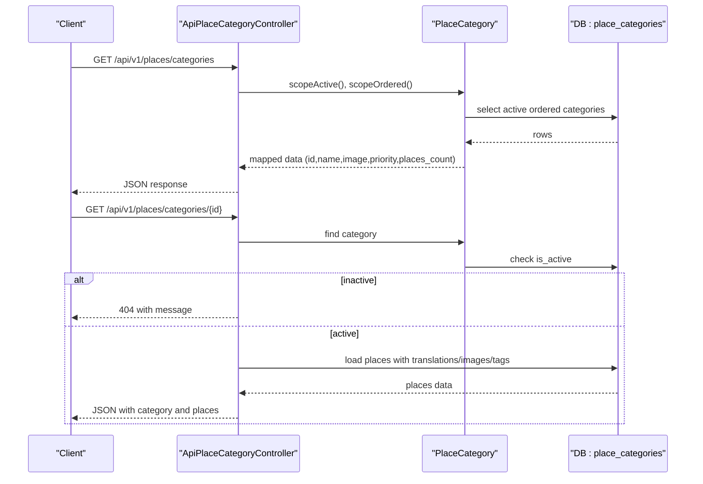

**Diagram sources**
- [PlaceCategoryController.php:10-84](file://Modules/PlacesToVisit/Http/Controllers/Api/PlaceCategoryController.php#L10-L84)
- [PlaceCategory.php:8-45](file://Modules/PlacesToVisit/Entities/PlaceCategory.php#L8-L45)

**Section sources**
- [PlaceCategoryController.php:10-84](file://Modules/PlacesToVisit/Http/Controllers/Api/PlaceCategoryController.php#L10-L84)
- [PlaceCategory.php:8-45](file://Modules/PlacesToVisit/Entities/PlaceCategory.php#L8-L45)

### Multilingual Support for Category Names
- PlacesToVisit categories support bilingual names via name and name_ar fields.
- Localized name resolution occurs in the entity accessor, returning Arabic variant when locale is Arabic.
- Non-PlacesToVisit categories use a Translation morph relation to store localized names per locale.

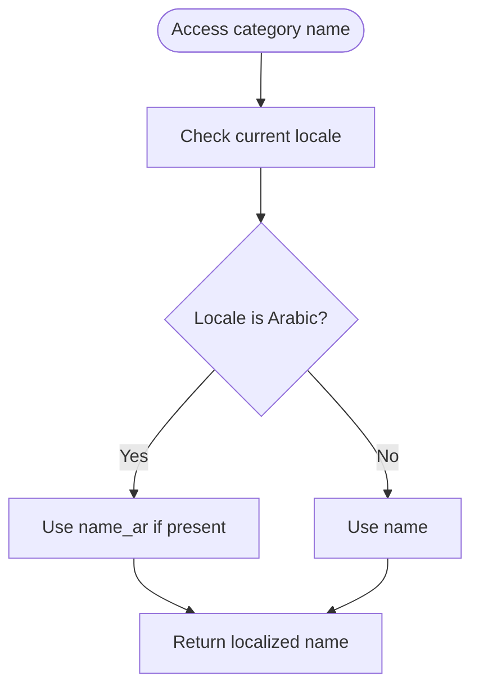

**Diagram sources**
- [PlaceCategory.php:26-32](file://Modules/PlacesToVisit/Entities/PlaceCategory.php#L26-L32)
- [Category.php:162-173](file://app/Models/Category.php#L162-L173)
- [Translation.php:27-30](file://app/Models/Translation.php#L27-L30)

**Section sources**
- [PlaceCategory.php:26-32](file://Modules/PlacesToVisit/Entities/PlaceCategory.php#L26-L32)
- [2026_02_10_000007_add_name_ar_to_place_categories_table.php:11-13](file://Modules/PlacesToVisit/Database/Migrations/2026_02_10_000007_add_name_ar_to_place_categories_table.php#L11-L13)
- [Category.php:162-173](file://app/Models/Category.php#L162-L173)
- [Translation.php:27-30](file://app/Models/Translation.php#L27-L30)

### Category-Based Place Filtering and Search
- API filtering:
  - Filter by category ID: The API provides endpoints to fetch products and stores filtered by category IDs.
  - Pagination and zone-aware queries: API endpoints require zoneId header and accept limit/offset parameters.
- Admin filtering:
  - Category listing supports search by name and position-based filtering.
  - Bulk import/export supports CSV/XLSX with Name, ParentId, Position, Priority, Status, Image, Id fields.
- Place search:
  - Places are linked to categories via category_id; API consumers can filter places by category and zone.

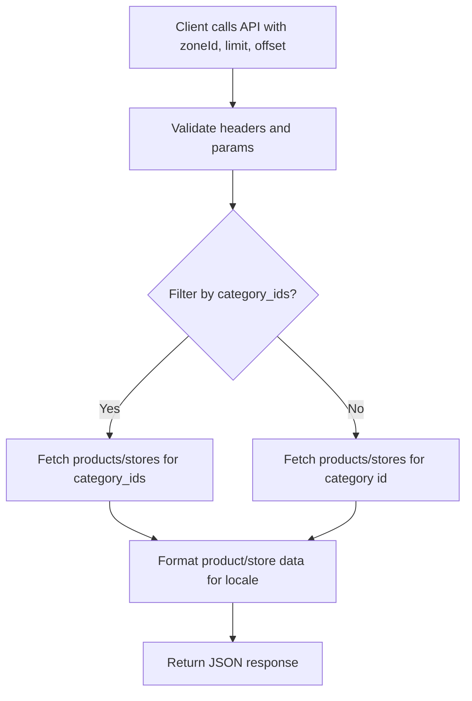

**Diagram sources**
- [CategoryController.php:151-178](file://app/Http/Controllers/Api/V1/CategoryController.php#L151-L178)
- [CategoryController.php:181-237](file://app/Http/Controllers/Api/V1/CategoryController.php#L181-L237)

**Section sources**
- [CategoryController.php:151-178](file://app/Http/Controllers/Api/V1/CategoryController.php#L151-L178)
- [CategoryController.php:181-237](file://app/Http/Controllers/Api/V1/CategoryController.php#L181-L237)
- [CategoryController.php:201-255](file://app/Http/Controllers/Admin/Item/CategoryController.php#L201-L255)

### User Navigation Patterns
- Browse categories: Clients call the categories endpoint to discover active categories with localized names and place counts.
- Drill-down: Clients call the category show endpoint to load a category and its active places with translations and images.
- Explore places: Clients can filter products and stores by category IDs and zone to navigate around places of interest.

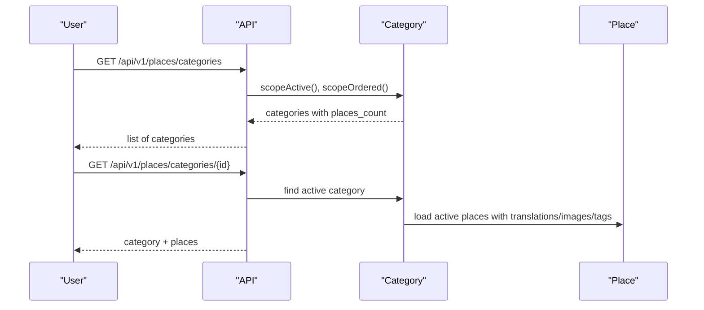

**Diagram sources**
- [PlaceCategoryController.php:16-63](file://Modules/PlacesToVisit/Http/Controllers/Api/PlaceCategoryController.php#L16-L63)

**Section sources**
- [PlaceCategoryController.php:16-63](file://Modules/PlacesToVisit/Http/Controllers/Api/PlaceCategoryController.php#L16-L63)

### Moderation, Approval Workflows, and Administrative Oversight
- Place visibility: Places include is_active flag; API only returns active places under active categories.
- Category visibility: Admin can toggle is_active via the admin controller; API excludes inactive categories from listings.
- Place curation: Places include is_featured flag; API responses can surface featured places depending on consumer logic.
- Place zones: Places optionally belong to zones; API endpoints require zoneId header to scope results.

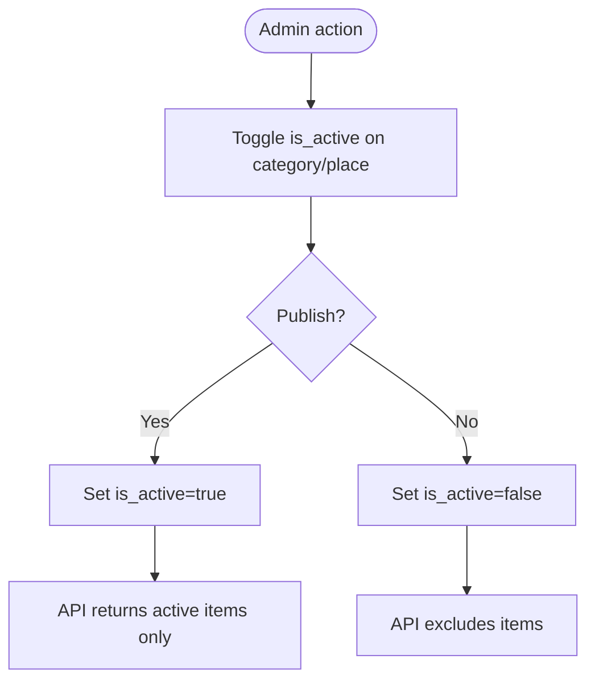

**Diagram sources**
- [PlaceCategoryController.php:99-105](file://Modules/PlacesToVisit/Http/Controllers/Admin/PlaceCategoryController.php#L99-L105)
- [PlaceCategoryController.php:43-48](file://Modules/PlacesToVisit/Http/Controllers/Api/PlaceCategoryController.php#L43-L48)
- [2026_01_04_000002_create_places_table.php:11-21](file://Modules/PlacesToVisit/Database/Migrations/2026_01_04_000002_create_places_table.php#L11-L21)

**Section sources**
- [PlaceCategoryController.php:99-105](file://Modules/PlacesToVisit/Http/Controllers/Admin/PlaceCategoryController.php#L99-L105)
- [PlaceCategoryController.php:43-48](file://Modules/PlacesToVisit/Http/Controllers/Api/PlaceCategoryController.php#L43-L48)
- [2026_01_04_000002_create_places_table.php:11-21](file://Modules/PlacesToVisit/Database/Migrations/2026_01_04_000002_create_places_table.php#L11-L21)

### Category Tree Structure and Hierarchical Organization
- PlacesToVisit categories are flat in schema (place_categories) with no explicit parent_id field.
- Non-PlacesToVisit categories (App\Models\Category) support hierarchical organization via parent_id and position fields, with childes and parent relations.
- Indexing: categories table has indexes on parent_id and name to optimize lookups.

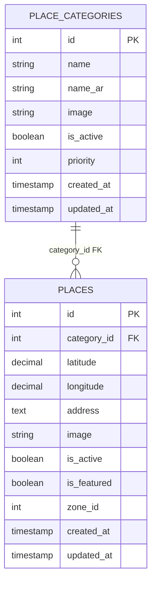

**Diagram sources**
- [2026_01_04_000001_create_place_categories_table.php:11-18](file://Modules/PlacesToVisit/Database/Migrations/2026_01_04_000001_create_place_categories_table.php#L11-L18)
- [2026_01_04_000002_create_places_table.php:11-21](file://Modules/PlacesToVisit/Database/Migrations/2026_01_04_000002_create_places_table.php#L11-L21)

**Section sources**
- [2026_01_04_000001_create_place_categories_table.php:11-18](file://Modules/PlacesToVisit/Database/Migrations/2026_01_04_000001_create_place_categories_table.php#L11-L18)
- [2026_01_04_000002_create_places_table.php:11-21](file://Modules/PlacesToVisit/Database/Migrations/2026_01_04_000002_create_places_table.php#L11-L21)
- [Category.php:95-103](file://app/Models/Category.php#L95-L103)
- [2025_07_27_152011_add_index_to_categories_table.php:14-17](file://database/migrations/2025_07_27_152011_add_index_to_categories_table.php#L14-L17)

## Dependency Analysis
- PlaceCategory depends on:
  - Places table via category_id foreign key.
  - Admin controller for CRUD and status management.
  - API controller for client consumption.
- Category model (non-PlacesToVisit) depends on:
  - Translation morph relation for localized names.
  - Storage morph relation for images.
  - Global scopes for translations and storage.
  - Repository and service for list/search and import/export.

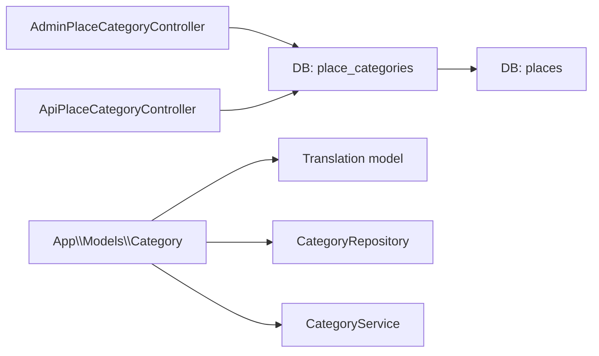

**Diagram sources**
- [PlaceCategoryController.php:12-106](file://Modules/PlacesToVisit/Http/Controllers/Admin/PlaceCategoryController.php#L12-L106)
- [PlaceCategoryController.php:10-84](file://Modules/PlacesToVisit/Http/Controllers/Api/PlaceCategoryController.php#L10-L84)
- [2026_01_04_000001_create_place_categories_table.php:11-18](file://Modules/PlacesToVisit/Database/Migrations/2026_01_04_000001_create_place_categories_table.php#L11-L18)
- [2026_01_04_000002_create_places_table.php:11-21](file://Modules/PlacesToVisit/Database/Migrations/2026_01_04_000002_create_places_table.php#L11-L21)
- [Category.php:65-68](file://app/Models/Category.php#L65-L68)
- [Translation.php:27-30](file://app/Models/Translation.php#L27-L30)
- [CategoryRepository.php:18-174](file://app/Repositories/CategoryRepository.php#L18-L174)
- [CategoryService.php:14-100](file://app/Services/CategoryService.php#L14-L100)

**Section sources**
- [Category.php:65-68](file://app/Models/Category.php#L65-L68)
- [Translation.php:27-30](file://app/Models/Translation.php#L27-L30)
- [CategoryRepository.php:18-174](file://app/Repositories/CategoryRepository.php#L18-L174)
- [CategoryService.php:14-100](file://app/Services/CategoryService.php#L14-L100)

## Performance Considerations
- Indexing: categories table has indexes on parent_id and name to speed up hierarchical queries and name searches.
- Eager loading: API controllers load related places and translations to avoid N+1 queries.
- Pagination: Admin and API controllers paginate results to limit payload sizes.
- Slug generation: Category model auto-generates slugs on creation to improve SEO-friendly URLs.

**Section sources**
- [2025_07_27_152011_add_index_to_categories_table.php:14-17](file://database/migrations/2025_07_27_152011_add_index_to_categories_table.php#L14-L17)
- [PlaceCategoryController.php:18-34](file://Modules/PlacesToVisit/Http/Controllers/Api/PlaceCategoryController.php#L18-L34)
- [Category.php:121-143](file://app/Models/Category.php#L121-L143)

## Troubleshooting Guide
- API requires zoneId: Several API endpoints validate presence of zoneId header; missing or invalid headers produce 403 responses with error details.
- Category not found: API show endpoint returns 404 when category is inactive or not found.
- Bulk import validation: Admin bulk import validates file format and required fields; errors are surfaced via Toastr messages.
- Deletion prevention: Admin cannot delete categories that still have child entities; a warning is returned.

**Section sources**
- [CategoryController.php:124-148](file://app/Http/Controllers/Api/V1/CategoryController.php#L124-L148)
- [PlaceCategoryController.php:43-48](file://Modules/PlacesToVisit/Http/Controllers/Api/PlaceCategoryController.php#L43-L48)
- [CategoryController.php:201-255](file://app/Http/Controllers/Admin/Item/CategoryController.php#L201-L255)
- [CategoryRepository.php:162-173](file://app/Repositories/CategoryRepository.php#L162-L173)

## Conclusion
The PlaceCategory system provides a clean separation between PlacesToVisit-specific categories and the broader category infrastructure. It supports multilingual names, hierarchical organization for non-PlacesToVisit categories, robust admin management, and efficient API consumption with localized data and place counts. Moderation is enforced via is_active flags and API filtering, while indexing and eager loading ensure responsive performance.