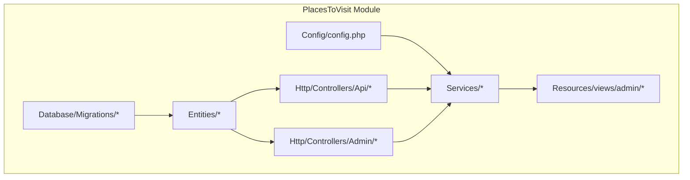
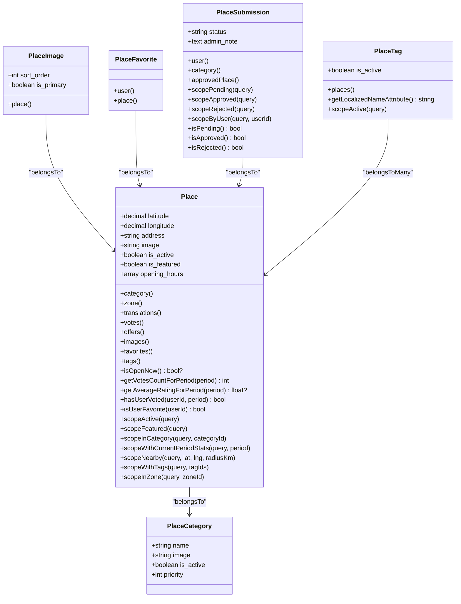
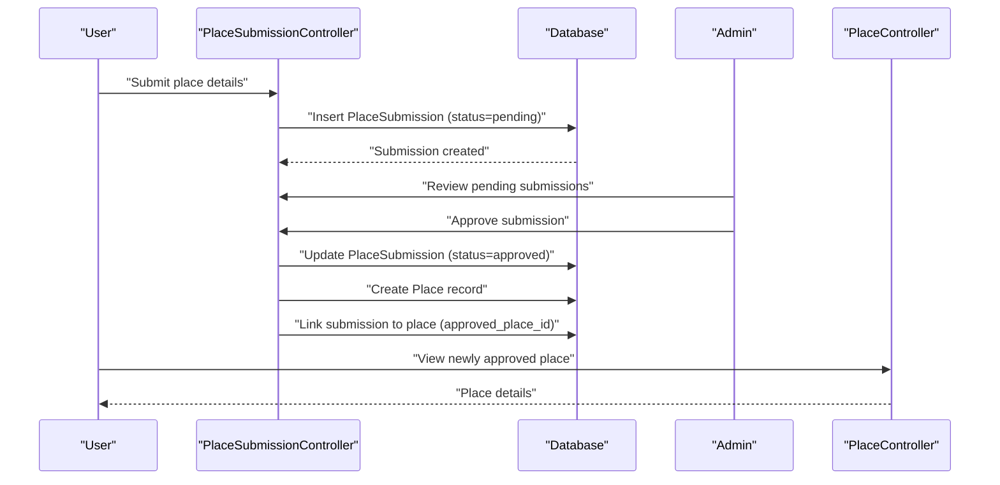
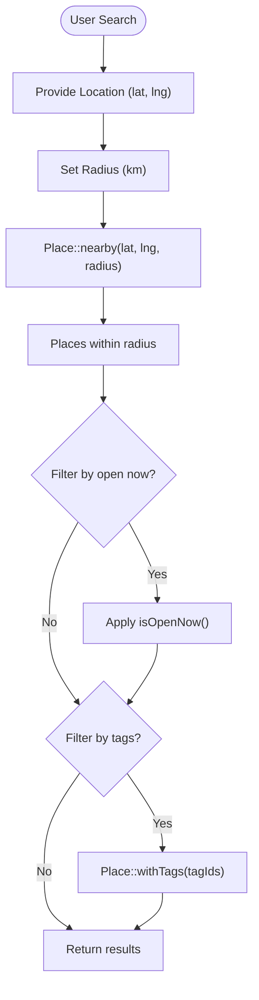
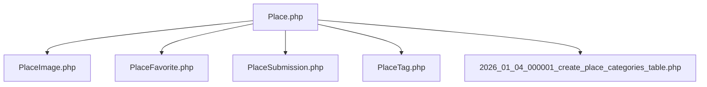

# Place Model and Management

<cite>
**Referenced Files in This Document**
- [module.json](file://Modules/PlacesToVisit/module.json)
- [config.php](file://Modules/PlacesToVisit/Config/config.php)
- [Place.php](file://Modules/PlacesToVisit/Entities/Place.php)
- [PlaceImage.php](file://Modules/PlacesToVisit/Entities/PlaceImage.php)
- [PlaceFavorite.php](file://Modules/PlacesToVisit/Entities/PlaceFavorite.php)
- [PlaceSubmission.php](file://Modules/PlacesToVisit/Entities/PlaceSubmission.php)
- [PlaceTag.php](file://Modules/PlacesToVisit/Entities/PlaceTag.php)
- [2026_01_04_000002_create_places_table.php](file://Modules/PlacesToVisit/Database/Migrations/2026_01_04_000002_create_places_table.php)
- [2026_02_10_000002_create_place_images_table.php](file://Modules/PlacesToVisit/Database/Migrations/2026_02_10_000002_create_place_images_table.php)
- [2026_02_10_000003_create_place_favorites_table.php](file://Modules/PlacesToVisit/Database/Migrations/2026_02_10_000003_create_place_favorites_table.php)
- [2026_02_10_000004_create_place_submissions_table.php](file://Modules/PlacesToVisit/Database/Migrations/2026_02_10_000004_create_place_submissions_table.php)
- [2026_01_04_000001_create_place_categories_table.php](file://Modules/PlacesToVisit/Database/Migrations/2026_01_04_000001_create_place_categories_table.php)
- [PlaceController.php](file://Modules/PlacesToVisit/Http/Controllers/Api/PlaceController.php)
- [PlaceSubmissionController.php](file://Modules/PlacesToVisit/Http/Controllers/Api/PlaceSubmissionController.php)
- [PlaceCategoryController.php](file://Modules/PlacesToVisit/Http/Controllers/Admin/PlaceCategoryController.php)
- [PlaceController.php](file://Modules/PlacesToVisit/Http/Controllers/Admin/PlaceController.php)
- [PlaceSubmissionController.php](file://Modules/PlacesToVisit/Http/Controllers/Admin/PlaceSubmissionController.php)
- [LeaderboardController.php](file://Modules/PlacesToVisit/Http/Controllers/Admin/LeaderboardController.php)
- [LeaderboardService.php](file://Modules/PlacesToVisit/Services/LeaderboardService.php)
- [VotingService.php](file://Modules/PlacesToVisit/Services/VotingService.php)
- [PlaceXpService.php](file://Modules/PlacesToVisit/Services/PlaceXpService.php)
</cite>

## Table of Contents
1. [Introduction](#introduction)
2. [Project Structure](#project-structure)
3. [Core Components](#core-components)
4. [Architecture Overview](#architecture-overview)
5. [Detailed Component Analysis](#detailed-component-analysis)
6. [Dependency Analysis](#dependency-analysis)
7. [Performance Considerations](#performance-considerations)
8. [Troubleshooting Guide](#troubleshooting-guide)
9. [Conclusion](#conclusion)

## Introduction
This document provides comprehensive documentation for the Place model and management system within the PlacesToVisit module. It covers the Place entity structure, relationships with supporting entities (PlaceImage, PlaceFavorite, PlaceSubmission, PlaceTag), submission and approval workflows, moderation systems, geolocation integration, search and discovery features, and the administrative interface for managing place listings.

The module enables local place discovery with voting, leaderboards, trending features, and user-generated content via submissions and tags. Configuration-driven policies govern leaderboard thresholds, XP rewards, moderation flags, and submission limits.

## Project Structure
The PlacesToVisit module follows a modular Laravel structure with dedicated directories for configuration, database migrations, entities (models), HTTP controllers (API and Admin), services, and views.

**Diagram sources**
- [module.json:1-17](file://Modules/PlacesToVisit/module.json#L1-L17)
- [config.php:1-53](file://Modules/PlacesToVisit/Config/config.php#L1-L53)

**Section sources**
- [module.json:1-17](file://Modules/PlacesToVisit/module.json#L1-L17)
- [config.php:1-53](file://Modules/PlacesToVisit/Config/config.php#L1-L53)

## Core Components
This section documents the primary data structures and their relationships, focusing on the Place entity and its associated entities.

- Place entity: central model representing a location with geolocation, activity flags, category linkage, and localized metadata.
- PlaceImage: attached images for a place with ordering and primary image designation.
- PlaceFavorite: user favorites linking users to places.
- PlaceSubmission: user-generated place submissions awaiting moderation.
- PlaceTag: taxonomy tags for categorizing places with localization support.
- PlaceCategory: hierarchical categories for places.
- Supporting services: leaderboard, trending, voting, and XP reward calculations.

Key implementation references:
- Place entity definition and relationships: [Place.php:12-218](file://Modules/PlacesToVisit/Entities/Place.php#L12-L218)
- PlaceImage model: [PlaceImage.php:9-32](file://Modules/PlacesToVisit/Entities/PlaceImage.php#L9-L32)
- PlaceFavorite model: [PlaceFavorite.php:9-25](file://Modules/PlacesToVisit/Entities/PlaceFavorite.php#L9-L25)
- PlaceSubmission model: [PlaceSubmission.php:9-86](file://Modules/PlacesToVisit/Entities/PlaceSubmission.php#L9-L86)
- PlaceTag model: [PlaceTag.php:8-42](file://Modules/PlacesToVisit/Entities/PlaceTag.php#L8-L42)
- PlaceCategory model: [2026_01_04_000001_create_place_categories_table.php:7-25](file://Modules/PlacesToVisit/Database/Migrations/2026_01_04_000001_create_place_categories_table.php#L7-L25)

**Section sources**
- [Place.php:12-218](file://Modules/PlacesToVisit/Entities/Place.php#L12-L218)
- [PlaceImage.php:9-32](file://Modules/PlacesToVisit/Entities/PlaceImage.php#L9-L32)
- [PlaceFavorite.php:9-25](file://Modules/PlacesToVisit/Entities/PlaceFavorite.php#L9-L25)
- [PlaceSubmission.php:9-86](file://Modules/PlacesToVisit/Entities/PlaceSubmission.php#L9-L86)
- [PlaceTag.php:8-42](file://Modules/PlacesToVisit/Entities/PlaceTag.php#L8-L42)
- [2026_01_04_000001_create_place_categories_table.php:7-25](file://Modules/PlacesToVisit/Database/Migrations/2026_01_04_000001_create_place_categories_table.php#L7-L25)

## Architecture Overview
The Place management system integrates models, controllers, services, and configuration to deliver discovery, submission, moderation, and ranking features.

**Diagram sources**
- [Place.php:12-218](file://Modules/PlacesToVisit/Entities/Place.php#L12-L218)
- [PlaceImage.php:9-32](file://Modules/PlacesToVisit/Entities/PlaceImage.php#L9-L32)
- [PlaceFavorite.php:9-25](file://Modules/PlacesToVisit/Entities/PlaceFavorite.php#L9-L25)
- [PlaceSubmission.php:9-86](file://Modules/PlacesToVisit/Entities/PlaceSubmission.php#L9-L86)
- [PlaceTag.php:8-42](file://Modules/PlacesToVisit/Entities/PlaceTag.php#L8-L42)
- [2026_01_04_000001_create_place_categories_table.php:7-25](file://Modules/PlacesToVisit/Database/Migrations/2026_01_04_000001_create_place_categories_table.php#L7-L25)

## Detailed Component Analysis

### Place Entity
The Place entity encapsulates location data, activity flags, and metadata. It supports localization via PlaceTranslation, voting statistics, favorites, images, offers, tags, and zone association.

Key capabilities:
- Geolocation: latitude and longitude stored with decimal precision; includes a nearby scope using the Haversine formula.
- Activity and visibility: is_active and is_featured flags.
- Opening hours: JSON structure enabling isOpenNow evaluation.
- Localization: dynamic title and description via translation lookup.
- Statistics: monthly vote counts and average ratings with scoping by period.
- Relationships: category, zone, translations, votes, offers, images, favorites, tags.
- User interactions: hasUserVoted, isUserFavorite helpers.

Practical usage examples (paths only):
- Create a place with geolocation and category: [PlaceController.php](file://Modules/PlacesToVisit/Http/Controllers/Api/PlaceController.php)
- Retrieve nearby places: [Place.php:197-206](file://Modules/PlacesToVisit/Entities/Place.php#L197-L206)
- Get localized title/description: [Place.php:93-108](file://Modules/PlacesToVisit/Entities/Place.php#L93-L108)
- Check if currently open: [Place.php:115-138](file://Modules/PlacesToVisit/Entities/Place.php#L115-L138)

**Section sources**
- [Place.php:12-218](file://Modules/PlacesToVisit/Entities/Place.php#L12-L218)

### PlaceImage
Represents media assets for a place with ordering and primary image designation. Provides a full URL accessor for frontend consumption.

Key capabilities:
- Foreign key to Place.
- Sort order and primary flag for gallery presentation.
- Full URL generation for images.

Practical usage examples (paths only):
- Attach images to a place: [PlaceImage.php:22-30](file://Modules/PlacesToVisit/Entities/PlaceImage.php#L22-L30)

**Section sources**
- [PlaceImage.php:9-32](file://Modules/PlacesToVisit/Entities/PlaceImage.php#L9-L32)

### PlaceFavorite
Tracks user favorites for places with a unique constraint preventing duplicate entries.

Key capabilities:
- Belongs to User and Place.
- Unique composite index on user_id and place_id.

Practical usage examples (paths only):
- Toggle favorite status: [PlaceFavorite.php:15-23](file://Modules/PlacesToVisit/Entities/PlaceFavorite.php#L15-L23)

**Section sources**
- [PlaceFavorite.php:9-25](file://Modules/PlacesToVisit/Entities/PlaceFavorite.php#L9-L25)

### PlaceSubmission
Handles user-generated place submissions with moderation states and optional linkage to approved Place records.

Key capabilities:
- Status lifecycle: pending, approved, rejected.
- Links to User, PlaceCategory, and optionally to created Place upon approval.
- Accessor for submission image URL.
- Scope helpers for filtering by status and user.

Moderation workflow:
- Submission creation by user.
- Admin review and action (approve/reject).
- Optional creation of Place record and linkage via approved_place_id.

Practical usage examples (paths only):
- Submit a new place: [PlaceSubmissionController.php](file://Modules/PlacesToVisit/Http/Controllers/Api/PlaceSubmissionController.php)
- Approve a submission and create Place: [PlaceSubmissionController.php](file://Modules/PlacesToVisit/Http/Controllers/Admin/PlaceSubmissionController.php)
- Filter submissions by status: [PlaceSubmission.php:49-67](file://Modules/PlacesToVisit/Entities/PlaceSubmission.php#L49-L67)

**Section sources**
- [PlaceSubmission.php:9-86](file://Modules/PlacesToVisit/Entities/PlaceSubmission.php#L9-L86)

### PlaceTag
Provides taxonomy for places with active status and localized naming.

Key capabilities:
- Many-to-many relationship with Place via pivot table.
- Localized name resolution (supports Arabic fallback).
- Active scope for filtering enabled tags.

Practical usage examples (paths only):
- Assign tags to a place: [PlaceTag.php:22-25](file://Modules/PlacesToVisit/Entities/PlaceTag.php#L22-L25)
- List active tags: [PlaceTag.php:37-40](file://Modules/PlacesToVisit/Entities/PlaceTag.php#L37-L40)

**Section sources**
- [PlaceTag.php:8-42](file://Modules/PlacesToVisit/Entities/PlaceTag.php#L8-L42)

### PlaceCategory
Defines categories for places with activation and priority controls.

Key capabilities:
- Name, image, is_active, priority fields.
- Used by Place and PlaceSubmission.

Practical usage examples (paths only):
- Manage categories via admin: [PlaceCategoryController.php](file://Modules/PlacesToVisit/Http/Controllers/Admin/PlaceCategoryController.php)

**Section sources**
- [2026_01_04_000001_create_place_categories_table.php:7-25](file://Modules/PlacesToVisit/Database/Migrations/2026_01_04_000001_create_place_categories_table.php#L7-L25)

### Submission Workflow and Moderation
The submission workflow integrates PlaceSubmission with Place creation and approval.

**Diagram sources**
- [PlaceSubmission.php:9-86](file://Modules/PlacesToVisit/Entities/PlaceSubmission.php#L9-L86)
- [PlaceSubmissionController.php](file://Modules/PlacesToVisit/Http/Controllers/Admin/PlaceSubmissionController.php)
- [PlaceController.php](file://Modules/PlacesToVisit/Http/Controllers/Api/PlaceController.php)

**Section sources**
- [PlaceSubmission.php:9-86](file://Modules/PlacesToVisit/Entities/PlaceSubmission.php#L9-L86)
- [PlaceSubmissionController.php](file://Modules/PlacesToVisit/Http/Controllers/Admin/PlaceSubmissionController.php)

### Geolocation Integration and Search
Geolocation features include:
- Haversine-based nearby search with configurable radius.
- Opening hours evaluation for current day/time.
- Zone-based scoping for place availability.

**Diagram sources**
- [Place.php:197-206](file://Modules/PlacesToVisit/Entities/Place.php#L197-L206)
- [Place.php:115-138](file://Modules/PlacesToVisit/Entities/Place.php#L115-L138)
- [Place.php:208-211](file://Modules/PlacesToVisit/Entities/Place.php#L208-L211)

**Section sources**
- [Place.php:197-206](file://Modules/PlacesToVisit/Entities/Place.php#L197-L206)
- [Place.php:115-138](file://Modules/PlacesToVisit/Entities/Place.php#L115-L138)
- [Place.php:208-211](file://Modules/PlacesToVisit/Entities/Place.php#L208-L211)

### Administrative Interface
Administrators manage:
- Place listings (view, edit, activate/deactivate).
- Categories (create, update, activate/deactivate).
- Submissions (review, approve, reject).
- Leaderboard configuration and visibility.

Key admin controllers:
- Place management: [PlaceController.php](file://Modules/PlacesToVisit/Http/Controllers/Admin/PlaceController.php)
- Category management: [PlaceCategoryController.php](file://Modules/PlacesToVisit/Http/Controllers/Admin/PlaceCategoryController.php)
- Submission moderation: [PlaceSubmissionController.php](file://Modules/PlacesToVisit/Http/Controllers/Admin/PlaceSubmissionController.php)
- Leaderboard administration: [LeaderboardController.php](file://Modules/PlacesToVisit/Http/Controllers/Admin/LeaderboardController.php)

**Section sources**
- [PlaceController.php](file://Modules/PlacesToVisit/Http/Controllers/Admin/PlaceController.php)
- [PlaceCategoryController.php](file://Modules/PlacesToVisit/Http/Controllers/Admin/PlaceCategoryController.php)
- [PlaceSubmissionController.php](file://Modules/PlacesToVisit/Http/Controllers/Admin/PlaceSubmissionController.php)
- [LeaderboardController.php](file://Modules/PlacesToVisit/Http/Controllers/Admin/LeaderboardController.php)

### Configuration and Policies
Configuration keys define system behavior:
- Leaderboard thresholds and caching.
- Trending window and limits.
- XP rewards for activities.
- Moderation report threshold.
- Submission limits and image constraints.

Configuration reference:
- [config.php:3-52](file://Modules/PlacesToVisit/Config/config.php#L3-L52)

**Section sources**
- [config.php:3-52](file://Modules/PlacesToVisit/Config/config.php#L3-L52)

## Dependency Analysis
The Place model and related components form a cohesive ecosystem with clear boundaries between models, controllers, services, and configuration.

**Diagram sources**
- [Place.php:12-218](file://Modules/PlacesToVisit/Entities/Place.php#L12-L218)
- [PlaceImage.php:9-32](file://Modules/PlacesToVisit/Entities/PlaceImage.php#L9-L32)
- [PlaceFavorite.php:9-25](file://Modules/PlacesToVisit/Entities/PlaceFavorite.php#L9-L25)
- [PlaceSubmission.php:9-86](file://Modules/PlacesToVisit/Entities/PlaceSubmission.php#L9-L86)
- [PlaceTag.php:8-42](file://Modules/PlacesToVisit/Entities/PlaceTag.php#L8-L42)
- [2026_01_04_000001_create_place_categories_table.php:7-25](file://Modules/PlacesToVisit/Database/Migrations/2026_01_04_000001_create_place_categories_table.php#L7-L25)

**Section sources**
- [Place.php:12-218](file://Modules/PlacesToVisit/Entities/Place.php#L12-L218)
- [PlaceImage.php:9-32](file://Modules/PlacesToVisit/Entities/PlaceImage.php#L9-L32)
- [PlaceFavorite.php:9-25](file://Modules/PlacesToVisit/Entities/PlaceFavorite.php#L9-L25)
- [PlaceSubmission.php:9-86](file://Modules/PlacesToVisit/Entities/PlaceSubmission.php#L9-L86)
- [PlaceTag.php:8-42](file://Modules/PlacesToVisit/Entities/PlaceTag.php#L8-L42)
- [2026_01_04_000001_create_place_categories_table.php:7-25](file://Modules/PlacesToVisit/Database/Migrations/2026_01_04_000001_create_place_categories_table.php#L7-L25)

## Performance Considerations
- Indexing: PlaceSubmission includes indices on status and user_id to optimize moderation queries.
- Aggregation scopes: Place::withCurrentPeriodStats precomputes counts and averages for efficient rendering.
- Caching: Leaderboard configuration includes cache duration settings to reduce repeated computation.
- Distance calculations: Haversine formula is used for nearby search; consider spatial indexing for very large datasets.

Recommendations:
- Add spatial indexes on latitude/longitude for frequent proximity queries.
- Cache leaderboard results using configured TTL.
- Paginate search results and limit nearby radius for responsiveness.

**Section sources**
- [2026_02_10_000004_create_place_submissions_table.php:27-28](file://Modules/PlacesToVisit/Database/Migrations/2026_02_10_000004_create_place_submissions_table.php#L27-L28)
- [Place.php:188-195](file://Modules/PlacesToVisit/Entities/Place.php#L188-L195)
- [config.php:8-15](file://Modules/PlacesToVisit/Config/config.php#L8-L15)

## Troubleshooting Guide
Common issues and resolutions:
- Place not appearing in search:
  - Verify is_active flag and category association.
  - Confirm coordinates are set and within expected ranges.
  - Check zone assignment if applicable.
- Nearby search returns empty:
  - Adjust radius or verify coordinates accuracy.
  - Ensure Place::nearby is used with appropriate parameters.
- Submission not visible to admins:
  - Confirm status is pending and indices are present.
  - Check user_id filtering in moderation views.
- Favorites not toggling:
  - Ensure unique constraint is respected and user/place IDs are valid.
- Tags not displaying:
  - Verify PlaceTag is_active and localized name fallback.

Operational references:
- Submission status filtering: [PlaceSubmission.php:49-67](file://Modules/PlacesToVisit/Entities/PlaceSubmission.php#L49-L67)
- Favorite uniqueness: [2026_02_10_000003_create_place_favorites_table.php:17](file://Modules/PlacesToVisit/Database/Migrations/2026_02_10_000003_create_place_favorites_table.php#L17)
- Tag localization: [PlaceTag.php:29-33](file://Modules/PlacesToVisit/Entities/PlaceTag.php#L29-L33)

**Section sources**
- [PlaceSubmission.php:49-67](file://Modules/PlacesToVisit/Entities/PlaceSubmission.php#L49-L67)
- [2026_02_10_000003_create_place_favorites_table.php:17](file://Modules/PlacesToVisit/Database/Migrations/2026_02_10_000003_create_place_favorites_table.php#L17)
- [PlaceTag.php:29-33](file://Modules/PlacesToVisit/Entities/PlaceTag.php#L29-L33)

## Conclusion
The Place model and management system provide a robust foundation for local place discovery, user engagement, and community-driven content moderation. With clear entity relationships, configurable policies, and administrative tools, the system supports scalable growth while maintaining quality and relevance through voting, tagging, and submission workflows.