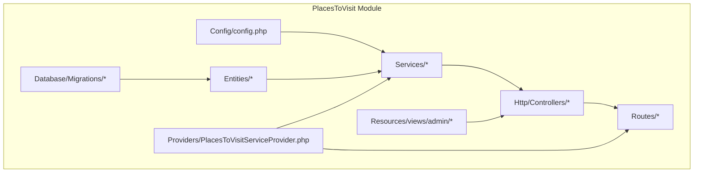
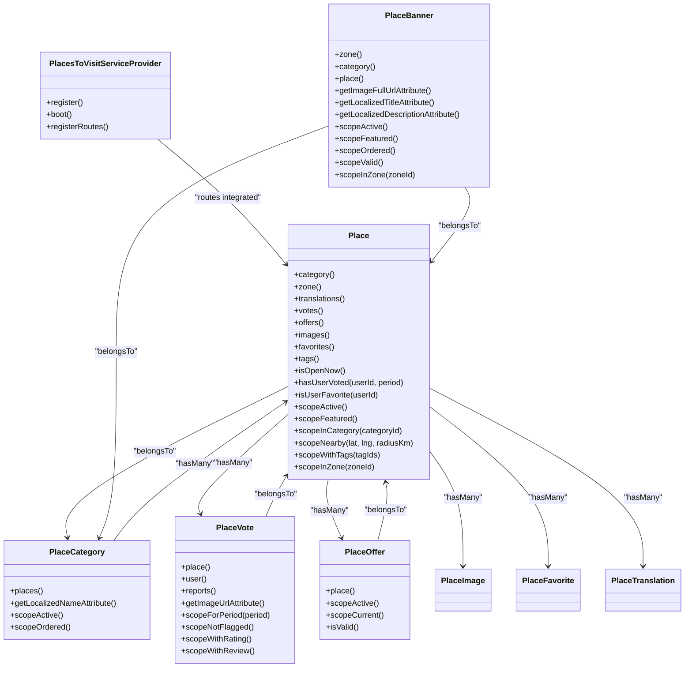
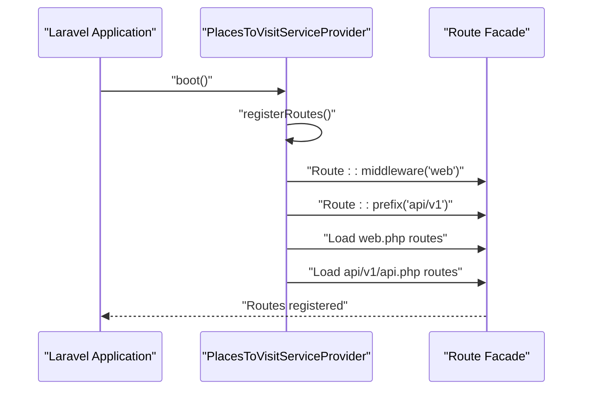
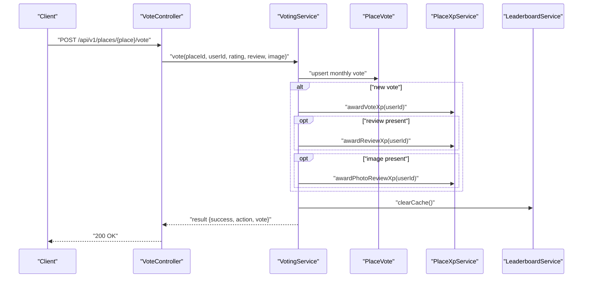
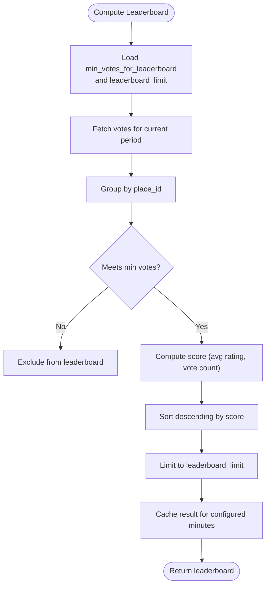
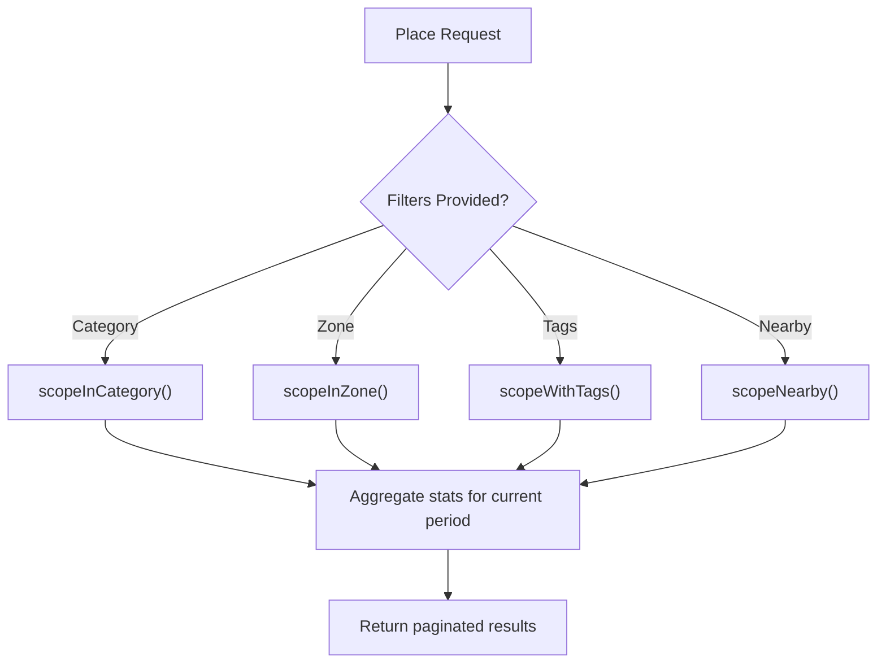
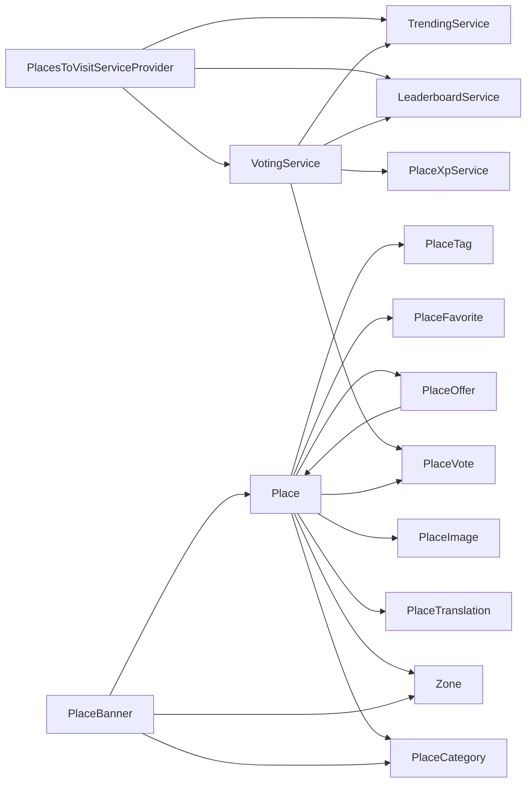
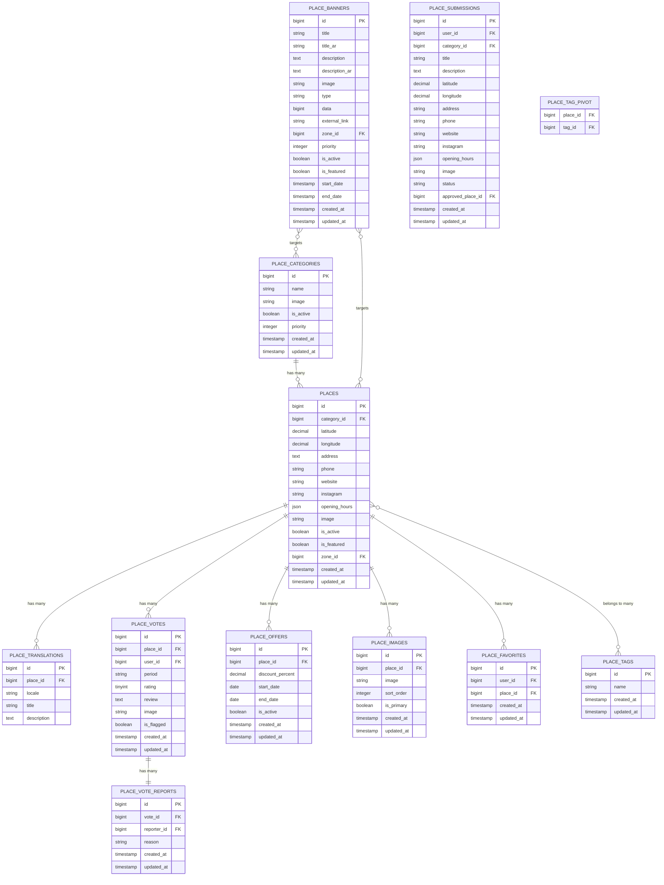

# PlacesToVisit Module

<cite>
**Referenced Files in This Document**
- [module.json](file://Modules/PlacesToVisit/module.json)
- [composer.json](file://Modules/PlacesToVisit/composer.json)
- [config.php](file://Modules/PlacesToVisit/Config/config.php)
- [Place.php](file://Modules/PlacesToVisit/Entities/Place.php)
- [PlaceCategory.php](file://Modules/PlacesToVisit/Entities/PlaceCategory.php)
- [PlaceVote.php](file://Modules/PlacesToVisit/Entities/PlaceVote.php)
- [PlaceBanner.php](file://Modules/PlacesToVisit/Entities/PlaceBanner.php)
- [PlaceOffer.php](file://Modules/PlacesToVisit/Entities/PlaceOffer.php)
- [PlaceTranslation.php](file://Modules/PlacesToVisit/Entities/PlaceTranslation.php)
- [PlaceImage.php](file://Modules/PlacesToVisit/Entities/PlaceImage.php)
- [PlaceFavorite.php](file://Modules/PlacesToVisit/Entities/PlaceFavorite.php)
- [PlaceSubmission.php](file://Modules/PlacesToVisit/Entities/PlaceSubmission.php)
- [VotingService.php](file://Modules/PlacesToVisit/Services/VotingService.php)
- [LeaderboardService.php](file://Modules/PlacesToVisit/Services/LeaderboardService.php)
- [PlaceXpService.php](file://Modules/PlacesToVisit/Services/PlaceXpService.php)
- [TrendingService.php](file://Modules/PlacesToVisit/Services/TrendingService.php)
- [2026_01_04_000001_create_place_categories_table.php](file://Modules/PlacesToVisit/Database/Migrations/2026_01_04_000001_create_place_categories_table.php)
- [2026_01_04_000002_create_places_table.php](file://Modules/PlacesToVisit/Database/Migrations/2026_01_04_000002_create_places_table.php)
- [2026_01_04_000003_create_place_translations_table.php](file://Modules/PlacesToVisit/Database/Migrations/2026_01_04_000003_create_place_translations_table.php)
- [2026_01_04_000004_create_place_votes_table.php](file://Modules/PlacesToVisit/Database/Migrations/2026_01_04_000004_create_place_votes_table.php)
- [2026_01_04_000005_create_place_offers_table.php](file://Modules/PlacesToVisit/Database/Migrations/2026_01_04_000005_create_place_offers_table.php)
- [2026_01_04_000006_create_place_banners_table.php](file://Modules/PlacesToVisit/Database/Migrations/2026_01_04_000006_create_place_banners_table.php)
- [2026_02_10_000001_add_details_to_places_table.php](file://Modules/PlacesToVisit/Database/Migrations/2026_02_10_000001_add_details_to_places_table.php)
- [2026_02_10_000002_create_place_images_table.php](file://Modules/PlacesToVisit/Database/Migrations/2026_02_10_000002_create_place_images_table.php)
- [2026_02_10_000003_create_place_favorites_table.php](file://Modules/PlacesToVisit/Database/Migrations/2026_02_10_000003_create_place_favorites_table.php)
- [2026_02_10_000004_create_place_submissions_table.php](file://Modules/PlacesToVisit/Database/Migrations/2026_02_10_000004_create_place_submissions_table.php)
- [2026_02_10_000005_create_place_tags_tables.php](file://Modules/PlacesToVisit/Database/Migrations/2026_02_10_000005_create_place_tags_tables.php)
- [2026_02_10_000006_create_place_vote_reports_table.php](file://Modules/PlacesToVisit/Database/Migrations/2026_02_10_000006_create_place_vote_reports_table.php)
- [2026_02_10_000007_add_name_ar_to_place_categories_table.php](file://Modules/PlacesToVisit/Database/Migrations/2026_02_10_000007_add_name_ar_to_place_categories_table.php)
- [2026_02_10_000008_add_image_to_place_votes_table.php](file://Modules/PlacesToVisit/Database/Migrations/2026_02_10_000008_add_image_to_place_votes_table.php)
- [2026_04_02_000001_add_zone_id_to_places_table.php](file://Modules/PlacesToVisit/Database/Migrations/2026_04_02_000001_add_zone_id_to_places_table.php)
- [PlaceController.php](file://Modules/PlacesToVisit/Http/Controllers/Api/PlaceController.php)
- [PlaceCategoryController.php](file://Modules/PlacesToVisit/Http/Controllers/Api/PlaceCategoryController.php)
- [VoteController.php](file://Modules/PlacesToVisit/Http/Controllers/Api/VoteController.php)
- [PlaceBannerController.php](file://Modules/PlacesToVisit/Http/Controllers/Api/PlaceBannerController.php)
- [PlaceFavoriteController.php](file://Modules/PlacesToVisit/Http/Controllers/Api/PlaceFavoriteController.php)
- [PlaceSubmissionController.php](file://Modules/PlacesToVisit/Http/Controllers/Api/PlaceSubmissionController.php)
- [LeaderboardController.php](file://Modules/PlacesToVisit/Http/Controllers/Admin/LeaderboardController.php)
- [PlaceCategoryController.php](file://Modules/PlacesToVisit/Http/Controllers/Admin/PlaceCategoryController.php)
- [PlaceController.php](file://Modules/PlacesToVisit/Http/Controllers/Admin/PlaceController.php)
- [PlaceBannerController.php](file://Modules/PlacesToVisit/Http/Controllers/Admin/PlaceBannerController.php)
- [PlaceOfferController.php](file://Modules/PlacesToVisit/Http/Controllers/Admin/PlaceOfferController.php)
- [PlaceSubmissionController.php](file://Modules/PlacesToVisit/Http/Controllers/Admin/PlaceSubmissionController.php)
- [web.php](file://Modules/PlacesToVisit/Routes/web.php)
- [api.php](file://Modules/PlacesToVisit/Routes/api/v1/api.php)
- [PlacesToVisitServiceProvider.php](file://Modules/PlacesToVisit/Providers/PlacesToVisitServiceProvider.php)
</cite>

## Update Summary
**Changes Made**
- Updated routing architecture section to reflect consolidated route registration in PlacesToVisitServiceProvider
- Removed references to separate RouteServiceProvider
- Updated service provider integration documentation
- Enhanced architectural overview to show integrated approach

## Table of Contents
1. [Introduction](#introduction)
2. [Project Structure](#project-structure)
3. [Core Components](#core-components)
4. [Architecture Overview](#architecture-overview)
5. [Detailed Component Analysis](#detailed-component-analysis)
6. [Dependency Analysis](#dependency-analysis)
7. [Performance Considerations](#performance-considerations)
8. [Troubleshooting Guide](#troubleshooting-guide)
9. [Conclusion](#conclusion)
10. [Appendices](#appendices)

## Introduction
The PlacesToVisit module is a location discovery and rating system that enables users to discover local places, submit ratings and reviews, and engage with community-driven content. It provides:
- Place listings with localization, images, and metadata
- Category-based organization and filtering
- Monthly voting and rating system with moderation
- Leaderboard and trending calculations
- Promotional banners and offers
- Submission workflow for new places
- Administrative dashboards for moderation and content management

The module is built as a Laravel module with dedicated entities, services, controllers, and migrations. It integrates with the broader application via configuration, routing, and shared models.

## Project Structure
The module follows a feature-based structure under Modules/PlacesToVisit, with clear separation of concerns:
- Entities: Eloquent models representing domain concepts
- Services: Business logic for voting, leaderboard, XP rewards, and trending
- Http/Controllers: API and Admin controllers
- Routes: API and web route definitions
- Database/Migrations: Schema and evolution scripts
- Config: Module configuration and constants
- Providers: Integrated service provider with consolidated route registration

**Diagram sources**
- [config.php:1-53](file://Modules/PlacesToVisit/Config/config.php#L1-L53)
- [Place.php:1-218](file://Modules/PlacesToVisit/Entities/Place.php#L1-L218)
- [VotingService.php:1-216](file://Modules/PlacesToVisit/Services/VotingService.php#L1-L216)
- [PlaceController.php](file://Modules/PlacesToVisit/Http/Controllers/Api/PlaceController.php)
- [api.php](file://Modules/PlacesToVisit/Routes/api/v1/api.php)
- [PlacesToVisitServiceProvider.php:67-77](file://Modules/PlacesToVisit/Providers/PlacesToVisitServiceProvider.php#L67-L77)

**Section sources**
- [module.json:1-17](file://Modules/PlacesToVisit/module.json#L1-L17)
- [composer.json:1-16](file://Modules/PlacesToVisit/composer.json#L1-L16)
- [config.php:1-53](file://Modules/PlacesToVisit/Config/config.php#L1-L53)
- [PlacesToVisitServiceProvider.php:11-30](file://Modules/PlacesToVisit/Providers/PlacesToVisitServiceProvider.php#L11-L30)

## Core Components
This section documents the core entities and their responsibilities, relationships, and key behaviors.

- Place
  - Core entity representing a location with geographic coordinates, contact info, activity flags, and localization support
  - Provides scopes for active, featured, category filtering, nearby search, tag filtering, and zone scoping
  - Offers computed attributes for title/description via translations and helper methods for voting stats and favorite checks
  - Relationship graph:
    - belongsTo PlaceCategory
    - belongsTo Zone
    - hasMany PlaceTranslation
    - hasMany PlaceVote
    - hasMany PlaceOffer
    - hasMany PlaceImage
    - hasMany PlaceFavorite
    - belongsToMany PlaceTag via pivot

- PlaceCategory
  - Category model with activation flag, priority ordering, and localized name accessor
  - Provides scopes for active and ordered lists

- PlaceVote
  - Monthly-voting record linking users to places with optional rating, review, and image
  - Unique constraint ensures one vote per user per place per month
  - Scopes for period filtering, non-flagged records, and reviews/ratings presence

- PlaceBanner
  - Promotional banner supporting multiple types (default, category, place, external) with zone scoping and validity windows
  - Accessors for localized titles and full image URLs
  - Scopes for active, featured, ordering, validity, and zone filtering

- PlaceOffer
  - Discount offer tied to a place with date range validation and active/current scoping

- Supporting Entities
  - PlaceTranslation: per-locale title and description
  - PlaceImage: gallery images with sort order and primary flag
  - PlaceFavorite: user favorites linkage
  - PlaceSubmission: moderation pipeline for user-submitted places

**Section sources**
- [Place.php:1-218](file://Modules/PlacesToVisit/Entities/Place.php#L1-L218)
- [PlaceCategory.php:1-46](file://Modules/PlacesToVisit/Entities/PlaceCategory.php#L1-L46)
- [PlaceVote.php:1-78](file://Modules/PlacesToVisit/Entities/PlaceVote.php#L1-L78)
- [PlaceBanner.php:1-125](file://Modules/PlacesToVisit/Entities/PlaceBanner.php#L1-L125)
- [PlaceOffer.php:1-66](file://Modules/PlacesToVisit/Entities/PlaceOffer.php#L1-L66)
- [PlaceTranslation.php:1-21](file://Modules/PlacesToVisit/Entities/PlaceTranslation.php#L1-L21)
- [PlaceImage.php:1-32](file://Modules/PlacesToVisit/Entities/PlaceImage.php#L1-L32)
- [PlaceFavorite.php:1-25](file://Modules/PlacesToVisit/Entities/PlaceFavorite.php#L1-L25)
- [PlaceSubmission.php:1-86](file://Modules/PlacesToVisit/Entities/PlaceSubmission.php#L1-L86)

## Architecture Overview
The module's architecture separates persistence (entities), business logic (services), and presentation (controllers and routes). Configuration drives leaderboard thresholds, XP rewards, and moderation policies. The routing system is now consolidated directly into the PlacesToVisitServiceProvider, providing a streamlined integration approach.

**Diagram sources**
- [PlacesToVisitServiceProvider.php:67-77](file://Modules/PlacesToVisit/Providers/PlacesToVisitServiceProvider.php#L67-L77)
- [Place.php:1-218](file://Modules/PlacesToVisit/Entities/Place.php#L1-L218)
- [PlaceCategory.php:1-46](file://Modules/PlacesToVisit/Entities/PlaceCategory.php#L1-L46)
- [PlaceVote.php:1-78](file://Modules/PlacesToVisit/Entities/PlaceVote.php#L1-L78)
- [PlaceBanner.php:1-125](file://Modules/PlacesToVisit/Entities/PlaceBanner.php#L1-L125)
- [PlaceOffer.php:1-66](file://Modules/PlacesToVisit/Entities/PlaceOffer.php#L1-L66)

## Detailed Component Analysis

### Routing Architecture and Service Provider Integration
The PlacesToVisit module now uses a consolidated routing approach through the PlacesToVisitServiceProvider. This eliminates the need for a separate RouteServiceProvider and provides a more streamlined integration pattern.

Key aspects of the routing architecture:
- Routes are registered directly within the service provider's boot method
- Web routes are loaded with 'web' middleware and admin namespace
- API routes are loaded with 'api' middleware and versioned prefix
- Route groups provide organized access to admin and public functionality
- Single point of control for all module routes

**Diagram sources**
- [PlacesToVisitServiceProvider.php:23-30](file://Modules/PlacesToVisit/Providers/PlacesToVisitServiceProvider.php#L23-L30)
- [PlacesToVisitServiceProvider.php:67-77](file://Modules/PlacesToVisit/Providers/PlacesToVisitServiceProvider.php#L67-L77)

**Updated** The routing architecture has been consolidated into the PlacesToVisitServiceProvider, eliminating the separate RouteServiceProvider and providing a more integrated approach.

**Section sources**
- [PlacesToVisitServiceProvider.php:23-30](file://Modules/PlacesToVisit/Providers/PlacesToVisitServiceProvider.php#L23-L30)
- [PlacesToVisitServiceProvider.php:67-77](file://Modules/PlacesToVisit/Providers/PlacesToVisitServiceProvider.php#L67-L77)
- [web.php:1-92](file://Modules/PlacesToVisit/Routes/web.php#L1-L92)
- [api.php:1-51](file://Modules/PlacesToVisit/Routes/api/v1/api.php#L1-L51)

### Voting System Implementation
The voting system supports monthly periods, one vote per user per place per period, optional rating and review, and moderation via flagging and reporting. It also awards XP to users for participation.

Key behaviors:
- Vote creation/update within the current month period
- Optional image upload for review photos
- XP awarding for voting, writing reviews, and attaching photos
- Reporting mechanism with auto-flagging threshold
- Cache invalidation for leaderboard and trending recalculations

**Diagram sources**
- [VotingService.php:1-216](file://Modules/PlacesToVisit/Services/VotingService.php#L1-L216)
- [PlaceXpService.php](file://Modules/PlacesToVisit/Services/PlaceXpService.php)

**Section sources**
- [VotingService.php:1-216](file://Modules/PlacesToVisit/Services/VotingService.php#L1-L216)
- [PlaceVote.php:1-78](file://Modules/PlacesToVisit/Entities/PlaceVote.php#L1-L78)
- [config.php:33-40](file://Modules/PlacesToVisit/Config/config.php#L33-L40)

### Leaderboard Calculation Algorithms
Leaderboard computation considers minimum vote thresholds, limits, and caching. The algorithm:
- Filters eligible places by minimum votes per period
- Aggregates votes per place for the current month
- Ranks by average rating and total votes
- Applies caching with configurable TTL

**Diagram sources**
- [config.php:6-16](file://Modules/PlacesToVisit/Config/config.php#L6-L16)
- [LeaderboardService.php](file://Modules/PlacesToVisit/Services/LeaderboardService.php)

**Section sources**
- [config.php:6-16](file://Modules/PlacesToVisit/Config/config.php#L6-L16)
- [LeaderboardService.php](file://Modules/PlacesToVisit/Services/LeaderboardService.php)

### Place Management Workflows
Place management spans listing, filtering, localization, and administrative moderation.

- Listing and Filtering
  - Active, featured, category, zone, and tag filters
  - Nearby search using Haversine formula
  - Current period stats aggregation (votes count and average rating)

- Localization
  - Per-place translations for title and description
  - Localized category names with Arabic fallback

- Administrative Moderation
  - Flagging and reporting of reviews
  - Submission moderation pipeline (pending/approved/rejected)

**Diagram sources**
- [Place.php:173-217](file://Modules/PlacesToVisit/Entities/Place.php#L173-L217)
- [PlaceTranslation.php:1-21](file://Modules/PlacesToVisit/Entities/PlaceTranslation.php#L1-L21)
- [PlaceCategory.php:26-32](file://Modules/PlacesToVisit/Entities/PlaceCategory.php#L26-L32)

**Section sources**
- [Place.php:1-218](file://Modules/PlacesToVisit/Entities/Place.php#L1-L218)
- [PlaceTranslation.php:1-21](file://Modules/PlacesToVisit/Entities/PlaceTranslation.php#L1-L21)
- [PlaceSubmission.php:1-86](file://Modules/PlacesToVisit/Entities/PlaceSubmission.php#L1-L86)

### API Endpoints
The module exposes REST endpoints for consumers and administrators.

- Place Endpoints
  - GET /api/v1/places
  - GET /api/v1/places/{id}
  - GET /api/v1/places/leaderboard
  - GET /api/v1/places/top-voters
  - GET /api/v1/places/trending

- Category Endpoints
  - GET /api/v1/places/categories
  - GET /api/v1/places/categories/{id}
  - GET /api/v1/places/tags

- Voting Endpoints
  - POST /api/v1/places/{place}/vote
  - DELETE /api/v1/places/{place}/vote
  - GET /api/v1/places/{place}/vote-status
  - POST /api/v1/places/votes/{vote}/report

- Banner Endpoints
  - GET /api/v1/places/banners
  - GET /api/v1/places/banners/featured

- Favorite Endpoints
  - GET /api/v1/places/favorites/my
  - POST /api/v1/places/{place}/favorite
  - DELETE /api/v1/places/{place}/favorite
  - POST /api/v1/places/{place}/toggle-favorite

- Submission Endpoints
  - GET /api/v1/places/submissions/my
  - POST /api/v1/places/submissions
  - GET /api/v1/places/submissions/{id}

- Admin Endpoints
  - Categories: GET/POST/PUT/DELETE with toggle-status
  - Zones: GET/POST/PUT/DELETE with toggle-status
  - Places: GET/POST/PUT/DELETE with toggle-status/featured
  - Leaderboard: GET votes, toggle-flag, delete-vote, clear-cache
  - Banners: GET/POST/PUT/DELETE with toggle-status/featured
  - Offers: GET/POST/PUT/DELETE with toggle-status
  - Submissions: GET/show, approve/reject, DELETE

**Updated** The API endpoints are now registered through the consolidated routing approach in PlacesToVisitServiceProvider, providing a unified entry point for all module routes.

**Section sources**
- [PlaceController.php](file://Modules/PlacesToVisit/Http/Controllers/Api/PlaceController.php)
- [PlaceCategoryController.php](file://Modules/PlacesToVisit/Http/Controllers/Api/PlaceCategoryController.php)
- [VoteController.php](file://Modules/PlacesToVisit/Http/Controllers/Api/VoteController.php)
- [PlaceBannerController.php](file://Modules/PlacesToVisit/Http/Controllers/Api/PlaceBannerController.php)
- [PlaceFavoriteController.php](file://Modules/PlacesToVisit/Http/Controllers/Api/PlaceFavoriteController.php)
- [PlaceSubmissionController.php](file://Modules/PlacesToVisit/Http/Controllers/Api/PlaceSubmissionController.php)
- [LeaderboardController.php](file://Modules/PlacesToVisit/Http/Controllers/Admin/LeaderboardController.php)
- [PlaceCategoryController.php](file://Modules/PlacesToVisit/Http/Controllers/Admin/PlaceCategoryController.php)
- [PlaceController.php](file://Modules/PlacesToVisit/Http/Controllers/Admin/PlaceController.php)
- [PlaceBannerController.php](file://Modules/PlacesToVisit/Http/Controllers/Admin/PlaceBannerController.php)
- [PlaceOfferController.php](file://Modules/PlacesToVisit/Http/Controllers/Admin/PlaceOfferController.php)
- [PlaceSubmissionController.php](file://Modules/PlacesToVisit/Http/Controllers/Admin/PlaceSubmissionController.php)
- [api.php](file://Modules/PlacesToVisit/Routes/api/v1/api.php)
- [web.php](file://Modules/PlacesToVisit/Routes/web.php)

### Practical Examples
- Place Submission
  - User submits a new place with category, coordinates, and optional images
  - Submission enters moderation pipeline (pending)
  - Admin approves and creates Place record, or rejects with feedback

- Categorization
  - Places belong to PlaceCategory
  - Categories support activation and priority ordering
  - Clients can filter places by category

- User Engagement
  - Users vote monthly with optional rating and review
  - Reviews can include photos
  - Favorites allow quick access to preferred places

- Banners and Offers
  - Promotional banners target zones and categories/places
  - Offers are date-bound and automatically filtered for current validity

**Section sources**
- [PlaceSubmission.php:1-86](file://Modules/PlacesToVisit/Entities/PlaceSubmission.php#L1-L86)
- [PlaceCategory.php:1-46](file://Modules/PlacesToVisit/Entities/PlaceCategory.php#L1-L46)
- [PlaceBanner.php:1-125](file://Modules/PlacesToVisit/Entities/PlaceBanner.php#L1-L125)
- [PlaceOffer.php:1-66](file://Modules/PlacesToVisit/Entities/PlaceOffer.php#L1-L66)
- [VotingService.php:1-216](file://Modules/PlacesToVisit/Services/VotingService.php#L1-L216)

### Administrative Interface
Administrators manage:
- Categories: create, update, activate/deactivate, reorder
- Places: approve/reject submissions, activate/deactivate, set featured
- Banners: create/edit with type targeting and scheduling
- Offers: create/edit with discount and date ranges
- Leaderboard: view and export top places
- Submissions: moderate pending entries

Views are located under Resources/views/admin/* and integrate with controllers for CRUD operations.

**Section sources**
- [PlaceCategoryController.php](file://Modules/PlacesToVisit/Http/Controllers/Admin/PlaceCategoryController.php)
- [PlaceController.php](file://Modules/PlacesToVisit/Http/Controllers/Admin/PlaceController.php)
- [PlaceBannerController.php](file://Modules/PlacesToVisit/Http/Controllers/Admin/PlaceBannerController.php)
- [PlaceOfferController.php](file://Modules/PlacesToVisit/Http/Controllers/Admin/PlaceOfferController.php)
- [LeaderboardController.php](file://Modules/PlacesToVisit/Http/Controllers/Admin/LeaderboardController.php)
- [PlaceSubmissionController.php](file://Modules/PlacesToVisit/Http/Controllers/Admin/PlaceSubmissionController.php)

## Dependency Analysis
The module depends on shared application models (User, Zone) and central logic helpers. Internal dependencies:
- VotingService depends on PlaceVote, PlaceXpService, LeaderboardService, and TrendingService
- Place entity depends on PlaceCategory, Zone, PlaceTranslation, PlaceVote, PlaceOffer, PlaceImage, PlaceFavorite, PlaceTag
- PlaceBanner depends on Zone, PlaceCategory, Place
- PlaceOffer depends on Place
- Controllers depend on services and entities

**Diagram sources**
- [PlacesToVisitServiceProvider.php:16-21](file://Modules/PlacesToVisit/Providers/PlacesToVisitServiceProvider.php#L16-L21)
- [VotingService.php:1-216](file://Modules/PlacesToVisit/Services/VotingService.php#L1-L216)
- [Place.php:1-218](file://Modules/PlacesToVisit/Entities/Place.php#L1-L218)
- [PlaceBanner.php:1-125](file://Modules/PlacesToVisit/Entities/PlaceBanner.php#L1-L125)
- [PlaceOffer.php:1-66](file://Modules/PlacesToVisit/Entities/PlaceOffer.php#L1-L66)

**Section sources**
- [PlacesToVisitServiceProvider.php:16-21](file://Modules/PlacesToVisit/Providers/PlacesToVisitServiceProvider.php#L16-L21)
- [VotingService.php:1-216](file://Modules/PlacesToVisit/Services/VotingService.php#L1-L216)
- [Place.php:1-218](file://Modules/PlacesToVisit/Entities/Place.php#L1-L218)
- [PlaceBanner.php:1-125](file://Modules/PlacesToVisit/Entities/PlaceBanner.php#L1-L125)
- [PlaceOffer.php:1-66](file://Modules/PlacesToVisit/Entities/PlaceOffer.php#L1-L66)

## Performance Considerations
- Use scopes to limit queries (active, featured, category, zone, tags)
- Leverage caching for leaderboard and trending computations
- Index frequently filtered columns (zone_id, is_active, priority)
- Avoid N+1 queries by eager-loading relationships (translations, votes, images)
- Consider pagination for large result sets
- Use database-level aggregations for stats (withCount, withAvg) to minimize PHP overhead

## Troubleshooting Guide
Common issues and resolutions:
- Duplicate vote errors
  - Cause: Attempting to vote twice in the same monthly period
  - Resolution: Allow updates to existing vote; ensure period handling is correct

- Review moderation
  - Use report endpoint to flag; auto-flagging occurs after threshold reports
  - Admins can manually flag/unflag votes

- Banner visibility
  - Ensure banners are active, valid within date range, and match zone targeting

- Place not appearing on leaderboard
  - Verify minimum votes threshold and current period aggregation

**Section sources**
- [VotingService.php:143-181](file://Modules/PlacesToVisit/Services/VotingService.php#L143-L181)
- [PlaceBanner.php:82-100](file://Modules/PlacesToVisit/Entities/PlaceBanner.php#L82-L100)
- [config.php:8-12](file://Modules/PlacesToVisit/Config/config.php#L8-L12)

## Conclusion
The PlacesToVisit module provides a robust foundation for location discovery, community engagement, and content moderation. Its entity-centric design, service-layer logic, and administrative controls enable scalable place management, fair voting, and insightful leaderboards. The consolidated routing approach through PlacesToVisitServiceProvider simplifies integration and provides a more streamlined architecture. Proper indexing, caching, and pagination ensure good performance at scale.

## Appendices

### Database Schema and Relationships
The schema defines core tables and relationships enabling place discovery, voting, banners, offers, and moderation.

**Diagram sources**
- [2026_01_04_000001_create_place_categories_table.php:1-26](file://Modules/PlacesToVisit/Database/Migrations/2026_01_04_000001_create_place_categories_table.php#L1-L26)
- [2026_01_04_000002_create_places_table.php:1-29](file://Modules/PlacesToVisit/Database/Migrations/2026_01_04_000002_create_places_table.php#L1-L29)
- [2026_01_04_000003_create_place_translations_table.php](file://Modules/PlacesToVisit/Database/Migrations/2026_01_04_000003_create_place_translations_table.php)
- [2026_01_04_000004_create_place_votes_table.php:1-31](file://Modules/PlacesToVisit/Database/Migrations/2026_01_04_000004_create_place_votes_table.php#L1-L31)
- [2026_01_04_000005_create_place_offers_table.php](file://Modules/PlacesToVisit/Database/Migrations/2026_01_04_000005_create_place_offers_table.php)
- [2026_01_04_000006_create_place_banners_table.php:1-46](file://Modules/PlacesToVisit/Database/Migrations/2026_01_04_000006_create_place_banners_table.php#L1-L46)
- [2026_02_10_000001_add_details_to_places_table.php:1-26](file://Modules/PlacesToVisit/Database/Migrations/2026_02_10_000001_add_details_to_places_table.php#L1-L26)
- [2026_02_10_000002_create_place_images_table.php](file://Modules/PlacesToVisit/Database/Migrations/2026_02_10_000002_create_place_images_table.php)
- [2026_02_10_000003_create_place_favorites_table.php](file://Modules/PlacesToVisit/Database/Migrations/2026_02_10_000003_create_place_favorites_table.php)
- [2026_02_10_000004_create_place_submissions_table.php](file://Modules/PlacesToVisit/Database/Migrations/2026_02_10_000004_create_place_submissions_table.php)
- [2026_02_10_000005_create_place_tags_tables.php](file://Modules/PlacesToVisit/Database/Migrations/2026_02_10_000005_create_place_tags_tables.php)
- [2026_02_10_000006_create_place_vote_reports_table.php](file://Modules/PlacesToVisit/Database/Migrations/2026_02_10_000006_create_place_vote_reports_table.php)
- [2026_02_10_000007_add_name_ar_to_place_categories_table.php](file://Modules/PlacesToVisit/Database/Migrations/2026_02_10_000007_add_name_ar_to_place_categories_table.php)
- [2026_02_10_000008_add_image_to_place_votes_table.php](file://Modules/PlacesToVisit/Database/Migrations/2026_02_10_000008_add_image_to_place_votes_table.php)
- [2026_04_02_000001_add_zone_id_to_places_table.php](file://Modules/PlacesToVisit/Database/Migrations/2026_04_02_000001_add_zone_id_to_places_table.php)

### Migration Strategies
- Incremental schema evolution using dedicated migration files
- Backward-compatible additions (e.g., opening hours, zone foreign key)
- Indexes on frequently queried columns (is_active, priority, dates)
- Foreign keys with cascade deletes for referential integrity
- Pivot table for many-to-many tags relationship

**Section sources**
- [2026_01_04_000001_create_place_categories_table.php:1-26](file://Modules/PlacesToVisit/Database/Migrations/2026_01_04_000001_create_place_categories_table.php#L1-L26)
- [2026_01_04_000002_create_places_table.php:1-29](file://Modules/PlacesToVisit/Database/Migrations/2026_01_04_000002_create_places_table.php#L1-L29)
- [2026_01_04_000004_create_place_votes_table.php:1-31](file://Modules/PlacesToVisit/Database/Migrations/2026_01_04_000004_create_place_votes_table.php#L1-L31)
- [2026_01_04_000006_create_place_banners_table.php:1-46](file://Modules/PlacesToVisit/Database/Migrations/2026_01_04_000006_create_place_banners_table.php#L1-L46)
- [2026_02_10_000001_add_details_to_places_table.php:1-26](file://Modules/PlacesToVisit/Database/Migrations/2026_02_10_000001_add_details_to_places_table.php#L1-L26)
- [2026_02_10_000005_create_place_tags_tables.php](file://Modules/PlacesToVisit/Database/Migrations/2026_02_10_000005_create_place_tags_tables.php)

### Service Provider Integration Pattern
The PlacesToVisit module demonstrates an integrated service provider pattern where routing is consolidated directly into the service provider. This approach offers several advantages:

- **Simplified Architecture**: Single point of control for module registration
- **Reduced Complexity**: Eliminates need for separate route service providers
- **Streamlined Integration**: Direct access to route registration within module lifecycle
- **Maintained Separation of Concerns**: Services, controllers, and routes remain distinct while sharing a common registration point

**Section sources**
- [PlacesToVisitServiceProvider.php:11-30](file://Modules/PlacesToVisit/Providers/PlacesToVisitServiceProvider.php#L11-L30)
- [PlacesToVisitServiceProvider.php:67-77](file://Modules/PlacesToVisit/Providers/PlacesToVisitServiceProvider.php#L67-L77)
- [module.json:11-13](file://Modules/PlacesToVisit/module.json#L11-L13)