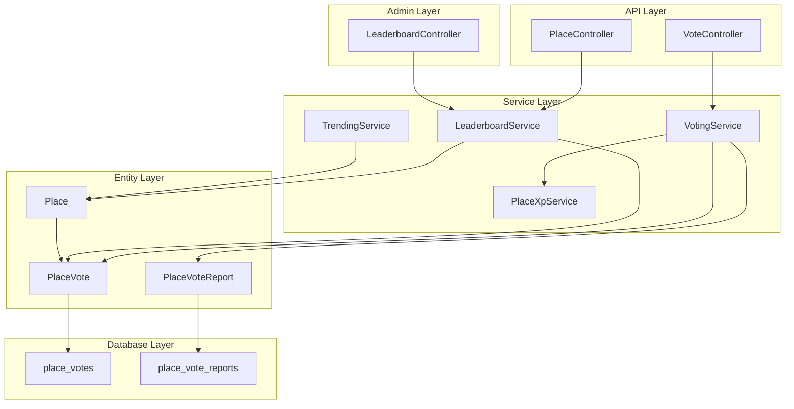
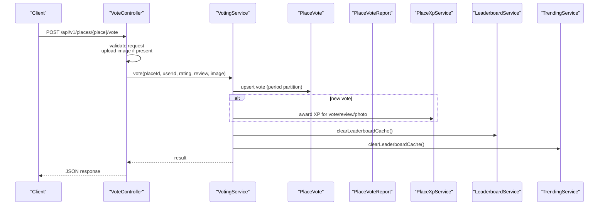
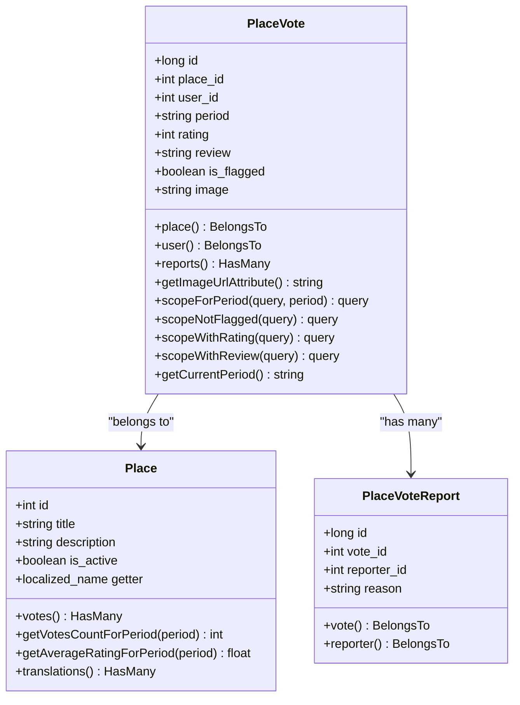
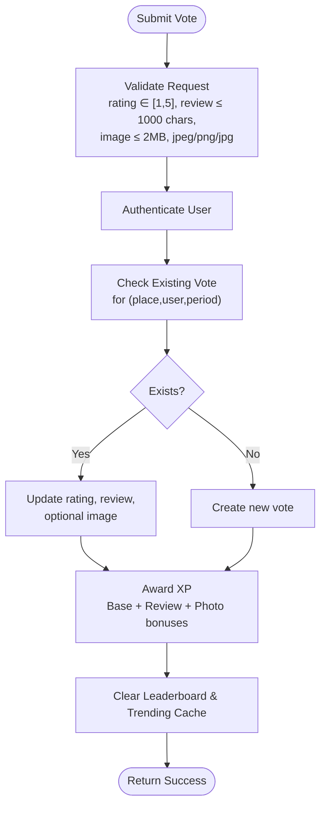
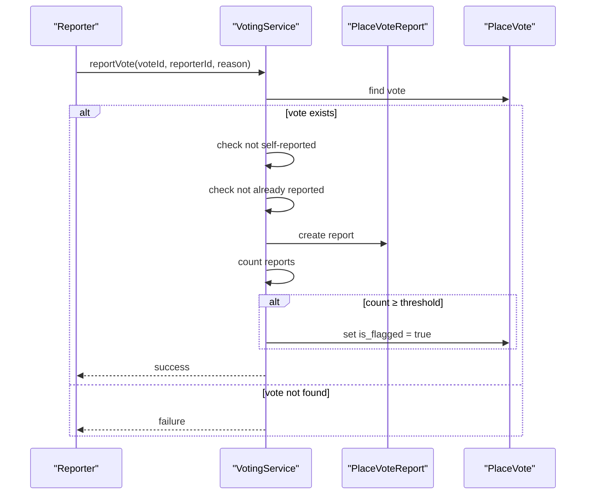
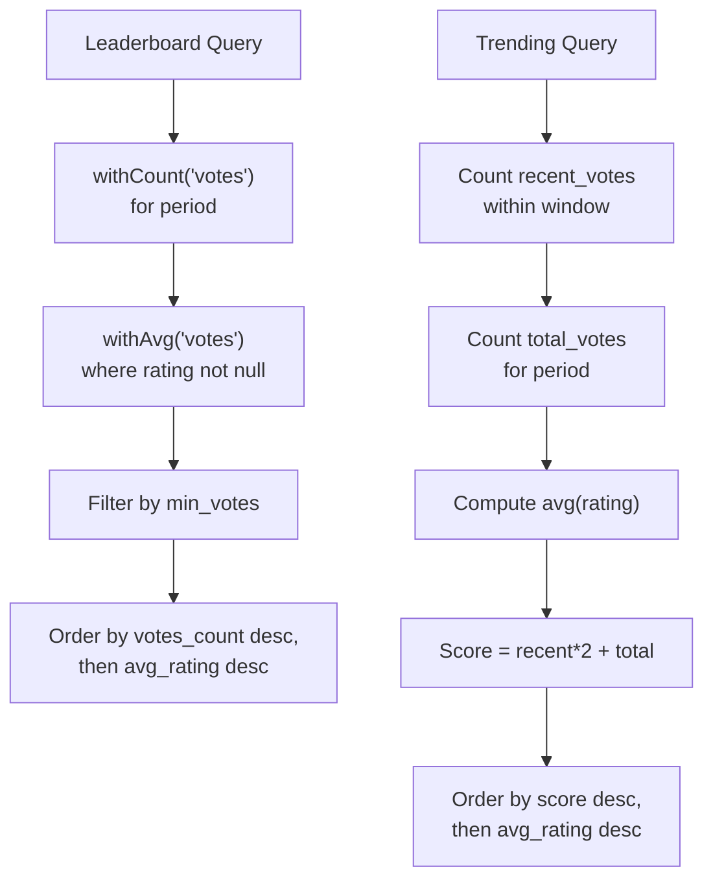
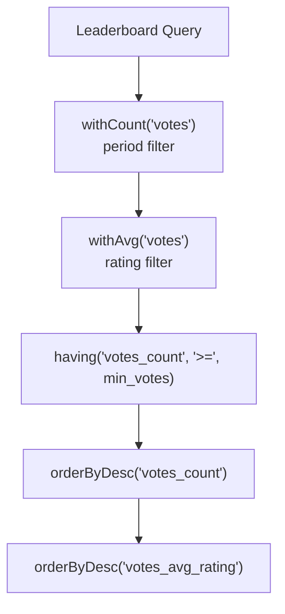
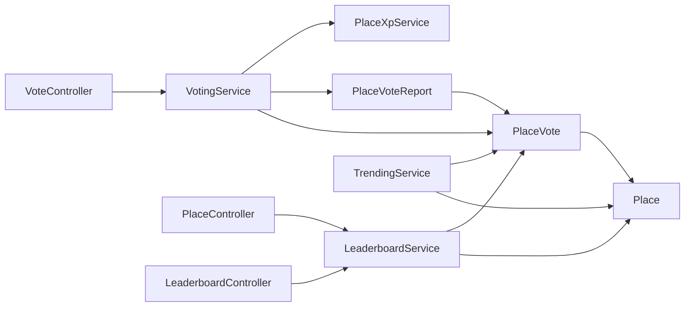

# Voting and Rating System

<cite>
**Referenced Files in This Document**
- [VotingService.php](file://Modules/PlacesToVisit/Services/VotingService.php)
- [PlaceXpService.php](file://Modules/PlacesToVisit/Services/PlaceXpService.php)
- [LeaderboardService.php](file://Modules/PlacesToVisit/Services/LeaderboardService.php)
- [TrendingService.php](file://Modules/PlacesToVisit/Services/TrendingService.php)
- [VoteController.php](file://Modules/PlacesToVisit/Http/Controllers/Api/VoteController.php)
- [LeaderboardController.php](file://Modules/PlacesToVisit/Http/Controllers/Admin/LeaderboardController.php)
- [PlaceController.php](file://Modules/PlacesToVisit/Http/Controllers/Api/PlaceController.php)
- [PlaceVote.php](file://Modules/PlacesToVisit/Entities/PlaceVote.php)
- [PlaceVoteReport.php](file://Modules/PlacesToVisit/Entities/PlaceVoteReport.php)
- [Place.php](file://Modules/PlacesToVisit/Entities/Place.php)
- [Place.php](file://Modules/PlacesToVisit/Entities/Place.php)
- [2026_01_04_000004_create_place_votes_table.php](file://Modules/PlacesToVisit/Database/Migrations/2026_01_04_000004_create_place_votes_table.php)
- [2026_02_10_000006_create_place_vote_reports_table.php](file://Modules/PlacesToVisit/Database/Migrations/2026_02_10_000006_create_place_vote_reports_table.php)
- [config.php](file://Modules/PlacesToVisit/Config/config.php)
</cite>

## Update Summary
**Changes Made**
- Enhanced leaderboard functionality with improved vote counting through withCount('votes')
- Expanded translation support for new UI elements in admin interfaces
- Improved integration with enhanced leaderboard administrative interface
- Added comprehensive translation keys for voting and leaderboard features
- Updated admin controllers to support enhanced translation and filtering capabilities

## Table of Contents
1. [Introduction](#introduction)
2. [Project Structure](#project-structure)
3. [Core Components](#core-components)
4. [Architecture Overview](#architecture-overview)
5. [Detailed Component Analysis](#detailed-component-analysis)
6. [Enhanced Leaderboard Integration](#enhanced-leaderboard-integration)
7. [Translation Support and UI Elements](#translation-support-and-ui-elements)
8. [Dependency Analysis](#dependency-analysis)
9. [Performance Considerations](#performance-considerations)
10. [Troubleshooting Guide](#troubleshooting-guide)
11. [Conclusion](#conclusion)

## Introduction
This document describes the Place voting and rating system within the PlacesToVisit module. It covers the PlaceVote entity structure, vote scoring and aggregation, user interaction patterns, authentication and validation, duplicate prevention, moderation via PlaceVoteReport, XP rewards, and ranking systems for leaderboards and trending. The system now features enhanced integration with leaderboard functionality, improved vote counting through withCount('votes'), and expanded translation support for new UI elements. It documents the VotingService class methods and business logic, and explains how time-based weighting contributes to community-driven quality ranking.

## Project Structure
The voting system spans several layers with enhanced leaderboard integration:
- Database migrations define the schema for votes and reports
- Entity models encapsulate relationships and helpers with translation support
- Services implement business logic for voting, XP rewards, leaderboard, and trending with improved aggregation
- API controllers handle user requests and integrate with services
- Admin controllers provide enhanced leaderboard management with translation support
- Configuration defines thresholds and limits for moderation and ranking
- Comprehensive translation system supports multilingual UI elements

**Diagram sources**
- [VoteController.php:13-148](file://Modules/PlacesToVisit/Http/Controllers/Api/VoteController.php#L13-L148)
- [PlaceController.php:181-219](file://Modules/PlacesToVisit/Http/Controllers/Api/PlaceController.php#L181-L219)
- [LeaderboardController.php:19-93](file://Modules/PlacesToVisit/Http/Controllers/Admin/LeaderboardController.php#L19-L93)
- [VotingService.php:11-216](file://Modules/PlacesToVisit/Services/VotingService.php#L11-L216)
- [LeaderboardService.php:12-141](file://Modules/PlacesToVisit/Services/LeaderboardService.php#L12-L141)
- [TrendingService.php:10-87](file://Modules/PlacesToVisit/Services/TrendingService.php#L10-L87)
- [PlaceVote.php:10-78](file://Modules/PlacesToVisit/Entities/PlaceVote.php#L10-L78)
- [PlaceVoteReport.php:9-25](file://Modules/PlacesToVisit/Entities/PlaceVoteReport.php#L9-L25)
- [Place.php:12-218](file://Modules/PlacesToVisit/Entities/Place.php#L12-L218)

**Section sources**
- [VotingService.php:11-216](file://Modules/PlacesToVisit/Services/VotingService.php#L11-L216)
- [VoteController.php:13-148](file://Modules/PlacesToVisit/Http/Controllers/Api/VoteController.php#L13-L148)
- [PlaceController.php:181-219](file://Modules/PlacesToVisit/Http/Controllers/Api/PlaceController.php#L181-L219)
- [LeaderboardController.php:19-93](file://Modules/PlacesToVisit/Http/Controllers/Admin/LeaderboardController.php#L19-L93)
- [PlaceVote.php:10-78](file://Modules/PlacesToVisit/Entities/PlaceVote.php#L10-L78)
- [PlaceVoteReport.php:9-25](file://Modules/PlacesToVisit/Entities/PlaceVoteReport.php#L9-L25)
- [LeaderboardService.php:12-141](file://Modules/PlacesToVisit/Services/LeaderboardService.php#L12-L141)
- [TrendingService.php:10-87](file://Modules/PlacesToVisit/Services/TrendingService.php#L10-L87)
- [2026_01_04_000004_create_place_votes_table.php:11-23](file://Modules/PlacesToVisit/Database/Migrations/2026_01_04_000004_create_place_votes_table.php#L11-L23)
- [2026_02_10_000006_create_place_vote_reports_table.php:11-19](file://Modules/PlacesToVisit/Database/Migrations/2026_02_10_000006_create_place_vote_reports_table.php#L11-L19)

## Core Components
- PlaceVote entity: Stores user ratings, textual reviews, optional images, monthly period, and moderation flag. Includes scopes for filtering and helpers for period handling.
- PlaceVoteReport entity: Tracks user reports against votes with uniqueness constraints to prevent duplicate reports.
- VotingService: Orchestrates voting, updates, removal, duplicate prevention, moderation reporting, and cache invalidation.
- PlaceXpService: Awards XP for voting, reviewing, and photo reviews via centralized XP service.
- LeaderboardService: Computes top places and top voters using enhanced withCount('votes') aggregation, with caching and configurable thresholds.
- TrendingService: Computes trending places using a recency-weighted score within a rolling window.
- VoteController: Validates requests, authenticates users, and delegates to VotingService.
- LeaderboardController: Enhanced admin interface for managing leaderboard data with translation support and filtering capabilities.
- PlaceController: API endpoints for leaderboard and top voters with enhanced translation support.

**Section sources**
- [PlaceVote.php:10-78](file://Modules/PlacesToVisit/Entities/PlaceVote.php#L10-L78)
- [PlaceVoteReport.php:9-25](file://Modules/PlacesToVisit/Entities/PlaceVoteReport.php#L9-L25)
- [VotingService.php:11-216](file://Modules/PlacesToVisit/Services/VotingService.php#L11-L216)
- [PlaceXpService.php:8-82](file://Modules/PlacesToVisit/Services/PlaceXpService.php#L8-L82)
- [LeaderboardService.php:12-141](file://Modules/PlacesToVisit/Services/LeaderboardService.php#L12-L141)
- [TrendingService.php:10-87](file://Modules/PlacesToVisit/Services/TrendingService.php#L10-L87)
- [VoteController.php:13-148](file://Modules/PlacesToVisit/Http/Controllers/Api/VoteController.php#L13-L148)
- [LeaderboardController.php:19-93](file://Modules/PlacesToVisit/Http/Controllers/Admin/LeaderboardController.php#L19-L93)
- [PlaceController.php:181-219](file://Modules/PlacesToVisit/Http/Controllers/Api/PlaceController.php#L181-L219)

## Architecture Overview
The system follows a layered architecture with enhanced leaderboard integration:
- API layer validates and authenticates requests
- Service layer encapsulates business rules and persistence with improved aggregation
- Entity layer models domain objects and relationships with translation support
- Database layer persists structured voting data and reports
- Admin layer provides comprehensive management interface with translation support

**Diagram sources**
- [VoteController.php:23-56](file://Modules/PlacesToVisit/Http/Controllers/Api/VoteController.php#L23-L56)
- [VotingService.php:16-86](file://Modules/PlacesToVisit/Services/VotingService.php#L16-L86)
- [PlaceXpService.php:13-80](file://Modules/PlacesToVisit/Services/PlaceXpService.php#L13-L80)
- [LeaderboardService.php:113-139](file://Modules/PlacesToVisit/Services/LeaderboardService.php#L113-L139)
- [TrendingService.php:78-85](file://Modules/PlacesToVisit/Services/TrendingService.php#L78-L85)

## Detailed Component Analysis

### PlaceVote Entity Structure
- Fields: primary key, foreign keys to Place and User, period string, rating (nullable tiny integer), review text, moderation flag, timestamps
- Constraints: unique composite index on (place_id, user_id, period) prevents duplicate votes per user per period
- Relationships: belongs to Place and User; has many reports
- Accessors: computed image URL for stored review images
- Scopes: filter by period, exclude flagged, require rating, require non-empty review
- Helpers: current period helper for monthly partitions

**Diagram sources**
- [Place.php:12-218](file://Modules/PlacesToVisit/Entities/Place.php#L12-L218)
- [PlaceVote.php:10-78](file://Modules/PlacesToVisit/Entities/PlaceVote.php#L10-L78)
- [PlaceVoteReport.php:9-25](file://Modules/PlacesToVisit/Entities/PlaceVoteReport.php#L9-L25)

**Section sources**
- [PlaceVote.php:10-78](file://Modules/PlacesToVisit/Entities/PlaceVote.php#L10-L78)
- [2026_01_04_000004_create_place_votes_table.php:11-23](file://Modules/PlacesToVisit/Database/Migrations/2026_01_04_000004_create_place_votes_table.php#L11-L23)

### Voting Workflow and Business Logic
- Authentication: Controller uses authenticated user ID for all operations
- Validation: Ratings constrained to 1–5; review length limited; image upload validated
- Duplicate Prevention: Unique constraint on (place_id, user_id, period) enforced at DB level; service checks and upserts accordingly
- Vote Submission/Update: Service creates or updates vote with rating, review, and optional image; clears leaderboard and trending caches
- XP Rewards: On successful vote, awards base XP; adds bonus XP for review and photo review
- Vote Removal: Deletes vote for current period; clears caches
- Status Check: Returns whether user voted in current period and the vote details
- Reporting: Hardened validation prevents self-reports and duplicate reports; auto-flags after threshold; admin can manually flag/unflag

**Diagram sources**
- [VoteController.php:25-49](file://Modules/PlacesToVisit/Http/Controllers/Api/VoteController.php#L25-L49)
- [VotingService.php:25-86](file://Modules/PlacesToVisit/Services/VotingService.php#L25-L86)
- [PlaceXpService.php:13-80](file://Modules/PlacesToVisit/Services/PlaceXpService.php#L13-L80)

**Section sources**
- [VoteController.php:23-95](file://Modules/PlacesToVisit/Http/Controllers/Api/VoteController.php#L23-L95)
- [VotingService.php:16-138](file://Modules/PlacesToVisit/Services/VotingService.php#L16-L138)
- [PlaceXpService.php:13-80](file://Modules/PlacesToVisit/Services/PlaceXpService.php#L13-L80)

### PlaceVoteReport Moderation System
- Hardened Validation: Prevents self-reporting and duplicate reports per user per vote
- Auto-Flagging: After N reports (configurable), automatically flags the vote for moderation
- Manual Flagging: Admin can flag/unflag votes
- Report Tracking: Each report stores reason and reporter identity

**Diagram sources**
- [VotingService.php:143-181](file://Modules/PlacesToVisit/Services/VotingService.php#L143-L181)
- [PlaceVoteReport.php:9-25](file://Modules/PlacesToVisit/Entities/PlaceVoteReport.php#L9-L25)
- [PlaceVote.php:10-78](file://Modules/PlacesToVisit/Entities/PlaceVote.php#L10-L78)

**Section sources**
- [VotingService.php:143-197](file://Modules/PlacesToVisit/Services/VotingService.php#L143-L197)
- [2026_02_10_000006_create_place_vote_reports_table.php:11-19](file://Modules/PlacesToVisit/Database/Migrations/2026_02_10_000006_create_place_vote_reports_table.php#L11-L19)

### Ranking Systems: Leaderboard and Trending
- LeaderboardService
  - Enhanced withCount('votes') aggregation for improved performance
  - Aggregates per-place vote counts and average ratings for the current period
  - Requires minimum votes threshold to qualify
  - Ranks by popularity (total votes) then quality (average rating)
  - Caches results with configurable TTL and clears on vote changes
- TrendingService
  - Computes a recency-weighted score: (recent votes × 2) + total votes within a rolling window
  - Ranks by trending score and average rating
  - Caches results and clears on vote changes

**Diagram sources**
- [LeaderboardService.php:28-59](file://Modules/PlacesToVisit/Services/LeaderboardService.php#L28-L59)
- [TrendingService.php:28-72](file://Modules/PlacesToVisit/Services/TrendingService.php#L28-L72)

**Section sources**
- [LeaderboardService.php:18-141](file://Modules/PlacesToVisit/Services/LeaderboardService.php#L18-L141)
- [TrendingService.php:16-87](file://Modules/PlacesToVisit/Services/TrendingService.php#L16-L87)

### Vote Calculation, Rating Aggregation, and Reputation Scoring
- Vote Scoring: Optional integer rating from 1 to 5; nullable to support text-only reviews
- Rating Aggregation: Per-place average computed only from non-null ratings within the selected period
- Period Partitioning: Monthly periods ensure fresh scoring each month and prevent long-term bias
- Reputation Scoring:
  - Top Voters: Count of votes per user within a period; cached and limited
  - Top Places: Votes count and average rating; filtered by minimum votes threshold

**Section sources**
- [PlaceVote.php:16-19](file://Modules/PlacesToVisit/Entities/PlaceVote.php#L16-L19)
- [Place.php:142-164](file://Modules/PlacesToVisit/Entities/Place.php#L142-L164)
- [LeaderboardService.php:28-59](file://Modules/PlacesToVisit/Services/LeaderboardService.php#L28-L59)
- [LeaderboardService.php:64-88](file://Modules/PlacesToVisit/Services/LeaderboardService.php#L64-L88)

### VotingService Methods and Business Logic
- vote(placeId, userId, rating?, review?, image?): Upserts vote for current period; awards XP; clears caches
- removeVote(placeId, userId): Removes vote for current period; clears caches
- hasVoted(placeId, userId): Checks existence of vote in current period
- getUserVote(placeId, userId): Returns current period vote
- reportVote(voteId, reporterId, reason?): Validates, prevents duplicates/self-reports, auto-flags after threshold
- flagVote(voteId)/unflagVote(voteId): Admin controls moderation flag
- getCurrentPeriod(): Returns current month-year period string
- clearLeaderboardCache(): Clears leaderboard and trending caches

**Section sources**
- [VotingService.php:16-216](file://Modules/PlacesToVisit/Services/VotingService.php#L16-L216)

### Practical Examples
- Example 1: Submitting a 5-star review with a photo
  - Controller validates and uploads image
  - VotingService upserts vote, awards base + review + photo XP, clears caches
- Example 2: Updating an existing vote
  - VotingService updates rating and/or review; preserves image if not provided
- Example 3: Auto-flagging after 3 reports
  - PlaceVoteReport increments; threshold met → vote flagged
- Example 4: Leaderboard computation with enhanced aggregation
  - LeaderboardService uses withCount('votes') for improved performance, filters places with ≥5 votes, orders by votes_count then avg_rating
- Example 5: Trending computation
  - TrendingService weights recent votes 2x within a 7-day window

**Section sources**
- [VoteController.php:23-95](file://Modules/PlacesToVisit/Http/Controllers/Api/VoteController.php#L23-L95)
- [VotingService.php:143-197](file://Modules/PlacesToVisit/Services/VotingService.php#L143-L197)
- [LeaderboardService.php:28-59](file://Modules/PlacesToVisit/Services/LeaderboardService.php#L28-L59)
- [TrendingService.php:28-72](file://Modules/PlacesToVisit/Services/TrendingService.php#L28-L72)

## Enhanced Leaderboard Integration

### Improved Vote Counting Through withCount('votes')
The leaderboard system now utilizes Laravel's withCount('votes') method for enhanced performance and accuracy in vote aggregation. This approach provides:

- **Database-Level Aggregation**: Efficient counting of votes per place at the database level
- **Reduced Memory Usage**: Eliminates the need to load all vote records into memory
- **Improved Performance**: Significantly faster queries for large datasets
- **Accurate Results**: Real-time vote counts with proper period filtering

**Diagram sources**
- [LeaderboardService.php:34-58](file://Modules/PlacesToVisit/Services/LeaderboardService.php#L34-L58)

**Section sources**
- [LeaderboardService.php:28-59](file://Modules/PlacesToVisit/Services/LeaderboardService.php#L28-L59)

### Enhanced Admin Leaderboard Interface
The admin controller now provides comprehensive management capabilities:

- **Period Filtering**: Dropdown to select different voting periods (last 12 months)
- **Statistics Dashboard**: Real-time metrics including total votes, participating places, average rating
- **Vote Management**: Filterable list of all votes with moderation controls
- **Translation Support**: Full internationalization support for all UI elements
- **Cache Management**: Direct cache clearing functionality

**Section sources**
- [LeaderboardController.php:19-93](file://Modules/PlacesToVisit/Http/Controllers/Admin/LeaderboardController.php#L19-L93)

### API Endpoints for Leaderboard Data
The system now exposes dedicated API endpoints:

- **GET /api/v1/places/leaderboard**: Retrieves top places for leaderboard
- **GET /api/v1/places/top-voters**: Retrieves top voters/chillers
- **Enhanced Response Format**: Includes period information and current period context

**Section sources**
- [PlaceController.php:181-219](file://Modules/PlacesToVisit/Http/Controllers/Api/PlaceController.php#L181-L219)

## Translation Support and UI Elements

### Comprehensive Translation Keys
The system now includes extensive translation support for all UI elements:

#### Leaderboard Translations
- `messages.top_10_places`: "Top 10 Places"
- `messages.view_all_votes`: "View All Votes"
- `messages.clear_cache`: "Clear Cache"
- `messages.no_places_qualified_yet`: "No places qualified yet"
- `messages.min_votes_required`: "Minimum {count} votes required"

#### Admin Interface Translations
- `messages.places_leaderboard`: "Places Leaderboard"
- `messages.total_votes`: "Total Votes"
- `messages.participating_places`: "Participating Places"
- `messages.average_rating`: "Average Rating"
- `messages.total_places`: "Total Places"
- `messages.rank`: "Rank"
- `messages.place`: "Place"
- `messages.votes`: "Votes"
- `messages.rating`: "Rating"

#### Vote Management Translations
- `messages.vote_flag_updated`: "Vote flag updated"
- `messages.vote_deleted`: "Vote deleted"
- `messages.cache_cleared`: "Cache cleared"
- `messages.guest`: "Guest"
- `messages.flagged`: "Flagged"
- `messages.active`: "Active"
- `messages.no_votes_found`: "No votes found"

#### Voting Translations
- `messages.vote_recorded`: "Vote recorded"
- `messages.vote_updated`: "Vote updated"
- `messages.vote_removed`: "Vote removed"
- `messages.no_vote_found`: "No vote found"
- `messages.review_not_found`: "Review not found"
- `messages.cannot_report_own_review`: "Cannot report own review"
- `messages.already_reported`: "Already reported"
- `messages.review_reported`: "Review reported"

**Section sources**
- [resources/lang/en/messages.php:671-673](file://resources/lang/en/messages.php#L671-L673)
- [Modules/PlacesToVisit/Resources/views/admin/leaderboard/index.blade.php:67-140](file://Modules/PlacesToVisit/Resources/views/admin/leaderboard/index.blade.php#L67-L140)
- [Modules/PlacesToVisit/Resources/views/admin/leaderboard/votes.blade.php:101-129](file://Modules/PlacesToVisit/Resources/views/admin/leaderboard/votes.blade.php#L101-L129)

### Translation Implementation Patterns
The system uses consistent translation patterns across all components:

- **Blade Templates**: `{{ translate('messages.key_name') }}`
- **JavaScript**: `{{ translate('messages.key_name') }}` with proper escaping
- **Controller Responses**: `translate('messages.key_name')` for Toastr notifications
- **Configuration**: Translation keys in config files for dynamic content

**Section sources**
- [LeaderboardController.php:73-91](file://Modules/PlacesToVisit/Http/Controllers/Admin/LeaderboardController.php#L73-L91)
- [Modules/PlacesToVisit/Resources/views/admin/leaderboard/index.blade.php:3-25](file://Modules/PlacesToVisit/Resources/views/admin/leaderboard/index.blade.php#L3-L25)

## Dependency Analysis
- Controller depends on VotingService and LeaderboardService
- VotingService depends on PlaceVote, PlaceVoteReport, User, and services for cache invalidation
- LeaderboardService and TrendingService depend on Place and PlaceVote with enhanced aggregation
- PlaceVote depends on Place and PlaceVoteReport
- PlaceVoteReport depends on PlaceVote and User
- Admin controllers depend on enhanced translation system

**Diagram sources**
- [VoteController.php:15-17](file://Modules/PlacesToVisit/Http/Controllers/Api/VoteController.php#L15-L17)
- [PlaceController.php:181-219](file://Modules/PlacesToVisit/Http/Controllers/Api/PlaceController.php#L181-L219)
- [LeaderboardController.php:15-17](file://Modules/PlacesToVisit/Http/Controllers/Admin/LeaderboardController.php#L15-L17)
- [VotingService.php:5-9](file://Modules/PlacesToVisit/Services/VotingService.php#L5-L9)
- [LeaderboardService.php:9-10](file://Modules/PlacesToVisit/Services/LeaderboardService.php#L9-L10)
- [TrendingService.php](file://Modules/PlacesToVisit/Services/TrendingService.php#L8)
- [PlaceVote.php:23-36](file://Modules/PlacesToVisit/Entities/PlaceVote.php#L23-L36)
- [PlaceVoteReport.php:15-23](file://Modules/PlacesToVisit/Entities/PlaceVoteReport.php#L15-L23)
- [Place.php:66-69](file://Modules/PlacesToVisit/Entities/Place.php#L66-L69)

**Section sources**
- [VoteController.php:15-17](file://Modules/PlacesToVisit/Http/Controllers/Api/VoteController.php#L15-L17)
- [PlaceController.php:181-219](file://Modules/PlacesToVisit/Http/Controllers/Api/PlaceController.php#L181-L219)
- [LeaderboardController.php:15-17](file://Modules/PlacesToVisit/Http/Controllers/Admin/LeaderboardController.php#L15-L17)
- [VotingService.php:5-9](file://Modules/PlacesToVisit/Services/VotingService.php#L5-L9)
- [LeaderboardService.php:9-10](file://Modules/PlacesToVisit/Services/LeaderboardService.php#L9-L10)
- [TrendingService.php](file://Modules/PlacesToVisit/Services/TrendingService.php#L8)
- [PlaceVote.php:23-36](file://Modules/PlacesToVisit/Entities/PlaceVote.php#L23-L36)
- [PlaceVoteReport.php:15-23](file://Modules/PlacesToVisit/Entities/PlaceVoteReport.php#L15-L23)
- [Place.php:66-69](file://Modules/PlacesToVisit/Entities/Place.php#L66-L69)

## Performance Considerations
- Caching: LeaderboardService and TrendingService cache results with configurable TTL; caches are cleared on vote changes to maintain freshness
- Enhanced Aggregation: Using withCount('votes') instead of manual counting improves performance significantly
- Indexing: Unique composite index on (place_id, user_id, period) prevents duplicates and supports fast lookups
- Aggregation Efficiency: Database-level aggregations (count, avg) minimize PHP overhead
- Recency Weighting: TrendingService computes scores within a bounded window to avoid scanning entire history
- Image Handling: Controller validates and limits image size to reduce storage and bandwidth costs
- Translation Performance: Translation keys are cached and loaded efficiently across the application

## Troubleshooting Guide
- Duplicate Vote Error: Ensure the unique constraint is respected; verify user, place, and period combination
- No Vote Found on Remove: Confirm the vote exists in the current period; check period formatting
- Self-Report Attempt: Reporting your own vote is rejected; ensure reporter differs from vote owner
- Already Reported: Duplicate reports are prevented; each user can report a vote only once
- Auto-Flag Threshold: Adjust configuration value for report_auto_flag_threshold if needed
- Cache Stale Data: Invoke cache clearing after bulk operations or administrative changes
- Translation Issues: Verify translation keys exist in messages.php; check locale configuration
- Leaderboard Performance: Monitor withCount('votes') queries; ensure proper indexing
- Admin Interface Problems: Check translation loading in admin templates; verify controller dependencies

**Section sources**
- [VotingService.php:91-114](file://Modules/PlacesToVisit/Services/VotingService.php#L91-L114)
- [VotingService.php:143-181](file://Modules/PlacesToVisit/Services/VotingService.php#L143-L181)
- [config.php:44-44](file://Modules/PlacesToVisit/Config/config.php#L44-L44)

## Conclusion
The Place voting and rating system provides a robust foundation for community-driven discovery and quality assessment. The enhanced integration with leaderboard functionality, improved vote counting through withCount('votes'), and expanded translation support deliver a comprehensive solution for managing place ratings and community engagement. The system enforces fair participation through duplicate prevention, moderation, and XP incentives, while delivering timely insights via leaderboards and trending. The modular design enables easy extension and maintenance, with caching and aggregation ensuring scalability. The enhanced admin interface with full translation support provides administrators with powerful tools for managing the voting ecosystem and maintaining community standards.