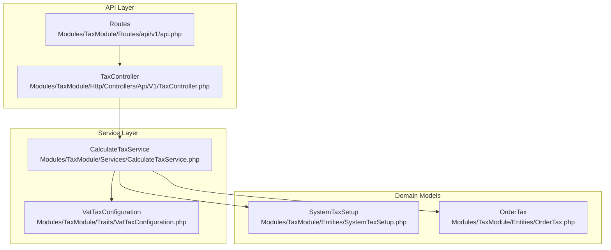
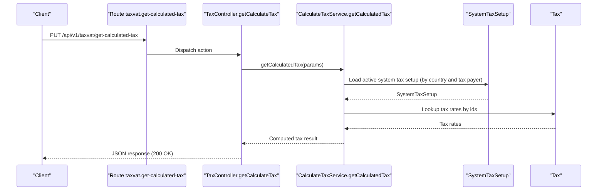
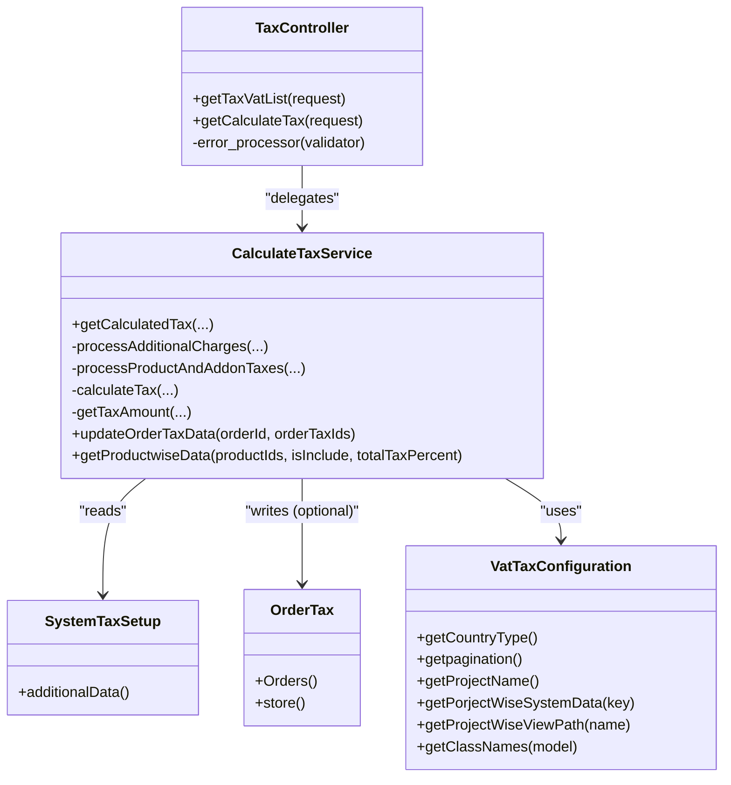

# Tax API Endpoints

<cite>
**Referenced Files in This Document**
- [TaxController.php](file://Modules/TaxModule/Http/Controllers/Api/V1/TaxController.php)
- [api.php](file://Modules/TaxModule/Routes/api/v1/api.php)
- [CalculateTaxService.php](file://Modules/TaxModule/Services/CalculateTaxService.php)
- [VatTaxConfiguration.php](file://Modules/TaxModule/Traits/VatTaxConfiguration.php)
- [SystemTaxSetupController.php](file://Modules/TaxModule/Http/Controllers/SystemTaxVatSetupController.php)
- [TaxVatController.php](file://Modules/TaxModule/Http/Controllers/TaxVatController.php)
- [SystemTaxSetup.php](file://Modules/TaxModule/Entities/SystemTaxSetup.php)
- [OrderTax.php](file://Modules/TaxModule/Entities/OrderTax.php)
- [2025_05_26_115643_create_taxes_table.php](file://Modules/TaxModule/Database/Migrations/2025_05_26_115643_create_taxes_table.php)
- [config.php](file://Modules/TaxModule/Config/config.php)
- [routes.php](file://routes/api/v1/api.php)
</cite>

## Table of Contents
1. [Introduction](#introduction)
2. [Project Structure](#project-structure)
3. [Core Components](#core-components)
4. [Architecture Overview](#architecture-overview)
5. [Detailed Component Analysis](#detailed-component-analysis)
6. [Dependency Analysis](#dependency-analysis)
7. [Performance Considerations](#performance-considerations)
8. [Troubleshooting Guide](#troubleshooting-guide)
9. [Conclusion](#conclusion)

## Introduction
This document provides comprehensive API documentation for the TaxModule endpoints. It covers:
- TaxController methods for retrieving applicable tax rates and calculating taxes for orders
- System configuration endpoints for managing tax settings
- HTTP methods, URL patterns, request/response schemas, and authentication requirements
- Practical usage examples, parameter validation, response formatting, error handling, status codes, and rate limiting considerations
- Integration patterns with frontend applications and third-party systems

## Project Structure
The TaxModule exposes REST endpoints under the TaxController and integrates with supporting services and entities:
- API routes are grouped under the taxvat namespace
- Controllers handle request validation, orchestration, and responses
- CalculateTaxService encapsulates tax computation logic
- Entities represent persisted tax-related data
- Configuration trait centralizes project-specific settings

**Diagram sources**
- [api.php:18-21](file://Modules/TaxModule/Routes/api/v1/api.php#L18-L21)
- [TaxController.php:12-76](file://Modules/TaxModule/Http/Controllers/Api/V1/TaxController.php#L12-L76)
- [CalculateTaxService.php:13-325](file://Modules/TaxModule/Services/CalculateTaxService.php#L13-L325)
- [VatTaxConfiguration.php:6-139](file://Modules/TaxModule/Traits/VatTaxConfiguration.php#L6-L139)
- [SystemTaxSetup.php:9-29](file://Modules/TaxModule/Entities/SystemTaxSetup.php#L9-L29)
- [OrderTax.php:10-37](file://Modules/TaxModule/Entities/OrderTax.php#L10-L37)

**Section sources**
- [api.php:18-21](file://Modules/TaxModule/Routes/api/v1/api.php#L18-L21)
- [TaxController.php:12-76](file://Modules/TaxModule/Http/Controllers/Api/V1/TaxController.php#L12-L76)
- [CalculateTaxService.php:13-325](file://Modules/TaxModule/Services/CalculateTaxService.php#L13-L325)
- [VatTaxConfiguration.php:6-139](file://Modules/TaxModule/Traits/VatTaxConfiguration.php#L6-L139)
- [SystemTaxSetup.php:9-29](file://Modules/TaxModule/Entities/SystemTaxSetup.php#L9-L29)
- [OrderTax.php:10-37](file://Modules/TaxModule/Entities/OrderTax.php#L10-L37)

## Core Components
- TaxController
  - getTaxVatList: Retrieves paginated active tax rates
  - getCalculateTax: Computes taxes for an order based on products, addons, categories, and optional additional charges
- CalculateTaxService
  - Orchestrates system tax setup lookup, tax inclusion/exclusive logic, per-product/addon tax calculation, and optional persistence of order tax records
- SystemTaxSetupController and TaxVatController
  - Provide administrative endpoints for system-wide tax configuration and tax rate maintenance (non-API endpoints)
- Entities
  - SystemTaxSetup: Stores system-wide tax configuration per tax payer and country
  - OrderTax: Persists individual tax entries linked to orders and taxables

**Section sources**
- [TaxController.php:14-74](file://Modules/TaxModule/Http/Controllers/Api/V1/TaxController.php#L14-L74)
- [CalculateTaxService.php:16-116](file://Modules/TaxModule/Services/CalculateTaxService.php#L16-L116)
- [SystemTaxSetupController.php:15-185](file://Modules/TaxModule/Http/Controllers/SystemTaxVatSetupController.php#L15-L185)
- [TaxVatController.php:16-126](file://Modules/TaxModule/Http/Controllers/TaxVatController.php#L16-L126)
- [SystemTaxSetup.php:9-29](file://Modules/TaxModule/Entities/SystemTaxSetup.php#L9-L29)
- [OrderTax.php:10-37](file://Modules/TaxModule/Entities/OrderTax.php#L10-L37)

## Architecture Overview
The Tax API follows a layered architecture:
- Routes define the taxvat namespace and bind endpoints to TaxController actions
- Controllers validate inputs and delegate to CalculateTaxService
- CalculateTaxService queries SystemTaxSetup and Tax entities, computes tax amounts, optionally persists OrderTax entries, and returns structured results
- VatTaxConfiguration trait supplies project-specific constants and mappings

**Diagram sources**
- [api.php:18-21](file://Modules/TaxModule/Routes/api/v1/api.php#L18-L21)
- [TaxController.php:29-64](file://Modules/TaxModule/Http/Controllers/Api/V1/TaxController.php#L29-L64)
- [CalculateTaxService.php:16-116](file://Modules/TaxModule/Services/CalculateTaxService.php#L16-L116)
- [SystemTaxSetup.php:9-29](file://Modules/TaxModule/Entities/SystemTaxSetup.php#L9-L29)
- [2025_05_26_115643_create_taxes_table.php:14-36](file://Modules/TaxModule/Database/Migrations/2025_05_26_115643_create_taxes_table.php#L14-L36)

## Detailed Component Analysis

### Endpoint: GET /api/v1/taxvat/get-taxVat-list
- Description: Retrieve a paginated list of active tax rates
- Authentication: Not specified in route; consult application middleware configuration
- URL: GET /api/v1/taxvat/get-taxVat-list
- Query Parameters:
  - limit: integer (optional)
  - offset: integer (optional)
- Response:
  - Array of tax items with fields: id, name, tax_rate
- Validation:
  - limit and offset must be numeric; invalid types return 403 with errors
- Pagination:
  - Defaults to limit=50 and page=1 if not provided
- Error Handling:
  - On validation failure: 403 with error array containing code and message
- Rate Limiting:
  - Not enforced by controller; depends on global middleware configuration

Example request:
- GET /api/v1/taxvat/get-taxVat-list?limit=25&offset=1

Example response (excerpt):
- [
  {"id": 1, "name": "VAT", "tax_rate": 15.0},
  {"id": 2, "name": "Service Tax", "tax_rate": 5.0}
]

**Section sources**
- [api.php:18-21](file://Modules/TaxModule/Routes/api/v1/api.php#L18-L21)
- [TaxController.php:14-27](file://Modules/TaxModule/Http/Controllers/Api/V1/TaxController.php#L14-L27)

### Endpoint: PUT /api/v1/taxvat/get-calculated-tax
- Description: Compute taxes for an order based on products, addons, categories, and optional additional charges
- Authentication: Not specified in route; consult application middleware configuration
- URL: PUT /api/v1/taxvat/get-calculated-tax
- Request Body (JSON):
  - totalProductAmount: number (required)
  - productIds: array<string> (required) - JSON-encoded array of product objects
  - categoryIds: array<string> (required) - JSON-encoded array of category identifiers
  - quantity: array<string> (required) - JSON-encoded array of quantities
  - additionalCharges: object<string,number> (optional) - JSON-encoded map of charge names to amounts
  - orderId: string | null (optional)
  - countryCode: string | null (optional)
  - taxPayer: string | null (defaults to "vendor")
  - addonIds: array<string> (optional) - JSON-encoded addon objects
  - addonQuantity: array<string> (optional) - JSON-encoded addon quantities
  - addonCategoryIds: array<string> (optional) - JSON-encoded addon category identifiers
- Response:
  - Object containing computed tax breakdown and metadata:
    - include: boolean|null
    - totalTaxPercent: number
    - totalTaxamount: number
    - taxType: string
    - productWiseData: array
    - additionalDatas: array
    - addonWiseData: array
    - orderTaxIds: array
- Validation:
  - Required fields validated; invalid types return 403 with errors
- Error Handling:
  - On validation failure: 403 with error array
  - On internal exceptions: returns empty tax result plus error details
- Rate Limiting:
  - Not enforced by controller; depends on global middleware configuration

Example request body:
{
  "totalProductAmount": 100,
  "productIds": "[{\"id\":1,\"after_discount_final_price\":50},{\"id\":2,\"after_discount_final_price\":50}]",
  "categoryIds": "[\"1\",\"2\"]",
  "quantity": "[1,1]",
  "additionalCharges": "{\"packaging\":5}",
  "orderId": "ORD-ABC",
  "countryCode": "US",
  "taxPayer": "vendor",
  "addonIds": "[{\"addon_id\":10,\"after_discount_final_price\":2}]", 
  "addonQuantity": "[1]",
  "addonCategoryIds": "[\"5\"]"
}

Example response (excerpt):
{
  "include": false,
  "totalTaxPercent": 15,
  "totalTaxamount": 15,
  "taxType": "order_wise",
  "productWiseData": [...],
  "additionalDatas": [...],
  "addonWiseData": [...],
  "orderTaxIds": []
}

**Section sources**
- [api.php:18-21](file://Modules/TaxModule/Routes/api/v1/api.php#L18-L21)
- [TaxController.php:29-64](file://Modules/TaxModule/Http/Controllers/Api/V1/TaxController.php#L29-L64)
- [CalculateTaxService.php:16-116](file://Modules/TaxModule/Services/CalculateTaxService.php#L16-L116)

### System Configuration Endpoints (Administrative)
These endpoints manage system-wide tax settings and are intended for administrative use. They are not part of the public API namespace and typically require backend authentication.

- GET /admin/taxvat/index
  - Purpose: List tax rates and system tax setups
  - Query parameters:
    - type: string (maps to tax_payer)
    - country_code: string (optional)
  - Returns: Blade-rendered view with tax and system data

- POST /admin/taxvat/systemTaxVatStore
  - Purpose: Save system tax configuration
  - Form fields:
    - tax_status: string (include/exclude)
    - tax_type: string
    - tax_ids: array
    - system_tax_id: integer
    - additional_status: object
    - additional: object
    - prescription_system_tax_id: integer (optional)
    - tax_ids_for_prescription: array (optional)
  - Returns: Redirect to previous page with success notification

- GET /admin/taxvat/vendorStatus
  - Purpose: Toggle active status of a system tax setup
  - Query parameters:
    - id: integer (optional)
    - type: string
    - country_code: string (optional)
  - Returns: JSON with id, status, and message

- GET /admin/taxvat/status/{id}
  - Purpose: Toggle active status of a tax rate
  - Returns: JSON with id, status, and message

- GET /admin/taxvat/export?type={csv|xlsx}&search={term}
  - Purpose: Export tax list to CSV/XLSX
  - Returns: File download

Note: These endpoints are rendered via controllers and views and are not exposed through the taxvat API routes.

**Section sources**
- [SystemTaxSetupController.php:36-175](file://Modules/TaxModule/Http/Controllers/SystemTaxVatSetupController.php#L36-L175)
- [TaxVatController.php:33-125](file://Modules/TaxModule/Http/Controllers/TaxVatController.php#L33-L125)

## Dependency Analysis
The following diagram shows the primary dependencies among components involved in tax calculation:

**Diagram sources**
- [TaxController.php:12-76](file://Modules/TaxModule/Http/Controllers/Api/V1/TaxController.php#L12-L76)
- [CalculateTaxService.php:13-325](file://Modules/TaxModule/Services/CalculateTaxService.php#L13-L325)
- [SystemTaxSetup.php:9-29](file://Modules/TaxModule/Entities/SystemTaxSetup.php#L9-L29)
- [OrderTax.php:10-37](file://Modules/TaxModule/Entities/OrderTax.php#L10-L37)
- [VatTaxConfiguration.php:6-139](file://Modules/TaxModule/Traits/VatTaxConfiguration.php#L6-L139)

**Section sources**
- [TaxController.php:12-76](file://Modules/TaxModule/Http/Controllers/Api/V1/TaxController.php#L12-L76)
- [CalculateTaxService.php:13-325](file://Modules/TaxModule/Services/CalculateTaxService.php#L13-L325)
- [SystemTaxSetup.php:9-29](file://Modules/TaxModule/Entities/SystemTaxSetup.php#L9-L29)
- [OrderTax.php:10-37](file://Modules/TaxModule/Entities/OrderTax.php#L10-L37)
- [VatTaxConfiguration.php:6-139](file://Modules/TaxModule/Traits/VatTaxConfiguration.php#L6-L139)

## Performance Considerations
- Pagination: The tax list endpoint supports pagination via limit and offset parameters to avoid large payloads.
- Batch processing: The tax calculation service aggregates tax amounts across products, addons, and additional charges; ensure arrays passed in productIds, addonIds, and related fields are reasonably sized.
- Database queries: SystemTaxSetup and Tax lookups are filtered by active status and optional country code; ensure appropriate indexing exists on country_code and is_active fields.
- Optional persistence: When storeData=true, OrderTax entries are saved; this increases write overhead. Use only when persisting order tax records is required.

[No sources needed since this section provides general guidance]

## Troubleshooting Guide
- Validation failures:
  - Symptom: 403 response with errors array
  - Causes: Missing or invalid required parameters; incorrect JSON encoding for arrays
  - Resolution: Verify required fields and ensure JSON arrays are properly encoded
- Empty tax result:
  - Symptom: Response includes include=null, totalTaxPercent=0, totalTaxamount=0
  - Causes: No active system tax setup found or tax included flag set
  - Resolution: Confirm system tax setup is active and configured for the requested country and tax payer
- Exception during calculation:
  - Symptom: Response includes error details (message and line)
  - Causes: Unexpected runtime error in tax calculation
  - Resolution: Inspect logs and validate input arrays and identifiers

**Section sources**
- [TaxController.php:21-23](file://Modules/TaxModule/Http/Controllers/Api/V1/TaxController.php#L21-L23)
- [CalculateTaxService.php:33-35](file://Modules/TaxModule/Services/CalculateTaxService.php#L33-L35)
- [CalculateTaxService.php:107-115](file://Modules/TaxModule/Services/CalculateTaxService.php#L107-L115)

## Conclusion
The TaxModule provides a focused set of endpoints for retrieving tax rates and computing taxes for orders. The design separates concerns between routing, validation, and calculation, while leveraging configurable project settings and persistent order tax records. Administrators can manage tax and system configurations through dedicated controllers. For production usage, ensure proper authentication and rate limiting are applied at the middleware level and monitor performance for large order calculations.