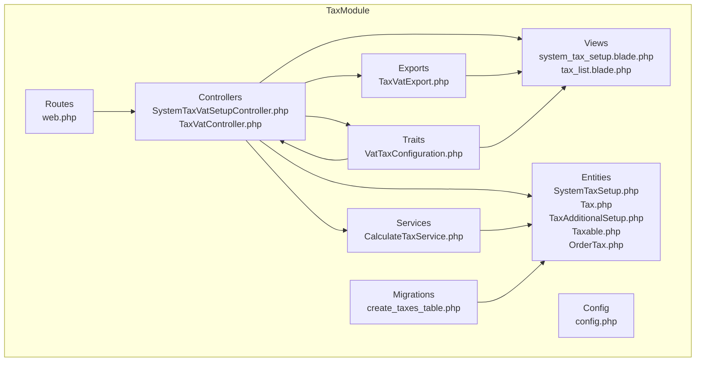
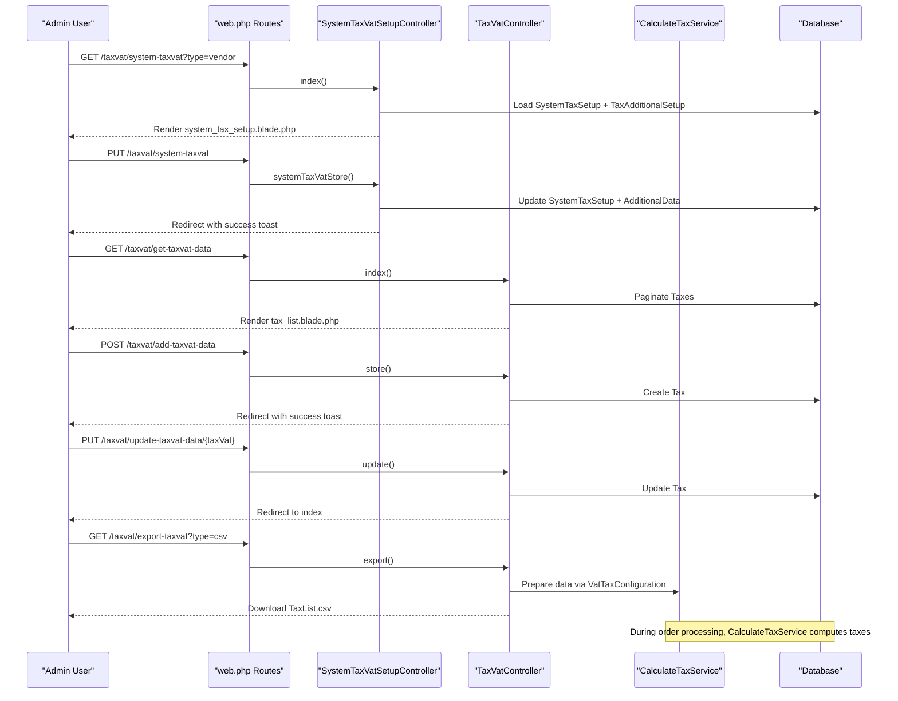
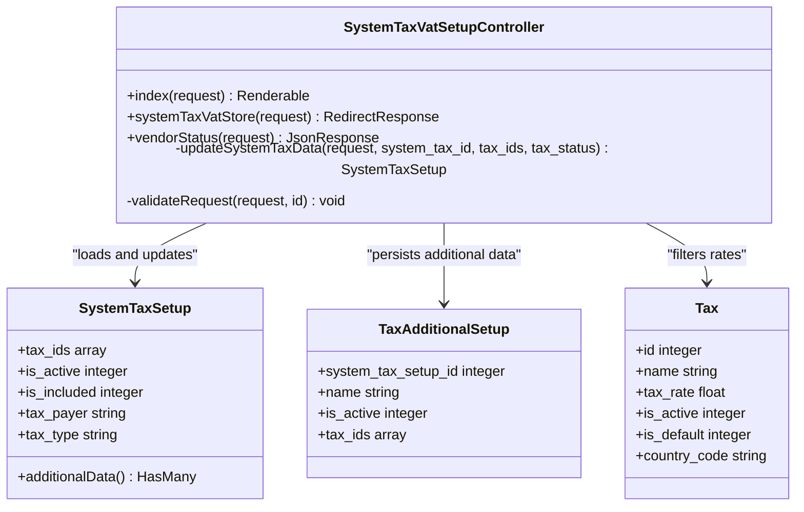
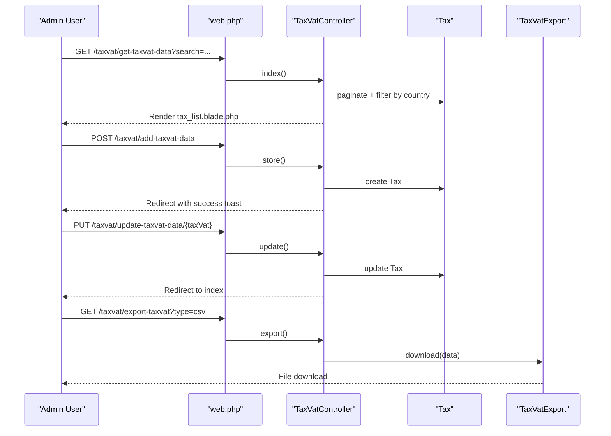
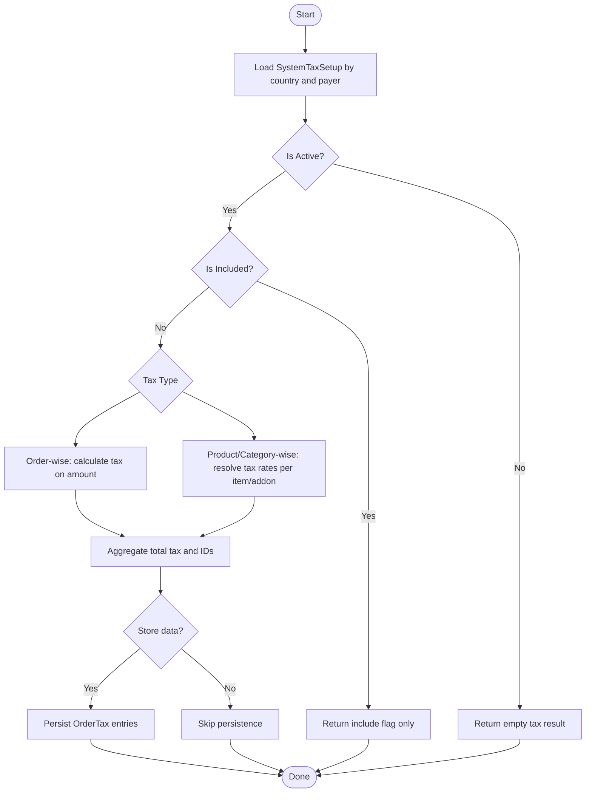
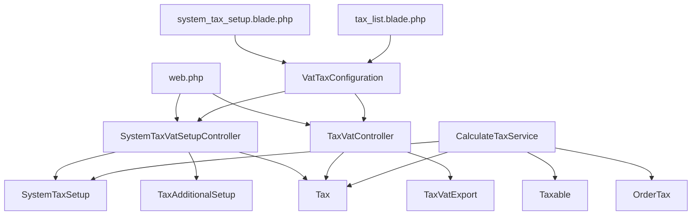

# Tax Administration Interface

<cite>
**Referenced Files in This Document**
- [SystemTaxVatSetupController.php](file://Modules/TaxModule/Http/Controllers/SystemTaxVatSetupController.php)
- [TaxVatController.php](file://Modules/TaxModule/Http/Controllers/TaxVatController.php)
- [TaxVatExport.php](file://Modules/TaxModule/Exports/TaxVatExport.php)
- [system_tax_setup.blade.php](file://Modules/TaxModule/Resources/views/tax/system_tax_setup.blade.php)
- [tax_list.blade.php](file://Modules/TaxModule/Resources/views/tax/tax_list.blade.php)
- [VatTaxConfiguration.php](file://Modules/TaxModule/Traits/VatTaxConfiguration.php)
- [web.php](file://Modules/TaxModule/Routes/web.php)
- [config.php](file://Modules/TaxModule/Config/config.php)
- [2025_05_26_115643_create_taxes_table.php](file://Modules/TaxModule/Database/Migrations/2025_05_26_115643_create_taxes_table.php)
- [SystemTaxSetup.php](file://Modules/TaxModule/Entities/SystemTaxSetup.php)
- [Tax.php](file://Modules/TaxModule/Entities/Tax.php)
- [TaxAdditionalSetup.php](file://Modules/TaxModule/Entities/TaxAdditionalSetup.php)
- [Taxable.php](file://Modules/TaxModule/Entities/Taxable.php)
- [OrderTax.php](file://Modules/TaxModule/Entities/OrderTax.php)
- [CalculateTaxService.php](file://Modules/TaxModule/Services/CalculateTaxService.php)
</cite>

## Table of Contents
1. [Introduction](#introduction)
2. [Project Structure](#project-structure)
3. [Core Components](#core-components)
4. [Architecture Overview](#architecture-overview)
5. [Detailed Component Analysis](#detailed-component-analysis)
6. [Dependency Analysis](#dependency-analysis)
7. [Performance Considerations](#performance-considerations)
8. [Troubleshooting Guide](#troubleshooting-guide)
9. [Conclusion](#conclusion)

## Introduction
This document describes the tax administration interface and management capabilities implemented in the TaxModule. It focuses on the SystemTaxVatSetupController for configuring system-wide tax settings, VAT rates, and regional tax rules, alongside administrative views for tax setup, tax rate management, and tax configuration workflows. It also documents the tax list interface for viewing, editing, and managing tax configurations, and the tax export functionality for generating tax reports and compliance documentation. Administrative tasks, tax rule creation, rate updates, and system maintenance procedures are explained, along with user permissions, audit trails, and change management processes.

## Project Structure
The TaxModule organizes tax-related functionality into controllers, views, entities, services, exports, traits, and database migrations. The controllers expose administrative endpoints for system tax setup and tax rate management, while Blade templates render the admin UI. The CalculateTaxService encapsulates tax computation logic, and the VatTaxConfiguration trait centralizes project-specific configuration and view path resolution.

**Diagram sources**
- [SystemTaxVatSetupController.php:15-185](file://Modules/TaxModule/Http/Controllers/SystemTaxVatSetupController.php#L15-L185)
- [TaxVatController.php:16-126](file://Modules/TaxModule/Http/Controllers/TaxVatController.php#L16-L126)
- [system_tax_setup.blade.php:1-470](file://Modules/TaxModule/Resources/views/tax/system_tax_setup.blade.php#L1-L470)
- [tax_list.blade.php:1-333](file://Modules/TaxModule/Resources/views/tax/tax_list.blade.php#L1-L333)
- [CalculateTaxService.php:13-325](file://Modules/TaxModule/Services/CalculateTaxService.php#L13-L325)
- [TaxVatExport.php:17-117](file://Modules/TaxModule/Exports/TaxVatExport.php#L17-L117)
- [VatTaxConfiguration.php:6-139](file://Modules/TaxModule/Traits/VatTaxConfiguration.php#L6-L139)
- [web.php:16-26](file://Modules/TaxModule/Routes/web.php#L16-L26)
- [config.php:3-10](file://Modules/TaxModule/Config/config.php#L3-L10)
- [2025_05_26_115643_create_taxes_table.php:14-36](file://Modules/TaxModule/Database/Migrations/2025_05_26_115643_create_taxes_table.php#L14-L36)

**Section sources**
- [web.php:16-26](file://Modules/TaxModule/Routes/web.php#L16-L26)
- [config.php:3-10](file://Modules/TaxModule/Config/config.php#L3-L10)

## Core Components
- SystemTaxVatSetupController: Manages system-wide tax configuration, including tax inclusion/exclusion, tax type selection (order-wise, trip-wise, product/category-wise), and additional tax setups per payer type. It supports vendor, rental provider, parcel, and prescription tax payers.
- TaxVatController: Provides CRUD operations for tax rates, status toggling, and export functionality (CSV/XLSX).
- CalculateTaxService: Computes tax amounts based on configured system tax setup, supporting inclusive/exclusive calculations, additional charges, product/category/product-wise tax assignments, and persistence of tax records.
- VatTaxConfiguration Trait: Centralizes project-specific configuration (project name, pagination, country type), view path resolution, and notification handling.
- Entities: Define the data model for taxes, system tax setups, additional tax setups, taxables mapping, and persisted order tax records.
- Views: Admin UI for system tax setup and tax list management, including search, export, and modal-driven actions.
- Export: Generates standardized tax lists for reporting and compliance.

**Section sources**
- [SystemTaxVatSetupController.php:15-185](file://Modules/TaxModule/Http/Controllers/SystemTaxVatSetupController.php#L15-L185)
- [TaxVatController.php:16-126](file://Modules/TaxModule/Http/Controllers/TaxVatController.php#L16-L126)
- [CalculateTaxService.php:13-325](file://Modules/TaxModule/Services/CalculateTaxService.php#L13-L325)
- [VatTaxConfiguration.php:6-139](file://Modules/TaxModule/Traits/VatTaxConfiguration.php#L6-L139)
- [SystemTaxSetup.php:9-28](file://Modules/TaxModule/Entities/SystemTaxSetup.php#L9-L28)
- [Tax.php](file://Modules/TaxModule/Entities/Tax.php)
- [TaxAdditionalSetup.php:9-27](file://Modules/TaxModule/Entities/TaxAdditionalSetup.php#L9-L27)
- [Taxable.php:8-24](file://Modules/TaxModule/Entities/Taxable.php#L8-L24)
- [OrderTax.php:10-36](file://Modules/TaxModule/Entities/OrderTax.php#L10-L36)

## Architecture Overview
The system follows a layered architecture:
- Presentation Layer: Blade views render admin interfaces for system tax setup and tax list management.
- Application Layer: Controllers orchestrate requests, validate inputs, and delegate to services and repositories.
- Domain Layer: Services encapsulate business logic for tax calculation and persistence.
- Persistence Layer: Entities map to database tables created via migrations.

**Diagram sources**
- [web.php:16-26](file://Modules/TaxModule/Routes/web.php#L16-L26)
- [SystemTaxVatSetupController.php:36-113](file://Modules/TaxModule/Http/Controllers/SystemTaxVatSetupController.php#L36-L113)
- [TaxVatController.php:33-124](file://Modules/TaxModule/Http/Controllers/TaxVatController.php#L33-L124)
- [CalculateTaxService.php:16-116](file://Modules/TaxModule/Services/CalculateTaxService.php#L16-L116)
- [VatTaxConfiguration.php:57-79](file://Modules/TaxModule/Traits/VatTaxConfiguration.php#L57-L79)

## Detailed Component Analysis

### SystemTaxVatSetupController
Responsibilities:
- Renders the system tax setup view with configurable options for tax inclusion/exclusion, tax type selection, and additional tax setups.
- Handles system tax updates, including multi-country/single-country scenarios and project-specific logic (e.g., Waddy project support for prescription tax).
- Toggles vendor tax status and synchronizes related prescription tax settings.

Key behaviors:
- Country-aware filtering for system tax setups and tax rates.
- Project-aware view path resolution and system data retrieval.
- Validation for tax type requirements when tax is excluded.
- Additional tax setup persistence per system tax setup.

**Diagram sources**
- [SystemTaxVatSetupController.php:15-185](file://Modules/TaxModule/Http/Controllers/SystemTaxVatSetupController.php#L15-L185)
- [SystemTaxSetup.php:9-28](file://Modules/TaxModule/Entities/SystemTaxSetup.php#L9-L28)
- [TaxAdditionalSetup.php:9-27](file://Modules/TaxModule/Entities/TaxAdditionalSetup.php#L9-L27)
- [Tax.php](file://Modules/TaxModule/Entities/Tax)

**Section sources**
- [SystemTaxVatSetupController.php:36-175](file://Modules/TaxModule/Http/Controllers/SystemTaxVatSetupController.php#L36-L175)
- [VatTaxConfiguration.php:22-79](file://Modules/TaxModule/Traits/VatTaxConfiguration.php#L22-L79)

### TaxVatController
Responsibilities:
- Lists tax rates with search and pagination.
- Creates, updates, and toggles tax rate statuses.
- Exports tax lists to CSV or XLSX using TaxVatExport.

Key behaviors:
- Validates tax name uniqueness and numeric tax rate bounds.
- Applies country-specific filters when applicable.
- Uses VatTaxConfiguration for view path resolution and export data preparation.

**Diagram sources**
- [TaxVatController.php:33-124](file://Modules/TaxModule/Http/Controllers/TaxVatController.php#L33-L124)
- [TaxVatExport.php:28-33](file://Modules/TaxModule/Exports/TaxVatExport.php#L28-L33)
- [web.php:16-21](file://Modules/TaxModule/Routes/web.php#L16-L21)

**Section sources**
- [TaxVatController.php:33-124](file://Modules/TaxModule/Http/Controllers/TaxVatController.php#L33-L124)
- [TaxVatExport.php:28-117](file://Modules/TaxModule/Exports/TaxVatExport.php#L28-L117)

### Tax List Interface
The tax list view provides:
- Search across tax name and rate.
- Export options (Excel/CSV).
- Inline status toggling via AJAX.
- Create/Edit modals for adding or updating tax rates.

Administrative tasks supported:
- Create new tax rates with validation.
- Update existing tax rates.
- Toggle active status.
- Export current list for reporting.

**Section sources**
- [tax_list.blade.php:20-333](file://Modules/TaxModule/Resources/views/tax/tax_list.blade.php#L20-L333)
- [TaxVatController.php:40-92](file://Modules/TaxModule/Http/Controllers/TaxVatController.php#L40-L92)

### System Tax Setup Interface
The system tax setup view enables:
- Selection of tax payer types (vendor, rental provider, parcel, prescription).
- Toggle for enabling/disabling tax calculation.
- Tax inclusion vs. exclusion configuration.
- Tax type selection (order-wise, trip-wise, product-wise, category-wise).
- Multi-rate selection for order/trip-wise tax types.
- Additional tax setup per system tax setup (e.g., packaging charge).
- Separate configuration for prescription orders in Waddy project.

Administrative tasks supported:
- Configure system-wide tax settings per country or globally.
- Set tax inclusion/exclusion and tax types.
- Assign tax rates to system tax setup.
- Enable/disable additional tax components.
- Save and synchronize related tax settings (e.g., vendor and prescription).

**Section sources**
- [system_tax_setup.blade.php:18-470](file://Modules/TaxModule/Resources/views/tax/system_tax_setup.blade.php#L18-L470)
- [SystemTaxVatSetupController.php:36-113](file://Modules/TaxModule/Http/Controllers/SystemTaxVatSetupController.php#L36-L113)

### Tax Export Functionality
The export feature generates standardized tax lists:
- Supports CSV and XLSX formats.
- Applies search filters to exported dataset.
- Uses TaxVatExport to render a view template and apply styling.

**Section sources**
- [TaxVatController.php:94-105](file://Modules/TaxModule/Http/Controllers/TaxVatController.php#L94-L105)
- [TaxVatExport.php:28-117](file://Modules/TaxModule/Exports/TaxVatExport.php#L28-L117)

### Tax Calculation Engine
The CalculateTaxService performs:
- System tax setup lookup with country and payer filters.
- Tax inclusion/exclusion handling.
- Additional charge processing (e.g., packaging).
- Product/category/product-wise tax assignment via Taxable mapping.
- Order-level tax aggregation and persistence via OrderTax.
- Rollback on exceptions when storing tax data.

**Diagram sources**
- [CalculateTaxService.php:16-116](file://Modules/TaxModule/Services/CalculateTaxService.php#L16-L116)
- [OrderTax.php:10-36](file://Modules/TaxModule/Entities/OrderTax.php#L10-L36)

**Section sources**
- [CalculateTaxService.php:16-325](file://Modules/TaxModule/Services/CalculateTaxService.php#L16-L325)
- [Taxable.php:8-24](file://Modules/TaxModule/Entities/Taxable.php#L8-L24)

## Dependency Analysis
The controllers depend on entities and services, while views rely on traits for configuration and view path resolution. Routes bind URLs to controller actions. The export mechanism depends on the export class and view template.

**Diagram sources**
- [SystemTaxVatSetupController.php:15-185](file://Modules/TaxModule/Http/Controllers/SystemTaxVatSetupController.php#L15-L185)
- [TaxVatController.php:16-126](file://Modules/TaxModule/Http/Controllers/TaxVatController.php#L16-L126)
- [CalculateTaxService.php:13-325](file://Modules/TaxModule/Services/CalculateTaxService.php#L13-L325)
- [VatTaxConfiguration.php:6-139](file://Modules/TaxModule/Traits/VatTaxConfiguration.php#L6-L139)
- [web.php:16-26](file://Modules/TaxModule/Routes/web.php#L16-L26)

**Section sources**
- [web.php:16-26](file://Modules/TaxModule/Routes/web.php#L16-L26)
- [VatTaxConfiguration.php:57-79](file://Modules/TaxModule/Traits/VatTaxConfiguration.php#L57-L79)

## Performance Considerations
- Pagination: The tax list uses configurable pagination to limit database load during listing operations.
- Filtering: Country-specific and default tax filters reduce query scope.
- Bulk operations: Export uses eager loading and batch queries to minimize overhead.
- Tax calculation: Product/category-wise tax assignment leverages precomputed taxables mapping to avoid repeated joins.

[No sources needed since this section provides general guidance]

## Troubleshooting Guide
Common issues and resolutions:
- Tax type validation failures: Ensure tax type is set appropriately when tax status is excluded; the controller validates required tax IDs for order/trip-wise types.
- Country-specific settings not applied: Verify country code parameter and single/multi-country configuration; system tax setup and tax rates are filtered accordingly.
- Export errors: Confirm export route parameters and that the export class receives the correct dataset; check view path resolution via the trait.
- Status toggle not reflected: Ensure AJAX handlers are enabled and CSRF tokens are present in forms; status toggles rely on route bindings.

**Section sources**
- [SystemTaxVatSetupController.php:176-183](file://Modules/TaxModule/Http/Controllers/SystemTaxVatSetupController.php#L176-L183)
- [TaxVatController.php:56-66](file://Modules/TaxModule/Http/Controllers/TaxVatController.php#L56-L66)
- [VatTaxConfiguration.php:13-20](file://Modules/TaxModule/Traits/VatTaxConfiguration.php#L13-L20)

## Conclusion
The TaxModule provides a comprehensive tax administration interface with robust configuration options for system-wide tax settings, tax rate management, and export capabilities. The controllers, views, services, and entities work together to support flexible tax calculations across multiple payer types and tax models. Administrators can configure tax inclusion/exclusion, select tax types, manage additional tax components, and maintain accurate tax records for compliance reporting.