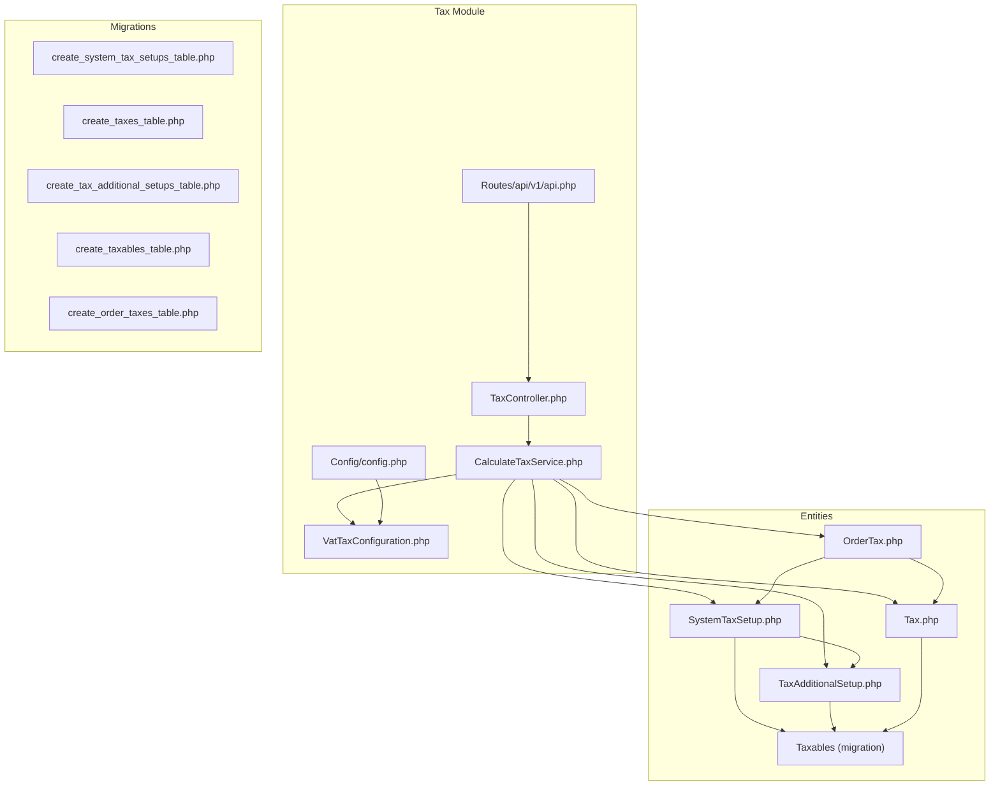
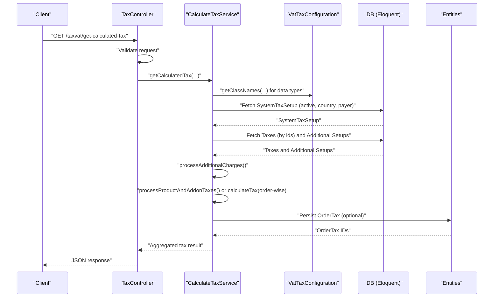
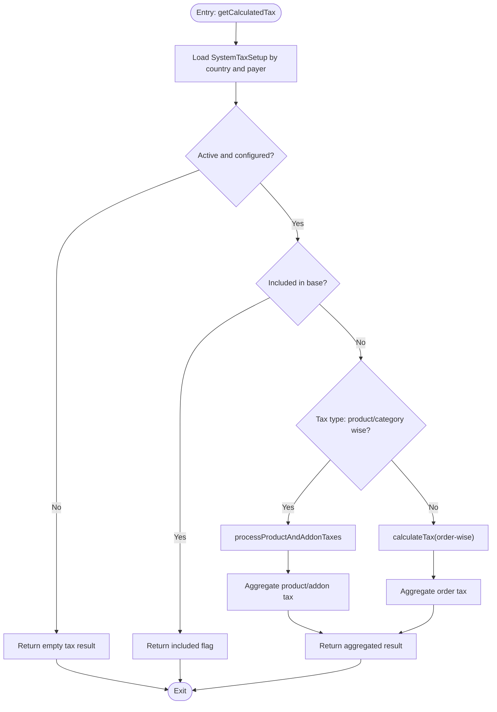
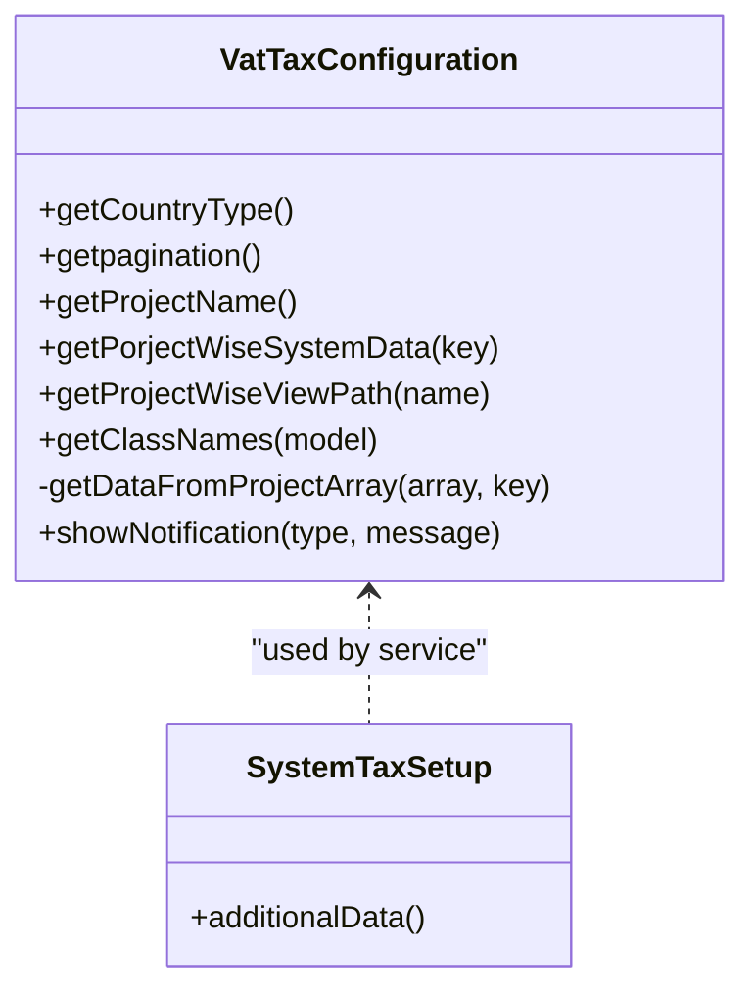
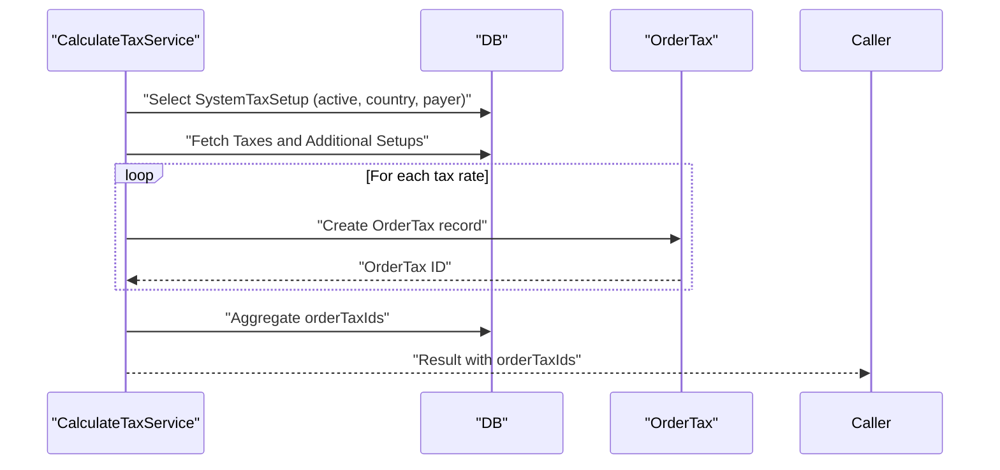
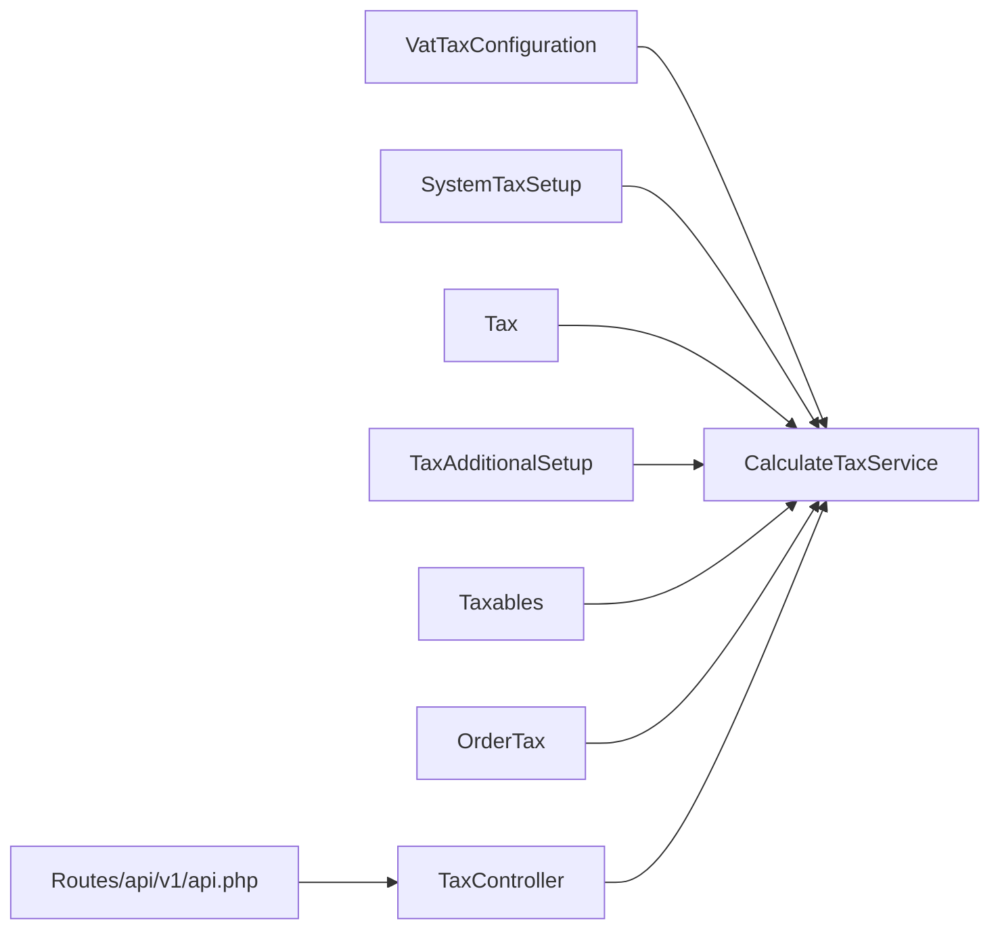

# Tax Calculation Service

<cite>
**Referenced Files in This Document**
- [CalculateTaxService.php](file://Modules/TaxModule/Services/CalculateTaxService.php)
- [VatTaxConfiguration.php](file://Modules/TaxModule/Traits/VatTaxConfiguration.php)
- [SystemTaxSetup.php](file://Modules/TaxModule/Entities/SystemTaxSetup.php)
- [Tax.php](file://Modules/TaxModule/Entities/Tax.php)
- [TaxAdditionalSetup.php](file://Modules/TaxModule/Entities/TaxAdditionalSetup.php)
- [OrderTax.php](file://Modules/TaxModule/Entities/OrderTax.php)
- [2025_05_26_115043_create_system_tax_setups_table.php](file://Modules/TaxModule/Database/Migrations/2025_05_26_115043_create_system_tax_setups_table.php)
- [2025_05_26_115643_create_taxes_table.php](file://Modules/TaxModule/Database/Migrations/2025_05_26_115643_create_taxes_table.php)
- [2025_05_26_120030_create_tax_additional_setups_table.php](file://Modules/TaxModule/Database/Migrations/2025_05_26_120030_create_tax_additional_setups_table.php)
- [2025_05_26_120912_create_taxables_table.php](file://Modules/TaxModule/Database/Migrations/2025_05_26_120912_create_taxables_table.php)
- [2025_05_26_121656_create_order_taxes_table.php](file://Modules/TaxModule/Database/Migrations/2025_05_26_121656_create_order_taxes_table.php)
- [TaxController.php](file://Modules/TaxModule/Http/Controllers/Api/V1/TaxController.php)
- [api.php](file://Modules/TaxModule/Routes/api/v1/api.php)
- [config.php](file://Modules/TaxModule/Config/config.php)
</cite>

## Table of Contents
1. [Introduction](#introduction)
2. [Project Structure](#project-structure)
3. [Core Components](#core-components)
4. [Architecture Overview](#architecture-overview)
5. [Detailed Component Analysis](#detailed-component-analysis)
6. [Dependency Analysis](#dependency-analysis)
7. [Performance Considerations](#performance-considerations)
8. [Troubleshooting Guide](#troubleshooting-guide)
9. [Conclusion](#conclusion)
10. [Appendices](#appendices)

## Introduction
This document explains the tax calculation service implementation used in the e-commerce platform. It focuses on the CalculateTaxService class for computing taxes, the VatTaxConfiguration trait for VAT-specific configurations, and the underlying data models and migrations. It also covers tax rate calculation, VAT computation, multi-tier tax processing, regional tax variations, exemptions, rounding and precision handling, and integration with order processing systems. Practical examples illustrate workflows for different business scenarios, product categories, and geographic regions.

## Project Structure
The tax module organizes tax-related logic into services, traits, entities, migrations, controllers, and routes. The service encapsulates the core tax calculation logic, while the trait centralizes project-specific configuration and model class mappings. The database schema supports system-wide tax setups, individual tax rates, additional charge tax setups, tax assignments per product/category/addon, and persisted order-level tax records.



**Diagram sources**
- [CalculateTaxService.php:1-325](file://Modules/TaxModule/Services/CalculateTaxService.php#L1-L325)
- [VatTaxConfiguration.php:1-139](file://Modules/TaxModule/Traits/VatTaxConfiguration.php#L1-L139)
- [TaxController.php:1-76](file://Modules/TaxModule/Http/Controllers/Api/V1/TaxController.php#L1-L76)
- [api.php:1-22](file://Modules/TaxModule/Routes/api/v1/api.php#L1-L22)
- [config.php:1-11](file://Modules/TaxModule/Config/config.php#L1-L11)
- [SystemTaxSetup.php:1-29](file://Modules/TaxModule/Entities/SystemTaxSetup.php#L1-L29)
- [Tax.php:1-21](file://Modules/TaxModule/Entities/Tax.php#L1-L21)
- [TaxAdditionalSetup.php:1-28](file://Modules/TaxModule/Entities/TaxAdditionalSetup.php#L1-L28)
- [OrderTax.php:1-37](file://Modules/TaxModule/Entities/OrderTax.php#L1-L37)
- [2025_05_26_115043_create_system_tax_setups_table.php:1-39](file://Modules/TaxModule/Database/Migrations/2025_05_26_115043_create_system_tax_setups_table.php#L1-L39)
- [2025_05_26_115643_create_taxes_table.php:1-37](file://Modules/TaxModule/Database/Migrations/2025_05_26_115643_create_taxes_table.php#L1-L37)
- [2025_05_26_120030_create_tax_additional_setups_table.php:1-36](file://Modules/TaxModule/Database/Migrations/2025_05_26_120030_create_tax_additional_setups_table.php#L1-L36)
- [2025_05_26_120912_create_taxables_table.php:1-37](file://Modules/TaxModule/Database/Migrations/2025_05_26_120912_create_taxables_table.php#L1-L37)
- [2025_05_26_121656_create_order_taxes_table.php:1-50](file://Modules/TaxModule/Database/Migrations/2025_05_26_121656_create_order_taxes_table.php#L1-L50)

**Section sources**
- [CalculateTaxService.php:1-325](file://Modules/TaxModule/Services/CalculateTaxService.php#L1-L325)
- [VatTaxConfiguration.php:1-139](file://Modules/TaxModule/Traits/VatTaxConfiguration.php#L1-L139)
- [TaxController.php:1-76](file://Modules/TaxModule/Http/Controllers/Api/V1/TaxController.php#L1-L76)
- [api.php:1-22](file://Modules/TaxModule/Routes/api/v1/api.php#L1-L22)
- [config.php:1-11](file://Modules/TaxModule/Config/config.php#L1-L11)

## Core Components
- CalculateTaxService: Orchestrates tax calculation across system tax setups, additional charges, products, addons, and order-level aggregation. It computes tax amounts, handles inclusion/exemption logic, persists order tax records, and manages error states.
- VatTaxConfiguration: Provides project-aware configuration for country type, pagination, project name, and tax calculation modes. It maps logical tax calculation contexts to concrete model classes per project.
- Entities and Migrations: Define the schema for system tax setups, tax rates, additional tax setups, tax assignments per item/category/addon, and persisted order tax records.

Key responsibilities:
- Multi-tier tax processing: order-wise, product-wise, category-wise, and addon-wise.
- VAT computation: cumulative tax rates and amounts, with optional inclusion in base amounts.
- Regional tax variations: country-specific system tax setups and tax rates.
- Compliance and persistence: storing order-level tax breakdowns with metadata for reporting.

**Section sources**
- [CalculateTaxService.php:13-116](file://Modules/TaxModule/Services/CalculateTaxService.php#L13-L116)
- [VatTaxConfiguration.php:6-139](file://Modules/TaxModule/Traits/VatTaxConfiguration.php#L6-L139)
- [SystemTaxSetup.php:9-28](file://Modules/TaxModule/Entities/SystemTaxSetup.php#L9-L28)
- [Tax.php:8-20](file://Modules/TaxModule/Entities/Tax.php#L8-L20)
- [TaxAdditionalSetup.php:9-27](file://Modules/TaxModule/Entities/TaxAdditionalSetup.php#L9-L27)
- [OrderTax.php:10-36](file://Modules/TaxModule/Entities/OrderTax.php#L10-L36)

## Architecture Overview
The tax calculation pipeline integrates API requests, validation, service orchestration, and persistence. The service selects an active system tax setup by country and payer type, applies applicable taxes (including additional charges), aggregates per-product/addon contributions, and optionally stores order-level tax records.



**Diagram sources**
- [TaxController.php:29-64](file://Modules/TaxModule/Http/Controllers/Api/V1/TaxController.php#L29-L64)
- [CalculateTaxService.php:16-116](file://Modules/TaxModule/Services/CalculateTaxService.php#L16-L116)
- [VatTaxConfiguration.php:80-110](file://Modules/TaxModule/Traits/VatTaxConfiguration.php#L80-L110)
- [OrderTax.php:10-36](file://Modules/TaxModule/Entities/OrderTax.php#L10-L36)

## Detailed Component Analysis

### CalculateTaxService
Responsibilities:
- Select system tax setup by country code and tax payer, ensuring activation and inclusion flags.
- Compute taxes for additional charges (e.g., packaging/delivery) linked to specific tax IDs.
- Process product-wise and addon-wise taxes using tax assignments per product/category/campaign product/addon/addon category.
- Aggregate totals and persist order-level tax entries when requested.
- Manage exceptions and return structured error metadata.

Key methods and logic:
- getCalculatedTax: Main entry point orchestrating selection, processing, and aggregation.
- processAdditionalCharges: Iterates active additional tax setups and computes tax per charge.
- processProductAndAddonTaxes: Resolves tax assignment via Taxable and computes per-item/addon tax.
- calculateTax: Computes tax amount per tax rate, aggregates totals, and optionally persists OrderTax.
- getTaxAmount: Core tax computation formula supporting inclusive/exclusive scenarios.
- updateOrderTaxData: Finalizes order linkage for previously stored order tax records.
- getProductwiseData: Generates product-level tax summaries for order-wise tax type.



**Diagram sources**
- [CalculateTaxService.php:16-116](file://Modules/TaxModule/Services/CalculateTaxService.php#L16-L116)
- [CalculateTaxService.php:123-241](file://Modules/TaxModule/Services/CalculateTaxService.php#L123-L241)
- [CalculateTaxService.php:246-286](file://Modules/TaxModule/Services/CalculateTaxService.php#L246-L286)
- [CalculateTaxService.php:288-297](file://Modules/TaxModule/Services/CalculateTaxService.php#L288-L297)

**Section sources**
- [CalculateTaxService.php:13-116](file://Modules/TaxModule/Services/CalculateTaxService.php#L13-L116)
- [CalculateTaxService.php:123-241](file://Modules/TaxModule/Services/CalculateTaxService.php#L123-L241)
- [CalculateTaxService.php:246-286](file://Modules/TaxModule/Services/CalculateTaxService.php#L246-L286)
- [CalculateTaxService.php:288-297](file://Modules/TaxModule/Services/CalculateTaxService.php#L288-L297)
- [CalculateTaxService.php:299-323](file://Modules/TaxModule/Services/CalculateTaxService.php#L299-L323)

### VatTaxConfiguration Trait
Responsibilities:
- Provide project-aware configuration for country type, pagination, and project name.
- Define supported tax calculation modes per project (order-wise, product-wise, category-wise, parcel, rental provider, prescription).
- Map logical tax contexts to concrete model classes (product, category, addon, store, order, trip, parcel category, campaign product).
- Support notification utilities via a facade.

Configuration highlights:
- Project selection via module config.
- Supported calculation modes and additional taxes vary by project.
- Class name resolution enables flexible model mapping across projects.



**Diagram sources**
- [VatTaxConfiguration.php:6-139](file://Modules/TaxModule/Traits/VatTaxConfiguration.php#L6-L139)
- [SystemTaxSetup.php:24-27](file://Modules/TaxModule/Entities/SystemTaxSetup.php#L24-L27)

**Section sources**
- [VatTaxConfiguration.php:6-139](file://Modules/TaxModule/Traits/VatTaxConfiguration.php#L6-L139)
- [config.php:3-10](file://Modules/TaxModule/Config/config.php#L3-L10)

### Data Models and Migrations
Core schema elements:
- SystemTaxSetup: Defines tax type, country code, payer type, default/active flags, inclusion flag, and associated tax IDs.
- Tax: Stores tax rate per country with active/default flags.
- TaxAdditionalSetup: Additional charge tax setups linked to a system tax setup.
- Taxables: Junction table linking tax rates to products/categories/addons via system tax setup.
- OrderTax: Persisted order-level tax records with metadata for reporting and reconciliation.

```mermaid
erDiagram
SYSTEM_TAX_SETUP {
bigint id PK
string tax_type
string country_code
string tax_payer
tinytext tax_ids
boolean is_default
boolean is_active
boolean is_included
timestamps created_at, updated_at
}
TAX {
bigint id PK
string name
double tax_rate
string country_code
boolean is_default
boolean is_active
timestamps created_at, updated_at
}
TAX_ADDITIONAL_SETUP {
bigint id PK
string name
bigint system_tax_setup_id FK
tinytext tax_ids
boolean is_active
timestamps created_at, updated_at
}
TAXABLES {
bigint id PK
string taxable_type
bigint taxable_id
bigint tax_id FK
bigint system_tax_setup_id FK
timestamps created_at, updated_at
}
ORDER_TAXES {
bigint id PK
string tax_name
string tax_type
string tax_on
double tax_rate
double tax_amount
double before_tax_amount
double after_tax_amount
string tax_payer
string country_code
bigint order_id
string order_type
int quantity
bigint tax_id FK
bigint taxable_id
string taxable_type
bigint store_id
string store_type
bigint system_tax_setup_id FK
timestamps created_at, updated_at
}
SYSTEM_TAX_SETUP ||--o{ TAX_ADDITIONAL_SETUP : "has many"
SYSTEM_TAX_SETUP ||--o{ TAXABLES : "links"
TAX ||--|| TAXABLES : "rates"
SYSTEM_TAX_SETUP ||--o{ ORDER_TAXES : "generates"
TAX ||--o{ ORDER_TAXES : "rates"
```

**Diagram sources**
- [2025_05_26_115043_create_system_tax_setups_table.php:14-26](file://Modules/TaxModule/Database/Migrations/2025_05_26_115043_create_system_tax_setups_table.php#L14-L26)
- [2025_05_26_115643_create_taxes_table.php:14-24](file://Modules/TaxModule/Database/Migrations/2025_05_26_115643_create_taxes_table.php#L14-L24)
- [2025_05_26_120030_create_tax_additional_setups_table.php:14-23](file://Modules/TaxModule/Database/Migrations/2025_05_26_120030_create_tax_additional_setups_table.php#L14-L23)
- [2025_05_26_120912_create_taxables_table.php:14-24](file://Modules/TaxModule/Database/Migrations/2025_05_26_120912_create_taxables_table.php#L14-L24)
- [2025_05_26_121656_create_order_taxes_table.php:14-37](file://Modules/TaxModule/Database/Migrations/2025_05_26_121656_create_order_taxes_table.php#L14-L37)

**Section sources**
- [SystemTaxSetup.php:9-28](file://Modules/TaxModule/Entities/SystemTaxSetup.php#L9-L28)
- [Tax.php:8-20](file://Modules/TaxModule/Entities/Tax.php#L8-L20)
- [TaxAdditionalSetup.php:9-27](file://Modules/TaxModule/Entities/TaxAdditionalSetup.php#L9-L27)
- [OrderTax.php:10-36](file://Modules/TaxModule/Entities/OrderTax.php#L10-L36)

### Tax Calculation Algorithms
- Base computation: getTaxAmount applies a formula to compute tax amount and total amount depending on inclusion flag.
- Multi-rate accumulation: calculateTax sums tax amounts across multiple tax rates and collects order tax IDs for persistence.
- Product/addon allocation: processProductAndAddonTaxes resolves applicable tax IDs via Taxables and computes per-item/addon tax.

Precision and rounding:
- Tax rates and monetary fields use double with sufficient precision to minimize floating-point drift.
- Recommendation: apply standardized rounding (e.g., half-up to nearest cent) at the end of aggregation to ensure compliance with local regulations.

Regional variations:
- Country code filtering ensures region-specific system tax setups and tax rates are applied.
- Additional tax setups support region-specific charges (e.g., packaging/delivery).

Exemptions:
- When a system tax setup is marked as included, the service returns an inclusion flag without further tax computation.
- Inactive system tax setups yield empty tax results.

**Section sources**
- [CalculateTaxService.php:288-297](file://Modules/TaxModule/Services/CalculateTaxService.php#L288-L297)
- [CalculateTaxService.php:246-286](file://Modules/TaxModule/Services/CalculateTaxService.php#L246-L286)
- [2025_05_26_115643_create_taxes_table.php:16-24](file://Modules/TaxModule/Database/Migrations/2025_05_26_115643_create_taxes_table.php#L16-L24)
- [2025_05_26_121656_create_order_taxes_table.php:16-37](file://Modules/TaxModule/Database/Migrations/2025_05_26_121656_create_order_taxes_table.php#L16-L37)

### Practical Examples

#### Scenario A: Product-wise tax for grocery items in a single-country setup
- Inputs: productIds with per-item quantities and discounted prices, taxPayer = vendor, countryCode = specific country, tax type = product_wise.
- Workflow: Service selects active system tax setup, resolves per-product tax IDs via Taxables, computes tax per product, aggregates totals, and optionally persists order tax records.

#### Scenario B: Additional packaging charge tax
- Inputs: additionalCharges containing packaging charge, taxPayer, orderId, storeId.
- Workflow: Service iterates active additional tax setups, computes tax on packaging charge, aggregates to total tax, and persists order tax entries.

#### Scenario C: Category-wise tax for pharmacy products
- Inputs: category-wise tax type, productIds mapped to categories, taxPayer = vendor, countryCode.
- Workflow: Service resolves category-level tax IDs via Taxables and computes tax per category contribution.

#### Scenario D: Order-wise tax for a rental provider trip
- Inputs: taxPayer = rental_provider, trip-wise calculation mode.
- Workflow: Service computes order-wise tax using applicable tax IDs and persists order tax records with order_type = trip.

**Section sources**
- [CalculateTaxService.php:62-95](file://Modules/TaxModule/Services/CalculateTaxService.php#L62-L95)
- [CalculateTaxService.php:123-152](file://Modules/TaxModule/Services/CalculateTaxService.php#L123-L152)
- [CalculateTaxService.php:154-241](file://Modules/TaxModule/Services/CalculateTaxService.php#L154-L241)
- [VatTaxConfiguration.php:22-55](file://Modules/TaxModule/Traits/VatTaxConfiguration.php#L22-L55)

### Integration with Order Processing Systems
- Persistence: When storeData is enabled, CalculateTaxService creates OrderTax entries per tax rate, capturing before/after amounts, tax type, payer, country code, order ID, quantity, and system tax setup linkage.
- Post-processing: updateOrderTaxData finalizes order linkage for pre-stored order tax records.
- Reporting: OrderTax schema includes fields for export and reconciliation, including store linkage and taxable references.



**Diagram sources**
- [CalculateTaxService.php:258-280](file://Modules/TaxModule/Services/CalculateTaxService.php#L258-L280)
- [OrderTax.php:10-36](file://Modules/TaxModule/Entities/OrderTax.php#L10-L36)

**Section sources**
- [CalculateTaxService.php:258-280](file://Modules/TaxModule/Services/CalculateTaxService.php#L258-L280)
- [CalculateTaxService.php:299-306](file://Modules/TaxModule/Services/CalculateTaxService.php#L299-L306)
- [OrderTax.php:10-36](file://Modules/TaxModule/Entities/OrderTax.php#L10-L36)

## Dependency Analysis
- Service depends on:
  - VatTaxConfiguration for project-specific mappings and calculation modes.
  - Entities for querying tax setups, rates, additional setups, and tax assignments.
  - OrderTax for persistence of computed taxes.
- Controllers depend on the service for tax calculation and expose validated endpoints.
- Routes define the API surface for tax retrieval and calculation.



**Diagram sources**
- [VatTaxConfiguration.php:6-139](file://Modules/TaxModule/Traits/VatTaxConfiguration.php#L6-L139)
- [CalculateTaxService.php:13-116](file://Modules/TaxModule/Services/CalculateTaxService.php#L13-L116)
- [SystemTaxSetup.php:9-28](file://Modules/TaxModule/Entities/SystemTaxSetup.php#L9-L28)
- [Tax.php:8-20](file://Modules/TaxModule/Entities/Tax.php#L8-L20)
- [TaxAdditionalSetup.php:9-27](file://Modules/TaxModule/Entities/TaxAdditionalSetup.php#L9-L27)
- [OrderTax.php:10-36](file://Modules/TaxModule/Entities/OrderTax.php#L10-L36)
- [TaxController.php:12-76](file://Modules/TaxModule/Http/Controllers/Api/V1/TaxController.php#L12-L76)
- [api.php:18-21](file://Modules/TaxModule/Routes/api/v1/api.php#L18-L21)

**Section sources**
- [CalculateTaxService.php:13-116](file://Modules/TaxModule/Services/CalculateTaxService.php#L13-L116)
- [TaxController.php:12-76](file://Modules/TaxModule/Http/Controllers/Api/V1/TaxController.php#L12-L76)
- [api.php:18-21](file://Modules/TaxModule/Routes/api/v1/api.php#L18-L21)

## Performance Considerations
- Minimize N+1 queries: Preload related tax setups and additional data to avoid repeated lookups during product/addon loops.
- Batch persistence: When storing OrderTax entries, consider bulk inserts to reduce overhead.
- Precision handling: Use decimal arithmetic for financial computations to avoid cumulative rounding errors; if using floats, round at aggregation boundaries.
- Indexing: Country code and tax_payer filters rely on indexed columns in SystemTaxSetup; ensure appropriate indices exist on frequently queried fields.
- Caching: Cache active system tax setups and tax rate lists for hot paths to reduce database load.

## Troubleshooting Guide
Common issues and resolutions:
- No active system tax setup found: The service returns an empty tax result. Verify country code, tax payer, and activation flags in SystemTaxSetup.
- Inclusive tax flag set: When is_included is true, the service returns an inclusion flag without computing tax. Confirm business requirement for inclusive pricing.
- Missing tax assignments: If Taxables does not link tax IDs to products/categories/addons, tax amounts will be zero. Ensure proper assignments via Taxables.
- Exception handling: On errors, the service returns an error payload with message and line number. Inspect logs and validate input parameters.
- Persistence failures: When storeData is true, the service wraps operations in a transaction-like rollback behavior. Ensure database connectivity and permissions.

Validation and error handling:
- API controller validates request parameters and returns structured error arrays.
- Service catches throwable exceptions and augments response with error metadata.

**Section sources**
- [CalculateTaxService.php:33-39](file://Modules/TaxModule/Services/CalculateTaxService.php#L33-L39)
- [CalculateTaxService.php:107-115](file://Modules/TaxModule/Services/CalculateTaxService.php#L107-L115)
- [TaxController.php:14-27](file://Modules/TaxModule/Http/Controllers/Api/V1/TaxController.php#L14-L27)
- [TaxController.php:29-64](file://Modules/TaxModule/Http/Controllers/Api/V1/TaxController.php#L29-L64)

## Conclusion
The tax calculation service provides a robust, extensible framework for multi-tier tax processing across order, product, category, and addon contexts. It integrates VAT-specific configurations via a project-aware trait, supports regional variations through country-based setups, and persists order-level tax records for compliance and reporting. By following the outlined best practices for precision, performance, and error handling, the system can reliably support diverse business scenarios and geographic requirements.

## Appendices

### API Endpoints
- GET /taxvat/get-taxVat-list: Retrieves active tax rates with pagination.
- PUT /taxvat/get-calculated-tax: Computes tax for an order based on provided parameters.

**Section sources**
- [api.php:18-21](file://Modules/TaxModule/Routes/api/v1/api.php#L18-L21)
- [TaxController.php:14-27](file://Modules/TaxModule/Http/Controllers/Api/V1/TaxController.php#L14-L27)
- [TaxController.php:29-64](file://Modules/TaxModule/Http/Controllers/Api/V1/TaxController.php#L29-L64)