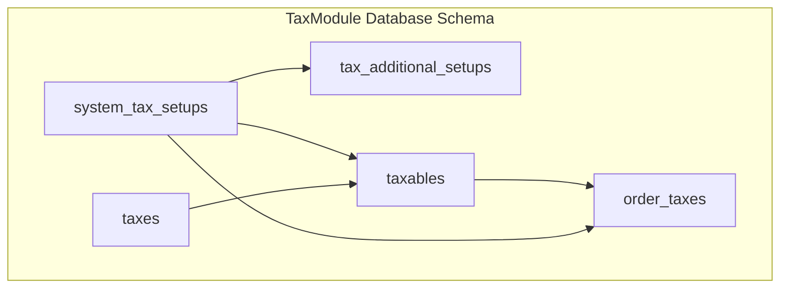
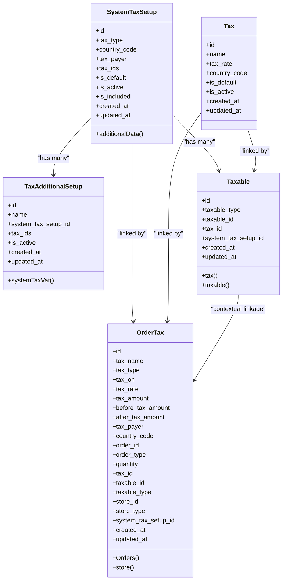
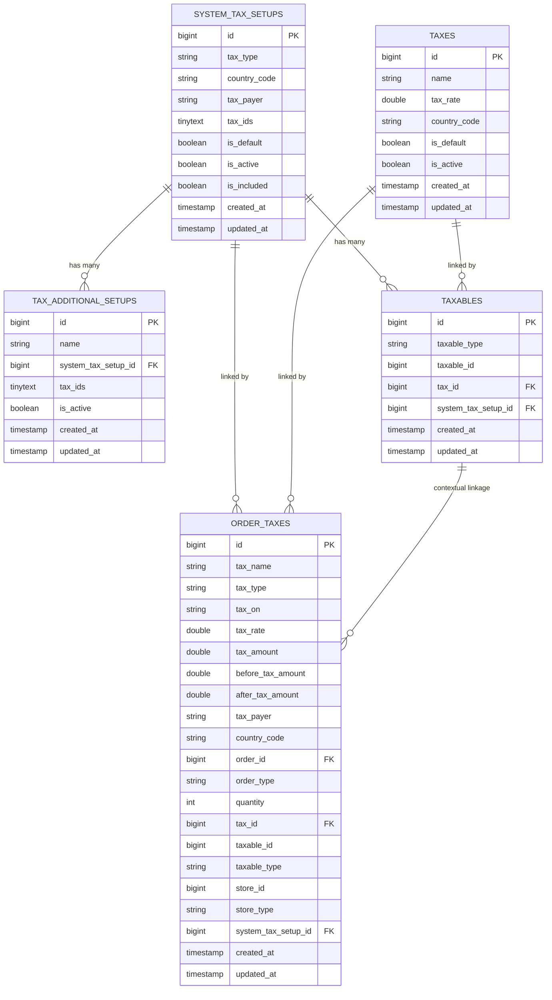

# Tax Database Schema

<cite>
**Referenced Files in This Document**
- [2025_05_26_115043_create_system_tax_setups_table.php](file://Modules/TaxModule/Database/Migrations/2025_05_26_115043_create_system_tax_setups_table.php)
- [2025_05_26_115643_create_taxes_table.php](file://Modules/TaxModule/Database/Migrations/2025_05_26_115643_create_taxes_table.php)
- [2025_05_26_120030_create_tax_additional_setups_table.php](file://Modules/TaxModule/Database/Migrations/2025_05_26_120030_create_tax_additional_setups_table.php)
- [2025_05_26_120912_create_taxables_table.php](file://Modules/TaxModule/Database/Migrations/2025_05_26_120912_create_taxables_table.php)
- [2025_05_26_121656_create_order_taxes_table.php](file://Modules/TaxModule/Database/Migrations/2025_05_26_121656_create_order_taxes_table.php)
- [SystemTaxSetup.php](file://Modules/TaxModule/Entities/SystemTaxSetup.php)
- [Tax.php](file://Modules/TaxModule/Entities/Tax.php)
- [TaxAdditionalSetup.php](file://Modules/TaxModule/Entities/TaxAdditionalSetup.php)
- [Taxable.php](file://Modules/TaxModule/Entities/Taxable.php)
- [OrderTax.php](file://Modules/TaxModule/Entities/OrderTax.php)
- [CalculateTaxService.php](file://Modules/TaxModule/Services/CalculateTaxService.php)
- [VatTaxConfiguration.php](file://Modules/TaxModule/Traits/VatTaxConfiguration.php)
- [config.php](file://Modules/TaxModule/Config/config.php)
- [TaxVatExport.php](file://Modules/TaxModule/Exports/TaxVatExport.php)
</cite>

## Table of Contents
1. [Introduction](#introduction)
2. [Project Structure](#project-structure)
3. [Core Components](#core-components)
4. [Architecture Overview](#architecture-overview)
5. [Detailed Component Analysis](#detailed-component-analysis)
6. [Dependency Analysis](#dependency-analysis)
7. [Performance Considerations](#performance-considerations)
8. [Troubleshooting Guide](#troubleshooting-guide)
9. [Conclusion](#conclusion)
10. [Appendices](#appendices)

## Introduction
This document provides comprehensive database schema documentation for the TaxModule. It covers the five core tables that define global tax configuration, tax rates, extended configurations, taxable items, and order-level tax application. The documentation includes field definitions, data types, constraints, indexes, foreign key relationships, and practical examples of data structures, query patterns, and reporting requirements.

## Project Structure
The TaxModule organizes its database schema across dedicated migration files and Eloquent entity models. The schema supports flexible tax setups by country, payer type, and calculation modes (order-wise, product-wise, category-wise), while tracking tax application per order and per item.

**Diagram sources**
- [2025_05_26_115043_create_system_tax_setups_table.php:16-26](file://Modules/TaxModule/Database/Migrations/2025_05_26_115043_create_system_tax_setups_table.php#L16-L26)
- [2025_05_26_115643_create_taxes_table.php:16-24](file://Modules/TaxModule/Database/Migrations/2025_05_26_115643_create_taxes_table.php#L16-L24)
- [2025_05_26_120030_create_tax_additional_setups_table.php:16-23](file://Modules/TaxModule/Database/Migrations/2025_05_26_120030_create_tax_additional_setups_table.php#L16-L23)
- [2025_05_26_120912_create_taxables_table.php:16-24](file://Modules/TaxModule/Database/Migrations/2025_05_26_120912_create_taxables_table.php#L16-L24)
- [2025_05_26_121656_create_order_taxes_table.php:16-36](file://Modules/TaxModule/Database/Migrations/2025_05_26_121656_create_order_taxes_table.php#L16-L36)

**Section sources**
- [2025_05_26_115043_create_system_tax_setups_table.php:1-39](file://Modules/TaxModule/Database/Migrations/2025_05_26_115043_create_system_tax_setups_table.php#L1-L39)
- [2025_05_26_115643_create_taxes_table.php:1-37](file://Modules/TaxModule/Database/Migrations/2025_05_26_115643_create_taxes_table.php#L1-L37)
- [2025_05_26_120030_create_tax_additional_setups_table.php:1-36](file://Modules/TaxModule/Database/Migrations/2025_05_26_120030_create_tax_additional_setups_table.php#L1-L36)
- [2025_05_26_120912_create_taxables_table.php:1-37](file://Modules/TaxModule/Database/Migrations/2025_05_26_120912_create_taxables_table.php#L1-L37)
- [2025_05_26_121656_create_order_taxes_table.php:1-50](file://Modules/TaxModule/Database/Migrations/2025_05_26_121656_create_order_taxes_table.php#L1-L50)

## Core Components
This section documents each table’s purpose, fields, constraints, and relationships.

- system_tax_setups
  - Purpose: Global tax configuration per country and payer type, including default selection, activation, inclusion flag, and associated tax IDs.
  - Key fields:
    - id: auto-incrementing primary key
    - tax_type: string, default "order_wise", indicates calculation mode
    - country_code: string, nullable, indexed for filtering
    - tax_payer: string, nullable, default "vendor", defines who pays the tax
    - tax_ids: tinyText, nullable, JSON-like array of tax IDs
    - is_default: boolean, default false
    - is_active: boolean, default true
    - is_included: boolean, default false, indicates if tax is included in amounts
    - timestamps: created_at and updated_at
  - Indexes: country_code
  - Constraints: None explicit; defaults applied via schema

- taxes
  - Purpose: Defines tax rate definitions with optional regional association.
  - Key fields:
    - id: auto-incrementing primary key
    - name: string
    - tax_rate: double precision, default 0
    - country_code: string, nullable, indexed
    - is_default: boolean, default false
    - is_active: boolean, default true
    - timestamps: created_at and updated_at
  - Indexes: country_code
  - Constraints: None explicit; defaults applied via schema

- tax_additional_setups
  - Purpose: Extended tax configurations linked to system_tax_setups, enabling additional charges (e.g., packaging) with associated tax IDs.
  - Key fields:
    - id: auto-incrementing primary key
    - name: string, indexed
    - system_tax_setup_id: foreignId, nullable
    - tax_ids: tinyText, nullable, JSON-like array of tax IDs
    - is_active: boolean, default true
    - timestamps: created_at and updated_at
  - Indexes: name
  - Foreign keys: system_tax_setup_id references system_tax_setups(id)

- taxables
  - Purpose: Junction table linking taxable entities (products, categories, addons, etc.) to specific taxes under a given system tax setup.
  - Key fields:
    - id: auto-incrementing primary key
    - taxable_type: string
    - taxable_id: integer
    - tax_id: foreignId
    - system_tax_setup_id: foreignId
    - timestamps: created_at and updated_at
  - Foreign keys: tax_id references taxes(id); system_tax_setup_id references system_tax_setups(id)
  - Notes: Supports polymorphic association via taxable_type and taxable_id

- order_taxes
  - Purpose: Records tax application per order, including tax name/type/on, calculated amounts, and related identifiers.
  - Key fields:
    - id: auto-incrementing primary key
    - tax_name: string
    - tax_type: string
    - tax_on: string
    - tax_rate: double precision, default 0
    - tax_amount: double precision, default 0
    - before_tax_amount: double precision, default 0
    - after_tax_amount: double precision, default 0
    - tax_payer: string, nullable
    - country_code: string, nullable, indexed
    - order_id: foreignId, nullable
    - order_type: string, nullable
    - quantity: integer, default 1, nullable
    - tax_id: foreignId
    - taxable_id: foreignId, nullable
    - taxable_type: string, nullable
    - store_id: foreignId, nullable
    - store_type: string, nullable
    - system_tax_setup_id: foreignId
    - timestamps: created_at and updated_at
  - Indexes: country_code
  - Foreign keys: order_id references orders(id); tax_id references taxes(id); system_tax_setup_id references system_tax_setups(id)

**Section sources**
- [2025_05_26_115043_create_system_tax_setups_table.php:16-26](file://Modules/TaxModule/Database/Migrations/2025_05_26_115043_create_system_tax_setups_table.php#L16-L26)
- [2025_05_26_115643_create_taxes_table.php:16-24](file://Modules/TaxModule/Database/Migrations/2025_05_26_115643_create_taxes_table.php#L16-L24)
- [2025_05_26_120030_create_tax_additional_setups_table.php:16-23](file://Modules/TaxModule/Database/Migrations/2025_05_26_120030_create_tax_additional_setups_table.php#L16-L23)
- [2025_05_26_120912_create_taxables_table.php:16-24](file://Modules/TaxModule/Database/Migrations/2025_05_26_120912_create_taxables_table.php#L16-L24)
- [2025_05_26_121656_create_order_taxes_table.php:16-36](file://Modules/TaxModule/Database/Migrations/2025_05_26_121656_create_order_taxes_table.php#L16-L36)

## Architecture Overview
The schema supports a layered tax configuration model:
- System-level setup defines calculation mode, payer type, and whether tax is included.
- Taxes define base rates and regional applicability.
- Additional setups enable extra charges (e.g., packaging) with associated tax IDs.
- Taxables links products/categories/addons to applicable taxes under a system setup.
- Order-level records capture per-order tax application and amounts.

**Diagram sources**
- [SystemTaxSetup.php:9-28](file://Modules/TaxModule/Entities/SystemTaxSetup.php#L9-L28)
- [Tax.php:8-20](file://Modules/TaxModule/Entities/Tax.php#L8-L20)
- [TaxAdditionalSetup.php:9-27](file://Modules/TaxModule/Entities/TaxAdditionalSetup.php#L9-L27)
- [Taxable.php:8-24](file://Modules/TaxModule/Entities/Taxable.php#L8-L24)
- [OrderTax.php:10-36](file://Modules/TaxModule/Entities/OrderTax.php#L10-L36)

## Detailed Component Analysis

### system_tax_setups
- Purpose: Centralized configuration for tax calculation mode, country targeting, payer type, default selection, activation, and inclusion behavior.
- Key behaviors:
  - Filters active setups by country and payer type.
  - Stores associated tax IDs as an array-like value.
  - Supports inclusion flag to compute tax-inclusive pricing.
- Typical queries:
  - Select active setup by country and payer type.
  - Retrieve default setup when none matches.
- Reporting: Used as the basis for generating tax reports and exports.

**Section sources**
- [2025_05_26_115043_create_system_tax_setups_table.php:16-26](file://Modules/TaxModule/Database/Migrations/2025_05_26_115043_create_system_tax_setups_table.php#L16-L26)
- [SystemTaxSetup.php:9-28](file://Modules/TaxModule/Entities/SystemTaxSetup.php#L9-L28)
- [CalculateTaxService.php:27-31](file://Modules/TaxModule/Services/CalculateTaxService.php#L27-L31)
- [VatTaxConfiguration.php:22-55](file://Modules/TaxModule/Traits/VatTaxConfiguration.php#L22-L55)

### taxes
- Purpose: Defines individual tax rates with optional country association and activation status.
- Key behaviors:
  - Aggregates tax rates for calculation.
  - Supports regional variations via country_code.
- Typical queries:
  - Fetch active taxes by IDs for a given setup.
  - Filter by country for regional compliance.

**Section sources**
- [2025_05_26_115643_create_taxes_table.php:16-24](file://Modules/TaxModule/Database/Migrations/2025_05_26_115643_create_taxes_table.php#L16-L24)
- [Tax.php:8-20](file://Modules/TaxModule/Entities/Tax.php#L8-L20)
- [CalculateTaxService.php:248-256](file://Modules/TaxModule/Services/CalculateTaxService.php#L248-L256)

### tax_additional_setups
- Purpose: Enables additional charge types (e.g., packaging) with associated tax IDs under a system setup.
- Key behaviors:
  - Associates extra charges with specific tax sets.
  - Active-only processing during tax calculation.
- Typical queries:
  - List active additional setups for a system setup.
  - Compute tax on additional charges independently.

**Section sources**
- [2025_05_26_120030_create_tax_additional_setups_table.php:16-23](file://Modules/TaxModule/Database/Migrations/2025_05_26_120030_create_tax_additional_setups_table.php#L16-L23)
- [TaxAdditionalSetup.php:9-27](file://Modules/TaxModule/Entities/TaxAdditionalSetup.php#L9-L27)
- [CalculateTaxService.php:127-151](file://Modules/TaxModule/Services/CalculateTaxService.php#L127-L151)

### taxables
- Purpose: Links taxable entities (products, categories, addons, etc.) to specific taxes under a system setup.
- Key behaviors:
  - Supports polymorphic associations via taxable_type and taxable_id.
  - Retrieves applicable tax IDs for a given entity and setup.
- Typical queries:
  - Find tax IDs for a product/category/addon under a system setup.
  - Bulk lookup for product-wise or category-wise tax application.

**Section sources**
- [2025_05_26_120912_create_taxables_table.php:16-24](file://Modules/TaxModule/Database/Migrations/2025_05_26_120912_create_taxables_table.php#L16-L24)
- [Taxable.php:8-24](file://Modules/TaxModule/Entities/Taxable.php#L8-L24)
- [CalculateTaxService.php:182-186](file://Modules/TaxModule/Services/CalculateTaxService.php#L182-L186)

### order_taxes
- Purpose: Captures per-order tax application, including tax name/type/on, computed amounts, and identifiers for order, store, and system setup.
- Key behaviors:
  - Stores pre/post tax amounts and tax rate.
  - Tracks quantity and entity linkage (orderable/store).
- Typical queries:
  - Summarize tax amounts per order.
  - Group by tax type or country for reporting.

**Section sources**
- [2025_05_26_121656_create_order_taxes_table.php:16-36](file://Modules/TaxModule/Database/Migrations/2025_05_26_121656_create_order_taxes_table.php#L16-L36)
- [OrderTax.php:10-36](file://Modules/TaxModule/Entities/OrderTax.php#L10-L36)
- [CalculateTaxService.php:258-280](file://Modules/TaxModule/Services/CalculateTaxService.php#L258-L280)

## Dependency Analysis
The following diagram shows the relationships among tables and how they connect to support tax calculation and reporting.

**Diagram sources**
- [2025_05_26_115043_create_system_tax_setups_table.php:16-26](file://Modules/TaxModule/Database/Migrations/2025_05_26_115043_create_system_tax_setups_table.php#L16-L26)
- [2025_05_26_115643_create_taxes_table.php:16-24](file://Modules/TaxModule/Database/Migrations/2025_05_26_115643_create_taxes_table.php#L16-L24)
- [2025_05_26_120030_create_tax_additional_setups_table.php:16-23](file://Modules/TaxModule/Database/Migrations/2025_05_26_120030_create_tax_additional_setups_table.php#L16-L23)
- [2025_05_26_120912_create_taxables_table.php:16-24](file://Modules/TaxModule/Database/Migrations/2025_05_26_120912_create_taxables_table.php#L16-L24)
- [2025_05_26_121656_create_order_taxes_table.php:16-36](file://Modules/TaxModule/Database/Migrations/2025_05_26_121656_create_order_taxes_table.php#L16-L36)

## Performance Considerations
- Indexes: Country filters on system_tax_setups and taxes rely on country_code indexes; ensure these indexes are present for efficient filtering.
- Arrays vs. joins: tax_ids stored as arrays-like strings require careful querying; consider normalized junction tables if frequent lookups become a bottleneck.
- Polymorphic lookups: taxables uses polymorphic columns; ensure appropriate indexing on taxable_type and taxable_id for performance.
- Aggregation: Order-level tax summaries should leverage grouped queries on order_id and tax_type to minimize application-side computation.
- Caching: Frequently accessed system_tax_setups and taxes can benefit from caching strategies to reduce database load.

## Troubleshooting Guide
Common issues and resolutions:
- No active system setup found:
  - Verify is_active flag and matching country_code/tax_payer.
  - Check tax_type compatibility with the selected calculation mode.
- Missing tax amounts:
  - Confirm tax_ids association in system_tax_setups and tax_additional_setups.
  - Ensure taxes are active and have non-zero tax_rate.
- Incorrect tax inclusion:
  - Validate is_included flag in system_tax_setups; included tax affects amount computations.
- Polymorphic linkage failures:
  - Verify taxable_type and taxable_id values match supported classes and IDs.
- Reporting discrepancies:
  - Cross-check order_taxes entries for correct order_id, tax_id, and system_tax_setup_id.

**Section sources**
- [CalculateTaxService.php:33-39](file://Modules/TaxModule/Services/CalculateTaxService.php#L33-L39)
- [CalculateTaxService.php:248-256](file://Modules/TaxModule/Services/CalculateTaxService.php#L248-L256)
- [CalculateTaxService.php:182-186](file://Modules/TaxModule/Services/CalculateTaxService.php#L182-L186)

## Conclusion
The TaxModule schema provides a robust foundation for managing global tax configurations, regional variations, and order-level tax application. By leveraging system_tax_setups, taxes, tax_additional_setups, taxables, and order_taxes, the system supports flexible tax calculation modes and accurate reporting. Proper indexing, validation of associations, and adherence to the calculation logic ensure reliable tax processing.

## Appendices

### Field Definitions and Constraints Reference
- system_tax_setups
  - Fields: id, tax_type, country_code, tax_payer, tax_ids, is_default, is_active, is_included, timestamps
  - Indexes: country_code
  - Defaults: tax_type="order_wise", is_default=false, is_active=true, is_included=false
- taxes
  - Fields: id, name, tax_rate, country_code, is_default, is_active, timestamps
  - Indexes: country_code
  - Defaults: tax_rate=0, is_default=false, is_active=true
- tax_additional_setups
  - Fields: id, name, system_tax_setup_id, tax_ids, is_active, timestamps
  - Indexes: name
  - Defaults: is_active=true
- taxables
  - Fields: id, taxable_type, taxable_id, tax_id, system_tax_setup_id, timestamps
  - Foreign keys: tax_id → taxes(id), system_tax_setup_id → system_tax_setups(id)
- order_taxes
  - Fields: id, tax_name, tax_type, tax_on, tax_rate, tax_amount, before_tax_amount, after_tax_amount, tax_payer, country_code, order_id, order_type, quantity, tax_id, taxable_id, taxable_type, store_id, store_type, system_tax_setup_id, timestamps
  - Indexes: country_code
  - Foreign keys: order_id → orders(id), tax_id → taxes(id), system_tax_setup_id → system_tax_setups(id)

**Section sources**
- [2025_05_26_115043_create_system_tax_setups_table.php:16-26](file://Modules/TaxModule/Database/Migrations/2025_05_26_115043_create_system_tax_setups_table.php#L16-L26)
- [2025_05_26_115643_create_taxes_table.php:16-24](file://Modules/TaxModule/Database/Migrations/2025_05_26_115643_create_taxes_table.php#L16-L24)
- [2025_05_26_120030_create_tax_additional_setups_table.php:16-23](file://Modules/TaxModule/Database/Migrations/2025_05_26_120030_create_tax_additional_setups_table.php#L16-L23)
- [2025_05_26_120912_create_taxables_table.php:16-24](file://Modules/TaxModule/Database/Migrations/2025_05_26_120912_create_taxables_table.php#L16-L24)
- [2025_05_26_121656_create_order_taxes_table.php:16-36](file://Modules/TaxModule/Database/Migrations/2025_05_26_121656_create_order_taxes_table.php#L16-L36)

### Example Data Structures and Query Patterns
- Example structures:
  - System setup: { tax_type: "product_wise", country_code: "US", tax_payer: "vendor", is_active: true, is_included: false, tax_ids: "[1,2]" }
  - Tax: { name: "VAT", tax_rate: 8.5, country_code: "US", is_active: true }
  - Additional setup: { name: "packaging", system_tax_setup_id: 1, tax_ids: "[3]", is_active: true }
  - Taxables: { taxable_type: "App\\Models\\Item", taxable_id: 101, tax_id: 1, system_tax_setup_id: 1 }
  - Order tax: { tax_name: "VAT", tax_type: "product_wise", tax_on: "basic", tax_rate: 8.5, tax_amount: 4.25, before_tax_amount: 50.0, after_tax_amount: 54.25, order_id: 2001, system_tax_setup_id: 1, tax_id: 1 }
- Query patterns:
  - Get active system setup by country and payer: filter system_tax_setups by country_code and tax_payer where is_active = true.
  - Compute tax on additional charges: iterate active tax_additional_setups for the system setup and calculate tax on provided charge amounts.
  - Product-wise tax lookup: join taxables with system_tax_setups to fetch applicable tax IDs for each product or category.
  - Order-level aggregation: group order_taxes by order_id and tax_type to summarize total tax amounts.

**Section sources**
- [CalculateTaxService.php:27-31](file://Modules/TaxModule/Services/CalculateTaxService.php#L27-L31)
- [CalculateTaxService.php:127-151](file://Modules/TaxModule/Services/CalculateTaxService.php#L127-L151)
- [CalculateTaxService.php:182-186](file://Modules/TaxModule/Services/CalculateTaxService.php#L182-L186)
- [CalculateTaxService.php:258-280](file://Modules/TaxModule/Services/CalculateTaxService.php#L258-L280)

### Reporting Requirements
- Export capabilities:
  - TaxVatExport integrates with Excel export to produce formatted tax reports aligned with project-specific view paths.
  - Uses VatTaxConfiguration to resolve project-specific view names and export styling.
- Data export fields:
  - The export leverages project-wise view paths configured in VatTaxConfiguration and applies styling and alignment for readability.
- Configuration:
  - TaxModule config exposes project name, pagination, and country type for consistent behavior across environments.

**Section sources**
- [TaxVatExport.php:17-33](file://Modules/TaxModule/Exports/TaxVatExport.php#L17-L33)
- [VatTaxConfiguration.php:57-79](file://Modules/TaxModule/Traits/VatTaxConfiguration.php#L57-L79)
- [config.php:3-10](file://Modules/TaxModule/Config/config.php#L3-L10)