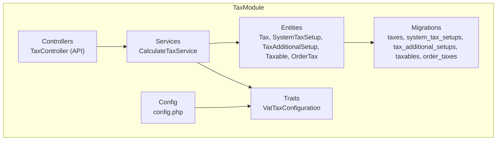
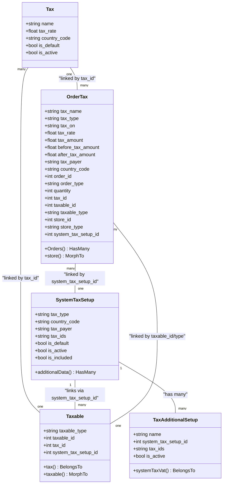
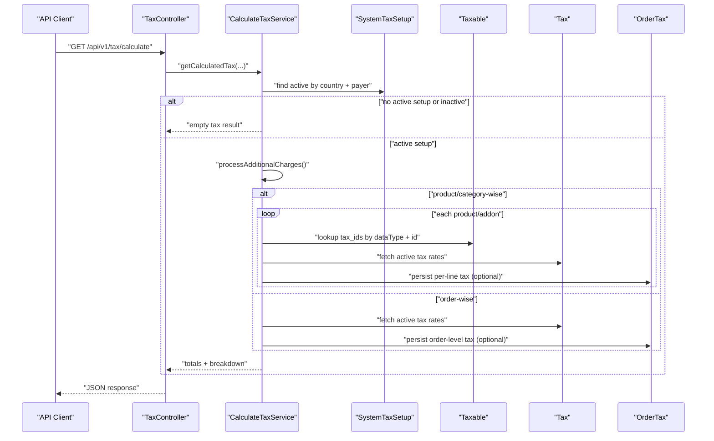
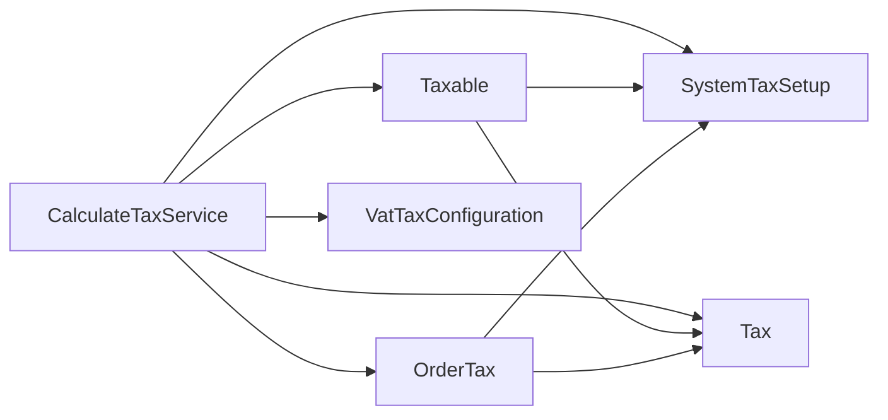

# Tax Entities and Models

<cite>
**Referenced Files in This Document**
- [Tax.php](file://Modules/TaxModule/Entities/Tax.php)
- [SystemTaxSetup.php](file://Modules/TaxModule/Entities/SystemTaxSetup.php)
- [TaxAdditionalSetup.php](file://Modules/TaxModule/Entities/TaxAdditionalSetup.php)
- [Taxable.php](file://Modules/TaxModule/Entities/Taxable.php)
- [OrderTax.php](file://Modules/TaxModule/Entities/OrderTax.php)
- [2025_05_26_115643_create_taxes_table.php](file://Modules/TaxModule/Database/Migrations/2025_05_26_115643_create_taxes_table.php)
- [2025_05_26_115043_create_system_tax_setups_table.php](file://Modules/TaxModule/Database/Migrations/2025_05_26_115043_create_system_tax_setups_table.php)
- [2025_05_26_120030_create_tax_additional_setups_table.php](file://Modules/TaxModule/Database/Migrations/2025_05_26_120030_create_tax_additional_setups_table.php)
- [2025_05_26_120912_create_taxables_table.php](file://Modules/TaxModule/Database/Migrations/2025_05_26_120912_create_taxables_table.php)
- [2025_05_26_121656_create_order_taxes_table.php](file://Modules/TaxModule/Database/Migrations/2025_05_26_121656_create_order_taxes_table.php)
- [CalculateTaxService.php](file://Modules/TaxModule/Services/CalculateTaxService.php)
- [VatTaxConfiguration.php](file://Modules/TaxModule/Traits/VatTaxConfiguration.php)
- [TaxController.php](file://Modules/TaxModule/Http/Controllers/Api/V1/TaxController.php)
- [config.php](file://Modules/TaxModule/Config/config.php)
</cite>

## Table of Contents
1. [Introduction](#introduction)
2. [Project Structure](#project-structure)
3. [Core Components](#core-components)
4. [Architecture Overview](#architecture-overview)
5. [Detailed Component Analysis](#detailed-component-analysis)
6. [Dependency Analysis](#dependency-analysis)
7. [Performance Considerations](#performance-considerations)
8. [Troubleshooting Guide](#troubleshooting-guide)
9. [Conclusion](#conclusion)
10. [Appendices](#appendices)

## Introduction
This document explains the TaxModule’s core entities and models, focusing on how taxes are configured, calculated, and tracked across orders and products. It covers:
- Tax model structure, rates, and regional applicability
- System-wide tax setup for global configuration and payer behavior
- Extended tax setups for exemptions and special cases
- Tracking of taxable items and their relationships to orders and stores
- Calculation logic, validation rules, and business behavior
- Practical usage examples in order processing, product pricing, and financial reporting

## Project Structure
The TaxModule organizes tax-related logic into entities, migrations, a calculation service, configuration traits, controllers, and configuration files. The structure supports flexible tax systems across regions and tax types.



**Diagram sources**
- [Tax.php:1-21](file://Modules/TaxModule/Entities/Tax.php#L1-L21)
- [SystemTaxSetup.php:1-29](file://Modules/TaxModule/Entities/SystemTaxSetup.php#L1-L29)
- [TaxAdditionalSetup.php:1-28](file://Modules/TaxModule/Entities/TaxAdditionalSetup.php#L1-L28)
- [Taxable.php:1-25](file://Modules/TaxModule/Entities/Taxable.php#L1-L25)
- [OrderTax.php:1-37](file://Modules/TaxModule/Entities/OrderTax.php#L1-L37)
- [2025_05_26_115643_create_taxes_table.php:1-37](file://Modules/TaxModule/Database/Migrations/2025_05_26_115643_create_taxes_table.php#L1-L37)
- [2025_05_26_115043_create_system_tax_setups_table.php:1-39](file://Modules/TaxModule/Database/Migrations/2025_05_26_115043_create_system_tax_setups_table.php#L1-L39)
- [2025_05_26_120030_create_tax_additional_setups_table.php:1-36](file://Modules/TaxModule/Database/Migrations/2025_05_26_120030_create_tax_additional_setups_table.php#L1-L36)
- [2025_05_26_120912_create_taxables_table.php:1-37](file://Modules/TaxModule/Database/Migrations/2025_05_26_120912_create_taxables_table.php#L1-L37)
- [2025_05_26_121656_create_order_taxes_table.php:1-50](file://Modules/TaxModule/Database/Migrations/2025_05_26_121656_create_order_taxes_table.php#L1-L50)
- [CalculateTaxService.php:1-325](file://Modules/TaxModule/Services/CalculateTaxService.php#L1-L325)
- [VatTaxConfiguration.php:1-139](file://Modules/TaxModule/Traits/VatTaxConfiguration.php#L1-L139)
- [TaxController.php:1-76](file://Modules/TaxModule/Http/Controllers/Api/V1/TaxController.php#L1-L76)
- [config.php:1-11](file://Modules/TaxModule/Config/config.php#L1-L11)

**Section sources**
- [Tax.php:1-21](file://Modules/TaxModule/Entities/Tax.php#L1-L21)
- [SystemTaxSetup.php:1-29](file://Modules/TaxModule/Entities/SystemTaxSetup.php#L1-L29)
- [TaxAdditionalSetup.php:1-28](file://Modules/TaxModule/Entities/TaxAdditionalSetup.php#L1-L28)
- [Taxable.php:1-25](file://Modules/TaxModule/Entities/Taxable.php#L1-L25)
- [OrderTax.php:1-37](file://Modules/TaxModule/Entities/OrderTax.php#L1-L37)
- [2025_05_26_115643_create_taxes_table.php:1-37](file://Modules/TaxModule/Database/Migrations/2025_05_26_115643_create_taxes_table.php#L1-L37)
- [2025_05_26_115043_create_system_tax_setups_table.php:1-39](file://Modules/TaxModule/Database/Migrations/2025_05_26_115043_create_system_tax_setups_table.php#L1-L39)
- [2025_05_26_120030_create_tax_additional_setups_table.php:1-36](file://Modules/TaxModule/Database/Migrations/2025_05_26_120030_create_tax_additional_setups_table.php#L1-L36)
- [2025_05_26_120912_create_taxables_table.php:1-37](file://Modules/TaxModule/Database/Migrations/2025_05_26_120912_create_taxables_table.php#L1-L37)
- [2025_05_26_121656_create_order_taxes_table.php:1-50](file://Modules/TaxModule/Database/Migrations/2025_05_26_121656_create_order_taxes_table.php#L1-L50)
- [CalculateTaxService.php:1-325](file://Modules/TaxModule/Services/CalculateTaxService.php#L1-L325)
- [VatTaxConfiguration.php:1-139](file://Modules/TaxModule/Traits/VatTaxConfiguration.php#L1-L139)
- [TaxController.php:1-76](file://Modules/TaxModule/Http/Controllers/Api/V1/TaxController.php#L1-L76)
- [config.php:1-11](file://Modules/TaxModule/Config/config.php#L1-L11)

## Core Components
This section documents the five primary models and their roles in the tax system.

- Tax
  - Purpose: Defines individual tax definitions with rates and regional targeting.
  - Key fields: name, tax_rate, country_code, is_default, is_active.
  - Behavior: Supports integer casting for booleans and float casting for tax_rate.

- SystemTaxSetup
  - Purpose: Global tax system configuration controlling how taxes apply (order-wise vs product/category-wise), who pays, inclusion behavior, and applicable tax sets per region.
  - Key fields: tax_type, country_code, tax_payer, tax_ids, is_default, is_active, is_included.
  - Relationships: Has many TaxAdditionalSetup entries via system_tax_setup_id.

- TaxAdditionalSetup
  - Purpose: Extended tax configurations for special cases or additional charges (e.g., packaging).
  - Key fields: name, system_tax_setup_id, tax_ids, is_active.
  - Relationships: Belongs to SystemTaxSetup.

- Taxable
  - Purpose: Polymorphic linkage between tax definitions and business entities (products, categories, addons, etc.) under a specific SystemTaxSetup.
  - Key fields: taxable_type, taxable_id, tax_id, system_tax_setup_id.
  - Relationships: Belongs to Tax; polymorphic parent via morphTo.

- OrderTax
  - Purpose: Tracks tax applied to specific order items, stores, and taxables, including pre/post-tax amounts and tax breakdown.
  - Key fields: tax_name, tax_type, tax_on, tax_rate, tax_amount, before_tax_amount, after_tax_amount, tax_payer, country_code, order_id, order_type, quantity, tax_id, taxable_id, taxable_type, store_id, store_type, system_tax_setup_id.
  - Relationships: Has many Orders via order_id; polymorphic store via morphTo.

**Section sources**
- [Tax.php:1-21](file://Modules/TaxModule/Entities/Tax.php#L1-L21)
- [SystemTaxSetup.php:1-29](file://Modules/TaxModule/Entities/SystemTaxSetup.php#L1-L29)
- [TaxAdditionalSetup.php:1-28](file://Modules/TaxModule/Entities/TaxAdditionalSetup.php#L1-L28)
- [Taxable.php:1-25](file://Modules/TaxModule/Entities/Taxable.php#L1-L25)
- [OrderTax.php:1-37](file://Modules/TaxModule/Entities/OrderTax.php#L1-L37)

## Architecture Overview
The tax system integrates configuration, lookup, and calculation into a cohesive pipeline. SystemTaxSetup selects the active tax regime by country and payer. Taxable links tax definitions to business entities. CalculateTaxService orchestrates calculations across products, addons, and additional charges, persisting per-line tax records in OrderTax.



**Diagram sources**
- [SystemTaxSetup.php:1-29](file://Modules/TaxModule/Entities/SystemTaxSetup.php#L1-L29)
- [TaxAdditionalSetup.php:1-28](file://Modules/TaxModule/Entities/TaxAdditionalSetup.php#L1-L28)
- [Tax.php:1-21](file://Modules/TaxModule/Entities/Tax.php#L1-L21)
- [Taxable.php:1-25](file://Modules/TaxModule/Entities/Taxable.php#L1-L25)
- [OrderTax.php:1-37](file://Modules/TaxModule/Entities/OrderTax.php#L1-L37)

## Detailed Component Analysis

### Tax Model
- Purpose: Encapsulates a single tax definition with configurable rate and regional targeting.
- Fields and casts:
  - is_default: integer
  - is_active: integer
  - tax_rate: float
- Regional targeting: country_code indexed for efficient filtering.
- Validation: No explicit model-level validation rules; rely on migrations and service logic.

**Section sources**
- [Tax.php:1-21](file://Modules/TaxModule/Entities/Tax.php#L1-L21)
- [2025_05_26_115643_create_taxes_table.php:16-24](file://Modules/TaxModule/Database/Migrations/2025_05_26_115643_create_taxes_table.php#L16-L24)

### SystemTaxSetup Model
- Purpose: Global tax configuration controlling:
  - How taxes are calculated: order_wise, product_wise, category_wise
  - Who pays: vendor, rental_provider, parcel, prescription
  - Whether tax is included in amounts
  - Which tax definitions apply per country
- Fields and casts:
  - is_default: integer
  - is_active: integer
  - is_included: integer
  - tax_ids: array
- Relationship: Has many TaxAdditionalSetup entries.

**Section sources**
- [SystemTaxSetup.php:1-29](file://Modules/TaxModule/Entities/SystemTaxSetup.php#L1-L29)
- [2025_05_26_115043_create_system_tax_setups_table.php:16-26](file://Modules/TaxModule/Database/Migrations/2025_05_26_115043_create_system_tax_setups_table.php#L16-L26)

### TaxAdditionalSetup Model
- Purpose: Define additional tax configurations or exemptions for special cases (e.g., packaging).
- Fields and casts:
  - is_default: integer
  - is_active: integer
  - is_included: integer
  - system_tax_setup_id: integer
  - tax_ids: array
- Relationship: Belongs to SystemTaxSetup.

**Section sources**
- [TaxAdditionalSetup.php:1-28](file://Modules/TaxModule/Entities/TaxAdditionalSetup.php#L1-L28)
- [2025_05_26_120030_create_tax_additional_setups_table.php:16-23](file://Modules/TaxModule/Database/Migrations/2025_05_26_120030_create_tax_additional_setups_table.php#L16-L23)

### Taxable Model
- Purpose: Polymorphic bridge linking tax definitions to business entities under a given SystemTaxSetup.
- Relationships:
  - Belongs to Tax
  - Polymorphic parent via morphTo for entities like products, categories, addons, campaigns
- Indexing: Supports efficient lookups by taxable_type and taxable_id.

**Section sources**
- [Taxable.php:1-25](file://Modules/TaxModule/Entities/Taxable.php#L1-L25)
- [2025_05_26_120912_create_taxables_table.php:16-24](file://Modules/TaxModule/Database/Migrations/2025_05_26_120912_create_taxables_table.php#L16-L24)

### OrderTax Model
- Purpose: Persist per-item tax records for reporting and reconciliation.
- Fields include tax breakdown, payer, country, order/store linkage, and quantity.
- Relationships:
  - Has many Orders via order_id
  - Polymorphic store via morphTo

**Section sources**
- [OrderTax.php:1-37](file://Modules/TaxModule/Entities/OrderTax.php#L1-L37)
- [2025_05_26_121656_create_order_taxes_table.php:16-36](file://Modules/TaxModule/Database/Migrations/2025_05_26_121656_create_order_taxes_table.php#L16-L36)

### Calculation Service and Business Logic
- Orchestrator: CalculateTaxService
- Inputs:
  - Amount, productIds, addonIds, additionalCharges
  - taxPayer, storeData, orderId, countryCode, storeId
- Workflow highlights:
  - Select active SystemTaxSetup by country and payer
  - If taxes are included, short-circuit with include flag
  - Process additional charges defined in SystemTaxSetup->additionalData
  - For product/category-wise: resolve tax_ids via Taxable for each product/addon
  - For order-wise: compute tax on total amount
  - Persist per-tax record in OrderTax when storeData is enabled
  - Return structured totals and breakdowns



**Diagram sources**
- [TaxController.php:29-64](file://Modules/TaxModule/Http/Controllers/Api/V1/TaxController.php#L29-L64)
- [CalculateTaxService.php:16-116](file://Modules/TaxModule/Services/CalculateTaxService.php#L16-L116)
- [Taxable.php:15-23](file://Modules/TaxModule/Entities/Taxable.php#L15-L23)
- [Tax.php:14-19](file://Modules/TaxModule/Entities/Tax.php#L14-L19)
- [OrderTax.php:14-25](file://Modules/TaxModule/Entities/OrderTax.php#L14-L25)

**Section sources**
- [CalculateTaxService.php:1-325](file://Modules/TaxModule/Services/CalculateTaxService.php#L1-L325)
- [TaxController.php:1-76](file://Modules/TaxModule/Http/Controllers/Api/V1/TaxController.php#L1-L76)
- [VatTaxConfiguration.php:1-139](file://Modules/TaxModule/Traits/VatTaxConfiguration.php#L1-L139)

### Data Flow and Validation Rules
- API validation (TaxController):
  - getTaxVatList: limit and offset numeric checks
  - getCalculateTax: validates presence and types for productIds, categoryIds, quantity, optional addon arrays, and optional identifiers
- Model-level validation:
  - None enforced in models; rely on migrations and service logic
- Service-level validation:
  - Filters active taxes and aggregates totals
  - Returns structured error metadata on exceptions

**Section sources**
- [TaxController.php:14-76](file://Modules/TaxModule/Http/Controllers/Api/V1/TaxController.php#L14-L76)
- [CalculateTaxService.php:107-116](file://Modules/TaxModule/Services/CalculateTaxService.php#L107-L116)

### Entity Relationships and Schema
```mermaid
erDiagram
TAXES {
bigint id PK
string name
double tax_rate
string country_code
boolean is_default
boolean is_active
timestamps created_at, updated_at
}
SYSTEM_TAX_SETUPS {
bigint id PK
string tax_type
string country_code
string tax_payer
text tax_ids
boolean is_default
boolean is_active
boolean is_included
timestamps created_at, updated_at
}
TAX_ADDITIONAL_SETUPS {
bigint id PK
string name
bigint system_tax_setup_id FK
text tax_ids
boolean is_active
timestamps created_at, updated_at
}
TAXABLES {
bigint id PK
string taxable_type
bigint taxable_id
bigint tax_id FK
bigint system_tax_setup_id FK
timestamps created_at, updated_at
}
ORDER_TAXES {
bigint id PK
string tax_name
string tax_type
string tax_on
double tax_rate
double tax_amount
double before_tax_amount
double after_tax_amount
string tax_payer
string country_code
bigint order_id
string order_type
int quantity
bigint tax_id FK
bigint taxable_id
string taxable_type
bigint store_id
string store_type
bigint system_tax_setup_id FK
timestamps created_at, updated_at
}
SYSTEM_TAX_SETUPS ||--o{ TAX_ADDITIONAL_SETUPS : "has many"
TAXES ||--o{ TAXABLES : "linked by tax_id"
SYSTEM_TAX_SETUPS ||--o{ TAXABLES : "linked by system_tax_setup_id"
TAXES ||--o{ ORDER_TAXES : "linked by tax_id"
SYSTEM_TAX_SETUPS ||--o{ ORDER_TAXES : "linked by system_tax_setup_id"
TAXABLES ||--o{ ORDER_TAXES : "linked by taxable_id/type"
```

**Diagram sources**
- [2025_05_26_115643_create_taxes_table.php:16-24](file://Modules/TaxModule/Database/Migrations/2025_05_26_115643_create_taxes_table.php#L16-L24)
- [2025_05_26_115043_create_system_tax_setups_table.php:16-26](file://Modules/TaxModule/Database/Migrations/2025_05_26_115043_create_system_tax_setups_table.php#L16-L26)
- [2025_05_26_120030_create_tax_additional_setups_table.php:16-23](file://Modules/TaxModule/Database/Migrations/2025_05_26_120030_create_tax_additional_setups_table.php#L16-L23)
- [2025_05_26_120912_create_taxables_table.php:16-24](file://Modules/TaxModule/Database/Migrations/2025_05_26_120912_create_taxables_table.php#L16-L24)
- [2025_05_26_121656_create_order_taxes_table.php:16-36](file://Modules/TaxModule/Database/Migrations/2025_05_26_121656_create_order_taxes_table.php#L16-L36)

## Dependency Analysis
- Internal dependencies:
  - CalculateTaxService depends on SystemTaxSetup, Taxable, Tax, OrderTax, and VatTaxConfiguration
  - Taxable depends on Tax and SystemTaxSetup
  - OrderTax depends on Tax and SystemTaxSetup and is polymorphic for store
- External dependencies:
  - VatTaxConfiguration reads project-specific configuration for class names and allowed tax behaviors
- Coupling:
  - High cohesion within CalculateTaxService for tax computation
  - Loose coupling via polymorphic relations and foreign keys



**Diagram sources**
- [CalculateTaxService.php:1-325](file://Modules/TaxModule/Services/CalculateTaxService.php#L1-L325)
- [Taxable.php:1-25](file://Modules/TaxModule/Entities/Taxable.php#L1-L25)
- [OrderTax.php:1-37](file://Modules/TaxModule/Entities/OrderTax.php#L1-L37)
- [VatTaxConfiguration.php:1-139](file://Modules/TaxModule/Traits/VatTaxConfiguration.php#L1-L139)

**Section sources**
- [CalculateTaxService.php:1-325](file://Modules/TaxModule/Services/CalculateTaxService.php#L1-L325)
- [VatTaxConfiguration.php:1-139](file://Modules/TaxModule/Traits/VatTaxConfiguration.php#L1-L139)

## Performance Considerations
- Indexing:
  - country_code is indexed on taxes and system_tax_setups to accelerate regional filtering
  - taxables table includes foreign keys and indexes for efficient joins
- Casting:
  - Integer and float casts reduce ORM overhead and ensure consistent serialization
- Aggregation:
  - Service computes totals incrementally and persists minimal per-line records only when storeData is requested
- Pagination:
  - Tax list retrieval uses pagination to limit payload sizes

[No sources needed since this section provides general guidance]

## Troubleshooting Guide
- Common issues and resolutions:
  - No active SystemTaxSetup found: Service returns empty tax result; verify country_code and tax_payer values
  - Taxes included flag set: Service returns include=1 and zero additional tax; adjust SystemTaxSetup.is_included
  - Product/addon tax resolution fails: Ensure Taxable entries exist for the relevant dataType and ids
  - API validation errors: Confirm productIds, categoryIds, quantity, and optional addon arrays are properly JSON-encoded
  - Exception handling: Service catches Throwable and returns error metadata; inspect returned error fields

**Section sources**
- [CalculateTaxService.php:33-39](file://Modules/TaxModule/Services/CalculateTaxService.php#L33-L39)
- [TaxController.php:29-64](file://Modules/TaxModule/Http/Controllers/Api/V1/TaxController.php#L29-L64)

## Conclusion
The TaxModule provides a robust, extensible framework for managing taxes across regions and business types. Its entities cleanly separate configuration, linkage, and persistence, while the calculation service centralizes business logic and supports both order-wise and product/category-wise taxation. The system accommodates special cases via additional setups and tracks detailed tax breakdowns for reporting.

[No sources needed since this section summarizes without analyzing specific files]

## Appendices

### Field Definitions and Validation Rules
- Tax
  - Fields: name, tax_rate, country_code, is_default, is_active
  - Casts: is_default, is_active (integer); tax_rate (float)
- SystemTaxSetup
  - Fields: tax_type, country_code, tax_payer, tax_ids, is_default, is_active, is_included
  - Casts: is_default, is_active, is_included (integer); tax_ids (array)
- TaxAdditionalSetup
  - Fields: name, system_tax_setup_id, tax_ids, is_active
  - Casts: is_default, is_active, is_included (integer); system_tax_setup_id (integer); tax_ids (array)
- Taxable
  - Fields: taxable_type, taxable_id, tax_id, system_tax_setup_id
- OrderTax
  - Fields: tax_name, tax_type, tax_on, tax_rate, tax_amount, before_tax_amount, after_tax_amount, tax_payer, country_code, order_id, order_type, quantity, tax_id, taxable_id, taxable_type, store_id, store_type, system_tax_setup_id
  - Casts: tax_rate, tax_amount, before_tax_amount, after_tax_amount (float); order_id, tax_id, taxable_id, store_id, system_tax_setup_id (integer); quantity (integer)

**Section sources**
- [Tax.php:14-19](file://Modules/TaxModule/Entities/Tax.php#L14-L19)
- [SystemTaxSetup.php:17-22](file://Modules/TaxModule/Entities/SystemTaxSetup.php#L17-L22)
- [TaxAdditionalSetup.php:14-21](file://Modules/TaxModule/Entities/TaxAdditionalSetup.php#L14-L21)
- [Taxable.php:12-14](file://Modules/TaxModule/Entities/Taxable.php#L12-L14)
- [OrderTax.php:16-25](file://Modules/TaxModule/Entities/OrderTax.php#L16-L25)

### Examples of Tax Entity Usage
- Order processing:
  - Call the API endpoint to calculate taxes for a basket of products and addons
  - The service resolves applicable taxes via SystemTaxSetup and Taxable, computes totals, and optionally persists per-line OrderTax records
- Product pricing:
  - Retrieve active tax list via API to display current rates to customers
- Financial reporting:
  - Use persisted OrderTax records to generate tax reports by order, store, or tax type

**Section sources**
- [TaxController.php:14-64](file://Modules/TaxModule/Http/Controllers/Api/V1/TaxController.php#L14-L64)
- [CalculateTaxService.php:16-116](file://Modules/TaxModule/Services/CalculateTaxService.php#L16-L116)
- [OrderTax.php:1-37](file://Modules/TaxModule/Entities/OrderTax.php#L1-L37)