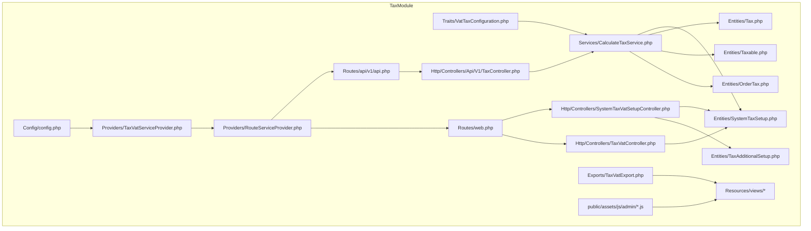
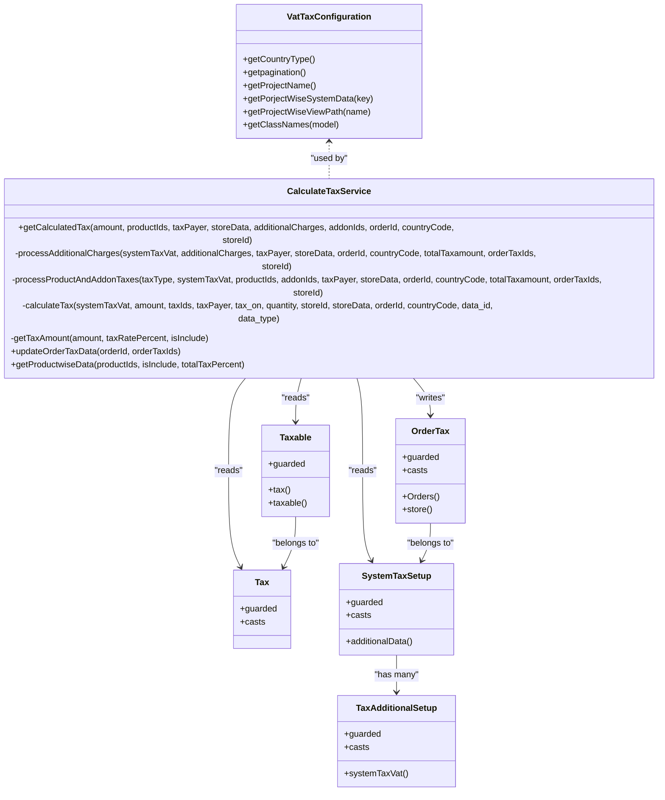
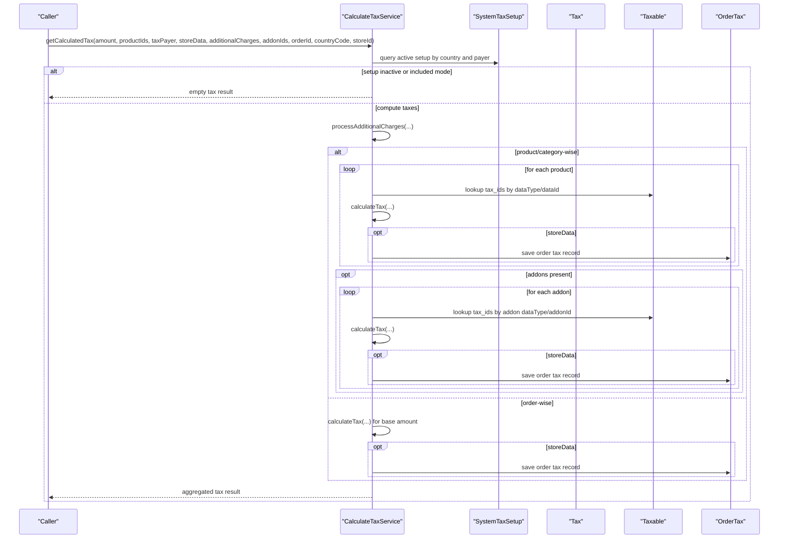
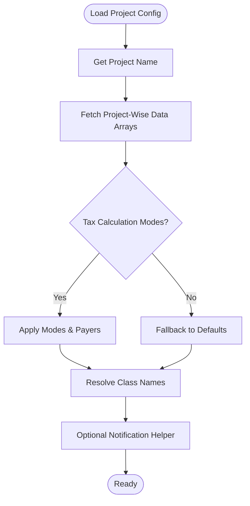
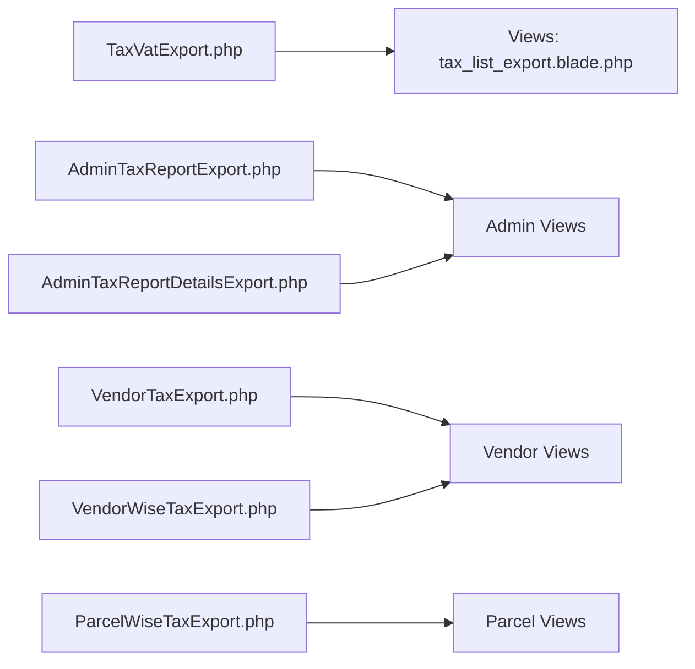
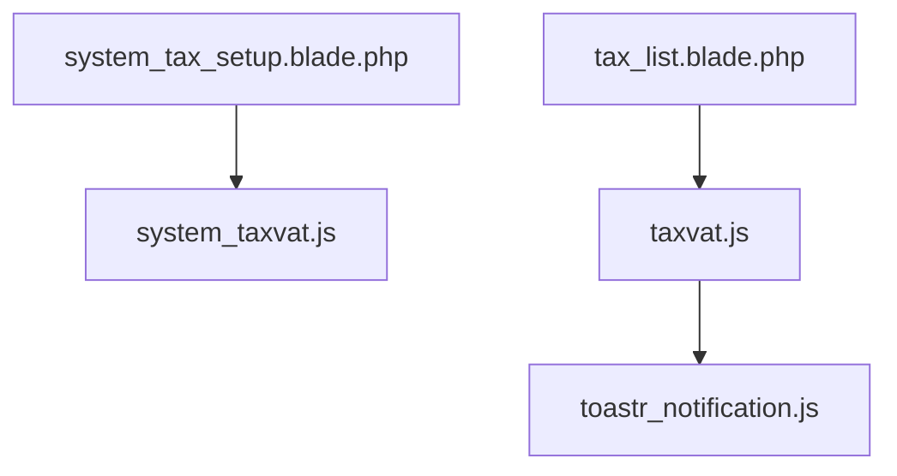
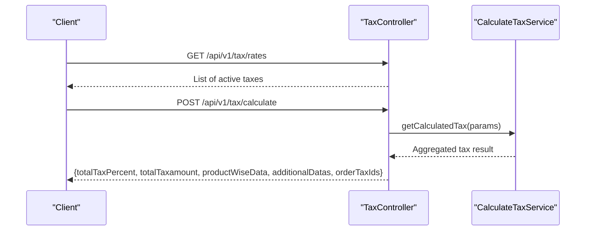
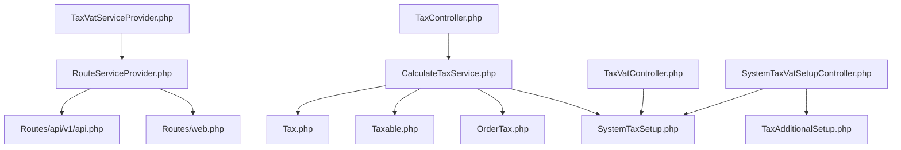

# TaxModule

<cite>
**Referenced Files in This Document**
- [module.json](file://Modules/TaxModule/module.json)
- [composer.json](file://Modules/TaxModule/composer.json)
- [config.php](file://Modules/TaxModule/Config/config.php)
- [VatTaxConfiguration.php](file://Modules/TaxModule/Traits/VatTaxConfiguration.php)
- [CalculateTaxService.php](file://Modules/TaxModule/Services/CalculateTaxService.php)
- [2025_05_26_115043_create_system_tax_setups_table.php](file://Modules/TaxModule/Database/Migrations/2025_05_26_115043_create_system_tax_setups_table.php)
- [2025_05_26_115643_create_taxes_table.php](file://Modules/TaxModule/Database/Migrations/2025_05_26_115643_create_taxes_table.php)
- [2025_05_26_120030_create_tax_additional_setups_table.php](file://Modules/TaxModule/Database/Migrations/2025_05_26_120030_create_tax_additional_setups_table.php)
- [2025_05_26_120912_create_taxables_table.php](file://Modules/TaxModule/Database/Migrations/2025_05_26_120912_create_taxables_table.php)
- [2025_05_26_121656_create_order_taxes_table.php](file://Modules/TaxModule/Database/Migrations/2025_05_26_121656_create_order_taxes_table.php)
- [Tax.php](file://Modules/TaxModule/Entities/Tax.php)
- [SystemTaxSetup.php](file://Modules/TaxModule/Entities/SystemTaxSetup.php)
- [TaxAdditionalSetup.php](file://Modules/TaxModule/Entities/TaxAdditionalSetup.php)
- [Taxable.php](file://Modules/TaxModule/Entities/Taxable.php)
- [OrderTax.php](file://Modules/TaxModule/Entities/OrderTax.php)
- [TaxController.php](file://Modules/TaxModule/Http/Controllers/Api/V1/TaxController.php)
- [SystemTaxVatSetupController.php](file://Modules/TaxModule/Http/Controllers/SystemTaxVatSetupController.php)
- [TaxVatController.php](file://Modules/TaxModule/Http/Controllers/TaxVatController.php)
- [api.php](file://Modules/TaxModule/Routes/api/v1/api.php)
- [web.php](file://Modules/TaxModule/Routes/web.php)
- [RouteServiceProvider.php](file://Modules/TaxModule/Providers/RouteServiceProvider.php)
- [TaxVatServiceProvider.php](file://Modules/TaxModule/Providers/TaxVatServiceProvider.php)
- [TaxVatExport.php](file://Modules/TaxModule/Exports/TaxVatExport.php)
- [system_taxvat.js](file://Modules/TaxModule/public/assets/js/admin/system_taxvat.js)
- [taxvat.js](file://Modules/TaxModule/public/assets/js/admin/taxvat.js)
- [toastr_notification.js](file://Modules/TaxModule/public/assets/js/admin/toastr_notification.js)
- [system_tax_setup.blade.php](file://Modules/TaxModule/Resources/views/tax/system_tax_setup.blade.php)
- [tax_list.blade.php](file://Modules/TaxModule/Resources/views/tax/tax_list.blade.php)
- [tax_list_export.blade.php](file://Modules/TaxModule/Resources/views/file-exports/tax_list_export.blade.php)
- [AdminTaxReportExport.php](file://app/Exports/AdminTaxReportExport.php)
- [AdminTaxReportDetailsExport.php](file://app/Exports/AdminTaxReportDetailsExport.php)
- [ParcelWiseTaxExport.php](file://app/Exports/ParcelWiseTaxExport.php)
- [VendorTaxExport.php](file://app/Exports/VendorTaxExport.php)
- [VendorWiseTaxExport.php](file://app/Exports/VendorWiseTaxExport.php)
- [ParcelWiseTaxExport.php](file://Modules/TaxModule/Exports/ParcelWiseTaxExport.php)
- [VendorWiseTaxExport.php](file://Modules/TaxModule/Exports/VendorWiseTaxExport.php)
- [VendorTaxExport.php](file://Modules/TaxModule/Exports/VendorTaxExport.php)
</cite>

## Table of Contents
1. [Introduction](#introduction)
2. [Project Structure](#project-structure)
3. [Core Components](#core-components)
4. [Architecture Overview](#architecture-overview)
5. [Detailed Component Analysis](#detailed-component-analysis)
6. [Dependency Analysis](#dependency-analysis)
7. [Performance Considerations](#performance-considerations)
8. [Troubleshooting Guide](#troubleshooting-guide)
9. [Conclusion](#conclusion)
10. [Appendices](#appendices)

## Introduction
The TaxModule provides a comprehensive tax and VAT management system integrated across business operations. It supports configurable tax setups per country and payer type, flexible tax calculation modes (order-wise, product/category-wise, and addon-wise), and robust reporting and export capabilities. The module exposes API endpoints for retrieving tax rates and calculating taxes during order processing, and offers an administrative interface for managing tax configurations and generating tax reports.

## Project Structure
The TaxModule is organized into configuration, database migrations, entities, services, controllers, routes, providers, exports, and admin views. It integrates with the broader application via service providers and route registration.



**Diagram sources**
- [config.php:1-11](file://Modules/TaxModule/Config/config.php#L1-L11)
- [VatTaxConfiguration.php:1-139](file://Modules/TaxModule/Traits/VatTaxConfiguration.php#L1-L139)
- [CalculateTaxService.php:1-325](file://Modules/TaxModule/Services/CalculateTaxService.php#L1-L325)
- [Tax.php:1-21](file://Modules/TaxModule/Entities/Tax.php#L1-L21)
- [SystemTaxSetup.php:1-29](file://Modules/TaxModule/Entities/SystemTaxSetup.php#L1-L29)
- [TaxAdditionalSetup.php:1-28](file://Modules/TaxModule/Entities/TaxAdditionalSetup.php#L1-L28)
- [Taxable.php:1-25](file://Modules/TaxModule/Entities/Taxable.php#L1-L25)
- [OrderTax.php:1-37](file://Modules/TaxModule/Entities/OrderTax.php#L1-L37)
- [TaxController.php](file://Modules/TaxModule/Http/Controllers/Api/V1/TaxController.php)
- [SystemTaxVatSetupController.php](file://Modules/TaxModule/Http/Controllers/SystemTaxVatSetupController.php)
- [TaxVatController.php](file://Modules/TaxModule/Http/Controllers/TaxVatController.php)
- [api.php](file://Modules/TaxModule/Routes/api/v1/api.php)
- [web.php](file://Modules/TaxModule/Routes/web.php)
- [RouteServiceProvider.php](file://Modules/TaxModule/Providers/RouteServiceProvider.php)
- [TaxVatServiceProvider.php](file://Modules/TaxModule/Providers/TaxVatServiceProvider.php)
- [TaxVatExport.php](file://Modules/TaxModule/Exports/TaxVatExport.php)
- [system_taxvat.js](file://Modules/TaxModule/public/assets/js/admin/system_taxvat.js)
- [taxvat.js](file://Modules/TaxModule/public/assets/js/admin/taxvat.js)
- [toastr_notification.js](file://Modules/TaxModule/public/assets/js/admin/toastr_notification.js)
- [system_tax_setup.blade.php](file://Modules/TaxModule/Resources/views/tax/system_tax_setup.blade.php)
- [tax_list.blade.php](file://Modules/TaxModule/Resources/views/tax/tax_list.blade.php)
- [tax_list_export.blade.php](file://Modules/TaxModule/Resources/views/file-exports/tax_list_export.blade.php)

**Section sources**
- [module.json:1-14](file://Modules/TaxModule/module.json#L1-L14)
- [composer.json:1-24](file://Modules/TaxModule/composer.json#L1-L24)
- [config.php:1-11](file://Modules/TaxModule/Config/config.php#L1-L11)

## Core Components
- Tax: Core tax entity storing tax name, rate, country code, and activation flags.
- SystemTaxSetup: System-wide tax configuration including tax type, payer, linked tax IDs, inclusion flag, and activation.
- TaxAdditionalSetup: Additional charge configurations (e.g., packaging) linked to SystemTaxSetup with active flags and tax IDs.
- Taxable: Polymorphic pivot linking tax to products, categories, addons, campaigns, or parcel categories under a specific SystemTaxSetup.
- OrderTax: Persisted tax records per order line, capturing tax name, rate, amounts before/after tax, payer, country, order linkage, and related identifiers.

These components enable flexible tax application across order, product, category, addon, and additional charge contexts, while persisting tax details for reporting and reconciliation.

**Section sources**
- [Tax.php:1-21](file://Modules/TaxModule/Entities/Tax.php#L1-L21)
- [SystemTaxSetup.php:1-29](file://Modules/TaxModule/Entities/SystemTaxSetup.php#L1-L29)
- [TaxAdditionalSetup.php:1-28](file://Modules/TaxModule/Entities/TaxAdditionalSetup.php#L1-L28)
- [Taxable.php:1-25](file://Modules/TaxModule/Entities/Taxable.php#L1-L25)
- [OrderTax.php:1-37](file://Modules/TaxModule/Entities/OrderTax.php#L1-L37)

## Architecture Overview
The module follows a layered architecture:
- Configuration and trait layer define project-specific behavior and class mappings.
- Service layer encapsulates tax calculation logic, including product/category/addon-wise and additional charge processing.
- Entity layer models the tax domain with relationships and casts.
- Controller layer exposes API endpoints and admin endpoints.
- Route layer registers API and web routes.
- Provider layer binds routes and services.
- Export and view layers support admin reporting and UI.



**Diagram sources**
- [VatTaxConfiguration.php:1-139](file://Modules/TaxModule/Traits/VatTaxConfiguration.php#L1-L139)
- [CalculateTaxService.php:1-325](file://Modules/TaxModule/Services/CalculateTaxService.php#L1-L325)
- [Tax.php:1-21](file://Modules/TaxModule/Entities/Tax.php#L1-L21)
- [SystemTaxSetup.php:1-29](file://Modules/TaxModule/Entities/SystemTaxSetup.php#L1-L29)
- [TaxAdditionalSetup.php:1-28](file://Modules/TaxModule/Entities/TaxAdditionalSetup.php#L1-L28)
- [Taxable.php:1-25](file://Modules/TaxModule/Entities/Taxable.php#L1-L25)
- [OrderTax.php:1-37](file://Modules/TaxModule/Entities/OrderTax.php#L1-L37)

## Detailed Component Analysis

### Tax Calculation Service
The service orchestrates tax calculations across multiple modes:
- Retrieves active SystemTaxSetup filtered by country code and tax payer.
- Supports inclusive/exclusive tax modes.
- Processes additional charges (e.g., packaging) linked to SystemTaxSetup.
- Supports product/category-wise and addon/addon-category-wise tax application.
- Persists order tax records when requested and aggregates totals.



**Diagram sources**
- [CalculateTaxService.php:16-116](file://Modules/TaxModule/Services/CalculateTaxService.php#L16-L116)
- [CalculateTaxService.php:123-152](file://Modules/TaxModule/Services/CalculateTaxService.php#L123-L152)
- [CalculateTaxService.php:154-241](file://Modules/TaxModule/Services/CalculateTaxService.php#L154-L241)
- [CalculateTaxService.php:246-286](file://Modules/TaxModule/Services/CalculateTaxService.php#L246-L286)

**Section sources**
- [CalculateTaxService.php:1-325](file://Modules/TaxModule/Services/CalculateTaxService.php#L1-L325)

### VAT Configuration System
The trait centralizes project-specific configuration and class mappings:
- Country type, pagination, and project name are loaded from module config.
- Project-aware arrays define supported tax calculation modes, additional taxes, and payer types.
- Class names map polymorphic types to application models per project.
- Utility methods provide view paths and notifications.



**Diagram sources**
- [VatTaxConfiguration.php:9-55](file://Modules/TaxModule/Traits/VatTaxConfiguration.php#L9-L55)
- [VatTaxConfiguration.php:57-79](file://Modules/TaxModule/Traits/VatTaxConfiguration.php#L57-L79)
- [VatTaxConfiguration.php:80-110](file://Modules/TaxModule/Traits/VatTaxConfiguration.php#L80-L110)
- [VatTaxConfiguration.php:123-137](file://Modules/TaxModule/Traits/VatTaxConfiguration.php#L123-L137)

**Section sources**
- [VatTaxConfiguration.php:1-139](file://Modules/TaxModule/Traits/VatTaxConfiguration.php#L1-L139)
- [config.php:1-11](file://Modules/TaxModule/Config/config.php#L1-L11)

### Tax Reporting and Exports
The module provides:
- Module-level exports for tax and VAT reports.
- Application-level exports for admin and vendor-specific reports.
- Admin UI views for listing and setting up tax configurations.



**Diagram sources**
- [TaxVatExport.php](file://Modules/TaxModule/Exports/TaxVatExport.php)
- [AdminTaxReportExport.php](file://app/Exports/AdminTaxReportExport.php)
- [AdminTaxReportDetailsExport.php](file://app/Exports/AdminTaxReportDetailsExport.php)
- [VendorTaxExport.php](file://app/Exports/VendorTaxExport.php)
- [VendorWiseTaxExport.php](file://app/Exports/VendorWiseTaxExport.php)
- [ParcelWiseTaxExport.php](file://app/Exports/ParcelWiseTaxExport.php)
- [VendorTaxExport.php](file://Modules/TaxModule/Exports/VendorTaxExport.php)
- [VendorWiseTaxExport.php](file://Modules/TaxModule/Exports/VendorWiseTaxExport.php)
- [ParcelWiseTaxExport.php](file://Modules/TaxModule/Exports/ParcelWiseTaxExport.php)
- [tax_list_export.blade.php](file://Modules/TaxModule/Resources/views/file-exports/tax_list_export.blade.php)
- [system_tax_setup.blade.php](file://Modules/TaxModule/Resources/views/tax/system_tax_setup.blade.php)
- [tax_list.blade.php](file://Modules/TaxModule/Resources/views/tax/tax_list.blade.php)

**Section sources**
- [TaxVatExport.php](file://Modules/TaxModule/Exports/TaxVatExport.php)
- [AdminTaxReportExport.php](file://app/Exports/AdminTaxReportExport.php)
- [AdminTaxReportDetailsExport.php](file://app/Exports/AdminTaxReportDetailsExport.php)
- [VendorTaxExport.php](file://app/Exports/VendorTaxExport.php)
- [VendorWiseTaxExport.php](file://app/Exports/VendorWiseTaxExport.php)
- [ParcelWiseTaxExport.php](file://app/Exports/ParcelWiseTaxExport.php)
- [VendorTaxExport.php](file://Modules/TaxModule/Exports/VendorTaxExport.php)
- [VendorWiseTaxExport.php](file://Modules/TaxModule/Exports/VendorWiseTaxExport.php)
- [ParcelWiseTaxExport.php](file://Modules/TaxModule/Exports/ParcelWiseTaxExport.php)
- [system_tax_setup.blade.php](file://Modules/TaxModule/Resources/views/tax/system_tax_setup.blade.php)
- [tax_list.blade.php](file://Modules/TaxModule/Resources/views/tax/tax_list.blade.php)
- [tax_list_export.blade.php](file://Modules/TaxModule/Resources/views/file-exports/tax_list_export.blade.php)

### Administrative Interface
Admin views and JavaScript assets support:
- Listing taxes and tax setups.
- Managing system tax VAT setups and additional tax configurations.
- Showing notifications via Toastr.



**Diagram sources**
- [system_tax_setup.blade.php](file://Modules/TaxModule/Resources/views/tax/system_tax_setup.blade.php)
- [tax_list.blade.php](file://Modules/TaxModule/Resources/views/tax/tax_list.blade.php)
- [system_taxvat.js](file://Modules/TaxModule/public/assets/js/admin/system_taxvat.js)
- [taxvat.js](file://Modules/TaxModule/public/assets/js/admin/taxvat.js)
- [toastr_notification.js](file://Modules/TaxModule/public/assets/js/admin/toastr_notification.js)

**Section sources**
- [system_tax_setup.blade.php](file://Modules/TaxModule/Resources/views/tax/system_tax_setup.blade.php)
- [tax_list.blade.php](file://Modules/TaxModule/Resources/views/tax/tax_list.blade.php)
- [system_taxvat.js](file://Modules/TaxModule/public/assets/js/admin/system_taxvat.js)
- [taxvat.js](file://Modules/TaxModule/public/assets/js/admin/taxvat.js)
- [toastr_notification.js](file://Modules/TaxModule/public/assets/js/admin/toastr_notification.js)

### API Endpoints for Tax Management
The module registers API routes for tax retrieval and calculation.



**Diagram sources**
- [api.php](file://Modules/TaxModule/Routes/api/v1/api.php)
- [TaxController.php](file://Modules/TaxModule/Http/Controllers/Api/V1/TaxController.php)
- [CalculateTaxService.php:16-116](file://Modules/TaxModule/Services/CalculateTaxService.php#L16-L116)

**Section sources**
- [api.php](file://Modules/TaxModule/Routes/api/v1/api.php)
- [TaxController.php](file://Modules/TaxModule/Http/Controllers/Api/V1/TaxController.php)
- [CalculateTaxService.php:16-116](file://Modules/TaxModule/Services/CalculateTaxService.php#L16-L116)

## Dependency Analysis
The module’s dependencies are primarily internal, with service-to-entity and controller-to-service relationships. External dependencies include Laravel facades for notifications and the application’s model classes resolved via the trait’s class mapping.



**Diagram sources**
- [TaxVatServiceProvider.php](file://Modules/TaxModule/Providers/TaxVatServiceProvider.php)
- [RouteServiceProvider.php](file://Modules/TaxModule/Providers/RouteServiceProvider.php)
- [api.php](file://Modules/TaxModule/Routes/api/v1/api.php)
- [web.php](file://Modules/TaxModule/Routes/web.php)
- [TaxController.php](file://Modules/TaxModule/Http/Controllers/Api/V1/TaxController.php)
- [SystemTaxVatSetupController.php](file://Modules/TaxModule/Http/Controllers/SystemTaxVatSetupController.php)
- [TaxVatController.php](file://Modules/TaxModule/Http/Controllers/TaxVatController.php)
- [CalculateTaxService.php:1-325](file://Modules/TaxModule/Services/CalculateTaxService.php#L1-L325)
- [SystemTaxSetup.php:1-29](file://Modules/TaxModule/Entities/SystemTaxSetup.php#L1-L29)
- [TaxAdditionalSetup.php:1-28](file://Modules/TaxModule/Entities/TaxAdditionalSetup.php#L1-L28)
- [Tax.php:1-21](file://Modules/TaxModule/Entities/Tax.php#L1-L21)
- [Taxable.php:1-25](file://Modules/TaxModule/Entities/Taxable.php#L1-L25)
- [OrderTax.php:1-37](file://Modules/TaxModule/Entities/OrderTax.php#L1-L37)

**Section sources**
- [TaxVatServiceProvider.php](file://Modules/TaxModule/Providers/TaxVatServiceProvider.php)
- [RouteServiceProvider.php](file://Modules/TaxModule/Providers/RouteServiceProvider.php)
- [CalculateTaxService.php:1-325](file://Modules/TaxModule/Services/CalculateTaxService.php#L1-L325)

## Performance Considerations
- Minimize N+1 queries by eager-loading related data (e.g., additionalData in SystemTaxSetup).
- Batch persistence of OrderTax entries to reduce database round-trips.
- Use indexed columns (country_code, is_active) for efficient filtering.
- Consider caching frequently accessed SystemTaxSetup configurations per country/payer.

## Troubleshooting Guide
Common issues and resolutions:
- No active SystemTaxSetup found: Verify country code and tax payer settings; ensure is_active is enabled.
- Included tax mode: When is_included is true, tax is excluded from amounts; confirm calculation expectations.
- Missing tax_ids: Ensure Taxable pivot entries exist for applicable data types and IDs.
- Persistence failures: Wrap storeData operations in transactions and handle rollbacks on exceptions.
- Incorrect class mappings: Confirm project name and class names in VatTaxConfiguration match application models.

**Section sources**
- [CalculateTaxService.php:33-35](file://Modules/TaxModule/Services/CalculateTaxService.php#L33-L35)
- [CalculateTaxService.php:37-39](file://Modules/TaxModule/Services/CalculateTaxService.php#L37-L39)
- [CalculateTaxService.php:107-115](file://Modules/TaxModule/Services/CalculateTaxService.php#L107-L115)

## Conclusion
The TaxModule delivers a flexible, extensible tax and VAT management solution with strong separation of concerns, robust calculation logic, and comprehensive reporting. Its configuration-driven design allows multi-region and multi-payer tax handling, while the persisted order tax records facilitate accurate financial reporting and reconciliation.

## Appendices

### Database Schema
The schema comprises core tax entities and supporting relationships for system-wide tax setups, additional charges, tax assignments, and order-level tax records.

```mermaid
erDiagram
TAXES {
bigint id PK
string name
float tax_rate
string country_code
boolean is_default
boolean is_active
timestamps created_at, updated_at
}
SYSTEM_TAX_SETUPS {
bigint id PK
string tax_type
string country_code
string tax_payer
text tax_ids
boolean is_default
boolean is_active
boolean is_included
timestamps created_at, updated_at
}
TAX_ADDITIONAL_SETUPS {
bigint id PK
string name
bigint system_tax_setup_id FK
text tax_ids
boolean is_active
timestamps created_at, updated_at
}
TAXABLES {
bigint id PK
string taxable_type
bigint taxable_id
bigint tax_id FK
bigint system_tax_setup_id FK
timestamps created_at, updated_at
}
ORDER_TAXES {
bigint id PK
string tax_name
string tax_type
string tax_on
float tax_rate
float tax_amount
float before_tax_amount
float after_tax_amount
string tax_payer
string country_code
bigint order_id
string order_type
integer quantity
bigint tax_id FK
bigint taxable_id
string taxable_type
bigint store_id
string store_type
bigint system_tax_setup_id FK
timestamps created_at, updated_at
}
SYSTEM_TAX_SETUPS ||--o{ TAX_ADDITIONAL_SETUPS : "has many"
TAXABLES }o--|| TAXES : "belongs to"
ORDER_TAXES }o--|| SYSTEM_TAX_SETUPS : "belongs to"
```

**Diagram sources**
- [2025_05_26_115043_create_system_tax_setups_table.php:14-26](file://Modules/TaxModule/Database/Migrations/2025_05_26_115043_create_system_tax_setups_table.php#L14-L26)
- [2025_05_26_115643_create_taxes_table.php:14-24](file://Modules/TaxModule/Database/Migrations/2025_05_26_115643_create_taxes_table.php#L14-L24)
- [2025_05_26_120030_create_tax_additional_setups_table.php:14-23](file://Modules/TaxModule/Database/Migrations/2025_05_26_120030_create_tax_additional_setups_table.php#L14-L23)
- [2025_05_26_120912_create_taxables_table.php:14-24](file://Modules/TaxModule/Database/Migrations/2025_05_26_120912_create_taxables_table.php#L14-L24)
- [2025_05_26_121656_create_order_taxes_table.php:14-37](file://Modules/TaxModule/Database/Migrations/2025_05_26_121656_create_order_taxes_table.php#L14-L37)

### Practical Examples

- Multi-region tax handling:
  - Configure SystemTaxSetup with distinct country_code values and tax_payer combinations.
  - Use getCalculatedTax with countryCode to select region-specific tax rules.

- Product/category-wise tax calculation:
  - Set tax_type to product_wise or category_wise.
  - Provide productIds with pricing and category_id; optionally include addonIds.

- Additional charges (e.g., packaging):
  - Define TaxAdditionalSetup entries under SystemTaxSetup.
  - Pass additionalCharges keyed by additional setup names to include extra taxable amounts.

- Order-level tax aggregation:
  - For order_wise mode, supply base amount; the service computes tax across configured tax rates and persists order tax records when storeData is true.

- Tax export workflow:
  - Use module exports (TaxVatExport) or admin exports (AdminTaxReportExport, VendorTaxExport) to generate downloadable reports.
  - Admin views render lists and setup forms for managing tax configurations.

**Section sources**
- [CalculateTaxService.php:26-35](file://Modules/TaxModule/Services/CalculateTaxService.php#L26-L35)
- [CalculateTaxService.php:62-95](file://Modules/TaxModule/Services/CalculateTaxService.php#L62-L95)
- [CalculateTaxService.php:123-152](file://Modules/TaxModule/Services/CalculateTaxService.php#L123-L152)
- [TaxVatExport.php](file://Modules/TaxModule/Exports/TaxVatExport.php)
- [AdminTaxReportExport.php](file://app/Exports/AdminTaxReportExport.php)
- [VendorTaxExport.php](file://app/Exports/VendorTaxExport.php)
- [system_tax_setup.blade.php](file://Modules/TaxModule/Resources/views/tax/system_tax_setup.blade.php)
- [tax_list.blade.php](file://Modules/TaxModule/Resources/views/tax/tax_list.blade.php)