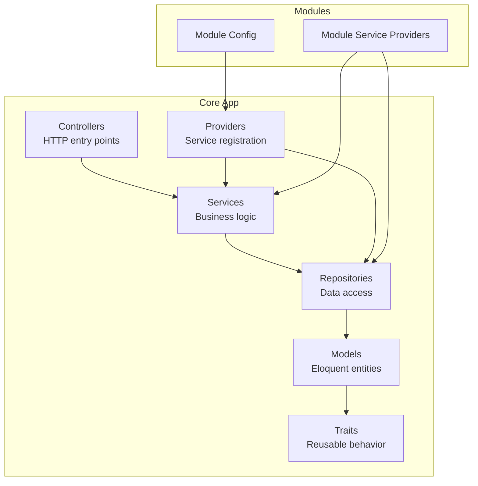
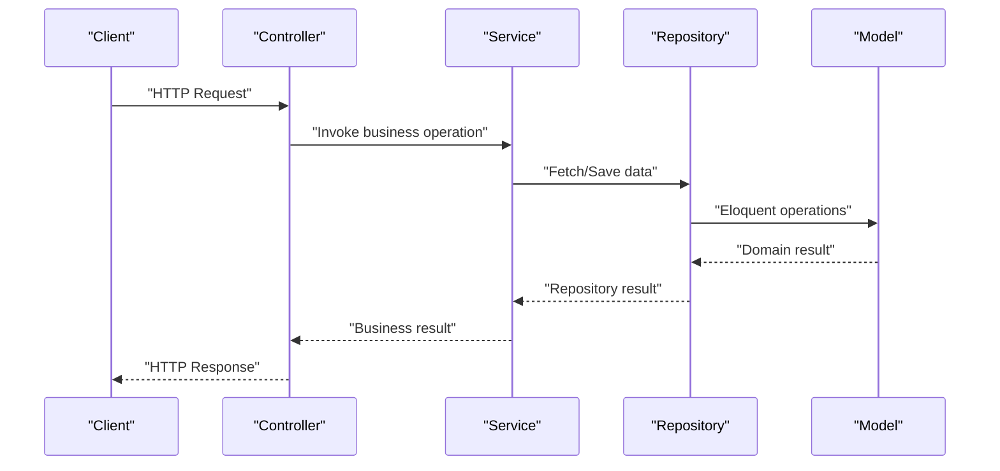
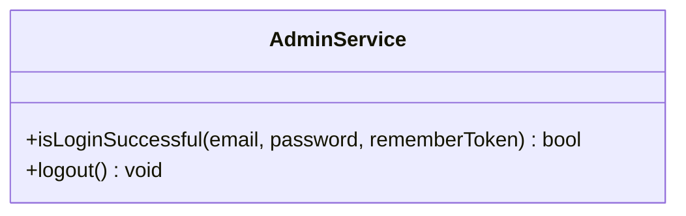
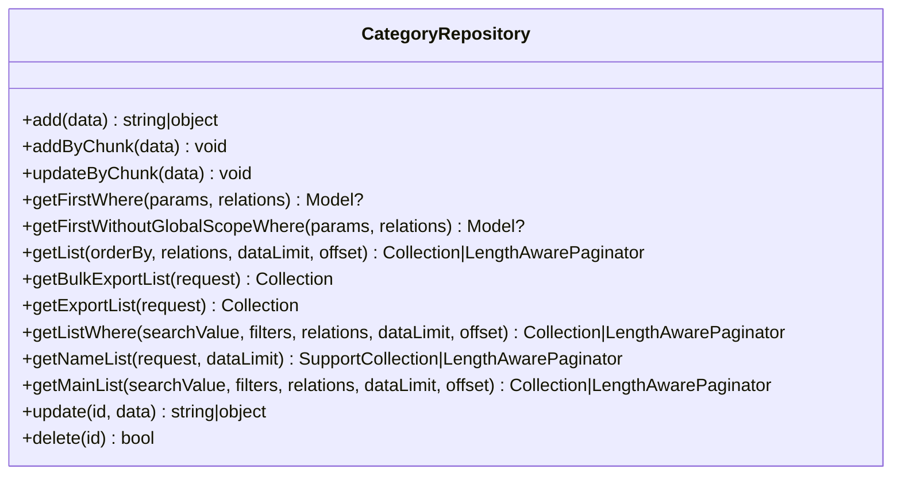
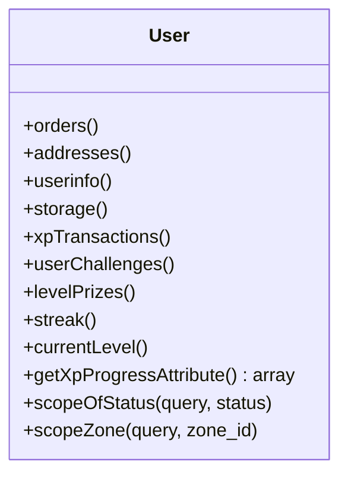
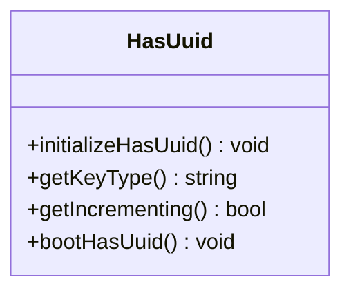
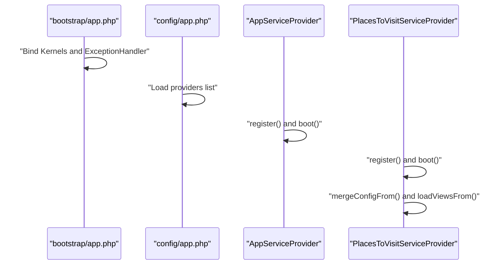
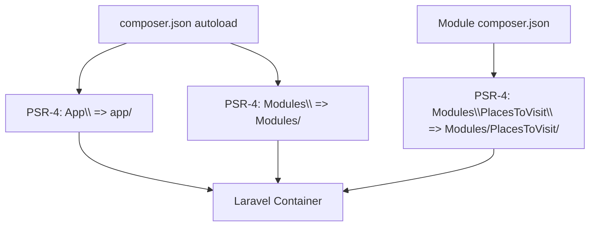
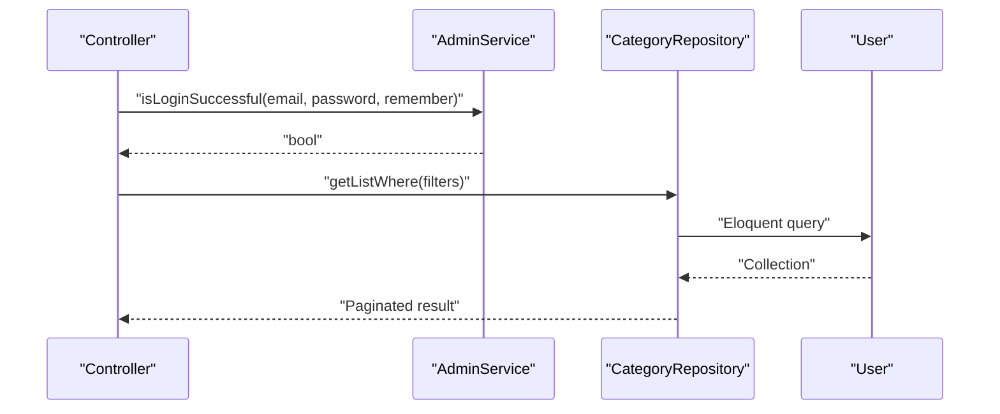
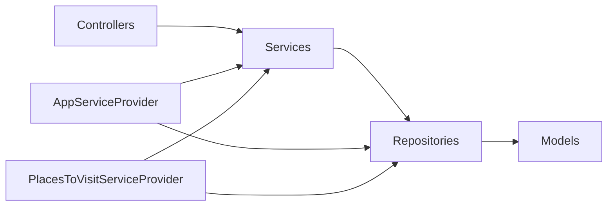

# Application Structure

<cite>
**Referenced Files in This Document**
- [bootstrap/app.php](file://bootstrap/app.php)
- [config/app.php](file://config/app.php)
- [composer.json](file://composer.json)
- [app/Providers/AppServiceProvider.php](file://app/Providers/AppServiceProvider.php)
- [app/Http/Controllers/Controller.php](file://app/Http/Controllers/Controller.php)
- [app/Models/User.php](file://app/Models/User.php)
- [app/Services/AdminService.php](file://app/Services/AdminService.php)
- [app/Repositories/CategoryRepository.php](file://app/Repositories/CategoryRepository.php)
- [app/Traits/HasUuid.php](file://app/Traits/HasUuid.php)
- [Modules/PlacesToVisit/Providers/PlacesToVisitServiceProvider.php](file://Modules/PlacesToVisit/Providers/PlacesToVisitServiceProvider.php)
- [Modules/PlacesToVisit/composer.json](file://Modules/PlacesToVisit/composer.json)
</cite>

## Table of Contents
1. [Introduction](#introduction)
2. [Project Structure](#project-structure)
3. [Core Components](#core-components)
4. [Architecture Overview](#architecture-overview)
5. [Detailed Component Analysis](#detailed-component-analysis)
6. [Dependency Analysis](#dependency-analysis)
7. [Performance Considerations](#performance-considerations)
8. [Troubleshooting Guide](#troubleshooting-guide)
9. [Conclusion](#conclusion)

## Introduction
This document explains the application structure of Waddy Back with a focus on Laravel MVC architecture. It details how the app directory is organized into Models, Controllers, Services, Repositories, and Traits, and how these layers interact to maintain separation of concerns. It also covers service provider registration, configuration loading, and autoloading strategies, and demonstrates practical controller-service-model interactions. The document concludes with guidance on scalability and maintainability aligned with Laravel conventions.

## Project Structure
Waddy Back follows a layered MVC structure under the app directory, augmented by module-based features and centralized providers. The structure emphasizes:
- Models: Eloquent models encapsulate domain entities and relationships.
- Controllers: HTTP entry points that orchestrate requests and delegate to Services.
- Services: Business logic and cross-cutting concerns.
- Repositories: Data access abstractions over Eloquent models.
- Traits: Reusable behavior across models and services.
- Providers: Service registration and configuration merging for both core and module features.

**Diagram sources**
- [bootstrap/app.php:29-42](file://bootstrap/app.php#L29-L42)
- [config/app.php:139-186](file://config/app.php#L139-L186)
- [app/Providers/AppServiceProvider.php:29-47](file://app/Providers/AppServiceProvider.php#L29-L47)
- [Modules/PlacesToVisit/Providers/PlacesToVisitServiceProvider.php:15-31](file://Modules/PlacesToVisit/Providers/PlacesToVisitServiceProvider.php#L15-L31)

**Section sources**
- [bootstrap/app.php:14-42](file://bootstrap/app.php#L14-L42)
- [config/app.php:139-186](file://config/app.php#L139-L186)
- [composer.json:50-77](file://composer.json#L50-L77)

## Core Components
This section outlines the roles and responsibilities of each layer and how they collaborate.

- Controllers
  - Base controller class provides common traits for authorization, job dispatching, and validation.
  - Controllers receive HTTP requests, validate input, and delegate to Services for business logic.

- Services
  - Encapsulate business operations and cross-cutting concerns.
  - Example: AdminService handles authentication and logout for admin guards.

- Repositories
  - Abstract data access and query composition.
  - Example: CategoryRepository performs CRUD operations and paginated queries with module scoping.

- Models
  - Define entity schema, casts, relations, scopes, and model-level behaviors.
  - Example: User model defines relations, scopes, attribute accessors, and lifecycle hooks.

- Traits
  - Provide reusable capabilities such as UUID generation for identifiers.

- Providers
  - Register bindings, merge configurations, load views and translations, and bootstrap module-specific services.
  - Example: AppServiceProvider shares configuration and view data globally; PlacesToVisitServiceProvider registers module services and publishes config/views.

**Section sources**
- [app/Http/Controllers/Controller.php:10-13](file://app/Http/Controllers/Controller.php#L10-L13)
- [app/Services/AdminService.php:7-22](file://app/Services/AdminService.php#L7-L22)
- [app/Repositories/CategoryRepository.php:18-174](file://app/Repositories/CategoryRepository.php#L18-L174)
- [app/Models/User.php:19-279](file://app/Models/User.php#L19-L279)
- [app/Traits/HasUuid.php:7-35](file://app/Traits/HasUuid.php#L7-L35)
- [app/Providers/AppServiceProvider.php:19-47](file://app/Providers/AppServiceProvider.php#L19-L47)
- [Modules/PlacesToVisit/Providers/PlacesToVisitServiceProvider.php:10-31](file://Modules/PlacesToVisit/Providers/PlacesToVisitServiceProvider.php#L10-L31)

## Architecture Overview
The application adheres to MVC with clear separation of concerns:
- HTTP layer (Controllers) delegates to Services.
- Services coordinate Repositories for persistence and Models for domain logic.
- Providers manage configuration and service bindings.
- Modules extend the system via dedicated providers and autoload configuration.

**Diagram sources**
- [app/Http/Controllers/Controller.php:10-13](file://app/Http/Controllers/Controller.php#L10-L13)
- [app/Services/AdminService.php:9-21](file://app/Services/AdminService.php#L9-L21)
- [app/Repositories/CategoryRepository.php:26-173](file://app/Repositories/CategoryRepository.php#L26-L173)
- [app/Models/User.php:103-120](file://app/Models/User.php#L103-L120)

## Detailed Component Analysis

### Controllers Layer
- Role: Handle HTTP requests, apply validation, and coordinate Services.
- Pattern: Use base controller traits for common behaviors.

**Section sources**
- [app/Http/Controllers/Controller.php:10-13](file://app/Http/Controllers/Controller.php#L10-L13)

### Services Layer
- Role: Encapsulate business logic and cross-cutting concerns.
- Example: AdminService manages admin authentication and session cleanup.

**Diagram sources**
- [app/Services/AdminService.php:7-22](file://app/Services/AdminService.php#L7-L22)

**Section sources**
- [app/Services/AdminService.php:7-22](file://app/Services/AdminService.php#L7-L22)

### Repositories Layer
- Role: Abstract data access and query composition.
- Example: CategoryRepository implements CRUD, bulk operations, and paginated search with module scoping.

**Diagram sources**
- [app/Repositories/CategoryRepository.php:18-174](file://app/Repositories/CategoryRepository.php#L18-L174)

**Section sources**
- [app/Repositories/CategoryRepository.php:18-174](file://app/Repositories/CategoryRepository.php#L18-L174)

### Models Layer
- Role: Define entity schema, casts, relations, scopes, and lifecycle hooks.
- Example: User model defines relations (orders, addresses), scopes (zone, status), attribute accessors, and model boot hooks.

**Diagram sources**
- [app/Models/User.php:103-120](file://app/Models/User.php#L103-L120)
- [app/Models/User.php:121-125](file://app/Models/User.php#L121-L125)
- [app/Models/User.php:177-207](file://app/Models/User.php#L177-L207)

**Section sources**
- [app/Models/User.php:19-279](file://app/Models/User.php#L19-L279)

### Traits Layer
- Role: Provide reusable behavior across models and services.
- Example: HasUuid trait generates UUIDs for model identifiers.

**Diagram sources**
- [app/Traits/HasUuid.php:7-35](file://app/Traits/HasUuid.php#L7-L35)

**Section sources**
- [app/Traits/HasUuid.php:7-35](file://app/Traits/HasUuid.php#L7-L35)

### Providers and Configuration
- Core providers: Bound in bootstrap/app.php and configured in config/app.php.
- AppServiceProvider: Shares configuration and view data globally during boot.
- Module providers: PlacesToVisitServiceProvider registers module services as singletons, merges config, loads views and translations, and publishes migration paths.

**Diagram sources**
- [bootstrap/app.php:29-42](file://bootstrap/app.php#L29-L42)
- [config/app.php:139-186](file://config/app.php#L139-L186)
- [app/Providers/AppServiceProvider.php:19-47](file://app/Providers/AppServiceProvider.php#L19-L47)
- [Modules/PlacesToVisit/Providers/PlacesToVisitServiceProvider.php:15-31](file://Modules/PlacesToVisit/Providers/PlacesToVisitServiceProvider.php#L15-L31)

**Section sources**
- [bootstrap/app.php:14-42](file://bootstrap/app.php#L14-L42)
- [config/app.php:139-186](file://config/app.php#L139-L186)
- [app/Providers/AppServiceProvider.php:29-47](file://app/Providers/AppServiceProvider.php#L29-L47)
- [Modules/PlacesToVisit/Providers/PlacesToVisitServiceProvider.php:15-66](file://Modules/PlacesToVisit/Providers/PlacesToVisitServiceProvider.php#L15-L66)

### Autoloading and Module Registration
- Composer autoload: PSR-4 namespaces for app/, database/factories/, database/seeders/, and Modules/.
- Module autoload: Modules/PlacesToVisit/composer.json defines PSR-4 for the module namespace.
- Service provider registration: Core providers are listed in config/app.php; module providers are discovered via the modules package.

**Diagram sources**
- [composer.json:50-77](file://composer.json#L50-L77)
- [Modules/PlacesToVisit/composer.json:11-15](file://Modules/PlacesToVisit/composer.json#L11-L15)

**Section sources**
- [composer.json:50-77](file://composer.json#L50-L77)
- [Modules/PlacesToVisit/composer.json:11-15](file://Modules/PlacesToVisit/composer.json#L11-L15)

### Practical Controller-Service-Model Interaction
- Controller receives request and invokes Service method.
- Service coordinates Repository for persistence and Model for domain logic.
- Model encapsulates relations and lifecycle hooks.

**Diagram sources**
- [app/Services/AdminService.php:9-15](file://app/Services/AdminService.php#L9-L15)
- [app/Repositories/CategoryRepository.php:109-120](file://app/Repositories/CategoryRepository.php#L109-L120)
- [app/Models/User.php:103-120](file://app/Models/User.php#L103-L120)

**Section sources**
- [app/Services/AdminService.php:7-22](file://app/Services/AdminService.php#L7-L22)
- [app/Repositories/CategoryRepository.php:18-174](file://app/Repositories/CategoryRepository.php#L18-L174)
- [app/Models/User.php:19-279](file://app/Models/User.php#L19-L279)

## Dependency Analysis
- Core dependencies: Controllers depend on Services; Services depend on Repositories; Repositories depend on Models.
- Providers: AppServiceProvider and module providers register and configure services and configuration.
- Autoloading: Composer PSR-4 and module autoload enable seamless resolution of classes.

**Diagram sources**
- [app/Http/Controllers/Controller.php:10-13](file://app/Http/Controllers/Controller.php#L10-L13)
- [app/Services/AdminService.php:7-22](file://app/Services/AdminService.php#L7-L22)
- [app/Repositories/CategoryRepository.php:18-174](file://app/Repositories/CategoryRepository.php#L18-L174)
- [app/Models/User.php:19-279](file://app/Models/User.php#L19-L279)
- [app/Providers/AppServiceProvider.php:19-47](file://app/Providers/AppServiceProvider.php#L19-L47)
- [Modules/PlacesToVisit/Providers/PlacesToVisitServiceProvider.php:15-31](file://Modules/PlacesToVisit/Providers/PlacesToVisitServiceProvider.php#L15-L31)

**Section sources**
- [bootstrap/app.php:29-42](file://bootstrap/app.php#L29-L42)
- [config/app.php:139-186](file://config/app.php#L139-L186)
- [composer.json:50-77](file://composer.json#L50-L77)

## Performance Considerations
- Pagination: Use repository methods that return LengthAwarePaginator to avoid loading large datasets.
- Bulk operations: Utilize chunked inserts/updates in repositories to reduce memory footprint.
- Global scopes and eager loading: Apply with relations judiciously to prevent N+1 queries.
- UUID generation: Prefer UUIDs for identifiers to improve cacheability and obfuscate sequential IDs.
- Provider boot: Avoid heavy operations in provider boot; defer to service-level initialization.

[No sources needed since this section provides general guidance]

## Troubleshooting Guide
- Authentication failures: Verify guard configuration and credentials in AdminService.
- Data retrieval issues: Confirm repository query conditions and module scoping via configuration keys.
- Module not registering: Ensure module provider is discoverable and autoload is configured.
- Autoload errors: Run composer dump-autoload and clear caches after adding new PSR-4 namespaces.

**Section sources**
- [app/Services/AdminService.php:9-21](file://app/Services/AdminService.php#L9-L21)
- [app/Repositories/CategoryRepository.php:84-120](file://app/Repositories/CategoryRepository.php#L84-L120)
- [Modules/PlacesToVisit/Providers/PlacesToVisitServiceProvider.php:15-31](file://Modules/PlacesToVisit/Providers/PlacesToVisitServiceProvider.php#L15-L31)
- [composer.json:50-77](file://composer.json#L50-L77)

## Conclusion
Waddy Back’s architecture cleanly separates concerns across Models, Controllers, Services, Repositories, and Traits, with Providers orchestrating configuration and service registration. The module-based design and Composer autoloading support scalability and maintainability. Following the documented patterns ensures predictable growth and robust development practices aligned with Laravel conventions.