# Core Architecture

<cite>
**Referenced Files in This Document**
- [composer.json](file://composer.json)
- [bootstrap/app.php](file://bootstrap/app.php)
- [config/modules.php](file://config/modules.php)
- [app/Providers/AppServiceProvider.php](file://app/Providers/AppServiceProvider.php)
- [app/Providers/InterfaceServiceProvider.php](file://app/Providers/InterfaceServiceProvider.php)
- [app/Http/Kernel.php](file://app/Http/Kernel.php)
- [app/Repositories/CategoryRepository.php](file://app/Repositories/CategoryRepository.php)
- [app/Services/CategoryService.php](file://app/Services/CategoryService.php)
- [app/Models/Category.php](file://app/Models/Category.php)
- [app/Providers/EventServiceProvider.php](file://app/Providers/EventServiceProvider.php)
- [app/Http/Controllers/BaseController.php](file://app/Http/Controllers/BaseController.php)
- [app/Contracts/ControllerInterface.php](file://app/Contracts/ControllerInterface.php)
</cite>

## Table of Contents
1. [Introduction](#introduction)
2. [Project Structure](#project-structure)
3. [Core Components](#core-components)
4. [Architecture Overview](#architecture-overview)
5. [Detailed Component Analysis](#detailed-component-analysis)
6. [Dependency Analysis](#dependency-analysis)
7. [Performance Considerations](#performance-considerations)
8. [Troubleshooting Guide](#troubleshooting-guide)
9. [Conclusion](#conclusion)
10. [Appendices](#appendices)

## Introduction
This document describes the core system architecture of Waddy Back, focusing on its Laravel-based layered architecture with MVC-style separation, a service layer, repository pattern, and observer pattern. It explains how modules are organized, how dependency injection is leveraged, and how middleware governs request flows. It also outlines infrastructure requirements, scalability considerations, and deployment topology, and provides system context diagrams to show relationships among core components, database entities, and external integrations.

## Project Structure
Waddy Back follows a modular Laravel architecture:
- Core application under app/ with models, repositories, services, observers, providers, traits, and contracts.
- Modules under Modules/ implementing feature-specific domains (e.g., PlacesToVisit, TaxModule).
- Configuration for module scanning and activation via nwidart/laravel-modules.
- Composer configuration enabling PSR-4 autoloading for app and Modules namespaces.

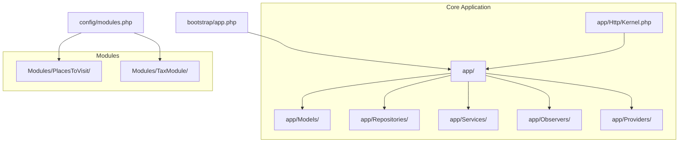

**Diagram sources**
- [bootstrap/app.php:14-42](file://bootstrap/app.php#L14-L42)
- [config/modules.php:63-132](file://config/modules.php#L63-L132)

**Section sources**
- [composer.json:71-76](file://composer.json#L71-L76)
- [config/modules.php:17-132](file://config/modules.php#L17-L132)

## Core Components
- Dependency Injection Container: The application binds interfaces to implementations and registers singletons for HTTP/console kernels and exception handler.
- Service Layer: Services encapsulate business logic and coordinate repository operations and external integrations.
- Repository Pattern: Repositories abstract persistence logic and provide typed queries and bulk operations.
- Observer Pattern: Observers react to model lifecycle events to enforce cross-cutting concerns (e.g., storage updates, translations).
- Middleware Architecture: Global, group, and route middleware enforce security, localization, permissions, and module checks.
- Module System: Modules provide feature isolation and independent lifecycle management.

**Section sources**
- [bootstrap/app.php:29-42](file://bootstrap/app.php#L29-L42)
- [app/Providers/InterfaceServiceProvider.php:20-36](file://app/Providers/InterfaceServiceProvider.php#L20-L36)
- [app/Http/Kernel.php:18-86](file://app/Http/Kernel.php#L18-L86)
- [app/Providers/EventServiceProvider.php:41-50](file://app/Providers/EventServiceProvider.php#L41-L50)

## Architecture Overview
The system adheres to a layered MVC-like design:
- Presentation: Controllers (including BaseController contract) handle HTTP requests and delegate to services.
- Business Logic: Services orchestrate domain operations, validate inputs, and manage integrations.
- Persistence: Repositories encapsulate Eloquent queries and bulk operations.
- Domain: Models define entity relations, scopes, and lifecycle hooks (observers).
- Infrastructure: Providers configure bindings, middleware, and module activation.

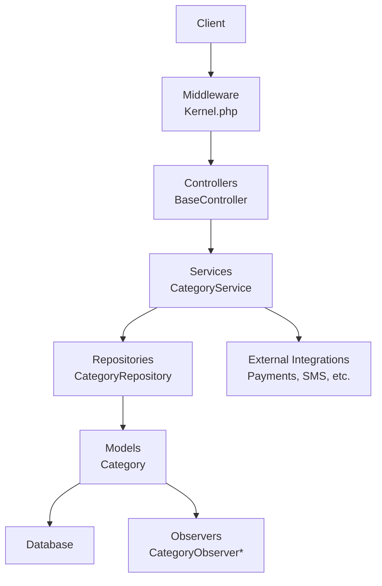

**Diagram sources**
- [app/Http/Kernel.php:18-86](file://app/Http/Kernel.php#L18-L86)
- [app/Http/Controllers/BaseController.php:11-14](file://app/Http/Controllers/BaseController.php#L11-L14)
- [app/Services/CategoryService.php:14-101](file://app/Services/CategoryService.php#L14-L101)
- [app/Repositories/CategoryRepository.php:18-175](file://app/Repositories/CategoryRepository.php#L18-L175)
- [app/Models/Category.php:32-192](file://app/Models/Category.php#L32-L192)
- [app/Providers/EventServiceProvider.php:41-50](file://app/Providers/EventServiceProvider.php#L41-L50)

## Detailed Component Analysis

### Service Layer: CategoryService
Responsibilities:
- Encapsulates business logic for categories (add/update/import/export).
- Handles file uploads and slug generation.
- Coordinates with repositories for persistence and with configuration for module scoping.

Key behaviors:
- View selection by position.
- Data preparation for add/update operations.
- Bulk import/export using spreadsheet parsing.

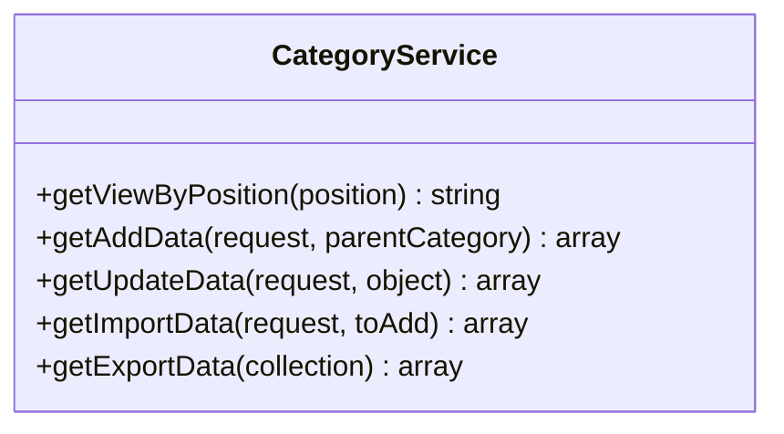

**Diagram sources**
- [app/Services/CategoryService.php:14-101](file://app/Services/CategoryService.php#L14-L101)

**Section sources**
- [app/Services/CategoryService.php:18-101](file://app/Services/CategoryService.php#L18-L101)

### Repository Pattern: CategoryRepository
Responsibilities:
- Implements typed CRUD operations for Category.
- Provides paginated and filtered lists, export-ready collections, and bulk insert/update helpers.
- Applies module scoping and translation/global scopes.

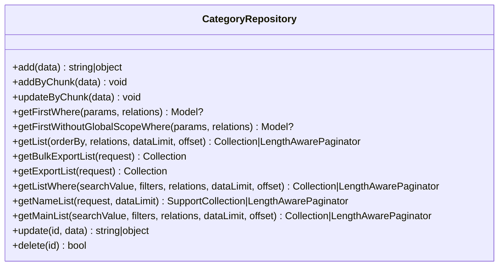

**Diagram sources**
- [app/Repositories/CategoryRepository.php:18-175](file://app/Repositories/CategoryRepository.php#L18-L175)

**Section sources**
- [app/Repositories/CategoryRepository.php:26-175](file://app/Repositories/CategoryRepository.php#L26-L175)

### Model and Observer: Category
Responsibilities:
- Defines fillable attributes, relations, scopes, and computed attributes.
- Bootstraps observers and lifecycle hooks to maintain storage metadata and slugs.

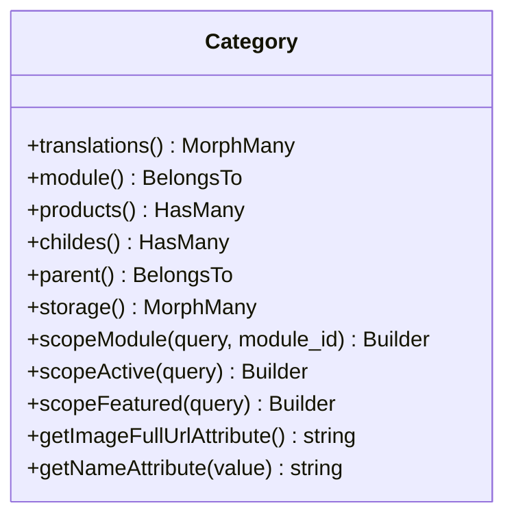

**Diagram sources**
- [app/Models/Category.php:32-192](file://app/Models/Category.php#L32-L192)

**Section sources**
- [app/Models/Category.php:121-192](file://app/Models/Category.php#L121-L192)

### Observer Pattern
The EventServiceProvider registers observers for key models to automate cross-cutting tasks (e.g., storage updates, banner/business settings maintenance). While CategoryObserver is not present in the current snapshot, the pattern is established for other models.

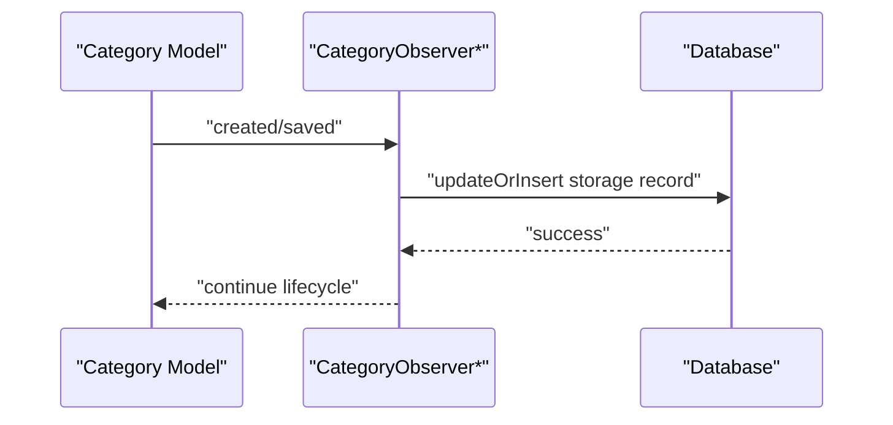

**Diagram sources**
- [app/Providers/EventServiceProvider.php:41-50](file://app/Providers/EventServiceProvider.php#L41-L50)
- [app/Models/Category.php:121-143](file://app/Models/Category.php#L121-L143)

**Section sources**
- [app/Providers/EventServiceProvider.php:41-50](file://app/Providers/EventServiceProvider.php#L41-L50)

### Middleware Architecture
The Kernel defines global middleware, web/api groups, and route-specific middleware for authentication, authorization, localization, module checks, and subscription gating.

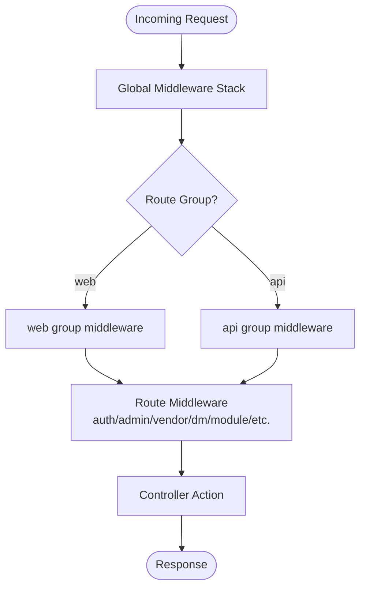

**Diagram sources**
- [app/Http/Kernel.php:18-86](file://app/Http/Kernel.php#L18-L86)

**Section sources**
- [app/Http/Kernel.php:18-86](file://app/Http/Kernel.php#L18-L86)

### Dependency Injection and Binding
- BaseController implements ControllerInterface, ensuring a consistent controller contract.
- InterfaceServiceProvider dynamically binds repository interfaces to concrete implementations discovered in app/Repositories and app/Contracts/Repositories.

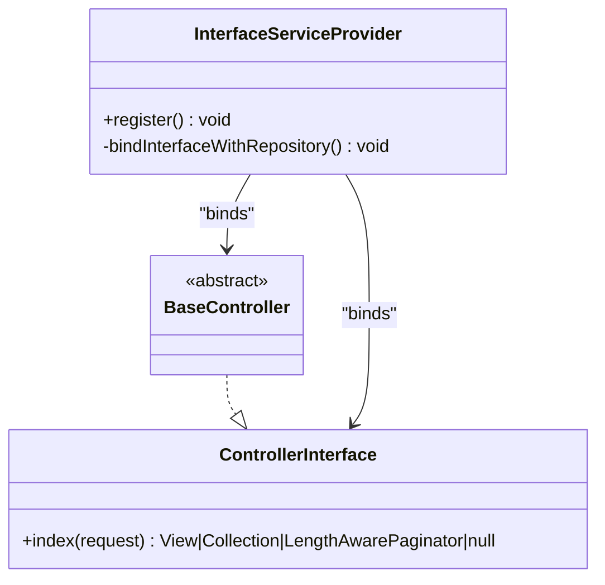

**Diagram sources**
- [app/Contracts/ControllerInterface.php:10-18](file://app/Contracts/ControllerInterface.php#L10-L18)
- [app/Http/Controllers/BaseController.php:11-14](file://app/Http/Controllers/BaseController.php#L11-L14)
- [app/Providers/InterfaceServiceProvider.php:20-36](file://app/Providers/InterfaceServiceProvider.php#L20-L36)

**Section sources**
- [app/Contracts/ControllerInterface.php:10-18](file://app/Contracts/ControllerInterface.php#L10-L18)
- [app/Http/Controllers/BaseController.php:11-14](file://app/Http/Controllers/BaseController.php#L11-L14)
- [app/Providers/InterfaceServiceProvider.php:15-36](file://app/Providers/InterfaceServiceProvider.php#L15-L36)

### Module-Based Development Approach
- Modules are scanned from Modules/, with generator paths configured for Controllers, Routes, Providers, Entities, Migrations, and Seeders.
- Activation is managed via a file-based activator and persisted status file.
- PSR-4 autoload maps Modules/ namespace for autoloading.

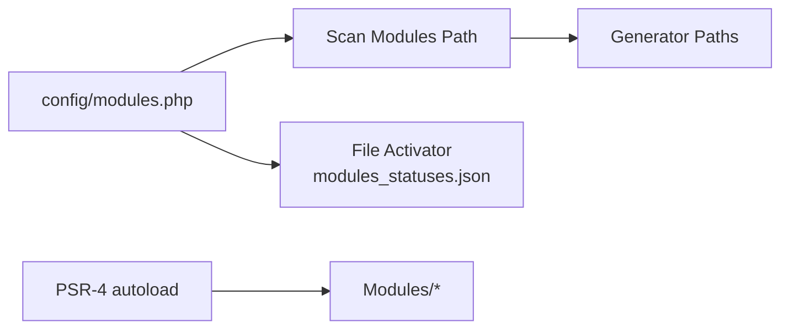

**Diagram sources**
- [config/modules.php:63-132](file://config/modules.php#L63-L132)
- [config/modules.php:267-277](file://config/modules.php#L267-L277)
- [composer.json:75-76](file://composer.json#L75-L76)

**Section sources**
- [config/modules.php:63-132](file://config/modules.php#L63-L132)
- [config/modules.php:267-277](file://config/modules.php#L267-L277)
- [composer.json:75-76](file://composer.json#L75-L76)

## Dependency Analysis
High-level dependencies:
- Controllers depend on Services via constructor injection or service container resolution.
- Services depend on Repositories for persistence and on configuration for module scoping.
- Repositories depend on Eloquent Models and DB facade.
- Observers depend on Models and external storage systems.
- Providers bind interfaces to implementations and register middleware.

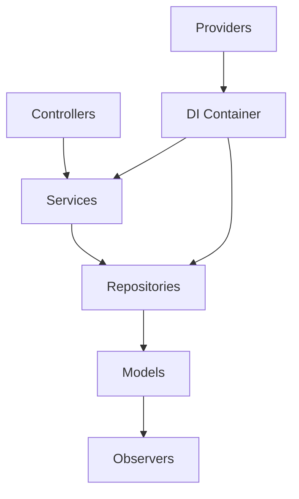

**Diagram sources**
- [app/Http/Controllers/BaseController.php:11-14](file://app/Http/Controllers/BaseController.php#L11-L14)
- [app/Services/CategoryService.php:14-101](file://app/Services/CategoryService.php#L14-L101)
- [app/Repositories/CategoryRepository.php:18-175](file://app/Repositories/CategoryRepository.php#L18-L175)
- [app/Models/Category.php:32-192](file://app/Models/Category.php#L32-L192)
- [app/Providers/EventServiceProvider.php:41-50](file://app/Providers/EventServiceProvider.php#L41-L50)
- [app/Providers/InterfaceServiceProvider.php:20-36](file://app/Providers/InterfaceServiceProvider.php#L20-L36)

**Section sources**
- [app/Providers/InterfaceServiceProvider.php:20-36](file://app/Providers/InterfaceServiceProvider.php#L20-L36)
- [app/Providers/EventServiceProvider.php:41-50](file://app/Providers/EventServiceProvider.php#L41-L50)

## Performance Considerations
- Bulk operations: CategoryRepository supports chunked inserts/updates to reduce memory footprint and improve throughput.
- Pagination: Repository methods return LengthAwarePaginator to avoid loading large datasets.
- Global scopes: Model global scopes (translate, storage) ensure localized and storage-aware queries by default.
- Middleware overhead: Minimize heavy operations in global middleware; prefer targeted middleware per route group.
- Observers: Keep observer logic lightweight; offload heavy tasks to queues if needed.

**Section sources**
- [app/Repositories/CategoryRepository.php:36-67](file://app/Repositories/CategoryRepository.php#L36-L67)
- [app/Repositories/CategoryRepository.php:79-120](file://app/Repositories/CategoryRepository.php#L79-L120)
- [app/Models/Category.php:175-186](file://app/Models/Category.php#L175-L186)

## Troubleshooting Guide
- Missing CategoryObserver: If storage metadata is not updating, verify observer registration in EventServiceProvider and ensure the observer file exists and is autoloaded.
- Module activation: If a module is inactive, check modules_statuses.json and ensure the file activator is enabled.
- Middleware conflicts: If CORS or CSRF issues arise, review Kernel middleware stacks and route middleware assignments.
- Repository exceptions: For bulk operations, wrap calls in transactions and handle DB exceptions appropriately.

**Section sources**
- [app/Providers/EventServiceProvider.php:41-50](file://app/Providers/EventServiceProvider.php#L41-L50)
- [config/modules.php:267-277](file://config/modules.php#L267-L277)
- [app/Http/Kernel.php:18-86](file://app/Http/Kernel.php#L18-L86)

## Conclusion
Waddy Back’s architecture blends Laravel’s MVC with a robust service-layer, repository pattern, and observer-driven lifecycle management. The module system enables feature isolation and independent development. The dependency injection container and provider-based bindings ensure clean contracts and testability. Middleware and kernel configuration provide strong request governance. With careful attention to bulk operations, pagination, and observer responsibilities, the system scales effectively while maintaining modularity and clarity.

## Appendices

### System Context Diagram
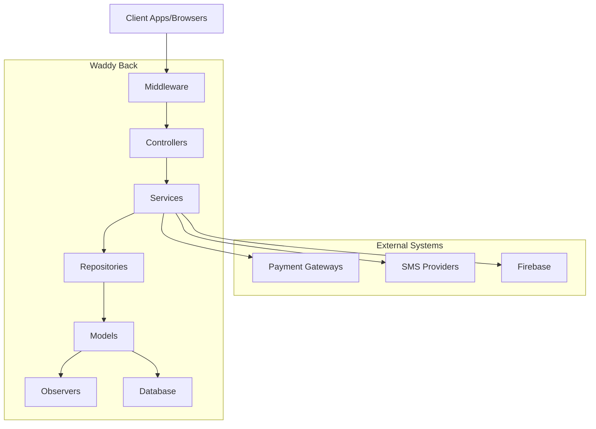

**Diagram sources**
- [app/Http/Kernel.php:18-86](file://app/Http/Kernel.php#L18-L86)
- [app/Services/CategoryService.php:14-101](file://app/Services/CategoryService.php#L14-L101)
- [app/Repositories/CategoryRepository.php:18-175](file://app/Repositories/CategoryRepository.php#L18-L175)
- [app/Models/Category.php:32-192](file://app/Models/Category.php#L32-L192)
- [app/Providers/EventServiceProvider.php:41-50](file://app/Providers/EventServiceProvider.php#L41-L50)

### Database Schema Context (Selected Entities)
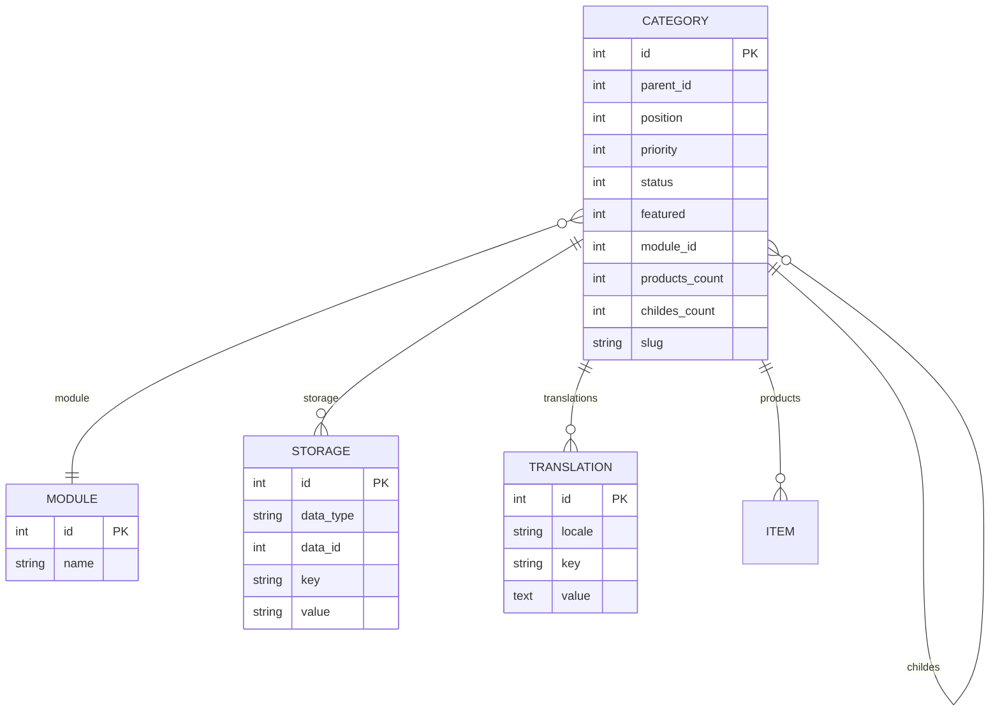

**Diagram sources**
- [app/Models/Category.php:32-192](file://app/Models/Category.php#L32-L192)