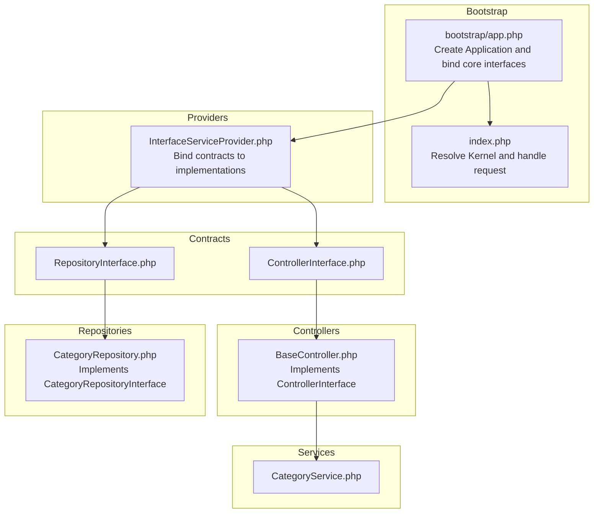
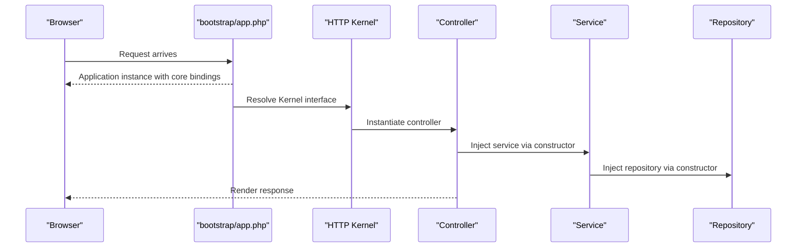
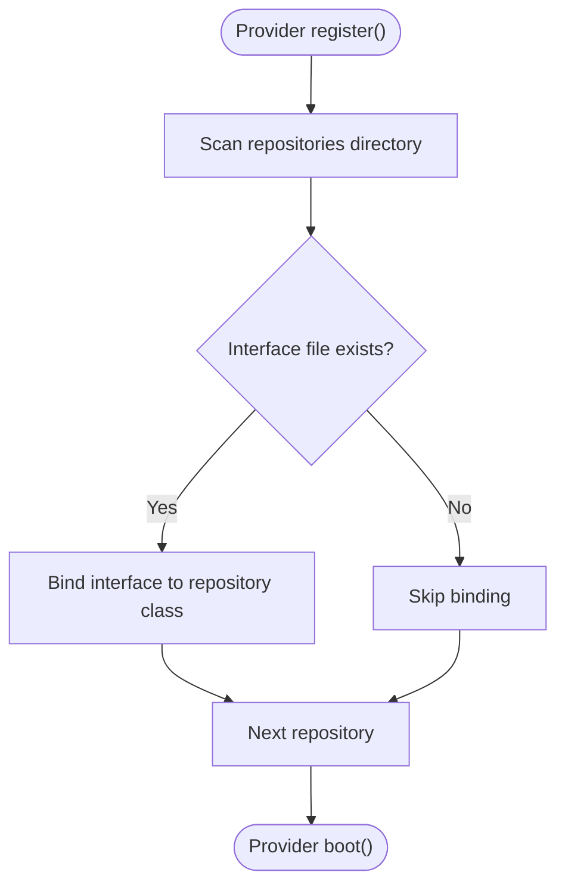
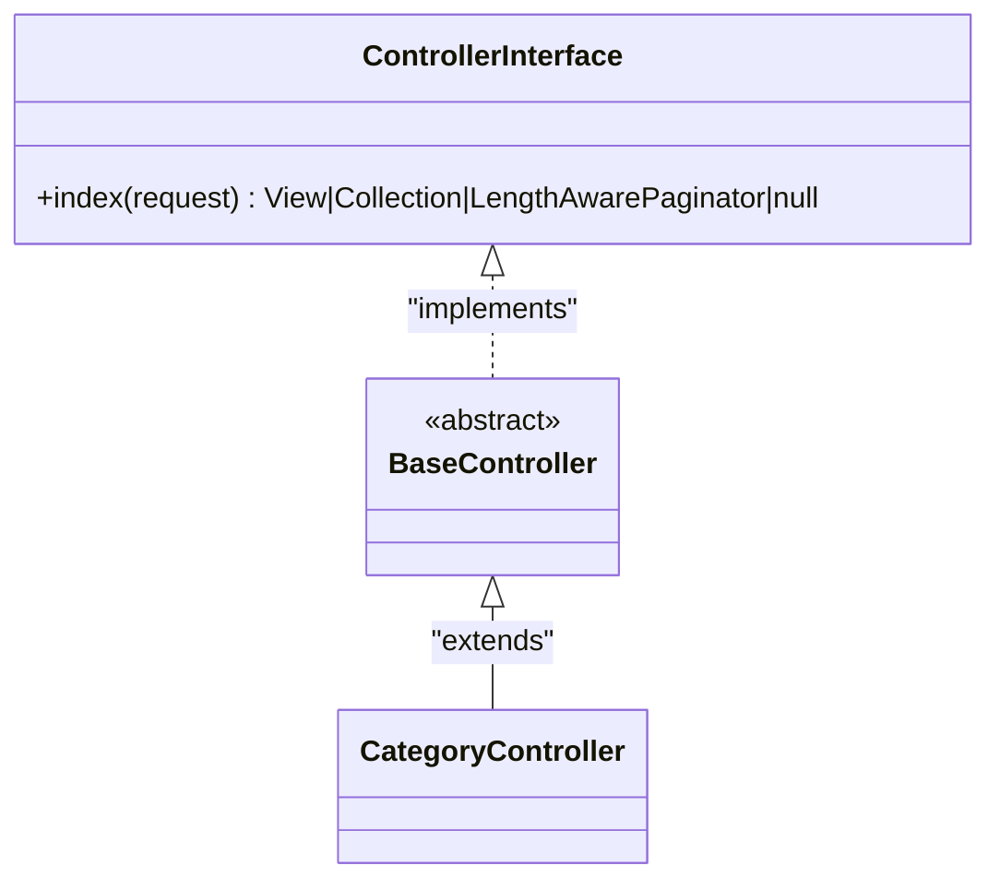
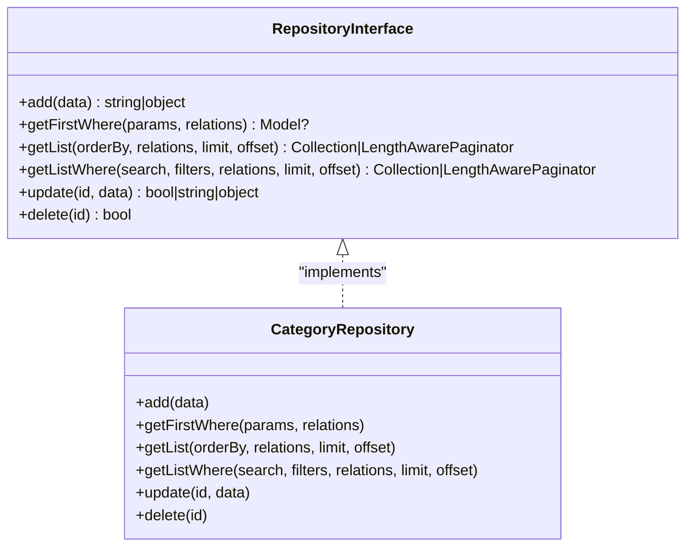
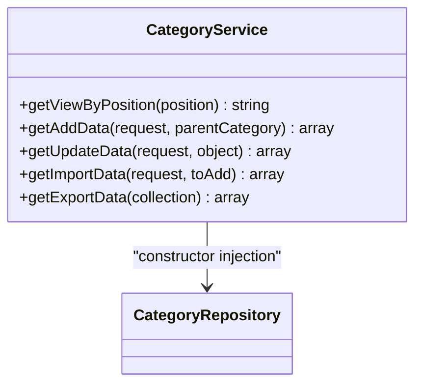
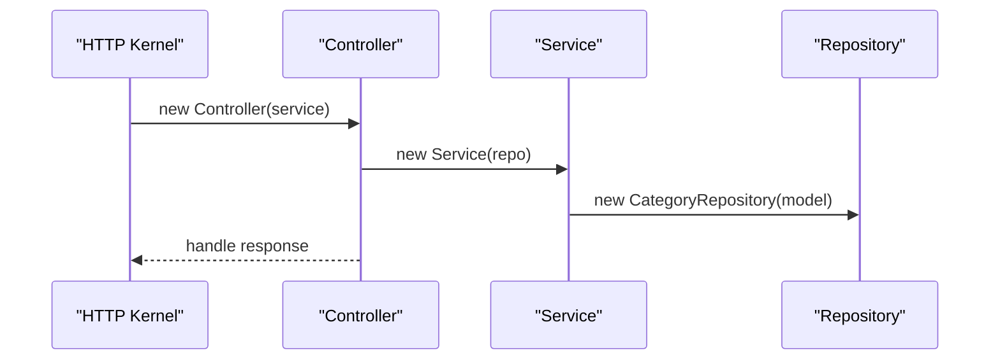
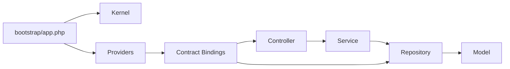

# Dependency Injection Container

<cite>
**Referenced Files in This Document**
- [bootstrap/app.php](file://bootstrap/app.php)
- [index.php](file://index.php)
- [app/Providers/InterfaceServiceProvider.php](file://app/Providers/InterfaceServiceProvider.php)
- [app/Contracts/ControllerInterface.php](file://app/Contracts/ControllerInterface.php)
- [app/Http/Controllers/BaseController.php](file://app/Http/Controllers/BaseController.php)
- [app/Contracts/Repositories/RepositoryInterface.php](file://app/Contracts/Repositories/RepositoryInterface.php)
- [app/Repositories/CategoryRepository.php](file://app/Repositories/CategoryRepository.php)
- [app/Services/CategoryService.php](file://app/Services/CategoryService.php)
- [config/services.php](file://config/services.php)
</cite>

## Table of Contents
1. [Introduction](#introduction)
2. [Project Structure](#project-structure)
3. [Core Components](#core-components)
4. [Architecture Overview](#architecture-overview)
5. [Detailed Component Analysis](#detailed-component-analysis)
6. [Dependency Analysis](#dependency-analysis)
7. [Performance Considerations](#performance-considerations)
8. [Troubleshooting Guide](#troubleshooting-guide)
9. [Conclusion](#conclusion)

## Introduction
This document explains the dependency injection container and service container implementation in Waddy Back. It focuses on how Laravel’s container binds interfaces to implementations, registers singletons, and resolves dependencies automatically. It also documents the contract-driven architecture that enables loose coupling and testability, and demonstrates how controllers, services, and repositories are wired together via the container. Finally, it covers performance considerations and best practices for large-scale applications.

## Project Structure
Waddy Back follows Laravel conventions:
- The container instance is created early in the bootstrap process and binds core interfaces such as HTTP and console kernels, and the exception handler.
- Providers register bindings between contracts and concrete implementations.
- Controllers extend a base controller that implements a shared interface, enabling polymorphic behavior.
- Repositories implement repository contracts and are bound automatically by a provider.
- Services encapsulate business logic and are consumed by controllers or other services.

**Diagram sources**
- [bootstrap/app.php:14-42](file://bootstrap/app.php#L14-L42)
- [index.php:52-56](file://index.php#L52-L56)
- [app/Providers/InterfaceServiceProvider.php:20-36](file://app/Providers/InterfaceServiceProvider.php#L20-L36)
- [app/Contracts/ControllerInterface.php:10-18](file://app/Contracts/ControllerInterface.php#L10-L18)
- [app/Http/Controllers/BaseController.php:11-14](file://app/Http/Controllers/BaseController.php#L11-L14)
- [app/Contracts/Repositories/RepositoryInterface.php:9-59](file://app/Contracts/Repositories/RepositoryInterface.php#L9-L59)
- [app/Repositories/CategoryRepository.php:18-24](file://app/Repositories/CategoryRepository.php#L18-L24)
- [app/Services/CategoryService.php:14-16](file://app/Services/CategoryService.php#L14-L16)

**Section sources**
- [bootstrap/app.php:14-42](file://bootstrap/app.php#L14-L42)
- [index.php:52-56](file://index.php#L52-L56)
- [app/Providers/InterfaceServiceProvider.php:15-36](file://app/Providers/InterfaceServiceProvider.php#L15-L36)

## Core Components
- Container lifecycle and core bindings:
  - The application instance is created and core interfaces are registered as singletons (HTTP kernel, console kernel, exception handler).
- Provider-driven bindings:
  - A dedicated provider binds controller and repository contracts to their implementations, including a dynamic scan of repository files.
- Contracts and base classes:
  - A shared controller interface ensures consistent controller behavior.
  - A generic repository interface defines common persistence operations.
- Services:
  - Services encapsulate business logic and are injected into controllers or other services.

**Section sources**
- [bootstrap/app.php:29-42](file://bootstrap/app.php#L29-L42)
- [app/Providers/InterfaceServiceProvider.php:15-36](file://app/Providers/InterfaceServiceProvider.php#L15-L36)
- [app/Contracts/ControllerInterface.php:10-18](file://app/Contracts/ControllerInterface.php#L10-L18)
- [app/Contracts/Repositories/RepositoryInterface.php:9-59](file://app/Contracts/Repositories/RepositoryInterface.php#L9-L59)
- [app/Repositories/CategoryRepository.php:18-24](file://app/Repositories/CategoryRepository.php#L18-L24)
- [app/Services/CategoryService.php:14-16](file://app/Services/CategoryService.php#L14-L16)

## Architecture Overview
The container orchestrates the application by resolving dependencies at runtime. The flow begins during bootstrap, continues through provider registration, and culminates in request handling via the HTTP kernel.

**Diagram sources**
- [bootstrap/app.php:14-42](file://bootstrap/app.php#L14-L42)
- [index.php:52-56](file://index.php#L52-L56)
- [app/Services/CategoryService.php:14-16](file://app/Services/CategoryService.php#L14-L16)
- [app/Repositories/CategoryRepository.php:18-24](file://app/Repositories/CategoryRepository.php#L18-L24)

## Detailed Component Analysis

### Container Initialization and Core Bindings
- The application instance is created and core interfaces are bound as singletons:
  - HTTP kernel
  - Console kernel
  - Exception handler
- These bindings ensure the framework’s request lifecycle is wired correctly.

**Section sources**
- [bootstrap/app.php:14-42](file://bootstrap/app.php#L14-L42)

### Provider-Based Contract-to-Implementation Binding
- The provider scans repository classes and matches them with corresponding repository interfaces. When a match exists, it registers a binding in the container.
- It also binds the shared controller interface to the base controller class.

**Diagram sources**
- [app/Providers/InterfaceServiceProvider.php:20-36](file://app/Providers/InterfaceServiceProvider.php#L20-L36)

**Section sources**
- [app/Providers/InterfaceServiceProvider.php:15-36](file://app/Providers/InterfaceServiceProvider.php#L15-L36)

### Controller Interface and Base Controller
- The base controller implements a shared controller interface, ensuring all controllers adhere to a consistent contract.
- This pattern enables polymorphism and simplifies testing by allowing mock controllers to be swapped in.

**Diagram sources**
- [app/Contracts/ControllerInterface.php:10-18](file://app/Contracts/ControllerInterface.php#L10-L18)
- [app/Http/Controllers/BaseController.php:11-14](file://app/Http/Controllers/BaseController.php#L11-L14)

**Section sources**
- [app/Contracts/ControllerInterface.php:10-18](file://app/Contracts/ControllerInterface.php#L10-L18)
- [app/Http/Controllers/BaseController.php:11-14](file://app/Http/Controllers/BaseController.php#L11-L14)

### Repository Contracts and Implementations
- The repository interface defines common persistence operations (create, read, update, delete, paginated lists).
- Concrete repositories implement these operations and may depend on models or external libraries.
- The provider binds each repository interface to its implementation automatically.

**Diagram sources**
- [app/Contracts/Repositories/RepositoryInterface.php:9-59](file://app/Contracts/Repositories/RepositoryInterface.php#L9-L59)
- [app/Repositories/CategoryRepository.php:18-175](file://app/Repositories/CategoryRepository.php#L18-L175)

**Section sources**
- [app/Contracts/Repositories/RepositoryInterface.php:9-59](file://app/Contracts/Repositories/RepositoryInterface.php#L9-L59)
- [app/Repositories/CategoryRepository.php:18-175](file://app/Repositories/CategoryRepository.php#L18-L175)

### Service Layer and Dependency Resolution
- Services encapsulate business logic and are injected into controllers or other services.
- Constructor injection is used to receive repositories and other dependencies, enabling testability and modularity.

**Diagram sources**
- [app/Services/CategoryService.php:14-101](file://app/Services/CategoryService.php#L14-L101)
- [app/Repositories/CategoryRepository.php:18-24](file://app/Repositories/CategoryRepository.php#L18-L24)

**Section sources**
- [app/Services/CategoryService.php:14-16](file://app/Services/CategoryService.php#L14-L16)
- [app/Repositories/CategoryRepository.php:18-24](file://app/Repositories/CategoryRepository.php#L18-L24)

### Automatic Dependency Resolution in Practice
- The container resolves dependencies automatically when controllers and services are instantiated.
- Example flow:
  - The HTTP kernel resolves a controller.
  - The controller constructor requests a service.
  - The service constructor requests a repository.
  - The container instantiates and injects the repository.

**Diagram sources**
- [index.php:52-56](file://index.php#L52-L56)
- [app/Services/CategoryService.php:14-16](file://app/Services/CategoryService.php#L14-L16)
- [app/Repositories/CategoryRepository.php:18-24](file://app/Repositories/CategoryRepository.php#L18-L24)

**Section sources**
- [index.php:52-56](file://index.php#L52-L56)
- [app/Services/CategoryService.php:14-16](file://app/Services/CategoryService.php#L14-L16)
- [app/Repositories/CategoryRepository.php:18-24](file://app/Repositories/CategoryRepository.php#L18-L24)

## Dependency Analysis
- Coupling and cohesion:
  - Controllers depend on interfaces, not concrete classes, improving cohesion and reducing tight coupling.
  - Providers centralize binding logic, keeping application code clean.
- Direct and indirect dependencies:
  - Controllers depend on services.
  - Services depend on repositories.
  - Repositories depend on models and external libraries.
- External dependencies:
  - Configuration values are loaded from the services configuration file.

**Diagram sources**
- [bootstrap/app.php:14-42](file://bootstrap/app.php#L14-L42)
- [app/Providers/InterfaceServiceProvider.php:20-36](file://app/Providers/InterfaceServiceProvider.php#L20-L36)
- [app/Services/CategoryService.php:14-16](file://app/Services/CategoryService.php#L14-L16)
- [app/Repositories/CategoryRepository.php:18-24](file://app/Repositories/CategoryRepository.php#L18-L24)

**Section sources**
- [bootstrap/app.php:14-42](file://bootstrap/app.php#L14-L42)
- [app/Providers/InterfaceServiceProvider.php:20-36](file://app/Providers/InterfaceServiceProvider.php#L20-L36)
- [config/services.php:1-58](file://config/services.php#L1-L58)

## Performance Considerations
- Prefer constructor injection for mandatory dependencies to avoid runtime reflection overhead.
- Keep bindings minimal and centralized in providers to simplify resolution and improve maintainability.
- Use caching for frequently accessed configuration values to reduce repeated reads.
- Avoid deep dependency chains; prefer focused services with clear responsibilities.
- In large applications, consider deferring heavy initialization to lazy loading or service-level caching.

## Troubleshooting Guide
- Missing bindings:
  - If a controller expects a service but the container cannot resolve it, ensure the corresponding provider has registered the binding.
- Interface mismatch:
  - Verify that repository interface names match the expected pattern and that the provider can locate both the interface and implementation files.
- Configuration issues:
  - Confirm that configuration values used by services are present in the services configuration file.

**Section sources**
- [app/Providers/InterfaceServiceProvider.php:20-36](file://app/Providers/InterfaceServiceProvider.php#L20-L36)
- [config/services.php:1-58](file://config/services.php#L1-L58)

## Conclusion
Waddy Back leverages Laravel’s container to enforce a clean separation of concerns through contracts and providers. Controllers, services, and repositories are bound and resolved automatically, enabling loose coupling, testability, and scalability. By adhering to constructor injection and centralizing bindings, teams can maintain predictable behavior and performance in large applications.