# Event Observer Pattern

<cite>
**Referenced Files in This Document**
- [EventServiceProvider.php](file://app/Providers/EventServiceProvider.php)
- [BusinessSettingObserver.php](file://app/Observers/BusinessSettingObserver.php)
- [DataSettingObserver.php](file://app/Observers/DataSettingObserver.php)
- [ModuleObserver.php](file://app/Observers/ModuleObserver.php)
- [BannerObserver.php](file://app/Observers/BannerObserver.php)
- [OrderObserver.php](file://app/Observers/OrderObserver.php)
- [UserObserver.php](file://app/Observers/UserObserver.php)
- [ReviewObserver.php](file://app/Observers/ReviewObserver.php)
- [BusinessSetting.php](file://app/Models/BusinessSetting.php)
- [Order.php](file://app/Models/Order.php)
- [User.php](file://app/Models/User.php)
- [XpService.php](file://app/Services/XpService.php)
- [ChallengeService.php](file://app/Services/ChallengeService.php)
</cite>

## Table of Contents
1. [Introduction](#introduction)
2. [Project Structure](#project-structure)
3. [Core Components](#core-components)
4. [Architecture Overview](#architecture-overview)
5. [Detailed Component Analysis](#detailed-component-analysis)
6. [Dependency Analysis](#dependency-analysis)
7. [Performance Considerations](#performance-considerations)
8. [Troubleshooting Guide](#troubleshooting-guide)
9. [Conclusion](#conclusion)

## Introduction
This document explains the event observer pattern implementation in Waddy Back, focusing on how observers listen to model lifecycle events (created, updated, deleted, restored, and saved) and perform automated cross-cutting actions such as logging, cache invalidation, notifications, and data synchronization. It documents the observer registration process, event broadcasting mechanisms, and how this pattern decouples business logic from model definitions. Concrete examples illustrate observer implementations for order processing, user management, and business setting updates, and show how they integrate with the service layer to maintain clean separation of concerns.

## Project Structure
Observers are located under the Observers namespace and are registered via the EventServiceProvider. Each observer responds to specific model events and coordinates with services for side effects.

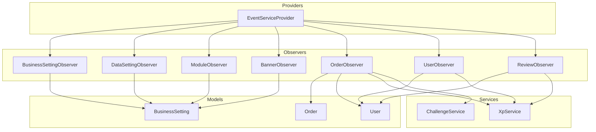

**Diagram sources**
- [EventServiceProvider.php:41-50](file://app/Providers/EventServiceProvider.php#L41-L50)
- [BusinessSettingObserver.php:11-75](file://app/Observers/BusinessSettingObserver.php#L11-L75)
- [DataSettingObserver.php:10-69](file://app/Observers/DataSettingObserver.php#L10-L69)
- [ModuleObserver.php:10-69](file://app/Observers/ModuleObserver.php#L10-L69)
- [BannerObserver.php:10-69](file://app/Observers/BannerObserver.php#L10-L69)
- [OrderObserver.php:12-91](file://app/Observers/OrderObserver.php#L12-L91)
- [UserObserver.php:9-25](file://app/Observers/UserObserver.php#L9-L25)
- [ReviewObserver.php:10-44](file://app/Observers/ReviewObserver.php#L10-L44)
- [BusinessSetting.php:10-66](file://app/Models/BusinessSetting.php#L10-L66)
- [Order.php:13-358](file://app/Models/Order.php#L13-L358)
- [User.php:19-279](file://app/Models/User.php#L19-L279)
- [XpService.php:15-336](file://app/Services/XpService.php#L15-L336)
- [ChallengeService.php:12-321](file://app/Services/ChallengeService.php#L12-L321)

**Section sources**
- [EventServiceProvider.php:41-50](file://app/Providers/EventServiceProvider.php#L41-L50)
- [BusinessSettingObserver.php:11-75](file://app/Observers/BusinessSettingObserver.php#L11-L75)
- [DataSettingObserver.php:10-69](file://app/Observers/DataSettingObserver.php#L10-L69)
- [ModuleObserver.php:10-69](file://app/Observers/ModuleObserver.php#L10-L69)
- [BannerObserver.php:10-69](file://app/Observers/BannerObserver.php#L10-L69)
- [OrderObserver.php:12-91](file://app/Observers/OrderObserver.php#L12-L91)
- [UserObserver.php:9-25](file://app/Observers/UserObserver.php#L9-L25)
- [ReviewObserver.php:10-44](file://app/Observers/ReviewObserver.php#L10-L44)

## Core Components
- EventServiceProvider registers observers for models during application boot.
- Observers encapsulate event-specific logic and coordinate with services for side effects.
- Models define lifecycle hooks (saved, created, deleted, updated) that trigger cache invalidation and storage updates.
- Services (XpService, ChallengeService) implement business logic for XP awards, streaks, and challenge progress.

Key responsibilities:
- Decoupling: Observers keep model definitions free from cross-cutting concerns.
- Reusability: Services centralize business logic for XP and challenges.
- Maintainability: Clear separation between persistence (models), behavior (observers), and business rules (services).

**Section sources**
- [EventServiceProvider.php:41-50](file://app/Providers/EventServiceProvider.php#L41-L50)
- [BusinessSetting.php:35-63](file://app/Models/BusinessSetting.php#L35-L63)
- [XpService.php:15-336](file://app/Services/XpService.php#L15-L336)
- [ChallengeService.php:12-321](file://app/Services/ChallengeService.php#L12-L321)

## Architecture Overview
The observer pattern integrates with Laravel’s Eloquent lifecycle hooks and model events to automate tasks without modifying model methods directly. Registration occurs in EventServiceProvider, and observers react to model events to perform logging, cache invalidation, notifications, and data synchronization.

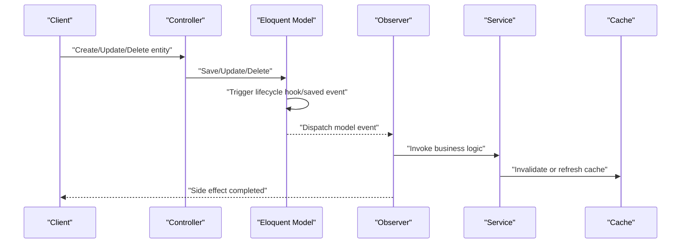

**Diagram sources**
- [EventServiceProvider.php:41-50](file://app/Providers/EventServiceProvider.php#L41-L50)
- [BusinessSettingObserver.php:53-73](file://app/Observers/BusinessSettingObserver.php#L53-L73)
- [DataSettingObserver.php:52-67](file://app/Observers/DataSettingObserver.php#L52-L67)
- [ModuleObserver.php:52-67](file://app/Observers/ModuleObserver.php#L52-L67)
- [BannerObserver.php:52-67](file://app/Observers/BannerObserver.php#L52-L67)
- [OrderObserver.php:17-65](file://app/Observers/OrderObserver.php#L17-L65)
- [UserObserver.php:14-23](file://app/Observers/UserObserver.php#L14-L23)
- [ReviewObserver.php:24-42](file://app/Observers/ReviewObserver.php#L24-L42)

## Detailed Component Analysis

### Observer Registration and Event Broadcasting
- EventServiceProvider binds each model to its observer during boot.
- Observers receive model events (created, updated, deleted, restored, forceDeleted) and perform side effects.
- Models may also define saved hooks for cache invalidation and storage updates.

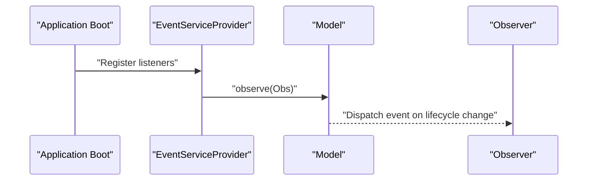

**Diagram sources**
- [EventServiceProvider.php:41-50](file://app/Providers/EventServiceProvider.php#L41-L50)
- [BusinessSetting.php:38-61](file://app/Models/BusinessSetting.php#L38-L61)

**Section sources**
- [EventServiceProvider.php:41-50](file://app/Providers/EventServiceProvider.php#L41-L50)
- [BusinessSetting.php:35-63](file://app/Models/BusinessSetting.php#L35-L63)

### Business Settings Observer
Responsibilities:
- Invalidate cached keys prefixed with business_settings_* upon any change to BusinessSetting.
- Clear specific session keys for certain settings to ensure runtime consistency.

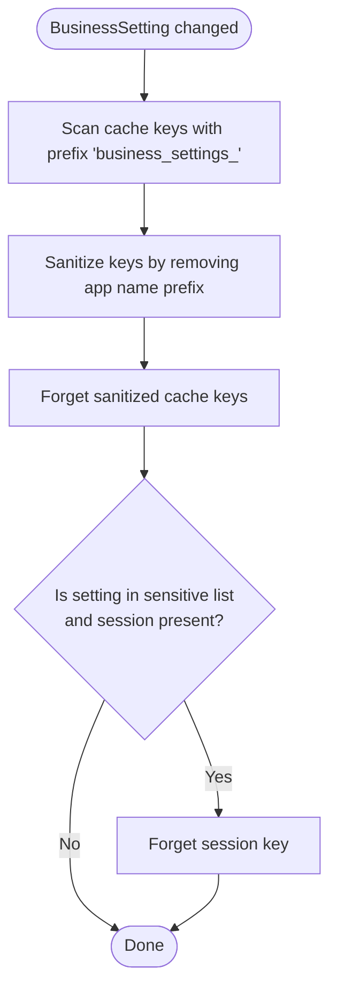

**Diagram sources**
- [BusinessSettingObserver.php:53-73](file://app/Observers/BusinessSettingObserver.php#L53-L73)

**Section sources**
- [BusinessSettingObserver.php:11-75](file://app/Observers/BusinessSettingObserver.php#L11-L75)
- [BusinessSetting.php:38-61](file://app/Models/BusinessSetting.php#L38-L61)

### Data Settings Observer
Responsibilities:
- Invalidate cached keys prefixed with data_settings_* upon any change to DataSetting.

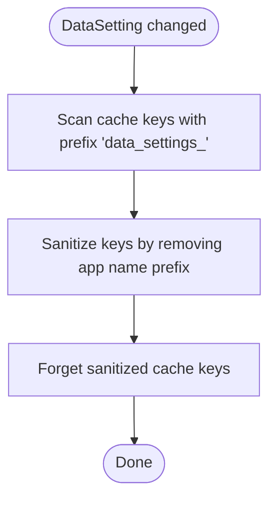

**Diagram sources**
- [DataSettingObserver.php:52-67](file://app/Observers/DataSettingObserver.php#L52-L67)

**Section sources**
- [DataSettingObserver.php:10-69](file://app/Observers/DataSettingObserver.php#L10-L69)

### Module Observer
Responsibilities:
- Invalidate cached keys prefixed with module_ upon any change to Module.

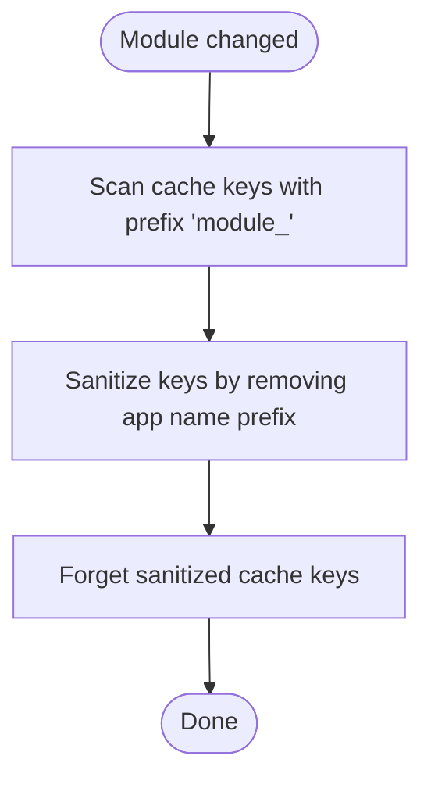

**Diagram sources**
- [ModuleObserver.php:52-67](file://app/Observers/ModuleObserver.php#L52-L67)

**Section sources**
- [ModuleObserver.php:10-69](file://app/Observers/ModuleObserver.php#L10-L69)

### Banner Observer
Responsibilities:
- Invalidate cached keys prefixed with banners_ upon any change to Banner.

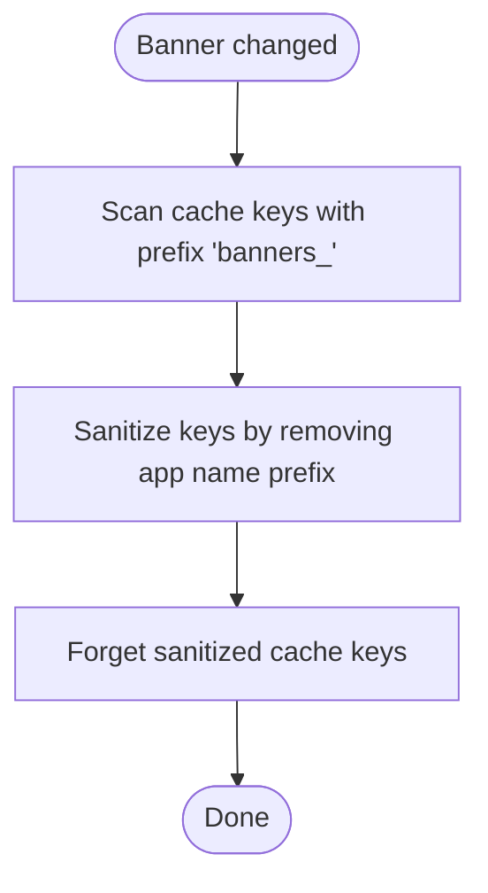

**Diagram sources**
- [BannerObserver.php:52-67](file://app/Observers/BannerObserver.php#L52-L67)

**Section sources**
- [BannerObserver.php:10-69](file://app/Observers/BannerObserver.php#L10-L69)

### Order Observer
Responsibilities:
- On created: create an OrderReference record.
- On updated: detect when order_status transitions to delivered and process XP and challenges for non-guest orders.
- Logging and error handling are performed around service calls.

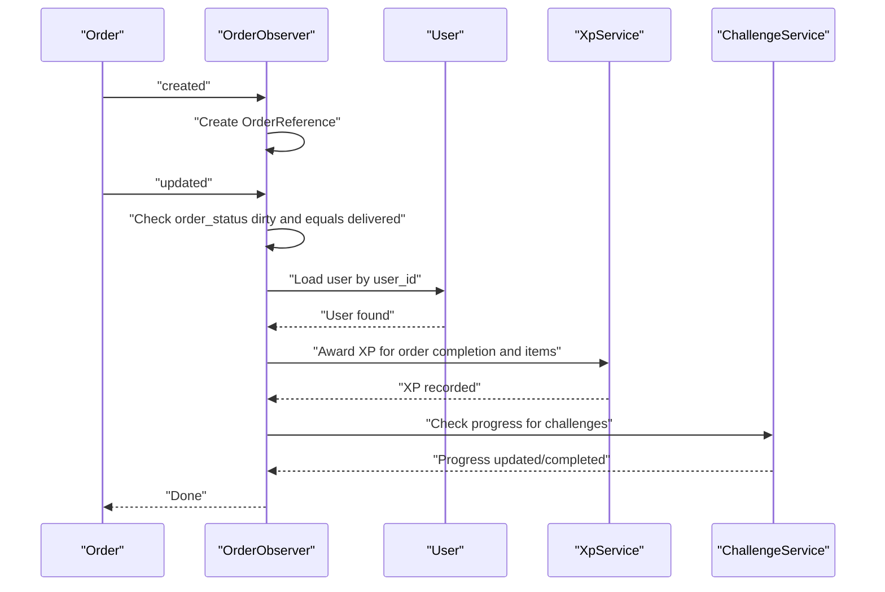

**Diagram sources**
- [OrderObserver.php:17-65](file://app/Observers/OrderObserver.php#L17-L65)
- [Order.php:13-358](file://app/Models/Order.php#L13-L358)
- [User.php:19-279](file://app/Models/User.php#L19-L279)
- [XpService.php:81-116](file://app/Services/XpService.php#L81-L116)
- [ChallengeService.php:196-256](file://app/Services/ChallengeService.php#L196-L256)

**Section sources**
- [OrderObserver.php:12-91](file://app/Observers/OrderObserver.php#L12-L91)
- [Order.php:188-191](file://app/Models/Order.php#L188-L191)
- [XpService.php:81-116](file://app/Services/XpService.php#L81-L116)
- [ChallengeService.php:196-256](file://app/Services/ChallengeService.php#L196-L256)

### User Observer
Responsibilities:
- On created: award signup XP via XpService and log the action.
- Error handling ensures failures are logged without breaking the save operation.

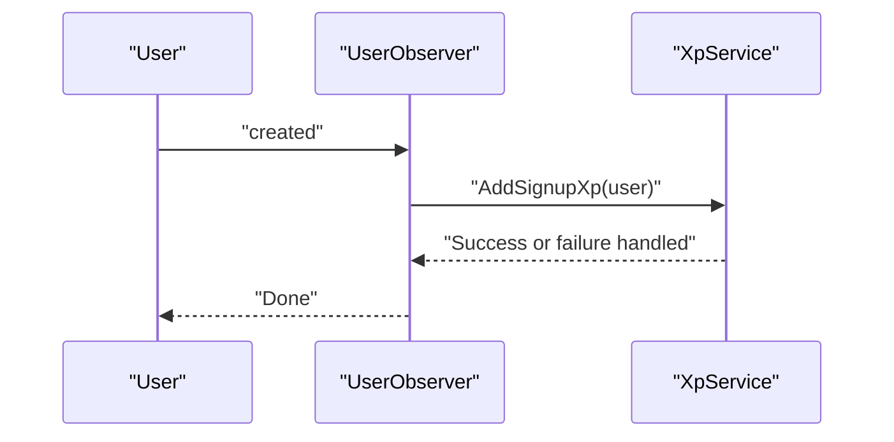

**Diagram sources**
- [UserObserver.php:14-23](file://app/Observers/UserObserver.php#L14-L23)
- [XpService.php:187-200](file://app/Services/XpService.php#L187-L200)

**Section sources**
- [UserObserver.php:9-25](file://app/Observers/UserObserver.php#L9-L25)
- [XpService.php:187-200](file://app/Services/XpService.php#L187-L200)

### Review Observer
Responsibilities:
- On created: load the associated user and award XP for the review via XpService.

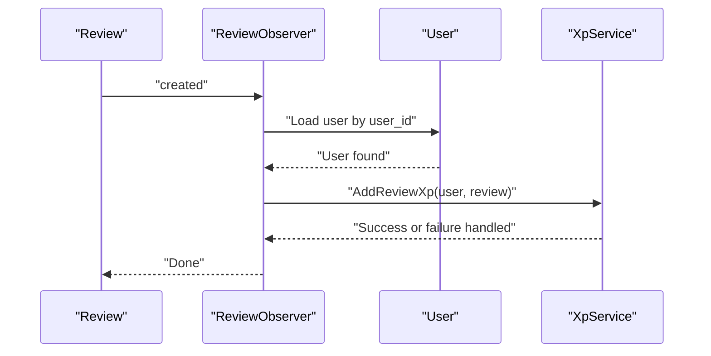

**Diagram sources**
- [ReviewObserver.php:24-42](file://app/Observers/ReviewObserver.php#L24-L42)
- [XpService.php:171-182](file://app/Services/XpService.php#L171-L182)

**Section sources**
- [ReviewObserver.php:10-44](file://app/Observers/ReviewObserver.php#L10-L44)
- [XpService.php:171-182](file://app/Services/XpService.php#L171-L182)

### Service Layer Integration
- XpService: Centralizes XP calculations, transactions, level-ups, streaks, and notifications.
- ChallengeService: Manages daily/weekly challenges, progress tracking, and rewards.

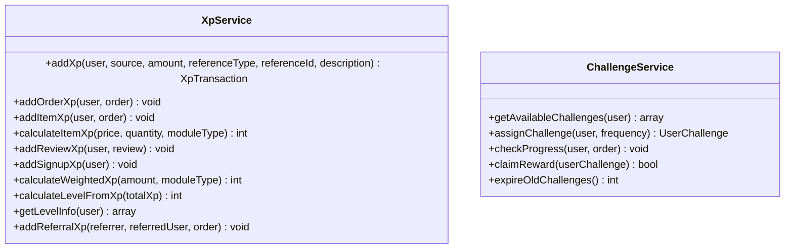

**Diagram sources**
- [XpService.php:15-336](file://app/Services/XpService.php#L15-L336)
- [ChallengeService.php:12-321](file://app/Services/ChallengeService.php#L12-L321)

**Section sources**
- [XpService.php:15-336](file://app/Services/XpService.php#L15-L336)
- [ChallengeService.php:12-321](file://app/Services/ChallengeService.php#L12-L321)

## Dependency Analysis
- Observers depend on models for event context and on services for business logic.
- Models depend on Eloquent lifecycle hooks and may trigger cache invalidation via saved callbacks.
- Services encapsulate XP and challenge logic, minimizing duplication and ensuring consistent behavior.

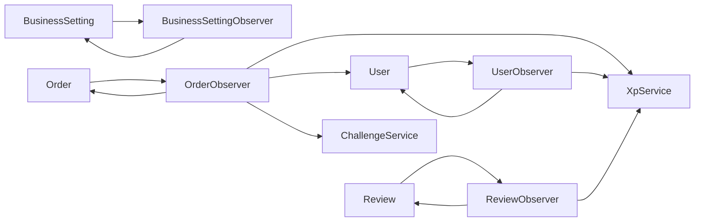

**Diagram sources**
- [BusinessSettingObserver.php:11-75](file://app/Observers/BusinessSettingObserver.php#L11-L75)
- [OrderObserver.php:12-91](file://app/Observers/OrderObserver.php#L12-L91)
- [UserObserver.php:9-25](file://app/Observers/UserObserver.php#L9-L25)
- [ReviewObserver.php:10-44](file://app/Observers/ReviewObserver.php#L10-L44)
- [BusinessSetting.php:10-66](file://app/Models/BusinessSetting.php#L10-L66)
- [Order.php:13-358](file://app/Models/Order.php#L13-L358)
- [User.php:19-279](file://app/Models/User.php#L19-L279)
- [XpService.php:15-336](file://app/Services/XpService.php#L15-L336)
- [ChallengeService.php:12-321](file://app/Services/ChallengeService.php#L12-L321)

**Section sources**
- [EventServiceProvider.php:41-50](file://app/Providers/EventServiceProvider.php#L41-L50)
- [BusinessSetting.php:35-63](file://app/Models/BusinessSetting.php#L35-L63)

## Performance Considerations
- Cache invalidation scans and sanitizes keys; ensure cache keys are scoped narrowly to minimize overhead.
- Transactional XP additions protect data consistency but add database overhead; batch operations where appropriate.
- Logging should be used judiciously in hot paths; consider structured logging and sampling in production.
- Challenge progress checks iterate active challenges; pre-filter and avoid N+1 queries by eager-loading related data.

## Troubleshooting Guide
Common issues and resolutions:
- Cache not invalidated: Verify the observer’s cache key prefix matches stored keys and that the sanitization removes the application name prefix correctly.
- XP not awarded: Confirm XpSetting is enabled and that exceptions are caught and logged without failing the save operation.
- Challenge progress not updating: Ensure order status transitions are detected and that the order belongs to a non-guest user.
- Notifications not sent: Check push notification tokens and device availability; confirm service calls are executed within try/catch blocks.

**Section sources**
- [BusinessSettingObserver.php:53-73](file://app/Observers/BusinessSettingObserver.php#L53-L73)
- [OrderObserver.php:39-65](file://app/Observers/OrderObserver.php#L39-L65)
- [UserObserver.php:16-22](file://app/Observers/UserObserver.php#L16-L22)
- [XpService.php:72-75](file://app/Services/XpService.php#L72-L75)

## Conclusion
The observer pattern in Waddy Back cleanly separates persistence, behavior, and business logic. Observers listen to model events and delegate cross-cutting concerns to services, while models remain focused on data representation and lifecycle hooks. This design improves maintainability, testability, and scalability, enabling automated actions such as logging, cache invalidation, XP awards, and challenge progression without cluttering model definitions.