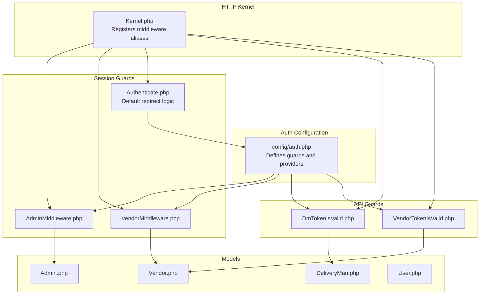
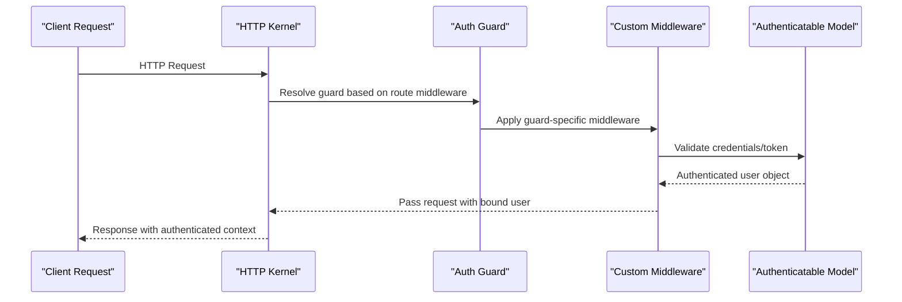
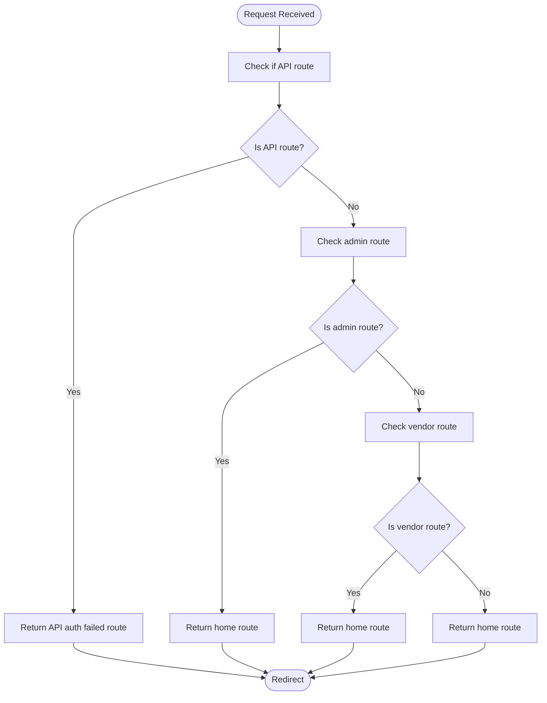
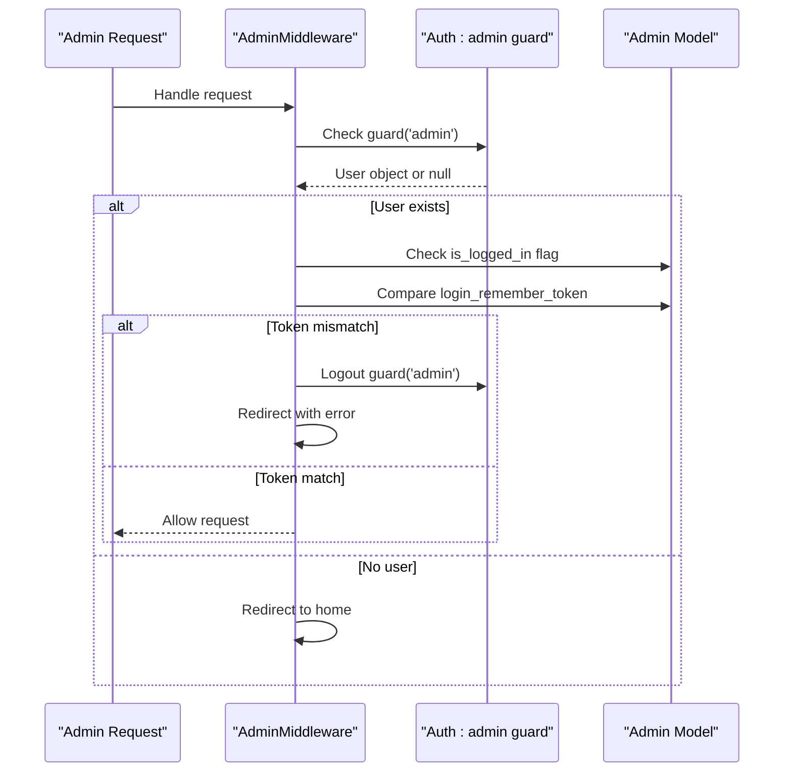
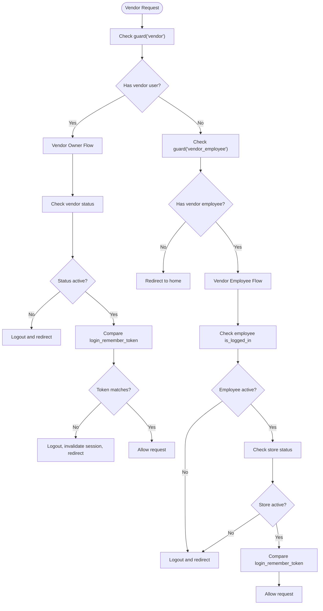
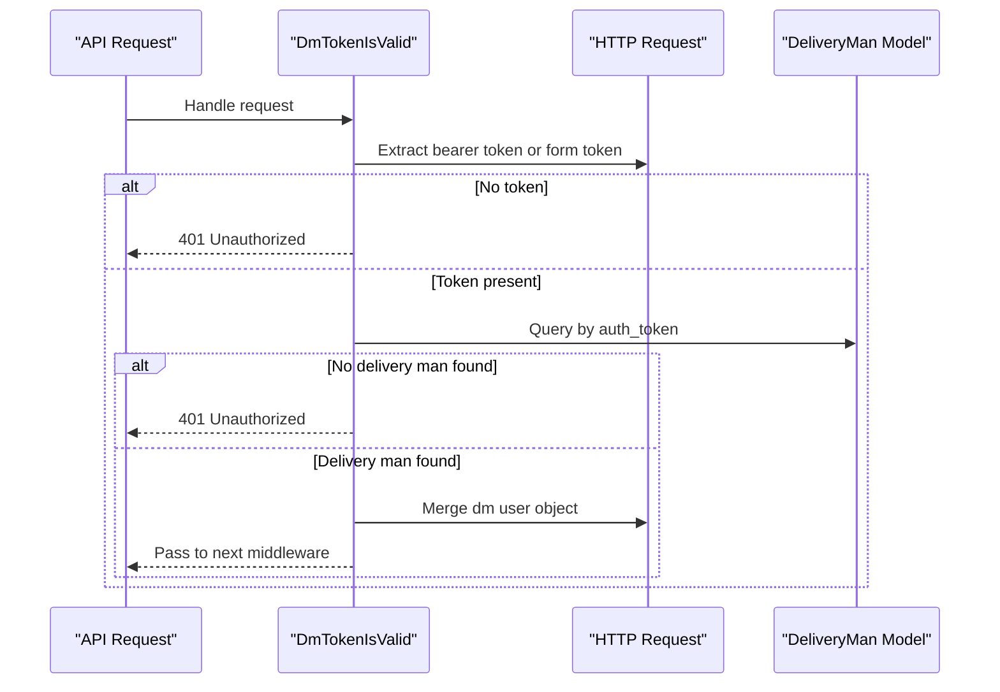
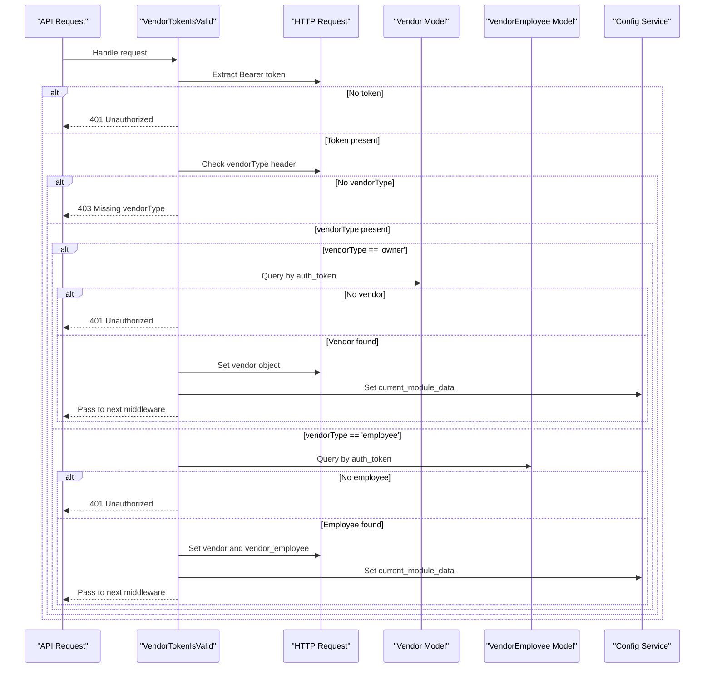
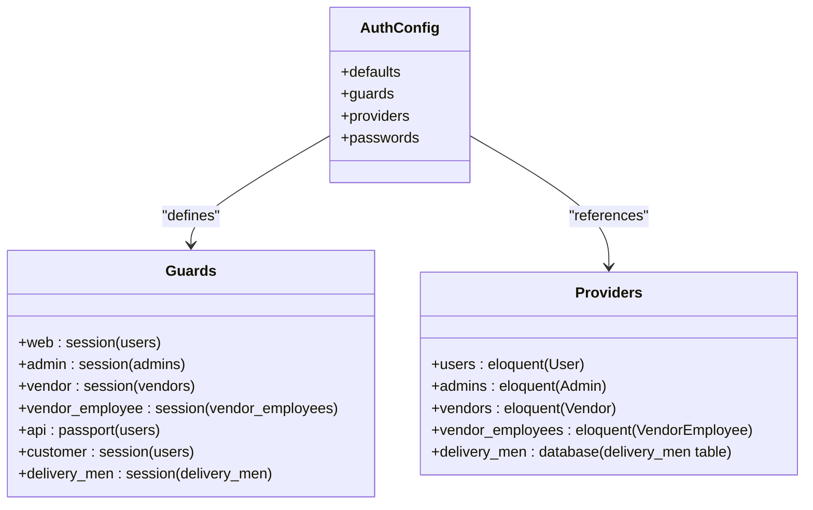
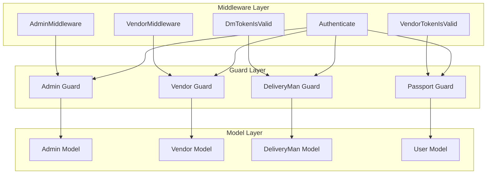

# Authentication Middleware

<cite>
**Referenced Files in This Document**
- [Authenticate.php](file://app/Http/Middleware/Authenticate.php)
- [Kernel.php](file://app/Http/Kernel.php)
- [auth.php](file://config/auth.php)
- [AdminMiddleware.php](file://app/Http/Middleware/AdminMiddleware.php)
- [VendorMiddleware.php](file://app/Http/Middleware/VendorMiddleware.php)
- [DmTokenIsValid.php](file://app/Http/Middleware/DmTokenIsValid.php)
- [VendorTokenIsValid.php](file://app/Http/Middleware/VendorTokenIsValid.php)
- [Admin.php](file://app/Models/Admin.php)
- [Vendor.php](file://app/Models/Vendor.php)
- [DeliveryMan.php](file://app/Models/DeliveryMan.php)
- [User.php](file://app/Models/User.php)
</cite>

## Table of Contents
1. [Introduction](#introduction)
2. [Project Structure](#project-structure)
3. [Core Components](#core-components)
4. [Architecture Overview](#architecture-overview)
5. [Detailed Component Analysis](#detailed-component-analysis)
6. [Dependency Analysis](#dependency-analysis)
7. [Performance Considerations](#performance-considerations)
8. [Troubleshooting Guide](#troubleshooting-guide)
9. [Conclusion](#conclusion)

## Introduction
This document provides comprehensive documentation for the authentication middleware system in Waddy Back. It explains how the Authenticate middleware handles user authentication across different guard types (web, admin, vendor, deliveryman), details token validation mechanisms for API authentication, and documents the integration with Laravel's authentication guards. The guide also covers authentication flows, error handling for invalid tokens, and security considerations for API endpoints.

## Project Structure
The authentication middleware system spans several key areas:
- Global middleware kernel that registers route-specific middleware aliases
- Authentication configuration defining guards and providers
- Guard-specific middleware for session-based authentication (admin, vendor)
- Token-based middleware for API authentication (deliveryman, vendor)
- Authentication models supporting each guard type

**Diagram sources**
- [Kernel.php:61-86](file://app/Http/Kernel.php#L61-L86)
- [auth.php:38-115](file://config/auth.php#L38-L115)
- [AdminMiddleware.php:11-47](file://app/Http/Middleware/AdminMiddleware.php#L11-L47)
- [VendorMiddleware.php:10-60](file://app/Http/Middleware/VendorMiddleware.php#L10-L60)
- [Authenticate.php:7-35](file://app/Http/Middleware/Authenticate.php#L7-L35)
- [DmTokenIsValid.php:10-41](file://app/Http/Middleware/DmTokenIsValid.php#L10-L41)
- [VendorTokenIsValid.php:11-68](file://app/Http/Middleware/VendorTokenIsValid.php#L11-L68)

**Section sources**
- [Kernel.php:61-86](file://app/Http/Kernel.php#L61-L86)
- [auth.php:38-115](file://config/auth.php#L38-L115)

## Core Components
This section outlines the primary authentication components and their roles:

- Authenticate middleware: Extends Laravel's base authentication middleware to customize redirect behavior for different request contexts (API, admin, vendor, web).
- AdminMiddleware: Validates admin session state, checks login remember tokens, and handles session expiration scenarios.
- VendorMiddleware: Validates vendor and vendor employee sessions, manages status checks, and handles session expiration.
- DmTokenIsValid: Validates delivery man tokens via bearer token or form field for API requests.
- VendorTokenIsValid: Validates vendor and vendor employee tokens with vendor type awareness and sets current module data.

**Section sources**
- [Authenticate.php:7-35](file://app/Http/Middleware/Authenticate.php#L7-L35)
- [AdminMiddleware.php:11-47](file://app/Http/Middleware/AdminMiddleware.php#L11-L47)
- [VendorMiddleware.php:10-60](file://app/Http/Middleware/VendorMiddleware.php#L10-L60)
- [DmTokenIsValid.php:10-41](file://app/Http/Middleware/DmTokenIsValid.php#L10-L41)
- [VendorTokenIsValid.php:11-68](file://app/Http/Middleware/VendorTokenIsValid.php#L11-L68)

## Architecture Overview
The authentication architecture integrates Laravel's guard system with custom middleware:

**Diagram sources**
- [Kernel.php:61-86](file://app/Http/Kernel.php#L61-L86)
- [auth.php:38-115](file://config/auth.php#L38-L115)

## Detailed Component Analysis

### Authenticate Middleware
The Authenticate middleware extends Laravel's default authentication middleware to provide context-aware redirect logic:

**Diagram sources**
- [Authenticate.php:15-33](file://app/Http/Middleware/Authenticate.php#L15-L33)

Key behaviors:
- API requests redirect to a dedicated authentication-failed route
- Admin and vendor routes redirect to the home route
- Non-admin, non-vendor routes redirect to the home route

**Section sources**
- [Authenticate.php:7-35](file://app/Http/Middleware/Authenticate.php#L7-L35)

### Admin Session Middleware
The AdminMiddleware validates admin session state and handles session expiration:

**Diagram sources**
- [AdminMiddleware.php:20-45](file://app/Http/Middleware/AdminMiddleware.php#L20-L45)
- [Admin.php:28-51](file://app/Models/Admin.php#L28-L51)

Security features:
- Session state validation via `is_logged_in` flag
- Login remember token verification for session binding
- Automatic logout and token regeneration on session mismatch
- Role-aware login URL generation

**Section sources**
- [AdminMiddleware.php:11-47](file://app/Http/Middleware/AdminMiddleware.php#L11-L47)
- [Admin.php:28-51](file://app/Models/Admin.php#L28-L51)

### Vendor Session Middleware
The VendorMiddleware handles both vendor owners and vendor employees:

**Diagram sources**
- [VendorMiddleware.php:19-58](file://app/Http/Middleware/VendorMiddleware.php#L19-L58)
- [Vendor.php:89-96](file://app/Models/Vendor.php#L89-L96)

Key validations:
- Vendor owner status check and store relationship
- Vendor employee login state and store status validation
- Login remember token verification for session integrity
- Automatic logout and session regeneration on expiration

**Section sources**
- [VendorMiddleware.php:10-60](file://app/Http/Middleware/VendorMiddleware.php#L10-L60)
- [Vendor.php:89-96](file://app/Models/Vendor.php#L89-L96)

### Delivery Man Token Validation
The DmTokenIsValid middleware provides API token validation for delivery men:

**Diagram sources**
- [DmTokenIsValid.php:19-39](file://app/Http/Middleware/DmTokenIsValid.php#L19-L39)
- [DeliveryMan.php:28-31](file://app/Models/DeliveryMan.php#L28-L31)

Token validation process:
- Supports both Bearer token header and form field token
- Direct lookup against delivery man authentication token
- Attaches validated user object to request for downstream use

**Section sources**
- [DmTokenIsValid.php:10-41](file://app/Http/Middleware/DmTokenIsValid.php#L10-L41)
- [DeliveryMan.php:28-31](file://app/Models/DeliveryMan.php#L28-L31)

### Vendor Token Validation
The VendorTokenIsValid middleware handles vendor and vendor employee token validation with vendor type awareness:

**Diagram sources**
- [VendorTokenIsValid.php:20-66](file://app/Http/Middleware/VendorTokenIsValid.php#L20-L66)
- [Vendor.php:89-96](file://app/Models/Vendor.php#L89-L96)

Advanced features:
- Vendor type differentiation (owner vs employee)
- Automatic module detection and configuration
- Proper request object population for both vendor and employee contexts

**Section sources**
- [VendorTokenIsValid.php:11-68](file://app/Http/Middleware/VendorTokenIsValid.php#L11-L68)
- [Vendor.php:89-96](file://app/Models/Vendor.php#L89-L96)

### Authentication Guards Configuration
The authentication system defines multiple guards with distinct providers:

**Diagram sources**
- [auth.php:38-115](file://config/auth.php#L38-L115)

Guard characteristics:
- Session-based guards for web interfaces (web, admin, vendor, vendor_employee, customer, delivery_men)
- Passport-based API guard for token authentication
- Database provider for delivery men authentication
- Eloquent providers for user models

**Section sources**
- [auth.php:38-115](file://config/auth.php#L38-L115)

## Dependency Analysis
The authentication middleware system exhibits clear separation of concerns:

**Diagram sources**
- [Kernel.php:61-86](file://app/Http/Kernel.php#L61-L86)
- [auth.php:38-115](file://config/auth.php#L38-L115)

Key dependencies:
- Middleware depends on Laravel's Auth facade and guard system
- Guard configuration determines model providers and authentication drivers
- Models encapsulate authentication logic and relationships
- Request objects carry authenticated user context downstream

**Section sources**
- [Kernel.php:61-86](file://app/Http/Kernel.php#L61-L86)
- [auth.php:38-115](file://config/auth.php#L38-L115)

## Performance Considerations
- Token validation queries: DmTokenIsValid and VendorTokenIsValid perform single-table lookups by token field
- Session validation overhead: AdminMiddleware and VendorMiddleware check login_remember_token and status flags
- Guard switching: Minimal overhead for switching between guards in middleware chain
- Caching opportunities: Consider caching frequently accessed vendor/module data
- Database indexing: Ensure auth_token fields are indexed for optimal token lookup performance

## Troubleshooting Guide
Common authentication issues and resolutions:

### Session Expiration Issues
- Symptom: Users redirected to login after brief inactivity
- Cause: login_remember_token mismatch or is_logged_in flag changes
- Resolution: Clear browser cookies, check session configuration, verify token generation

### Token Validation Failures
- Symptom: 401 Unauthorized responses for API requests
- Causes: Missing Bearer token, invalid token format, expired tokens
- Resolution: Verify token presence in Authorization header, check token validity period

### Vendor Type Configuration
- Symptom: 403 Missing vendorType errors
- Cause: Missing vendorType header in vendor API requests
- Resolution: Include vendorType header with value 'owner' or 'employee'

### Session State Conflicts
- Symptom: Multiple login sessions detected
- Cause: login_remember_token changes across devices
- Resolution: Implement proper session invalidation, consider device-specific tokens

**Section sources**
- [AdminMiddleware.php:22-38](file://app/Http/Middleware/AdminMiddleware.php#L22-L38)
- [VendorMiddleware.php:27-33](file://app/Http/Middleware/VendorMiddleware.php#L27-L33)
- [DmTokenIsValid.php:21-28](file://app/Http/Middleware/DmTokenIsValid.php#L21-L28)
- [VendorTokenIsValid.php:31-36](file://app/Http/Middleware/VendorTokenIsValid.php#L31-L36)

## Conclusion
The Waddy Back authentication middleware system provides a robust, multi-layered approach to user authentication across different guard types. The system successfully integrates Laravel's guard architecture with custom middleware to support:
- Session-based authentication for admin and vendor interfaces
- Token-based authentication for API endpoints
- Context-aware redirect logic for different request types
- Comprehensive session validation and expiration handling
- Vendor type differentiation for flexible authentication flows

The modular design allows for easy extension and customization while maintaining security best practices through proper token validation, session management, and guard configuration.