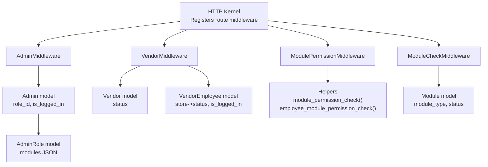
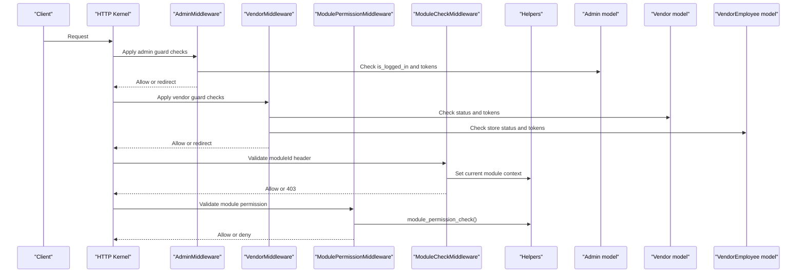
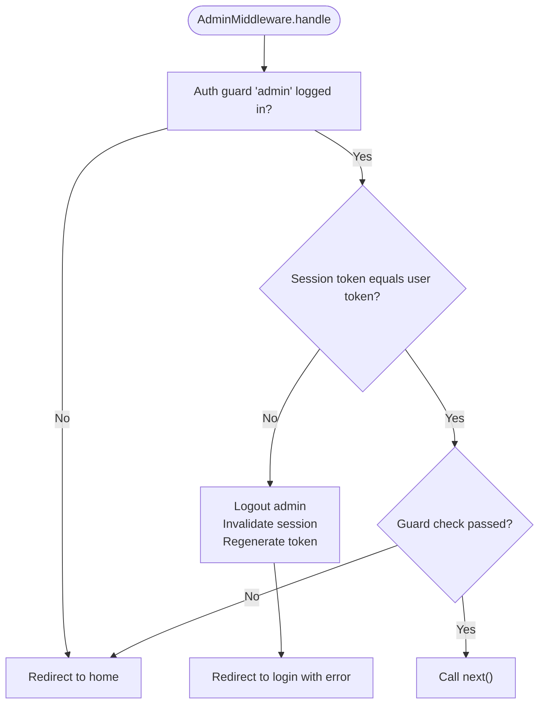
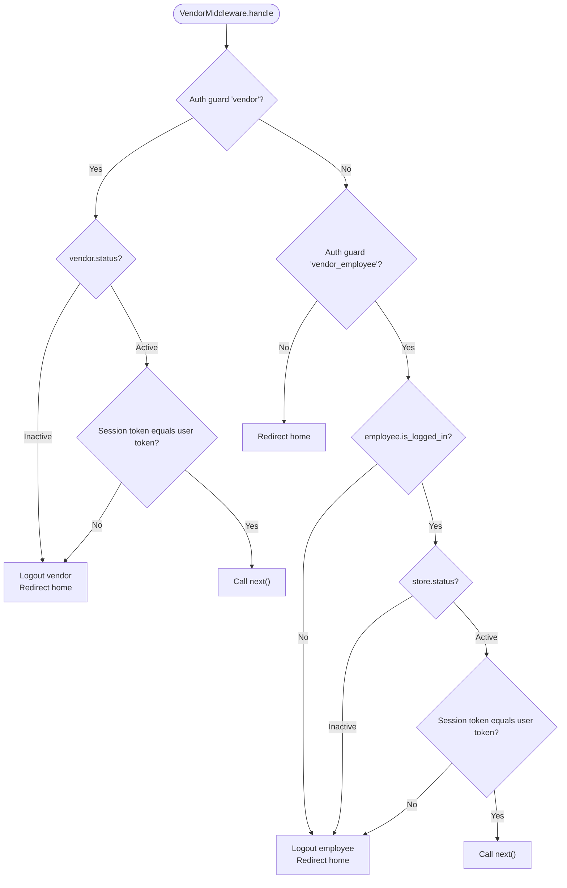
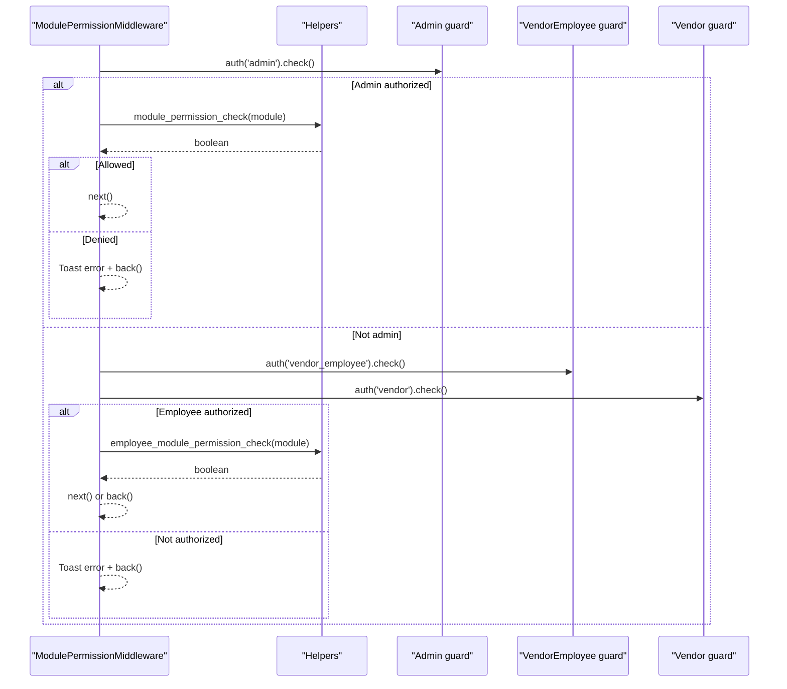
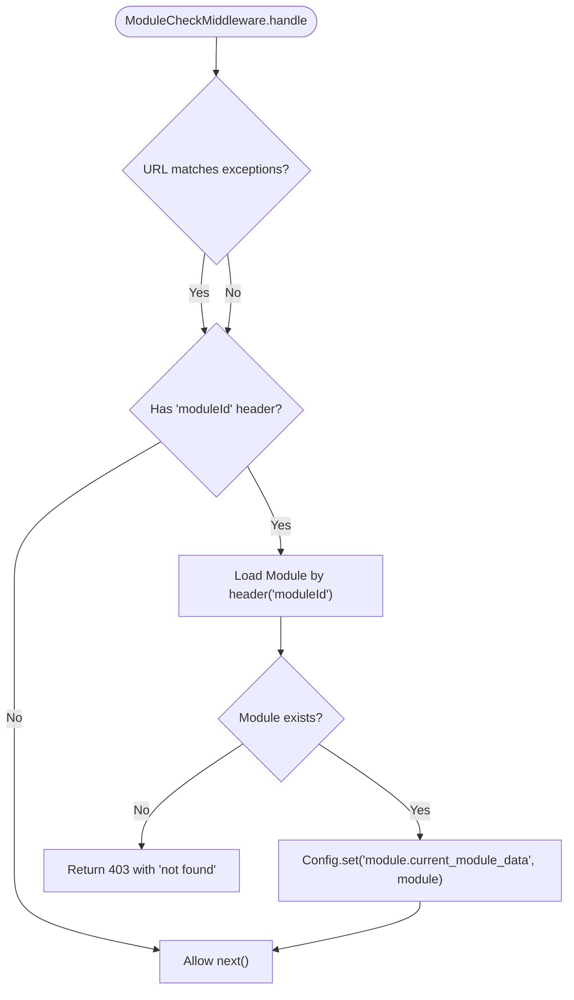
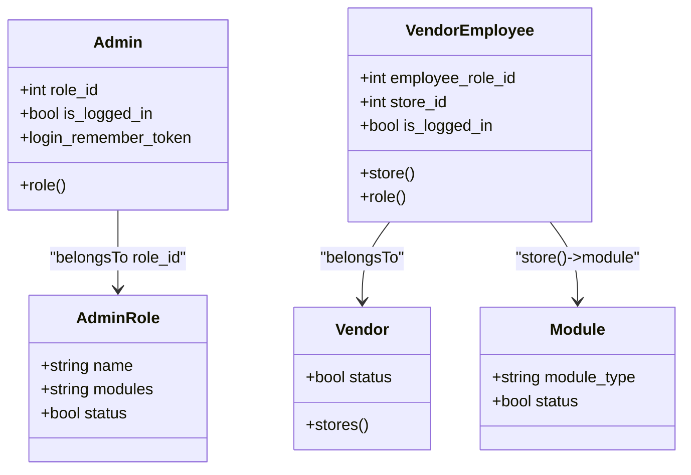
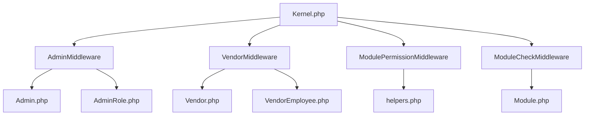

# Authorization Middleware

<cite>
**Referenced Files in This Document**
- [AdminMiddleware.php](file://app/Http/Middleware/AdminMiddleware.php)
- [VendorMiddleware.php](file://app/Http/Middleware/VendorMiddleware.php)
- [ModulePermissionMiddleware.php](file://app/Http/Middleware/ModulePermissionMiddleware.php)
- [ModuleCheckMiddleware.php](file://app/Http/Middleware/ModuleCheckMiddleware.php)
- [helpers.php](file://app/CentralLogics/helpers.php)
- [Admin.php](file://app/Models/Admin.php)
- [Vendor.php](file://app/Models/Vendor.php)
- [VendorEmployee.php](file://app/Models/VendorEmployee.php)
- [AdminRole.php](file://app/Models/AdminRole.php)
- [Module.php](file://app/Models/Module.php)
- [Kernel.php](file://app/Http/Kernel.php)
- [routes.php](file://routes/admin/routes.php)
</cite>

## Table of Contents
1. [Introduction](#introduction)
2. [Project Structure](#project-structure)
3. [Core Components](#core-components)
4. [Architecture Overview](#architecture-overview)
5. [Detailed Component Analysis](#detailed-component-analysis)
6. [Dependency Analysis](#dependency-analysis)
7. [Performance Considerations](#performance-considerations)
8. [Troubleshooting Guide](#troubleshooting-guide)
9. [Conclusion](#conclusion)

## Introduction
This document explains the authorization middleware system that controls access to different parts of the application. It focuses on role-based access control enforced by AdminMiddleware and VendorMiddleware, and on business module access validation performed by ModulePermissionMiddleware and ModuleCheckMiddleware. The guide details permission checking logic, user role hierarchies, and how middleware determines authorized actions. It also provides examples for implementing custom authorization rules, handling permission inheritance, and managing access to module-specific features.

## Project Structure
The authorization system is implemented through middleware classes registered in the HTTP kernel and supported by central helper functions and Eloquent models representing roles and modules.

**Diagram sources**
- [Kernel.php:61-86](file://app/Http/Kernel.php#L61-L86)
- [AdminMiddleware.php:20-45](file://app/Http/Middleware/AdminMiddleware.php#L20-L45)
- [VendorMiddleware.php:19-57](file://app/Http/Middleware/VendorMiddleware.php#L19-L57)
- [ModulePermissionMiddleware.php:18-32](file://app/Http/Middleware/ModulePermissionMiddleware.php#L18-L32)
- [ModuleCheckMiddleware.php:17-49](file://app/Http/Middleware/ModuleCheckMiddleware.php#L17-L49)
- [Admin.php:67-70](file://app/Models/Admin.php#L67-L70)
- [Vendor.php:89-96](file://app/Models/Vendor.php#L89-L96)
- [VendorEmployee.php:43-55](file://app/Models/VendorEmployee.php#L43-L55)
- [helpers.php:2213-2234](file://app/CentralLogics/helpers.php#L2213-L2234)
- [Module.php:68-81](file://app/Models/Module.php#L68-L81)
- [AdminRole.php:30-34](file://app/Models/AdminRole.php#L30-L34)

**Section sources**
- [Kernel.php:61-86](file://app/Http/Kernel.php#L61-L86)

## Core Components
- AdminMiddleware: Validates admin session integrity and ensures the admin user is allowed to continue.
- VendorMiddleware: Validates vendor and vendor employee sessions, statuses, and session tokens.
- ModulePermissionMiddleware: Enforces module-level permissions for admins and employees.
- ModuleCheckMiddleware: Validates the requested module via request header and sets current module context.

**Section sources**
- [AdminMiddleware.php:20-45](file://app/Http/Middleware/AdminMiddleware.php#L20-L45)
- [VendorMiddleware.php:19-57](file://app/Http/Middleware/VendorMiddleware.php#L19-L57)
- [ModulePermissionMiddleware.php:18-32](file://app/Http/Middleware/ModulePermissionMiddleware.php#L18-L32)
- [ModuleCheckMiddleware.php:17-49](file://app/Http/Middleware/ModuleCheckMiddleware.php#L17-L49)

## Architecture Overview
The authorization pipeline integrates middleware with user models and helper functions to enforce role and module access.

**Diagram sources**
- [Kernel.php:61-86](file://app/Http/Kernel.php#L61-L86)
- [AdminMiddleware.php:20-45](file://app/Http/Middleware/AdminMiddleware.php#L20-L45)
- [VendorMiddleware.php:19-57](file://app/Http/Middleware/VendorMiddleware.php#L19-L57)
- [ModuleCheckMiddleware.php:17-49](file://app/Http/Middleware/ModuleCheckMiddleware.php#L17-L49)
- [ModulePermissionMiddleware.php:18-32](file://app/Http/Middleware/ModulePermissionMiddleware.php#L18-L32)
- [helpers.php:2213-2234](file://app/CentralLogics/helpers.php#L2213-L2234)

## Detailed Component Analysis

### AdminMiddleware
Purpose:
- Ensures admin session integrity by validating login_remember_token.
- Logs out admins whose sessions have changed or who are marked inactive.
- Allows access only if the admin guard check passes.

Key behaviors:
- Checks admin.is_logged_in and compares session token against user.login_remember_token.
- Redirects to login with an expiration message if tokens mismatch.
- Returns to previous page after logout.

**Diagram sources**
- [AdminMiddleware.php:20-45](file://app/Http/Middleware/AdminMiddleware.php#L20-L45)

**Section sources**
- [AdminMiddleware.php:20-45](file://app/Http/Middleware/AdminMiddleware.php#L20-L45)
- [Admin.php:26-28](file://app/Models/Admin.php#L26-L28)

### VendorMiddleware
Purpose:
- Validates vendor and vendor employee sessions.
- Ensures vendor and store statuses are active.
- Compares session tokens to prevent hijacking.

Key behaviors:
- For vendor: checks vendor.status and login_remember_token.
- For vendor_employee: checks employee.is_logged_in, store.status, and login_remember_token.
- Redirects to home on failure; otherwise proceeds.

**Diagram sources**
- [VendorMiddleware.php:19-57](file://app/Http/Middleware/VendorMiddleware.php#L19-L57)
- [Vendor.php:44-47](file://app/Models/Vendor.php#L44-L47)
- [VendorEmployee.php:17-23](file://app/Models/VendorEmployee.php#L17-L23)

**Section sources**
- [VendorMiddleware.php:19-57](file://app/Http/Middleware/VendorMiddleware.php#L19-L57)
- [Vendor.php:44-47](file://app/Models/Vendor.php#L44-L47)
- [VendorEmployee.php:43-55](file://app/Models/VendorEmployee.php#L43-L55)

### ModulePermissionMiddleware
Purpose:
- Enforces module-level permissions for admins and employees.
- Uses helper functions to check allowed modules per role.

Key behaviors:
- For admin: checks module_permission_check(module).
- For vendor_employee/vendor: checks employee_module_permission_check(module).
- Denies access with a toast error and redirects back when unauthorized.

**Diagram sources**
- [ModulePermissionMiddleware.php:18-32](file://app/Http/Middleware/ModulePermissionMiddleware.php#L18-L32)
- [helpers.php:2213-2234](file://app/CentralLogics/helpers.php#L2213-L2234)

**Section sources**
- [ModulePermissionMiddleware.php:18-32](file://app/Http/Middleware/ModulePermissionMiddleware.php#L18-L32)
- [helpers.php:2213-2234](file://app/CentralLogics/helpers.php#L2213-L2234)

### ModuleCheckMiddleware
Purpose:
- Validates the presence and validity of the moduleId header.
- Sets the current module context in configuration for downstream use.

Key behaviors:
- Skips validation for configured exceptions.
- Requires header 'moduleId'; returns 403 with errors if missing.
- Loads Module by ID; returns 403 if not found.
- Stores module data in Config under 'module.current_module_data'.

**Diagram sources**
- [ModuleCheckMiddleware.php:17-49](file://app/Http/Middleware/ModuleCheckMiddleware.php#L17-L49)
- [Module.php:68-81](file://app/Models/Module.php#L68-L81)

**Section sources**
- [ModuleCheckMiddleware.php:17-49](file://app/Http/Middleware/ModuleCheckMiddleware.php#L17-L49)
- [Module.php:68-81](file://app/Models/Module.php#L68-L81)

### Role-Based Access Control and Permission Checking Logic
- Admin role hierarchy:
  - Admin belongs to AdminRole via role_id.
  - AdminRole stores a modules JSON field indicating allowed modules.
- Vendor and VendorEmployee:
  - VendorEmployee belongs to Store and Vendor; has employee_role_id and is_logged_in.
  - Permissions for employees are validated via employee_module_permission_check().
- Permission helpers:
  - module_permission_check(module): checks admin module permissions.
  - employee_module_permission_check(module): checks vendor employee module permissions.

**Diagram sources**
- [Admin.php:67-70](file://app/Models/Admin.php#L67-L70)
- [AdminRole.php:30-34](file://app/Models/AdminRole.php#L30-L34)
- [Vendor.php:89-96](file://app/Models/Vendor.php#L89-L96)
- [VendorEmployee.php:43-55](file://app/Models/VendorEmployee.php#L43-L55)
- [Module.php:68-81](file://app/Models/Module.php#L68-L81)

**Section sources**
- [Admin.php:67-70](file://app/Models/Admin.php#L67-L70)
- [AdminRole.php:30-34](file://app/Models/AdminRole.php#L30-L34)
- [VendorEmployee.php:43-55](file://app/Models/VendorEmployee.php#L43-L55)
- [helpers.php:2213-2234](file://app/CentralLogics/helpers.php#L2213-L2234)

### Practical Examples and Best Practices

- Implementing custom authorization rules:
  - Extend the permission helper logic to support additional guards or module types.
  - Add new helper methods similar to module_permission_check() and employee_module_permission_check() to encapsulate rule evaluation.

- Handling permission inheritance:
  - AdminRole.modules can encode hierarchical permissions; evaluate inheritance by traversing module dependencies in the helper functions.
  - For vendor employees, ensure store-level and module-level permissions are combined consistently.

- Managing access to module-specific features:
  - Use ModuleCheckMiddleware to enforce moduleId header validation for APIs.
  - Apply ModulePermissionMiddleware with the specific module slug in route definitions to gate access to module features.

Example usage in routes:
- Admin custom role routes demonstrate module-based middleware usage with a module parameter.

**Section sources**
- [routes.php:272-280](file://routes/admin/routes.php#L272-L280)

## Dependency Analysis
The authorization middleware depends on:
- HTTP Kernel for registration and routing.
- Models for user roles and module metadata.
- Helper functions for permission evaluation.

**Diagram sources**
- [Kernel.php:61-86](file://app/Http/Kernel.php#L61-L86)
- [AdminMiddleware.php:20-45](file://app/Http/Middleware/AdminMiddleware.php#L20-L45)
- [VendorMiddleware.php:19-57](file://app/Http/Middleware/VendorMiddleware.php#L19-L57)
- [ModulePermissionMiddleware.php:18-32](file://app/Http/Middleware/ModulePermissionMiddleware.php#L18-L32)
- [ModuleCheckMiddleware.php:17-49](file://app/Http/Middleware/ModuleCheckMiddleware.php#L17-L49)
- [helpers.php:2213-2234](file://app/CentralLogics/helpers.php#L2213-L2234)
- [Admin.php:67-70](file://app/Models/Admin.php#L67-L70)
- [Vendor.php:89-96](file://app/Models/Vendor.php#L89-L96)
- [VendorEmployee.php:43-55](file://app/Models/VendorEmployee.php#L43-L55)
- [Module.php:68-81](file://app/Models/Module.php#L68-L81)
- [AdminRole.php:30-34](file://app/Models/AdminRole.php#L30-L34)

**Section sources**
- [Kernel.php:61-86](file://app/Http/Kernel.php#L61-L86)

## Performance Considerations
- Minimize repeated permission checks by caching module permissions per user session.
- Avoid heavy queries inside middleware; pre-load related data (roles, stores) when authenticating.
- Keep helper permission functions efficient and avoid N+1 queries.

## Troubleshooting Guide
Common issues and resolutions:
- Session token mismatch for admins or vendors:
  - Middleware logs out the user and redirects to login with an expiration notice. Ensure login_remember_token is synchronized across requests.
- Inactive vendor or store:
  - VendorMiddleware logs out users whose vendor/store status is inactive. Activate the vendor/store to restore access.
- Missing or invalid moduleId header:
  - ModuleCheckMiddleware returns 403 with errors. Ensure the header is present and corresponds to an existing module ID.
- Denied module access:
  - ModulePermissionMiddleware denies access and shows a toast error. Verify the user’s role and module permissions.

**Section sources**
- [AdminMiddleware.php:20-45](file://app/Http/Middleware/AdminMiddleware.php#L20-L45)
- [VendorMiddleware.php:19-57](file://app/Http/Middleware/VendorMiddleware.php#L19-L57)
- [ModuleCheckMiddleware.php:17-49](file://app/Http/Middleware/ModuleCheckMiddleware.php#L17-L49)
- [ModulePermissionMiddleware.php:18-32](file://app/Http/Middleware/ModulePermissionMiddleware.php#L18-L32)

## Conclusion
The authorization middleware system enforces robust role-based and module-based access control. AdminMiddleware and VendorMiddleware protect session integrity and account status, while ModulePermissionMiddleware and ModuleCheckMiddleware ensure that only authorized users can access specific modules and features. By leveraging helper functions and model relationships, the system supports flexible permission management and can be extended to accommodate custom authorization rules and inheritance patterns.