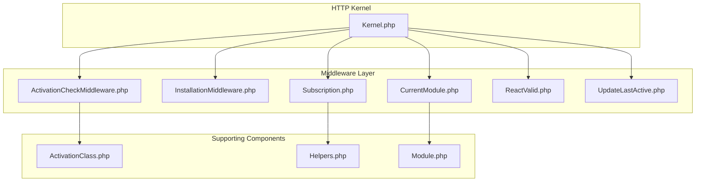
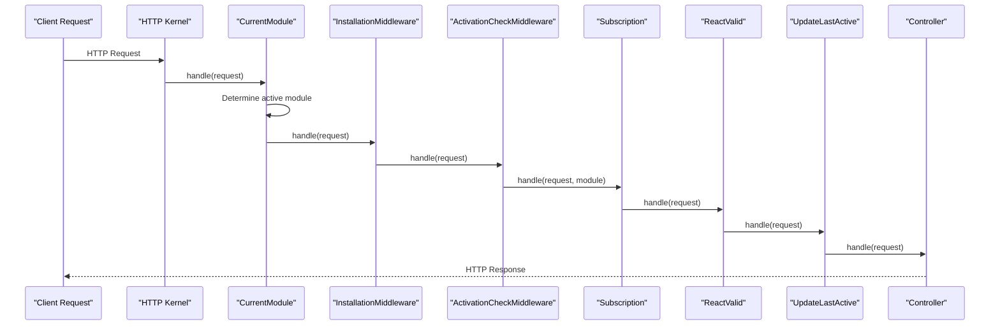
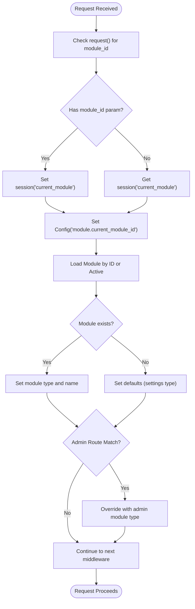
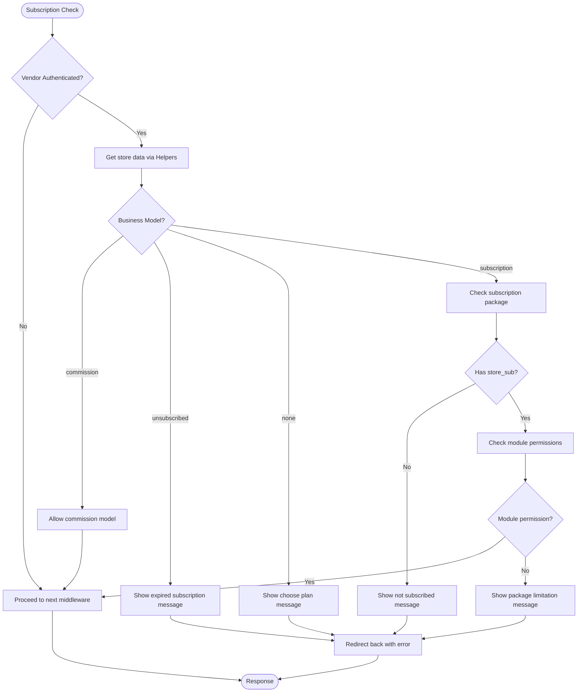
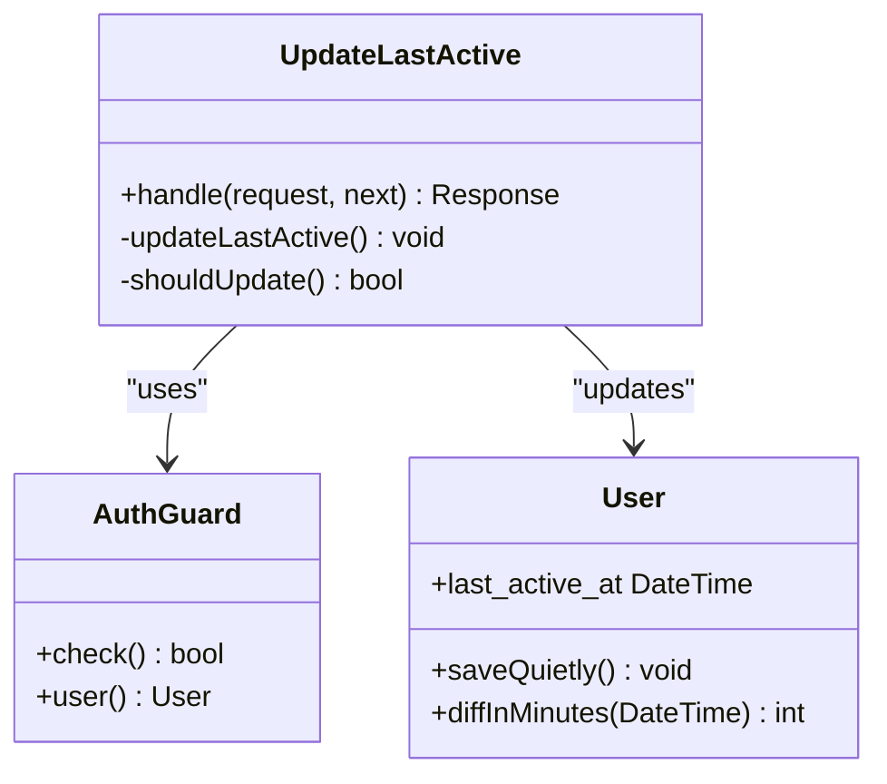
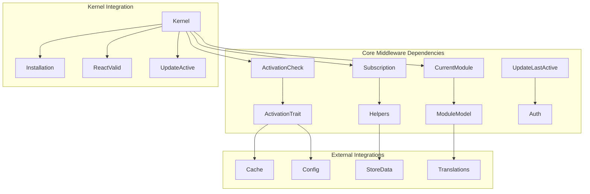

# Business Logic Middleware

<cite>
**Referenced Files in This Document**
- [CurrentModule.php](file://app/Http/Middleware/CurrentModule.php)
- [InstallationMiddleware.php](file://app/Http/Middleware/InstallationMiddleware.php)
- [ActivationCheckMiddleware.php](file://app/Http/Middleware/ActivationCheckMiddleware.php)
- [Subscription.php](file://app/Http/Middleware/Subscription.php)
- [ReactValid.php](file://app/Http/Middleware/ReactValid.php)
- [UpdateLastActive.php](file://app/Http/Middleware/UpdateLastActive.php)
- [ActivationClass.php](file://app/Traits/ActivationClass.php)
- [Kernel.php](file://app/Http/Kernel.php)
- [Helpers.php](file://app/CentralLogics/helpers.php)
- [Module.php](file://app/Models/Module.php)
</cite>

## Table of Contents
1. [Introduction](#introduction)
2. [Project Structure](#project-structure)
3. [Core Components](#core-components)
4. [Architecture Overview](#architecture-overview)
5. [Detailed Component Analysis](#detailed-component-analysis)
6. [Dependency Analysis](#dependency-analysis)
7. [Performance Considerations](#performance-considerations)
8. [Troubleshooting Guide](#troubleshooting-guide)
9. [Conclusion](#conclusion)

## Introduction
This document provides comprehensive coverage of business logic middleware components that implement application state management and cross-cutting concerns. It focuses on five key middleware categories:

- CurrentModule middleware for determining active business modules and routing decisions
- InstallationMiddleware for system setup validation
- ActivationCheckMiddleware for license verification
- Subscription middleware for business plan validation
- ReactValid middleware for frontend integration checks
- UpdateLastActive middleware for user activity tracking and session management

These middleware components integrate with Laravel's HTTP kernel to enforce business rules, manage application state, and ensure proper licensing and subscription compliance.

## Project Structure
The middleware components are organized under the application's HTTP middleware namespace and integrated into the global HTTP kernel. Each middleware handles specific business logic concerns and collaborates with models, traits, and helper utilities.

**Diagram sources**
- [Kernel.php:1-88](file://app/Http/Kernel.php#L1-L88)
- [CurrentModule.php:1-61](file://app/Http/Middleware/CurrentModule.php#L1-L61)
- [InstallationMiddleware.php:1-21](file://app/Http/Middleware/InstallationMiddleware.php#L1-L21)
- [ActivationCheckMiddleware.php:1-27](file://app/Http/Middleware/ActivationCheckMiddleware.php#L1-L27)
- [Subscription.php:1-66](file://app/Http/Middleware/Subscription.php#L1-L66)
- [ReactValid.php:1-36](file://app/Http/Middleware/ReactValid.php#L1-L36)
- [UpdateLastActive.php:1-38](file://app/Http/Middleware/UpdateLastActive.php#L1-L38)
- [ActivationClass.php:1-79](file://app/Traits/ActivationClass.php#L1-L79)
- [Helpers.php](file://app/CentralLogics/helpers.php)
- [Module.php](file://app/Models/Module.php)

**Section sources**
- [Kernel.php:1-88](file://app/Http/Kernel.php#L1-L88)

## Core Components
This section examines each middleware component's implementation, responsibilities, and integration patterns.

### CurrentModule Middleware
Determines and manages the active business module for routing and feature access decisions. It reads module identifiers from requests or sessions, validates against the Module model, and sets configuration values for downstream components.

Key responsibilities:
- Extract module_id from request parameters or session
- Validate module existence and active status
- Set configuration values for current module type and name
- Apply special routing rules for administrative areas
- Support multi-language module translations

Integration points:
- Module model with translation support
- Configuration system for module metadata
- Request routing for administrative sections

**Section sources**
- [CurrentModule.php:11-61](file://app/Http/Middleware/CurrentModule.php#L11-L61)
- [Module.php](file://app/Models/Module.php)

### InstallationMiddleware
Provides system setup validation capabilities. Currently acts as a pass-through but is designed to enforce installation prerequisites and system readiness checks.

Responsibilities:
- Validate system installation status
- Enforce setup requirements
- Support future expansion for health checks

**Section sources**
- [InstallationMiddleware.php:7-21](file://app/Http/Middleware/InstallationMiddleware.php#L7-L21)

### ActivationCheckMiddleware
Implements license verification and activation validation using the ActivationClass trait. Provides extensible framework for software activation and domain validation.

Key features:
- License verification integration
- Domain validation support
- Multi-application activation management
- Cache-based activation state

**Section sources**
- [ActivationCheckMiddleware.php:11-27](file://app/Http/Middleware/ActivationCheckMiddleware.php#L11-L27)
- [ActivationClass.php:8-79](file://app/Traits/ActivationClass.php#L8-L79)

### Subscription Middleware
Enforces business plan validation and feature access control for vendor stores. Manages subscription-based permissions and business model compliance.

Business logic:
- Supports multiple business models (commission, unsubscribed, none, subscription)
- Validates subscription package permissions per module
- Provides user feedback via toast notifications
- Handles ongoing order processing for expired subscriptions

**Section sources**
- [Subscription.php:11-66](file://app/Http/Middleware/Subscription.php#L11-L66)
- [Helpers.php](file://app/CentralLogics/helpers.php)

### ReactValid Middleware
Validates frontend integration for React-based applications. Provides domain validation and origin checking for cross-origin requests.

Current implementation:
- Includes commented domain validation logic
- Maintains request flow for development environments
- Designed for production React application integration

**Section sources**
- [ReactValid.php:9-36](file://app/Http/Middleware/ReactValid.php#L9-L36)

### UpdateLastActive Middleware
Tracks user activity for "last seen" functionality and session management. Implements rate limiting to prevent excessive database writes.

Features:
- API guard authentication support
- Activity timestamp updates with 1-minute threshold
- Non-invasive database updates using saveQuietly
- Performance optimization through selective updates

**Section sources**
- [UpdateLastActive.php:16-38](file://app/Http/Middleware/UpdateLastActive.php#L16-L38)

## Architecture Overview
The middleware architecture follows Laravel's request-response lifecycle with specialized business logic enforcement at strategic points.

**Diagram sources**
- [Kernel.php:54-87](file://app/Http/Kernel.php#L54-L87)
- [CurrentModule.php:20-59](file://app/Http/Middleware/CurrentModule.php#L20-L59)
- [InstallationMiddleware.php:16-19](file://app/Http/Middleware/InstallationMiddleware.php#L16-L19)
- [ActivationCheckMiddleware.php:22-25](file://app/Http/Middleware/ActivationCheckMiddleware.php#L22-L25)
- [Subscription.php:18-64](file://app/Http/Middleware/Subscription.php#L18-L64)
- [ReactValid.php:18-33](file://app/Http/Middleware/ReactValid.php#L18-L33)
- [UpdateLastActive.php:23-35](file://app/Http/Middleware/UpdateLastActive.php#L23-L35)

## Detailed Component Analysis

### CurrentModule Component Analysis
The CurrentModule middleware implements a sophisticated module resolution system that determines the active business module for request processing.

**Diagram sources**
- [CurrentModule.php:20-59](file://app/Http/Middleware/CurrentModule.php#L20-L59)

**Section sources**
- [CurrentModule.php:11-61](file://app/Http/Middleware/CurrentModule.php#L11-L61)

### Subscription Validation Flow
The Subscription middleware implements complex business logic for subscription-based access control.

**Diagram sources**
- [Subscription.php:18-64](file://app/Http/Middleware/Subscription.php#L18-L64)

**Section sources**
- [Subscription.php:11-66](file://app/Http/Middleware/Subscription.php#L11-L66)

### UpdateLastActive Implementation Pattern
The UpdateLastActive middleware demonstrates efficient user activity tracking with performance optimization.

**Diagram sources**
- [UpdateLastActive.php:16-38](file://app/Http/Middleware/UpdateLastActive.php#L16-L38)

**Section sources**
- [UpdateLastActive.php:10-38](file://app/Http/Middleware/UpdateLastActive.php#L10-L38)

## Dependency Analysis
The middleware components exhibit clear separation of concerns with well-defined dependencies and integration points.

**Diagram sources**
- [Kernel.php:54-87](file://app/Http/Kernel.php#L54-L87)
- [CurrentModule.php:9,31](file://app/Http/Middleware/CurrentModule.php#L9,L31)
- [Subscription.php:8,21](file://app/Http/Middleware/Subscription.php#L8,L21)
- [ActivationCheckMiddleware.php:5,13](file://app/Http/Middleware/ActivationCheckMiddleware.php#L5,L13)
- [UpdateLastActive.php:7,25](file://app/Http/Middleware/UpdateLastActive.php#L7,L25)

**Section sources**
- [Kernel.php:54-87](file://app/Http/Kernel.php#L54-L87)

## Performance Considerations
Each middleware component incorporates performance optimizations and best practices:

- **UpdateLastActive**: Implements 1-minute throttling to prevent database spam
- **CurrentModule**: Uses lazy loading with translation eager loading
- **ActivationCheck**: Leverages caching mechanisms for activation state
- **Subscription**: Performs minimal database queries with helper utilities

## Troubleshooting Guide
Common issues and resolutions for middleware components:

### CurrentModule Issues
- **Module not found**: Verify module records and active status in database
- **Translation problems**: Check module translation entries and locale settings
- **Session conflicts**: Clear browser session data for module switching

### Subscription Validation Problems
- **Expired subscription handling**: Review store business model configurations
- **Permission denied errors**: Verify subscription package feature flags
- **Toast notification issues**: Check Toastr configuration and JavaScript integration

### Activation and Installation
- **License validation failures**: Verify system-addons.php configuration
- **Domain mismatch errors**: Confirm domain registration and DNS settings
- **Cache-related issues**: Clear application cache after configuration changes

**Section sources**
- [ActivationClass.php:64-77](file://app/Traits/ActivationClass.php#L64-L77)

## Conclusion
The business logic middleware components provide a robust foundation for application state management and cross-cutting concerns. Each middleware serves a specific business purpose while maintaining loose coupling and clear integration points. The CurrentModule middleware establishes the foundation for module-aware routing, while ActivationCheck and Installation middleware ensure proper system licensing and setup validation. The Subscription middleware enforces business model compliance, and ReactValid middleware supports frontend integration. Finally, UpdateLastActive middleware provides essential user activity tracking with performance optimization.

These components demonstrate clean separation of concerns, extensible design patterns, and integration with Laravel's ecosystem. They serve as excellent examples for implementing custom business logic middleware with proper error handling, performance considerations, and maintainable code structure.