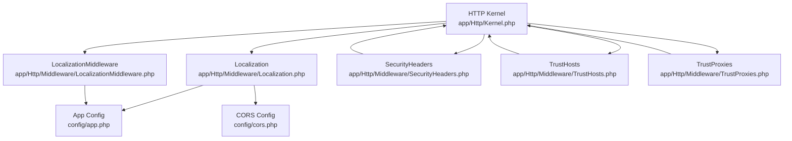
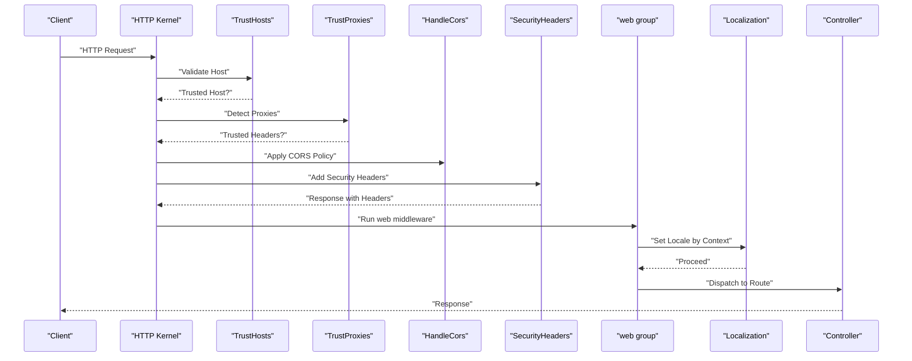
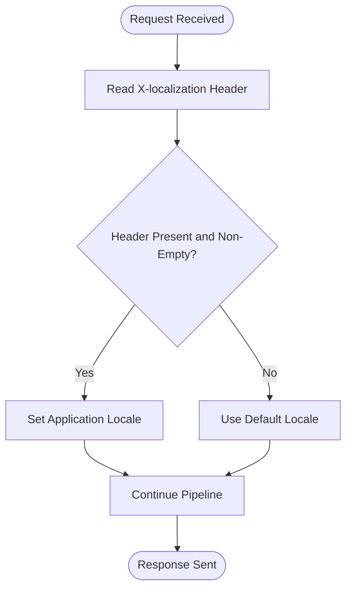
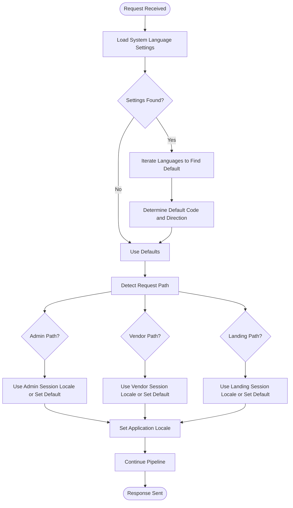
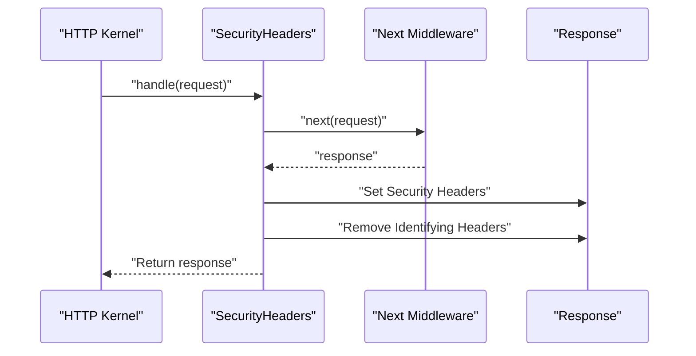
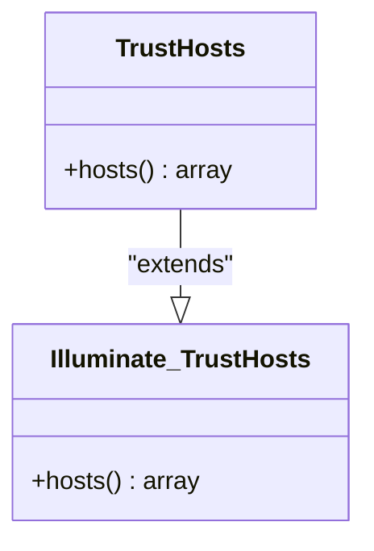
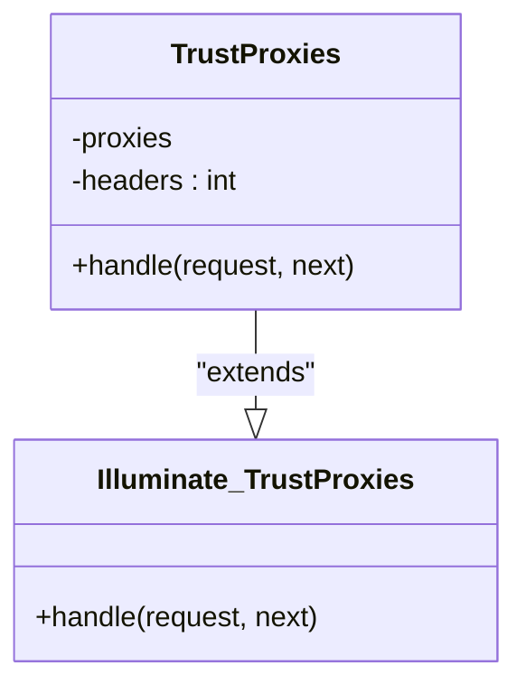
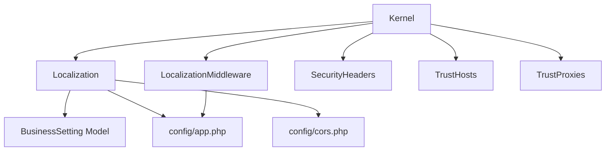

# Localization & Security Middleware

<cite>
**Referenced Files in This Document**
- [app/Http/Middleware/Localization.php](file://app/Http/Middleware/Localization.php)
- [app/Http/Middleware/LocalizationMiddleware.php](file://app/Http/Middleware/LocalizationMiddleware.php)
- [app/Http/Middleware/SecurityHeaders.php](file://app/Http/Middleware/SecurityHeaders.php)
- [app/Http/Middleware/TrustHosts.php](file://app/Http/Middleware/TrustHosts.php)
- [app/Http/Middleware/TrustProxies.php](file://app/Http/Middleware/TrustProxies.php)
- [app/Http/Kernel.php](file://app/Http/Kernel.php)
- [config/app.php](file://config/app.php)
- [config/cors.php](file://config/cors.php)
- [app/Models/BusinessSetting.php](file://app/Models/BusinessSetting.php)
</cite>

## Table of Contents
1. [Introduction](#introduction)
2. [Project Structure](#project-structure)
3. [Core Components](#core-components)
4. [Architecture Overview](#architecture-overview)
5. [Detailed Component Analysis](#detailed-component-analysis)
6. [Dependency Analysis](#dependency-analysis)
7. [Performance Considerations](#performance-considerations)
8. [Troubleshooting Guide](#troubleshooting-guide)
9. [Conclusion](#conclusion)

## Introduction
This document explains the middleware components responsible for application localization and security. It covers:
- Localization middleware that detects and applies language preferences for different application sections
- SecurityHeaders middleware that sets HTTP security headers
- TrustHosts and TrustProxies middleware for secure host validation and proxy handling
It also documents configuration options, best practices, and how these components contribute to the overall application security posture.

## Project Structure
The middleware implementations are located under the application’s HTTP middleware namespace and are registered in the HTTP kernel. Configuration for application-wide locale defaults and CORS is provided via dedicated configuration files.

**Diagram sources**
- [app/Http/Kernel.php:18-52](file://app/Http/Kernel.php#L18-L52)
- [app/Http/Middleware/Localization.php:10-62](file://app/Http/Middleware/Localization.php#L10-L62)
- [app/Http/Middleware/LocalizationMiddleware.php:7-26](file://app/Http/Middleware/LocalizationMiddleware.php#L7-L26)
- [app/Http/Middleware/SecurityHeaders.php:8-24](file://app/Http/Middleware/SecurityHeaders.php#L8-L24)
- [app/Http/Middleware/TrustHosts.php:7-20](file://app/Http/Middleware/TrustHosts.php#L7-L20)
- [app/Http/Middleware/TrustProxies.php:8-23](file://app/Http/Middleware/TrustProxies.php#L8-L23)
- [config/app.php:84-98](file://config/app.php#L84-L98)
- [config/cors.php:18-33](file://config/cors.php#L18-L33)

**Section sources**
- [app/Http/Kernel.php:18-52](file://app/Http/Kernel.php#L18-L52)
- [config/app.php:84-98](file://config/app.php#L84-L98)
- [config/cors.php:18-33](file://config/cors.php#L18-L33)

## Core Components
This section summarizes the responsibilities and behavior of each middleware component.

- Localization middleware
  - Purpose: Sets the application locale based on a request header for API-like scenarios.
  - Behavior: Reads the X-localization header; falls back to a default locale if missing or empty.
  - Registration: Available as a route middleware alias.

- Localization middleware (version 2)
  - Purpose: Applies locale and direction based on system language settings and request context (admin, vendor-panel, landing).
  - Behavior: Reads system language settings from business settings, sets locale per request context, and persists direction in session.
  - Registration: Included in the web middleware group.

- SecurityHeaders middleware
  - Purpose: Adds security-related HTTP headers to all responses and removes server-identifying headers.
  - Behavior: Sets frame options, content type options, XSS protection, referrer policy, permissions policy, and removes X-Powered-By and Server.

- TrustHosts middleware
  - Purpose: Defines which hostnames are trusted for request handling.
  - Behavior: Returns application subdomain patterns for trust.

- TrustProxies middleware
  - Purpose: Marks specific proxy headers as trusted to allow correct client IP and protocol detection behind load balancers.
  - Behavior: Uses a predefined bitmask of headers to detect forwarded host, port, proto, and AWS ELB signals.

**Section sources**
- [app/Http/Middleware/LocalizationMiddleware.php:7-26](file://app/Http/Middleware/LocalizationMiddleware.php#L7-L26)
- [app/Http/Middleware/Localization.php:10-62](file://app/Http/Middleware/Localization.php#L10-L62)
- [app/Http/Middleware/SecurityHeaders.php:8-24](file://app/Http/Middleware/SecurityHeaders.php#L8-L24)
- [app/Http/Middleware/TrustHosts.php:7-20](file://app/Http/Middleware/TrustHosts.php#L7-L20)
- [app/Http/Middleware/TrustProxies.php:8-23](file://app/Http/Middleware/TrustProxies.php#L8-L23)

## Architecture Overview
The middleware stack integrates localization and security controls early in the request lifecycle. Global middleware ensures CORS, security headers, and trusted hosts/proxies are applied to all requests. The web group applies contextual localization, while the route middleware alias allows explicit localization for specific routes.

**Diagram sources**
- [app/Http/Kernel.php:18-52](file://app/Http/Kernel.php#L18-L52)
- [app/Http/Middleware/TrustHosts.php:14-19](file://app/Http/Middleware/TrustHosts.php#L14-L19)
- [app/Http/Middleware/TrustProxies.php:22](file://app/Http/Middleware/TrustProxies.php#L22)
- [app/Http/Middleware/SecurityHeaders.php:10-23](file://app/Http/Middleware/SecurityHeaders.php#L10-L23)
- [app/Http/Middleware/Localization.php:19-61](file://app/Http/Middleware/Localization.php#L19-L61)

## Detailed Component Analysis

### Localization Middleware
Purpose:
- Provides a centralized mechanism to set the application locale based on a request header for API-like consumers.

Behavior:
- Reads the X-localization header.
- Validates that the header value is non-empty; otherwise, falls back to a default locale.
- Calls the localization service to apply the locale to the request lifecycle.

Configuration and registration:
- Registered as a route middleware alias for targeted use.
- Does not depend on application-wide locale defaults but can be combined with other localization mechanisms.

**Diagram sources**
- [app/Http/Middleware/LocalizationMiddleware.php:16-25](file://app/Http/Middleware/LocalizationMiddleware.php#L16-L25)

**Section sources**
- [app/Http/Middleware/LocalizationMiddleware.php:7-26](file://app/Http/Middleware/LocalizationMiddleware.php#L7-L26)
- [app/Http/Kernel.php:78](file://app/Http/Kernel.php#L78)

### Localization (Context-Aware)
Purpose:
- Applies locale and direction based on system language settings and request context (admin, vendor-panel, landing).

Behavior:
- Retrieves system language settings from business settings.
- Determines default language and direction from stored configuration.
- Sets locale differently depending on the request path (admin, vendor-panel, or landing).
- Persists direction in session for later use.

**Diagram sources**
- [app/Http/Middleware/Localization.php:19-61](file://app/Http/Middleware/Localization.php#L19-L61)
- [app/Models/BusinessSetting.php:14-17](file://app/Models/BusinessSetting.php#L14-L17)

**Section sources**
- [app/Http/Middleware/Localization.php:10-62](file://app/Http/Middleware/Localization.php#L10-L62)
- [app/Http/Kernel.php:44](file://app/Http/Kernel.php#L44)
- [config/app.php:84-98](file://config/app.php#L84-L98)

### SecurityHeaders Middleware
Purpose:
- Hardens HTTP responses by setting security headers and removing potentially identifying headers.

Behavior:
- Sets X-Frame-Options to SAMEORIGIN.
- Sets X-Content-Type-Options to nosniff.
- Sets X-XSS-Protection to 1; mode=block.
- Sets Referrer-Policy to strict-origin-when-cross-origin.
- Sets Permissions-Policy to limit camera, microphone, and geolocation.
- Removes X-Powered-By and Server headers.

**Diagram sources**
- [app/Http/Middleware/SecurityHeaders.php:10-23](file://app/Http/Middleware/SecurityHeaders.php#L10-L23)

**Section sources**
- [app/Http/Middleware/SecurityHeaders.php:8-24](file://app/Http/Middleware/SecurityHeaders.php#L8-L24)

### TrustHosts Middleware
Purpose:
- Ensures that only trusted hostnames can be considered authoritative for the application.

Behavior:
- Extends the framework’s TrustHosts middleware.
- Returns the application’s subdomain pattern for trust.

**Diagram sources**
- [app/Http/Middleware/TrustHosts.php:7-20](file://app/Http/Middleware/TrustHosts.php#L7-L20)

**Section sources**
- [app/Http/Middleware/TrustHosts.php:7-20](file://app/Http/Middleware/TrustHosts.php#L7-L20)

### TrustProxies Middleware
Purpose:
- Allows the application to trust specific proxy-provided headers for accurate client IP and protocol detection.

Behavior:
- Extends the framework’s TrustProxies middleware.
- Uses a bitmask of headers to detect forwarded host, port, proto, and AWS ELB signals.

**Diagram sources**
- [app/Http/Middleware/TrustProxies.php:8-23](file://app/Http/Middleware/TrustProxies.php#L8-L23)

**Section sources**
- [app/Http/Middleware/TrustProxies.php:8-23](file://app/Http/Middleware/TrustProxies.php#L8-L23)

## Dependency Analysis
- Localization depends on:
  - BusinessSetting model for retrieving system language configuration.
  - Application locale configuration for defaults.
- SecurityHeaders depends on:
  - The response pipeline to attach headers.
- TrustHosts and TrustProxies integrate with the framework’s built-in middleware.
- Kernel registers these middlewares globally and in groups, ensuring consistent behavior across requests.

**Diagram sources**
- [app/Http/Kernel.php:18-52](file://app/Http/Kernel.php#L18-L52)
- [app/Http/Middleware/Localization.php:24-32](file://app/Http/Middleware/Localization.php#L24-L32)
- [app/Models/BusinessSetting.php:14-17](file://app/Models/BusinessSetting.php#L14-L17)
- [config/app.php:84-98](file://config/app.php#L84-L98)
- [config/cors.php:18-33](file://config/cors.php#L18-L33)

**Section sources**
- [app/Http/Kernel.php:18-52](file://app/Http/Kernel.php#L18-L52)
- [app/Http/Middleware/Localization.php:24-32](file://app/Http/Middleware/Localization.php#L24-L32)
- [app/Models/BusinessSetting.php:14-17](file://app/Models/BusinessSetting.php#L14-L17)

## Performance Considerations
- Localization middleware reads business settings on each request. Consider caching the system language configuration to reduce database queries.
- Session writes for direction persistence occur per request; ensure session storage is performant and monitored.
- SecurityHeaders adds minimal overhead by modifying response headers; keep it enabled globally for consistent protection.
- TrustProxies and TrustHosts have negligible runtime cost; ensure the trusted proxy list matches your deployment infrastructure.

## Troubleshooting Guide
Common issues and resolutions:
- Localization not applying:
  - Verify the X-localization header is present and non-empty for LocalizationMiddleware usage.
  - Confirm the web group includes Localization for web routes.
  - Check that BusinessSetting contains valid language configuration for Localization.
- Unexpected locale in admin/vendor/landing:
  - Ensure request paths match expected patterns; session keys differ by context.
  - Confirm direction is persisted in session for subsequent requests.
- Security headers missing:
  - Ensure SecurityHeaders is registered in the global middleware stack.
  - Verify no downstream middleware strips headers.
- CORS failures:
  - Confirm allowed origins and headers in the CORS configuration align with client requests.
  - Ensure credentials support is configured appropriately.
- Proxy IP/protocol issues:
  - Confirm TrustProxies headers bitmask matches your load balancer or proxy configuration.
  - Validate that only trusted proxies are included to prevent header spoofing.

**Section sources**
- [app/Http/Middleware/LocalizationMiddleware.php:18-22](file://app/Http/Middleware/LocalizationMiddleware.php#L18-L22)
- [app/Http/Middleware/Localization.php:36-59](file://app/Http/Middleware/Localization.php#L36-L59)
- [app/Http/Middleware/SecurityHeaders.php:14-20](file://app/Http/Middleware/SecurityHeaders.php#L14-L20)
- [config/cors.php:22-27](file://config/cors.php#L22-L27)
- [app/Http/Middleware/TrustProxies.php:22](file://app/Http/Middleware/TrustProxies.php#L22)

## Conclusion
The localization and security middleware components provide robust, layered capabilities:
- Localization supports both explicit header-driven selection and context-aware defaults derived from business settings.
- SecurityHeaders, TrustHosts, and TrustProxies collectively strengthen the application’s resilience against common web vulnerabilities and misconfigured environments.
Integrating these components with appropriate configuration and monitoring ensures a secure and internationally aware application.