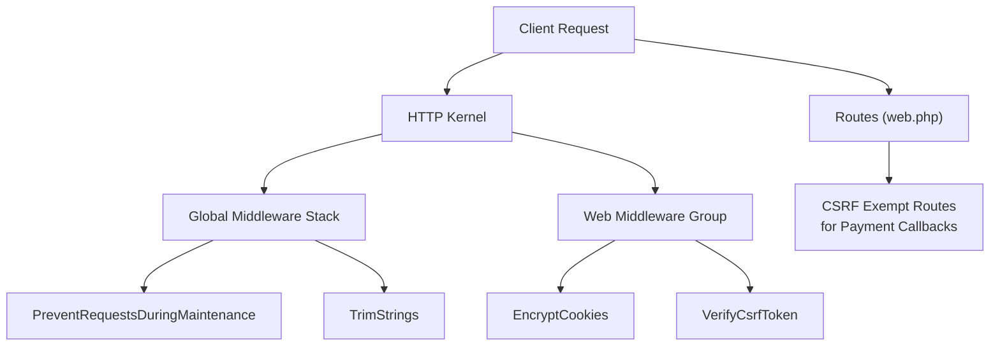
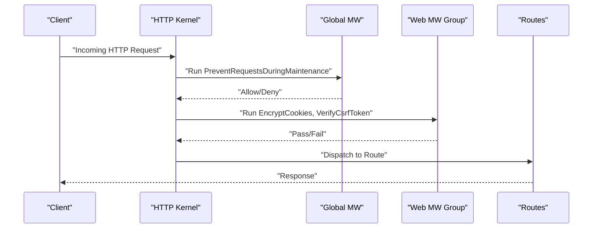
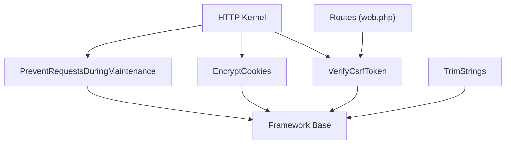

# Maintenance & CSRF Protection Middleware

<cite>
**Referenced Files in This Document**
- [PreventRequestsDuringMaintenance.php](file://app/Http/Middleware/PreventRequestsDuringMaintenance.php)
- [VerifyCsrfToken.php](file://app/Http/Middleware/VerifyCsrfToken.php)
- [EncryptCookies.php](file://app/Http/Middleware/EncryptCookies.php)
- [TrimStrings.php](file://app/Http/Middleware/TrimStrings.php)
- [Kernel.php](file://app/Http/Kernel.php)
- [app.php](file://config/app.php)
- [web.php](file://routes/web.php)
</cite>

## Table of Contents
1. [Introduction](#introduction)
2. [Project Structure](#project-structure)
3. [Core Components](#core-components)
4. [Architecture Overview](#architecture-overview)
5. [Detailed Component Analysis](#detailed-component-analysis)
6. [Dependency Analysis](#dependency-analysis)
7. [Performance Considerations](#performance-considerations)
8. [Troubleshooting Guide](#troubleshooting-guide)
9. [Conclusion](#conclusion)

## Introduction
This document explains three critical middleware components that ensure system stability and security:
- PreventRequestsDuringMaintenance: Graceful degradation during maintenance windows
- VerifyCsrfToken: Protection against cross-site request forgery attacks
- EncryptCookies: Secure handling of cookies
- TrimStrings: Input sanitization for sensitive fields

It covers configuration, operational workflows, token generation/validation, and security best practices tailored to this application.

## Project Structure
These middleware are registered centrally in the HTTP kernel and applied to appropriate middleware groups and routes:
- Global middleware stack includes maintenance prevention and input trimming
- Web middleware group includes CSRF verification and cookie encryption
- Routes for third-party payment providers exclude CSRF verification per their callback requirements

**Diagram sources**
- [Kernel.php:18-52](file://app/Http/Kernel.php#L18-L52)
- [web.php:84-197](file://routes/web.php#L84-L197)

**Section sources**
- [Kernel.php:18-52](file://app/Http/Kernel.php#L18-L52)
- [web.php:84-197](file://routes/web.php#L84-L197)

## Core Components
- PreventRequestsDuringMaintenance: Extends the framework’s maintenance guard to allow controlled access during scheduled downtime.
- VerifyCsrfToken: Extends the framework’s CSRF guard with application-specific exemptions for payment callbacks and external integrations.
- EncryptCookies: Extends the framework’s cookie encryption to selectively exempt cookies when necessary.
- TrimStrings: Extends the framework’s string trimming to avoid corrupting sensitive password fields.

**Section sources**
- [PreventRequestsDuringMaintenance.php:7-17](file://app/Http/Middleware/PreventRequestsDuringMaintenance.php#L7-L17)
- [VerifyCsrfToken.php:7-18](file://app/Http/Middleware/VerifyCsrfToken.php#L7-L18)
- [EncryptCookies.php:7-17](file://app/Http/Middleware/EncryptCookies.php#L7-L17)
- [TrimStrings.php:7-19](file://app/Http/Middleware/TrimStrings.php#L7-L19)

## Architecture Overview
The middleware pipeline ensures requests are validated and sanitized before reaching application logic. During maintenance, only explicitly permitted URIs remain accessible. CSRF protection is enforced globally for web requests except where third-party providers mandate external callbacks.

**Diagram sources**
- [Kernel.php:18-52](file://app/Http/Kernel.php#L18-L52)
- [web.php:84-197](file://routes/web.php#L84-L197)

## Detailed Component Analysis

### PreventRequestsDuringMaintenance
Purpose:
- Block incoming requests when the system is in maintenance mode, except for explicitly allowed URIs.

Configuration:
- Extend the framework’s middleware and define the $except array with whitelisted paths.

Operational behavior:
- When maintenance mode is enabled, all requests are rejected unless they match entries in $except.
- The application’s business logic toggles maintenance mode via admin settings; the middleware enforces it at the edge.

Maintenance mode workflow:
- Admin enables maintenance mode in the business settings panel.
- Requests to non-whitelisted URIs receive a maintenance response.
- Whitelisted URIs (e.g., admin panel, store panel) remain functional.

Best practices:
- Keep $except minimal and purpose-driven.
- Use environment-specific configuration to manage exceptions across deployments.
- Log blocked requests for monitoring and auditing.

**Section sources**
- [PreventRequestsDuringMaintenance.php:7-17](file://app/Http/Middleware/PreventRequestsDuringMaintenance.php#L7-L17)
- [Kernel.php:22](file://app/Http/Kernel.php#L22)

### VerifyCsrfToken
Purpose:
- Protect web forms and state-changing endpoints from CSRF attacks by validating a synchronized token.

Configuration:
- Extend the framework’s middleware and define the $except array with URIs that must bypass CSRF checks.

CSRF token generation and validation:
- Token is embedded in forms and AJAX requests.
- On submission, the server validates the token against the user’s session.
- Exemptions are granted for third-party payment callbacks that originate externally.

Payment callback workflow:
- Third-party providers post results to designated endpoints.
- These endpoints are marked as CSRF-exempt in routes to accept external posts without tokens.

Best practices:
- Never exempt entire controllers or broad path patterns; target only necessary endpoints.
- Rotate sessions and tokens regularly; ensure HTTPS to protect tokens in transit.
- Combine with rate limiting and input validation for defense-in-depth.

**Section sources**
- [VerifyCsrfToken.php:7-18](file://app/Http/Middleware/VerifyCsrfToken.php#L7-L18)
- [web.php:84-197](file://routes/web.php#L84-L197)
- [Kernel.php:42](file://app/Http/Kernel.php#L42)

### EncryptCookies
Purpose:
- Ensure cookies are cryptographically protected to prevent tampering and information disclosure.

Configuration:
- Extend the framework’s middleware and define the $except array with cookie names that must remain unencrypted.

Usage scenarios:
- Some cookies (e.g., session identifiers) must be readable by client-side scripts and therefore intentionally left unencrypted.
- Other cookies (e.g., auth tokens) are encrypted to mitigate XSS risks.

Best practices:
- Minimize the number of unencrypted cookies.
- Prefer encrypted cookies for any sensitive data.
- Align with SameSite and Secure flags for additional protections.

**Section sources**
- [EncryptCookies.php:7-17](file://app/Http/Middleware/EncryptCookies.php#L7-L17)
- [Kernel.php:37](file://app/Http/Kernel.php#L37)

### TrimStrings
Purpose:
- Remove leading and trailing whitespace from string input fields to reduce data quality issues and potential injection vectors.

Configuration:
- Extend the framework’s middleware and define the $except array with sensitive attributes that must preserve whitespace.

Sensitive field handling:
- Passwords and related confirmation fields are excluded from trimming to avoid altering user-entered values.

Best practices:
- Apply trimming broadly for non-sensitive fields.
- Preserve original whitespace for cryptographic inputs and exact matches.
- Combine with explicit validation rules to enforce length and format constraints.

**Section sources**
- [TrimStrings.php:7-19](file://app/Http/Middleware/TrimStrings.php#L7-L19)
- [Kernel.php:24](file://app/Http/Kernel.php#L24)

## Dependency Analysis
The middleware depend on the framework’s base implementations and are orchestrated by the HTTP kernel. Routes selectively disable CSRF verification for specific third-party callbacks.

**Diagram sources**
- [Kernel.php:18-52](file://app/Http/Kernel.php#L18-L52)
- [web.php:84-197](file://routes/web.php#L84-L197)

**Section sources**
- [Kernel.php:18-52](file://app/Http/Kernel.php#L18-L52)
- [web.php:84-197](file://routes/web.php#L84-L197)

## Performance Considerations
- Middleware execution order matters: put fast checks early (e.g., maintenance mode) to short-circuit slow paths.
- Avoid excessive exemptions in CSRF configuration; each exemption adds trust assumptions without equivalent protections.
- Limit unencrypted cookies to essential cases to reduce CPU overhead from encryption/decryption.

## Troubleshooting Guide
Common issues and resolutions:
- Unexpected maintenance mode behavior:
  - Verify the maintenance mode setting in business settings and ensure only intended URIs are whitelisted.
  - Confirm the global PreventRequestsDuringMaintenance middleware is active in the kernel.
- CSRF failures on legitimate submissions:
  - Ensure forms include a valid CSRF token and that AJAX requests pass the token header/body.
  - Confirm the endpoint is not inadvertently marked CSRF-exempt.
- Cookie visibility or tampering:
  - Review EncryptCookies exemptions; only whitelist cookies that require client-side access.
  - Confirm APP_KEY is set and consistent across environments.
- Trimming affecting passwords:
  - Check TrimStrings exclusions for password fields.
  - Validate that downstream validation logic does not rely on preserved whitespace for passwords.

**Section sources**
- [PreventRequestsDuringMaintenance.php:7-17](file://app/Http/Middleware/PreventRequestsDuringMaintenance.php#L7-L17)
- [VerifyCsrfToken.php:7-18](file://app/Http/Middleware/VerifyCsrfToken.php#L7-L18)
- [EncryptCookies.php:7-17](file://app/Http/Middleware/EncryptCookies.php#L7-L17)
- [TrimStrings.php:7-19](file://app/Http/Middleware/TrimStrings.php#L7-L19)
- [Kernel.php:18-52](file://app/Http/Kernel.php#L18-L52)
- [web.php:84-197](file://routes/web.php#L84-L197)

## Conclusion
These middleware layers provide robust operational control and security:
- PreventRequestsDuringMaintenance ensures planned downtime is communicated gracefully.
- VerifyCsrfToken defends against CSRF with targeted exemptions for external integrations.
- EncryptCookies and TrimStrings harden cookies and input handling respectively.

Adopt the recommended configurations and best practices to maintain a secure, reliable system.