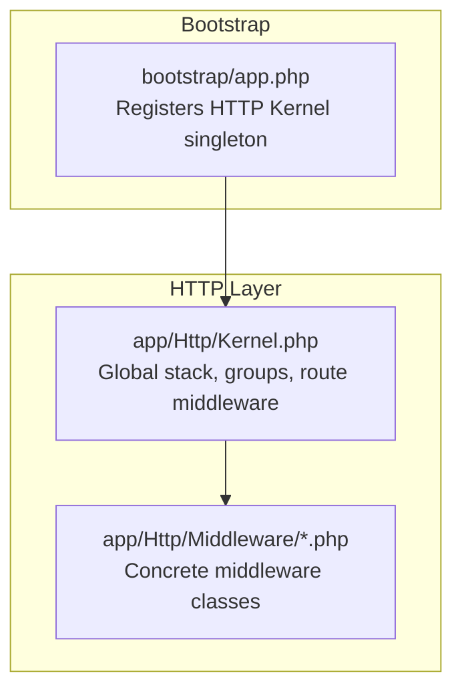
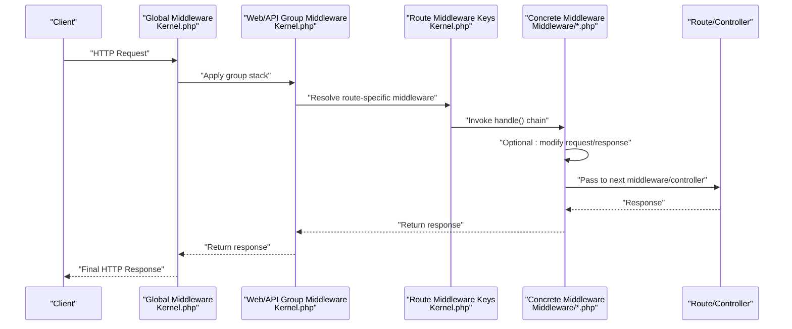
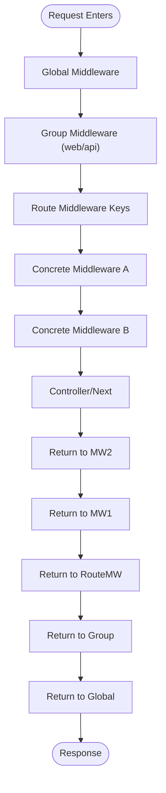
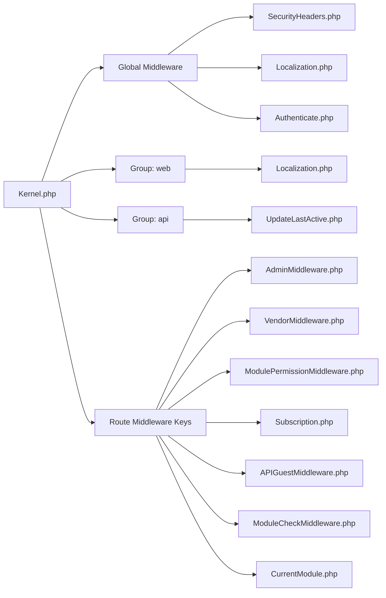

# Middleware Architecture

<cite>
**Referenced Files in This Document**
- [Kernel.php](file://app/Http/Kernel.php)
- [app.php](file://bootstrap/app.php)
- [Authenticate.php](file://app/Http/Middleware/Authenticate.php)
- [SecurityHeaders.php](file://app/Http/Middleware/SecurityHeaders.php)
- [Localization.php](file://app/Http/Middleware/Localization.php)
- [ModulePermissionMiddleware.php](file://app/Http/Middleware/ModulePermissionMiddleware.php)
- [AdminMiddleware.php](file://app/Http/Middleware/AdminMiddleware.php)
- [VendorMiddleware.php](file://app/Http/Middleware/VendorMiddleware.php)
- [APIGuestMiddleware.php](file://app/Http/Middleware/APIGuestMiddleware.php)
- [InstallationMiddleware.php](file://app/Http/Middleware/InstallationMiddleware.php)
- [ActivationCheckMiddleware.php](file://app/Http/Middleware/ActivationCheckMiddleware.php)
- [ModuleCheckMiddleware.php](file://app/Http/Middleware/ModuleCheckMiddleware.php)
- [CurrentModule.php](file://app/Http/Middleware/CurrentModule.php)
- [Subscription.php](file://app/Http/Middleware/Subscription.php)
</cite>

## Table of Contents
1. [Introduction](#introduction)
2. [Project Structure](#project-structure)
3. [Core Components](#core-components)
4. [Architecture Overview](#architecture-overview)
5. [Detailed Component Analysis](#detailed-component-analysis)
6. [Dependency Analysis](#dependency-analysis)
7. [Performance Considerations](#performance-considerations)
8. [Troubleshooting Guide](#troubleshooting-guide)
9. [Conclusion](#conclusion)

## Introduction
This document explains the middleware architecture and request processing pipeline of Waddy Back. It focuses on how middleware intercepts HTTP requests, enforces authentication and authorization, handles cross-cutting concerns such as localization and security headers, and participates in module-aware routing and business logic gating. It also documents the middleware registration process, execution order, chain construction, and practical examples of custom middleware implementations, parameter handling, and response modification.

## Project Structure
Waddy Back follows a standard Laravel structure with a dedicated middleware directory under the HTTP namespace. The central entry point for middleware configuration is the application kernel, which defines:
- Global middleware applied to every request
- Route middleware groups (web, api)
- Individual route middleware keys mapped to concrete classes

**Diagram sources**
- [app.php:29-32](file://bootstrap/app.php#L29-L32)
- [Kernel.php:18-86](file://app/Http/Kernel.php#L18-L86)

**Section sources**
- [app.php:14-42](file://bootstrap/app.php#L14-L42)
- [Kernel.php:9-87](file://app/Http/Kernel.php#L9-L87)

## Core Components
This section outlines the primary middleware categories and their roles in the request lifecycle.

- Global middleware stack
  - Host and proxy trust policies
  - Maintenance mode blocking
  - Request size validation
  - String trimming and null conversion
  - CORS handling
  - Security headers injection

- Route middleware groups
  - Web group: cookies, sessions, CSRF protection, bindings, localization
  - API group: parameter substitution, last active updates

- Route middleware keys
  - Authentication and guards
  - Authorization checks (admin/vendor/module)
  - Token validation for specific APIs
  - Installation and activation checks
  - Module selection and permission enforcement
  - Subscription gating per module

**Section sources**
- [Kernel.php:18-52](file://app/Http/Kernel.php#L18-L52)
- [Kernel.php:61-86](file://app/Http/Kernel.php#L61-L86)

## Architecture Overview
The middleware pipeline is constructed per request and executed in a defined order. The flow below illustrates how a typical request traverses the middleware stack and interacts with routing and controllers.

**Diagram sources**
- [Kernel.php:18-52](file://app/Http/Kernel.php#L18-L52)
- [Kernel.php:61-86](file://app/Http/Kernel.php#L61-L86)

## Detailed Component Analysis

### Global Middleware Stack
The global middleware runs on every request and establishes baseline behavior:
- Host and proxy trust
- Maintenance mode prevention
- Request size validation
- String trimming and empty-to-null conversion
- CORS handling
- Security headers injection

These middlewares ensure consistent request sanitization and security posture across the application.

**Section sources**
- [Kernel.php:18-28](file://app/Http/Kernel.php#L18-L28)

### Web Group Middleware
The web group applies cookie/session/CSRF protections and localization:
- Cookie encryption and queued cookies
- Session initialization
- CSRF verification
- Route parameter substitution
- Localization middleware

This ensures stateful web interactions are secure and localized.

**Section sources**
- [Kernel.php:35-46](file://app/Http/Kernel.php#L35-L46)

### API Group Middleware
The API group focuses on parameter substitution and activity tracking:
- Parameter substitution
- Last active update

This supports RESTful endpoints and operational insights.

**Section sources**
- [Kernel.php:47-52](file://app/Http/Kernel.php#L47-L52)

### Authentication and Authorization Middleware

#### Authenticate
Custom authentication redirection logic tailored to API, admin, and vendor contexts. It redirects unauthenticated users to appropriate routes depending on the request path.

**Section sources**
- [Authenticate.php:15-33](file://app/Http/Middleware/Authenticate.php#L15-L33)

#### AdminMiddleware
Enforces admin guard session validity, checks login remember tokens, and handles logout/expired sessions. Allows access only for authenticated and active admins.

**Section sources**
- [AdminMiddleware.php:20-45](file://app/Http/Middleware/AdminMiddleware.php#L20-L45)

#### VendorMiddleware
Validates vendor and vendor employee sessions, checks store status, and enforces login remember token consistency. Redirects or logs out on mismatch.

**Section sources**
- [VendorMiddleware.php:19-58](file://app/Http/Middleware/VendorMiddleware.php#L19-L58)

#### ModulePermissionMiddleware
Gatekeeper for module-based permissions. Checks current guard (admin/vendor_employee/vendor) against requested module and either proceeds or returns an access denied response.

**Section sources**
- [ModulePermissionMiddleware.php:18-32](file://app/Http/Middleware/ModulePermissionMiddleware.php#L18-L32)

#### Subscription
Enforces subscription-based access controls for vendor stores. Validates business model and package permissions for specific modules (reviews, pos, deliveryman, chat), providing user feedback via flash messages.

**Section sources**
- [Subscription.php:18-64](file://app/Http/Middleware/Subscription.php#L18-L64)

### Cross-Cutting Concerns

#### SecurityHeaders
Adds hardened security headers to all responses and removes server fingerprinting headers. Ensures defense-in-depth against common browser and server-side threats.

**Section sources**
- [SecurityHeaders.php:10-23](file://app/Http/Middleware/SecurityHeaders.php#L10-L23)

#### Localization
Determines locale and direction based on system language settings and request context (admin, vendor-panel, landing). Persists direction and locale in sessions and sets the application locale accordingly.

**Section sources**
- [Localization.php:19-61](file://app/Http/Middleware/Localization.php#L19-L61)

### Module-Aware Middleware

#### ModuleCheckMiddleware
Validates presence and existence of a module identifier header. Returns JSON error responses for missing or invalid module IDs. Sets current module data in configuration for downstream components.

**Section sources**
- [ModuleCheckMiddleware.php:17-49](file://app/Http/Middleware/ModuleCheckMiddleware.php#L17-L49)

#### CurrentModule
Resolves the current module from request parameters or session, falling back to active module if none provided. Adjusts module type for specific admin sub-areas and persists module metadata in configuration.

**Section sources**
- [CurrentModule.php:20-58](file://app/Http/Middleware/CurrentModule.php#L20-L58)

### API Access Control

#### APIGuestMiddleware
Allows authenticated API users by injecting user into the request and enabling guest-based access for anonymous sessions with guest identifiers. Returns unauthorized for missing credentials.

**Section sources**
- [APIGuestMiddleware.php:17-31](file://app/Http/Middleware/APIGuestMiddleware.php#L17-L31)

### Lifecycle and Environment Middleware

#### InstallationMiddleware
Placeholder middleware that currently forwards requests without intervention.

**Section sources**
- [InstallationMiddleware.php:16-19](file://app/Http/Middleware/InstallationMiddleware.php#L16-L19)

#### ActivationCheckMiddleware
Provides a hook for activation checks using an external trait. Currently forwards requests without enforcement.

**Section sources**
- [ActivationCheckMiddleware.php:22-25](file://app/Http/Middleware/ActivationCheckMiddleware.php#L22-L25)

### Middleware Registration and Execution Order

- Registration
  - Global middleware: defined in the kernel’s middleware property
  - Group middleware: defined in middlewareGroups
  - Route middleware: defined in routeMiddleware with keys mapped to classes

- Execution order
  - Global middleware runs first
  - Group middleware runs next (web or api)
  - Route-specific middleware runs after group middleware
  - Concrete middleware classes are invoked in the order declared for the route

- Chain construction
  - The router resolves the middleware chain per route based on group and route middleware keys
  - Each middleware receives the request and a closure to pass control to the next middleware

**Diagram sources**
- [Kernel.php:18-52](file://app/Http/Kernel.php#L18-L52)
- [Kernel.php:61-86](file://app/Http/Kernel.php#L61-L86)

**Section sources**
- [Kernel.php:18-86](file://app/Http/Kernel.php#L18-L86)

## Dependency Analysis
The middleware ecosystem depends on:
- Laravel’s HTTP kernel and routing resolution
- Guard systems (admin, vendor, vendor_employee, api)
- Configuration and session stores
- Models for module and business settings
- Translation utilities for user-facing messages

**Diagram sources**
- [Kernel.php:18-86](file://app/Http/Kernel.php#L18-L86)
- [Localization.php:19-61](file://app/Http/Middleware/Localization.php#L19-L61)
- [SecurityHeaders.php:10-23](file://app/Http/Middleware/SecurityHeaders.php#L10-L23)
- [AdminMiddleware.php:20-45](file://app/Http/Middleware/AdminMiddleware.php#L20-L45)
- [VendorMiddleware.php:19-58](file://app/Http/Middleware/VendorMiddleware.php#L19-L58)
- [ModulePermissionMiddleware.php:18-32](file://app/Http/Middleware/ModulePermissionMiddleware.php#L18-L32)
- [Subscription.php:18-64](file://app/Http/Middleware/Subscription.php#L18-L64)
- [APIGuestMiddleware.php:17-31](file://app/Http/Middleware/APIGuestMiddleware.php#L17-L31)
- [ModuleCheckMiddleware.php:17-49](file://app/Http/Middleware/ModuleCheckMiddleware.php#L17-L49)
- [CurrentModule.php:20-58](file://app/Http/Middleware/CurrentModule.php#L20-L58)

**Section sources**
- [Kernel.php:18-86](file://app/Http/Kernel.php#L18-L86)

## Performance Considerations
- Keep middleware lightweight; avoid heavy I/O operations inside global stacks
- Use caching for frequently accessed configuration (e.g., module data) when feasible
- Minimize repeated database queries within middleware; fetch once and reuse
- Prefer early exits for unauthenticated or unauthorized requests to reduce downstream work
- Avoid excessive session writes; batch updates when possible

## Troubleshooting Guide
Common issues and resolutions:
- Authentication failures
  - Verify guard configuration and remember tokens for admin/vendor sessions
  - Ensure the Authenticate middleware routes are correct for API/admin/vendor contexts

- Module ID errors
  - Confirm the module identifier header is present and valid
  - Check ModuleCheckMiddleware exceptions for missing or invalid module IDs

- Subscription access denials
  - Validate store business model and package permissions
  - Ensure Subscription middleware receives the correct module parameter

- Localization problems
  - Confirm system language settings and session locale persistence
  - Verify Localization middleware runs in the web group

- Security headers not applied
  - Ensure SecurityHeaders middleware is included in the global stack
  - Check response modification order and header removal logic

**Section sources**
- [Authenticate.php:15-33](file://app/Http/Middleware/Authenticate.php#L15-L33)
- [ModuleCheckMiddleware.php:32-49](file://app/Http/Middleware/ModuleCheckMiddleware.php#L32-L49)
- [Subscription.php:18-64](file://app/Http/Middleware/Subscription.php#L18-L64)
- [Localization.php:19-61](file://app/Http/Middleware/Localization.php#L19-L61)
- [SecurityHeaders.php:10-23](file://app/Http/Middleware/SecurityHeaders.php#L10-L23)

## Conclusion
Waddy Back’s middleware architecture provides a robust, layered approach to request processing. By combining global, group, and route-specific middleware, the system enforces authentication, authorization, localization, and security consistently. Module-aware middleware enables flexible business logic gating, while subscription middleware ensures feature access aligns with business plans. Proper registration and ordering guarantee predictable behavior, and the design supports extensibility for custom middleware implementations.