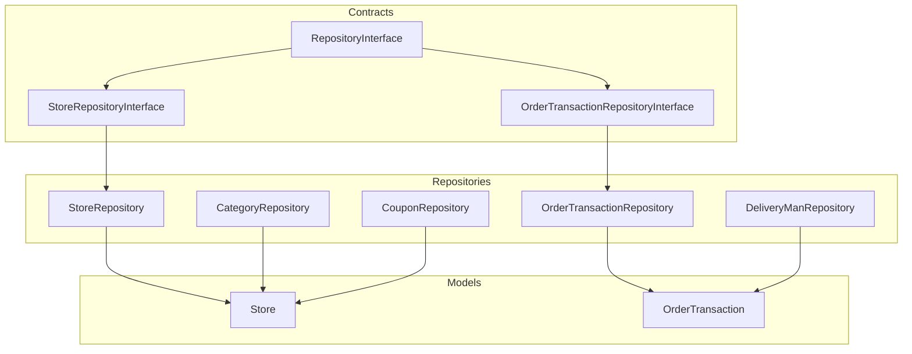
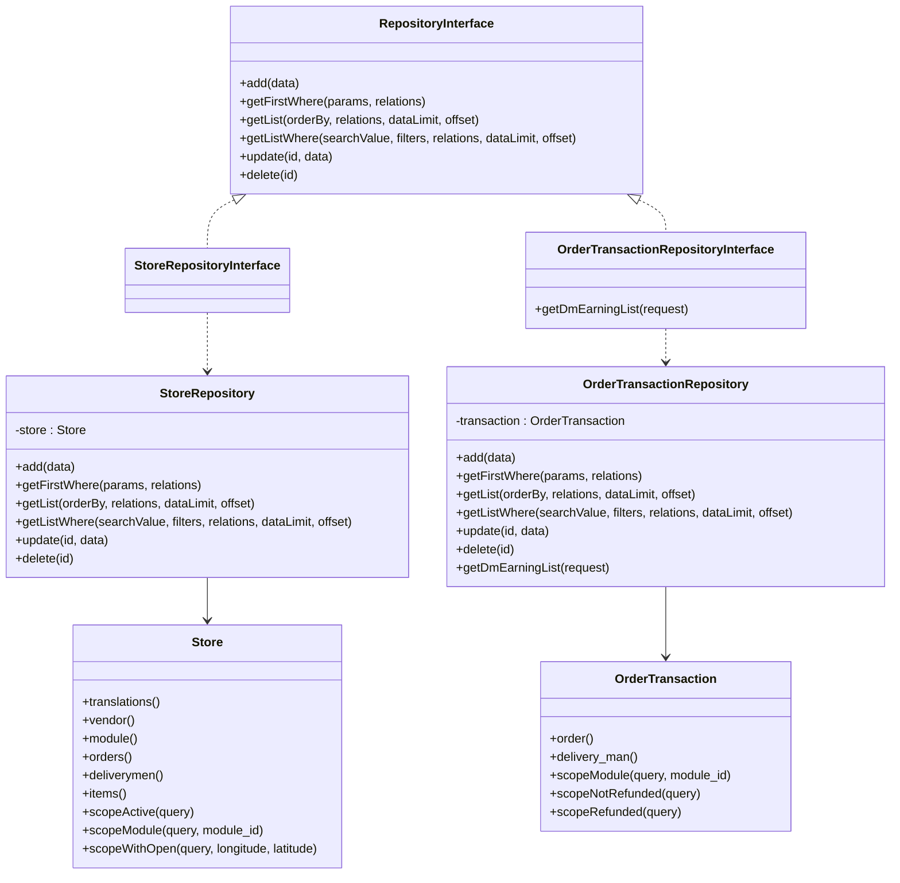
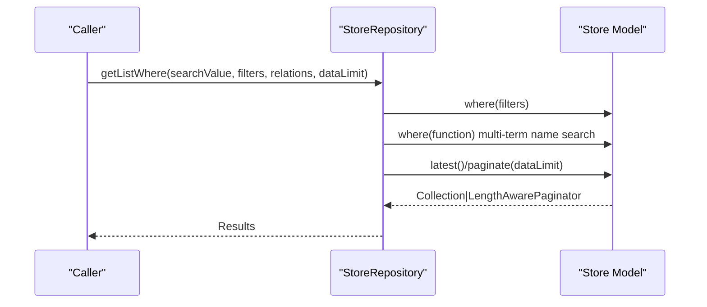
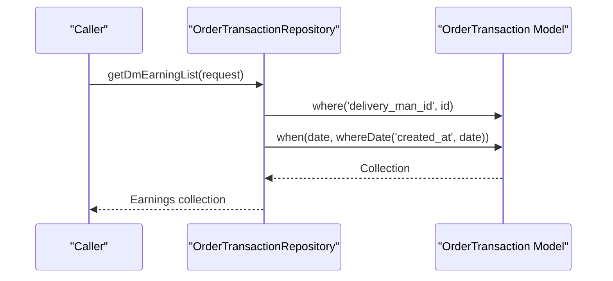
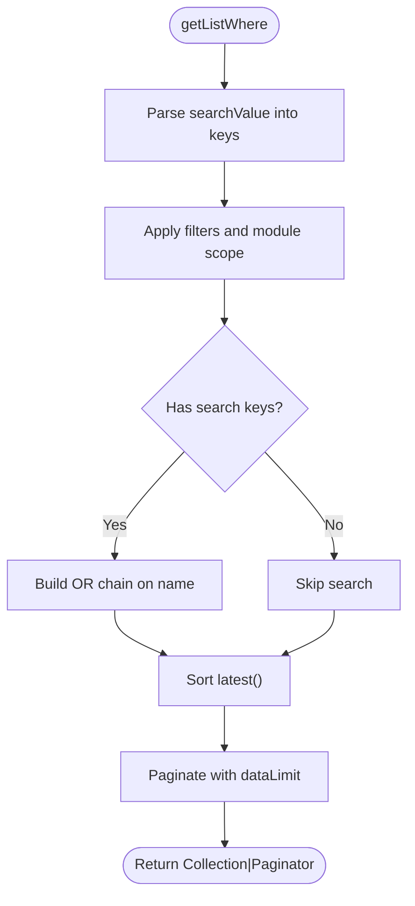
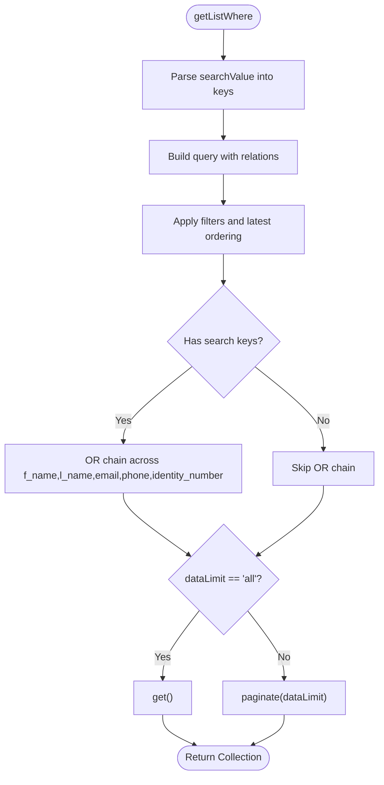
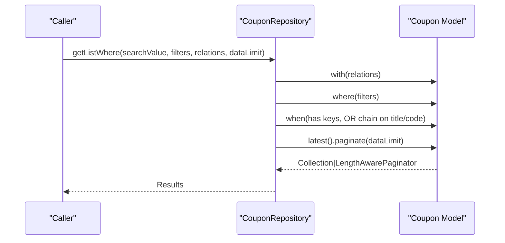
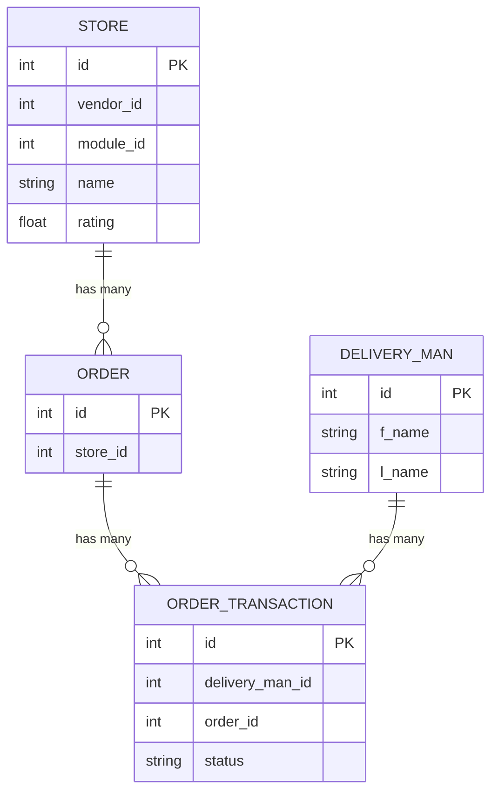
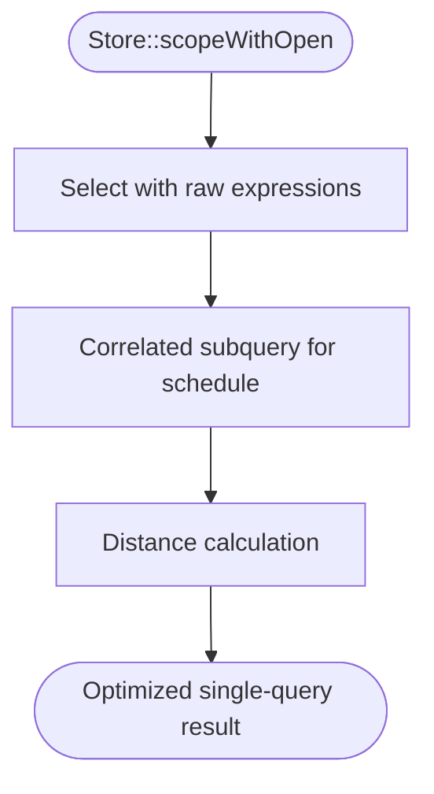
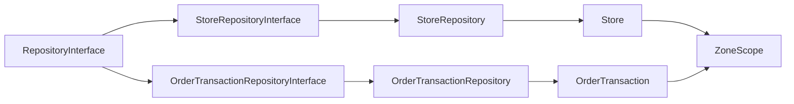

# Core Repository Implementations

<cite>
**Referenced Files in This Document**
- [StoreRepository.php](file://app/Repositories/StoreRepository.php)
- [OrderTransactionRepository.php](file://app/Repositories/OrderTransactionRepository.php)
- [StoreRepositoryInterface.php](file://app/Contracts/Repositories/StoreRepositoryInterface.php)
- [OrderTransactionRepositoryInterface.php](file://app/Contracts/Repositories/OrderTransactionRepositoryInterface.php)
- [RepositoryInterface.php](file://app/Contracts/Repositories/RepositoryInterface.php)
- [Store.php](file://app/Models/Store.php)
- [OrderTransaction.php](file://app/Models/OrderTransaction.php)
- [CategoryRepository.php](file://app/Repositories/CategoryRepository.php)
- [DeliveryManRepository.php](file://app/Repositories/DeliveryManRepository.php)
- [CouponRepository.php](file://app/Repositories/CouponRepository.php)
</cite>

## Table of Contents
1. [Introduction](#introduction)
2. [Project Structure](#project-structure)
3. [Core Components](#core-components)
4. [Architecture Overview](#architecture-overview)
5. [Detailed Component Analysis](#detailed-component-analysis)
6. [Dependency Analysis](#dependency-analysis)
7. [Performance Considerations](#performance-considerations)
8. [Troubleshooting Guide](#troubleshooting-guide)
9. [Conclusion](#conclusion)

## Introduction
This document explains the core repository implementations in Waddy Back, focusing on StoreRepository, OrderTransactionRepository, and related patterns. It details how repositories encapsulate data access, build queries, handle relationships, and implement advanced filtering, sorting, pagination, joins, and performance optimizations. It also covers error handling and transaction management patterns used across repositories.

## Project Structure
Repositories implement a clean separation of concerns by exposing a common contract (RepositoryInterface) and delegating persistence to Eloquent models. The primary repositories analyzed here are:
- StoreRepository: Manages store entities with basic CRUD and list/search capabilities.
- OrderTransactionRepository: Manages order transaction entities with delivery man earnings filtering.
- Supporting repositories (CategoryRepository, DeliveryManRepository, CouponRepository) demonstrate advanced query patterns, global scopes, and complex filters.

**Diagram sources**
- [RepositoryInterface.php:1-60](file://app/Contracts/Repositories/RepositoryInterface.php#L1-L60)
- [StoreRepositoryInterface.php:1-11](file://app/Contracts/Repositories/StoreRepositoryInterface.php#L1-L11)
- [OrderTransactionRepositoryInterface.php:1-17](file://app/Contracts/Repositories/OrderTransactionRepositoryInterface.php#L1-L17)
- [StoreRepository.php:1-66](file://app/Repositories/StoreRepository.php#L1-L66)
- [OrderTransactionRepository.php:1-76](file://app/Repositories/OrderTransactionRepository.php#L1-L76)
- [Store.php:1-934](file://app/Models/Store.php#L1-L934)
- [OrderTransaction.php:1-47](file://app/Models/OrderTransaction.php#L1-L47)

**Section sources**
- [RepositoryInterface.php:1-60](file://app/Contracts/Repositories/RepositoryInterface.php#L1-L60)
- [StoreRepositoryInterface.php:1-11](file://app/Contracts/Repositories/StoreRepositoryInterface.php#L1-L11)
- [OrderTransactionRepositoryInterface.php:1-17](file://app/Contracts/Repositories/OrderTransactionRepositoryInterface.php#L1-L17)
- [StoreRepository.php:1-66](file://app/Repositories/StoreRepository.php#L1-L66)
- [OrderTransactionRepository.php:1-76](file://app/Repositories/OrderTransactionRepository.php#L1-L76)
- [Store.php:1-934](file://app/Models/Store.php#L1-L934)
- [OrderTransaction.php:1-47](file://app/Models/OrderTransaction.php#L1-L47)

## Core Components
This section outlines the common repository contract and the two primary repositories under focus.

- RepositoryInterface defines the canonical CRUD and list/search operations used by all repositories.
- StoreRepository implements the StoreRepositoryInterface and provides:
  - add/update/delete for stores
  - getFirstWhere for single record retrieval
  - getList and getListWhere for paginated and filtered lists
  - deletion cascading to translations
- OrderTransactionRepository implements the OrderTransactionRepositoryInterface and provides:
  - add/update/delete for transactions
  - getFirstWhere for single record retrieval
  - getList and getListWhere for paginated and filtered lists
  - getDmEarningList for delivery man earnings filtering by date

These repositories rely on Eloquent models to define relationships and scopes, enabling complex queries and joins.

**Section sources**
- [RepositoryInterface.php:1-60](file://app/Contracts/Repositories/RepositoryInterface.php#L1-L60)
- [StoreRepositoryInterface.php:1-11](file://app/Contracts/Repositories/StoreRepositoryInterface.php#L1-L11)
- [OrderTransactionRepositoryInterface.php:1-17](file://app/Contracts/Repositories/OrderTransactionRepositoryInterface.php#L1-L17)
- [StoreRepository.php:1-66](file://app/Repositories/StoreRepository.php#L1-L66)
- [OrderTransactionRepository.php:1-76](file://app/Repositories/OrderTransactionRepository.php#L1-L76)

## Architecture Overview
The repository pattern centralizes query logic behind typed interfaces. Repositories depend on Eloquent models, which define relationships and global scopes. This design enables:
- Consistent method signatures across repositories
- Easy mocking and testing
- Encapsulation of complex joins and aggregations within models and repositories
- Clear separation between business logic and persistence

**Diagram sources**
- [RepositoryInterface.php:1-60](file://app/Contracts/Repositories/RepositoryInterface.php#L1-L60)
- [StoreRepositoryInterface.php:1-11](file://app/Contracts/Repositories/StoreRepositoryInterface.php#L1-L11)
- [OrderTransactionRepositoryInterface.php:1-17](file://app/Contracts/Repositories/OrderTransactionRepositoryInterface.php#L1-L17)
- [StoreRepository.php:1-66](file://app/Repositories/StoreRepository.php#L1-L66)
- [OrderTransactionRepository.php:1-76](file://app/Repositories/OrderTransactionRepository.php#L1-L76)
- [Store.php:1-934](file://app/Models/Store.php#L1-L934)
- [OrderTransaction.php:1-47](file://app/Models/OrderTransaction.php#L1-L47)

## Detailed Component Analysis

### StoreRepository
StoreRepository focuses on store management with straightforward CRUD and list operations. It supports:
- Advanced filtering via getListWhere with multi-term search across name
- Pagination via Laravel’s LengthAwarePaginator
- Deletion with translation cleanup

**Diagram sources**
- [StoreRepository.php:37-45](file://app/Repositories/StoreRepository.php#L37-L45)
- [Store.php:1-934](file://app/Models/Store.php#L1-L934)

**Section sources**
- [StoreRepository.php:1-66](file://app/Repositories/StoreRepository.php#L1-L66)
- [StoreRepositoryInterface.php:1-11](file://app/Contracts/Repositories/StoreRepositoryInterface.php#L1-L11)

### OrderTransactionRepository
OrderTransactionRepository manages order transactions and includes a specialized method for delivery man earnings filtering. It demonstrates:
- Date-based filtering using when closures
- Delivery man-specific filtering
- Standard CRUD and list/search operations

**Diagram sources**
- [OrderTransactionRepository.php:67-74](file://app/Repositories/OrderTransactionRepository.php#L67-L74)
- [OrderTransaction.php:1-47](file://app/Models/OrderTransaction.php#L1-L47)

**Section sources**
- [OrderTransactionRepository.php:1-76](file://app/Repositories/OrderTransactionRepository.php#L1-L76)
- [OrderTransactionRepositoryInterface.php:1-17](file://app/Contracts/Repositories/OrderTransactionRepositoryInterface.php#L1-L17)

### Supporting Repositories: Advanced Patterns
These repositories illustrate advanced query-building techniques used across the system.

#### CategoryRepository
- Bulk insert/update by chunk for performance
- Global scope bypass for translation-less queries
- Export and bulk export with module scoping
- Multi-term search across localized names
- Name dropdown mapping with position labels

**Diagram sources**
- [CategoryRepository.php:109-120](file://app/Repositories/CategoryRepository.php#L109-L120)

**Section sources**
- [CategoryRepository.php:1-175](file://app/Repositories/CategoryRepository.php#L1-L175)

#### DeliveryManRepository
- Comprehensive multi-field search across names, emails, phones, and identity numbers
- Zone-wise filtering and additional status/job-type filters
- Dropdown list generation with computed text fields
- Active-first retrieval with multiple dynamic conditions

**Diagram sources**
- [DeliveryManRepository.php:41-62](file://app/Repositories/DeliveryManRepository.php#L41-L62)

**Section sources**
- [DeliveryManRepository.php:1-208](file://app/Repositories/DeliveryManRepository.php#L1-L208)

#### CouponRepository
- Multi-field search across title and code
- Export list with module scoping and admin-created filter
- Global scope bypass for translation-less retrieval

**Diagram sources**
- [CouponRepository.php:39-53](file://app/Repositories/CouponRepository.php#L39-L53)

**Section sources**
- [CouponRepository.php:1-94](file://app/Repositories/CouponRepository.php#L1-L94)

### Relationship Handling and Aggregation Operations
Repositories leverage model relationships and scopes to implement complex joins and aggregations:
- Store model defines relationships (vendor, module, orders, deliverymen, items) and scopes (active, module, open status, distance calculation).
- OrderTransaction model defines relationships to Order and DeliveryMan and scopes for refunded/not-refunded statuses.
- These relationships enable repositories to perform joins implicitly through Eloquent’s lazy/eager loading and explicit whereHas clauses.

**Diagram sources**
- [Store.php:392-464](file://app/Models/Store.php#L392-L464)
- [OrderTransaction.php:15-23](file://app/Models/OrderTransaction.php#L15-L23)

**Section sources**
- [Store.php:1-934](file://app/Models/Store.php#L1-L934)
- [OrderTransaction.php:1-47](file://app/Models/OrderTransaction.php#L1-L47)

### Advanced Filtering, Sorting, and Pagination
- Multi-term search: Repositories split the search term and apply OR conditions across relevant fields.
- Dynamic filters: Filters are applied conditionally using when closures to avoid unnecessary queries.
- Sorting: Repositories commonly sort by latest to present newest records first.
- Pagination: Repositories use Laravel’s paginate to return LengthAwarePaginator instances for frontend consumption.

Examples of these patterns appear across CategoryRepository, DeliveryManRepository, CouponRepository, StoreRepository, and OrderTransactionRepository.

**Section sources**
- [CategoryRepository.php:109-120](file://app/Repositories/CategoryRepository.php#L109-L120)
- [DeliveryManRepository.php:41-62](file://app/Repositories/DeliveryManRepository.php#L41-L62)
- [CouponRepository.php:39-53](file://app/Repositories/CouponRepository.php#L39-L53)
- [StoreRepository.php:37-45](file://app/Repositories/StoreRepository.php#L37-L45)
- [OrderTransactionRepository.php:38-46](file://app/Repositories/OrderTransactionRepository.php#L38-L46)

### Complex Joins, Subqueries, and Performance Optimizations
- Global scopes: Models apply ZoneScope and translation/storage scopes to enforce tenant isolation and localization defaults.
- Select raw and subqueries: Store model uses selectRaw with correlated subqueries to compute open status and distance, optimizing proximity and availability checks in a single query.
- Chunked operations: CategoryRepository performs bulk inserts/updates in chunks to reduce memory overhead and improve throughput.
- Conditional eager loading: Repositories use with() selectively to load relations only when needed.

**Diagram sources**
- [Store.php:680-687](file://app/Models/Store.php#L680-L687)

**Section sources**
- [Store.php:680-687](file://app/Models/Store.php#L680-L687)
- [CategoryRepository.php:36-67](file://app/Repositories/CategoryRepository.php#L36-L67)

### Error Handling Patterns and Transaction Management
- Validation and sanitization: Repositories accept arrays and iterate to assign values, relying on model fillable attributes and database constraints for safety.
- Deletion safeguards: StoreRepository deletes translations before deleting the store to prevent orphaned localized data.
- Conditional returns: CategoryRepository returns false when attempting to delete categories with child entries, preventing cascading deletions.
- Transaction management: There is no explicit transaction block in the analyzed repositories. For write-heavy operations, consider wrapping multiple writes in database transactions to ensure atomicity.

**Section sources**
- [StoreRepository.php:57-65](file://app/Repositories/StoreRepository.php#L57-L65)
- [CategoryRepository.php:162-173](file://app/Repositories/CategoryRepository.php#L162-L173)

## Dependency Analysis
Repositories depend on:
- Eloquent models for relationships and scopes
- Interfaces for contract enforcement
- Laravel’s paginator for pagination
- Global scopes for cross-cutting concerns (e.g., zone and translation)

**Diagram sources**
- [RepositoryInterface.php:1-60](file://app/Contracts/Repositories/RepositoryInterface.php#L1-L60)
- [StoreRepositoryInterface.php:1-11](file://app/Contracts/Repositories/StoreRepositoryInterface.php#L1-L11)
- [OrderTransactionRepositoryInterface.php:1-17](file://app/Contracts/Repositories/OrderTransactionRepositoryInterface.php#L1-L17)
- [StoreRepository.php:1-66](file://app/Repositories/StoreRepository.php#L1-L66)
- [OrderTransactionRepository.php:1-76](file://app/Repositories/OrderTransactionRepository.php#L1-L76)
- [Store.php:1-934](file://app/Models/Store.php#L1-L934)
- [OrderTransaction.php:1-47](file://app/Models/OrderTransaction.php#L1-L47)

**Section sources**
- [RepositoryInterface.php:1-60](file://app/Contracts/Repositories/RepositoryInterface.php#L1-L60)
- [StoreRepository.php:1-66](file://app/Repositories/StoreRepository.php#L1-L66)
- [OrderTransactionRepository.php:1-76](file://app/Repositories/OrderTransactionRepository.php#L1-L76)
- [Store.php:1-934](file://app/Models/Store.php#L1-L934)
- [OrderTransaction.php:1-47](file://app/Models/OrderTransaction.php#L1-L47)

## Performance Considerations
- Prefer paginate over get for large datasets to limit memory usage.
- Use chunked bulk operations for inserts/updates to reduce memory footprint.
- Leverage global scopes to avoid repetitive filtering logic.
- Use selectRaw and correlated subqueries judiciously to minimize round-trips while maintaining readability.
- Apply when closures to conditionally add filters and avoid unnecessary SQL.

[No sources needed since this section provides general guidance]

## Troubleshooting Guide
- If search results are empty, verify the search term parsing and OR chain logic in getListWhere implementations.
- For translation-related issues, check global scopes and ensure withoutGlobalScope is used when appropriate.
- When deleting entities, confirm that dependent translations and related records are handled (as seen in StoreRepository and CategoryRepository).
- For performance issues, review pagination limits and consider adding indexes on frequently filtered columns.

**Section sources**
- [StoreRepository.php:37-45](file://app/Repositories/StoreRepository.php#L37-L45)
- [CategoryRepository.php:162-173](file://app/Repositories/CategoryRepository.php#L162-L173)
- [Store.php:705-713](file://app/Models/Store.php#L705-L713)

## Conclusion
The repository implementations in Waddy Back follow a consistent, testable pattern centered on Eloquent models and interfaces. They demonstrate robust query-building techniques, including multi-term search, conditional filters, pagination, and optimized joins through scopes and raw selects. While most repositories do not explicitly manage transactions, the established patterns provide a solid foundation for introducing atomic operations where needed.