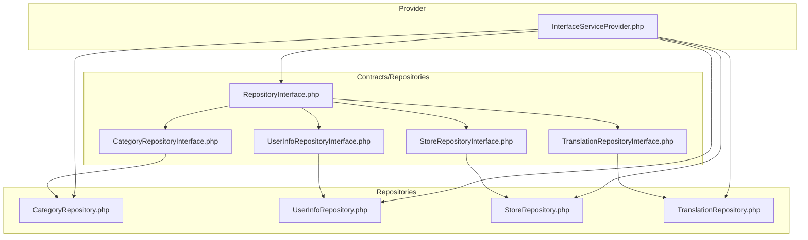
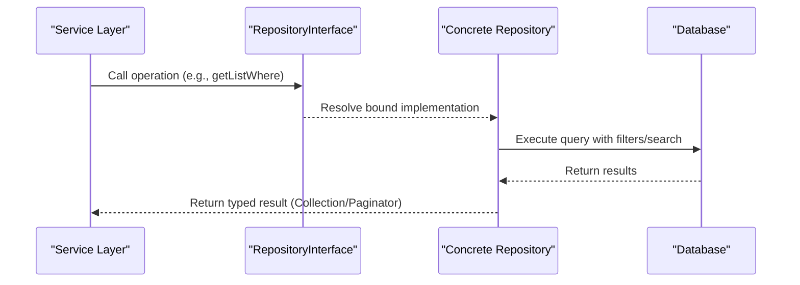
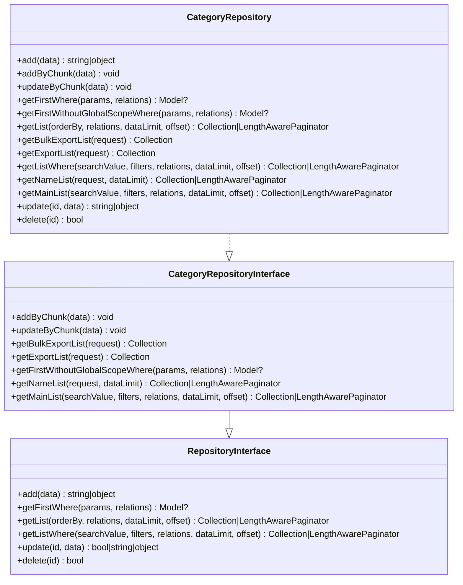
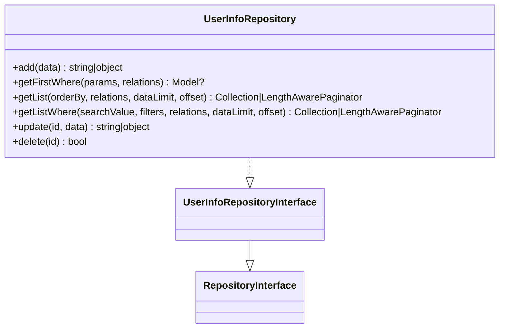
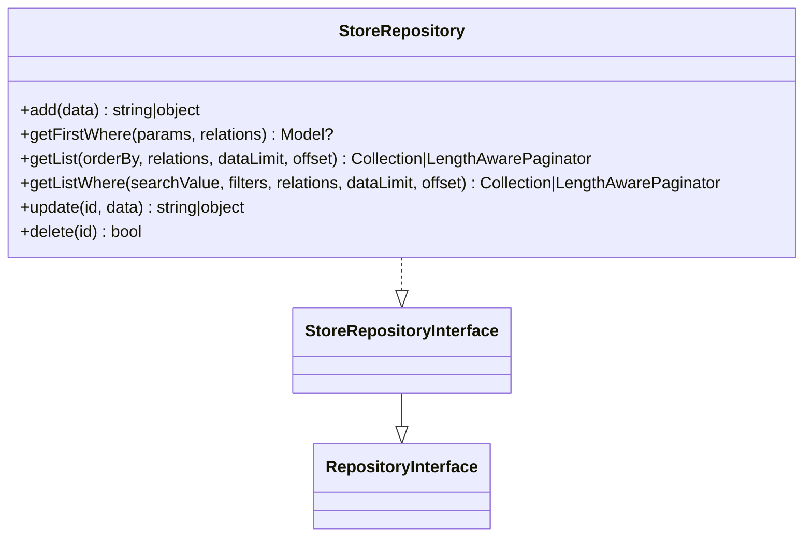
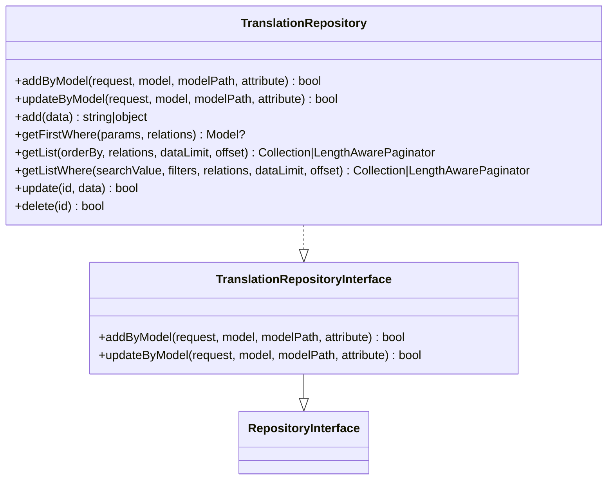
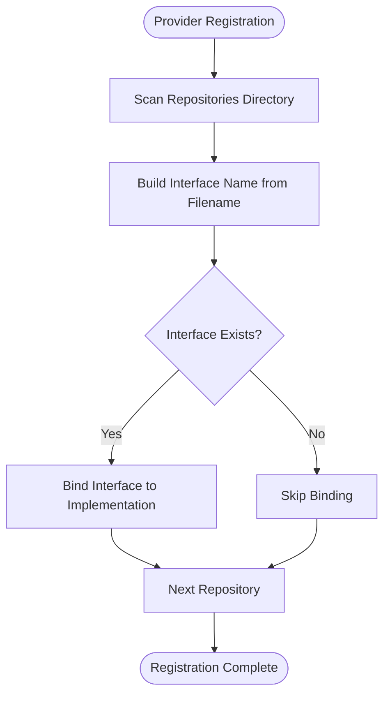
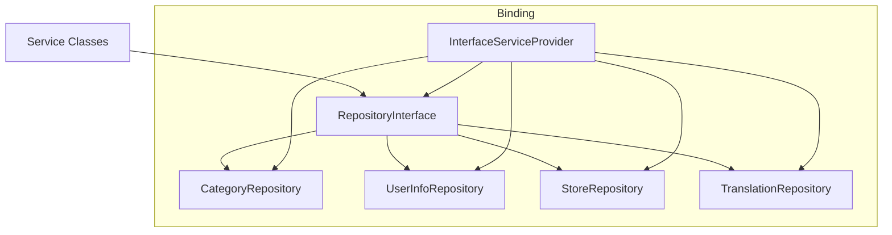

# Repository Interface Design

<cite>
**Referenced Files in This Document**
- [RepositoryInterface.php](file://app/Contracts/Repositories/RepositoryInterface.php)
- [CategoryRepositoryInterface.php](file://app/Contracts/Repositories/CategoryRepositoryInterface.php)
- [UserInfoRepositoryInterface.php](file://app/Contracts/Repositories/UserInfoRepositoryInterface.php)
- [StoreRepositoryInterface.php](file://app/Contracts/Repositories/StoreRepositoryInterface.php)
- [TranslationRepositoryInterface.php](file://app/Contracts/Repositories/TranslationRepositoryInterface.php)
- [InterfaceServiceProvider.php](file://app/Providers/InterfaceServiceProvider.php)
- [CategoryRepository.php](file://app/Repositories/CategoryRepository.php)
- [UserInfoRepository.php](file://app/Repositories/UserInfoRepository.php)
- [StoreRepository.php](file://app/Repositories/StoreRepository.php)
- [TranslationRepository.php](file://app/Repositories/TranslationRepository.php)
</cite>

## Table of Contents
1. [Introduction](#introduction)
2. [Project Structure](#project-structure)
3. [Core Components](#core-components)
4. [Architecture Overview](#architecture-overview)
5. [Detailed Component Analysis](#detailed-component-analysis)
6. [Dependency Analysis](#dependency-analysis)
7. [Performance Considerations](#performance-considerations)
8. [Troubleshooting Guide](#troubleshooting-guide)
9. [Conclusion](#conclusion)

## Introduction
This document explains the repository interface design pattern in Waddy Back, focusing on how contracts define standardized data access operations across services and data sources. The pattern enables loose coupling, supports dependency injection, and facilitates testing through interface-based abstractions. It covers the base contract, specialized entity interfaces, implementation examples, and the provider-driven binding mechanism that enforces consistent data access patterns.

## Project Structure
The repository interface design is organized around a central contract and per-entity specialized interfaces, with corresponding implementations under the Repositories namespace. A service provider automatically binds interfaces to their implementations, ensuring consistent contracts across the application.

**Diagram sources**
- [RepositoryInterface.php:1-60](file://app/Contracts/Repositories/RepositoryInterface.php#L1-L60)
- [CategoryRepositoryInterface.php:1-61](file://app/Contracts/Repositories/CategoryRepositoryInterface.php#L1-L61)
- [UserInfoRepositoryInterface.php:1-11](file://app/Contracts/Repositories/UserInfoRepositoryInterface.php#L1-L11)
- [StoreRepositoryInterface.php:1-11](file://app/Contracts/Repositories/StoreRepositoryInterface.php#L1-L11)
- [TranslationRepositoryInterface.php:1-25](file://app/Contracts/Repositories/TranslationRepositoryInterface.php#L1-L25)
- [InterfaceServiceProvider.php:1-46](file://app/Providers/InterfaceServiceProvider.php#L1-L46)
- [CategoryRepository.php:1-175](file://app/Repositories/CategoryRepository.php#L1-L175)
- [UserInfoRepository.php:1-66](file://app/Repositories/UserInfoRepository.php#L1-L66)
- [StoreRepository.php:1-66](file://app/Repositories/StoreRepository.php#L1-L66)
- [TranslationRepository.php:1-112](file://app/Repositories/TranslationRepository.php#L1-L112)

**Section sources**
- [RepositoryInterface.php:1-60](file://app/Contracts/Repositories/RepositoryInterface.php#L1-L60)
- [InterfaceServiceProvider.php:1-46](file://app/Providers/InterfaceServiceProvider.php#L1-L46)

## Core Components
The repository interface design centers on a base contract that standardizes CRUD and query operations, extended by entity-specific interfaces to capture domain needs. Implementations adhere to these contracts, while a provider binds interfaces to concrete classes at runtime.

- Base contract: Defines common operations for adding, retrieving, listing, updating, and deleting records, including search and filtering capabilities.
- Specialized interfaces: Extend the base contract with domain-specific methods (e.g., bulk operations, export lists, name lists).
- Implementations: Provide concrete logic for each entity, implementing the corresponding interface methods.
- Provider binding: Automatically registers interface-to-implementation bindings for all repository pairs.

**Section sources**
- [RepositoryInterface.php:1-60](file://app/Contracts/Repositories/RepositoryInterface.php#L1-L60)
- [CategoryRepositoryInterface.php:1-61](file://app/Contracts/Repositories/CategoryRepositoryInterface.php#L1-L61)
- [UserInfoRepositoryInterface.php:1-11](file://app/Contracts/Repositories/UserInfoRepositoryInterface.php#L1-L11)
- [StoreRepositoryInterface.php:1-11](file://app/Contracts/Repositories/StoreRepositoryInterface.php#L1-L11)
- [TranslationRepositoryInterface.php:1-25](file://app/Contracts/Repositories/TranslationRepositoryInterface.php#L1-L25)
- [InterfaceServiceProvider.php:20-36](file://app/Providers/InterfaceServiceProvider.php#L20-L36)

## Architecture Overview
The repository pattern separates service logic from persistence concerns. Services depend on repository interfaces, allowing implementations to vary without affecting consumers. The provider ensures consistent binding across the application.

**Diagram sources**
- [RepositoryInterface.php:24-42](file://app/Contracts/Repositories/RepositoryInterface.php#L24-L42)
- [CategoryRepository.php:109-120](file://app/Repositories/CategoryRepository.php#L109-L120)
- [UserInfoRepository.php:37-45](file://app/Repositories/UserInfoRepository.php#L37-L45)
- [StoreRepository.php:37-45](file://app/Repositories/StoreRepository.php#L37-L45)

## Detailed Component Analysis

### Base Repository Contract
The base contract defines a consistent set of operations for data access:
- Add: Creates a new record from an associative data array and returns the created resource.
- Get first by condition: Retrieves the first record matching conditions, optionally loading relations.
- List with ordering and relations: Returns paginated or collection results with optional limits and offsets.
- Filtered list with search: Supports search terms and filter arrays, returning paginated or collection results.
- Update: Modifies a record by ID and returns the updated resource or boolean indicator.
- Delete: Removes a record by ID and returns a boolean success indicator.

These methods enforce consistent return types and parameter patterns across all repositories, simplifying service consumption and testing.

**Section sources**
- [RepositoryInterface.php:11-57](file://app/Contracts/Repositories/RepositoryInterface.php#L11-L57)

### Specialized Interfaces and Implementations

#### Category Repository
Extends the base contract with bulk operations and domain-specific queries:
- Bulk add/update: Processes arrays of categories in chunks for efficient persistence.
- Export lists: Provides filtered collections for administrative exports.
- Name list: Returns selectable name/value pairs for UI dropdowns.
- Main list: Retrieves hierarchical lists with module scoping.

Implementation demonstrates chunked inserts/updates, global scope handling, and module-aware filtering.

**Diagram sources**
- [RepositoryInterface.php:9-59](file://app/Contracts/Repositories/RepositoryInterface.php#L9-L59)
- [CategoryRepositoryInterface.php:11-60](file://app/Contracts/Repositories/CategoryRepositoryInterface.php#L11-L60)
- [CategoryRepository.php:18-174](file://app/Repositories/CategoryRepository.php#L18-L174)

**Section sources**
- [CategoryRepositoryInterface.php:13-60](file://app/Contracts/Repositories/CategoryRepositoryInterface.php#L13-L60)
- [CategoryRepository.php:36-173](file://app/Repositories/CategoryRepository.php#L36-L173)

#### User Info Repository
A minimal extension of the base contract, focused on user profile data with standard CRUD operations and basic search.

**Diagram sources**
- [RepositoryInterface.php:9-59](file://app/Contracts/Repositories/RepositoryInterface.php#L9-L59)
- [UserInfoRepositoryInterface.php:7-10](file://app/Contracts/Repositories/UserInfoRepositoryInterface.php#L7-L10)
- [UserInfoRepository.php:11-65](file://app/Repositories/UserInfoRepository.php#L11-L65)

**Section sources**
- [UserInfoRepositoryInterface.php:7-10](file://app/Contracts/Repositories/UserInfoRepositoryInterface.php#L7-L10)
- [UserInfoRepository.php:17-64](file://app/Repositories/UserInfoRepository.php#L17-L64)

#### Store Repository
Provides store-related operations with standard list/search capabilities and translation handling.

**Diagram sources**
- [RepositoryInterface.php:9-59](file://app/Contracts/Repositories/RepositoryInterface.php#L9-L59)
- [StoreRepositoryInterface.php:7-10](file://app/Contracts/Repositories/StoreRepositoryInterface.php#L7-L10)
- [StoreRepository.php:11-65](file://app/Repositories/StoreRepository.php#L11-L65)

**Section sources**
- [StoreRepositoryInterface.php:7-10](file://app/Contracts/Repositories/StoreRepositoryInterface.php#L7-L10)
- [StoreRepository.php:17-64](file://app/Repositories/StoreRepository.php#L17-L64)

#### Translation Repository
Extends the base contract with model-scoped translation operations, supporting multi-language attributes during create/update flows.

**Diagram sources**
- [RepositoryInterface.php:9-59](file://app/Contracts/Repositories/RepositoryInterface.php#L9-L59)
- [TranslationRepositoryInterface.php:7-24](file://app/Contracts/Repositories/TranslationRepositoryInterface.php#L7-L24)
- [TranslationRepository.php:12-111](file://app/Repositories/TranslationRepository.php#L12-L111)

**Section sources**
- [TranslationRepositoryInterface.php:9-23](file://app/Contracts/Repositories/TranslationRepositoryInterface.php#L9-L23)
- [TranslationRepository.php:19-79](file://app/Repositories/TranslationRepository.php#L19-L79)

### Dependency Injection and Binding Mechanism
The provider scans the Repositories and Contracts/Repositories directories, matching interface names to repository classes and registering container bindings. This automatic registration ensures:
- Consistent binding across the application.
- Easy substitution of implementations for testing.
- Enforced contract adherence by resolving only matching interfaces.

**Diagram sources**
- [InterfaceServiceProvider.php:20-36](file://app/Providers/InterfaceServiceProvider.php#L20-L36)

**Section sources**
- [InterfaceServiceProvider.php:15-36](file://app/Providers/InterfaceServiceProvider.php#L15-L36)

## Dependency Analysis
The repository interfaces and implementations form a cohesive layer that decouples services from persistence details. Dependencies flow from services to interfaces, which are resolved to concrete implementations via the provider. This design prevents tight coupling and supports:
- Testing: Mock implementations can replace real repositories.
- Extensibility: New repositories can implement existing interfaces.
- Consistency: All repositories follow the same method signatures and return patterns.

**Diagram sources**
- [RepositoryInterface.php:9-59](file://app/Contracts/Repositories/RepositoryInterface.php#L9-L59)
- [CategoryRepository.php:18](file://app/Repositories/CategoryRepository.php#L18)
- [UserInfoRepository.php:11](file://app/Repositories/UserInfoRepository.php#L11)
- [StoreRepository.php:11](file://app/Repositories/StoreRepository.php#L11)
- [TranslationRepository.php:12](file://app/Repositories/TranslationRepository.php#L12)
- [InterfaceServiceProvider.php:20-36](file://app/Providers/InterfaceServiceProvider.php#L20-L36)

**Section sources**
- [RepositoryInterface.php:9-59](file://app/Contracts/Repositories/RepositoryInterface.php#L9-L59)
- [InterfaceServiceProvider.php:20-36](file://app/Providers/InterfaceServiceProvider.php#L20-L36)

## Performance Considerations
- Pagination: Methods supporting dataLimit and offset enable scalable retrieval of large datasets.
- Relation loading: Optional eager-loading reduces N+1 query risks when relations are needed.
- Search and filters: Encapsulated within repository methods to keep service logic clean and reusable.
- Chunked operations: Bulk add/update methods process data in chunks to optimize database writes.

## Troubleshooting Guide
Common issues and resolutions:
- Missing interface binding: Verify that the interface and repository filenames match and that the provider scans the correct directories.
- Type mismatches: Ensure implementations return the exact types declared in the contract (e.g., nullable models, collections, or paginators).
- Parameter constraints: Follow documented parameter structures (associative arrays for filters, search terms, and relation lists).
- Global scopes: Some entities override global scopes in specialized methods; confirm usage when querying translated or scoped data.

**Section sources**
- [CategoryRepositoryInterface.php:38-42](file://app/Contracts/Repositories/CategoryRepositoryInterface.php#L38-L42)
- [CategoryRepository.php:74-77](file://app/Repositories/CategoryRepository.php#L74-L77)

## Conclusion
The repository interface design in Waddy Back establishes a robust, testable, and maintainable abstraction for data access. By standardizing method signatures and return types, enabling automatic dependency injection, and supporting entity-specific extensions, the pattern ensures consistent behavior across repositories while preserving flexibility for future enhancements.