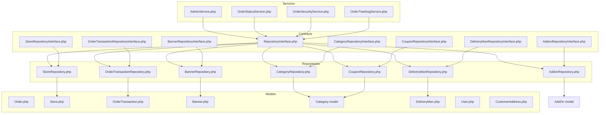
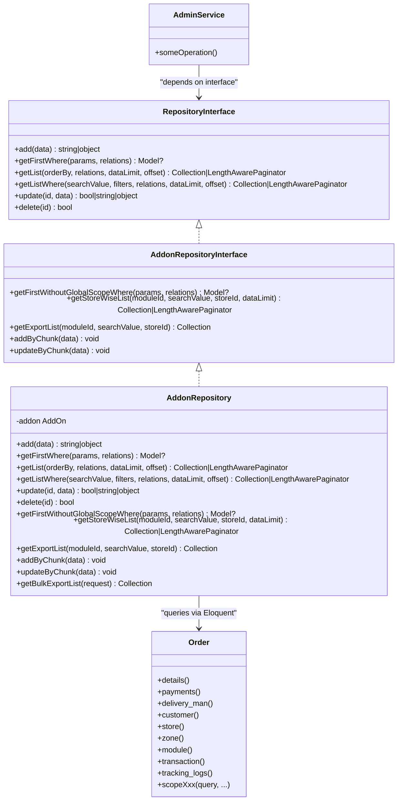
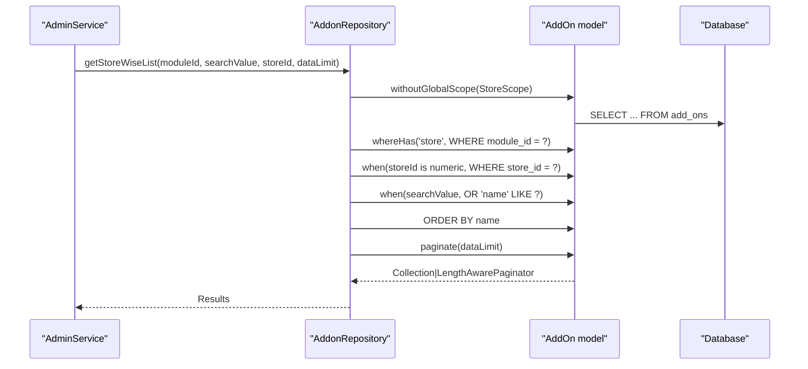
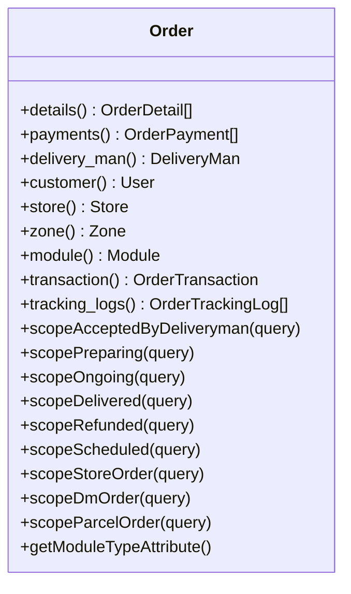
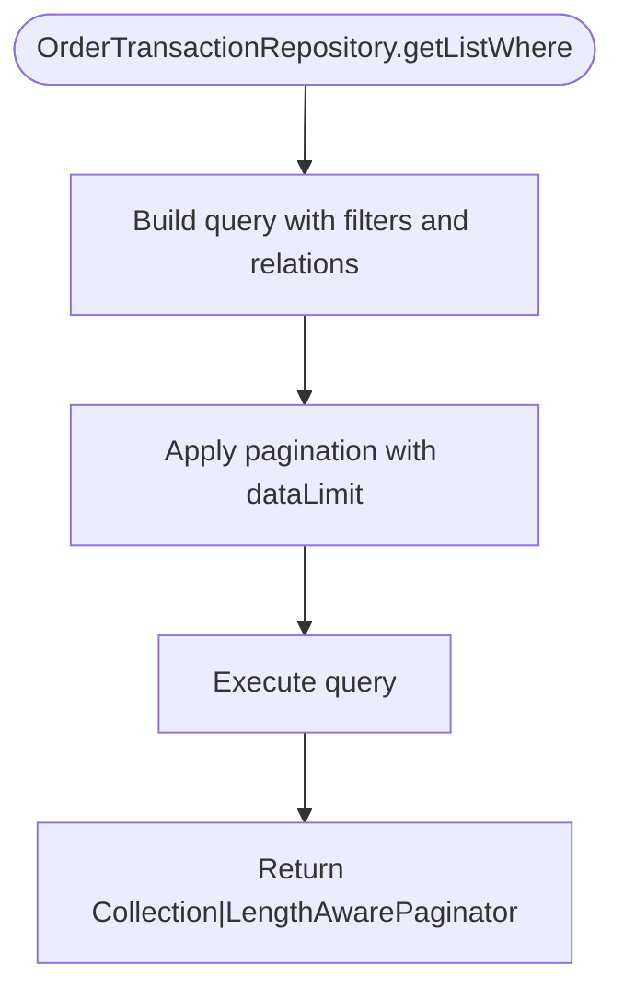
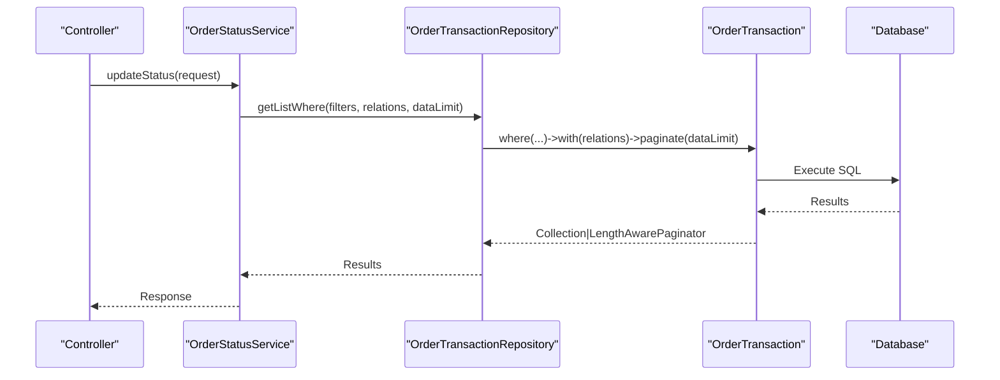
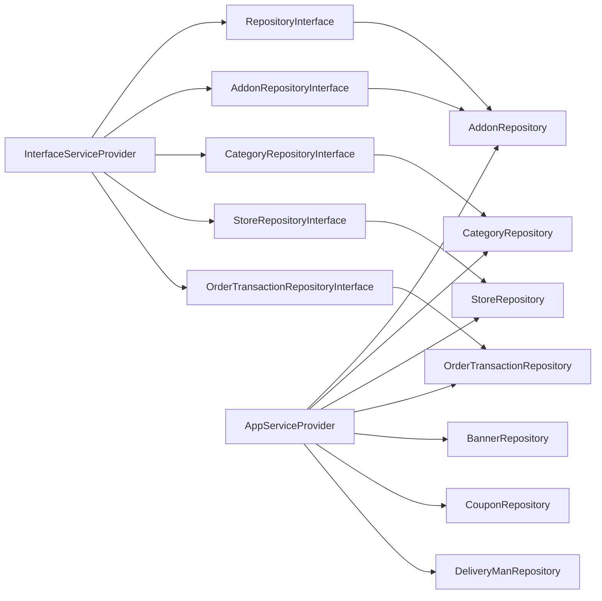

# Repository Pattern Implementation

<cite>
**Referenced Files in This Document**
- [RepositoryInterface.php](file://app/Contracts/Repositories/RepositoryInterface.php)
- [AddonRepositoryInterface.php](file://app/Contracts/Repositories/AddonRepositoryInterface.php)
- [CategoryRepositoryInterface.php](file://app/Contracts/Repositories/CategoryRepositoryInterface.php)
- [AddonRepository.php](file://app/Repositories/AddonRepository.php)
- [Order.php](file://app/Models/Order.php)
- [AppServiceProvider.php](file://app/Providers/AppServiceProvider.php)
- [InterfaceServiceProvider.php](file://app/Providers/InterfaceServiceProvider.php)
- [AdminService.php](file://app/Services/AdminService.php)
- [StoreRepository.php](file://app/Repositories/StoreRepository.php)
- [StoreRepositoryInterface.php](file://app/Contracts/Repositories/StoreRepositoryInterface.php)
- [Store.php](file://app/Models/Store.php)
- [StoreScope.php](file://app/Scopes/StoreScope.php)
- [ZoneScope.php](file://app/Scopes/ZoneScope.php)
- [OrderTransactionRepository.php](file://app/Repositories/OrderTransactionRepository.php)
- [OrderTransactionRepositoryInterface.php](file://app/Contracts/Repositories/OrderTransactionRepositoryInterface.php)
- [OrderTransaction.php](file://app/Models/OrderTransaction.php)
- [BannerRepository.php](file://app/Repositories/BannerRepository.php)
- [BannerRepositoryInterface.php](file://app/Contracts/Repositories/BannerRepositoryInterface.php)
- [Banner.php](file://app/Models/Banner.php)
- [CouponRepository.php](file://app/Repositories/CouponRepository.php)
- [CouponRepositoryInterface.php](file://app/Contracts/Repositories/CouponRepositoryInterface.php)
- [Coupon.php](file://app/Models/Coupon.php)
- [DeliveryManRepository.php](file://app/Repositories/DeliveryManRepository.php)
- [DeliveryManRepositoryInterface.php](file://app/Contracts/Repositories/DeliveryManRepositoryInterface.php)
- [DeliveryMan.php](file://app/Models/DeliveryMan.php)
- [User.php](file://app/Models/User.php)
- [CustomerAddress.php](file://app/Models/CustomerAddress.php)
- [OrderStatusService.php](file://app/Services/OrderStatusService.php)
- [OrderSecurityService.php](file://app/Services/OrderSecurityService.php)
- [OrderTrackingService.php](file://app/Services/OrderTrackingService.php)
</cite>

## Table of Contents
1. [Introduction](#introduction)
2. [Project Structure](#project-structure)
3. [Core Components](#core-components)
4. [Architecture Overview](#architecture-overview)
5. [Detailed Component Analysis](#detailed-component-analysis)
6. [Dependency Analysis](#dependency-analysis)
7. [Performance Considerations](#performance-considerations)
8. [Troubleshooting Guide](#troubleshooting-guide)
9. [Conclusion](#conclusion)

## Introduction
This document explains the repository pattern implementation in Waddy Back, focusing on how repositories abstract data access logic, implement the repository interface pattern, and provide clean abstractions for database operations. It details the relationships between repositories, models, and services, demonstrating how this pattern enhances testability, maintainability, and adherence to dependency inversion principles. Examples illustrate query building patterns, complex joins, and aggregations, along with practical guidance for extending the pattern across the codebase.

## Project Structure
The repository pattern is implemented across three primary layers:
- Contracts: Defines repository interfaces (e.g., base `RepositoryInterface` and domain-specific interfaces like `AddonRepositoryInterface`, `CategoryRepositoryInterface`)
- Repositories: Implements the contracts using Eloquent models and query builders
- Models: Define entity schemas, relationships, scopes, and attributes
- Services: Orchestrate business logic and depend on repository interfaces for data access
- Providers: Bind interfaces to implementations for dependency injection

**Diagram sources**
- [RepositoryInterface.php:9-59](file://app/Contracts/Repositories/RepositoryInterface.php#L9-L59)
- [AddonRepositoryInterface.php:9-46](file://app/Contracts/Repositories/AddonRepositoryInterface.php#L9-L46)
- [CategoryRepositoryInterface.php:11-60](file://app/Contracts/Repositories/CategoryRepositoryInterface.php#L11-L60)
- [AddonRepository.php:16-146](file://app/Repositories/AddonRepository.php#L16-L146)
- [Order.php:13-357](file://app/Models/Order.php#L13-L357)
- [AdminService.php](file://app/Services/AdminService.php)
- [StoreRepository.php](file://app/Repositories/StoreRepository.php)
- [StoreRepositoryInterface.php](file://app/Contracts/Repositories/StoreRepositoryInterface.php)
- [Store.php](file://app/Models/Store.php)
- [OrderTransactionRepository.php](file://app/Repositories/OrderTransactionRepository.php)
- [OrderTransactionRepositoryInterface.php](file://app/Contracts/Repositories/OrderTransactionRepositoryInterface.php)
- [OrderTransaction.php](file://app/Models/OrderTransaction.php)
- [BannerRepository.php](file://app/Repositories/BannerRepository.php)
- [BannerRepositoryInterface.php](file://app/Contracts/Repositories/BannerRepositoryInterface.php)
- [Banner.php](file://app/Models/Banner.php)
- [CouponRepository.php](file://app/Repositories/CouponRepository.php)
- [CouponRepositoryInterface.php](file://app/Contracts/Repositories/CouponRepositoryInterface.php)
- [Coupon.php](file://app/Models/Coupon.php)
- [DeliveryManRepository.php](file://app/Repositories/DeliveryManRepository.php)
- [DeliveryManRepositoryInterface.php](file://app/Contracts/Repositories/DeliveryManRepositoryInterface.php)
- [DeliveryMan.php](file://app/Models/DeliveryMan.php)

**Section sources**
- [RepositoryInterface.php:9-59](file://app/Contracts/Repositories/RepositoryInterface.php#L9-L59)
- [AddonRepositoryInterface.php:9-46](file://app/Contracts/Repositories/AddonRepositoryInterface.php#L9-L46)
- [CategoryRepositoryInterface.php:11-60](file://app/Contracts/Repositories/CategoryRepositoryInterface.php#L11-L60)
- [AddonRepository.php:16-146](file://app/Repositories/AddonRepository.php#L16-L146)
- [Order.php:13-357](file://app/Models/Order.php#L13-L357)

## Core Components
- Base repository interface (`RepositoryInterface`): Defines CRUD and query methods with standardized signatures for pagination, filtering, and ordering. This ensures consistent behavior across all repositories and enables dependency inversion.
- Domain-specific repository interfaces: Extend the base interface to add domain-specific methods (e.g., bulk operations, export lists, store-wise queries).
- Repository implementations: Implement the interfaces using Eloquent models, query builders, and scopes. They encapsulate data access logic, handle complex joins/aggregations, and apply global scopes.
- Models: Define entity schemas, relationships, casts, appends, and local/global scopes. They serve as the authoritative source of truth for data shape and constraints.
- Services: Depend on repository interfaces, not concrete implementations, enabling easy mocking and testing.

Key responsibilities:
- Repositories: Encapsulate persistence logic, enforce business filters, and expose typed collections/paginators.
- Models: Define relationships and scopes; centralize attribute casting and computed attributes.
- Services: Compose repository calls to implement use cases and coordinate transactions.

**Section sources**
- [RepositoryInterface.php:9-59](file://app/Contracts/Repositories/RepositoryInterface.php#L9-L59)
- [AddonRepositoryInterface.php:9-46](file://app/Contracts/Repositories/AddonRepositoryInterface.php#L9-L46)
- [CategoryRepositoryInterface.php:11-60](file://app/Contracts/Repositories/CategoryRepositoryInterface.php#L11-L60)
- [AddonRepository.php:16-146](file://app/Repositories/AddonRepository.php#L16-L146)
- [Order.php:13-357](file://app/Models/Order.php#L13-L357)

## Architecture Overview
The repository pattern follows dependency inversion:
- Services depend on repository interfaces
- Providers bind interfaces to concrete repository implementations
- Repositories depend on models and Eloquent query builder
- Models define relationships and scopes

**Diagram sources**
- [RepositoryInterface.php:9-59](file://app/Contracts/Repositories/RepositoryInterface.php#L9-L59)
- [AddonRepositoryInterface.php:9-46](file://app/Contracts/Repositories/AddonRepositoryInterface.php#L9-L46)
- [AddonRepository.php:16-146](file://app/Repositories/AddonRepository.php#L16-L146)
- [Order.php:13-357](file://app/Models/Order.php#L13-L357)
- [AdminService.php](file://app/Services/AdminService.php)

**Section sources**
- [RepositoryInterface.php:9-59](file://app/Contracts/Repositories/RepositoryInterface.php#L9-L59)
- [AddonRepositoryInterface.php:9-46](file://app/Contracts/Repositories/AddonRepositoryInterface.php#L9-L46)
- [AddonRepository.php:16-146](file://app/Repositories/AddonRepository.php#L16-L146)
- [Order.php:13-357](file://app/Models/Order.php#L13-L357)
- [AdminService.php](file://app/Services/AdminService.php)

## Detailed Component Analysis

### Repository Interface Pattern
- Purpose: Standardize repository contracts across the application, ensuring consistent method signatures for CRUD and query operations.
- Benefits: Enables dependency inversion, simplifies testing via mocking, and enforces uniform behavior for pagination, filtering, and ordering.

Implementation highlights:
- Methods define explicit return types for add/update (object/string) and list operations (Collection or LengthAwarePaginator).
- Search/filter methods accept structured arrays for filters and relations, supporting complex queries.

**Section sources**
- [RepositoryInterface.php:9-59](file://app/Contracts/Repositories/RepositoryInterface.php#L9-L59)

### Addon Repository: Query Building and Complex Joins
The `AddonRepository` demonstrates advanced query patterns:
- Global scope handling: Uses `withoutGlobalScope` to bypass store-scoped constraints for administrative operations.
- Store-wise filtering: Applies `whereHas('store', ...)` to filter addons by module and store ID.
- Search across fields: Builds dynamic `orWhere` conditions across multiple tokens.
- Bulk operations: Implements chunked inserts and upserts for performance during bulk imports/exports.

**Diagram sources**
- [AddonRepository.php:77-94](file://app/Repositories/AddonRepository.php#L77-L94)
- [StoreScope.php](file://app/Scopes/StoreScope.php)

**Section sources**
- [AddonRepository.php:72-144](file://app/Repositories/AddonRepository.php#L72-L144)
- [AddonRepositoryInterface.php:16-46](file://app/Contracts/Repositories/AddonRepositoryInterface.php#L16-L46)

### Category Repository: Aggregation and Export Patterns
The `CategoryRepositoryInterface` extends the base contract with:
- Bulk export and export list methods
- Name list retrieval with configurable limits
- Main list filtering for hierarchical categories

These methods enable efficient reporting and administrative exports while maintaining separation of concerns between data access and business logic.

**Section sources**
- [CategoryRepositoryInterface.php:11-60](file://app/Contracts/Repositories/CategoryRepositoryInterface.php#L11-L60)

### Order Model: Relationships, Scopes, and Computed Attributes
The `Order` model showcases:
- Rich relationships: orders have details, payments, delivery history, transactions, tracking logs, and associated entities (customer, delivery man, store, zone, module).
- Local/global scopes: Provides numerous scopes for common filters (accepted, preparing, ongoing, delivered, refunded, scheduled, etc.) and applies global scopes for zone and storage.
- Computed attributes: Adds URLs for attachments, proofs, and voice instructions, normalizing media access.

**Diagram sources**
- [Order.php:118-204](file://app/Models/Order.php#L118-L204)

**Section sources**
- [Order.php:13-357](file://app/Models/Order.php#L13-L357)

### Store Repository: Module-Wise Filtering and Aggregations
The `StoreRepository` (and its interface) supports:
- Module-aware queries
- Store-specific filtering and aggregation
- Integration with store scopes for tenant isolation

These capabilities enable multi-module environments where stores must be isolated by module boundaries.

**Section sources**
- [StoreRepository.php](file://app/Repositories/StoreRepository.php)
- [StoreRepositoryInterface.php](file://app/Contracts/Repositories/StoreRepositoryInterface.php)
- [Store.php](file://app/Models/Store.php)

### OrderTransaction Repository: Financial Data Abstraction
The `OrderTransactionRepository` abstracts financial data access:
- Encapsulates transaction queries and aggregations
- Supports filtering and pagination for reports
- Integrates with the `OrderTransaction` model for typed results

**Diagram sources**
- [OrderTransactionRepository.php](file://app/Repositories/OrderTransactionRepository.php)
- [OrderTransactionRepositoryInterface.php](file://app/Contracts/Repositories/OrderTransactionRepositoryInterface.php)
- [OrderTransaction.php](file://app/Models/OrderTransaction.php)

**Section sources**
- [OrderTransactionRepository.php](file://app/Repositories/OrderTransactionRepository.php)
- [OrderTransactionRepositoryInterface.php](file://app/Contracts/Repositories/OrderTransactionRepositoryInterface.php)
- [OrderTransaction.php](file://app/Models/OrderTransaction.php)

### Banner, Coupon, and DeliveryMan Repositories: Specialized Queries
- Banner repository: Supports administrative listing and filtering with specialized methods for banners across modules.
- Coupon repository: Manages coupon lifecycle queries with search and filter capabilities.
- DeliveryMan repository: Handles delivery personnel queries with location and availability filters.

These repositories demonstrate how domain-specific interfaces extend the base contract to meet business needs.

**Section sources**
- [BannerRepository.php](file://app/Repositories/BannerRepository.php)
- [BannerRepositoryInterface.php](file://app/Contracts/Repositories/BannerRepositoryInterface.php)
- [Banner.php](file://app/Models/Banner.php)
- [CouponRepository.php](file://app/Repositories/CouponRepository.php)
- [CouponRepositoryInterface.php](file://app/Contracts/Repositories/CouponRepositoryInterface.php)
- [Coupon.php](file://app/Models/Coupon.php)
- [DeliveryManRepository.php](file://app/Repositories/DeliveryManRepository.php)
- [DeliveryManRepositoryInterface.php](file://app/Contracts/Repositories/DeliveryManRepositoryInterface.php)
- [DeliveryMan.php](file://app/Models/DeliveryMan.php)

### Relationship Between Repositories, Models, and Services
- Services depend on repository interfaces, not concrete implementations, enabling testability and flexibility.
- Repositories depend on models and Eloquent query builder to construct complex queries, joins, and aggregations.
- Models define relationships and scopes, ensuring consistent access patterns across repositories.

**Diagram sources**
- [OrderStatusService.php](file://app/Services/OrderStatusService.php)
- [OrderTransactionRepository.php](file://app/Repositories/OrderTransactionRepository.php)
- [OrderTransaction.php](file://app/Models/OrderTransaction.php)

**Section sources**
- [OrderStatusService.php](file://app/Services/OrderStatusService.php)
- [OrderSecurityService.php](file://app/Services/OrderSecurityService.php)
- [OrderTrackingService.php](file://app/Services/OrderTrackingService.php)

## Dependency Analysis
- Binding: Providers bind repository interfaces to concrete implementations, enabling inversion of control and runtime substitution.
- Coupling: Services depend on interfaces, minimizing coupling to concrete implementations.
- Cohesion: Repositories encapsulate persistence logic per domain, increasing cohesion and reducing cross-cutting concerns.
- External dependencies: Repositories rely on Eloquent, query builder, and database connections; models define relationships and scopes.

**Diagram sources**
- [InterfaceServiceProvider.php](file://app/Providers/InterfaceServiceProvider.php)
- [AppServiceProvider.php](file://app/Providers/AppServiceProvider.php)
- [RepositoryInterface.php:9-59](file://app/Contracts/Repositories/RepositoryInterface.php#L9-L59)
- [AddonRepositoryInterface.php:9-46](file://app/Contracts/Repositories/AddonRepositoryInterface.php#L9-L46)
- [CategoryRepositoryInterface.php:11-60](file://app/Contracts/Repositories/CategoryRepositoryInterface.php#L11-L60)
- [StoreRepositoryInterface.php](file://app/Contracts/Repositories/StoreRepositoryInterface.php)
- [OrderTransactionRepositoryInterface.php](file://app/Contracts/Repositories/OrderTransactionRepositoryInterface.php)
- [AddonRepository.php:16-146](file://app/Repositories/AddonRepository.php#L16-L146)
- [CategoryRepository.php](file://app/Repositories/CategoryRepository.php)
- [StoreRepository.php](file://app/Repositories/StoreRepository.php)
- [OrderTransactionRepository.php](file://app/Repositories/OrderTransactionRepository.php)
- [BannerRepository.php](file://app/Repositories/BannerRepository.php)
- [CouponRepository.php](file://app/Repositories/CouponRepository.php)
- [DeliveryManRepository.php](file://app/Repositories/DeliveryManRepository.php)

**Section sources**
- [InterfaceServiceProvider.php](file://app/Providers/InterfaceServiceProvider.php)
- [AppServiceProvider.php](file://app/Providers/AppServiceProvider.php)
- [RepositoryInterface.php:9-59](file://app/Contracts/Repositories/RepositoryInterface.php#L9-L59)
- [AddonRepositoryInterface.php:9-46](file://app/Contracts/Repositories/AddonRepositoryInterface.php#L9-L46)
- [CategoryRepositoryInterface.php:11-60](file://app/Contracts/Repositories/CategoryRepositoryInterface.php#L11-L60)
- [StoreRepositoryInterface.php](file://app/Contracts/Repositories/StoreRepositoryInterface.php)
- [OrderTransactionRepositoryInterface.php](file://app/Contracts/Repositories/OrderTransactionRepositoryInterface.php)
- [AddonRepository.php:16-146](file://app/Repositories/AddonRepository.php#L16-L146)
- [CategoryRepository.php](file://app/Repositories/CategoryRepository.php)
- [StoreRepository.php](file://app/Repositories/StoreRepository.php)
- [OrderTransactionRepository.php](file://app/Repositories/OrderTransactionRepository.php)
- [BannerRepository.php](file://app/Repositories/BannerRepository.php)
- [CouponRepository.php](file://app/Repositories/CouponRepository.php)
- [DeliveryManRepository.php](file://app/Repositories/DeliveryManRepository.php)

## Performance Considerations
- Pagination: Use `paginate(dataLimit)` for large datasets to avoid memory overhead.
- Chunked operations: Implement chunked inserts/upserts for bulk data to reduce memory usage and improve throughput.
- Selective loading: Use `with(relations)` judiciously to eager-load associations and prevent N+1 queries.
- Scopes and filters: Apply filters early in the query chain to minimize result sets.
- Indexing: Ensure database indexes on frequently filtered columns (e.g., foreign keys, module IDs, store IDs).

## Troubleshooting Guide
Common issues and resolutions:
- Scope conflicts: When administrative actions require bypassing global scopes, use `withoutGlobalScope` appropriately in repositories.
- Missing relations: Verify that relationships are properly defined in models and loaded via `with` in repositories.
- Pagination anomalies: Confirm that `dataLimit` and `offset` parameters are correctly passed and that the underlying query supports pagination.
- Bulk operation failures: Validate chunk sizes and ensure database supports upsert operations where used.

**Section sources**
- [AddonRepository.php:64-75](file://app/Repositories/AddonRepository.php#L64-L75)
- [Order.php:338-348](file://app/Models/Order.php#L338-L348)

## Conclusion
The repository pattern in Waddy Back provides a robust abstraction layer for data access, enabling:
- Clean separation of concerns between services, repositories, and models
- Enhanced testability through dependency inversion
- Consistent query patterns and standardized method contracts
- Scalable and maintainable code through modular, domain-focused repositories

By adhering to the base repository interface and extending it with domain-specific contracts, the codebase achieves improved modularity, flexibility, and long-term maintainability.