# Repository-Service Integration

<cite>
**Referenced Files in This Document**
- [InterfaceServiceProvider.php](file://app/Providers/InterfaceServiceProvider.php)
- [RepositoryInterface.php](file://app/Contracts/Repositories/RepositoryInterface.php)
- [StoreRepositoryInterface.php](file://app/Contracts/Repositories/StoreRepositoryInterface.php)
- [StoreRepository.php](file://app/Repositories/StoreRepository.php)
- [CategoryRepository.php](file://app/Repositories/CategoryRepository.php)
- [AdminServiceInterface.php](file://app/Contracts/AdminServiceInterface.php)
- [AdminService.php](file://app/Services/AdminService.php)
- [CategoryService.php](file://app/Services/CategoryService.php)
- [OrderStatusService.php](file://app/Services/OrderStatusService.php)
- [OrderSecurityService.php](file://app/Services/OrderSecurityService.php)
</cite>

## Table of Contents
1. [Introduction](#introduction)
2. [Project Structure](#project-structure)
3. [Core Components](#core-components)
4. [Architecture Overview](#architecture-overview)
5. [Detailed Component Analysis](#detailed-component-analysis)
6. [Dependency Injection Patterns](#dependency-injection-patterns)
7. [Service Layer Orchestration](#service-layer-orchestration)
8. [Transaction Management](#transaction-management)
9. [Integration Examples](#integration-examples)
10. [Best Practices](#best-practices)
11. [Troubleshooting Guide](#troubleshooting-guide)
12. [Conclusion](#conclusion)

## Introduction

This document explains how repositories integrate with the service layer in Waddy Back, focusing on dependency injection patterns, clean separation of concerns, and transaction boundary management. The application follows a layered architecture where services orchestrate business logic while delegating data access to repositories through well-defined interfaces.

## Project Structure

The repository-service integration is organized around several key directories and patterns:

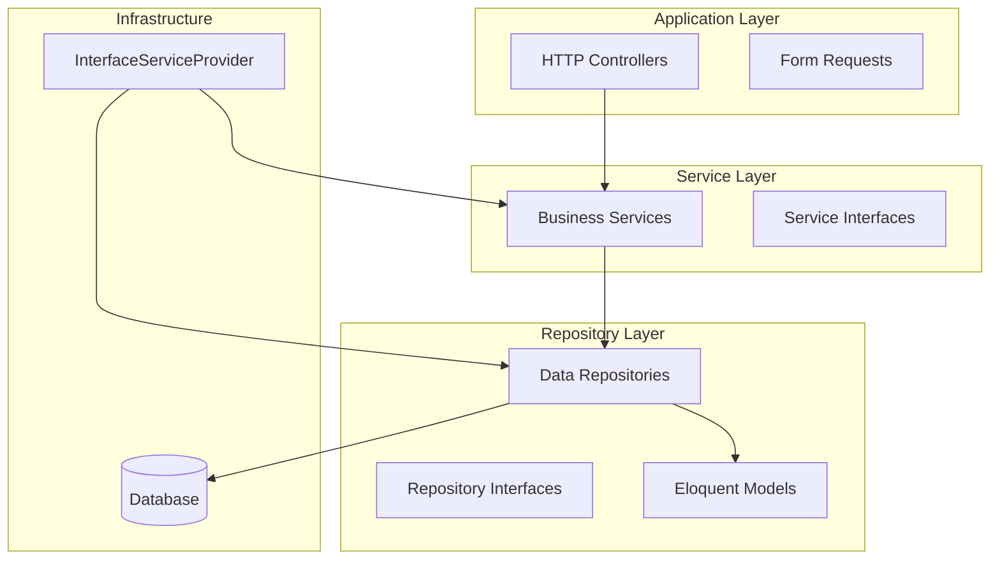

**Diagram sources**
- [InterfaceServiceProvider.php:1-46](file://app/Providers/InterfaceServiceProvider.php#L1-L46)
- [RepositoryInterface.php:1-60](file://app/Contracts/Repositories/RepositoryInterface.php#L1-L60)

**Section sources**
- [InterfaceServiceProvider.php:1-46](file://app/Providers/InterfaceServiceProvider.php#L1-L46)
- [RepositoryInterface.php:1-60](file://app/Contracts/Repositories/RepositoryInterface.php#L1-L60)

## Core Components

### Repository Interface Contract

The foundation of the repository pattern is established through a common interface that defines standardized CRUD operations:

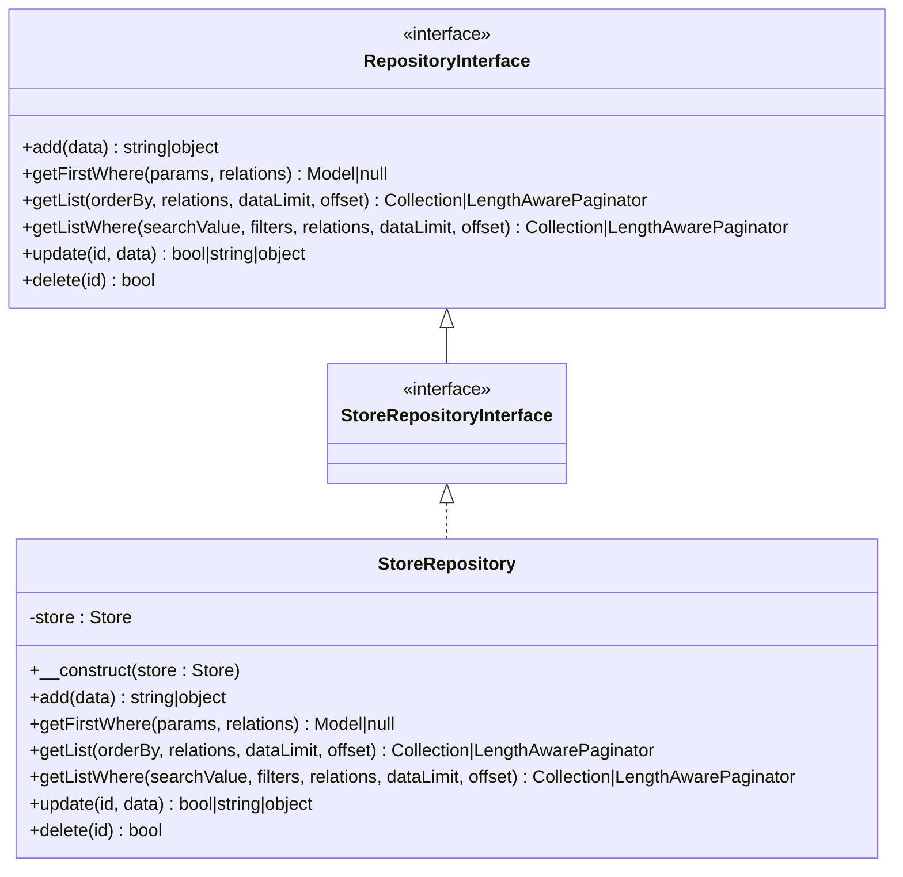

**Diagram sources**
- [RepositoryInterface.php:1-60](file://app/Contracts/Repositories/RepositoryInterface.php#L1-L60)
- [StoreRepositoryInterface.php:1-11](file://app/Contracts/Repositories/StoreRepositoryInterface.php#L1-L11)
- [StoreRepository.php:1-66](file://app/Repositories/StoreRepository.php#L1-L66)

### Service Layer Pattern

Services encapsulate business logic and coordinate multiple repository operations:

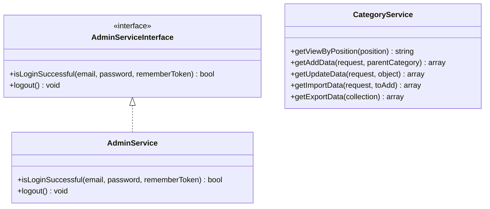

**Diagram sources**
- [AdminServiceInterface.php:1-11](file://app/Contracts/AdminServiceInterface.php#L1-L11)
- [AdminService.php:1-23](file://app/Services/AdminService.php#L1-L23)
- [CategoryService.php:1-101](file://app/Services/CategoryService.php#L1-L101)

**Section sources**
- [RepositoryInterface.php:1-60](file://app/Contracts/Repositories/RepositoryInterface.php#L1-L60)
- [StoreRepositoryInterface.php:1-11](file://app/Contracts/Repositories/StoreRepositoryInterface.php#L1-L11)
- [StoreRepository.php:1-66](file://app/Repositories/StoreRepository.php#L1-L66)
- [AdminServiceInterface.php:1-11](file://app/Contracts/AdminServiceInterface.php#L1-L11)
- [AdminService.php:1-23](file://app/Services/AdminService.php#L1-L23)
- [CategoryService.php:1-101](file://app/Services/CategoryService.php#L1-L101)

## Architecture Overview

The dependency injection system automatically binds interfaces to their implementations:

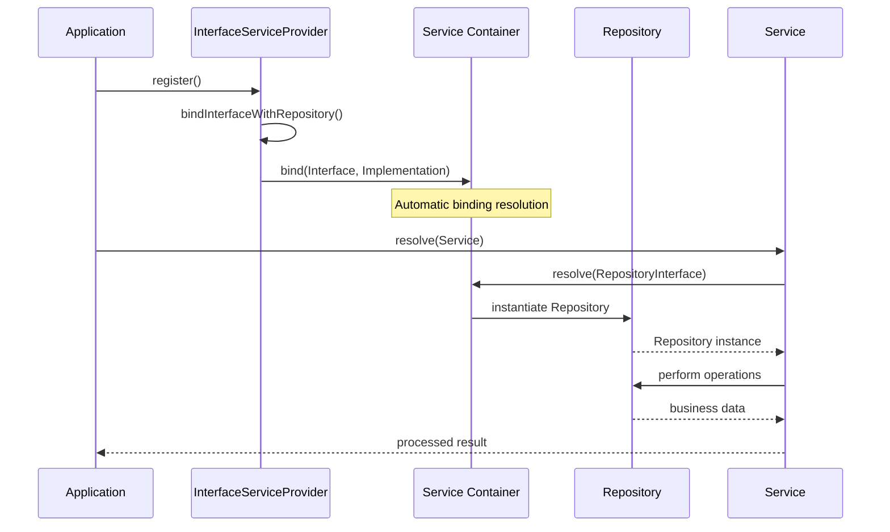

**Diagram sources**
- [InterfaceServiceProvider.php:15-36](file://app/Providers/InterfaceServiceProvider.php#L15-L36)

**Section sources**
- [InterfaceServiceProvider.php:15-36](file://app/Providers/InterfaceServiceProvider.php#L15-L36)

## Detailed Component Analysis

### Repository Implementation Patterns

Repositories implement the standardized interface contract and work with Eloquent models:

#### Store Repository Analysis

The Store repository demonstrates comprehensive CRUD operations with proper data handling:

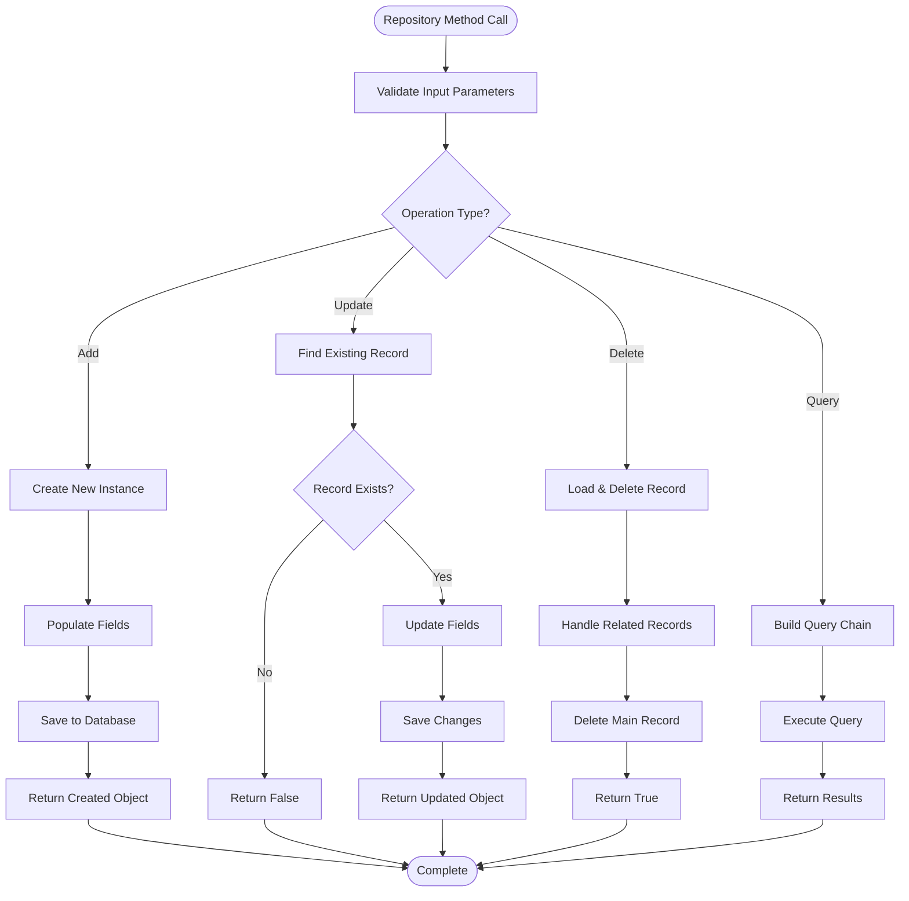

**Diagram sources**
- [StoreRepository.php:17-64](file://app/Repositories/StoreRepository.php#L17-L64)

#### Category Repository Analysis

The Category repository showcases advanced querying capabilities and bulk operations:

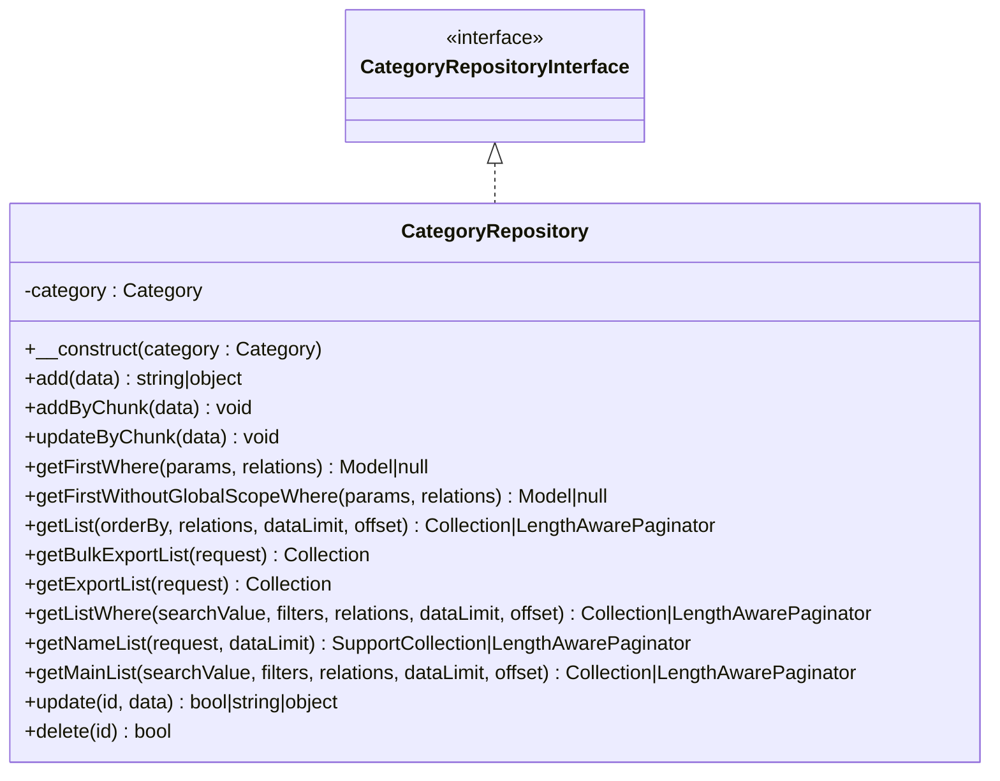

**Diagram sources**
- [CategoryRepository.php:18-175](file://app/Repositories/CategoryRepository.php#L18-L175)

**Section sources**
- [StoreRepository.php:17-64](file://app/Repositories/StoreRepository.php#L17-L64)
- [CategoryRepository.php:18-175](file://app/Repositories/CategoryRepository.php#L18-L175)

### Service Layer Orchestration

Services coordinate multiple repository operations and handle business logic:

#### Order Status Service Analysis

The OrderStatusService demonstrates complex transaction management and coordination:

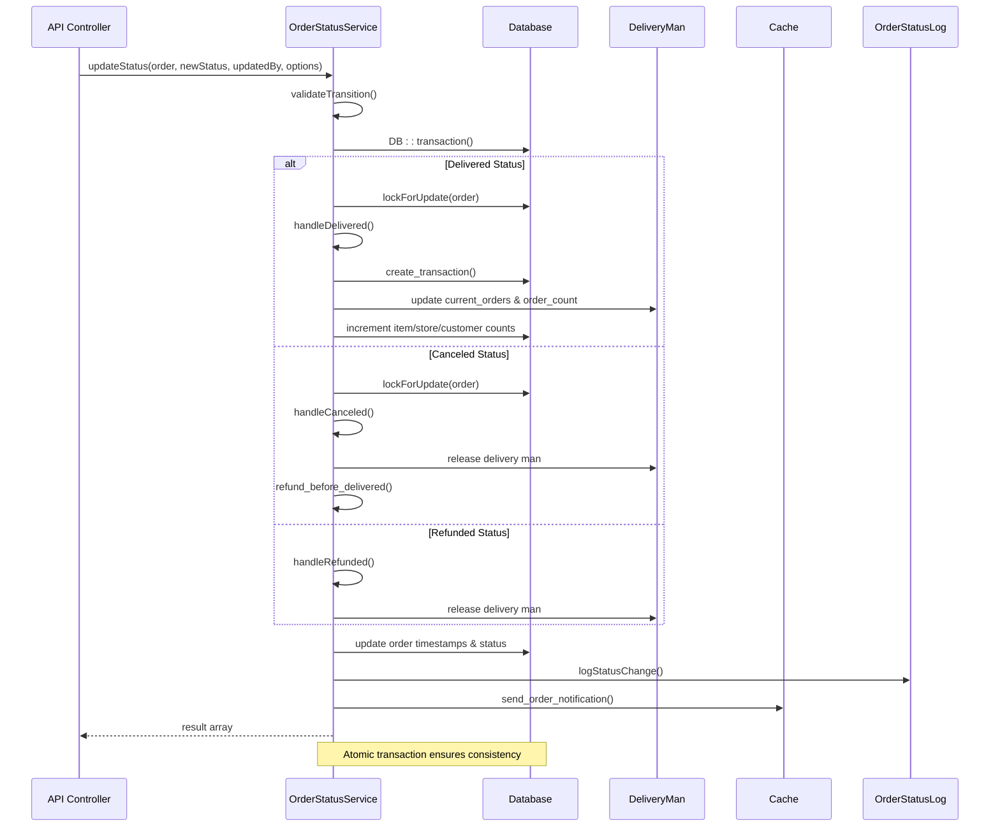

**Diagram sources**
- [OrderStatusService.php:89-156](file://app/Services/OrderStatusService.php#L89-L156)
- [OrderStatusService.php:158-266](file://app/Services/OrderStatusService.php#L158-L266)

#### Security Service Analysis

The OrderSecurityService handles idempotency, rate limiting, and signature verification:

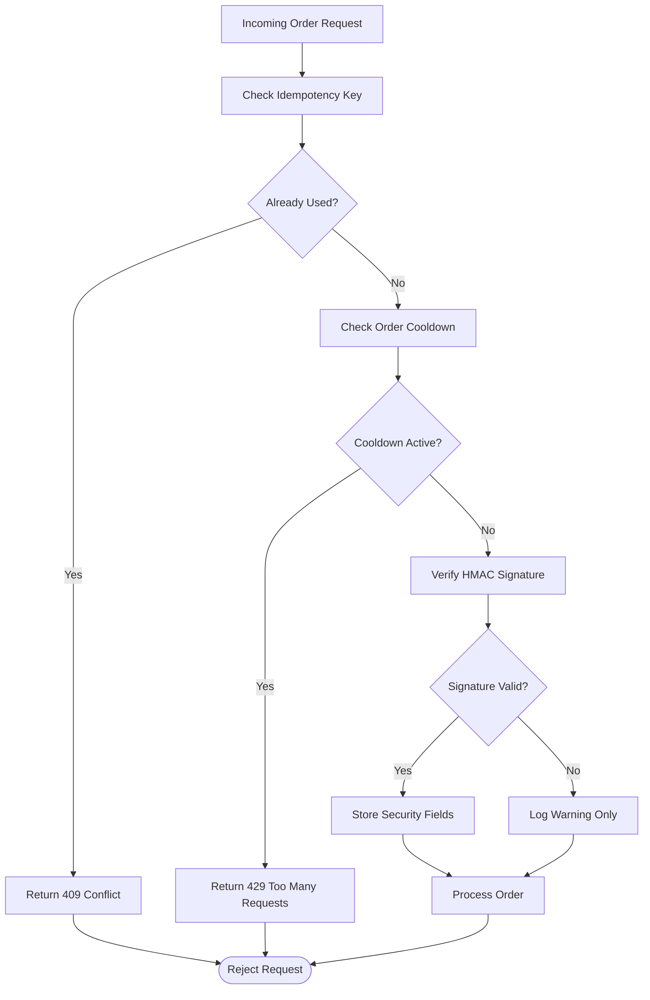

**Diagram sources**
- [OrderSecurityService.php:22-136](file://app/Services/OrderSecurityService.php#L22-L136)

**Section sources**
- [OrderStatusService.php:89-347](file://app/Services/OrderStatusService.php#L89-L347)
- [OrderSecurityService.php:22-136](file://app/Services/OrderSecurityService.php#L22-L136)

## Dependency Injection Patterns

### InterfaceServiceProvider Configuration

The InterfaceServiceProvider automates the binding process between interfaces and implementations:

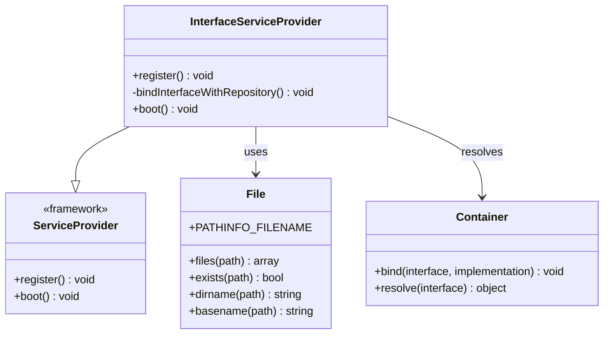

**Diagram sources**
- [InterfaceServiceProvider.php:10-45](file://app/Providers/InterfaceServiceProvider.php#L10-L45)

The provider follows these steps:
1. Scans the Repositories directory for implementation files
2. Dynamically constructs interface names by appending "Interface" to filenames
3. Validates that corresponding interface files exist
4. Registers bindings in the service container

**Section sources**
- [InterfaceServiceProvider.php:15-36](file://app/Providers/InterfaceServiceProvider.php#L15-L36)

### Resolution Mechanism

When services require repositories, Laravel's service container automatically resolves the appropriate implementation based on registered bindings.

## Service Layer Orchestration

### Business Logic Coordination

Services act as orchestrators that:
- Validate business rules and constraints
- Coordinate multiple repository operations
- Handle cross-cutting concerns (logging, notifications)
- Manage transaction boundaries
- Transform data between layers

### Example: Category Management Service

The CategoryService demonstrates service-layer responsibilities:

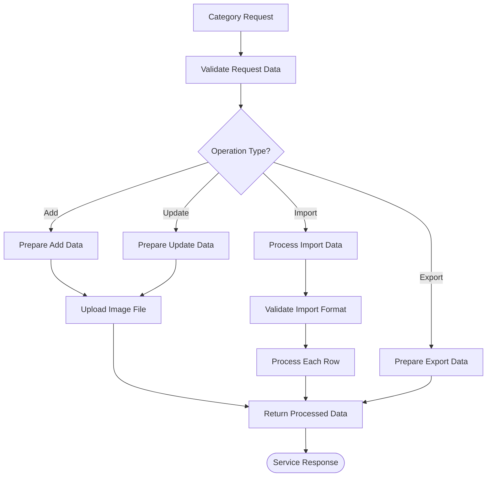

**Diagram sources**
- [CategoryService.php:26-99](file://app/Services/CategoryService.php#L26-L99)

**Section sources**
- [CategoryService.php:14-101](file://app/Services/CategoryService.php#L14-L101)

## Transaction Management

### Atomic Operations

The OrderStatusService demonstrates proper transaction handling:

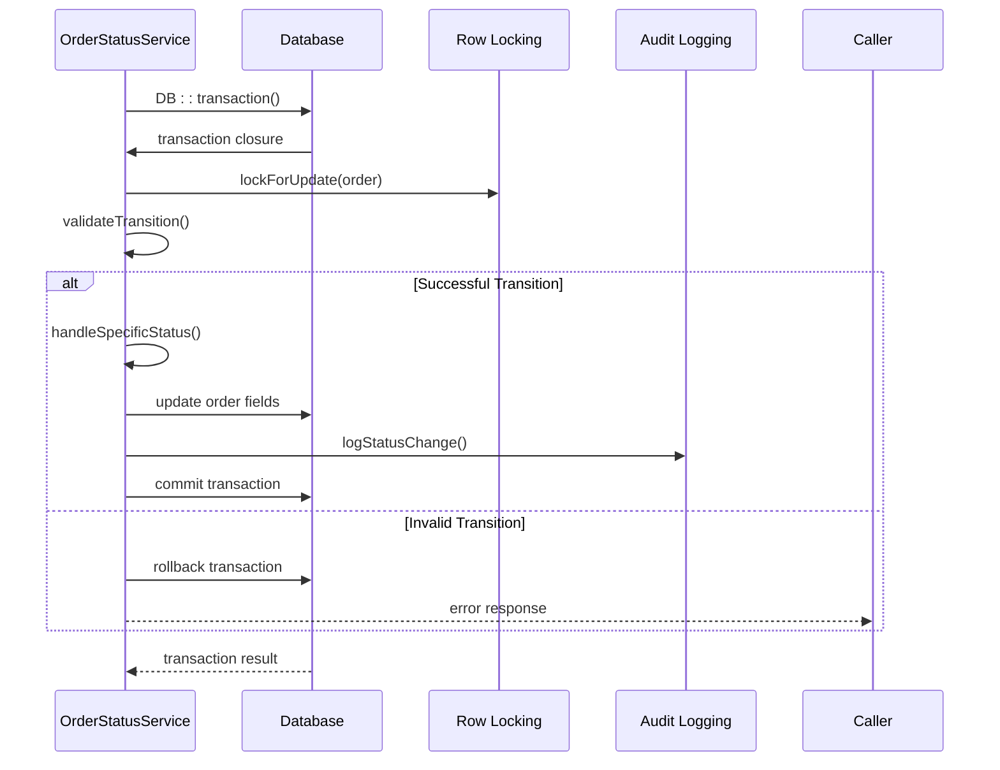

**Diagram sources**
- [OrderStatusService.php:101-156](file://app/Services/OrderStatusService.php#L101-L156)

### Transaction Boundaries

Key transaction management patterns:
- **Atomicity**: All operations succeed or fail together
- **Consistency**: Database constraints maintained throughout
- **Isolation**: Proper locking prevents race conditions
- **Durability**: Changes persist after successful completion

**Section sources**
- [OrderStatusService.php:101-156](file://app/Services/OrderStatusService.php#L101-L156)

## Integration Examples

### Complete Workflow Example

Here's how a typical request flows through the integrated system:

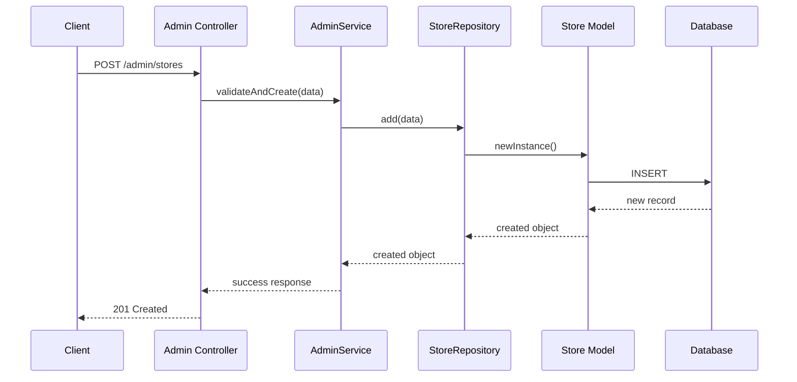

**Diagram sources**
- [AdminService.php:9-15](file://app/Services/AdminService.php#L9-L15)
- [StoreRepository.php:17-25](file://app/Repositories/StoreRepository.php#L17-L25)

### Multi-Repository Coordination

Services can coordinate multiple repositories for complex operations:

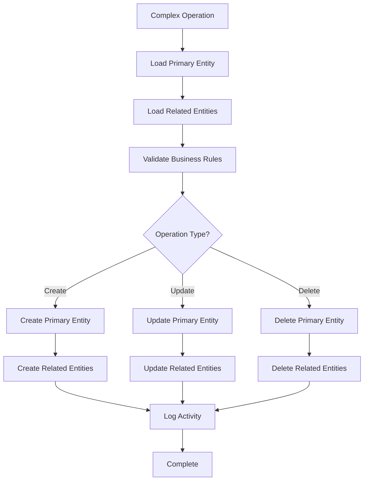

## Best Practices

### Repository Design Principles

1. **Single Responsibility**: Each repository handles one entity type
2. **Interface Segregation**: Use specific interfaces for different operations
3. **Consistent Return Types**: Standardize return types across operations
4. **Query Abstraction**: Hide database-specific logic behind repository methods

### Service Layer Guidelines

1. **Business Logic Only**: Keep pure business logic in services
2. **Transaction Boundaries**: Group related operations in transactions
3. **Error Handling**: Provide meaningful error messages
4. **Logging**: Log important business events and decisions

### Dependency Injection Patterns

1. **Constructor Injection**: Inject repositories into services via constructor
2. **Interface Binding**: Always depend on interfaces, not concrete implementations
3. **Automatic Resolution**: Leverage Laravel's automatic dependency injection
4. **Testing**: Easy mocking of interfaces for unit testing

## Troubleshooting Guide

### Common Issues

#### Repository Binding Failures

**Symptoms**: `Target [Interface] is not instantiable`

**Causes**:
- Missing interface file
- Incorrect namespace
- Provider not registered

**Solutions**:
- Verify interface file exists in Contracts/Repositories
- Check namespace matches expected pattern
- Ensure InterfaceServiceProvider is registered in config/app.php

#### Transaction Rollback Issues

**Symptoms**: Partial updates or inconsistent state

**Causes**:
- Exceptions outside transaction closure
- Long-running operations inside transactions
- Deadlocks from concurrent access

**Solutions**:
- Wrap all database operations in transaction closure
- Minimize transaction scope
- Implement proper error handling
- Use row-level locking for concurrent access

#### Performance Issues

**Symptoms**: Slow response times and high memory usage

**Causes**:
- N+1 query problems
- Unnecessary eager loading
- Large result sets without pagination

**Solutions**:
- Use eager loading for relations
- Implement pagination for list operations
- Optimize queries with proper indexing
- Consider chunked processing for bulk operations

**Section sources**
- [InterfaceServiceProvider.php:20-36](file://app/Providers/InterfaceServiceProvider.php#L20-L36)
- [OrderStatusService.php:101-156](file://app/Services/OrderStatusService.php#L101-L156)

## Conclusion

The Waddy Back application demonstrates a robust repository-service integration pattern that achieves:

- **Clean Separation of Concerns**: Clear boundaries between data access, business logic, and presentation layers
- **Dependency Injection**: Automatic binding and resolution of interfaces to implementations
- **Transaction Management**: Proper atomic operations ensuring data consistency
- **Scalable Architecture**: Extensible patterns supporting future growth and maintenance

This architecture enables maintainable code, comprehensive testing capabilities, and reliable business operation execution while preserving flexibility for future enhancements.