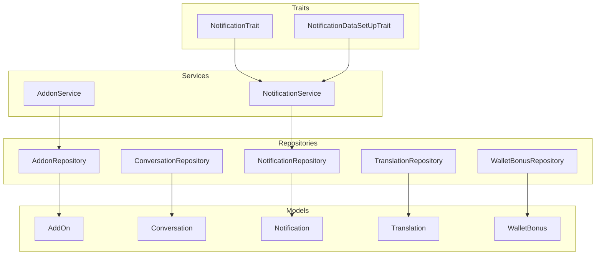
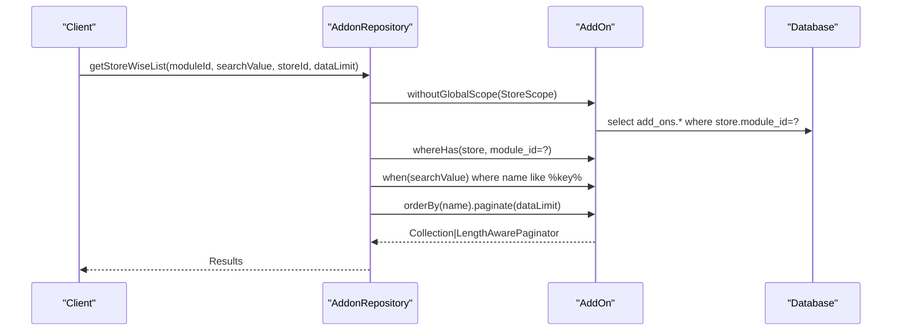
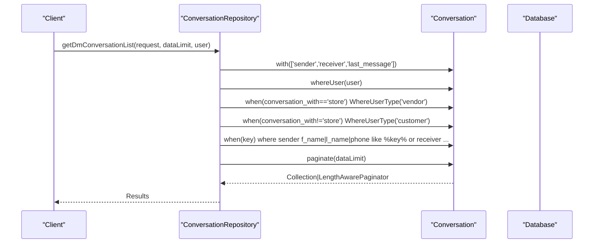
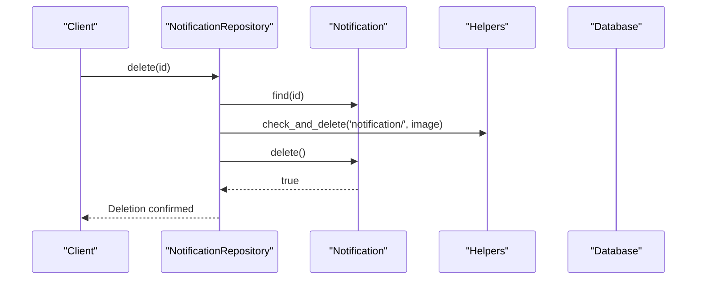
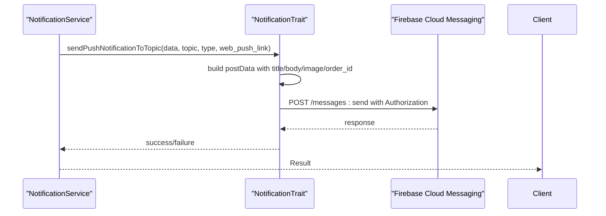
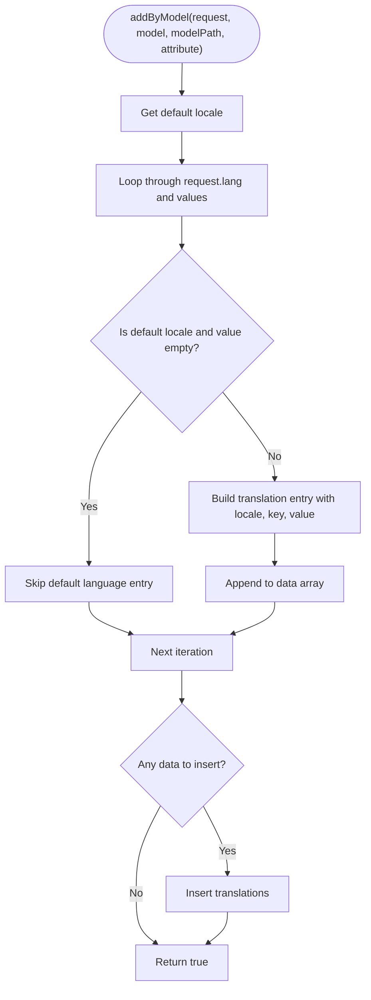
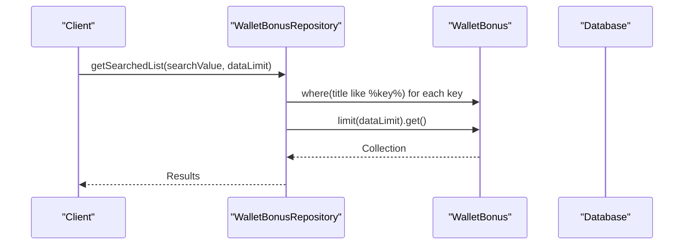
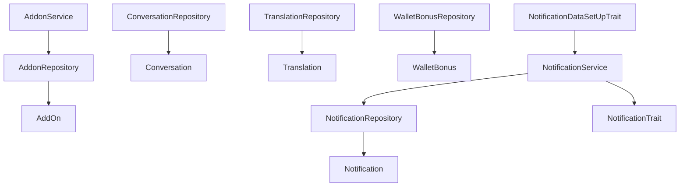

# Specialized Repository Implementations

<cite>
**Referenced Files in This Document**
- [AddonRepository.php](file://app/Repositories/AddonRepository.php)
- [ConversationRepository.php](file://app/Repositories/ConversationRepository.php)
- [NotificationRepository.php](file://app/Repositories/NotificationRepository.php)
- [TranslationRepository.php](file://app/Repositories/TranslationRepository.php)
- [WalletBonusRepository.php](file://app/Repositories/WalletBonusRepository.php)
- [AddOn.php](file://app/Models/AddOn.php)
- [Conversation.php](file://app/Models/Conversation.php)
- [Notification.php](file://app/Models/Notification.php)
- [Translation.php](file://app/Models/Translation.php)
- [WalletBonus.php](file://app/Models/WalletBonus.php)
- [AddonService.php](file://app/Services/AddonService.php)
- [NotificationService.php](file://app/Services/NotificationService.php)
- [NotificationTrait.php](file://app/Traits/NotificationTrait.php)
- [NotificationDataSetUpTrait.php](file://app/Traits/NotificationDataSetUpTrait.php)
- [AddonRepositoryInterface.php](file://app/Contracts/Repositories/AddonRepositoryInterface.php)
</cite>

## Table of Contents
1. [Introduction](#introduction)
2. [Project Structure](#project-structure)
3. [Core Components](#core-components)
4. [Architecture Overview](#architecture-overview)
5. [Detailed Component Analysis](#detailed-component-analysis)
6. [Dependency Analysis](#dependency-analysis)
7. [Performance Considerations](#performance-considerations)
8. [Troubleshooting Guide](#troubleshooting-guide)
9. [Conclusion](#conclusion)

## Introduction
This document analyzes specialized repository implementations in Waddy Back that handle unique business entities: addons, conversations, notifications, translations, and wallet bonuses. It explains how these repositories implement specialized data access patterns, caching strategies, and performance optimizations. It also covers complex relationship handling, multi-language support, and notification routing mechanisms, along with the specific challenges and unique implementation approaches.

## Project Structure
The specialized repositories are located under app/Repositories and correspond to domain models under app/Models. Supporting services and traits under app/Services and app/Traits encapsulate business logic for data preparation, file handling, and notification routing.

**Diagram sources**
- [AddonRepository.php:16-146](file://app/Repositories/AddonRepository.php#L16-L146)
- [ConversationRepository.php:12-147](file://app/Repositories/ConversationRepository.php#L12-L147)
- [NotificationRepository.php:14-89](file://app/Repositories/NotificationRepository.php#L14-L89)
- [TranslationRepository.php:12-111](file://app/Repositories/TranslationRepository.php#L12-L111)
- [WalletBonusRepository.php:11-75](file://app/Repositories/WalletBonusRepository.php#L11-L75)
- [AddOn.php:25-114](file://app/Models/AddOn.php#L25-L114)
- [Conversation.php:25-128](file://app/Models/Conversation.php#L25-L128)
- [Notification.php:26-141](file://app/Models/Notification.php#L26-L141)
- [Translation.php:8-31](file://app/Models/Translation.php#L8-L31)
- [WalletBonus.php:28-136](file://app/Models/WalletBonus.php#L28-L136)
- [AddonService.php:11-113](file://app/Services/AddonService.php#L11-L113)
- [NotificationService.php:7-63](file://app/Services/NotificationService.php#L7-L63)
- [NotificationTrait.php:8-284](file://app/Traits/NotificationTrait.php#L8-L284)
- [NotificationDataSetUpTrait.php:8-1083](file://app/Traits/NotificationDataSetUpTrait.php#L8-L1083)

**Section sources**
- [AddonRepository.php:16-146](file://app/Repositories/AddonRepository.php#L16-L146)
- [ConversationRepository.php:12-147](file://app/Repositories/ConversationRepository.php#L12-L147)
- [NotificationRepository.php:14-89](file://app/Repositories/NotificationRepository.php#L14-L89)
- [TranslationRepository.php:12-111](file://app/Repositories/TranslationRepository.php#L12-L111)
- [WalletBonusRepository.php:11-75](file://app/Repositories/WalletBonusRepository.php#L11-L75)

## Core Components
This section highlights the specialized responsibilities of each repository and their supporting models/services.

- AddonRepository: Manages addon CRUD, store-scoped queries, bulk operations, and export filtering. It handles addon-to-store relationships and integrates with translation and tax scopes.
- ConversationRepository: Handles conversation retrieval with user type scoping, message relationships, and DM-specific filtering.
- NotificationRepository: Manages notification CRUD, image lifecycle via helpers, and export/search capabilities with zone scoping.
- TranslationRepository: Provides translation creation/update by model, handling locale-specific keys and default language fallbacks.
- WalletBonusRepository: Manages bonus CRUD, search, and translation handling with global scope for localized titles/descriptions.

**Section sources**
- [AddonRepository.php:16-146](file://app/Repositories/AddonRepository.php#L16-L146)
- [ConversationRepository.php:12-147](file://app/Repositories/ConversationRepository.php#L12-L147)
- [NotificationRepository.php:14-89](file://app/Repositories/NotificationRepository.php#L14-L89)
- [TranslationRepository.php:12-111](file://app/Repositories/TranslationRepository.php#L12-L111)
- [WalletBonusRepository.php:11-75](file://app/Repositories/WalletBonusRepository.php#L11-L75)

## Architecture Overview
The repositories implement a layered pattern:
- Repository layer: Encapsulates data access and query composition.
- Model layer: Defines relationships, global scopes, and attribute accessors/mutators.
- Service layer: Prepares structured payloads for repositories and handles file uploads.
- Trait layer: Provides reusable notification routing and configuration utilities.

```mermaid
classDiagram
class AddonRepository {
+add(data)
+getFirstWhere(params, relations)
+getList(orderBy, relations, dataLimit, offset)
+getListWhere(searchValue, filters, relations, dataLimit, offset)
+update(id, data)
+delete(id)
+getFirstWithoutGlobalScopeWhere(params, relations)
+getStoreWiseList(moduleId, searchValue, storeId, dataLimit)
+getExportList(moduleId, searchValue, storeId)
+addByChunk(data)
+updateByChunk(data)
+getBulkExportList(request)
}
class ConversationRepository {
+add(data)
+getFirstWhere(params, relations)
+getList(orderBy, relations, dataLimit, offset)
+getListWhere(searchValue, filters, relations, dataLimit, offset)
+update(id, data)
+delete(id)
+getFirstWhereWithScope(params, relations, scopes)
+getListWithScope(orderBy, relations, dataLimit, conversation_with, offset, scopes)
+getListWhereWithScope(searchValue, filters, relations, dataLimit, offset, scopes)
+getDmConversationList(request, dataLimit, user, offset)
}
class NotificationRepository {
+add(data)
+getFirstWhere(params, relations)
+getList(orderBy, relations, dataLimit, offset)
+getListWhere(searchValue, filters, relations, dataLimit, offset)
+update(id, data)
+delete(id)
+getExportList(request)
}
class TranslationRepository {
+addByModel(request, model, modelPath, attribute)
+updateByModel(request, model, modelPath, attribute)
+add(data)
+getFirstWhere(params, relations)
+getList(orderBy, relations, dataLimit, offset)
+getListWhere(searchValue, filters, relations, dataLimit, offset)
+update(id, data)
+delete(id)
}
class WalletBonusRepository {
+add(data)
+getFirstWhere(params, relations)
+getList(orderBy, relations, dataLimit, offset)
+getListWhere(searchValue, filters, relations, dataLimit, offset)
+update(id, data)
+delete(id)
+getFirstWithoutGlobalScopeWhere(params, relations)
+getSearchedList(searchValue, dataLimit)
}
class AddOn {
+translations()
+getNameAttribute(value)
+active()
+store()
+taxVats()
}
class Conversation {
+messages()
+sender()
+receiver()
+last_message()
+whereUser(query, user_id)
+whereConversation(query, sender_id, receiver_id)
+whereUserType(query, type)
}
class Notification {
+getDataAttribute()
+zone()
+active()
+getCreatedAtAttribute(value)
+getImageFullUrlAttribute()
+storage()
}
class Translation {
+translationable()
}
class WalletBonus {
+translations()
+getTitleAttribute(value)
+getDescriptionAttribute(value)
+active()
+running()
}
AddonRepository --> AddOn : "uses"
ConversationRepository --> Conversation : "uses"
NotificationRepository --> Notification : "uses"
TranslationRepository --> Translation : "uses"
WalletBonusRepository --> WalletBonus : "uses"
```

**Diagram sources**
- [AddonRepository.php:16-146](file://app/Repositories/AddonRepository.php#L16-L146)
- [ConversationRepository.php:12-147](file://app/Repositories/ConversationRepository.php#L12-L147)
- [NotificationRepository.php:14-89](file://app/Repositories/NotificationRepository.php#L14-L89)
- [TranslationRepository.php:12-111](file://app/Repositories/TranslationRepository.php#L12-L111)
- [WalletBonusRepository.php:11-75](file://app/Repositories/WalletBonusRepository.php#L11-L75)
- [AddOn.php:25-114](file://app/Models/AddOn.php#L25-L114)
- [Conversation.php:25-128](file://app/Models/Conversation.php#L25-L128)
- [Notification.php:26-141](file://app/Models/Notification.php#L26-L141)
- [Translation.php:8-31](file://app/Models/Translation.php#L8-L31)
- [WalletBonus.php:28-136](file://app/Models/WalletBonus.php#L28-L136)

## Detailed Component Analysis

### Addon Repository
The AddonRepository specializes in managing addons with store scoping, translation-aware queries, and bulk operations. It supports:
- Store-wise filtering via module/store joins.
- Search across addon names with pagination.
- Bulk insert/upsert via chunked operations.
- Export filtering by date range or ID ranges with module scoping.

**Diagram sources**
- [AddonRepository.php:77-94](file://app/Repositories/AddonRepository.php#L77-L94)
- [AddOn.php:88-91](file://app/Models/AddOn.php#L88-L91)

Key implementation details:
- Store scoping and translation scoping are disabled for administrative exports and store-wise listings.
- Chunked inserts/upserts optimize bulk data ingestion.
- Global scopes on the model ensure localized names and store/zone visibility.

**Section sources**
- [AddonRepository.php:77-144](file://app/Repositories/AddonRepository.php#L77-L144)
- [AddOn.php:96-108](file://app/Models/AddOn.php#L96-L108)

### Conversation Repository
The ConversationRepository manages conversations with user type scoping and DM-specific filtering. It supports:
- Retrieval by user ID and user type.
- Search across sender/receiver names/phones.
- Paginated lists with optional "all" mode.

**Diagram sources**
- [ConversationRepository.php:117-146](file://app/Repositories/ConversationRepository.php#L117-L146)
- [Conversation.php:95-127](file://app/Models/Conversation.php#L95-L127)

Key implementation details:
- Scope methods encapsulate common filters for user and user type.
- Relationship eager loading optimizes downstream message rendering.

**Section sources**
- [ConversationRepository.php:117-146](file://app/Repositories/ConversationRepository.php#L117-L146)
- [Conversation.php:95-127](file://app/Models/Conversation.php#L95-L127)

### Notification Repository
The NotificationRepository manages notifications with image lifecycle handling and export/search capabilities:
- Image deletion via helper utilities.
- Zone scoping via global model scope.
- Topic-based routing for push notifications.

**Diagram sources**
- [NotificationRepository.php:65-74](file://app/Repositories/NotificationRepository.php#L65-L74)
- [Notification.php:114-140](file://app/Models/Notification.php#L114-L140)

Additional notification routing flow:

**Diagram sources**
- [NotificationService.php:45-60](file://app/Services/NotificationService.php#L45-L60)
- [NotificationTrait.php:10-129](file://app/Traits/NotificationTrait.php#L10-L129)

Key implementation details:
- Global scope ensures storage metadata is loaded for image URLs.
- NotificationService prepares topic names based on target audience and zone selection.
- NotificationTrait handles JWT-based authentication and HTTP posting to FCM.

**Section sources**
- [NotificationRepository.php:65-88](file://app/Repositories/NotificationRepository.php#L65-L88)
- [Notification.php:114-140](file://app/Models/Notification.php#L114-L140)
- [NotificationService.php:45-60](file://app/Services/NotificationService.php#L45-L60)
- [NotificationTrait.php:215-248](file://app/Traits/NotificationTrait.php#L215-L248)

### Translation Repository
The TranslationRepository centralizes translation creation and updates for morphable models:
- Adds translations keyed by locale and attribute.
- Updates existing translations using upsert logic.
- Skips default language entries when empty to maintain consistency.

**Diagram sources**
- [TranslationRepository.php:19-50](file://app/Repositories/TranslationRepository.php#L19-L50)
- [Translation.php:27-30](file://app/Models/Translation.php#L27-L30)

Key implementation details:
- Uses morphMany relationships to attach translations to any translatable model.
- Ensures default language fallback behavior aligns with request values.

**Section sources**
- [TranslationRepository.php:19-80](file://app/Repositories/TranslationRepository.php#L19-L80)
- [Translation.php:27-30](file://app/Models/Translation.php#L27-L30)

### Wallet Bonus Repository
The WalletBonusRepository manages bonus CRUD with search and translation handling:
- Search across titles with limit-based retrieval.
- Translation-aware attribute accessors on the model.
- Global translate scope for localized titles/descriptions.

**Diagram sources**
- [WalletBonusRepository.php:66-74](file://app/Repositories/WalletBonusRepository.php#L66-L74)
- [WalletBonus.php:130-135](file://app/Models/WalletBonus.php#L130-L135)

Key implementation details:
- Global translate scope ensures localized titles/descriptions are returned.
- Running scope on the model filters bonuses currently within start/end dates.

**Section sources**
- [WalletBonusRepository.php:66-74](file://app/Repositories/WalletBonusRepository.php#L66-L74)
- [WalletBonus.php:128-135](file://app/Models/WalletBonus.php#L128-L135)

## Dependency Analysis
The repositories depend on their respective models, which define relationships and global scopes. Services and traits provide cross-cutting concerns like file handling and notification routing.

**Diagram sources**
- [AddonRepository.php:16-146](file://app/Repositories/AddonRepository.php#L16-L146)
- [ConversationRepository.php:12-147](file://app/Repositories/ConversationRepository.php#L12-L147)
- [NotificationRepository.php:14-89](file://app/Repositories/NotificationRepository.php#L14-L89)
- [TranslationRepository.php:12-111](file://app/Repositories/TranslationRepository.php#L12-L111)
- [WalletBonusRepository.php:11-75](file://app/Repositories/WalletBonusRepository.php#L11-L75)
- [AddonService.php:11-113](file://app/Services/AddonService.php#L11-L113)
- [NotificationService.php:7-63](file://app/Services/NotificationService.php#L7-L63)
- [NotificationTrait.php:8-284](file://app/Traits/NotificationTrait.php#L8-L284)
- [NotificationDataSetUpTrait.php:8-1083](file://app/Traits/NotificationDataSetUpTrait.php#L8-L1083)

**Section sources**
- [AddonRepositoryInterface.php:9-46](file://app/Contracts/Repositories/AddonRepositoryInterface.php#L9-L46)

## Performance Considerations
- Pagination: All repositories use paginate for list operations to avoid large result sets.
- Eager loading: ConversationRepository eagerly loads related entities to reduce N+1 queries.
- Chunked operations: AddonRepository performs chunked inserts/upserts to handle bulk data efficiently.
- Global scopes: Models apply translate and zone scopes to minimize repeated joins and ensure consistent localization.
- Index usage: Models include indexes on frequently queried columns (e.g., items, reviews, wishlists) to improve search performance.

[No sources needed since this section provides general guidance]

## Troubleshooting Guide
Common issues and resolutions:
- Notification delivery failures: Verify FCM project credentials and network connectivity. Check logs for HTTP errors and invalid tokens.
- Translation inconsistencies: Ensure default language entries are present when required and that locale keys match supported languages.
- Addon store scoping: Administrative actions should bypass store/global scopes to prevent unintended filtering.
- Conversation search failures: Confirm user type filters and search term formatting for name/phone matching.

**Section sources**
- [NotificationTrait.php:231-247](file://app/Traits/NotificationTrait.php#L231-L247)
- [TranslationRepository.php:19-50](file://app/Repositories/TranslationRepository.php#L19-L50)
- [AddonRepository.php:72-75](file://app/Repositories/AddonRepository.php#L72-L75)
- [ConversationRepository.php:117-146](file://app/Repositories/ConversationRepository.php#L117-L146)

## Conclusion
These specialized repositories implement robust data access patterns tailored to complex domains:
- Addons leverage store/module scoping and bulk operations.
- Conversations use user-type scoping and DM-specific filters.
- Notifications integrate image lifecycle management and FCM routing.
- Translations provide flexible, locale-aware attribute updates.
- Wallet bonuses utilize running-date scoping and localized titles/descriptions.

Together, they balance performance, maintainability, and extensibility while addressing unique business requirements.