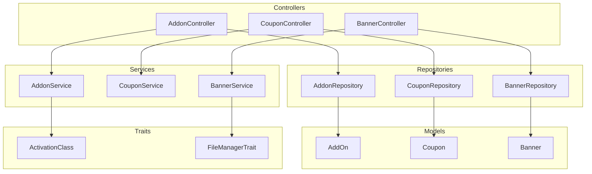
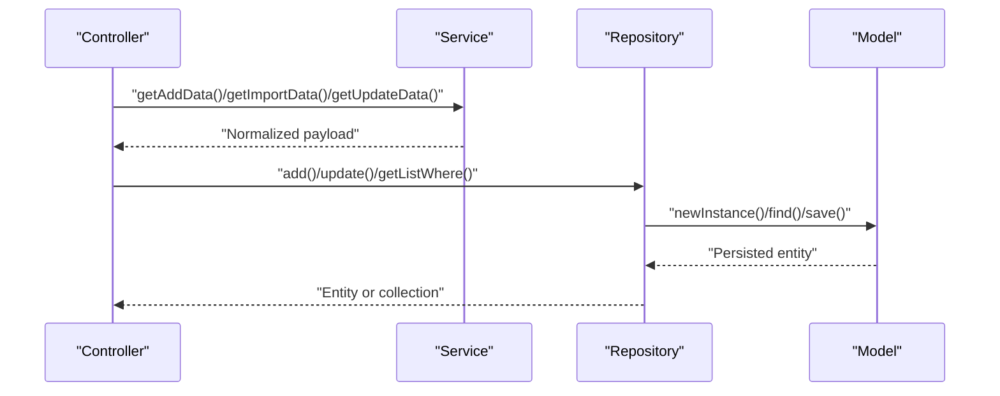
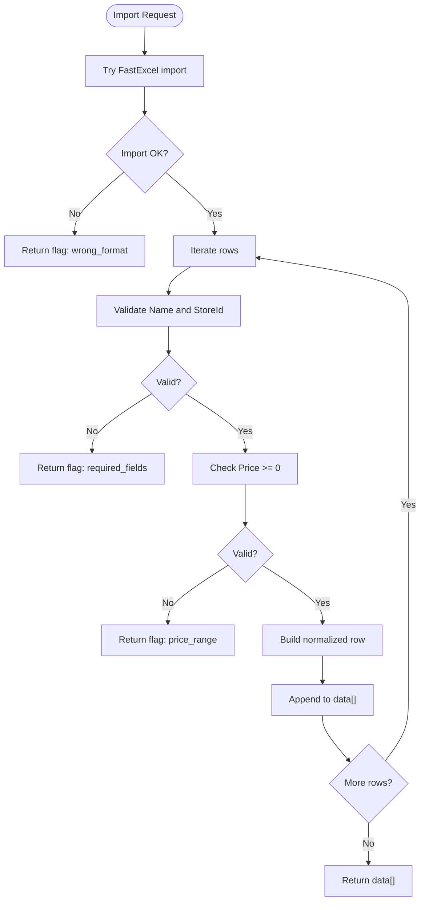
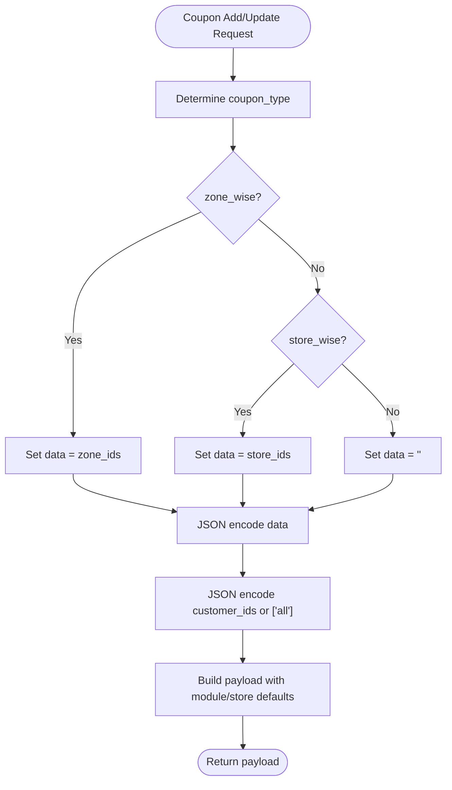
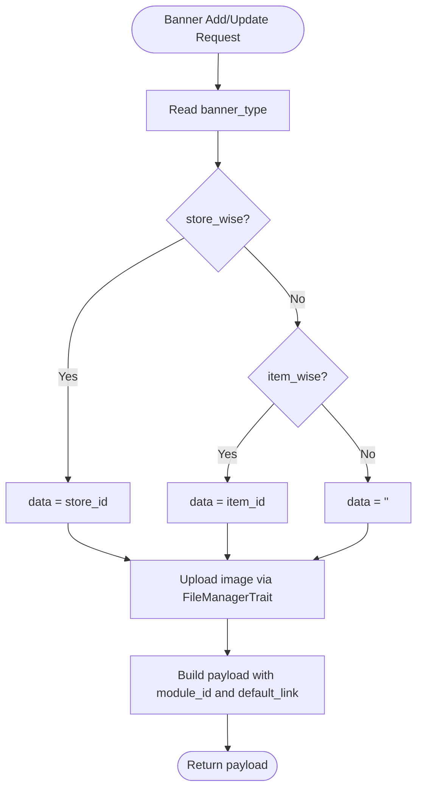
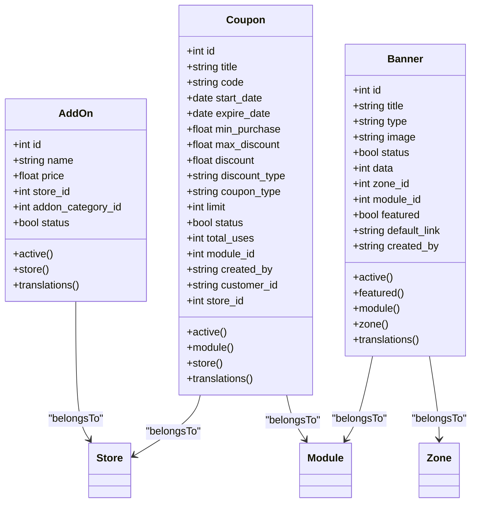
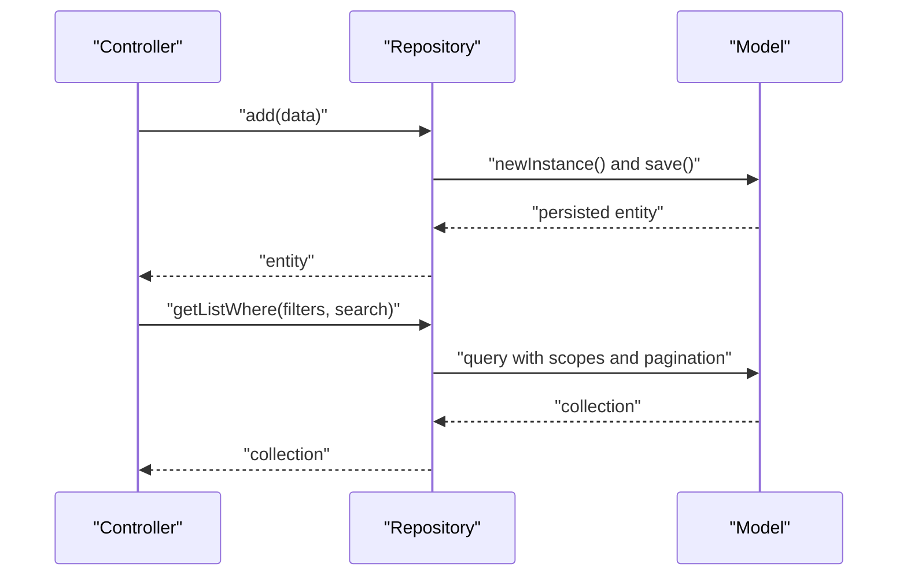
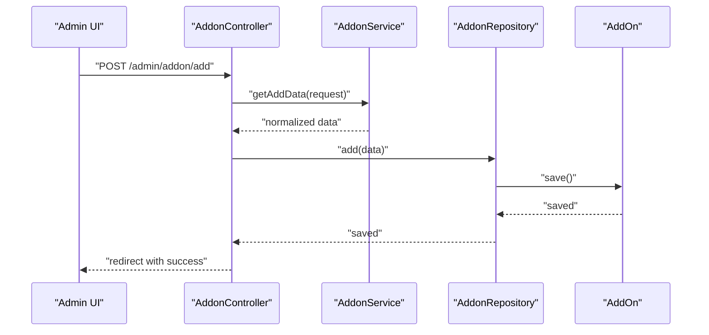
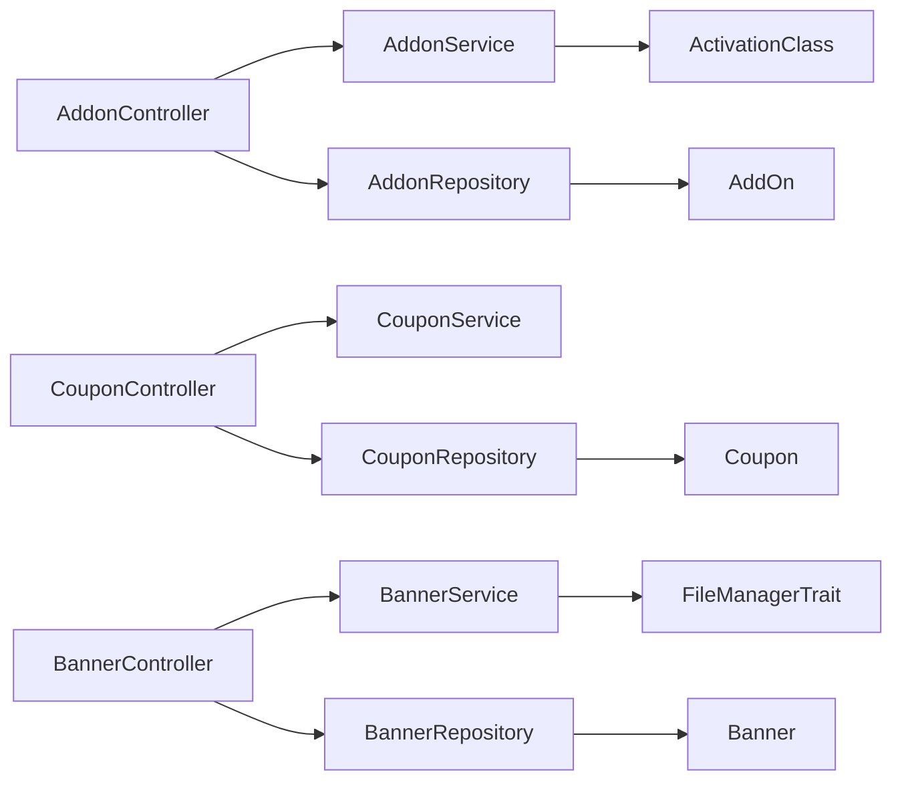

# Addon and Coupon Services

<cite>
**Referenced Files in This Document**
- [AddonService.php](file://app/Services/AddonService.php)
- [CouponService.php](file://app/Services/CouponService.php)
- [BannerService.php](file://app/Services/BannerService.php)
- [AddonRepository.php](file://app/Repositories/AddonRepository.php)
- [CouponRepository.php](file://app/Repositories/CouponRepository.php)
- [BannerRepository.php](file://app/Repositories/BannerRepository.php)
- [AddOn.php](file://app/Models/AddOn.php)
- [Coupon.php](file://app/Models/Coupon.php)
- [Banner.php](file://app/Models/Banner.php)
- [ActivationClass.php](file://app/Traits/ActivationClass.php)
- [FileManagerTrait.php](file://app/Traits/FileManagerTrait.php)
- [AddonController.php](file://app/Http/Controllers/Admin/Item/AddonController.php)
- [CouponController.php](file://app/Http/Controllers/Admin/Coupon/CouponController.php)
- [BannerController.php](file://app/Http/Controllers/Admin/Banner/BannerController.php)
</cite>

## Table of Contents
1. [Introduction](#introduction)
2. [Project Structure](#project-structure)
3. [Core Components](#core-components)
4. [Architecture Overview](#architecture-overview)
5. [Detailed Component Analysis](#detailed-component-analysis)
6. [Dependency Analysis](#dependency-analysis)
7. [Performance Considerations](#performance-considerations)
8. [Troubleshooting Guide](#troubleshooting-guide)
9. [Conclusion](#conclusion)
10. [Appendices](#appendices)

## Introduction
This document explains the addon, coupon, and banner services used for managing additional services, discount coupons, and promotional banners. It covers:
- AddonService for addon creation, import/export, and activation handling
- CouponService for coupon metadata assembly and persistence
- BannerService for banner creation, updates, and image management
It also documents repository-level operations, model-level scopes and relationships, and controller-level usage patterns. Examples include addon pricing calculation considerations, coupon usage tracking via model attributes, and banner rotation logic via featured flags and module scoping.

## Project Structure
The relevant components are organized by domain:
- Services: encapsulate business logic for data shaping and external integrations
- Repositories: handle persistence and query composition
- Models: define attributes, casts, scopes, and relationships
- Traits: reusable cross-cutting concerns (activation and file management)
- Controllers: orchestrate requests, delegate to services/repositories, and render views/API responses

**Diagram sources**
- [AddonController.php:42-280](file://app/Http/Controllers/Admin/Item/AddonController.php#L42-L280)
- [CouponController.php:29-128](file://app/Http/Controllers/Admin/Coupon/CouponController.php#L29-L128)
- [BannerController.php:22-113](file://app/Http/Controllers/Admin/Banner/BannerController.php#L22-L113)
- [AddonService.php:11-114](file://app/Services/AddonService.php#L11-L114)
- [CouponService.php:5-42](file://app/Services/CouponService.php#L5-L42)
- [BannerService.php:8-38](file://app/Services/BannerService.php#L8-L38)
- [AddonRepository.php:16-147](file://app/Repositories/AddonRepository.php#L16-L147)
- [CouponRepository.php:13-94](file://app/Repositories/CouponRepository.php#L13-L94)
- [BannerRepository.php:14-89](file://app/Repositories/BannerRepository.php#L14-L89)
- [AddOn.php:25-115](file://app/Models/AddOn.php#L25-L115)
- [Coupon.php:36-151](file://app/Models/Coupon.php#L36-L151)
- [Banner.php:33-195](file://app/Models/Banner.php#L33-L195)
- [ActivationClass.php:8-79](file://app/Traits/ActivationClass.php#L8-L79)
- [FileManagerTrait.php:8-50](file://app/Traits/FileManagerTrait.php#L8-L50)

**Section sources**
- [AddonService.php:11-114](file://app/Services/AddonService.php#L11-L114)
- [CouponService.php:5-42](file://app/Services/CouponService.php#L5-L42)
- [BannerService.php:8-38](file://app/Services/BannerService.php#L8-L38)
- [AddonRepository.php:16-147](file://app/Repositories/AddonRepository.php#L16-L147)
- [CouponRepository.php:13-94](file://app/Repositories/CouponRepository.php#L13-L94)
- [BannerRepository.php:14-89](file://app/Repositories/BannerRepository.php#L14-L89)
- [AddOn.php:25-115](file://app/Models/AddOn.php#L25-L115)
- [Coupon.php:36-151](file://app/Models/Coupon.php#L36-L151)
- [Banner.php:33-195](file://app/Models/Banner.php#L33-L195)
- [ActivationClass.php:8-79](file://app/Traits/ActivationClass.php#L8-L79)
- [FileManagerTrait.php:8-50](file://app/Traits/FileManagerTrait.php#L8-L50)
- [AddonController.php:42-280](file://app/Http/Controllers/Admin/Item/AddonController.php#L42-L280)
- [CouponController.php:29-128](file://app/Http/Controllers/Admin/Coupon/CouponController.php#L29-L128)
- [BannerController.php:22-113](file://app/Http/Controllers/Admin/Banner/BannerController.php#L22-L113)

## Core Components
- AddonService
  - Builds normalized addon data from requests
  - Handles bulk import validation and transformation
  - Provides bulk export mapping
  - Manages addon activation lifecycle via activation trait
- CouponService
  - Assembles coupon metadata including type-specific targeting (zone/store)
  - Encodes customer and target lists as JSON
  - Sets module-aware defaults and ownership
- BannerService
  - Constructs banner payload including image upload via file manager trait
  - Supports update logic preserving existing images when not provided
  - Encodes type-specific targets (store/item) into data field

**Section sources**
- [AddonService.php:15-114](file://app/Services/AddonService.php#L15-L114)
- [CouponService.php:8-38](file://app/Services/CouponService.php#L8-L38)
- [BannerService.php:12-35](file://app/Services/BannerService.php#L12-L35)
- [ActivationClass.php:52-77](file://app/Traits/ActivationClass.php#L52-L77)
- [FileManagerTrait.php:10-41](file://app/Traits/FileManagerTrait.php#L10-L41)

## Architecture Overview
The services are consumed by controllers, which delegate persistence to repositories. Models define attributes, scopes, and relationships. Traits provide shared capabilities for activation and file handling.

**Diagram sources**
- [AddonController.php:82-105](file://app/Http/Controllers/Admin/Item/AddonController.php#L82-L105)
- [CouponController.php:60-66](file://app/Http/Controllers/Admin/Coupon/CouponController.php#L60-L66)
- [BannerController.php:52-58](file://app/Http/Controllers/Admin/Banner/BannerController.php#L52-L58)
- [AddonService.php:15-58](file://app/Services/AddonService.php#L15-L58)
- [CouponService.php:8-38](file://app/Services/CouponService.php#L8-L38)
- [BannerService.php:12-35](file://app/Services/BannerService.php#L12-L35)
- [AddonRepository.php:22-30](file://app/Repositories/AddonRepository.php#L22-L30)
- [CouponRepository.php:19-27](file://app/Repositories/CouponRepository.php#L19-L27)
- [BannerRepository.php:20-28](file://app/Repositories/BannerRepository.php#L20-L28)
- [AddOn.php:32-38](file://app/Models/AddOn.php#L32-L38)
- [Coupon.php:43-62](file://app/Models/Coupon.php#L43-L62)
- [Banner.php:41-52](file://app/Models/Banner.php#L41-L52)

## Detailed Component Analysis

### AddonService
AddonService focuses on:
- Normalizing addon creation data from multilingual and structured requests
- Bulk import validation (file format, required fields, price range)
- Bulk export mapping for admin reporting
- Activation process integration via activation trait

**Diagram sources**
- [AddonService.php:25-58](file://app/Services/AddonService.php#L25-L58)

**Section sources**
- [AddonService.php:15-114](file://app/Services/AddonService.php#L15-L114)

### CouponService
CouponService constructs coupon payloads:
- Determines target scope (zone-wise vs store-wise) and serializes identifiers
- Encodes customer lists and module/store associations
- Applies discount type semantics and default statuses

**Diagram sources**
- [CouponService.php:8-38](file://app/Services/CouponService.php#L8-L38)

**Section sources**
- [CouponService.php:8-38](file://app/Services/CouponService.php#L8-L38)

### BannerService
BannerService handles:
- Image upload and update using FileManagerTrait
- Type-specific target encoding (store_id or item_id)
- Module-aware persistence and default link assignment

**Diagram sources**
- [BannerService.php:12-35](file://app/Services/BannerService.php#L12-L35)
- [FileManagerTrait.php:10-41](file://app/Traits/FileManagerTrait.php#L10-L41)

**Section sources**
- [BannerService.php:12-35](file://app/Services/BannerService.php#L12-L35)
- [FileManagerTrait.php:10-41](file://app/Traits/FileManagerTrait.php#L10-L41)

### Models and Scopes
- AddOn
  - Attributes include name, price, store association, category, and status
  - Active scope and localization via translations
  - Store and zone global scopes applied automatically
- Coupon
  - Attributes include title, code, validity dates, min/max purchase, discount, discount type, limits, and usage counters
  - Active and module scoping, localized titles
  - Store relationship for store-wise coupons
- Banner
  - Attributes include title, type, image, status, data, zone/module linkage, featured flag, default link, and creator
  - Active and featured scopes, localized titles
  - Zone and module relationships

**Diagram sources**
- [AddOn.php:25-115](file://app/Models/AddOn.php#L25-L115)
- [Coupon.php:36-151](file://app/Models/Coupon.php#L36-L151)
- [Banner.php:33-195](file://app/Models/Banner.php#L33-L195)

**Section sources**
- [AddOn.php:25-115](file://app/Models/AddOn.php#L25-L115)
- [Coupon.php:36-151](file://app/Models/Coupon.php#L36-L151)
- [Banner.php:33-195](file://app/Models/Banner.php#L33-L195)

### Repositories and Persistence
- AddonRepository
  - CRUD operations with store-scoped deletions and translation cleanup
  - Store-wise listing with module filtering and search
  - Bulk insert/update by chunk for performance
- CouponRepository
  - CRUD operations with translation cleanup
  - Search across title/code with pagination
  - Export list filtered by module and creator
- BannerRepository
  - CRUD operations with image deletion and translation cleanup
  - Search within module and paginated listing

**Diagram sources**
- [AddonRepository.php:22-50](file://app/Repositories/AddonRepository.php#L22-L50)
- [CouponRepository.php:39-53](file://app/Repositories/CouponRepository.php#L39-L53)
- [BannerRepository.php:40-52](file://app/Repositories/BannerRepository.php#L40-L52)

**Section sources**
- [AddonRepository.php:16-147](file://app/Repositories/AddonRepository.php#L16-L147)
- [CouponRepository.php:13-94](file://app/Repositories/CouponRepository.php#L13-L94)
- [BannerRepository.php:14-89](file://app/Repositories/BannerRepository.php#L14-L89)

### Controllers and Usage Patterns
- AddonController
  - Uses AddonService to normalize data and AddonRepository for persistence
  - Supports bulk import/export, status toggles, and tax association when applicable
- CouponController
  - Uses CouponService to assemble coupon payloads and CouponRepository for persistence
  - Supports export and view details including selected customers and zones
- BannerController
  - Uses BannerService to build payloads and BannerRepository for persistence
  - Supports search, status toggle, and featured toggle

**Diagram sources**
- [AddonController.php:82-105](file://app/Http/Controllers/Admin/Item/AddonController.php#L82-L105)
- [AddonService.php:15-23](file://app/Services/AddonService.php#L15-L23)
- [AddonRepository.php:22-30](file://app/Repositories/AddonRepository.php#L22-L30)
- [AddOn.php:32-38](file://app/Models/AddOn.php#L32-L38)

**Section sources**
- [AddonController.php:42-280](file://app/Http/Controllers/Admin/Item/AddonController.php#L42-L280)
- [CouponController.php:29-128](file://app/Http/Controllers/Admin/Coupon/CouponController.php#L29-L128)
- [BannerController.php:22-113](file://app/Http/Controllers/Admin/Banner/BannerController.php#L22-L113)

## Dependency Analysis
- Services depend on traits for activation and file management
- Controllers depend on services and repositories
- Repositories depend on models and Laravel’s Eloquent
- Models rely on global scopes for localization and scoping

**Diagram sources**
- [AddonController.php:46-51](file://app/Http/Controllers/Admin/Item/AddonController.php#L46-L51)
- [CouponController.php:31-36](file://app/Http/Controllers/Admin/Coupon/CouponController.php#L31-L36)
- [BannerController.php:24-29](file://app/Http/Controllers/Admin/Banner/BannerController.php#L24-L29)
- [AddonService.php](file://app/Services/AddonService.php#L13)
- [BannerService.php](file://app/Services/BannerService.php#L10)
- [ActivationClass.php](file://app/Traits/ActivationClass.php#L8)
- [FileManagerTrait.php](file://app/Traits/FileManagerTrait.php#L8)
- [AddonRepository.php](file://app/Repositories/AddonRepository.php#L16)
- [CouponRepository.php](file://app/Repositories/CouponRepository.php#L13)
- [BannerRepository.php](file://app/Repositories/BannerRepository.php#L14)
- [AddOn.php](file://app/Models/AddOn.php#L25)
- [Coupon.php](file://app/Models/Coupon.php#L36)
- [Banner.php](file://app/Models/Banner.php#L33)

**Section sources**
- [AddonController.php:46-51](file://app/Http/Controllers/Admin/Item/AddonController.php#L46-L51)
- [CouponController.php:31-36](file://app/Http/Controllers/Admin/Coupon/CouponController.php#L31-L36)
- [BannerController.php:24-29](file://app/Http/Controllers/Admin/Banner/BannerController.php#L24-L29)
- [AddonService.php](file://app/Services/AddonService.php#L13)
- [BannerService.php](file://app/Services/BannerService.php#L10)
- [ActivationClass.php](file://app/Traits/ActivationClass.php#L8)
- [FileManagerTrait.php](file://app/Traits/FileManagerTrait.php#L8)
- [AddonRepository.php](file://app/Repositories/AddonRepository.php#L16)
- [CouponRepository.php](file://app/Repositories/CouponRepository.php#L13)
- [BannerRepository.php](file://app/Repositories/BannerRepository.php#L14)
- [AddOn.php](file://app/Models/AddOn.php#L25)
- [Coupon.php](file://app/Models/Coupon.php#L36)
- [Banner.php](file://app/Models/Banner.php#L33)

## Performance Considerations
- Bulk operations
  - AddonRepository supports chunked inserts and upserts to reduce transaction overhead during bulk import/update
- Pagination
  - Controllers use configurable pagination limits to avoid heavy loads
- Global scopes
  - Models apply localization and scoping globally; ensure appropriate use of withoutGlobalScope when bulk operations require bypassing scopes
- File uploads
  - BannerService delegates image handling to FileManagerTrait; ensure storage disk configuration aligns with deployment needs

**Section sources**
- [AddonRepository.php:114-131](file://app/Repositories/AddonRepository.php#L114-L131)
- [AddonController.php:62-67](file://app/Http/Controllers/Admin/Item/AddonController.php#L62-L67)
- [BannerService.php](file://app/Services/BannerService.php#L18)
- [FileManagerTrait.php:43-48](file://app/Traits/FileManagerTrait.php#L43-L48)

## Troubleshooting Guide
- Addon import issues
  - Wrong file format: service returns a specific flag; controller displays an error message and rolls back on exceptions
  - Required fields missing or invalid price range: service validates rows and returns flags; controller handles messages accordingly
- Coupon data anomalies
  - Ensure coupon_type matches intended scope; data and customer_id are JSON-encoded; verify decoded arrays for correctness
- Banner image handling
  - If image upload fails, FileManagerTrait returns a default placeholder; verify storage disk configuration and permissions
- Activation failures
  - ActivationClass manages configuration persistence and cache invalidation; confirm domain normalization and cache keys

**Section sources**
- [AddonService.php:25-58](file://app/Services/AddonService.php#L25-L58)
- [AddonController.php:199-230](file://app/Http/Controllers/Admin/Item/AddonController.php#L199-L230)
- [CouponService.php:8-38](file://app/Services/CouponService.php#L8-L38)
- [BannerService.php](file://app/Services/BannerService.php#L18)
- [FileManagerTrait.php:10-41](file://app/Traits/FileManagerTrait.php#L10-L41)
- [ActivationClass.php:69-77](file://app/Traits/ActivationClass.php#L69-L77)

## Conclusion
The addon, coupon, and banner services provide cohesive, modular functionality for managing additional services, discounts, and promotions. Services encapsulate data shaping and external integration concerns, repositories handle persistence and queries, and models enforce domain semantics with scoping and localization. Together with controllers, they support robust admin workflows including bulk operations, exports, and media management.

## Appendices

### Examples Index
- Addon pricing calculations
  - Pricing is stored as a numeric attribute on the addon model; calculations should consider taxes and module configurations when rendering totals
  - See model attributes and tax associations in controller logic
- Coupon usage tracking
  - Coupon model includes a total uses counter; repositories expose update operations for status and metadata changes
- Banner rotation logic
  - Banner model supports a featured flag and module scoping; repositories provide active and featured listings

**Section sources**
- [AddOn.php:18-23](file://app/Models/AddOn.php#L18-L23)
- [Coupon.php](file://app/Models/Coupon.php#L29)
- [Banner.php](file://app/Models/Banner.php#L29)
- [AddonController.php:82-105](file://app/Http/Controllers/Admin/Item/AddonController.php#L82-L105)
- [CouponController.php:77-83](file://app/Http/Controllers/Admin/Coupon/CouponController.php#L77-L83)
- [BannerController.php:99-111](file://app/Http/Controllers/Admin/Banner/BannerController.php#L99-L111)