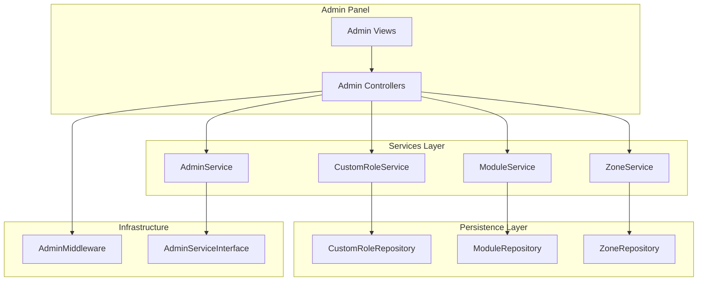
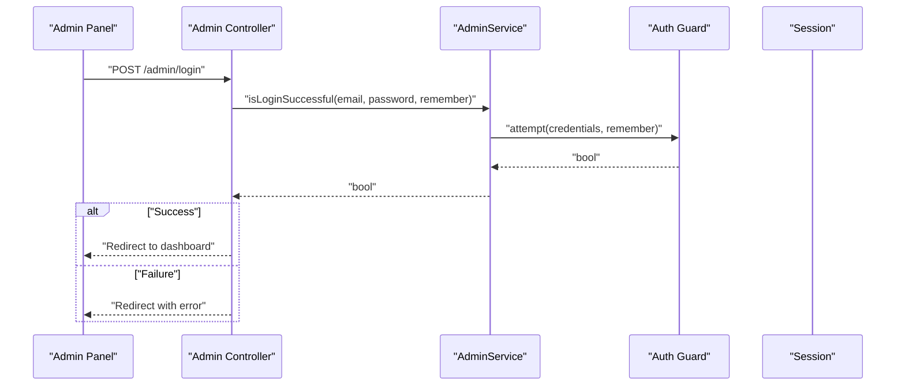
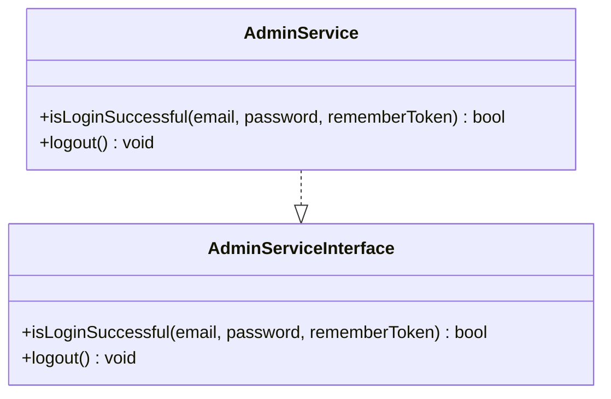
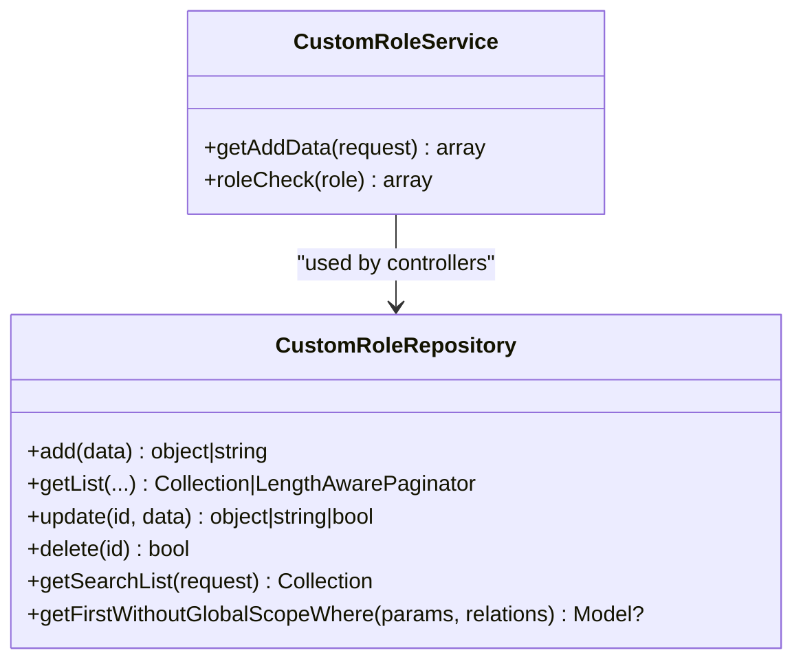
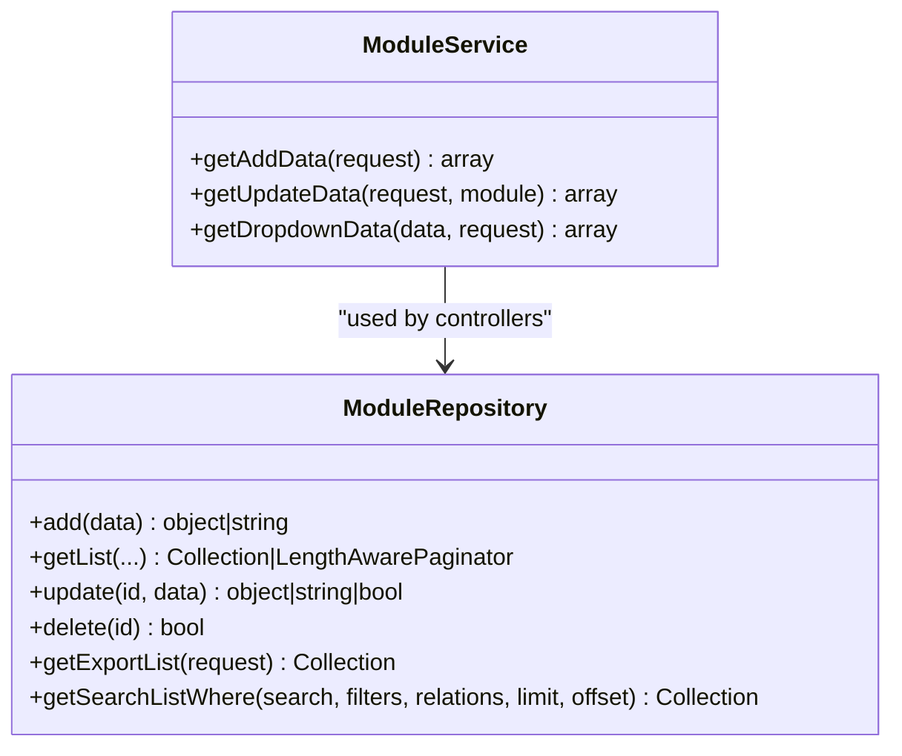
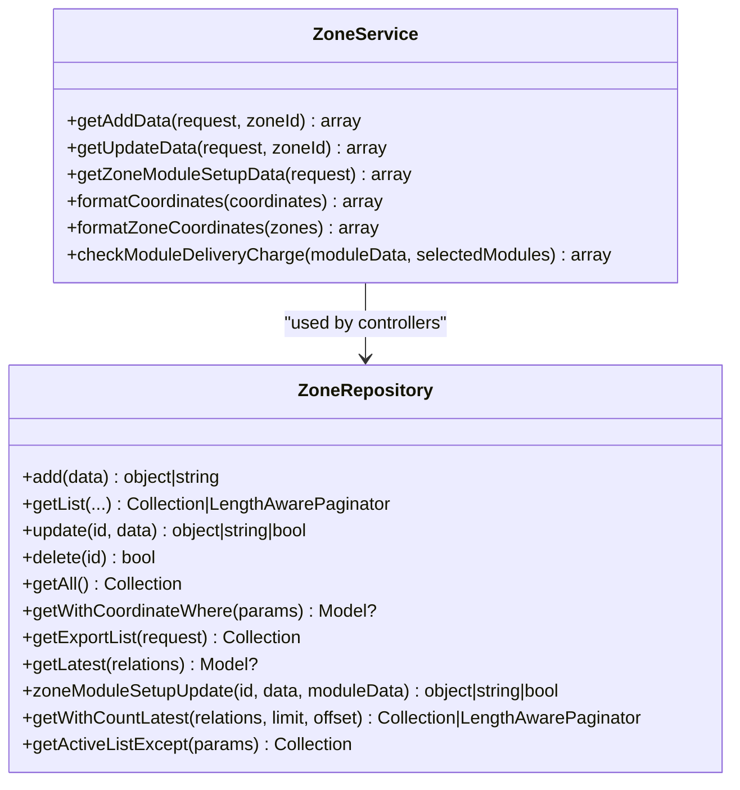
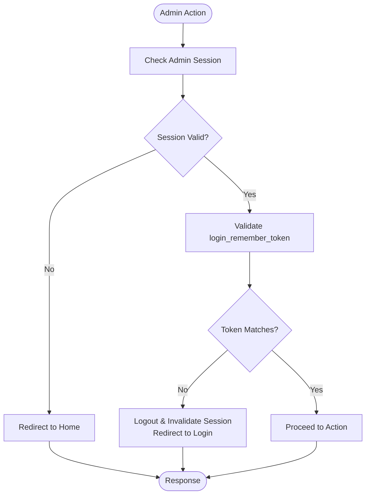
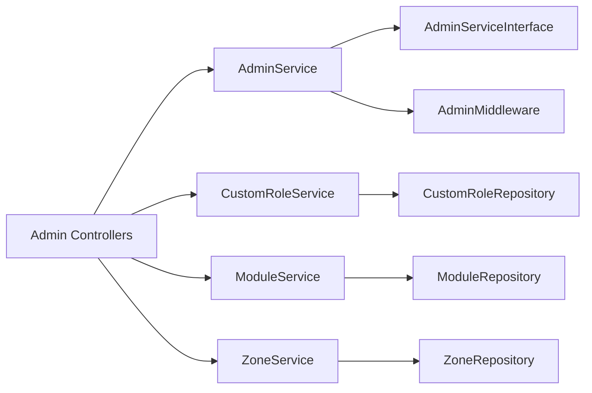

# Admin Services

<cite>
**Referenced Files in This Document**
- [AdminService.php](file://app/Services/AdminService.php)
- [AdminServiceInterface.php](file://app/Contracts/AdminServiceInterface.php)
- [CustomRoleService.php](file://app/Services/CustomRoleService.php)
- [ModuleService.php](file://app/Services/ModuleService.php)
- [ZoneService.php](file://app/Services/ZoneService.php)
- [AdminMiddleware.php](file://app/Http/Middleware/AdminMiddleware.php)
- [CustomRoleRepository.php](file://app/Repositories/CustomRoleRepository.php)
- [ModuleRepository.php](file://app/Repositories/ModuleRepository.php)
- [ZoneRepository.php](file://app/Repositories/ZoneRepository.php)
</cite>

## Table of Contents
1. [Introduction](#introduction)
2. [Project Structure](#project-structure)
3. [Core Components](#core-components)
4. [Architecture Overview](#architecture-overview)
5. [Detailed Component Analysis](#detailed-component-analysis)
6. [Dependency Analysis](#dependency-analysis)
7. [Performance Considerations](#performance-considerations)
8. [Troubleshooting Guide](#troubleshooting-guide)
9. [Conclusion](#conclusion)

## Introduction
This document explains the admin services layer responsible for administrative operations within the platform. It focuses on four core services:
- AdminService: Handles admin login/logout and session lifecycle
- CustomRoleService: Manages administrative role creation and validation
- ModuleService: Provides module configuration and image handling
- ZoneService: Manages geographic zones, coordinate parsing, and delivery charge validation

It also documents how these services integrate with repositories, middleware, and the admin panel interface, including data transformation and response formatting patterns.

## Project Structure
The admin services layer follows a layered architecture:
- Services: Encapsulate business logic for admin operations
- Repositories: Handle persistence and data retrieval
- Middleware: Enforce admin session and security policies
- Contracts: Define service interfaces for type safety

**Diagram sources**
- [AdminService.php:1-23](file://app/Services/AdminService.php#L1-L23)
- [CustomRoleService.php:1-32](file://app/Services/CustomRoleService.php#L1-L32)
- [ModuleService.php:1-54](file://app/Services/ModuleService.php#L1-L54)
- [ZoneService.php:1-126](file://app/Services/ZoneService.php#L1-L126)
- [AdminMiddleware.php:1-47](file://app/Http/Middleware/AdminMiddleware.php#L1-L47)
- [AdminServiceInterface.php:1-11](file://app/Contracts/AdminServiceInterface.php#L1-L11)
- [CustomRoleRepository.php:1-87](file://app/Repositories/CustomRoleRepository.php#L1-L87)
- [ModuleRepository.php:1-113](file://app/Repositories/ModuleRepository.php#L1-L113)
- [ZoneRepository.php:1-129](file://app/Repositories/ZoneRepository.php#L1-L129)

**Section sources**
- [AdminService.php:1-23](file://app/Services/AdminService.php#L1-L23)
- [AdminServiceInterface.php:1-11](file://app/Contracts/AdminServiceInterface.php#L1-L11)
- [CustomRoleService.php:1-32](file://app/Services/CustomRoleService.php#L1-L32)
- [ModuleService.php:1-54](file://app/Services/ModuleService.php#L1-L54)
- [ZoneService.php:1-126](file://app/Services/ZoneService.php#L1-L126)
- [AdminMiddleware.php:1-47](file://app/Http/Middleware/AdminMiddleware.php#L1-L47)
- [CustomRoleRepository.php:1-87](file://app/Repositories/CustomRoleRepository.php#L1-L87)
- [ModuleRepository.php:1-113](file://app/Repositories/ModuleRepository.php#L1-L113)
- [ZoneRepository.php:1-129](file://app/Repositories/ZoneRepository.php#L1-L129)

## Core Components
This section outlines the responsibilities and key methods of each service.

- AdminService
  - Purpose: Authenticate admin users and manage logout
  - Methods:
    - isLoginSuccessful(email, password, rememberToken): bool
    - logout(): void
  - Integration: Implements AdminServiceInterface; integrates with Laravel auth('admin')

- CustomRoleService
  - Purpose: Prepare role data for creation and validate role eligibility
  - Methods:
    - getAddData(request): array
    - roleCheck(roleId): array

- ModuleService
  - Purpose: Prepare module data for creation/update and format dropdown lists
  - Methods:
    - getAddData(request): array
    - getUpdateData(request, module): array
    - getDropdownData(data, request): array

- ZoneService
  - Purpose: Parse polygon coordinates, build spatial polygons, and validate delivery charge configurations
  - Methods:
    - getAddData(request, zoneId): array
    - getUpdateData(request, zoneId): array
    - getZoneModuleSetupData(request): array
    - formatCoordinates(coordinates): array
    - formatZoneCoordinates(zones): array
    - checkModuleDeliveryCharge(moduleData, selectedModules): array

**Section sources**
- [AdminService.php:7-22](file://app/Services/AdminService.php#L7-L22)
- [AdminServiceInterface.php:5-10](file://app/Contracts/AdminServiceInterface.php#L5-L10)
- [CustomRoleService.php:10-31](file://app/Services/CustomRoleService.php#L10-L31)
- [ModuleService.php:7-53](file://app/Services/ModuleService.php#L7-L53)
- [ZoneService.php:9-125](file://app/Services/ZoneService.php#L9-L125)

## Architecture Overview
The admin services layer adheres to clean architecture principles:
- Controllers orchestrate requests and delegate to services
- Services encapsulate business logic and transform data
- Repositories handle persistence and queries
- Middleware enforces authentication and session policies

**Diagram sources**
- [AdminService.php:9-15](file://app/Services/AdminService.php#L9-L15)
- [AdminMiddleware.php:20-45](file://app/Http/Middleware/AdminMiddleware.php#L20-L45)

**Section sources**
- [AdminService.php:1-23](file://app/Services/AdminService.php#L1-L23)
- [AdminMiddleware.php:1-47](file://app/Http/Middleware/AdminMiddleware.php#L1-L47)

## Detailed Component Analysis

### AdminService
AdminService implements AdminServiceInterface and manages admin login and logout flows. It validates credentials against the admin guard and handles session invalidation during logout.

**Diagram sources**
- [AdminServiceInterface.php:5-10](file://app/Contracts/AdminServiceInterface.php#L5-L10)
- [AdminService.php:7-22](file://app/Services/AdminService.php#L7-L22)

Key behaviors:
- Login: Uses auth('admin')->attempt with credentials and remember token
- Logout: Logs out the web guard and invalidates session

Integration with middleware:
- AdminMiddleware ensures active sessions and prevents concurrent/logged-out access

**Section sources**
- [AdminService.php:7-22](file://app/Services/AdminService.php#L7-L22)
- [AdminServiceInterface.php:5-10](file://app/Contracts/AdminServiceInterface.php#L5-L10)
- [AdminMiddleware.php:20-45](file://app/Http/Middleware/AdminMiddleware.php#L20-L45)

### CustomRoleService
Handles administrative role creation and checks. It transforms multilingual inputs into persisted data and enforces basic role eligibility rules.

**Diagram sources**
- [CustomRoleService.php:10-31](file://app/Services/CustomRoleService.php#L10-L31)
- [CustomRoleRepository.php:12-86](file://app/Repositories/CustomRoleRepository.php#L12-L86)

CRUD-related methods:
- Creation: getAddData(request) prepares name, modules JSON, and status
- Validation: roleCheck(roleId) returns authorized/unauthorized flag

Integration with repositories:
- Controllers call CustomRoleRepository for persistence operations

**Section sources**
- [CustomRoleService.php:10-31](file://app/Services/CustomRoleService.php#L10-L31)
- [CustomRoleRepository.php:18-69](file://app/Repositories/CustomRoleRepository.php#L18-L69)

### ModuleService
Provides module configuration handling, including icon/thumbnail uploads and dropdown formatting.

**Diagram sources**
- [ModuleService.php:7-53](file://app/Services/ModuleService.php#L7-L53)
- [ModuleRepository.php:14-112](file://app/Repositories/ModuleRepository.php#L14-L112)

CRUD-related methods:
- Creation: getAddData(request) builds module_name, icon, thumbnail, module_type, theme_id, description
- Update: getUpdateData(request, module) conditionally updates media and sets all_zone_service flag
- Dropdown: getDropdownData(data, request) formats items for select inputs

Integration with repositories:
- Controllers persist via ModuleRepository

**Section sources**
- [ModuleService.php:11-51](file://app/Services/ModuleService.php#L11-L51)
- [ModuleRepository.php:20-78](file://app/Repositories/ModuleRepository.php#L20-L78)

### ZoneService
Manages geographic zones, including coordinate parsing, spatial polygon construction, and delivery charge validations.

**Diagram sources**
- [ZoneService.php:9-125](file://app/Services/ZoneService.php#L9-L125)
- [ZoneRepository.php:12-128](file://app/Repositories/ZoneRepository.php#L12-L128)

CRUD-related methods:
- Creation: getAddData(request, zoneId) parses coordinates into a Polygon and sets topics
- Update: getUpdateData(request, zoneId) rebuilds coordinates and topics
- Module setup: getZoneModuleSetupData(request) normalizes payment and fee flags
- Formatting: formatCoordinates and formatZoneCoordinates convert between internal and UI formats
- Validation: checkModuleDeliveryCharge validates fixed/distance-based shipping rules

Integration with repositories:
- Controllers persist via ZoneRepository and manage module relationships

**Section sources**
- [ZoneService.php:12-123](file://app/Services/ZoneService.php#L12-L123)
- [ZoneRepository.php:18-117](file://app/Repositories/ZoneRepository.php#L18-L117)

### Administrative Workflows and Permission Validation
- Login/Logout: AdminService handles authentication and session termination
- Session Management: AdminMiddleware enforces logged-in state and validates login_remember_token
- Role Eligibility: CustomRoleService provides roleCheck to prevent unauthorized role actions

**Diagram sources**
- [AdminMiddleware.php:20-45](file://app/Http/Middleware/AdminMiddleware.php#L20-L45)
- [AdminService.php:17-21](file://app/Services/AdminService.php#L17-L21)

**Section sources**
- [AdminMiddleware.php:20-45](file://app/Http/Middleware/AdminMiddleware.php#L20-L45)
- [AdminService.php:9-21](file://app/Services/AdminService.php#L9-L21)

### Data Transformation and Response Formatting
- Multilingual Name Extraction: CustomRoleService and ModuleService extract default language values for name/description
- Media Uploads: ModuleService uses FileManagerTrait to upload/update icon/thumbnail
- Coordinate Parsing: ZoneService converts string coordinates into spatial Polygon objects
- Dropdown Formatting: ModuleService formats repository results for select inputs
- Delivery Charge Validation: ZoneService validates module-specific shipping configurations

**Section sources**
- [CustomRoleService.php:13-20](file://app/Services/CustomRoleService.php#L13-L20)
- [ModuleService.php:11-32](file://app/Services/ModuleService.php#L11-L32)
- [ZoneService.php:12-61](file://app/Services/ZoneService.php#L12-L61)
- [ZoneService.php:74-123](file://app/Services/ZoneService.php#L74-L123)

## Dependency Analysis
The services depend on repositories for persistence and on middleware for session enforcement. AdminService depends on the AdminServiceInterface contract.

**Diagram sources**
- [AdminService.php:5-7](file://app/Services/AdminService.php#L5-L7)
- [AdminServiceInterface.php:5-10](file://app/Contracts/AdminServiceInterface.php#L5-L10)
- [AdminMiddleware.php:20-45](file://app/Http/Middleware/AdminMiddleware.php#L20-L45)
- [CustomRoleService.php:10-31](file://app/Services/CustomRoleService.php#L10-L31)
- [ModuleService.php:7-53](file://app/Services/ModuleService.php#L7-L53)
- [ZoneService.php:9-125](file://app/Services/ZoneService.php#L9-L125)

**Section sources**
- [AdminService.php:5-7](file://app/Services/AdminService.php#L5-L7)
- [AdminServiceInterface.php:5-10](file://app/Contracts/AdminServiceInterface.php#L5-L10)
- [AdminMiddleware.php:20-45](file://app/Http/Middleware/AdminMiddleware.php#L20-L45)
- [CustomRoleService.php:10-31](file://app/Services/CustomRoleService.php#L10-L31)
- [ModuleService.php:7-53](file://app/Services/ModuleService.php#L7-L53)
- [ZoneService.php:9-125](file://app/Services/ZoneService.php#L9-L125)

## Performance Considerations
- Minimize database round-trips by batching repository calls in controllers
- Use pagination for large lists (already implemented in repositories)
- Avoid heavy transformations in tight loops; precompute where possible
- Leverage repository scopes to filter data early

## Troubleshooting Guide
Common issues and resolutions:
- Authentication failures
  - Verify credentials and remember token handling in AdminService
  - Confirm middleware redirects unauthenticated users appropriately
- Session expiration
  - AdminMiddleware logs out users with mismatched tokens and invalidates sessions
- Role management errors
  - roleCheck prevents forbidden roles; ensure roleId != 1 for employee roles
- Module upload failures
  - Check FileManagerTrait usage and file permissions
- Zone coordinate parsing errors
  - Validate coordinate string format and ensure closed polygon rings

**Section sources**
- [AdminService.php:9-21](file://app/Services/AdminService.php#L9-L21)
- [AdminMiddleware.php:20-45](file://app/Http/Middleware/AdminMiddleware.php#L20-L45)
- [CustomRoleService.php:22-29](file://app/Services/CustomRoleService.php#L22-L29)
- [ModuleService.php:11-32](file://app/Services/ModuleService.php#L11-L32)
- [ZoneService.php:12-61](file://app/Services/ZoneService.php#L12-L61)

## Conclusion
The admin services layer provides a clean separation of concerns for administrative operations. Services encapsulate business logic, repositories handle persistence, and middleware enforces session security. Together, they support robust CRUD workflows for roles, modules, and zones while ensuring secure and reliable admin panel interactions.