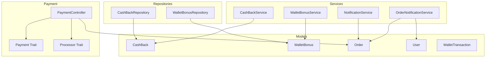
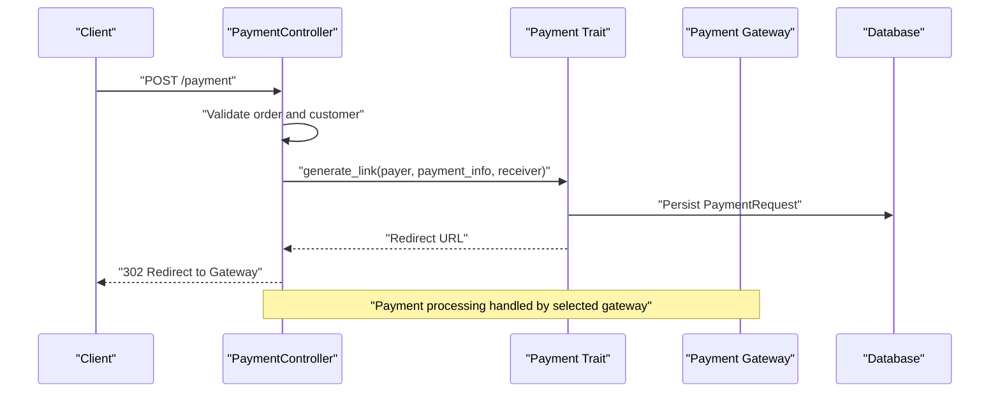
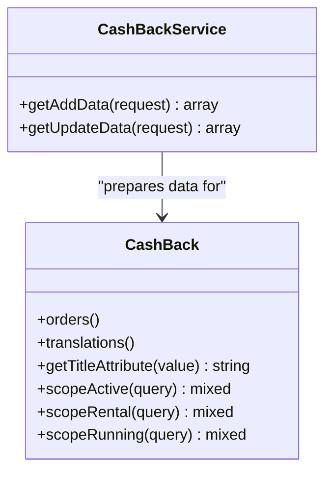
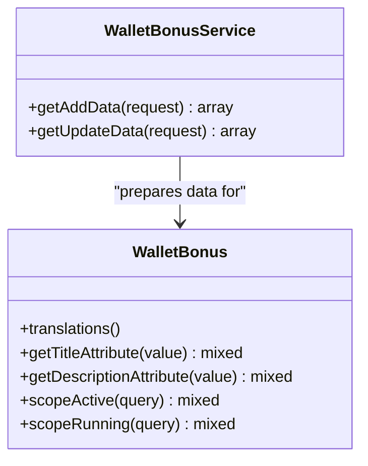
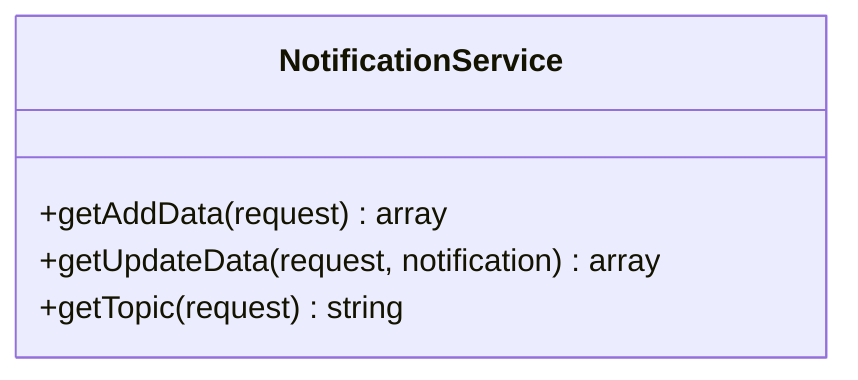
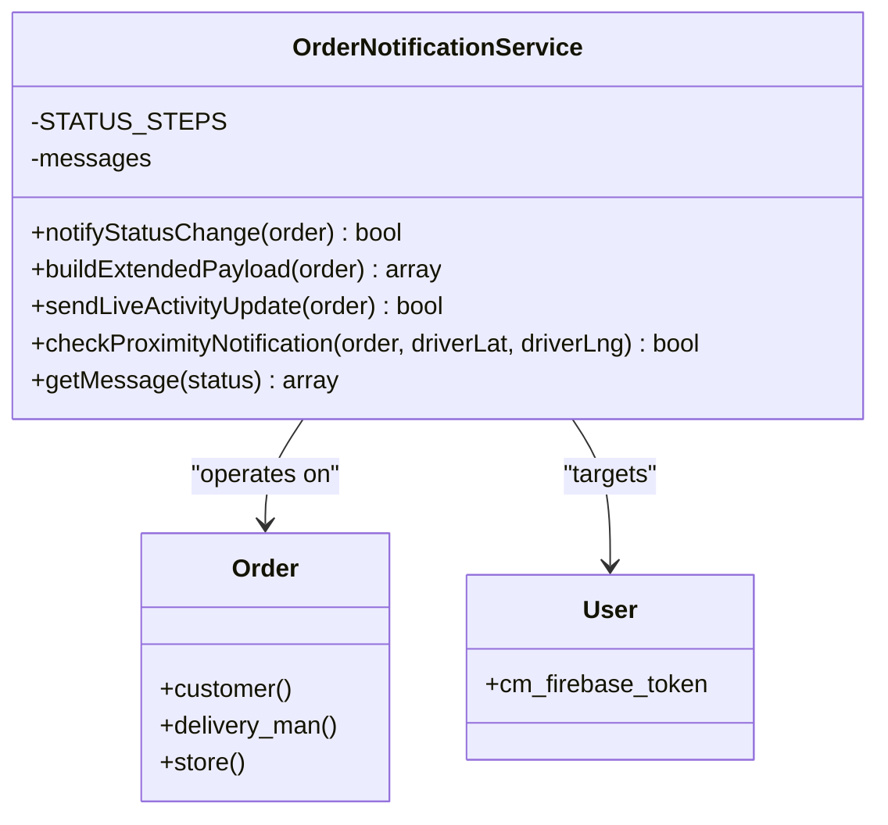
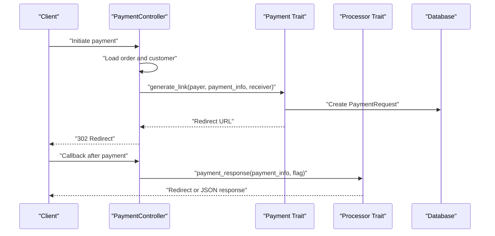
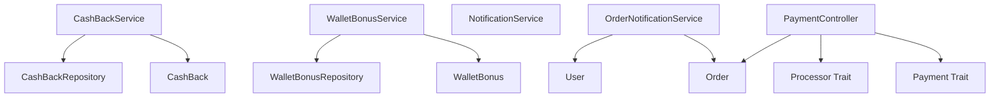

# Financial and Wallet Services

<cite>
**Referenced Files in This Document**
- [CashBackService.php](file://app/Services/CashBackService.php)
- [WalletBonusService.php](file://app/Services/WalletBonusService.php)
- [NotificationService.php](file://app/Services/NotificationService.php)
- [OrderNotificationService.php](file://app/Services/OrderNotificationService.php)
- [CashBack.php](file://app/Models/CashBack.php)
- [WalletBonus.php](file://app/Models/WalletBonus.php)
- [CashBackRepository.php](file://app/Repositories/CashBackRepository.php)
- [WalletBonusRepository.php](file://app/Repositories/WalletBonusRepository.php)
- [Payment.php](file://app/Traits/Payment.php)
- [Processor.php](file://app/Traits/Processor.php)
- [PaymentController.php](file://app/Http/Controllers/PaymentController.php)
- [Order.php](file://app/Models/Order.php)
- [User.php](file://app/Models/User.php)
- [WalletTransaction.php](file://app/Models/WalletTransaction.php)
</cite>

## Table of Contents
1. [Introduction](#introduction)
2. [Project Structure](#project-structure)
3. [Core Components](#core-components)
4. [Architecture Overview](#architecture-overview)
5. [Detailed Component Analysis](#detailed-component-analysis)
6. [Dependency Analysis](#dependency-analysis)
7. [Performance Considerations](#performance-considerations)
8. [Troubleshooting Guide](#troubleshooting-guide)
9. [Conclusion](#conclusion)

## Introduction
This document provides comprehensive documentation for financial and wallet services within the system. It focuses on four key services:
- CashBackService: Handles cashback creation and updates with localized data preparation.
- WalletBonusService: Manages bonus configurations for wallet top-ups with validation and defaults.
- NotificationService: Prepares notification metadata and determines push topics for targeted delivery.
- OrderNotificationService: Sends order-specific push notifications, manages status progression, proximity alerts, and Live Activity updates.

Additionally, it explains how financial transactions integrate with payment systems, including payment request generation, gateway routing, and response handling.

## Project Structure
The financial and wallet services are organized under the Services namespace with supporting models and repositories. Payment processing is handled via traits and controllers, while order and user models provide the domain context for notifications and financial operations.

**Diagram sources**
- [CashBackService.php:1-39](file://app/Services/CashBackService.php#L1-L39)
- [WalletBonusService.php:1-36](file://app/Services/WalletBonusService.php#L1-L36)
- [NotificationService.php:1-64](file://app/Services/NotificationService.php#L1-L64)
- [OrderNotificationService.php:1-312](file://app/Services/OrderNotificationService.php#L1-L312)
- [CashBack.php:1-84](file://app/Models/CashBack.php#L1-L84)
- [WalletBonus.php:1-137](file://app/Models/WalletBonus.php#L1-L137)
- [CashBackRepository.php:1-81](file://app/Repositories/CashBackRepository.php#L1-L81)
- [WalletBonusRepository.php:1-76](file://app/Repositories/WalletBonusRepository.php#L1-L76)
- [Payment.php:1-84](file://app/Traits/Payment.php#L1-L84)
- [Processor.php:1-97](file://app/Traits/Processor.php#L1-L97)
- [PaymentController.php:1-160](file://app/Http/Controllers/PaymentController.php#L1-L160)
- [Order.php:1-358](file://app/Models/Order.php#L1-L358)
- [User.php:1-279](file://app/Models/User.php#L1-L279)
- [WalletTransaction.php:1-29](file://app/Models/WalletTransaction.php#L1-L29)

**Section sources**
- [CashBackService.php:1-39](file://app/Services/CashBackService.php#L1-L39)
- [WalletBonusService.php:1-36](file://app/Services/WalletBonusService.php#L1-L36)
- [NotificationService.php:1-64](file://app/Services/NotificationService.php#L1-L64)
- [OrderNotificationService.php:1-312](file://app/Services/OrderNotificationService.php#L1-L312)
- [CashBack.php:1-84](file://app/Models/CashBack.php#L1-L84)
- [WalletBonus.php:1-137](file://app/Models/WalletBonus.php#L1-L137)
- [CashBackRepository.php:1-81](file://app/Repositories/CashBackRepository.php#L1-L81)
- [WalletBonusRepository.php:1-76](file://app/Repositories/WalletBonusRepository.php#L1-L76)
- [Payment.php:1-84](file://app/Traits/Payment.php#L1-L84)
- [Processor.php:1-97](file://app/Traits/Processor.php#L1-L97)
- [PaymentController.php:1-160](file://app/Http/Controllers/PaymentController.php#L1-L160)
- [Order.php:1-358](file://app/Models/Order.php#L1-L358)
- [User.php:1-279](file://app/Models/User.php#L1-L279)
- [WalletTransaction.php:1-29](file://app/Models/WalletTransaction.php#L1-L29)

## Core Components
This section outlines the primary responsibilities and methods of each service and model involved in financial and wallet operations.

- CashBackService
  - Purpose: Prepare cashback data for creation/update, including localized title extraction and JSON encoding of customer filters.
  - Key methods:
    - getAddData(request): Returns normalized cashback creation payload.
    - getUpdateData(request): Returns normalized cashback update payload.

- WalletBonusService
  - Purpose: Prepare wallet bonus data for creation/update, including localized title/description extraction and default status assignment.
  - Key methods:
    - getAddData(request): Returns normalized bonus creation payload with defaults.
    - getUpdateData(request): Returns normalized bonus update payload.

- NotificationService
  - Purpose: Normalize notification metadata, manage image uploads, and compute push topic names based on target audience and zone.
  - Key methods:
    - getAddData(request): Builds add payload with optional image upload.
    - getUpdateData(request, notification): Builds update payload with optional image replacement.
    - getTopic(request): Computes topic name for push notifications.

- OrderNotificationService
  - Purpose: Send order status change notifications, compute extended payload for UI updates, handle proximity alerts, and push Live Activity updates.
  - Key methods:
    - notifyStatusChange(order): Sends push notification for status changes.
    - buildExtendedPayload(order): Builds rich payload fields for clients.
    - sendLiveActivityUpdate(order): Updates iOS Live Activity if token exists.
    - checkProximityNotification(order, driverLat, driverLng): Triggers nearby notification when driver approaches.
    - getMessage(status): Retrieves predefined message for a given status.

- Supporting Models and Repositories
  - CashBack: Defines casts, scopes, and relationships for cashback records.
  - WalletBonus: Defines casts, scopes, and translation accessors for bonus records.
  - CashBackRepository: CRUD operations and search for cashback records.
  - WalletBonusRepository: CRUD operations and search for wallet bonus records.
  - Order: Provides order metadata, relationships, and computed URLs.
  - User: Provides user metadata, relationships, and profile URL helpers.
  - WalletTransaction: Defines wallet transaction record structure and user relationship.

**Section sources**
- [CashBackService.php:6-36](file://app/Services/CashBackService.php#L6-L36)
- [WalletBonusService.php:6-33](file://app/Services/WalletBonusService.php#L6-L33)
- [NotificationService.php:11-60](file://app/Services/NotificationService.php#L11-L60)
- [OrderNotificationService.php:86-310](file://app/Services/OrderNotificationService.php#L86-L310)
- [CashBack.php:13-82](file://app/Models/CashBack.php#L13-L82)
- [WalletBonus.php:37-135](file://app/Models/WalletBonus.php#L37-L135)
- [CashBackRepository.php:17-80](file://app/Repositories/CashBackRepository.php#L17-L80)
- [WalletBonusRepository.php:17-75](file://app/Repositories/WalletBonusRepository.php#L17-L75)
- [Order.php:17-200](file://app/Models/Order.php#L17-L200)
- [User.php:29-130](file://app/Models/User.php#L29-L130)
- [WalletTransaction.php:14-28](file://app/Models/WalletTransaction.php#L14-L28)

## Architecture Overview
The financial and wallet services integrate with payment processing and notification infrastructure. Payment requests are generated and routed to appropriate gateways, while notifications are dispatched based on order status and proximity events.

**Diagram sources**
- [PaymentController.php:41-131](file://app/Http/Controllers/PaymentController.php#L41-L131)
- [Payment.php:12-82](file://app/Traits/Payment.php#L12-L82)

**Section sources**
- [PaymentController.php:41-131](file://app/Http/Controllers/PaymentController.php#L41-L131)
- [Payment.php:12-82](file://app/Traits/Payment.php#L12-L82)

## Detailed Component Analysis

### CashBackService Analysis
CashBackService prepares structured data for cashback entities, ensuring localized titles and proper defaults for optional fields.

**Diagram sources**
- [CashBackService.php:6-36](file://app/Services/CashBackService.php#L6-L36)
- [CashBack.php:24-82](file://app/Models/CashBack.php#L24-L82)

**Section sources**
- [CashBackService.php:6-36](file://app/Services/CashBackService.php#L6-L36)
- [CashBack.php:24-82](file://app/Models/CashBack.php#L24-L82)

### WalletBonusService Analysis
WalletBonusService handles bonus configuration data normalization, including localized title and description extraction and default status assignment.

**Diagram sources**
- [WalletBonusService.php:6-33](file://app/Services/WalletBonusService.php#L6-L33)
- [WalletBonus.php:64-135](file://app/Models/WalletBonus.php#L64-L135)

**Section sources**
- [WalletBonusService.php:6-33](file://app/Services/WalletBonusService.php#L6-L33)
- [WalletBonus.php:64-135](file://app/Models/WalletBonus.php#L64-L135)

### NotificationService Analysis
NotificationService manages notification metadata, image handling, and topic computation for push delivery.

**Diagram sources**
- [NotificationService.php:11-60](file://app/Services/NotificationService.php#L11-L60)

**Section sources**
- [NotificationService.php:11-60](file://app/Services/NotificationService.php#L11-L60)

### OrderNotificationService Analysis
OrderNotificationService orchestrates order-specific notifications, status progression, proximity alerts, and Live Activity updates.

**Diagram sources**
- [OrderNotificationService.php:14-311](file://app/Services/OrderNotificationService.php#L14-L311)
- [Order.php:133-151](file://app/Models/Order.php#L133-L151)
- [User.php:39-40](file://app/Models/User.php#L39-L40)

**Section sources**
- [OrderNotificationService.php:86-310](file://app/Services/OrderNotificationService.php#L86-L310)
- [Order.php:133-151](file://app/Models/Order.php#L133-L151)
- [User.php:39-40](file://app/Models/User.php#L39-L40)

### Payment Integration Flow
Payment processing integrates with payment traits and controllers to generate payment links and handle responses.

**Diagram sources**
- [PaymentController.php:41-157](file://app/Http/Controllers/PaymentController.php#L41-L157)
- [Payment.php:12-82](file://app/Traits/Payment.php#L12-L82)
- [Processor.php:87-95](file://app/Traits/Processor.php#L87-L95)

**Section sources**
- [PaymentController.php:41-157](file://app/Http/Controllers/PaymentController.php#L41-L157)
- [Payment.php:12-82](file://app/Traits/Payment.php#L12-L82)
- [Processor.php:87-95](file://app/Traits/Processor.php#L87-L95)

### Financial Transaction Processing Examples
- Payment Request Generation
  - Use PaymentController to prepare payment details and generate a redirect link via Payment trait.
  - The controller validates order ownership, constructs payer/receiver information, and persists a PaymentRequest.
  - See [PaymentController.php:41-131](file://app/Http/Controllers/PaymentController.php#L41-L131) and [Payment.php:12-82](file://app/Traits/Payment.php#L12-L82).

- Notification Routing
  - NotificationService computes topic names based on target type and zone selection.
  - Use getTopic(request) to determine the correct push topic for broadcast or zone-specific delivery.
  - See [NotificationService.php:45-60](file://app/Services/NotificationService.php#L45-L60).

- Order-Specific Alerts
  - OrderNotificationService sends push notifications for status changes and proximity events.
  - Extended payload fields enable clients to update UI without additional API calls.
  - See [OrderNotificationService.php:86-172](file://app/Services/OrderNotificationService.php#L86-L172) and [OrderNotificationService.php:252-283](file://app/Services/OrderNotificationService.php#L252-L283).

**Section sources**
- [PaymentController.php:41-131](file://app/Http/Controllers/PaymentController.php#L41-L131)
- [Payment.php:12-82](file://app/Traits/Payment.php#L12-L82)
- [NotificationService.php:45-60](file://app/Services/NotificationService.php#L45-L60)
- [OrderNotificationService.php:86-172](file://app/Services/OrderNotificationService.php#L86-L172)
- [OrderNotificationService.php:252-283](file://app/Services/OrderNotificationService.php#L252-L283)

## Dependency Analysis
The services depend on models and repositories for persistence and on traits for payment and processor utilities. OrderNotificationService relies on Order and User models for recipient targeting and Live Activity updates.

**Diagram sources**
- [CashBackService.php:1-39](file://app/Services/CashBackService.php#L1-L39)
- [CashBackRepository.php:1-81](file://app/Repositories/CashBackRepository.php#L1-L81)
- [CashBack.php:1-84](file://app/Models/CashBack.php#L1-L84)
- [WalletBonusService.php:1-36](file://app/Services/WalletBonusService.php#L1-L36)
- [WalletBonusRepository.php:1-76](file://app/Repositories/WalletBonusRepository.php#L1-L76)
- [WalletBonus.php:1-137](file://app/Models/WalletBonus.php#L1-L137)
- [NotificationService.php:1-64](file://app/Services/NotificationService.php#L1-L64)
- [OrderNotificationService.php:1-312](file://app/Services/OrderNotificationService.php#L1-L312)
- [Order.php:1-358](file://app/Models/Order.php#L1-L358)
- [User.php:1-279](file://app/Models/User.php#L1-L279)
- [PaymentController.php:1-160](file://app/Http/Controllers/PaymentController.php#L1-L160)
- [Payment.php:1-84](file://app/Traits/Payment.php#L1-L84)
- [Processor.php:1-97](file://app/Traits/Processor.php#L1-L97)

**Section sources**
- [CashBackService.php:1-39](file://app/Services/CashBackService.php#L1-L39)
- [CashBackRepository.php:1-81](file://app/Repositories/CashBackRepository.php#L1-L81)
- [CashBack.php:1-84](file://app/Models/CashBack.php#L1-L84)
- [WalletBonusService.php:1-36](file://app/Services/WalletBonusService.php#L1-L36)
- [WalletBonusRepository.php:1-76](file://app/Repositories/WalletBonusRepository.php#L1-L76)
- [WalletBonus.php:1-137](file://app/Models/WalletBonus.php#L1-L137)
- [NotificationService.php:1-64](file://app/Services/NotificationService.php#L1-L64)
- [OrderNotificationService.php:1-312](file://app/Services/OrderNotificationService.php#L1-L312)
- [Order.php:1-358](file://app/Models/Order.php#L1-L358)
- [User.php:1-279](file://app/Models/User.php#L1-L279)
- [PaymentController.php:1-160](file://app/Http/Controllers/PaymentController.php#L1-L160)
- [Payment.php:1-84](file://app/Traits/Payment.php#L1-L84)
- [Processor.php:1-97](file://app/Traits/Processor.php#L1-L97)

## Performance Considerations
- Minimize N+1 queries: OrderNotificationService loads related entities (store, delivery_man) only when needed to avoid unnecessary joins.
- Efficient payload building: Extended payload fields are cast to strings to meet FCM data requirements and reduce client-side parsing overhead.
- Image handling: NotificationService leverages FileManagerTrait to upload and replace images efficiently, avoiding redundant storage operations.
- Pagination and filtering: Repositories use pagination and targeted where clauses to limit result sets during listing operations.

[No sources needed since this section provides general guidance]

## Troubleshooting Guide
- Payment Link Generation Failures
  - Verify payment method availability in route mapping and ensure PaymentRequest is persisted successfully.
  - Check for invalid amounts or missing additional data arrays.
  - See [Payment.php:14-20](file://app/Traits/Payment.php#L14-L20) and [Payment.php:77-82](file://app/Traits/Payment.php#L77-L82).

- Notification Dispatch Issues
  - Confirm user has a valid cm_firebase_token before sending push notifications.
  - Validate topic computation for target and zone selection.
  - See [OrderNotificationService.php:97-99](file://app/Services/OrderNotificationService.php#L97-L99) and [NotificationService.php:59-60](file://app/Services/NotificationService.php#L59-L60).

- Proximity Notifications Not Triggered
  - Ensure order status is picked_up and sub_status is not already nearby or arrived.
  - Verify delivery address coordinates are present and valid.
  - See [OrderNotificationService.php:254-263](file://app/Services/OrderNotificationService.php#L254-L263).

**Section sources**
- [Payment.php:14-20](file://app/Traits/Payment.php#L14-L20)
- [Payment.php:77-82](file://app/Traits/Payment.php#L77-L82)
- [OrderNotificationService.php:97-99](file://app/Services/OrderNotificationService.php#L97-L99)
- [NotificationService.php:59-60](file://app/Services/NotificationService.php#L59-L60)
- [OrderNotificationService.php:254-263](file://app/Services/OrderNotificationService.php#L254-L263)

## Conclusion
The financial and wallet services provide robust mechanisms for cashback and bonus management, notification routing, and order-specific alerting. Payment integration is streamlined through traits and controllers, enabling seamless gateway redirection and response handling. The modular design with models, repositories, and services ensures maintainability and scalability for future enhancements.

[No sources needed since this section summarizes without analyzing specific files]