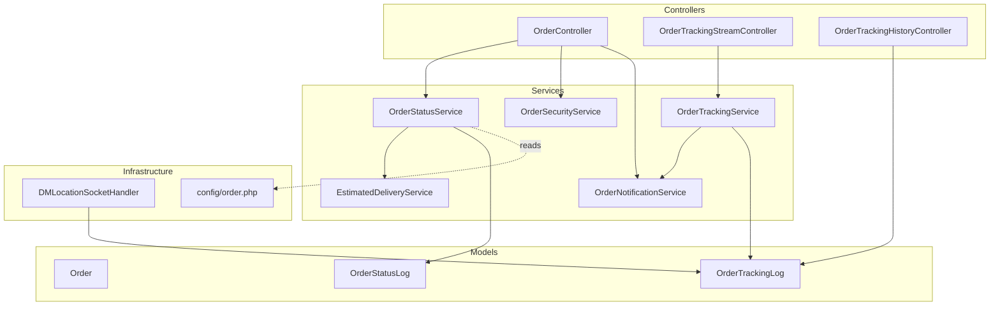
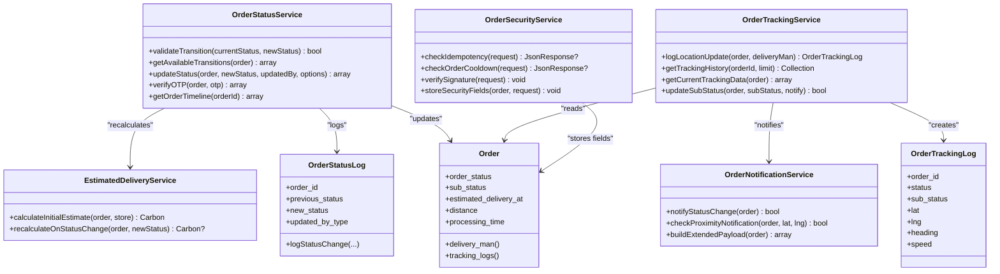
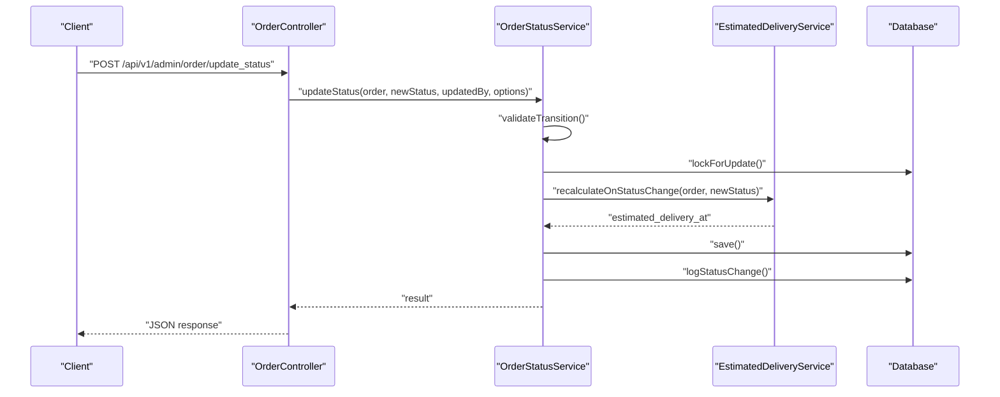
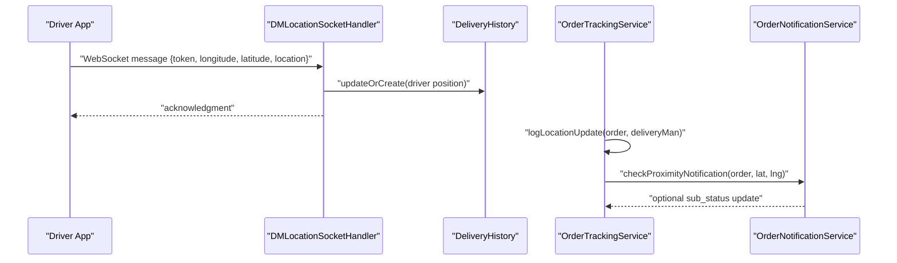
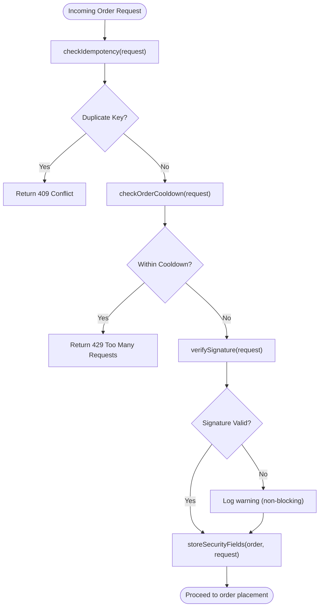
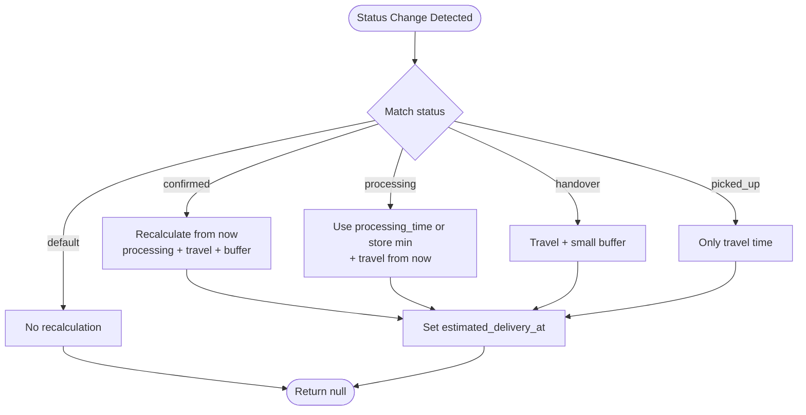
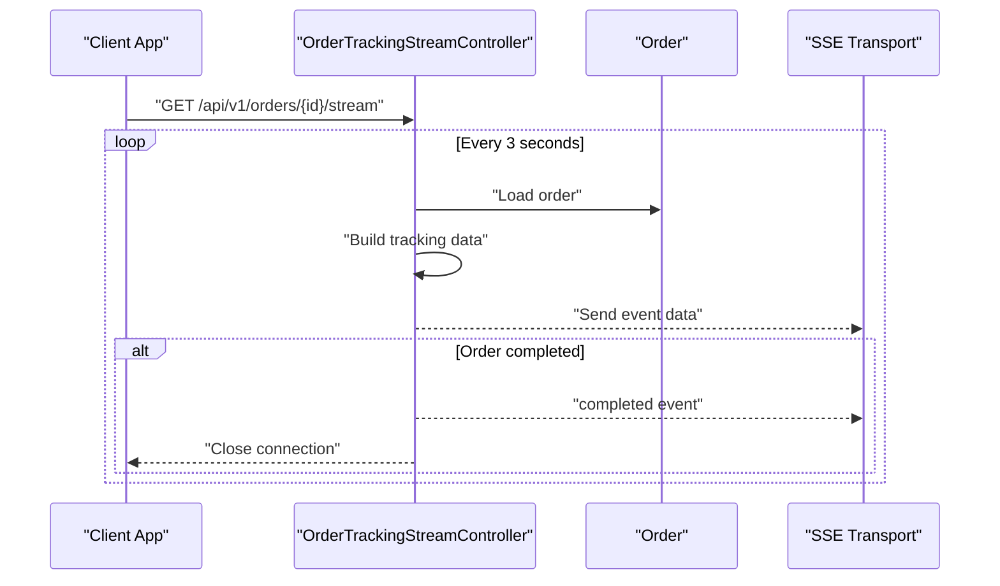
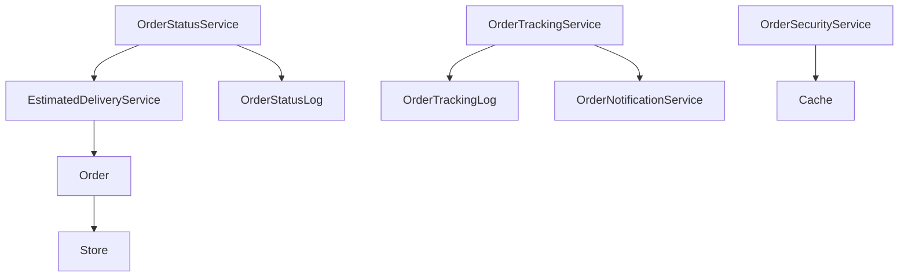

# Order Management Services

<cite>
**Referenced Files in This Document**
- [OrderStatusService.php](file://app/Services/OrderStatusService.php)
- [OrderTrackingService.php](file://app/Services/OrderTrackingService.php)
- [OrderSecurityService.php](file://app/Services/OrderSecurityService.php)
- [EstimatedDeliveryService.php](file://app/Services/EstimatedDeliveryService.php)
- [OrderNotificationService.php](file://app/Services/OrderNotificationService.php)
- [Order.php](file://app/Models/Order.php)
- [OrderStatusLog.php](file://app/Models/OrderStatusLog.php)
- [OrderTrackingLog.php](file://app/Models/OrderTrackingLog.php)
- [order.php](file://config/order.php)
- [DMLocationSocketHandler.php](file://app/WebSockets/Handler/DMLocationSocketHandler.php)
- [OrderController.php](file://app/Http/Controllers/Api/V1/OrderController.php)
- [OrderTrackingStreamController.php](file://app/Http/Controllers/Api/V1/OrderTrackingStreamController.php)
- [OrderTrackingHistoryController.php](file://app/Http/Controllers/Api/V1/OrderTrackingHistoryController.php)
</cite>

## Table of Contents
1. [Introduction](#introduction)
2. [Project Structure](#project-structure)
3. [Core Components](#core-components)
4. [Architecture Overview](#architecture-overview)
5. [Detailed Component Analysis](#detailed-component-analysis)
6. [Dependency Analysis](#dependency-analysis)
7. [Performance Considerations](#performance-considerations)
8. [Troubleshooting Guide](#troubleshooting-guide)
9. [Conclusion](#conclusion)

## Introduction
This document provides comprehensive documentation for the order management services in the system. It focuses on four core services:
- OrderStatusService: centralizes order lifecycle management and status transitions with validation, atomic operations, notifications, and audit logging.
- OrderTrackingService: manages real-time order location updates, sub-status updates, and tracking history retrieval.
- OrderSecurityService: enforces idempotency, cooldowns, and HMAC signature verification to prevent duplicate orders and detect anomalies.
- EstimatedDeliveryService: calculates and recalculates estimated delivery times based on store processing time, distance, and order status.

Additionally, it documents integration points with WebSocket handlers for real-time location updates and with streaming endpoints for live order tracking.

## Project Structure
The order management system is organized around services, models, configuration, and controllers:
- Services encapsulate business logic for status transitions, tracking, security, and delivery estimation.
- Models define the domain entities and relationships (Order, OrderStatusLog, OrderTrackingLog).
- Configuration centralizes order-related settings such as valid status transitions and OTP limits.
- Controllers orchestrate requests and delegate to services for processing.

**Diagram sources**
- [OrderController.php:1-791](file://app/Http/Controllers/Api/V1/OrderController.php#L1-L791)
- [OrderTrackingStreamController.php:1-200](file://app/Http/Controllers/Api/V1/OrderTrackingStreamController.php#L1-L200)
- [OrderTrackingHistoryController.php:1-87](file://app/Http/Controllers/Api/V1/OrderTrackingHistoryController.php#L1-L87)
- [OrderStatusService.php:1-348](file://app/Services/OrderStatusService.php#L1-L348)
- [OrderTrackingService.php:1-124](file://app/Services/OrderTrackingService.php#L1-L124)
- [OrderSecurityService.php:1-137](file://app/Services/OrderSecurityService.php#L1-L137)
- [EstimatedDeliveryService.php:1-172](file://app/Services/EstimatedDeliveryService.php#L1-L172)
- [OrderNotificationService.php:1-312](file://app/Services/OrderNotificationService.php#L1-L312)
- [Order.php:1-358](file://app/Models/Order.php#L1-L358)
- [OrderStatusLog.php:1-112](file://app/Models/OrderStatusLog.php#L1-L112)
- [OrderTrackingLog.php:1-56](file://app/Models/OrderTrackingLog.php#L1-L56)
- [DMLocationSocketHandler.php:1-83](file://app/WebSockets/Handler/DMLocationSocketHandler.php#L1-L83)
- [order.php:1-108](file://config/order.php#L1-L108)

**Section sources**
- [OrderStatusService.php:1-348](file://app/Services/OrderStatusService.php#L1-L348)
- [OrderTrackingService.php:1-124](file://app/Services/OrderTrackingService.php#L1-L124)
- [OrderSecurityService.php:1-137](file://app/Services/OrderSecurityService.php#L1-L137)
- [EstimatedDeliveryService.php:1-172](file://app/Services/EstimatedDeliveryService.php#L1-L172)
- [OrderNotificationService.php:1-312](file://app/Services/OrderNotificationService.php#L1-L312)
- [Order.php:1-358](file://app/Models/Order.php#L1-L358)
- [OrderStatusLog.php:1-112](file://app/Models/OrderStatusLog.php#L1-L112)
- [OrderTrackingLog.php:1-56](file://app/Models/OrderTrackingLog.php#L1-L56)
- [order.php:1-108](file://config/order.php#L1-L108)
- [DMLocationSocketHandler.php:1-83](file://app/WebSockets/Handler/DMLocationSocketHandler.php#L1-L83)
- [OrderController.php:1-791](file://app/Http/Controllers/Api/V1/OrderController.php#L1-L791)
- [OrderTrackingStreamController.php:1-200](file://app/Http/Controllers/Api/V1/OrderTrackingStreamController.php#L1-L200)
- [OrderTrackingHistoryController.php:1-87](file://app/Http/Controllers/Api/V1/OrderTrackingHistoryController.php#L1-L87)

## Core Components
This section outlines the primary responsibilities and methods for each service.

- OrderStatusService
  - Validates status transitions against configured rules.
  - Updates order status atomically, handles special transitions (delivered, canceled, refunded), recalculates estimated delivery time, logs status changes, and sends notifications.
  - Provides OTP verification with rate limiting and timeline retrieval.

- OrderTrackingService
  - Logs driver location updates with order context and triggers proximity notifications.
  - Retrieves tracking history and current tracking data for an order.
  - Updates sub-status and optionally notifies stakeholders.

- OrderSecurityService
  - Enforces idempotency via cache keys to prevent duplicate submissions.
  - Applies cooldown periods per user to avoid rapid successive orders.
  - Verifies HMAC-SHA256 signatures and timestamps for order requests.

- EstimatedDeliveryService
  - Computes initial and recalculation delivery estimates based on processing time, distance, and status-specific buffers.

**Section sources**
- [OrderStatusService.php:26-156](file://app/Services/OrderStatusService.php#L26-L156)
- [OrderTrackingService.php:28-122](file://app/Services/OrderTrackingService.php#L28-L122)
- [OrderSecurityService.php:22-135](file://app/Services/OrderSecurityService.php#L22-L135)
- [EstimatedDeliveryService.php:38-170](file://app/Services/EstimatedDeliveryService.php#L38-L170)

## Architecture Overview
The order management architecture integrates services with models, configuration, and infrastructure components to support robust order lifecycle management, real-time tracking, and security controls.

**Diagram sources**
- [OrderStatusService.php:1-348](file://app/Services/OrderStatusService.php#L1-L348)
- [OrderTrackingService.php:1-124](file://app/Services/OrderTrackingService.php#L1-L124)
- [OrderSecurityService.php:1-137](file://app/Services/OrderSecurityService.php#L1-L137)
- [EstimatedDeliveryService.php:1-172](file://app/Services/EstimatedDeliveryService.php#L1-L172)
- [Order.php:1-358](file://app/Models/Order.php#L1-L358)
- [OrderStatusLog.php:1-112](file://app/Models/OrderStatusLog.php#L1-L112)
- [OrderTrackingLog.php:1-56](file://app/Models/OrderTrackingLog.php#L1-L56)
- [OrderNotificationService.php:1-312](file://app/Services/OrderNotificationService.php#L1-L312)

## Detailed Component Analysis

### OrderStatusService
- Purpose: Centralized order status management with validation, atomic updates, notifications, and audit trails.
- Key methods:
  - validateTransition: Checks if a new status follows a valid transition from the current status.
  - getAvailableTransitions: Returns allowed next statuses for a given order.
  - updateStatus: Performs atomic status update, handles special transitions (delivered, canceled, refunded), recalculates estimated delivery time, logs changes, and sends notifications.
  - verifyOTP: Rate-limited OTP verification using cache.
  - logStatusChange/getOrderTimeline: Auditing and timeline retrieval.

**Diagram sources**
- [OrderStatusService.php:89-156](file://app/Services/OrderStatusService.php#L89-L156)
- [EstimatedDeliveryService.php:60-69](file://app/Services/EstimatedDeliveryService.php#L60-L69)
- [OrderController.php:1-791](file://app/Http/Controllers/Api/V1/OrderController.php#L1-L791)

**Section sources**
- [OrderStatusService.php:26-156](file://app/Services/OrderStatusService.php#L26-L156)
- [OrderStatusLog.php:71-90](file://app/Models/OrderStatusLog.php#L71-L90)

### OrderTrackingService
- Purpose: Real-time order tracking with location logging, proximity notifications, and history retrieval.
- Key methods:
  - logLocationUpdate: Records driver location with order status and sub-status, triggers proximity checks.
  - getTrackingHistory: Paginates recent tracking logs for an order.
  - getCurrentTrackingData: Builds current tracking payload including driver details.
  - updateSubStatus: Updates sub-status and optionally notifies.

**Diagram sources**
- [DMLocationSocketHandler.php:19-43](file://app/WebSockets/Handler/DMLocationSocketHandler.php#L19-L43)
- [OrderTrackingService.php:28-50](file://app/Services/OrderTrackingService.php#L28-L50)
- [OrderNotificationService.php:252-283](file://app/Services/OrderNotificationService.php#L252-L283)

**Section sources**
- [OrderTrackingService.php:28-122](file://app/Services/OrderTrackingService.php#L28-L122)
- [OrderTrackingLog.php:43-54](file://app/Models/OrderTrackingLog.php#L43-L54)
- [OrderNotificationService.php:252-283](file://app/Services/OrderNotificationService.php#L252-L283)
- [DMLocationSocketHandler.php:19-43](file://app/WebSockets/Handler/DMLocationSocketHandler.php#L19-L43)

### OrderSecurityService
- Purpose: Fraud prevention and order integrity enforcement.
- Key methods:
  - checkIdempotency: Prevents duplicate orders using cache-based idempotency keys.
  - checkOrderCooldown: Enforces per-user cooldown to reduce spam.
  - verifySignature: Validates HMAC-SHA256 signatures and timestamps.
  - storeSecurityFields: Persists security-related fields on the order record.

**Diagram sources**
- [OrderSecurityService.php:22-135](file://app/Services/OrderSecurityService.php#L22-L135)

**Section sources**
- [OrderSecurityService.php:22-135](file://app/Services/OrderSecurityService.php#L22-L135)

### EstimatedDeliveryService
- Purpose: Accurate delivery time estimation and recalculation during order lifecycle.
- Key methods:
  - calculateInitialEstimate: Computes initial ETA using schedule time, store processing time, distance, and buffer.
  - recalculateOnStatusChange: Recalculates ETA based on status transitions.
  - Helper methods: getProcessingMinutes, getStoreMinDeliveryTime, getTravelMinutes.

**Diagram sources**
- [EstimatedDeliveryService.php:60-113](file://app/Services/EstimatedDeliveryService.php#L60-L113)

**Section sources**
- [EstimatedDeliveryService.php:38-170](file://app/Services/EstimatedDeliveryService.php#L38-L170)
- [Order.php:48-50](file://app/Models/Order.php#L48-L50)

### Integration with WebSocket and Streaming
- WebSocket handler receives driver location updates, persists them, and acknowledges the client.
- Streaming endpoints provide real-time order tracking updates to clients via Server-Sent Events (SSE) with throttling and access control.

**Diagram sources**
- [OrderTrackingStreamController.php:80-154](file://app/Http/Controllers/Api/V1/OrderTrackingStreamController.php#L80-L154)
- [OrderTrackingHistoryController.php:20-60](file://app/Http/Controllers/Api/V1/OrderTrackingHistoryController.php#L20-L60)
- [Order.php:128-131](file://app/Models/Order.php#L128-L131)

**Section sources**
- [DMLocationSocketHandler.php:19-43](file://app/WebSockets/Handler/DMLocationSocketHandler.php#L19-L43)
- [OrderTrackingStreamController.php:80-154](file://app/Http/Controllers/Api/V1/OrderTrackingStreamController.php#L80-L154)
- [OrderTrackingHistoryController.php:20-60](file://app/Http/Controllers/Api/V1/OrderTrackingHistoryController.php#L20-L60)

## Dependency Analysis
- OrderStatusService depends on:
  - EstimatedDeliveryService for ETA recalculations.
  - OrderNotificationService indirectly via Helpers::send_order_notification.
  - OrderStatusLog for audit trails.
- OrderTrackingService depends on:
  - OrderTrackingLog for persistence.
  - OrderNotificationService for proximity and sub-status notifications.
- OrderSecurityService depends on:
  - Cache for idempotency and cooldown enforcement.
  - Configuration for HMAC secret and thresholds.
- EstimatedDeliveryService depends on:
  - Order model for distance and processing_time.
  - Store model for delivery_time parsing.

**Diagram sources**
- [OrderStatusService.php:10-12](file://app/Services/OrderStatusService.php#L10-L12)
- [EstimatedDeliveryService.php:5-7](file://app/Services/EstimatedDeliveryService.php#L5-L7)
- [OrderTrackingService.php:14-18](file://app/Services/OrderTrackingService.php#L14-L18)
- [OrderSecurityService.php:8-10](file://app/Services/OrderSecurityService.php#L8-L10)
- [Order.php:148-151](file://app/Models/Order.php#L148-L151)

**Section sources**
- [OrderStatusService.php:10-12](file://app/Services/OrderStatusService.php#L10-L12)
- [OrderTrackingService.php:14-18](file://app/Services/OrderTrackingService.php#L14-L18)
- [OrderSecurityService.php:8-10](file://app/Services/OrderSecurityService.php#L8-L10)
- [EstimatedDeliveryService.php:5-7](file://app/Services/EstimatedDeliveryService.php#L5-L7)

## Performance Considerations
- Atomic operations: OrderStatusService uses database transactions and row-level locking to prevent race conditions during status updates.
- Caching: OrderSecurityService leverages cache for idempotency and cooldown checks to minimize database load.
- Efficient queries: OrderTrackingService uses scopes for filtering and ordering tracking logs.
- ETA calculations: EstimatedDeliveryService uses simple arithmetic and minimal branching for fast recalculation.
- Streaming: OrderTrackingStreamController emits events at fixed intervals with throttling to balance responsiveness and resource usage.

[No sources needed since this section provides general guidance]

## Troubleshooting Guide
- Invalid status transition:
  - Symptom: Status update fails with an invalid transition message.
  - Cause: New status not permitted from current status according to configuration.
  - Resolution: Verify order status transitions in configuration and ensure the intended transition is allowed.

- OTP verification failures:
  - Symptom: OTP mismatch with remaining attempts displayed.
  - Cause: Incorrect OTP or exceeding maximum attempts within the decay window.
  - Resolution: Check OTP configuration limits and retry within the allowed timeframe.

- Duplicate order submission:
  - Symptom: 409 Conflict returned for idempotency key.
  - Cause: Same idempotency key submitted again.
  - Resolution: Ensure unique idempotency keys per order attempt.

- Too many requests:
  - Symptom: 429 Too Many Requests.
  - Cause: User placing orders within the cooldown period.
  - Resolution: Wait for the cooldown period to expire before placing another order.

- Tracking not updating:
  - Symptom: No tracking updates or proximity notifications.
  - Cause: Driver location not received via WebSocket or proximity threshold not met.
  - Resolution: Confirm WebSocket connectivity and driver location updates; verify proximity thresholds.

**Section sources**
- [OrderStatusService.php:94-98](file://app/Services/OrderStatusService.php#L94-L98)
- [OrderStatusService.php:275-308](file://app/Services/OrderStatusService.php#L275-L308)
- [OrderSecurityService.php:36-42](file://app/Services/OrderSecurityService.php#L36-L42)
- [OrderSecurityService.php:59-67](file://app/Services/OrderSecurityService.php#L59-L67)
- [OrderNotificationService.php:252-283](file://app/Services/OrderNotificationService.php#L252-L283)
- [DMLocationSocketHandler.php:19-43](file://app/WebSockets/Handler/DMLocationSocketHandler.php#L19-L43)

## Conclusion
The order management services provide a robust, secure, and real-time capable system for handling order lifecycles. OrderStatusService ensures controlled state transitions with auditing and notifications, OrderTrackingService enables precise location tracking and timely updates, OrderSecurityService protects against fraud and abuse, and EstimatedDeliveryService delivers accurate delivery expectations. Together with WebSocket and streaming integrations, the system supports responsive and reliable order experiences across all stakeholders.